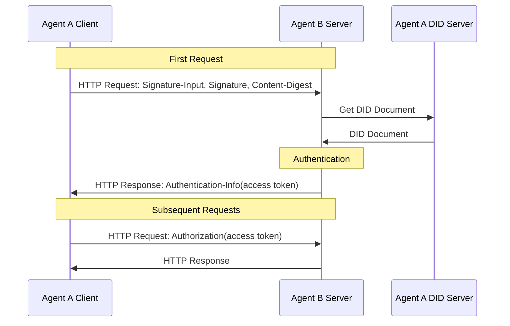
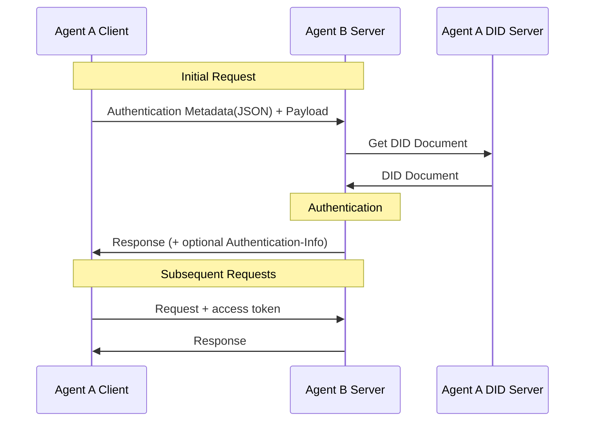

# did:wba Method Specification (V0.2)

## Abstract

The did:wba DID method is a web-based decentralized identifier (DID) specification designed to meet the needs of cross-platform identity authentication and agent communication. This method is extended and optimized based on did:web, named did:wba, to retain its compatibility and enhance its adaptability to agent scenarios.

In this specification, the default scheme of path type did:wba will carry the bound public key fingerprint in the DID path to enhance the binding relationship between the DID and the user's own private key. The current version of the **default profile** is:

- `e1_`: Binds the Ed25519 public key, recommended for new deployments, and can directly integrate the W3C standard Data Integrity EdDSA proof.

In order to be compatible with the wallet ecosystem and existing secp256k1 implementation, this specification defines an additional **non-default compatible extension profile** in Appendix A:

- `k1_`: Binds the secp256k1 public key, mainly used for compatibility with the wallet ecosystem and the existing Web3 key system.

At the same time, we designed a process based on the did:wba method and the HTTP protocol: the request signature is based on the HTTP Message Signatures of [RFC 9421](https://www.rfc-editor.org/rfc/rfc9421), and the message body integrity is based on the `Content-Digest` field of [RFC 9530](https://www.rfc-editor.org/rfc/rfc9530), so that the server can quickly verify the identity of clients on other platforms without increasing the number of interactions.

This specification is also compatible with the native did:web method regarding cross-platform identity authentication, end-to-end encryption, handle and other functions. Please refer to Appendix B for the compatibility solution.

## 1. Introduction

### 1.1 Preface

The did:wba DID method specification complies with the requirements specified in Decentralized Identifiers V1.0 [[DID-CORE](https://www.w3.org/TR/did-core/)].

Based on the did:web method specification, this specification adds specification descriptions such as DID document limitations, cross-platform identity authentication processes, and agent description services, and proposes a new method name did:wba (Web-Based Agent).

Considering that the did:web method specification is still a draft, there may be changes in the future that are not suitable for agent communication scenarios. In addition, we have made some modifications to the specification, and reaching a consensus with the original author on the specification modification is also a long-term process, so we decided to use a new method name.

In the future, we do not rule out the possibility of merging the did:wba specification into the did:web specification, and we will promote the realization of this goal.

The did:web method specification referenced by did:wba is available at [https://w3c-ccg.github.io/did-method-web](https://w3c-ccg.github.io/did-method-web), version dated July 31, 2024. For ease of management, we have also archived the copy of the did:web method specification currently used by did:wba: [did:web Method Specification](/references/did_web-method-specification.html).

### 1.2 Design principles

When designing the did:wba approach, our core principle was to make full use of existing mature technologies and complete Web infrastructure while achieving decentralization. Using did:wba, you can achieve email-like features. Each platform implements its own account system in a centralized manner. At the same time, each platform can be interconnected.

For path-type DIDs, this specification defines "carrying the bound public key fingerprint in the DID path" as the default scheme. The main purpose of this is to allow users to truly control their own private keys, and to form a stable and independently verifiable binding relationship between DID and the public key actually controlled by the user. Even if the platform maintains an escrow service for the DID document, the user or verifier can still verify that it corresponds to the expected public key against the DID itself, thereby reducing the risk of the platform silently replacing the identity public key.

In order to strike a balance between standard interoperability and ecological compatibility, the current version adopts the structure of "**main specification defaults to e1_, compatible extensions support k1_**":

- `e1_`: Binds Ed25519 public key, recommended for new deployments. This profile can be directly integrated with the W3C Data Integrity EdDSA standard and is suitable as the long-term standardization mainline of did:wba.
- `k1_`: Binds the secp256k1 public key, not as the default scheme of the main specification, but in Appendix A as an extensibility compatible with the wallet ecosystem, existing Web3 key system, and implementations that rely on secp256k1.

A natural consequence of the public key fingerprint path scheme is that when the binding key changes, the path-type DID also changes. Therefore, did:wba does not press "stable user-readable identity" directly on the DID string, but solves the stable reference problem through a name service scheme (such as WNS/Handle): DID is responsible for "verifiable cryptographic identity", and the name service is responsible for "stable human-readable name".

In addition, various types of identifier systems can add support for DID, creating an interoperable bridge between centralized, federated, and decentralized identifier systems. This means that the existing centralized identifier system does not need to be completely reconstructed, and DID can only be created on its basis to achieve cross-system interoperability, thus greatly reducing the difficulty of technical implementation.

## 2. did:wba DID method specification

### 2.1 Method name

The name string used to identify this DID method is `wba`. DIDs using this method must start with the following prefix: `did:wba`. According to the DID specification, this string must be lowercase. The remainder of the DID (after the prefix) is specified below.

### 2.2 Method-specific identifiers

The method-specific identifier is a fully qualified domain name (FQDN) protected by TLS and optionally contains the path to the DID document. The formal rules describing the syntax of valid domain names are described in [(RFC1035)](https://www.rfc-editor.org/rfc/rfc1035), [(RFC1123)](https://www.rfc-editor.org/rfc/rfc1123), and [(RFC2181)](https://www.rfc-editor.org/rfc/rfc2181).

The method-specific identifier must match the server certificate according to modern TLS service authentication rules. Domain name matching MUST be based on the DNS identifier (`dNSName`) in the certificate's `subjectAltName` extension; implementations MUST NOT rely on Common Name (CN) as the basis for service identity matching. Method-specific identifiers must not contain IP addresses. Port numbers can be included, but the colon between the host and port must be percent-encoded to prevent conflicts with paths. Directories and subdirectories can be optionally included, using colons instead of slashes as separators.

did:wba supports two forms:

1. Naked domain name DID: used to identify the entire domain name subject, and can also be used for domain-level service identity, such as cross-domain service-to-service HTTP identity authentication;
2. Path-type DID: used to identify specific users, agents or sub-identities under a domain name.

For newly created path-type did:wba, this specification defines "the last segment of the path carries the binding public key fingerprint" as the default scheme. The path segments before the fingerprint segment are defined by the implementer, such as `user:alice`, `agents:billing`, etc.

ABNF is defined as follows:

```abnf
base64url-char = ALPHA / DIGIT / "-" / "_"
path-segment   = 1*(ALPHA / DIGIT / "-" / "_" / ".")
e1-fingerprint = "e1_" 43base64url-char

wba-root-did = "did:wba:" domain-name
wba-path-did = "did:wba:" domain-name 1*(":" path-segment) ":" e1-fingerprint
wba-did      = wba-root-did / wba-path-did
```

> Description:
> 1. The main specification default path profile only defines `e1_`.  
> 2. If the implementation needs to be compatible with secp256k1 path binding, please see the `k1_` compatible extension in Appendix A.

#### How to use naked domain name DID

The usage of `did:wba:{domain}` is similar to `did:web:{domain}`. The main rules are as follows:

1. The resolution method is consistent with the naked domain name entry of did:web:
   `did:wba:example.com` corresponds to `https://example.com/.well-known/did.json`
2. Naked domain name DID is mainly used to express "the entire domain name subject" or "domain-level service identity", rather than a specific user or sub-identity;
3. In ANP's cross-domain service-to-service calls, if an `ANPMessageService` needs to declare its own DID for outer HTTP identity authentication, it **SHOULD** prefer the naked domain name DID;
4. The naked domain name DID does not carry the `e1_` path binding fingerprint, so the path binding verification rules of this specification for the `e1_` path type DID do not apply;
5. Its HTTP Message Signatures verification method is consistent with the similar usage of did:web: the verifier parses the DID, checks whether the verification method pointed to by `keyid` exists and is authorized by the `authentication` relationship, and then uses the corresponding public key to verify the request signature.

See Appendix B for details on how native `did:web` participates in the above process in the same way in ANP.

### 2.2.1 Default path scheme: `e1_` binds public key fingerprint

For newly created path type did:wba, the last path segment MUST be the `e1_` binding public key fingerprint segment. `e1_` indicates that the binding key is the Ed25519 public key, and the DID adopts the main specification default profile.

The recommended structure is as follows:

```plaintext
did:wba:{domain}:{namespace...}:{e1-fingerprint}
```

Example:

```plaintext
did:wba:example.com
did:wba:example.com:user:alice:e1_<fingerprint>
did:wba:example.com%3A3000:user:alice:e1_<fingerprint>
```

To be compatible with existing deployments, the parser MAY support the parsing of historical path-type DIDs without fingerprint segments; however, newly created path-type DIDs SHOULD adopt the default scheme defined in this specification.

### 2.2.2 `e1_` fingerprint generation method (recommended)

The `e1_` fingerprint is used to associate a path-type DID with the Ed25519 binding public key. The generation method is as follows:

1. Select a DID binding key. The binding key MUST meet the following conditions:
   - is an Ed25519 public key;
   - Represented by `Multikey` / `publicKeyMultibase` in DID documents;
   - Authorized by the `authentication` relationship of the DID document.

2. Convert the Ed25519 `publicKeyMultibase` to the equivalent public key JWK. The equivalent JWK retains only the necessary fields required by RFC 7638:

```json
{
  "crv": "Ed25519",
  "kty": "OKP",
  "x": "..."
}
```

Specifically:

- `publicKeyMultibase` must be Multibase base58-btc encoded Ed25519 `Multikey`;
- After decoding, the original 32 bytes of the Ed25519 public key are obtained;
- `x` is the base64url (without padding) representation of this 32-byte public key.

3. Generate JWK Thumbprint input according to the rules of [RFC 7638](https://www.rfc-editor.org/rfc/rfc7638):
   - Only keep necessary fields;
   - Field names are sorted lexicographically;
   - Use JSON strings without extra whitespace;
   - Use UTF-8 encoding.

4. Perform a SHA-256 hash on the UTF-8 byte sequence obtained in step 3 to obtain a 32-byte digest value.

5. Base64url encode the 32-byte digest value and remove the trailing `=` padding. The encoding result length is fixed at 43 characters.

6. Add the `e1_` prefix in front of the encoding result to get the final path segment.

Notes:

1. The `e1_` prefix is not part of the hash output, but the profile prefix;
2. It is recommended to use the thumbprint value without the `e1_` prefix as the `kid` or fragment of the verification method to facilitate the intuitive correspondence between the DID path and the verification method identification;
3. New deployments SHOULD preferentially use the `e1_` profile.

### 2.4 Key material and document processing

Due to the way most web servers render content, it is likely that a particular did:wba document will be served with the media type application/json. If a document named did.json is retrieved, the following processing rules should be followed:

1. If @context exists at the root of the JSON document, the document should be processed according to JSON-LD rules. If it cannot be processed, or the document processing fails, it should be rejected as a did:wba document.

2. If `@context` exists at the root of the JSON document, the document is successfully processed through JSON-LD, and the context contains `https://www.w3.org/ns/did/v1`, it can be further processed into a DID Document according to [[Section 6.3.2 of the DID Core specification](https://www.w3.org/TR/did-core/#consumption-0)].

3. If @context is not present, DID processing shall be performed according to the normal JSON rules specified in [[did-core specification section 6.2.2](https://www.w3.org/TR/did-core/#consumption)].

4. References to external resources, external DIDs, or `serviceEndpoint` MUST use absolute URIs.

5. References to internal validation methods of the same DID Document MAY use relative DID URLs (such as `#key-1`); when the parser processes such references, it must expand based on the document root DID.

> NOTE: This includes external URLs embedded in key material and other metadata, which prevents key obfuscation attacks.

### 2.5 DID Document Description

Apart from DID Core, most related specifications are still in the draft stage. This section shows a subset of DID Documents used for authentication. To improve interoperability between systems, all fields marked as required must be supported by all systems, while fields marked as optional may be supported selectively. Fields defined in other standards but not listed here may also be supported selectively.

**The recommended e1 path-type DID document example is as follows:**

```json
{
  "@context": [
    "https://www.w3.org/ns/did/v1",
    "https://w3id.org/security/data-integrity/v2",
    "https://w3id.org/security/multikey/v1",
    "https://w3id.org/security/suites/x25519-2019/v1"
  ],
  "id": "did:wba:example.com%3A8800:user:alice:e1_<fingerprint>",
  "verificationMethod": [
    {
      "id": "did:wba:example.com%3A8800:user:alice:e1_<fingerprint>#key-1",
      "type": "Multikey",
      "controller": "did:wba:example.com%3A8800:user:alice:e1_<fingerprint>",
      "publicKeyMultibase": "z6Mk..."
    },
    {
      "id": "did:wba:example.com%3A8800:user:alice:e1_<fingerprint>#key-x25519-1",
      "type": "X25519KeyAgreementKey2019",
      "controller": "did:wba:example.com%3A8800:user:alice:e1_<fingerprint>",
      "publicKeyMultibase": "z9hFgmPVfmBZwRvFEyniQDBkz9LmV7gDEqytWyGZLmDXE"
    }
  ],
  "authentication": [
    "did:wba:example.com%3A8800:user:alice:e1_<fingerprint>#key-1"
  ],
  "assertionMethod": [
    "did:wba:example.com%3A8800:user:alice:e1_<fingerprint>#key-1"
  ],
  "keyAgreement": [
    "did:wba:example.com%3A8800:user:alice:e1_<fingerprint>#key-x25519-1"
  ],
  "service": [
    {
      "id": "did:wba:example.com%3A8800:user:alice:e1_<fingerprint>#ad",
      "type": "AgentDescription",
      "serviceEndpoint": "https://agent-network-protocol.com/agents/example/ad.json"
    },
    {
      "id": "did:wba:example.com%3A8800:user:alice:e1_<fingerprint>#handle",
      "type": "ANPHandleService",
      "serviceEndpoint": "https://example.com/.well-known/handle/alice"
    },
    {
      "id": "did:wba:example.com%3A8800:user:alice:e1_<fingerprint>#anp",
      "type": "ANPMessageService",
      "serviceEndpoint": "https://example.com/anp",
      "serviceDid": "did:wba:example.com%3A8800"
    }
  ],
  "proof": {
    "type": "DataIntegrityProof",
    "cryptosuite": "eddsa-jcs-2022",
    "created": "2025-01-01T00:00:00Z",
    "verificationMethod": "did:wba:example.com%3A8800:user:alice:e1_<fingerprint>#key-1",
    "proofPurpose": "assertionMethod",
    "proofValue": "z..."
  }
}
```

**Field explanation**:

- **@context**: required field, JSON-LD context defines the semantics and data model used in DID documents to ensure the understandability and interoperability of the document. `https://www.w3.org/ns/did/v1` is required. For e1 documents using the standard Ed25519 proof, `https://w3id.org/security/data-integrity/v2` and `https://w3id.org/security/multikey/v1` are also required. Others are added as needed.

- **id**: required field, cannot carry IP, but can carry port. When carrying port, the colon needs to be encoded as `%3A`. Use a colon later to split the path. For newly created path DIDs, the last path segment MUST be `e1_<fingerprint>`.

- **verificationMethod**: A required field, containing an array of verification methods, which defines the public key information used to verify the DID subject. For scenarios that need to support end-to-end encryption (E2EE) communication, `verificationMethod` should contain both the signature key and the key agreement key to achieve key separation. The signing key is used for identity authentication and document assertion; the key agreement key (such as `X25519KeyAgreementKey2019`) is used for key negotiation of upper-layer protocols or receipt of confidential information. Both types of keys perform their own duties, and the leakage of a single key will not affect identity authentication and communication confidentiality at the same time.

For a path-type DID using the default path scheme, there MUST be at least one Ed25519 `Multikey` in `verificationMethod` as a binding key, and the RFC 7638 thumbprint of its equivalent public key JWK is exactly the same as the last `e1_` fingerprint segment of the DID path.

- **Subfield**:
    - **id**: The unique identifier of the verification method.
    - **type**: The type of verification method.
    - **controller**: Controls the DID of this verification method.
    - **publicKeyJwk**: Public key information, using JSON Web Key format.
    - **publicKeyMultibase**: Public key information, using Multibase format.

- **authentication**: required field, lists the verification method used for authentication, can be a string or object. For path-type DIDs using the default path scheme, the binding key MUST be authorized by the `authentication` relationship. By default, cross-platform authentication should prefer signing with this binding key.

- **assertionMethod**: Optional field listing the validation method used to express the assertion. For DIDs with the e1 profile and using the standard DID Document proof, the binding key or Ed25519 `Multikey` used to generate the proof MUST be authorized by `assertionMethod`.

- **keyAgreement**: Optional field that defines the public key information used for key agreement and can be used for encrypted communication between two DIDs. The verification method generally uses key agreement algorithms such as X25519KeyAgreementKey2019 that can be used for key exchange. `keyAgreement` can be a string reference (pointing to an entry in `verificationMethod`) or an embedded object. For end-to-end encryption (E2EE) scenarios, this field is used to provide key negotiation material to the upper layer protocol. The upper layer protocol can be direct messaging end-to-end encryption Profile, group end-to-end encryption Profile or other security overlays defined in the future; this specification does not hardcode `keyAgreement` into a specific algorithm process. New deployments should typically contain `X25519KeyAgreementKey2019` or the semantically equivalent X25519 entry. If there is no `keyAgreement` in the DID document or no negotiation entry available for the upper layer protocol, it means that the agent does not support the relevant E2EE capabilities.

- **Subfield**:
    - **id**: Unique identifier of the key agreement method.
    - **type**: The type of key agreement method.
    - **controller**: The DID that controls the key negotiation method.
    - **publicKeyMultibase**: Public key information in Multibase format.

- **service**: Optional field that defines the list of services associated with the DID subject.
  - **id**: The unique identifier of the service.
  - **type**: Service type. Currently the following types are supported:
    - `AgentDescription`: agent description service. `serviceEndpoint` points to documents that comply with the [ANP Agent Description Protocol Specification](/07-anp-agent-description-protocol-specification.md).
    - `ANPHandleService`: Handle binding service, used for WNS (WBA Name Space) bidirectional binding verification. `serviceEndpoint` MUST be a dereferenceable absolute HTTPS URI under the Handle Provider's domain. For details, see the [ANP DID:WBA Namespace Specification](04-anp-did-wba-name-space-specification.md).
      - When the DID holder is willing to disclose its Handle, `serviceEndpoint` SHOULD directly use the standard Resolution Endpoint of that Handle (such as `https://example.com/.well-known/handle/alice`).
      - When the DID holder does not want to disclose its Handle in the DID Document, `serviceEndpoint` MAY point to a DID Confirmation Endpoint (such as `https://example.com/.well-known/handle/by-did?did=...`), which returns at least `did` and `confirmed = true`.
      - When the returned document contains `handle` and it exactly matches the input Handle, the verifier can complete precise reverse verification for that specific Handle.
      - When the returned document contains only confirmation information, the verifier can confirm only the provider relationship. It MUST NOT treat that result alone as meaning that a specific Handle has been verified as bound, especially in security-sensitive scenarios that require confirmation of a specific Handle.
    - `ANPMessageService`: ANP's unified service endpoint for instant messaging. If the DID subject participates in the ANP instant messaging protocol, `serviceEndpoint` **MAY** point to its unified ANP messaging endpoint; direct messaging, group messaging, key material access, attachment control, and other capabilities are carried by this single service endpoint. The specific methods and capability statements follow ANP Profile 2 and related Profiles. If the service needs to participate in cross-domain service-to-service calls, the service entry **SHOULD** additionally declare `serviceDid`, indicating which DID the service uses in the outer HTTP request signature. For did:wba deployments, a naked domain name DID (such as `did:wba:example.com` or `did:wba:example.com%3A8800`) should normally be used.
  - **serviceEndpoint**: The endpoint URL of the service. 
  - **serviceDid**: Optional field. It is recommended to declare this field when the service participates in cross-domain service-to-service calls. Its value should be a DID string, not a DID URL, telling the peer "which DID's public key should be used to verify this outer HTTP request signature."

- **proof**: For the default `e1_` profile, `proof` is a required field; for other profiles, whether this field appears is determined by the corresponding profile rules. `proof` is used to express the integrity proof of the DID Document, proving that the DID Document has not been tampered with after generating the proof, and indicating that the signer controlled the corresponding private key when the proof was created. Proof itself does not replace the DID method parsing process alone, nor does it alone replace the `id` consistency check.
  - For the default e1 profile, this version defines `DataIntegrityProof` + `eddsa-jcs-2022` proof profiles based on W3C standards.

> Note:
>
> 1. Public key information currently supports two formats, `publicKeyJwk` and `publicKeyMultibase`. See [https://www.w3.org/TR/did-extensions-properties/#verification-method-properties](https://www.w3.org/TR/did-extensions-properties/#verification-method-properties) for details.
> 2. For verification method type definition, see [https://www.w3.org/TR/did-extensions-properties/#verification-method-types](https://www.w3.org/TR/did-extensions-properties/#verification-method-types). For e1 binding keys, `Multikey` is recommended.

> 6. For scenarios that need to support end-to-end encryption communication, it is recommended to adopt a key separation design: the signature/assertion key and the key agreement key are managed separately. Signing/assertion keys do not participate in key agreement, and key agreement keys do not participate in signing. The specific use of these materials is defined by the upper layer direct messaging E2EE, group E2EE and other Profiles.
> 7. For newly created path-type DIDs using the default path scheme, the binding key MUST satisfy:
> - represented using `Multikey` / `publicKeyMultibase`;
> - authorized by the `authentication` relationship;
> - The RFC 7638 thumbprint of its equivalent public key JWK is exactly the same as the last `e1_` fingerprint segment of the DID path.
> 8. If the implementation needs to support secp256k1 path binding, see Appendix A for `k1_` compatible extensions.

### 2.5 DID method operation

#### 2.5.1 Create (Register)

The did:wba method specification does not specify specific HTTP API operations, but leaves programmatic registration and management to each implementation to define according to the requirements of its Web environment.

Creating a DID requires the following steps:

1. Apply to the domain name registrar to use the domain name;
2. Store the location and IP address of the hosting service in the DNS query service;
3. If you create a path-type DID, first generate the Ed25519 binding key and calculate the `e1_` fingerprint segment according to Section 2.2.2;
4. Create a DID document JSON-LD file, containing the appropriate key pair, and store the `did.json` file under the `.well-known` URL to represent the entire domain name, or under the specified path if multiple DIDs need to be resolved under the domain name.

For example, for the domain name `example.com`, `did.json` will be available under the following URL:

```plaintext
Example: Creating a DID
did:wba:example.com
 -> https://example.com/.well-known/did.json
```

The creation and hosting method of the naked domain name DID is consistent with the naked domain name entry of did:web: the domain name owner only needs to provide the corresponding DID document in `/.well-known/did.json`, and the DID can be used as the domain name subject identity or domain-level service identity.

If an optional path is specified instead of a naked domain name, and the default path scheme is used, `did.json` will be available under the path with the `e1_` fingerprint segment:

```plaintext
Example 5: Creating a path-based DID with the default path scheme
did:wba:example.com:user:alice:e1_<fingerprint>
 -> https://example.com/user/alice/e1_<fingerprint>/did.json
```

If an optional port is specified on the domain name, the colon between the host and the port must be percent-encoded to prevent conflicts with the path.

```plaintext
Example 6: Creating a DID with an optional path and port
did:wba:example.com%3A3000:user:alice:e1_<fingerprint>
 -> https://example.com:3000/user/alice/e1_<fingerprint>/did.json
```

> Description:
> If an implementation requires binding path DIDs using secp256k1, see Appendix A for the `k1_` compatible extension.

#### 2.5.2 Reading (parsing)

The following steps must be performed to parse a DID Document from a `did:wba` DID:

- Replace `:` with `/` in method-specific identifiers to obtain the fully qualified domain name and optional path.
- Percent decode the colon if the domain name contains a port.
- Generate HTTPS URLs by prepending `https://` to the expected DID document location.
- If no path is specified in the URL, `/.well-known` is appended.
- Append `/did.json` to complete the URL.
- Perform HTTP GET requests to the URL using a proxy capable of successfully negotiating a secure HTTPS connection that enforces the security requirements described in [Section 2.6 Security and Privacy Considerations](https://w3c-ccg.github.io/did-method-web/#security-and-privacy-considerations).
- Verify that the `id` of the parsed DID Document matches the `did:wba` DID being parsed.
- For the `e1_` path type DID defined by the main specification, it must be verified according to the following strict binding relationship:
  - DID Document top-level `proof` must exist;
  - `proof` must pass `DataIntegrityProof` + `eddsa-jcs-2022` verification;
  - The verification method pointed to by `proof.verificationMethod` MUST be Ed25519 `Multikey` (or a semantically equivalent Ed25519 verification method representation);
  - Calculate the RFC 7638 thumbprint with the Ed25519 public key corresponding to `proof.verificationMethod`, and the result must be completely consistent with the last `e1_` fingerprint segment of the DID path.
- When performing DNS resolution during an HTTP GET request, clients should use [[RFC8484](https://w3c-ccg.github.io/did-method-web/#bib-rfc8484)] to prevent tracking of the identity being resolved.
- For `e1_` DID, the above proof verification is not affected by the local policy switch, but is a necessary condition for successful parsing.
- For other profiles, if the local policy enables DID Document proof verification and the document contains `proof`, it should be verified according to the corresponding profile rules.

For naked domain name DIDs, the parsing and verification process follows the same basic pattern as did:web naked domain name DIDs: parse `/.well-known/did.json`, check `id` consistency, and verify the verification method in the `authentication` relationship according to DID Core / HTTP Message Signatures rules; `e1_` path binding verification does not apply.

> Description:
> If an implementation also supports the `k1_` compatible extensions of Appendix A, parsing and binding verification of `k1_` DIDs shall be performed as per Appendix A.

#### 2.5.3 Update

To update the DID document, you need to update the `did.json` file corresponding to the DID.

For path type did:wba with the default path scheme, as long as the last bound key fingerprint of the DID path does not change, the DID itself will remain unchanged, but other contents of the DID document can change, for example, adding new verification keys, revoking old keys, or updating service endpoints.

If the binding key changes, the path DID MUST be changed to the new DID. At this time, a new DID document should be created, and the upper-layer name service (such as WNS/Handle) is responsible for stable reference and migration.

> Note:
>
> 1. Use a version control system such as git and a continuous integration system such as GitHub Actions to manage updates to DID documents, which can provide support for authentication and audit history.
> 2. The HTTP API update process does not specify a specific HTTP API, but leaves programmatic registration and management to each implementer to define according to their needs.

#### 2.5.4 Deactivation (withdrawal)

To delete a DID document, the `did.json` file must be removed or otherwise no longer publicly available.

For path type did:wba using the default path scheme, if the binding key is permanently discarded, the rotation can also be completed by deactivating the old DID and creating a new DID; the stable reference relationship is maintained by the upper-layer name service.

#### 2.5.5 DID Document proof

Whether the top-level `proof` field appears in a `did:wba` DID Document depends on the profile in use. For the default `e1_` profile, `proof` is a required field; for other profiles, the DID Document MAY contain a top-level `proof` field to provide proof of document integrity. This field is used to prove that the DID Document has not been tampered with after the proof was generated and indicates that the signer controlled the corresponding private key when the proof was created. Proof itself does not replace DID method parsing, nor does it replace the `id` consistency check on its own.

For the default `e1_` profile, the `proof` profile defined by the master specification MUST conform to:

- Verifiable Credential Data Integrity 1.0
- Data Integrity EdDSA Cryptosuites v1.0

The `proof` object contains the following fields:

- `type`: required field. Fixed to `DataIntegrityProof`
- `cryptosuite`: required field. Fixed to `eddsa-jcs-2022`
- `created`: required field. Proof creation time, in XML Schema datetime format
- `verificationMethod`: required field. Full DID URL pointing to Ed25519 `Multikey` in the DID Document used to generate the proof
- `proofPurpose`: required field. Fixed to `assertionMethod`
- `proofValue`: required field. Use base58-btc multibase (`z...`) encoding
- `domain`: optional field
- `challenge`: optional field

Additional constraints:

1. `proof.verificationMethod` MUST use `e1_` to bind the key to unify DID path binding, public key binding and document integrity certification;
2. The parser MUST recalculate the RFC 7638 thumbprint with the Ed25519 public key corresponding to `proof.verificationMethod` and verify that it is completely consistent with the last `e1_` fingerprint segment of the DID path;
3. The generation and verification of `proof` must (MUST) follow the standard algorithm process of `eddsa-jcs-2022`, and the algorithm details will no longer be rewritten by this specification.

When parsing an `e1_` `did:wba` DID Document, proof verification is not an optional enhanced check, but part of the path-binding semantics. If `proof` is missing, proof verification fails, or `proof.verificationMethod` is inconsistent with the `e1_` binding fingerprint, parsing MUST fail.

For `e1_` DIDs, there is no relaxed mode of "DID Document does not contain `proof` and can still be parsed".

For non-`e1_` profiles, implementations MAY choose one of the following two modes according to the corresponding profile rules or local policy:

1. Relaxed mode: If the DID Document does not contain `proof`, parsing can still continue;
2. Strict mode: If the local policy requires proof, the lack of `proof` in the DID Document MUST be regarded as a verification failure.
**Normative Note**:

For DIDs using the `e1_` profile, this specification requires that the top-level `proof` of the DID Document use the W3C standard Data Integrity proof mechanism. Its proof data model, proof configuration, document transformation, hashing, proof serialization and verification rules follow [Verifiable Credential Data Integrity 1.0](https://www.w3.org/TR/vc-data-integrity/) and [Data Integrity EdDSA Cryptosuites v1.0](https://www.w3.org/TR/vc-di-eddsa/) respectively. This specification only restricts the use location, field requirements and verification relationship of proof in the did:wba scenario, and does not repeatedly define the underlying cryptographic algorithm; if a conflict occurs, the upstream W3C specification shall prevail.

### 2.6 Security and Privacy Considerations

For security and privacy considerations, please refer to [[did:web method specification section 2.6](https://w3c-ccg.github.io/did-method-web/#security-and-privacy-considerations)]. Implementers should also pay additional attention to DID rotation caused by binding key changes under the default path scheme, and name service synchronization issues.

New deployments SHOULD prefer the `e1_` profile for better standard proof interoperability. If the implementation needs to be compatible with the wallet ecosystem and existing secp256k1 implementation, please see the `k1_` compatible extension in Appendix A.

## 3. Cross-platform identity authentication based on did:wba method and HTTP protocol

When a client initiates a request to a server on a different platform, the client can use the domain name combined with TLS to authenticate the server, and the server verifies the client's identity based on the verification method in the client's DID document.

When the client makes the first HTTP request, it uses the `Signature-Input` and `Signature` headers defined by [RFC 9421](https://www.rfc-editor.org/rfc/rfc9421) for signature; if the request carries a message body, it uses the `Content-Digest` header defined by [RFC 9530](https://www.rfc-editor.org/rfc/rfc9530) to bind the integrity of the message body. After the first verification is passed, the server can return the access token, and the client will carry the access token in subsequent requests. The server does not need to verify the client's identity every time, but only needs to verify the access token.



### 3.1 Initial request

When the current client initiates an HTTP request to the server for the first time, it needs to perform identity authentication according to the following method.

#### 3.1.1 Request header format

Clients MUST send authentication information using the `Signature-Input` and `Signature` header fields defined in [RFC 9421](https://www.rfc-editor.org/rfc/rfc9421). When a request includes a message body, the client MUST also send the `Content-Digest` header field defined in [RFC 9530](https://www.rfc-editor.org/rfc/rfc9530).

The minimum signature coverage set is as follows:

- `@method`
- `@target-uri`
- `content-digest` (when the request contains a message body)

Recommended additional components for coverage are as follows:

- `@authority`
- `content-type`
- `content-length`

The key parameter requirements in `Signature-Input` are as follows:

- `keyid`: MUST be a complete DID URL, pointing to a verification method in the DID document, for example:
  `did:wba:example.com:user:alice:e1_<fingerprint>#key-1`
- `created`: MUST, indicating the signature creation time
- `expires`: SHOULD, indicating the signature expiration time
- `nonce`: MAY be carried; if `nonce` is given in the server challenge, the client MUST use that `nonce`
- `alg`: Non-required field. This specification does not mandate the use of the `alg` parameter, the verifier can determine the algorithm based on the DID verification method type pointed to by `keyid`

By default, the client SHOULD sign using the binding key corresponding to the last `e1_` fingerprint segment of the DID path. If the server allows other `authentication` verification methods, it belongs to the local authorization policy and does not change the binding semantics of DID.

Client request example:

```plaintext
POST /orders HTTP/1.1
Host: api.example.com
Content-Type: application/json
Content-Digest: sha-256=:BASE64_SHA256_DIGEST:
Signature-Input: sig1=("@method" "@target-uri" "@authority" "content-digest");created=1733402096;expires=1733402156;nonce="abc123";keyid="did:wba:example.com:user:alice:e1_<fingerprint>#key-1"
Signature: sig1=:BASE64_SIGNATURE:
```

> Description:
> If the implementation also supports the `k1_` compatible extension of Appendix A, then the authentication signature for the `k1_` DID may be performed as in Appendix A.

#### 3.1.2 Signature generation process

1. If the HTTP request contains a message body, the client first calculates the `Content-Digest` value of the message body according to [RFC 9530](https://www.rfc-editor.org/rfc/rfc9530).

2. Select the verification method to use for the signature. By default, binding keys for path-type DIDs should be used in preference.
   - If the DID uses the Ed25519 binding key represented by `Multikey` (corresponding to the `e1_` profile), it should be signed using the Ed25519 algorithm;
   - Other algorithms are defined by corresponding verification method types.

3. Construct `Signature-Input`, covering at least `@method` and `@target-uri`; if a message body exists, `content-digest` must also be covered.

4. Generate a signature base string (signature base) according to the rules defined in [RFC 9421](https://www.rfc-editor.org/rfc/rfc9421).

5. Use the client private key to sign the signature base, obtain the signature byte string, and write it into the `Signature` header field.

6. Send `Signature-Input`, `Signature`, and (if applicable) `Content-Digest` to the server.

### 3.2 Server-side verification

#### 3.2.1 Verification request header

After receiving the client request, the server performs the following verification:

1. **Verify request format**: Check whether `Signature-Input` and `Signature` exist; when the request contains a message body, check whether `Content-Digest` exists.

2. **Verify message body integrity**: When the request contains a message body, verify whether `Content-Digest` is consistent with the actual message body according to [RFC 9530](https://www.rfc-editor.org/rfc/rfc9530).

3. **Extract `keyid` and parse DID**: Extract `keyid` from `Signature-Input` to obtain the corresponding DID and verification method.

4. **Read DID document**: Parse the DID document based on DID.

5. **Verify DID binding relationship**:
   - Verify that the verification method pointed to by `keyid` exists;
   - Verify that the verification method is authorized by the `authentication` relationship of the DID document;
   - For `e1_` DID, the DID binding relationship must be verified based on the Ed25519 public key corresponding to `proof.verificationMethod` instead of randomly selecting an Ed25519 key in `authentication`:
     - `proof` must exist and pass `eddsa-jcs-2022` verification;
     - Recalculate the RFC 7638 thumbprint using this public key, and the result MUST be exactly the same as the last `e1_` fingerprint segment of the DID path.

6. **Verify signature coverage**: Rebuild the signature base based on `Signature-Input`, and verify that the HTTP components covered by the signature are consistent with the actual request.

7. **Verification time window**: Check whether `created` / `expires` is within a reasonable time range. The recommended time window is 1 minute to 5 minutes, which is configurable by the implementer.

8. **Verification Replay Protection**:
   - For direct connection proof profile, the server should establish a short-term replay cache for `(keyid, nonce)` or equivalent keys;
   - For challenge profile, if `nonce` comes from a server challenge, then `nonce` MUST be used one at a time.

9. **Verify DID permission**: After successful authentication, independently verify whether the DID in the request has the permission to access server resources. If there is no permission, `403 Forbidden` is returned.

10. **Verification result**: If the signature verification is successful, the request passes the authentication; otherwise, `401 Unauthorized` is returned with challenge information attached.

> Description:
> If an implementation also supports the `k1_` compatible extension of Appendix A, then binding verification and authentication verification of the `k1_` DID shall be performed as per Appendix A.

#### 3.2.2 Signature verification process

1. Parse the signature tag, coverage component, `created`, `expires`, `nonce`, `keyid` and other parameters from `Signature-Input`, and extract the corresponding signature value from `Signature`.

2. According to [RFC 9421](https://www.rfc-editor.org/rfc/rfc9421) rules, the signature base is reconstructed based on the actual HTTP request.

3. Obtain the corresponding verification method and public key from the DID document according to `keyid`.

4. Select the verification algorithm based on the verification method type:
   - For the Ed25519 verification method represented by `Multikey`, verify according to the 64-byte signature format of Ed25519;
   - Other algorithms are defined according to the corresponding verification method type.

5. Use the obtained public key to verify the signature to ensure that the signature is generated by the corresponding private key.

6. If the request contains a message body, the `Content-Digest` verification results should also be included in the overall certification conclusion.

#### 3.2.3 Successful authentication returns access_token

After the server-side verification is successful, the access token can be returned in the response. The access token is recommended to use JWT (JSON Web Token) format. The client's subsequent requests carry the access token. The server does not need to verify the client's DID identity every time, but only needs to verify the access token. The following generation process is not required by the specification and is for reference only. Implementers can define and implement it as needed.

JWT generation method reference [RFC7519](https://www.rfc-editor.org/rfc/rfc7519).

1. **Generate Access Token**

Assuming that the server uses **JWT (JSON Web Token)** as the Access Token format, JWT usually contains the following fields:

- **header**: Specify signature algorithm
- **payload**: stores user related information
- **signature**: Sign `header` and `payload` to ensure their integrity

The payload can contain the following fields (other fields are added as needed):

```json
{
  "sub": "did:wba:example.com:user:alice:e1_<fingerprint>",
  "iat": "2024-12-05T12:34:56Z",
  "exp": "2024-12-06T12:34:56Z",
  "scope": "orders.read orders.write"
}
```

2. **Return Access Token**

The server MUST return the access token via the `Authentication-Info` response header, not the `Authorization` response header.

Example:

```plaintext
Authentication-Info: access_token="eyJhbGciOi...", token_type="Bearer", expires_in=3600, scope="orders.read orders.write"
```

3. **Suggestions on sender-constrained token**

In order to reduce the risk of the token being directly reused after being leaked, it is recommended to use **sender-constrained** access token to bind the token to the key held by the client.

This version of the specification retains this extension capability, but does not yet fully define the specific profile of sender-constrained token. Implementers can reserve the following capabilities for future expansion:

- Add a statement bound to the client's public key in the token (such as `cnf` or equivalent field);
- Require the client to continue to provide proof bound to the token in subsequent requests;
- Differentiate different token profiles through the `token_type` field.

Before the sender-constrained profile is unified, for the sake of compatibility, you can use `Bearer` as the default `token_type`.

4. **Client sends Access Token**

The client usually sends the Access Token via the `Authorization` header field in subsequent requests:

```plaintext
Authorization: Bearer <access_token>
```

If the `token_type` returned by the server is not `Bearer`, the client MUST send the token according to the corresponding extension specification.

5. **Server-side verification Access Token**

After receiving the client's request, the server extracts the Access Token from the `Authorization` header and performs verification, including verifying the signature, verifying the expiration time, verifying the fields in the payload, etc. The verification method refers to [RFC7519](https://www.rfc-editor.org/rfc/rfc7519).

#### 3.2.4 Error handling

##### 3.2.4.1 401 response

When the server fails to verify the signature, `Content-Digest` fails to verify, the signature expires, there is a risk of replay, or the server requires the client to re-sign according to the challenge information, it can return a `401 Unauthorized` response.

If the server requires that the client must use the `nonce` issued by the server for signature, it can return `401` when the client makes the first request and append the challenge information to the response. This adds an interaction that implementers can choose to use or not if needed.

Error information is returned through the `WWW-Authenticate` header field, and the server can also indicate the components it expects to cover in the next request through `Accept-Signature`. Examples are as follows:

```plaintext
WWW-Authenticate: DIDWba realm="api.example.com", error="invalid_signature", error_description="Signature verification failed.", nonce="xyz987"
Accept-Signature: sig1=("@method" "@target-uri" "@authority" "content-digest");created;expires;nonce;keyid
Cache-Control: no-store
```

Contains the following fields:

- **realm**: optional field, indicating the domain to which the protected resource belongs
- **error**: required field, error type, containing the following string values:
  - `invalid_request`: The request is malformed, missing required fields, or contains unsupported parameters
  - `invalid_nonce`: Nonce is used, is invalid, or does not match the server challenge
  - `invalid_timestamp`: timestamp out of range
  - `invalid_did`: The DID format is wrong, or the corresponding DID document cannot be found based on the DID.
  - `invalid_signature`: Signature verification failed
  - `invalid_verification_method`: Unable to find the corresponding public key based on `keyid`
  - `invalid_content_digest`: `Content-Digest` does not match the message body
  - `invalid_access_token`: access token verification failed
  - `forbidden_did`: DID does not have permission to access server resources
- **error_description**: optional field, error description
- **nonce**: Optional field, a random string generated by the server. If carried, the client needs to use the `nonce` to regenerate the signature and reinitiate the request

After the client receives the `401` response, if the response carries `nonce`, it needs to use the server's `nonce` to regenerate the signature and reinitiate the request. If the response does not carry `nonce`, the client can regenerate the local `nonce` and try again.

It should be noted that the client and server need to limit the number of retries in their respective implementations to prevent an infinite loop.

##### 3.2.4.2 403 response

When server-side authentication is successful, but the DID does not have the permission to access server-side resources, a `403 Forbidden` response can be returned.

## 4. Cross-platform identity authentication process based on did:wba method and JSON-formatted data carriage

In the previous chapter, we introduced the cross-platform identity authentication process based on the did:wba method and HTTP protocol. However, authentication using the did:wba method is transport protocol independent. This section only defines the method for carrying the authentication information in Section 3 as JSON metadata, and does not redefine the new set of fields to be signed.

This section applies to scenarios where request metadata and business payload can be separated at the application layer, for example:

- HTTP body encapsulation
- WebSocket first package
- Message bus envelope
- Custom RPC request wrapping layer

For pure JSON-only transmission that cannot separate the "authentication metadata" and "business payload" boundaries, this section is not directly applicable, and subsequent versions can define specialized transport profiles.

In theory, protocols based on other data formats could also add support for the did:wba method.

The overall process is as follows:



### 4.1 Initial request

When the current client initiates a request to the server for the first time, it needs to perform identity authentication according to the following method.

#### 4.1.1 Authentication information data format

When authentication information cannot be placed in an HTTP header, the authentication fields from Section 3 can be put into a separate JSON metadata object, such as the `auth` field.

The recommended format is as follows:

```json
{
  "auth": {
    "contentDigest": "sha-256=:BASE64_SHA256_DIGEST:",
    "signatureInput": "sig1=(\"@method\" \"@target-uri\" \"@authority\" \"content-digest\");created=1733402096;expires=1733402156;nonce=\"abc123\";keyid=\"did:wba:example.com:user:alice:e1_<fingerprint>#key-1\"",
    "signature": "sig1=:BASE64_SIGNATURE:"
  },
  "payload": {
    "orderId": "12345",
    "action": "create"
  }
}
```

Field description:

- **auth.contentDigest**: Corresponds to `Content-Digest` in the HTTP header. If there is a business load, it is used to bind `payload`
- **auth.signatureInput**: corresponds to `Signature-Input` in the HTTP header
- **auth.signature**: corresponds to `Signature` in the HTTP header
- **payload**: business data ontology

In JSON bearer mode, `contentDigest` binds the **payload part** instead of the entire encapsulated object including `auth`. `auth` is outer authentication metadata and does not participate in the business load summary.

If `payload` is a JSON object rather than a raw byte sequence, the implementer should fix its serialization rules locally; it is recommended to use the JCS (JSON Canonicalization Scheme) of [RFC8785](https://www.rfc-editor.org/rfc/rfc8785) to stably serialize `payload` before calculating `contentDigest`.

Authentication information can be sent in a separate request or together with business request data.

#### 4.1.2 Signature generation process

The signature generation process is the same as 3.1.2 Signature generation process. The difference is:

1. `Content-Digest`, `Signature-Input` and `Signature` are no longer sent through HTTP headers, but through JSON metadata objects (such as `auth`);
2. `contentDigest` is bound by default to the byte representation of `payload`, not the entire encapsulated object;
3. If the underlying protocol is still HTTP, the meaning of `@method` and `@target-uri` remains unchanged; if the underlying protocol is not HTTP, the equivalent components of the target message should be clearly defined by the corresponding application layer protocol.

### 4.2 Server-side verification

#### 4.2.1 Identity verification request

The verification process is the same as 3.2.1 Verification request header. The difference is that the `contentDigest`, `signatureInput`, and `signature` fields need to be extracted from the `auth` object in the request data.

At the same time, when verifying `contentDigest`, the server should only perform digest verification on the `payload` part.

After passing the verification, if the underlying transmission is still HTTP, the server returns the access token in the same way as 3.2.3, that is, through the `Authentication-Info` response header.

If the underlying transport does not support the response header, this specification does not standardize the alternative return method of the access token, which is defined by the upper layer protocol.

#### 4.2.2 Error handling

Error handling is the same as 3.2.4 Error handling.

If the underlying transport is HTTP, the `WWW-Authenticate` and `Accept-Signature` headers are still the source of authority challenge information. The application layer can also mirror these error fields in the JSON response body to facilitate caller processing.

Example of returning a 401 response using JSON format:

```json
{
  "code": 401,
  "error": "invalid_nonce",
  "error_description": "Nonce has already been used. Please provide a new nonce.",
  "nonce": "1234567890"
}
```

Example of returning a 403 response using JSON format:

```json
{
  "code": 403,
  "error": "forbidden_did",
  "error_description": "did not have permission to access the resource."
}
```

## 5 Distinguish between human authorization and intelligent agent automatic authorization

For requests that are not very important, the user agent can automatically authorize, such as accessing a hotel's agent and reading hotel information. At this time, manual confirmation by humans is not required. The user agent can initiate the request on its own behalf.

For important requests, such as booking a hotel room, the hotel agent may require manual confirmation from a human. However, the semantics of "whether human confirmation is required" belong to an upper-layer authorization policy, not to an independent field in the DID Document. The `did:wba` DID Document only declares the verification methods that can be used for `authentication` and no longer defines the `humanAuthorization` field.

The agent can define the authorization type of the document or interface in the agent description document. By default, all ordinary authorizations are sufficient. If a request requires manual authorization by a human, this should be clearly defined in the documentation, for example:

- `authorizationLevel: normal`
- `authorizationLevel: user-presence-required`

When a request requires manual human authorization, the user agent should first complete the corresponding confirmation process locally (such as click confirmation, biometrics, secure hardware approval, etc.), and then use the `authentication` key allowed by the policy to sign and initiate the request.

What the server verifies is: whether the request meets the agreed high-level authorization policy; rather than simply inferring from the DID document that "this signature must have been completed by a human being".

Agent developers need to securely keep private keys used for high-level operations and isolate permissions. For example, relevant keys can only be called after passing the local security confirmation process.

## 6 Privacy Protection Policy

Privacy protection is very important in a decentralized network. For example, illegal software may record and track the user's behavior through the user's DID, causing the leakage of user privacy.

In this regard, we suggest that DID providers can adopt a multi-DID strategy, that is, generate multiple DIDs for one user, each DID has different roles and permissions, and uses different key pairs to achieve privacy protection and fine-grained permission control.

For example, a master DID is generated for the user. This DID generally does not change and is used in scenarios such as maintaining social relationships. Then a series of sub-DIDs are generated for the user, which can be used for shopping, ordering takeout, booking tickets and other scenarios. These sub-DIDs are subordinate to the main DID, and expired DIDs can be periodically deactivated and new DIDs applied to improve privacy and security protection.

For scenarios that require stable external references but also want the underlying DID to be rotated, it is recommended to use it in conjunction with a name service (such as WNS/Handle): Handle remains stable and human-readable, and the underlying did:wba can rotate as the binding key changes.

## 7 Security Tips

Implementers need to consider the following security issues when implementing:

1. **Key Management**

- The private key corresponding to DID must be kept properly and must not be leaked. In addition, a mechanism for regularly refreshing the private key should be established.
   - For path-based DIDs with the default path scheme, the binding key is best kept using hardware isolation, HSM, or the system enclave.
   - By default, cross-platform authentication should prefer signing with a bound key.
   - New deployments SHOULD prefer the `e1_` profile.
   - Users should generate multiple DIDs, each with different roles and permissions, and use different key pairs to achieve fine-grained permission control.
   - When the binding key changes, the path-type DID will change with it, so upper-level name service mappings should be updated synchronously.

2. **Anti-attack measures**

- The server **must** implement replay protection. For direct connection proof profile, a short-term replay cache should be established for `(keyid, nonce)`, `(keyid, jti)` or equivalent keys; for challenge profile, `nonce` issued by the server must be used one at a time.
   - The server must determine the `created` / `expires` time window in the request to prevent time rollback attacks. Generally speaking, the cache time of the server's replay cache should be longer than the signature expiration time.
   - When generating `nonce`, you **must** use a secure random number generator provided by the operating system, complying with modern cryptographic security specifications and standards. For example, you can use a module like Python's `secrets` to generate secure random numbers.
   - When the request contains a message body, the server must verify `Content-Digest` to prevent the message body from being tampered with.
   - Successful authentication does not equal successful authorization. The server must handle authorization judgment and identity authentication separately.
   - For `e1_` DID, the parser MUST verify `DataIntegrityProof`; for other profiles, if the implementation enables DID Document proof verification, it SHOULD verify `proof` according to the corresponding profile rules.

3. **Transmission Security**

- When obtaining DID documents, the server should use the DNS-over-HTTPS (DoH) protocol to improve security.
   - The transmission protocol **must** use HTTPS, and the client **must** strictly determine whether the other party's CA certificate is trustworthy.
   - When performing TLS service identity verification, the client **must** match according to `dNSName` in `subjectAltName` and should not rely on Common Name.
   - Unconditional following of untrusted cross-origin redirects should be avoided during DID resolution.

4. **Token Security**

- The client and server **must** properly keep the Access Token, and **must** set a reasonable expiration time.
   - **should** be preferred over sender-constrained access tokens. This specification has reserved expansion capabilities, but the specific profile has not yet been fully defined.
   - IP address, User-Agent and other information can only be used as auxiliary risk signals and should not be used as the only binding mechanism for Access Token.
   - The access token **SHOULD** only be returned on HTTPS connections and sent via the `Authentication-Info` response header.

## 8. Use cases

1. **Use Case 1: User accesses files on other websites through Assistant**

Alice stores a file on the example.com website, which she later wants to access through the Assistant. To do this, Alice first creates a DID based on the did:wba method on the smart assistant, logs in to example.com, associates the DID with her account, and grants the DID permission to access files. Once set up, the Assistant can use the DID to log in to example.com, which, after authentication, allows the Assistant to access Alice's stored files. This DID can also be configured to other websites so that the assistant can access files on different platforms.

2. **Use Case 2: Users call APIs of other platform services through smart assistants**

Alice wants to call a third-party service API named example through the smart assistant. First, Alice creates a DID based on the did:wba method on the smart assistant and uses the DID to order related services of the example platform. The example service completes identity authentication through DID, confirms that the purchaser is Alice, and records her DID. After passing the authentication, Alice can use the DID to call the API of the example service through the smart assistant to perform operations.

> The current use case does not enumerate the identity authentication of the client to the server. In fact, this process can also work.

## 9. Summary

Based on the did:web method specification, this specification adds specification descriptions such as DID document limitations, cross-platform identity authentication processes, and agent description services, and proposes a new method name did:wba (Web-Based Agent).

This version further defines the default scheme for path-type DID as "carrying the bound public key fingerprint in the DID path", and the main specification uses the `e1_` profile by default:

- `e1_`: Binds the Ed25519 public key, recommended for new deployments, and can directly integrate the W3C standard Data Integrity EdDSA proof.

In order to be compatible with the wallet ecosystem and existing secp256k1 implementation, this specification additionally defines the `k1_` compatible extension in Appendix A.

At the same time, the cross-platform HTTP identity authentication process adopts a standardized solution based on HTTP Message Signatures and `Content-Digest`, and puts additional authentication information after successful authentication into the `Authentication-Info` response header.

The did:wba method will be further improved later, adding agent capabilities and protocol description service endpoints, agent two-way authentication processes, and a unified profile for sender-constrained tokens.

---

## Appendix A: `k1_` Compatibility Extension (Non-Default)

Reference document [Appendix A: did:wba `k1_` Compatibility Extension](appendix-a-did-wba-k1-compatibility-extension.md)

## Appendix B: Native `did:web` Compatibility

Reference document [Appendix B: Compatibility with Native `did:web`](appendix-b-compatibility-with-native-did-web.md)

## References

1. **DID-CORE**. Decentralized Identifiers (DIDs) v1.0. Manu Sporny; Amy Guy; Markus Sabadello; Drummond Reed. W3C. 19 July 2022. W3C Recommendation. Retrieved from [https://www.w3.org/TR/did-core/](https://www.w3.org/TR/did-core/)

2. **did:web**. Retrieved from [https://w3c-ccg.github.io/did-method-web/](https://w3c-ccg.github.io/did-method-web/)

3. **RFC 7638**. JSON Web Key (JWK) Thumbprint. M. Jones; N. Sakimura. IETF. September 2015. Internet Standards Track. Retrieved from [https://www.rfc-editor.org/rfc/rfc7638](https://www.rfc-editor.org/rfc/rfc7638)

4. **RFC 8785**. JSON Canonicalization Scheme (JCS). A. Rundgren; B. Jordan; S. Erdtman. IETF. June 2020. Informational. Retrieved from [https://www.rfc-editor.org/rfc/rfc8785](https://www.rfc-editor.org/rfc/rfc8785)

5. **RFC 1035**. Domain names - implementation and specification. P. Mockapetris. IETF. November 1987. Internet Standard. Retrieved from [https://www.rfc-editor.org/rfc/rfc1035](https://www.rfc-editor.org/rfc/rfc1035)

6. **RFC 1123**. Requirements for Internet Hosts - Application and Support. R. Braden, Ed. IETF. October 1989. Internet Standard. Retrieved from [https://www.rfc-editor.org/rfc/rfc1123](https://www.rfc-editor.org/rfc/rfc1123)

7. **RFC 2119**. Key words for use in RFCs to Indicate Requirement Levels. S. Bradner. IETF. March 1997. Best Current Practice. Retrieved from [https://www.rfc-editor.org/rfc/rfc2119](https://www.rfc-editor.org/rfc/rfc2119)

8. **RFC 2181**. Clarifications to the DNS Specification. R. Elz; R. Bush. IETF. July 1997. Proposed Standard. Retrieved from [https://www.rfc-editor.org/rfc/rfc2181](https://www.rfc-editor.org/rfc/rfc2181)

9. **RFC 8174**. Ambiguity of Uppercase vs Lowercase in RFC 2119 Key Words. B. Leiba. IETF. May 2017. Best Current Practice. Retrieved from [https://www.rfc-editor.org/rfc/rfc8174](https://www.rfc-editor.org/rfc/rfc8174)

10. **RFC 8484**. DNS Queries over HTTPS (DoH). P. Hoffman; P. McManus. IETF. October 2018. Proposed Standard. Retrieved from [https://www.rfc-editor.org/rfc/rfc8484](https://www.rfc-editor.org/rfc/rfc8484)

11. **RFC 7519**. JSON Web Token (JWT). M. Jones; J. Bradley; N. Sakimura. IETF. May 2015. Internet Standards Track. Retrieved from [https://www.rfc-editor.org/rfc/rfc7519](https://www.rfc-editor.org/rfc/rfc7519)

12. **RFC 9110**. HTTP Semantics. R. Fielding, Ed.; M. Nottingham, Ed.; J. Reschke, Ed. IETF. June 2022. Internet Standard. Retrieved from [https://www.rfc-editor.org/rfc/rfc9110](https://www.rfc-editor.org/rfc/rfc9110)

13. **RFC 9421**. HTTP Message Signatures. A. Backman; M. Prorock; A. Sporny. IETF. February 2024. Internet Standards Track. Retrieved from [https://www.rfc-editor.org/rfc/rfc9421](https://www.rfc-editor.org/rfc/rfc9421)

14. **RFC 9530**. Digest Fields. R. Polli; L. Pardue. IETF. February 2024. Internet Standards Track. Retrieved from [https://www.rfc-editor.org/rfc/rfc9530](https://www.rfc-editor.org/rfc/rfc9530)

15. **RFC 9525**. Service Identity in TLS. P. Saint-Andre; R. Bonica; J. Hodges. IETF. November 2023. Internet Standards Track. Retrieved from [https://www.rfc-editor.org/rfc/rfc9525](https://www.rfc-editor.org/rfc/rfc9525)

16. **DID Use Cases**. Decentralized Identifier Use Cases. Joe Andrieu; Kim Hamilton Duffy; Ryan Grant; Adrian Gropper. W3C. 24 June 2021. W3C Note. Retrieved from [https://www.w3.org/TR/did-use-cases/](https://www.w3.org/TR/did-use-cases/)

17. **DID Extensions**. Decentralized Identifier Extensions. Orie Steele; Manu Sporny. W3C. 24 June 2021. W3C Note. Retrieved from [https://www.w3.org/TR/did-extensions/](https://www.w3.org/TR/did-extensions/)

18. **DID Extension Properties**. Decentralized Identifier Extension Properties. Orie Steele; Manu Sporny. W3C. 24 June 2021. W3C Note. Retrieved from [https://www.w3.org/TR/did-extensions-properties/](https://www.w3.org/TR/did-extensions-properties/)

19. **DID Extension Methods**. Decentralized Identifier Extension Methods. Orie Steele; Manu Sporny. W3C. 24 June 2021. W3C Note. Retrieved from [https://www.w3.org/TR/did-extensions-methods/](https://www.w3.org/TR/did-extensions-methods/)

20. **DID Extension Resolution**. Decentralized Identifier Extension Resolution. Orie Steele; Manu Sporny. W3C. 24 June 2021. W3C Note. Retrieved from [https://www.w3.org/TR/did-extensions-resolution/](https://www.w3.org/TR/did-extensions-resolution/)

21. **Controller Document**. Controller Document. Manu Sporny; Markus Sabadello. W3C. 24 June 2021. W3C Note. Retrieved from [https://www.w3.org/TR/controller-document/](https://www.w3.org/TR/controller-document/)

22. **VC-DATA-INTEGRITY**. Verifiable Credential Data Integrity 1.0. W3C. Retrieved from [https://www.w3.org/TR/vc-data-integrity/](https://www.w3.org/TR/vc-data-integrity/)

23. **VC-DI-EDDSA**. Data Integrity EdDSA Cryptosuites v1.0. W3C. Retrieved from [https://www.w3.org/TR/vc-di-eddsa/](https://www.w3.org/TR/vc-di-eddsa/)

24. **VC-DI-ECDSA**. Data Integrity ECDSA Cryptosuites v1.0. W3C. Retrieved from [https://www.w3.org/TR/vc-di-ecdsa/](https://www.w3.org/TR/vc-di-ecdsa/)

25. **CID-1.0**. Controlled Identifiers v1.0. W3C. Retrieved from [https://www.w3.org/TR/cid-1.0/](https://www.w3.org/TR/cid-1.0/)

## Copyright Notice

Copyright (c) 2024 GaoWei Chang
This file is released under the [MIT License](/LICENSE), which you may freely use and modify, provided you retain this copyright notice.
