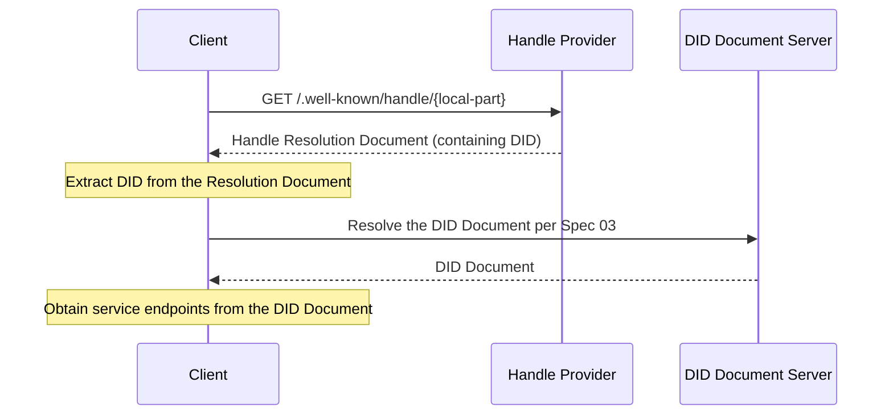

# ANP-DID:WBA Name Space Specification (Draft)

Abbreviation: WNS (WBA Name Space)

Note: This specification is still in draft status and will undergo further optimization and iteration.

## Abstract

This specification defines WNS (WBA Name Space), a human-readable namespace based on did:wba. WNS introduces Handles (such as `alice.example.com`) as readable aliases for `did:wba` DIDs. Through a standardized resolution flow, a Handle is mapped to a DID, and the DID is then resolved to a DID Document and service capabilities according to the [did:wba Method Specification](03-did-wba-method-design-specification.md).

Handles solve the problem that DID identifiers are not human-friendly. Identifiers such as `did:wba:example.com:user:alice:e1_<fingerprint>` are machine-friendly but difficult to remember and share. In particular, under the latest did:wba specification, path-type DIDs carry a bound public key fingerprint by default, and the path-type DID itself may rotate when the binding key or binding profile changes. Therefore, WNS not only provides an experience similar to email addresses or social platform usernames, but also serves as a stable human-readable naming layer: the Handle can remain stable while the underlying did:wba may rotate as the binding key changes.

The Handle-related functionality defined by this specification can also be compatible with the native `did:web` method. See Appendix A for the compatibility entry.

## 1. Background and Motivation

### 1.1 Problem Statement

The `did:wba` method provides decentralized identity capabilities for agents (see the [did:wba Method Specification](03-did-wba-method-design-specification.md)), but its identifier format is not human-friendly:

- **Hard to remember**: `did:wba:example.com:user:alice:e1_<fingerprint>` contains the method prefix, domain, path, and binding fingerprint, making the identifier relatively long.
- **Hard to share**: Sharing DID identifiers in social contexts is inconvenient and error-prone.
- **Hard to input**: The user experience of manually entering DID identifiers is poor.
- **Potentially rotating**: For path-type DIDs using the default path profile, the DID itself may change when the binding key or binding profile changes.

These problems are especially prominent in the following scenarios:

- Sharing agent identifiers through social channels
- Entering recipients in instant messaging
- Referencing agent identities in business cards, documents, or verbal communication
- Keeping a stable public-facing reference while allowing the underlying DID to rotate

### 1.2 Design Goals

The design goals of WNS include:

1. **Human-readable**: Provide short, memorable, and easy-to-type aliases such as `alice.example.com`.
2. **Domain-independent**: Any entity with a domain name and TLS certificate can host a Handle service without depending on a specific centralized platform.
3. **Deterministic resolution**: The mapping from Handle to DID is explicit, and the resolution process is standardized.
4. **Stable reference**: Handle serves as a stable naming layer, allowing the underlying path-type did:wba to rotate as the binding key changes.
5. **Bidirectional binding**: Handles and DIDs support bidirectional verification to prevent unilateral tampering.
6. **Protocol integration**: Seamless integration with the existing ANP protocol stack (Specifications 03/07/08/09).
7. **Minimal design**: Define only the core naming and resolution mechanisms without specifying Handle registration, management, or other business processes.

### 1.3 Relationship with Existing Protocols

- **03-did:wba Method Specification**: WNS Handles are readable aliases for did:wba DIDs. Handle resolution ultimately depends on Specification 03 to obtain the DID Document. For path-type DIDs using the default path profile, WNS does not redefine binding fingerprint generation rules and directly reuses Specification 03.
- **07-Agent Description Protocol**: After Handle resolution, the DID Document's `service` section leads to the Agent Description document.
- **08-Agent Discovery Protocol**: Handle Providers can serve as supplementary entry points for agent discovery.
- **09-End-to-End Instant Messaging Protocol**: Handles can be used for recipient display and input, while message routing remains DID-based.

## 2. Terminology

| Term | Definition |
|------|------------|
| **Handle** | A human-readable short identifier in the format `local-part.domain`, such as `alice.example.com` |
| **Handle Provider** | The domain party that hosts the Handle resolution service and maintains Handle-to-DID mappings |
| **Local Part** | The user identifier portion of a Handle, such as `alice` in `alice.example.com` |
| **Domain** | The domain portion of a Handle, such as `example.com` in `alice.example.com` |
| **DID Binding** | The one-to-one mapping relationship from a Handle to a DID |
| **Handle Resolution** | The process of resolving a Handle to a DID |
| **DID Rotation** | For path-type did:wba, the process in which the DID changes because the binding key or binding profile changes |
| **WNS** | WBA Name Space, the namespace system defined by this specification |
| **Handle Resolution Document** | The JSON document returned by the Handle Resolution Endpoint, containing Handle-to-DID mapping information |

## 3. Handle Format Specification

### 3.1 Handle Syntax

Handles use DNS-style syntax in the format `local-part.domain`.

**ABNF Definition:**

```abnf
handle     = local-part "." domain
local-part = (ALPHA / DIGIT) *61(ALPHA / DIGIT / "-") (ALPHA / DIGIT)
domain     = ; A valid Fully Qualified Domain Name (FQDN), see RFC 1035
```

**Syntax Rules:**

- The local-part MUST contain only ASCII lowercase letters `a-z`, digits `0-9`, and hyphens `-`.
- The local-part MUST begin and end with a letter or digit.
- The local-part MUST NOT contain consecutive hyphens `--`.
- The local-part MUST be 1 to 63 characters in length.
- The domain MUST be a valid FQDN protected by a TLS/SSL certificate.
- The domain portion of a Handle MUST NOT carry a port number.
- All input MUST be normalized to lowercase before processing.

**Examples:**

```text
alice.example.com          ✓ Valid
bob-smith.example.com      ✓ Valid
agent-42.example.com       ✓ Valid
a.example.com              ✓ Valid (single-character local-part)
-alice.example.com         ✗ Invalid (starts with hyphen)
alice-.example.com         ✗ Invalid (ends with hyphen)
al--ice.example.com        ✗ Invalid (consecutive hyphens)
Alice.Example.com          → Normalized to alice.example.com
```

### 3.2 URI Representation

To explicitly identify a Handle in sharing scenarios, the `wba://` prefix MAY be used:

```text
wba://alice.example.com
```

The `wba://` prefix is used only for sharing and recognition scenarios, and is semantically equivalent to the Handle itself.

- Clients MAY accept input with the `wba://` prefix.
- If a client accepts the prefix, it MUST strip `wba://` before resolution and then follow the standard resolution flow.
- Implementations MUST NOT make support for the `wba://` prefix a prerequisite for interoperability.

> Note: `wba://` has not been registered with IANA as a formal URI scheme. Implementers may also use the following Web URL as an alternative:
> ```text
> https://{domain}/.well-known/handle/{local-part}
> ```

### 3.3 Reserved Word Principles

Handle Providers SHOULD maintain reserved word lists to prevent certain local-parts from being registered. The protocol defines the following reserved word categories; the specific list is determined by each Handle Provider:

**a) Protocol reserved words**: Words that conflict with ANP protocol keywords, such as `did`, `agent`, `well-known`, and `service`.

**b) System reserved words**: Words that conflict with common system functions, such as `admin`, `root`, `system`, and `api`.

**c) Defensive reserved words**: Words that may be used for phishing or confusion attacks, such as `support`, `security`, and `official`.

Handle Providers SHOULD publish their reserved word lists.

## 4. Handle Resolution Protocol

### 4.1 Resolution Flow

Handle resolution follows the flow below:

```text
Handle → Handle Resolution Endpoint → DID → DID Document → service
```



### 4.2 Handle Resolution Endpoint

The Handle Resolution Endpoint is a standardized HTTP endpoint provided by the Handle Provider:

- **URL**: `https://{domain}/.well-known/handle/{local-part}`
- **Method**: `GET`
- **Response Content-Type**: `application/json`

Where `{domain}` is the domain portion of the Handle and `{local-part}` is the user identifier portion.

**Example Request:**

```http
GET /.well-known/handle/alice HTTP/1.1
Host: example.com
Accept: application/json
```

### 4.3 Handle Resolution Document

The JSON document returned by the Handle Resolution Endpoint has the following format:

```json
{
  "handle": "alice.example.com",
  "did": "did:wba:example.com:user:alice:e1_<fingerprint>",
  "status": "active",
  "updated": "2025-01-01T00:00:00Z",
  "versionId": "42",
  "ttl": 300
}
```

**Field Descriptions:**

| Field | Required/Optional | Description |
|-------|-------------------|-------------|
| `handle` | Required | The complete Handle identifier |
| `did` | Required | The did:wba DID currently bound to the Handle |
| `status` | Required | The current Handle status; see Section 4.7 |
| `updated` | Optional | Last update time in ISO 8601 format |
| `versionId` | Optional | Mapping version identifier used for caching and troubleshooting |
| `ttl` | Optional | Suggested cache lifetime in seconds |

### 4.4 Handle-to-DID Mapping Rules

Handles and DIDs have a one-to-one correspondence maintained by the Handle Provider. The mapping follows these rules:

1. **Hostname consistency**: The domain portion of the Handle MUST match the hostname in the DID. If the DID authority includes a port, the comparison MUST ignore the port and compare only the hostname.
2. **Unique binding**: A Handle MUST be bound to exactly one DID.
3. **Local-part uniqueness**: The local-part MUST be unique within the same domain.
4. **No redefinition of did:wba binding fingerprints**: If a Handle points to a path-type did:wba using the default path profile, the generation, validation, and profile semantics of the final binding fingerprint segment in the DID path are defined entirely by Specification 03. WNS does not redefine or override those rules.

**Mapping Examples:**

```text
Handle:  alice.example.com
DID:     did:wba:example.com:user:alice:e1_<fingerprint>
```

```text
Handle:  alice.example.com
DID:     did:wba:example.com%3A8800:user:alice:e1_<fingerprint>
```

In the second example, the Handle domain is `example.com`. Although the DID contains the encoded port `%3A8800`, its hostname is still `example.com`, so the mapping remains valid. The Handle itself does not carry a port number. The port only affects where the DID Document is resolved, not the textual form of the Handle.

### 4.5 did:wba Standard Resolution

After obtaining the DID, implementations MUST resolve the DID Document according to the [did:wba Method Specification](03-did-wba-method-design-specification.md).

Implementers MUST NOT bypass the DID Document and directly infer service endpoints, binding keys, or other DID-related information from the Handle. The DID Document is the authoritative source of agent capabilities and services.

### 4.6 Handle Uniqueness Constraints

- A Handle MUST be bound to exactly one DID.
- The local-part MUST be unique within the same domain.
- Different domains MAY have the same local-part (decentralized model).

For example, `alice.example.com` and `alice.other.com` are two different Handles that point to different DIDs.

### 4.7 Handle Status

Handles have the following three states:

| Status | Description |
|--------|-------------|
| `active` | Normal state; the Handle can be resolved |
| `suspended` | Temporarily unresolvable but recoverable |
| `revoked` | Permanently revoked and not recoverable |

### 4.8 Error Responses

The Handle Resolution Endpoint SHOULD return the following standard HTTP status codes:

| Status Code | Meaning | Description |
|-------------|---------|-------------|
| `200 OK` | Resolution successful | Returns the Handle Resolution Document |
| `404 Not Found` | Handle does not exist | The local-part was never registered, or the server is unwilling to disclose whether the Handle exists |
| `410 Gone` | Handle permanently revoked | The Handle previously existed but has been revoked |
| `301 Moved Permanently` | Handle migrated | The `Location` header points to the new Resolution Endpoint |
| `308 Permanent Redirect` | Handle migrated | Similar to `301`, but preserves request semantics more explicitly |
| `429 Too Many Requests` | Request rate too high | Returned when rate limits are triggered; it may include `Retry-After` |

When `301` or `308` is returned:

1. `Location` is only a migration hint.
2. The client MUST re-run the bidirectional binding verification defined in Section 6 at the new address.
3. The client MUST NOT accept the new Handle → DID binding solely based on the HTTP redirect.

**Error Response Example:**

```json
{
  "error": "handle_not_found",
  "message": "The handle 'bob.example.com' does not exist"
}
```

## 5. Profile URL

### 5.1 Profile Entry Point

Handle Providers MAY provide a Profile entry point for each Handle. The following URL formats are recommended:

- Subdomain style: `https://{local-part}.{domain}/`
- Path style: `https://{domain}/{local-part}/`

### 5.2 Profile Format

Profiles are business-level documents. This specification only defines the Profile URL entry point and does not constrain the content format. The specific content and presentation of Profiles are defined by Handle users and Handle Providers.

The Profile URL is a presentation or business entry point, not the authoritative source for Handle → DID binding or service discovery. Implementers MUST NOT infer the DID, service endpoints, or authorization capabilities solely from the Profile URL. Any security-sensitive identity binding, message routing, and service discovery MUST still follow the standard chain of Handle → DID → DID Document.

## 6. Reverse Verification (Bidirectional Binding)

To prevent a malicious Handle Provider from mapping an arbitrary Handle to someone else's DID, WNS defines a bidirectional binding verification mechanism.

### 6.1 Handle Provider Declaration (Forward)

The Handle Provider declares the Handle-to-DID mapping through the Resolution Endpoint. This is part of the standard resolution flow (Section 4).

### 6.2 DID Document Declaration (Reverse)

The DID holder adds an entry of type `ANPHandleService` to the `service` section of the DID Document to declare the associated Handle:

```json
{
  "id": "did:wba:example.com:user:alice:e1_<fingerprint>#handle",
  "type": "ANPHandleService",
  "serviceEndpoint": "https://example.com/.well-known/handle/"
}
```

**Field Descriptions:**

- `id`: Unique identifier of the service; using the `#handle` suffix is recommended.
- `type`: MUST be `ANPHandleService`.
- `serviceEndpoint`: An HTTPS endpoint under the Handle Provider's domain. In v1 of this specification, verifiers use only the domain portion of this URL for reverse binding verification.

`ANPHandleService` is used to express the DID holder's reverse declaration of the Handle binding relationship.

In v1 of this specification, the main role of `ANPHandleService.serviceEndpoint` is to declare the Handle Provider domain used by the DID. It is neither a Profile page entry point nor a messaging service endpoint. It is a domain declaration used for name-binding verification.

In v1, verifiers only compare whether the domain of `ANPHandleService.serviceEndpoint` matches the domain of the input Handle. The path does not need to match exactly. To keep implementations simple and readable, `serviceEndpoint` may be the Resolution Endpoint for the corresponding Handle, or another stable HTTPS URL under the same domain. However, its domain MUST match the Handle domain.

Future versions may introduce stronger Name Service provider identifiers such as `providerDid`, while preserving compatibility, to support clearer provider identity expression and migration verification.

### 6.3 Verification Flow

For the following security-sensitive scenarios, verifiers MUST perform bidirectional binding verification:

- Identity authentication
- Authorization decisions
- Instant messaging recipient resolution
- Automated calls that trigger state changes, write operations, charges, or resource creation

For scenarios used only for UI display, search preview, or directory browsing, verifiers MAY delay bidirectional binding verification. However, once a security-sensitive operation is about to occur, the verifier MUST complete the verification.

```mermaid
sequenceDiagram
    participant V as Verifier
    participant H as Handle Provider
    participant D as DID Document Server

    V->>H: 1. Resolve Handle to obtain DID
    H-->>V: DID
    V->>D: 2. Resolve DID to obtain DID Document
    D-->>V: DID Document
    Note over V: 3. Check whether the domain of<br/>ANPHandleService matches the Handle domain
    alt Bidirectionally consistent
        Note over V: ✓ Verification passed
    else Inconsistent
        Note over V: ✗ Verification failed; Handle binding is untrusted
    end
```

**Verification Steps:**

1. Resolve the Handle through the Handle Resolution Endpoint and obtain the DID.
2. Resolve the DID according to Specification 03 and obtain the DID Document.
3. Find entries of type `ANPHandleService` in the DID Document's `service` section.
4. Extract the domain of the entry's `serviceEndpoint` and compare it with the domain of the input Handle.

If the domains are consistent, the binding relationship is trusted. Otherwise, it MUST be treated as untrusted. Implementers MAY further warn the user.

### 6.3.1 Rules for Using `ANPHandleService` (v1)

When performing bidirectional binding verification, the verifier should use `ANPHandleService.serviceEndpoint` according to the following rules:

1. Extract the domain from the input Handle.
2. Resolve the Handle through the Handle Resolution Endpoint and extract the `did` from the result.
3. Resolve the DID Document for that `did`.
4. Find the entry where `type = "ANPHandleService"` in the DID Document's `service` section.
5. Extract the URL scheme and domain of that entry's `serviceEndpoint`.
6. Verify that `serviceEndpoint` uses `https`, and compare its domain with the Handle domain extracted in Step 1.
7. If they are consistent, it indicates that the DID holder accepts the naming relationship provided by the Handle's domain.
8. If `ANPHandleService` is absent, or the domain of `serviceEndpoint` is inconsistent, the Handle binding MUST NOT be treated as a verified binding.

In v1 of this specification, reverse binding verification compares only the domain. It does not require the `serviceEndpoint` path to be exactly equal to any specific Resolution Endpoint. Future versions may introduce `providerDid` to enable stronger Name Service provider identity verification while preserving compatibility.

For security-sensitive scenarios such as identity authentication, authorization decisions, and recipient confirmation before message sending, verifiers MUST perform the checks above.

## 7. Integration with the ANP Protocol Stack

### 7.1 Integration with DID Document (Spec 03)

The DID Document adds the `ANPHandleService` service type to support reverse verification (Section 6).

```json
{
  "service": [
    {
      "id": "did:wba:example.com:user:alice:e1_<fingerprint>#ad",
      "type": "AgentDescription",
      "serviceEndpoint": "https://example.com/agents/alice/ad.json"
    },
    {
      "id": "did:wba:example.com:user:alice:e1_<fingerprint>#handle",
      "type": "ANPHandleService",
      "serviceEndpoint": "https://example.com/.well-known/handle/alice"
    }
  ]
}
```

For did:wba using the default path profile, WNS does not define the binding fingerprint format and does not redefine the `e1_` / `k1_` rules through WNS. Those semantics are entirely handled by Specification 03.

In v1 of this specification, verifiers use only the domain portion of `ANPHandleService.serviceEndpoint` for reverse binding verification and do not require the path to match exactly.

### 7.2 Integration with Agent Description Protocol (Spec 07)

An Agent Description document MAY include an optional `handle` field:

```json
{
  "protocolType": "ANP",
  "protocolVersion": "1.0.0",
  "type": "AgentDescription",
  "did": "did:wba:example.com:user:alice:e1_<fingerprint>",
  "handle": "alice.example.com",
  "name": "Alice's Agent",
  "description": "..."
}
```

The `handle` field is optional and helps other agents obtain a human-readable identifier. Its authoritative binding relationship is still determined by the WNS resolution result and the DID Document.

### 7.3 Integration with Agent Discovery Protocol (Spec 08)

In the collection returned by `.well-known/agent-descriptions`, each entry MAY include an optional `handle` field:

```json
{
  "@type": "ad:AgentDescription",
  "name": "Alice's Agent",
  "@id": "https://example.com/agents/alice/ad.json",
  "handle": "alice.example.com"
}
```

In addition, the Handle Provider's `/.well-known/handle/` path may serve as a supplementary entry point for agent discovery.

### 7.4 Integration with Instant Messaging Protocol (Spec 09)

Handles can be used for recipient display and input in instant messaging scenarios:

- Users can specify message recipients by entering a Handle such as `alice.example.com`.
- The client resolves the Handle to a DID and then performs message routing.
- The messaging UI may display the Handle instead of the DID to improve readability.

Message routing and transport remain DID-based. Handles are used only for display and input at the human-computer interaction layer.

## 8. Handle Provider Requirements

### 8.1 Resolution Service Requirements

Handle Providers MUST satisfy the following requirements:

- MUST provide the resolution service over HTTPS.
- MUST implement the `/.well-known/handle/{local-part}` endpoint.
- SHOULD support HTTP caching headers (at least `Cache-Control` and `ETag`; `Last-Modified` is optional).
- SHOULD implement rate limiting to prevent abuse.
- When returning `429 Too Many Requests`, SHOULD include `Retry-After`.
- When a Handle is in a migration window or an underlying DID rotation window, SHOULD reduce the cache TTL.

### 8.2 Handle Management

- Handle Providers are responsible for Handle allocation and lifecycle management.
- Handle registration flows, identity verification methods, length policies, and similar operational rules are defined by each Handle Provider.
- Handle Providers MUST ensure Handle uniqueness within the same domain.

### 8.3 Handle Provider Migration

Users may need to migrate a Handle from one Handle Provider to another. During migration:

- The old Handle Provider MAY return `301 Moved Permanently` or `308 Permanent Redirect`, with the `Location` header pointing to the new Handle Provider's Resolution Endpoint.
- During the migration period, the old and new Handle Providers SHOULD both maintain resolution capability.
- The DID holder needs to update `ANPHandleService` in the DID Document so that it continues to declare the Name Service domain in use.
- After resolving the result at the new address, the client MUST re-run bidirectional binding verification and MUST NOT accept the new binding solely based on the redirect.
- If stronger provider identity needs to be expressed in the future without breaking the current v1 interoperability model, a `providerDid` mechanism may be introduced in a later version.

### 8.4 Underlying DID Rotation

For path-type did:wba using the default path profile, the underlying DID rotates when the binding key changes or when the binding profile switches between `e1_` and `k1_`. In this scenario, WNS has the following requirements:

- The Handle MAY remain unchanged to provide a stable human-readable name.
- The Handle Provider SHOULD update the Handle mapping to the new DID as soon as the new DID Document is available.
- During the rotation window, the Handle Provider SHOULD reduce the cache TTL to reduce the time during which clients may use an outdated mapping.
- Clients MUST NOT assume that a Handle is always bound to the same DID; the current resolution result is the authoritative current DID for that Handle.
- For security-sensitive operations, after obtaining a new DID through a Handle, the client MUST re-run bidirectional binding verification.
- Policies for deactivating, retaining, or keeping the old DID in parallel are determined jointly by Specification 03 and the specific deployment. WNS is responsible only for the mapping between the stable name and the current DID.

## 9. Security Considerations

### 9.1 Domain Security

The security model of WNS is consistent with the did:wba method and relies on the TLS/SSL certificate system. The domain portion of a Handle MUST be protected by a valid TLS certificate. The security of a Handle Provider is equivalent to the security of its domain and TLS configuration.

### 9.2 Phishing and Confusion Attacks

WNS reduces phishing and confusion risks through the following mechanisms:

- The local-part is restricted to ASCII lowercase letters, digits, and hyphens, avoiding Unicode homograph attacks.
- Handle Providers SHOULD maintain reserved word lists (see Section 3.3).
- Clients SHOULD visually emphasize the domain portion when displaying Handles to help users identify the source.

### 9.3 Handle Squatting

Handle Providers SHOULD take measures to prevent malicious squatting, including but not limited to:

- Maintaining reserved word lists
- Implementing registration review mechanisms
- Providing dispute resolution processes

Specific policies are defined by each Handle Provider.

### 9.4 Privacy Considerations

- The Handle Resolution Endpoint exposes the existence of a Handle (for example, through differences among `200`, `404`, and `410`). Handle Providers SHOULD implement rate limiting to mitigate enumeration attacks.
- Handle Providers SHOULD NOT return sensitive information beyond the mapping relationship in the Resolution Endpoint.
- Handle Providers SHOULD try to normalize error response structures to avoid leaking unnecessary state through excessive differences.
- For display-only scenarios, clients MAY delay bidirectional binding verification to reduce unnecessary cross-site resolution requests.

### 9.5 Anti-Tampering

The core anti-tampering mechanism of WNS is bidirectional binding verification (Section 6):

1. The Handle Provider declares Handle → DID in the forward direction.
2. The DID holder declares the Name Service domain of the Handle in the reverse direction through `ANPHandleService` in the DID Document.
3. In v1 of this specification, the verifier checks domain consistency in both directions.
4. Future versions may introduce `providerDid` to provide stronger Name Service provider identity verification.

For path-type did:wba using the default path profile, the DID itself may also carry a binding fingerprint segment defined by Specification 03 (such as `e1_...` or `k1_...`). This belongs to the did:wba method layer and is not redefined by WNS.

WNS no longer defines a separate "public key fingerprint extension whose algorithm and encoding are chosen by the Handle Provider" in order to avoid redundant definitions or semantic conflicts with the default path profile of did:wba.

## 10. Use Cases

### 10.1 Social Sharing

User Alice can share `wba://alice.example.com` on social media. When other users see it, they can:

1. Recognize the `wba://` prefix and remove it to get the Handle `alice.example.com`.
2. Resolve the Handle to obtain the DID.
3. Obtain Alice's agent description and service endpoints through the DID Document.
4. Establish interaction with Alice's agent.

### 10.2 Inter-Agent Communication

Agent A needs to communicate with Agent B whose Handle is `bob.example.com`:

1. Resolve the Handle `bob.example.com` to obtain the DID.
2. Resolve the DID Document according to Specification 03.
3. Obtain the AgentDescription endpoint from the DID Document's `service` section.
4. Fetch the Agent Description document to understand Agent B's capabilities and interfaces.
5. Initiate communication according to the interface definition.

### 10.3 Instant Messaging

A user enters the recipient Handle `carol.example.com` in an instant messaging application:

1. The client resolves the Handle to obtain the DID.
2. The client obtains the messaging service endpoint through the DID Document.
3. The client sends a message using the instant messaging protocol defined in Specification 09.
4. The messaging interface displays the recipient's Handle rather than the DID.

### 10.4 Stable Handle and DID Rotation

Alice uses the Handle `alice.example.com` publicly over the long term. After some time, due to binding key rotation, the underlying path-type did:wba rotates from:

```text
did:wba:example.com:user:alice:e1_<old-fingerprint>
```

to:

```text
did:wba:example.com:user:alice:e1_<new-fingerprint>
```

During this process:

1. Alice's Handle `alice.example.com` remains unchanged.
2. The Handle Provider updates the mapping of the Handle to the new DID.
3. Alice updates `ANPHandleService` in the new DID Document.
4. After re-running bidirectional binding verification, resolvers continue to find Alice's current DID through the same Handle.

## 11. Normative Requirements Summary

The following summarizes all MUST / SHOULD / MAY requirements in this specification (terminology defined per [RFC 2119](https://www.rfc-editor.org/rfc/rfc2119)):

### MUST

1. The local-part of a Handle MUST begin and end with a letter or digit.
2. The local-part of a Handle MUST NOT contain consecutive hyphens.
3. The domain of a Handle MUST be a valid FQDN protected by a TLS/SSL certificate.
4. All Handle input MUST be normalized to lowercase.
5. If a client accepts input with the `wba://` prefix, it MUST strip the prefix before resolution.
6. The domain portion of a Handle MUST match the hostname in the DID; if the DID includes a port, the comparison MUST ignore the port.
7. A Handle MUST be bound to exactly one DID.
8. The local-part MUST be unique within the same domain.
9. After obtaining the DID, the DID Document MUST be resolved according to Specification 03.
10. Implementations MUST NOT bypass the DID Document and infer service endpoints, binding keys, or other DID information directly from a Handle.
11. Handle Providers MUST provide the resolution service over HTTPS.
12. Handle Providers MUST implement the `/.well-known/handle/{local-part}` endpoint.
13. Handle Providers MUST ensure Handle uniqueness within the same domain.
14. In identity authentication, authorization decisions, instant messaging recipient resolution, and other security-sensitive scenarios, verifiers MUST perform bidirectional binding verification.
15. In v1 of this specification, when performing bidirectional binding verification, verifiers MUST compare the domain of `ANPHandleService.serviceEndpoint` with the domain of the input Handle and MUST NOT require the path to match exactly.
16. After a client follows a `301` / `308` redirect to a new Resolution Endpoint, it MUST re-run bidirectional binding verification and MUST NOT accept the new binding solely based on the redirect.
17. For security-sensitive operations after underlying DID rotation, the client MUST re-run bidirectional binding verification.
18. A Profile URL MUST NOT be treated as the authoritative source for Handle → DID binding or service discovery.

### SHOULD

1. Handle Providers SHOULD maintain and publish reserved word lists.
2. The Handle Resolution Endpoint SHOULD support HTTP caching headers.
3. The Handle Resolution Endpoint SHOULD implement rate limiting.
4. During Handle migration, the old Provider SHOULD return a `301` or `308` redirect hint.
5. Clients SHOULD visually emphasize the domain portion when displaying a Handle.
6. Handle Providers SHOULD NOT return sensitive information in the Resolution Endpoint.
7. During Handle migration or an underlying DID rotation window, Handle Providers SHOULD reduce the cache TTL.
8. When returning `429`, Handle Providers SHOULD include `Retry-After`.
9. Handle Providers SHOULD try to normalize error response structures to reduce unnecessary state leakage.
10. After Handle Provider migration, the DID holder SHOULD update `ANPHandleService` in the DID Document.
11. When the underlying path-type DID rotates, the Handle Provider SHOULD update the Handle mapping to the new DID as soon as possible.

### MAY

1. Clients MAY accept input with the `wba://` prefix.
2. Handle Providers MAY provide Profile entry points for Handles.
3. Agent Description documents MAY include a `handle` field.
4. Entries in the agent discovery collection MAY include a `handle` field.
5. For scenarios used only for UI display, search preview, or directory browsing, verifiers MAY delay bidirectional binding verification.
6. A Handle MAY remain unchanged when the underlying path-type DID rotates.

## Appendix A: Native `did:web` Compatibility

Reference document: [Appendix B: Compatibility with native `did:web`](appendix-b-compatibility-with-native-did-web.md)

## References

- [W3C DID Core Specification](https://www.w3.org/TR/did-core/)
- [RFC 2119 - Key words for use in RFCs to Indicate Requirement Levels](https://www.rfc-editor.org/rfc/rfc2119)
- [RFC 1035 - Domain Names - Implementation and Specification](https://www.rfc-editor.org/rfc/rfc1035)
- [RFC 6585 - Additional HTTP Status Codes](https://www.rfc-editor.org/rfc/rfc6585)
- [RFC 8615 - Well-Known URIs](https://www.rfc-editor.org/rfc/rfc8615)
- [RFC 9110 - HTTP Semantics](https://www.rfc-editor.org/rfc/rfc9110)
- [ANP Technical White Paper](01-agentnetworkprotocol-technical-white-paper.md)
- [DID:WBA Method Design Specification](03-did-wba-method-design-specification.md)
- [Agent Description Protocol Specification](07-anp-agent-description-protocol-specification.md)
- [Agent Discovery Protocol Specification](08-anp-agent-discovery-protocol-specification.md)
- [End-to-End Instant Messaging Protocol Specification](09-ANP-end-to-end-instant-messaging-protocol-specification.md)

## Copyright Notice

Copyright (c) 2024 ANP Community
This file is released under the [MIT License](LICENSE). You are free to use and modify it, but you must retain this copyright notice.
