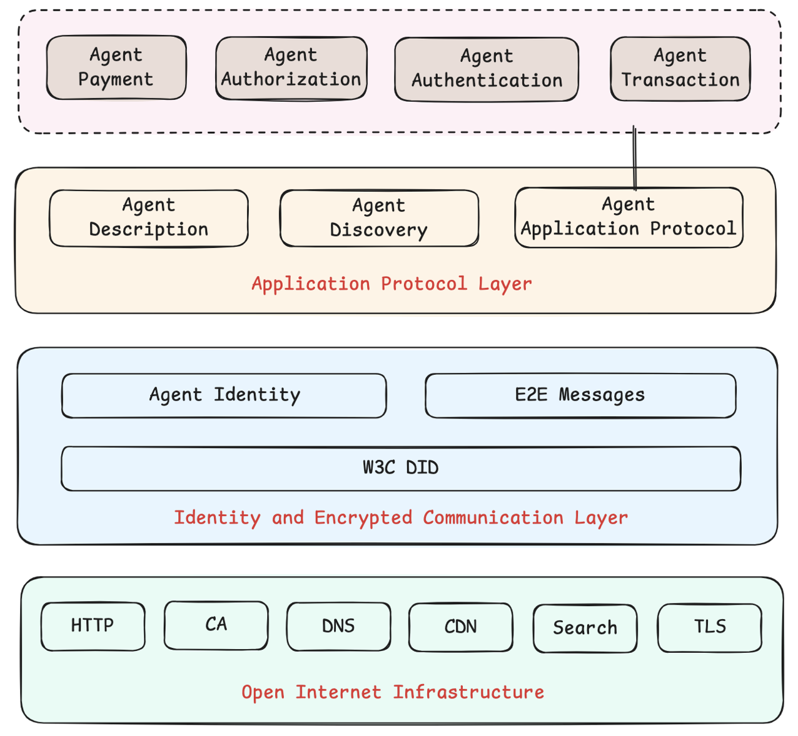

  
[English](README.md) | [中文](README.cn.md)

# Agent Network Protocol (ANP)

> ANP 致力于成为智能体互联网时代的 HTTP：为智能体提供身份、命名、发现、协商、安全消息和应用层协作协议。

**当前规范集：** 核心协议文档已经围绕 ANP 1.1 版本线整理。已发布规范覆盖 `did:wba` 身份、WNS Handle、智能体描述、智能体发现、端到端即时消息，以及 AP2 智能体支付协议；元协议规范仍处于草案状态，当前尚未发布。

**版本说明：** `版本：1.1` 表示规范/文档发布版本；它不改变 ANP 载荷字段 `protocolVersion`。本次发布未修改协议字段、流程或安全要求，因此示例与协议字段中的 `"protocolVersion": "1.0.0"` 保持不变。

**备注：** 本项目未在任何平台、任何区块链发布数字货币。

## 愿景定位

Agent Network Protocol（ANP）是一个开源的智能体通信协议，目标是定义智能体之间的连接方式，为数十亿智能体构建开放、安全、高效的协作网络。

  

我们相信，智能体互联网是继人类互联网之后的新一代信息基础设施。在这个愿景中：

- **从平台中心到协议中心：** 数据和服务不应继续被锁在封闭平台里，智能体需要开放协议实现直接连接。
- **连接即力量：** 每个智能体既可以是信息消费者，也可以是服务提供者，并能发现、连接和协作。
- **AI 原生网络：** 智能体应通过语义明确、机器可读、可调用的协议交互，而不是只能模仿人类浏览网页。

## 为什么需要 ANP

当前互联网基础设施已经成熟，但仍缺少面向大规模智能体网络的通信和连接层。ANP 重点解决三类问题：

- 🌐 **互联互通：** 让不同平台、不同域名下的智能体能够相互认证、发现和通信。
- 🖥️ **原生接口：** 让 AI 使用 API、协议文档、结构化描述和协商接口，而不是模拟人类访问网页。
- 🤝 **高效协作：** 让智能体能够自组织、自协商，构建更低成本的协作网络。

## 协议架构

  

ANP 构建在现有互联网基础设施之上，将已发布的协议能力组织为两个核心协议层，并在其上承载具体领域的应用协议：

- 🌐 **开放互联网基础设施：** ANP 复用 HTTP、CA、DNS、CDN、Search、TLS 等成熟基础设施，而不是重新构建一套网络栈。
- 🔒 **身份与加密通信层：** 基于 W3C DID 和 Web 基础设施，提供智能体身份、`did:wba` 认证和端到端加密消息基础能力。
- 📡 **应用协议层：** 包含智能体描述、智能体发现和智能体应用协议。智能体支付、授权、认证、交易等领域协议构建在这一层之上。
- 🧪 **元协议状态：** ANP-06 当前仍为草案，暂不属于已发布架构；待协议协商设计稳定后再发布。

## 协议规范索引

| 领域 | 文档 | 状态 | 定义内容 |
| --- | --- | --- | --- |
| 总览 | [ANP 技术白皮书](chinese/01-AgentNetworkProtocol技术白皮书.md) | 白皮书 | 愿景、设计原则和三层协议架构 |
| 身份 | [ANP-03：did:wba 方法规范](chinese/03-did-wba方法规范.md) | 已发布 v1.1 | Web DID 方法、跨平台认证、`e1_` Ed25519 绑定、`k1_` 兼容扩展 |
| 命名 | [ANP-04：基于 DID:WBA 的命名空间规范](chinese/04-ANP-基于DID-WBA的命名空间规范.md) | 已发布 v1.1 | WNS Handle（如 `alice.example.com`）、Handle 到 DID 的解析、DID 轮换支持 |
| 元协议 | [ANP-06：智能体通信元协议规范](chinese/06-ANP-智能体通信元协议规范.md) | Draft / 未发布 | 智能体之间的协议协商、协议选择和通信建立 |
| 描述 | [ANP-07：智能体描述协议规范](chinese/07-ANP-智能体描述协议规范.md) | 已发布 v1.1 | 智能体描述文档、接口描述和能力发布 |
| 发现 | [ANP-08：智能体发现协议规范](chinese/08-ANP-智能体发现协议规范.md) | 已发布 v1.1 | 基于 `.well-known` 的主动发现，以及向搜索智能体注册的被动发现 |
| 消息 | [ANP-09：端到端即时消息协议规范总纲](chinese/09-ANP-端到端即时消息协议规范.md) | 已发布 v1.1 | 私聊、群聊、端到端加密、附件和联邦场景的 Profile 索引 |
| 支付 | [ANP-10：智能体支付协议规范（AP2）](chinese/application/10-ANP-智能体支付协议规范.md) | 中文草案 v0.1；英文 v1.1 | 智能体支付、授权凭证、收据、基于 DID 的签名和交易流程 |

### 即时消息 Profile

ANP 端到端即时消息规范集拆分为多个独立 Profile：

1. [P1 核心绑定](chinese/message/01-核心绑定.md)：JSON-RPC 2.0 绑定、请求/响应/错误约定。
2. [P2 身份与发现](chinese/message/02-身份与发现.md)：基于 DID 的服务发现和端点能力发现。
3. [P3 私聊基础语义](chinese/message/03-私聊基础语义.md)：私聊发送和回执。
4. [P4 群组基础语义](chinese/message/04-群组基础语义.md)：群生命周期、成员关系和群消息语义。
5. [P5 私聊端到端加密](chinese/message/05-私聊端到端加密.md)：私聊消息的 E2EE Overlay。
6. [P6 群组端到端加密](chinese/message/06-群组端到端加密.md)：群消息的 E2EE Overlay。
7. [P7 附件与对象传输](chinese/message/07-附件与对象传输.md)：Manifest、对象服务和大对象传输。
8. [P8 联邦与跨域](chinese/message/08-联邦与跨域.md)：跨域路由、转发和结果见证。

### DID 兼容性附录

- [附录 A：did:wba `k1_` 兼容扩展](chinese/附录A：did-wba-k1_兼容扩展.md)
- [附录 B：与原生 `did:web` 的兼容](chinese/附录B：与原生did-web-的兼容.md)

## 快速上手

- 如果想快速了解 ANP 概念和使用方式，请阅读 [ANP 入门指南](docs/chinese/ANP入门指南.md)。
- 如果要实现智能体身份与认证，请从 [ANP-03：did:wba 方法规范](chinese/03-did-wba方法规范.md) 和两个 DID 兼容性附录开始。
- 如果要发布智能体，请阅读 [ANP-07：智能体描述协议规范](chinese/07-ANP-智能体描述协议规范.md) 和 [ANP-08：智能体发现协议规范](chinese/08-ANP-智能体发现协议规范.md)。
- 如果要构建即时消息，请从 [ANP-09](chinese/09-ANP-端到端即时消息协议规范.md) 开始，再按需选择具体 Profile。
- 如果想运行 ANP 相关 Demo，请查看 [ANP 示例程序](docs/chinese/ANP示例程序.md)。

## 协议 SDK

ANP 的开源实现维护在 AgentConnect 仓库：

- [https://github.com/agent-network-protocol/AgentConnect](https://github.com/agent-network-protocol/AgentConnect)

AgentConnect 重点提供 `did:wba`、身份认证、智能体描述、协议协商、安全通信和应用层协议的 SDK 支持。

## 仓库结构

- `01-*.md`、`03-*.md`、`04-*.md`、`06-*.md`、`07-*.md`、`08-*.md`、`09-*.md`：英文核心协议文档。
- `application/`：AP2 等应用层协议。
- `message/`：ANP 端到端即时消息 Profile 规范集。
- `chinese/`：核心规范中文版及相关研究笔记。
- `docs/`：指南、扩展阅读和社区运营文档。
- `blogs/`：技术文章和协议分析。
- `examples/`：ADP 示例资产和 API 接口示例。
- `images/`、`standard/`：共享图和标准化参考资料。

## 深入阅读

- [扩展阅读](docs/chinese/links.md)
- [ANP 技术白皮书](chinese/01-AgentNetworkProtocol技术白皮书.md)
- [AgentConnect 示例](https://github.com/agent-network-protocol/AgentConnect)

## 里程碑

- [x] 定义并实现身份认证与安全通信基础。
- [x] 发布 `did:wba` v1.1，默认支持 `e1_` Ed25519 路径绑定，并提供 `k1_` 与原生 `did:web` 兼容说明。
- [x] 定义 WNS Handle，作为 DID 智能体的人类可读命名层。
- [x] 发布智能体描述协议和智能体发现协议。
- [ ] 元协议仍为草案，待稳定后发布。
- [x] 将端到端即时消息拆分为总纲和八个可互操作 Profile。
- [x] 在应用层加入 AP2 智能体支付协议。
- [ ] 持续推进 SDK 实现与示例对齐 ANP 1.1 规范集。
- [ ] 持续推进标准化工作，并扩展更多领域应用协议。

## 联系我们

我们已经成立 ANP 开源技术社区，以开源社区方式推进 ANP 建设。诚挚邀请你加入社区。

- 邮箱：chgaowei@gmail.com
- Discord：[https://discord.gg/sFjBKTY7sB](https://discord.gg/sFjBKTY7sB)
- 官网：[https://agent-network-protocol.com/](https://agent-network-protocol.com/)
- GitHub：[https://github.com/agent-network-protocol/AgentNetworkProtocol](https://github.com/agent-network-protocol/AgentNetworkProtocol)
- 微信：flow10240

## 贡献

我们欢迎任何形式的贡献，请参考 [CONTRIBUTING.cn.md](CONTRIBUTING.cn.md)。

### 贡献者

感谢所有为 Agent Network Protocol 项目做出贡献的人。

- [贡献者名单](CONTRIBUTORS.cn.md)

## 许可证

本项目基于 MIT 许可证开源，详情请参考 [LICENSE](LICENSE)。版权归属于常高伟（GaoWei Chang）。任何使用本项目的用户必须保留原始版权声明和许可证文件。

## 版权声明

Copyright (c) 2024 GaoWei Chang
本文件依据 [MIT 许可证](./LICENSE) 发布，您可以自由使用和修改，但必须保留本版权声明。
