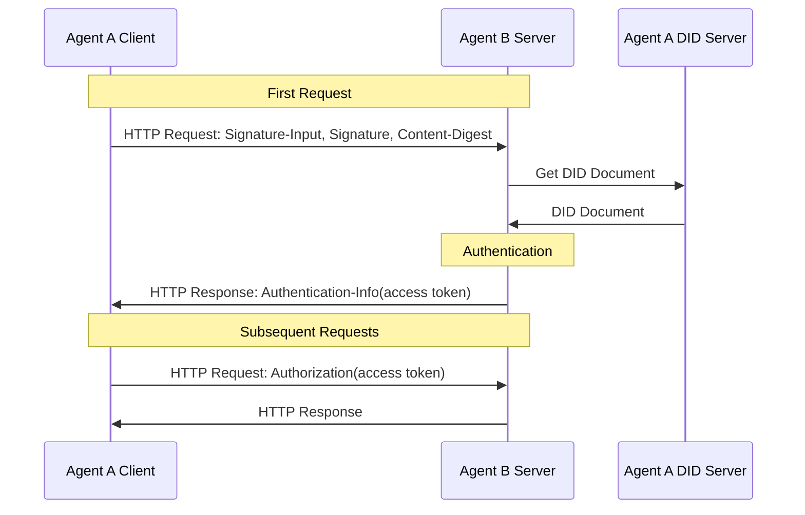
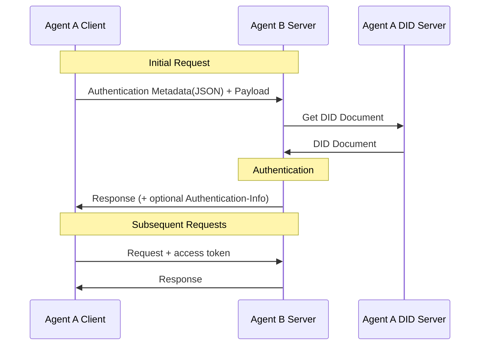

# did:wba方法规范（V0.1）

## 摘要

wba DID方法是一种基于Web的去中心化标识符（DID）规范，旨在满足跨平台身份认证和智能体通信的需求。此方法在did:web基础上进行扩展和优化，命名为did:wba，保留其兼容性并增强针对智能体场景的适配性。

在本规范中，路径型 did:wba 的默认方案会在 DID 路径中携带绑定公钥指纹，用于增强 DID 与用户自持私钥之间的绑定关系。当前版本的**默认 profile**为：

- `e1_`：绑定 Ed25519 公钥，推荐用于新部署，并可直接集成 W3C 标准的 Data Integrity EdDSA proof。

为了兼容钱包生态和现有 secp256k1 实现，本规范在附录 A 中额外定义了一个**非默认兼容扩展 profile**：

- `k1_`：绑定 secp256k1 公钥，主要用于兼容钱包生态和现有 Web3 密钥体系。

同时，我们设计了一个基于 did:wba 方法和 HTTP 协议的流程：请求签名基于 [RFC 9421](https://www.rfc-editor.org/rfc/rfc9421) 的 HTTP Message Signatures，消息体完整性基于 [RFC 9530](https://www.rfc-editor.org/rfc/rfc9530) 的 `Content-Digest` 字段，使服务端可以在不增加交互次数的情况下快速验证其他平台客户端的身份。

本规范关于跨平台身份认证、端到端加密、handle等功能，也可以和原生的did:web方法兼容，兼容方案参考附录B。

## 1. 引言

### 1.1 前言

wba DID方法规范符合去中心化标识符V1.0[[DID-CORE](https://www.w3.org/TR/did-core/)]中指定的要求。

本规范在did:web方法规范的基础上，添加了DID文档限定、跨平台身份认证流程、智能体描述服务等规范描述，提出了新的方法名did:wba(Web-Based Agent)。

考虑到did:web方法规范仍然是一个草案，未来可能会有不适宜智能体通信场景的改动。另外，我们对规范做了部分修改，和原作者就规范修改达成共识也是一个长期过程，所以我们决定使用一个新的方法名。

未来不排除将did:wba规范合并到did:web规范中的可能，我们会去推动这个目标的实现。

did:wba方法参考的did:web方法规范地址为[https://w3c-ccg.github.io/did-method-web](https://w3c-ccg.github.io/did-method-web)，版本日期为2024年7月31日。为了方便管理，我们备份了一份did:wba当前使用的did:web方法规范文档：[did:web方法规范](/references/did_web%20Method%20Specification.html)。

### 1.2 设计原则

设计did:wba方法时，我们的核心原则是即可以充分利用现有的成熟技术和完善的 Web 基础设施，又可以实现去中心化。使用did:wba，可以实现类似email特点，各个平台以中心化的方式实现自己的账户体系，同时，各个平台之间可以互联互通。

对于路径型 DID，本规范将“在 DID 路径中携带绑定公钥指纹”定义为默认方案。这样做的主要目的是让用户能够真正掌握自己的私钥，并让 DID 与用户实际控制的公钥形成稳定、可独立校验的绑定关系。即使平台维护 DID 文档的托管服务，用户或验证者仍可以根据 DID 本身验证其是否对应预期公钥，从而降低平台静默替换身份公钥的风险。

为了在标准互操作性和生态兼容性之间取得平衡，当前版本采用“**主规范默认 e1_，兼容扩展支持 k1_**”的结构：

- `e1_`：绑定 Ed25519 公钥，推荐用于新部署。该 profile 可以直接与 W3C Data Integrity EdDSA 标准集成，适合作为 did:wba 的长期标准化主线。
- `k1_`：绑定 secp256k1 公钥，不作为主规范默认方案，而是在附录 A 中作为兼容钱包生态、现有 Web3 密钥体系以及依赖 secp256k1 的实现的扩展能力。

公钥指纹路径方案会带来一个自然结果：当绑定密钥发生变化时，路径型 DID 也会发生变化。因此，did:wba 不把“稳定的用户可读标识”直接压在 DID 字符串上，而是通过名称服务方案（如 WNS/Handle）来解决稳定引用问题：DID 负责“可验证的加密身份”，名称服务负责“稳定的人类可读名称”。

此外，各种类型的标识符系统都可以添加对 DID 的支持，从而在集中式、联合式和去中心化标识符系统之间架起互操作的桥梁。这意味着现有的中心化标识符系统无需彻底重构，只需在其基础上创建 DID，即可实现跨系统互操作，从而大大降低了技术实施的难度。

## 2. WBA DID 方法规范

### 2.1 方法名称

用于标识此DID方法的名称字符串是:wba。使用此方法的DID必须以以下前缀开头:did:wba。根据DID规范,此字符串必须是小写的。DID的其余部分(前缀之后)在下面指定。

### 2.2 方法特定标识符

方法特定标识符是由 TLS 保护的完全限定域名（FQDN），可以选择包含 DID 文档的路径。描述有效域名语法的正式规则在[（RFC1035）](https://www.rfc-editor.org/rfc/rfc1035)、[（RFC1123）](https://www.rfc-editor.org/rfc/rfc1123)和[（RFC2181）](https://www.rfc-editor.org/rfc/rfc2181)中有说明。

方法特定标识符必须依据现代 TLS 服务身份校验规则与服务端证书匹配。域名匹配必须（MUST）以证书 `subjectAltName` 扩展中的 DNS 标识（`dNSName`）为准；实现不得（MUST NOT）依赖 Common Name（CN）作为服务身份匹配依据。方法特定标识符不得包含 IP 地址。可以包含端口号，但主机和端口之间的冒号必须进行百分号编码，以防止与路径发生冲突。目录和子目录可以选择性地包含，使用冒号而不是斜杠作为分隔符。

did:wba 支持两种形式：

1. 裸域名 DID：用于标识整个域名主体；
2. 路径型 DID：用于标识域名下的具体用户、智能体或子身份。

对于**新创建的路径型 did:wba**，本规范将“路径最后一个 segment 携带绑定公钥指纹”定义为默认方案。位于指纹段之前的 path segment 由实现者自行定义，例如 `user:alice`、`agents:billing` 等。

ABNF 定义如下：

```abnf
base64url-char = ALPHA / DIGIT / "-" / "_"
path-segment   = 1*(ALPHA / DIGIT / "-" / "_" / ".")
e1-fingerprint = "e1_" 43base64url-char

wba-root-did = "did:wba:" domain-name
wba-path-did = "did:wba:" domain-name 1*(":" path-segment) ":" e1-fingerprint
wba-did      = wba-root-did / wba-path-did
```

> 说明：  
> 1. 主规范默认路径 profile 仅定义 `e1_`。  
> 2. 如果实现需要兼容 secp256k1 路径绑定，请参见附录 A 的 `k1_` 兼容扩展。

### 2.2.1 默认路径方案：`e1_` 绑定公钥指纹

对于新创建的路径型 did:wba，最后一个 path segment 必须（MUST）是 `e1_` 绑定公钥指纹段。`e1_` 表示绑定密钥为 Ed25519 公钥，并且该 DID 采用主规范默认 profile。

推荐结构如下：

```plaintext
did:wba:{domain}:{namespace...}:{e1-fingerprint}
```

示例：

```plaintext
did:wba:example.com
did:wba:example.com:user:alice:e1_<fingerprint>
did:wba:example.com%3A3000:user:alice:e1_<fingerprint>
```

为兼容已有部署，解析器可以（MAY）支持不带指纹段的历史路径型 DID 的解析；但新创建的路径型 DID 应当（SHOULD）采用本规范定义的默认方案。

### 2.2.2 `e1_` 指纹生成方法（推荐）

`e1_` 指纹用于将路径型 DID 与 Ed25519 绑定公钥关联起来。其生成方法如下：

1. 选择 DID 绑定密钥。绑定密钥必须（MUST）同时满足以下条件：
   - 是一个 Ed25519 公钥；
   - 在 DID 文档中以 `Multikey` / `publicKeyMultibase` 表示；
   - 被 DID 文档的 `authentication` 关系授权。

2. 将该 Ed25519 `publicKeyMultibase` 转换为等价公钥 JWK。等价 JWK 只保留 RFC 7638 要求的必要字段：

```json
{
  "crv": "Ed25519",
  "kty": "OKP",
  "x": "..."
}
```

其中：

- `publicKeyMultibase` 必须是 Multibase base58-btc 编码的 Ed25519 `Multikey`；
- 解码后得到 Ed25519 公钥原始 32 字节；
- `x` 为该 32 字节公钥的 base64url（无 padding）表示。

3. 按 [RFC 7638](https://www.rfc-editor.org/rfc/rfc7638) 的规则生成 JWK Thumbprint 输入：
   - 仅保留必要字段；
   - 字段名按字典序排序；
   - 使用无多余空白的 JSON 字符串；
   - 使用 UTF-8 编码。

4. 对第 3 步得到的 UTF-8 字节序列执行 SHA-256 哈希，得到 32 字节摘要值。

5. 对 32 字节摘要值进行 base64url 编码，并去掉尾部 `=` padding。编码结果长度固定为 43 个字符。

6. 在编码结果前面添加 `e1_` 前缀，得到最终路径段。

说明：

1. `e1_` 前缀不是哈希输出的一部分，而是 profile 前缀；
2. 推荐将不带 `e1_` 前缀的 thumbprint 值用作该验证方法的 `kid` 或 fragment，便于 DID 路径与验证方法标识保持直观对应；
3. 新部署应当（SHOULD）优先采用 `e1_` profile。

### 2.4 密钥材料和文档处理

由于大多数Web服务器呈现内容的方式，特定的did:wba文档很可能会以application/json的媒体类型提供服务。如果检索到一个名为did.json的文档，应该遵循以下处理规则：

1. 如果JSON文档根部存在@context，则应根据JSON-LD规则处理该文档。如果无法处理，或者文档处理失败，则应拒绝将其作为did:wba文档。

2. 如果JSON文档根部存在@context，且通过JSON-LD处理，并且包含上下文 `https://www.w3.org/ns/did/v1`，则可以按照[[did-core规范的6.3.2节](https://www.w3.org/TR/did-core/#consumption-0)]进一步将其处理为DID文档。

3. 如果不存在@context，则应按照[[did-core规范6.2.2节](https://www.w3.org/TR/did-core/#consumption)]中指定的正常JSON规则进行DID处理。

4. 对外部资源、外部 DID 或 `serviceEndpoint` 的引用必须（MUST）使用绝对 URI。

5. 对同一 DID Document 内部验证方法的引用可以（MAY）使用相对 DID URL（如 `#key-1`）；解析器在处理该类引用时，必须以文档根 DID 作为基准进行展开。

> 注意：这包括嵌入的密钥材料和其他元数据中的外部URL，这可以防止密钥混淆攻击。

### 2.5 DID文档说明

除DID核心规范外，其他大部分规范尚处于草案阶段。本章节将展示一个用于身份验证的DID文档的子集。为了提高系统间的兼容性，所有标注为必须的字段，所有系统必须支持；标注为可选的字段，可以选择性支持。未列出的其他标准中定义的字段，可以选择性支持。

**推荐的 e1 路径型 DID 文档示例如下：**

```json
{
  "@context": [
    "https://www.w3.org/ns/did/v1",
    "https://w3id.org/security/data-integrity/v2",
    "https://w3id.org/security/multikey/v1",
    "https://w3id.org/security/suites/x25519-2019/v1"
  ],
  "id": "did:wba:example.com%3A8800:user:alice:e1_<fingerprint>",
  "verificationMethod": [
    {
      "id": "did:wba:example.com%3A8800:user:alice:e1_<fingerprint>#key-1",
      "type": "Multikey",
      "controller": "did:wba:example.com%3A8800:user:alice:e1_<fingerprint>",
      "publicKeyMultibase": "z6Mk..."
    },
    {
      "id": "did:wba:example.com%3A8800:user:alice:e1_<fingerprint>#key-x25519-1",
      "type": "X25519KeyAgreementKey2019",
      "controller": "did:wba:example.com%3A8800:user:alice:e1_<fingerprint>",
      "publicKeyMultibase": "z9hFgmPVfmBZwRvFEyniQDBkz9LmV7gDEqytWyGZLmDXE"
    }
  ],
  "authentication": [
    "did:wba:example.com%3A8800:user:alice:e1_<fingerprint>#key-1"
  ],
  "assertionMethod": [
    "did:wba:example.com%3A8800:user:alice:e1_<fingerprint>#key-1"
  ],
  "keyAgreement": [
    "did:wba:example.com%3A8800:user:alice:e1_<fingerprint>#key-x25519-1"
  ],
  "service": [
    {
      "id": "did:wba:example.com%3A8800:user:alice:e1_<fingerprint>#ad",
      "type": "AgentDescription",
      "serviceEndpoint": "https://agent-network-protocol.com/agents/example/ad.json"
    },
    {
      "id": "did:wba:example.com%3A8800:user:alice:e1_<fingerprint>#handle",
      "type": "ANPHandleService",
      "serviceEndpoint": "https://example.com/.well-known/handle/alice"
    },
    {
      "id": "did:wba:example.com%3A8800:user:alice:e1_<fingerprint>#anp",
      "type": "ANPMessageService",
      "serviceEndpoint": "https://example.com/anp"
    }
  ],
  "proof": {
    "type": "DataIntegrityProof",
    "cryptosuite": "eddsa-jcs-2022",
    "created": "2025-01-01T00:00:00Z",
    "verificationMethod": "did:wba:example.com%3A8800:user:alice:e1_<fingerprint>#key-1",
    "proofPurpose": "assertionMethod",
    "proofValue": "z..."
  }
}
```

**字段解释**：

- **@context**：必须字段，JSON-LD 上下文定义了DID文档中使用的语义和数据模型，确保文档的可理解性和互操作性。`https://www.w3.org/ns/did/v1` 是必须的。对于采用标准 Ed25519 proof 的 e1 文档，`https://w3id.org/security/data-integrity/v2` 与 `https://w3id.org/security/multikey/v1` 也是必须的。其他根据需要添加。

- **id**：必须字段，不可以携带IP，但是可以携带端口，携带端口时，冒号需要编码为`%3A`。后面使用冒号进行路径分割。对于新创建的路径型 DID，最后一个 path segment 必须（MUST）是 `e1_<fingerprint>`。

- **verificationMethod**：必须字段，包含验证方法的数组，定义了用于验证DID主体的公钥信息。对于需要支持端到端加密（E2EE）通信的场景，`verificationMethod` 中**应**同时包含签名密钥和密钥协商密钥，实现密钥分离。签名密钥用于身份认证和文档断言；密钥协商密钥（如 `X25519KeyAgreementKey2019`）用于 HPKE 密钥封装。两类密钥各司其职，单一密钥泄露不会同时影响身份认证和通信机密性。

  对于采用默认路径方案的路径型 DID，`verificationMethod` 中必须（MUST）至少存在一个 Ed25519 `Multikey` 作为绑定密钥，其等价公钥 JWK 的 RFC 7638 thumbprint 与 DID 路径最后的 `e1_` 指纹段完全一致。

  - **子字段**:
    - **id**：验证方法的唯一标识符。
    - **type**：验证方法的类型。
    - **controller**：控制该验证方法的DID。
    - **publicKeyJwk**：公钥信息，使用JSON Web Key格式。
    - **publicKeyMultibase**：公钥信息，使用 Multibase 格式。

- **authentication**：必须字段，列出用于身份验证的验证方法，可以是字符串或对象。对于采用默认路径方案的路径型 DID，绑定密钥必须（MUST）被 `authentication` 关系授权。默认情况下，跨平台身份认证应优先使用该绑定密钥进行签名。

- **assertionMethod**：可选字段，列出用于表达断言的验证方法。对于采用 e1 profile 且使用标准 DID Document proof 的 DID，绑定密钥或用于生成该 proof 的 Ed25519 `Multikey` 必须（MUST）被 `assertionMethod` 授权。

- **keyAgreement**：可选字段，定义了用于密钥协商的公钥信息，可以用于两个DID之间的加密通信。验证方法一般使用X25519KeyAgreementKey2019等可以用于密钥交换的密钥协商算法。`keyAgreement` 可以是字符串引用（指向 `verificationMethod` 中的条目）或嵌入式对象。对于端到端加密（E2EE）场景（详见 [09-ANP-端到端即时消息协议规范](09-ANP-端到端即时消息协议规范.md)），此字段用于 HPKE 密钥封装，**应**包含 `X25519KeyAgreementKey2019` 类型的条目。如果 DID 文档中没有 `keyAgreement` 或没有 X25519 类型条目，则表示该智能体不支持 E2EE。

  - **子字段**:
    - **id**：密钥协商方法的唯一标识符。
    - **type**：密钥协商方法的类型。
    - **controller**：控制该密钥协商方法的DID。
    - **publicKeyMultibase**：Multibase格式的公钥信息。

- **service**：可选字段，定义了与DID主体关联的服务列表。
  - **id**：服务的唯一标识符。
  - **type**：服务类型。目前支持以下类型：
    - `AgentDescription`：智能体描述服务，`serviceEndpoint` 指向遵循[ANP-智能体描述协议规范](/chinese/07-ANP-智能体描述协议规范.md)的文档。
    - `ANPHandleService`：Handle 绑定服务，用于 WNS（WBA Name Space）双向绑定验证。`serviceEndpoint` 指向该 DID 主体声明使用的 Handle Provider 域下的 HTTPS 端点（如 `https://example.com/.well-known/handle/alice`）。在本规范 v1 中，验证者执行反向绑定校验时，仅使用 `serviceEndpoint` 的 domain 部分与输入 Handle 的 domain 进行一致性比较，不要求 path 完全一致；后续版本可以引入 `providerDid` 等更强的 Name Service 提供者标识机制。通过在 DID Document 中声明 `ANPHandleService`，DID 持有者确认其关联 Handle 所属的 Name Service 域，验证者可据此完成双向验证。详见 [04-ANP-基于DID-WBA的命名空间规范](04-ANP-基于DID-WBA的命名空间规范.md)。
    - `ANPMessageService`：ANP 即时消息统一服务入口。若 DID 主体参与 ANP 即时消息协议，`serviceEndpoint` **MAY** 指向其统一的 ANP 消息端点；私聊、群聊、密钥材料访问、附件控制等能力由该单一服务入口承载，具体方法与能力声明遵循 ANP Profile 2 及相关 Profile。
  - **serviceEndpoint**：服务的端点URL。 

- **proof**：对于默认 `e1_` profile，`proof` 是必须字段；对于其他 profile，该字段是否出现由对应 profile 规则决定。`proof` 用于表达 DID Document 的完整性证明，证明 DID Document 在生成 proof 之后未被篡改，并表明 proof 创建时签名者控制了对应私钥。proof 本身不单独替代 DID method 解析过程，也不单独替代 `id` 一致性检查。
  - 对于默认 e1 profile，本版本定义了基于 W3C 标准的 `DataIntegrityProof` + `eddsa-jcs-2022` proof profile。

> 注意：
>
> 1. 公钥信息目前支持两种格式，`publicKeyJwk` 和 `publicKeyMultibase`。详细见 [https://www.w3.org/TR/did-extensions-properties/#verification-method-properties](https://www.w3.org/TR/did-extensions-properties/#verification-method-properties)。
> 2. 验证方法类型定义见 [https://www.w3.org/TR/did-extensions-properties/#verification-method-types](https://www.w3.org/TR/did-extensions-properties/#verification-method-types)。对于 e1 绑定密钥，推荐使用 `Multikey`。

> 6. 对于需要支持端到端加密通信的场景，建议采用密钥分离设计：签名/断言密钥与密钥协商密钥分开管理。签名/断言密钥不参与密钥协商，密钥协商密钥不参与签名。详细的 E2EE 协议设计参见 [09-ANP-端到端即时消息协议规范](09-ANP-端到端即时消息协议规范.md)。
> 7. 对于采用默认路径方案的新创建路径型 DID，绑定密钥必须（MUST）满足：
>    - 使用 `Multikey` / `publicKeyMultibase` 表示；
>    - 被 `authentication` 关系授权；
>    - 其等价公钥 JWK 的 RFC 7638 thumbprint 与 DID 路径最后一个 `e1_` 指纹段完全一致。
> 8. 如果实现需要支持 secp256k1 路径绑定，请参见附录 A 的 `k1_` 兼容扩展。

### 2.5 DID方法操作

#### 2.5.1 创建(注册)

did:wba方法规范没有指定具体的HTTP API操作，而是将程序化注册和管理留给各个实现方根据其Web环境的要求自行定义。

创建DID需要执行以下步骤：

1. 向域名注册商申请使用域名；
2. 在DNS查询服务中存储托管服务的位置和IP地址；
3. 如果创建的是路径型 DID，先生成 Ed25519 绑定密钥，并按照 2.2.2 节计算 `e1_` 指纹段；
4. 创建DID文档JSON-LD文件，包含合适的密钥对，并将 `did.json` 文件存储在 `.well-known` URL 下以代表整个域名，或者如果在该域名下需要解析多个DID，则存储在指定路径下。

例如，对于域名 `example.com`，`did.json` 将在以下 URL 下可用：

```plaintext
示例：创建DID
did:wba:example.com
 -> https://example.com/.well-known/did.json
```

如果指定了可选路径而不是裸域名，且采用默认路径方案，则 `did.json` 将在带有 `e1_` 指纹段的路径下可用：

```plaintext
示例5：使用默认路径方案创建路径型 DID
did:wba:example.com:user:alice:e1_<fingerprint>
 -> https://example.com/user/alice/e1_<fingerprint>/did.json
```

如果在域名上指定了可选端口，则必须对主机和端口之间的冒号进行百分比编码，以防止与路径发生冲突。

```plaintext
示例6：使用可选路径和端口创建DID
did:wba:example.com%3A3000:user:alice:e1_<fingerprint>
 -> https://example.com:3000/user/alice/e1_<fingerprint>/did.json
```

> 说明：  
> 如果实现需要使用 secp256k1 绑定路径 DID，请参见附录 A 的 `k1_` 兼容扩展。

#### 2.5.2 读取(解析)

必须执行以下步骤来从 did:wba DID 解析 DID 文档：

- 将方法特定标识符中的 `:` 替换为 `/` 以获得完全限定的域名和可选路径。
- 如果域名包含端口，则对冒号进行百分比解码。
- 通过在预期的DID文档位置前加上 `https://` 生成HTTPS URL。
- 如果URL中未指定路径，则附加 `/.well-known`。
- 附加 `/did.json` 以完成URL。
- 使用能够成功协商安全HTTPS连接的代理执行对URL的HTTP GET请求，该代理强制执行 [2.6节安全和隐私注意事项](https://w3c-ccg.github.io/did-method-web/#security-and-privacy-considerations) 描述的安全要求。
- 验证解析的DID文档的ID是否与正在解析的 did:wba DID 匹配。
- 对于主规范定义的 `e1_` 路径型 DID，必须（MUST）按如下严格绑定关系验证：
  - DID Document 顶层 `proof` 必须存在；
  - `proof` 必须通过 `DataIntegrityProof` + `eddsa-jcs-2022` 校验；
  - `proof.verificationMethod` 指向的验证方法必须（MUST）是 Ed25519 `Multikey`（或语义等价的 Ed25519 验证方法表示）；
  - 以 `proof.verificationMethod` 对应的 Ed25519 公钥计算 RFC 7638 thumbprint，结果必须（MUST）与 DID 路径最后的 `e1_` 指纹段完全一致。
- 在HTTP GET请求期间执行DNS解析时，客户端应使用[[RFC8484](https://w3c-ccg.github.io/did-method-web/#bib-rfc8484)]以防止跟踪正在解析的身份。
- 对 `e1_` DID，上述 proof 校验不受本地策略开关影响，而是解析成功的必要条件。
- 对其他 profile，如果本地策略启用了 DID Document proof 校验，且文档包含 `proof`，则应按对应 profile 规则进行校验。

> 说明：  
> 如果实现同时支持附录 A 的 `k1_` 兼容扩展，则对 `k1_` DID 的解析和绑定验证应按附录 A 执行。

#### 2.5.3 更新

要更新 DID 文档，需要更新DID对应的 `did.json` 文件。

对于采用默认路径方案的路径型 did:wba，只要 DID 路径最后的绑定密钥指纹不变，DID 本身将保持不变，但 DID 文档的其他内容可以更改，例如，添加新的验证密钥、撤销旧密钥或更新服务端点。

如果绑定密钥发生变化，则该路径型 DID 必须（MUST）变更为新的 DID。此时应创建新的 DID 文档，并由上层名称服务（如 WNS/Handle）负责稳定引用和迁移。

> 注意：
>
> 1. 使用诸如 git 之类的版本控制系统和诸如 GitHub Actions 之类的持续集成系统来管理 DID 文档的更新，可以为身份验证和审计历史提供支持。
> 2. HTTP API 更新过程没有指定具体的 HTTP API，而是将程序化注册和管理留给各个实现方根据其需求自行定义。

#### 2.5.4 停用（撤销）

要删除DID文档，必须移除 `did.json` 文件，或者由于其他原因使其不再公开可用。

对于采用默认路径方案的路径型 did:wba，如果绑定密钥被永久废弃，也可以通过停用旧 DID 并创建新 DID 的方式完成轮换；稳定引用关系由上层名称服务负责维护。

#### 2.5.5 DID Document proof

did:wba DID Document 的顶层 `proof` 字段是否出现，取决于所采用的 profile。对于默认 `e1_` profile，`proof` 是必须字段；对于其他 profile，DID Document 可以（MAY）包含顶层 `proof` 字段，用于提供文档完整性证明。该字段用于证明 DID Document 在生成 proof 之后未被篡改，并表明 proof 创建时签名者控制了对应私钥。proof 本身不单独替代 DID method 解析过程，也不单独替代 `id` 一致性检查。

对于默认 `e1_` profile，主规范定义的 `proof` profile 必须（MUST）符合：

- Verifiable Credential Data Integrity 1.0
- Data Integrity EdDSA Cryptosuites v1.0

`proof` 对象包含以下字段：

- `type`：必须字段。固定为 `DataIntegrityProof`
- `cryptosuite`：必须字段。固定为 `eddsa-jcs-2022`
- `created`：必须字段。proof 创建时间，采用 XML Schema datetime 格式
- `verificationMethod`：必须字段。完整 DID URL，指向 DID Document 中用于生成 proof 的 Ed25519 `Multikey`
- `proofPurpose`：必须字段。固定为 `assertionMethod`
- `proofValue`：必须字段。使用 base58-btc multibase（`z...`）编码
- `domain`：可选字段
- `challenge`：可选字段

额外约束：

1. `proof.verificationMethod` 必须（MUST）使用 `e1_` 绑定密钥，使 DID 路径绑定、公钥绑定与文档完整性证明统一；
2. 解析器必须（MUST）以 `proof.verificationMethod` 对应的 Ed25519 公钥重新计算 RFC 7638 thumbprint，并验证其与 DID 路径最后的 `e1_` 指纹段完全一致；
3. `proof` 的生成与验证必须（MUST）遵循 `eddsa-jcs-2022` 的标准算法流程，不再由本规范重写算法细节。

解析 `e1_` did:wba DID Document 时，proof 校验不是可选增强检查，而是路径绑定语义的一部分；缺少 `proof`、`proof` 验证失败、或 `proof.verificationMethod` 与 `e1_` 绑定指纹不一致时，解析必须（MUST）失败。

对于 `e1_` DID，不存在“DID Document 不含 `proof` 仍可继续解析”的宽松模式。

对于非 `e1_` profile，实现可以（MAY）按对应 profile 规则或本地策略在以下两种模式中选择其一：

1. 宽松模式：若 DID Document 不含 `proof`，仍可继续解析；
2. 严格模式：若本地策略要求 proof，则 DID Document 缺少 `proof` 时必须（MUST）视为验证失败。
**规范性说明**：

对于采用 `e1_` profile 的 DID，本规范要求 DID Document 的顶层 `proof` 使用 W3C 标准的 Data Integrity proof 机制。其 proof 数据模型、proof configuration、document transformation、hashing、proof serialization 以及 verification 规则，分别遵循 [Verifiable Credential Data Integrity 1.0](https://www.w3.org/TR/vc-data-integrity/) 和 [Data Integrity EdDSA Cryptosuites v1.0](https://www.w3.org/TR/vc-di-eddsa/)。本规范仅约束 did:wba 场景下 proof 的使用位置、字段要求与验证关系，不重复定义底层密码学算法；若出现冲突，以上游 W3C 规范为准。

### 2.6 安全和隐私注意事项

安全与隐私注意事项参考[[did:web 方法规范2.6节](https://w3c-ccg.github.io/did-method-web/#security-and-privacy-considerations)]。实现者还应额外关注默认路径方案下绑定密钥变更带来的 DID 轮换，以及名称服务同步问题。

新部署应当（SHOULD）优先采用 `e1_` profile，以获得更好的标准 proof 互操作性。如果实现需要兼容钱包生态和现有 secp256k1 实现，请参见附录 A 的 `k1_` 兼容扩展。

## 3. 基于did:wba方法和HTTP协议的跨平台身份认证

当客户端向不同平台的服务端发起请求时，客户端可以使用域名结合TLS对服务端进行身份认证，而服务端则根据客户端DID文档中的验证方法验证客户端的身份。

客户端在首次HTTP请求时，使用 [RFC 9421](https://www.rfc-editor.org/rfc/rfc9421) 定义的 `Signature-Input` 和 `Signature` 头进行签名；如果请求携带消息体，则使用 [RFC 9530](https://www.rfc-editor.org/rfc/rfc9530) 定义的 `Content-Digest` 头绑定消息体完整性。首次验证通过后，服务端可以返回 access token，客户端后续请求中携带 access token，服务端不用每次验证客户端的身份，而只要验证 access token 即可。



### 3.1 初始请求

当前客户端首次向服务端发起HTTP请求时，需要按照以下方法进行身份认证。

#### 3.1.1 请求头部格式

客户端必须（MUST）使用 [RFC 9421](https://www.rfc-editor.org/rfc/rfc9421) 定义的 `Signature-Input` 和 `Signature` 头字段发送身份认证信息。当请求包含消息体时，客户端还必须（MUST）发送 [RFC 9530](https://www.rfc-editor.org/rfc/rfc9530) 定义的 `Content-Digest` 头字段。

最低签名覆盖集合如下：

- `@method`
- `@target-uri`
- `content-digest`（当请求包含消息体时）

推荐额外覆盖的组件如下：

- `@authority`
- `content-type`
- `content-length`

`Signature-Input` 中的关键参数要求如下：

- `keyid`：必须（MUST）为完整 DID URL，指向 DID 文档中的一个验证方法，例如：  
  `did:wba:example.com:user:alice:e1_<fingerprint>#key-1`
- `created`：必须（MUST），表示签名创建时间
- `expires`：应当（SHOULD），表示签名过期时间
- `nonce`：可以（MAY）携带；如果服务端挑战中给出了 `nonce`，则客户端必须（MUST）使用该 `nonce`
- `alg`：非必需字段。本规范不强制使用 `alg` 参数，验证者可以根据 `keyid` 指向的 DID 验证方法类型来确定算法

默认情况下，客户端应当（SHOULD）使用 DID 路径最后 `e1_` 指纹段对应的**绑定密钥**进行签名。服务端如果允许其他 `authentication` 验证方法，属于本地授权策略，不改变 DID 的绑定语义。

客户端请求示例：

```plaintext
POST /orders HTTP/1.1
Host: api.example.com
Content-Type: application/json
Content-Digest: sha-256=:BASE64_SHA256_DIGEST:
Signature-Input: sig1=("@method" "@target-uri" "@authority" "content-digest");created=1733402096;expires=1733402156;nonce="abc123";keyid="did:wba:example.com:user:alice:e1_<fingerprint>#key-1"
Signature: sig1=:BASE64_SIGNATURE:
```

> 说明：  
> 如果实现同时支持附录 A 的 `k1_` 兼容扩展，则对 `k1_` DID 的认证签名可按附录 A 执行。

#### 3.1.2 签名生成流程

1. 如果 HTTP 请求包含消息体，客户端先按照 [RFC 9530](https://www.rfc-editor.org/rfc/rfc9530) 计算消息体的 `Content-Digest` 值。

2. 选择用于签名的验证方法。默认情况下，应优先使用路径型 DID 的绑定密钥。
   - 如果 DID 使用 `Multikey` 表示的 Ed25519 绑定密钥（对应 `e1_` profile），应使用 Ed25519 算法进行签名；
   - 其他算法由对应验证方法类型定义。

3. 构造 `Signature-Input`，至少覆盖 `@method` 与 `@target-uri`；若存在消息体，还必须覆盖 `content-digest`。

4. 按 [RFC 9421](https://www.rfc-editor.org/rfc/rfc9421) 定义的规则生成签名基字符串（signature base）。

5. 使用客户端私钥对 signature base 进行签名，得到签名字节串，并将其写入 `Signature` 头字段。

6. 将 `Signature-Input`、`Signature` 和（如适用）`Content-Digest` 一同发送到服务端。

### 3.2 服务端验证

#### 3.2.1 验证请求头部

服务端收到客户端请求后，进行以下验证：

1. **验证请求格式**：检查 `Signature-Input` 和 `Signature` 是否存在；当请求包含消息体时，检查 `Content-Digest` 是否存在。

2. **验证消息体完整性**：当请求包含消息体时，按照 [RFC 9530](https://www.rfc-editor.org/rfc/rfc9530) 验证 `Content-Digest` 是否与实际消息体一致。

3. **提取 `keyid` 并解析 DID**：从 `Signature-Input` 中提取 `keyid`，获得对应 DID 与验证方法。

4. **读取 DID 文档**：根据 DID 解析 DID 文档。

5. **验证 DID 绑定关系**：
   - 验证 `keyid` 指向的验证方法存在；
   - 验证该验证方法被 DID 文档的 `authentication` 关系授权；
   - 对 `e1_` DID，必须（MUST）基于 `proof.verificationMethod` 对应的 Ed25519 公钥验证 DID 绑定关系，而不是在 `authentication` 中任意选择一个 Ed25519 key：
     - `proof` 必须存在并通过 `eddsa-jcs-2022` 校验；
     - 用该公钥重新计算 RFC 7638 thumbprint，结果必须（MUST）与 DID 路径最后的 `e1_` 指纹段完全一致。

6. **验证签名覆盖范围**：根据 `Signature-Input` 重建 signature base，验证签名覆盖的 HTTP 组件与实际请求一致。

7. **验证时间窗口**：检查 `created` / `expires` 是否在合理时间范围内。建议时间窗口为 1 分钟到 5 分钟，具体由实现者自行配置。

8. **验证重放防护**：
   - 对于直连 proof profile，服务端应对 `(keyid, nonce)` 或等价键建立短期 replay cache；
   - 对于 challenge profile，如果 `nonce` 来自服务端挑战，则该 `nonce` 必须（MUST）一次一用。

9. **验证DID权限**：认证成功后，独立验证请求中的 DID 是否具备访问服务端资源的权限。如果没有权限，则返回 `403 Forbidden`。

10. **验证结果**：如果签名验证成功，则请求通过认证；否则，返回 `401 Unauthorized`，并附加挑战信息。

> 说明：  
> 如果实现同时支持附录 A 的 `k1_` 兼容扩展，则对 `k1_` DID 的绑定验证和认证验证应按附录 A 执行。

#### 3.2.2 验证签名过程

1. 从 `Signature-Input` 中解析签名标签、覆盖组件、`created`、`expires`、`nonce`、`keyid` 等参数，并从 `Signature` 中提取对应签名值。

2. 按 [RFC 9421](https://www.rfc-editor.org/rfc/rfc9421) 规则，根据实际 HTTP 请求重建 signature base。

3. 根据 `keyid` 从 DID 文档中获得对应验证方法及公钥。

4. 根据验证方法类型选择验证算法：
   - 对于 `Multikey` 表示的 Ed25519 验证方法，按 Ed25519 的 64 字节签名格式进行验证；
   - 其他算法按对应验证方法类型定义。

5. 使用获取的公钥对签名进行验证，确保签名是由对应私钥生成的。

6. 若请求包含消息体，还应将 `Content-Digest` 验证结果纳入整体认证结论。

#### 3.2.3 认证成功返回 access_token

服务端验证成功后，可以在响应中返回 access token。access token 建议采用 JWT（JSON Web Token）格式。客户端后续请求中携带 access token，服务端不用每次验证客户端的 DID 身份，而只需要验证 access token 即可。以下的生成过程非规范必需，仅供参考，实现者可以根据需要自行定义并实现。

JWT 生成方法参考 [RFC7519](https://www.rfc-editor.org/rfc/rfc7519)。

1. **生成 Access Token**

假设服务端采用 **JWT (JSON Web Token)** 作为 Access Token 格式，JWT 通常包含以下字段：

- **header**：指定签名算法
- **payload**：存放用户的相关信息
- **signature**：对 `header` 和 `payload` 进行签名，确保其完整性

payload 中可以包含以下字段（其他字段根据需要添加）：

```json
{
  "sub": "did:wba:example.com:user:alice:e1_<fingerprint>",
  "iat": "2024-12-05T12:34:56Z",
  "exp": "2024-12-06T12:34:56Z",
  "scope": "orders.read orders.write"
}
```

2. **返回 Access Token**

服务端必须（MUST）通过 `Authentication-Info` 响应头返回 access token，而不是通过响应 `Authorization` 头返回。

示例：

```plaintext
Authentication-Info: access_token="eyJhbGciOi...", token_type="Bearer", expires_in=3600, scope="orders.read orders.write"
```

3. **关于 sender-constrained token 的建议**

为了降低 token 泄露后被直接复用的风险，更推荐使用 **sender-constrained** access token，使 token 与客户端持有的密钥形成绑定。

本版本规范保留该扩展能力，但暂不完整定义 sender-constrained token 的具体 profile。实现者可以为未来扩展预留以下能力：

- 在 token 中加入与客户端公钥绑定的声明（例如 `cnf` 或等价字段）；
- 要求客户端在后续请求中继续提供与 token 绑定的 proof；
- 通过 `token_type` 字段区分不同 token profile。

在 sender-constrained profile 尚未统一之前，为兼容性起见，可以先使用 `Bearer` 作为默认 `token_type`。

4. **客户端发送 Access Token**

客户端在后续请求中通常通过 `Authorization` 头字段发送 Access Token：

```plaintext
Authorization: Bearer <access_token>
```

如果服务端返回的 `token_type` 不是 `Bearer`，则客户端必须（MUST）按照对应扩展规范发送 token。

5. **服务端验证 Access Token**

服务端收到客户端请求后，从 `Authorization` 头中提取 Access Token，进行验证，包括验证签名、验证过期时间、验证 payload 中的字段等。验证方法参考 [RFC7519](https://www.rfc-editor.org/rfc/rfc7519)。

#### 3.2.4 错误处理

##### 3.2.4.1 401响应

当服务端验证签名失败、`Content-Digest` 验证失败、签名过期、出现重放风险，或者服务端要求客户端按挑战信息重新签名时，可以返回 `401 Unauthorized` 响应。

如果服务端要求客户端必须使用服务端下发的 `nonce` 进行签名，则可以在客户端首次请求时先返回 `401`，并在响应中附加挑战信息。这会增加一次交互，实现者可以根据需要选择是否使用。

错误信息通过 `WWW-Authenticate` 头字段返回，服务端还可以通过 `Accept-Signature` 指示下一次请求期望覆盖的组件。示例如下：

```plaintext
WWW-Authenticate: DIDWba realm="api.example.com", error="invalid_signature", error_description="Signature verification failed.", nonce="xyz987"
Accept-Signature: sig1=("@method" "@target-uri" "@authority" "content-digest");created;expires;nonce;keyid
Cache-Control: no-store
```

包含以下字段：

- **realm**：可选字段，表示受保护资源所属域
- **error**：必须字段，错误类型，包含以下字符串值：
  - `invalid_request`：请求格式错误，缺少必需字段，或者包含不支持的参数
  - `invalid_nonce`：Nonce 已使用、无效或与服务端挑战不匹配
  - `invalid_timestamp`：时间戳超出范围
  - `invalid_did`：DID 格式错误，或者无法根据 DID 找到对应的 DID 文档
  - `invalid_signature`：签名验证失败
  - `invalid_verification_method`：无法根据 `keyid` 找到对应的公钥
  - `invalid_content_digest`：`Content-Digest` 与消息体不匹配
  - `invalid_access_token`：access token 验证失败
  - `forbidden_did`：DID 不具备访问服务端资源的权限
- **error_description**：可选字段，错误描述
- **nonce**：可选字段，服务端生成的随机字符串。如果携带，则客户端需要使用该 `nonce` 重新生成签名并重新发起请求

客户端收到 `401` 响应后，如果响应中携带 `nonce`，则需要使用服务端的 `nonce` 重新生成签名，并重新发起请求。如果响应中不携带 `nonce`，则客户端可以重新生成本地 `nonce` 后重试。

需要注意的是，客户端和服务端在各自实现上，需要对重试次数进行限制，防止进入死循环。

##### 3.2.4.2 403响应

当服务端身份验证成功，但是 DID 不具备访问服务端资源的权限时，可以返回 `403 Forbidden` 响应。

## 4. 基于did:wba方法和json格式数据承载的跨平台身份认证流程

在上一章中，我们介绍了基于did:wba方法和HTTP协议的跨平台身份认证流程。然而，使用did:wba方法进行身份认证，是传输协议无关的。本节仅定义将第 3 节中的认证信息以 JSON 元数据方式承载的方法，不重新定义新的待签名字段集合。

本节适用于请求元数据与业务载荷可以在应用层分离的场景，例如：

- HTTP body 封装
- WebSocket 首包
- 消息总线 envelope
- 自定义 RPC 请求包装层

对于无法分离“认证元数据”和“业务载荷”边界的纯 JSON-only 传输，本节不直接适用，后续版本可以定义专门的 transport profile。

理论上，基于其他数据格式的协议也可以添加对 did:wba 方法的支持。

整体流程如下：



### 4.1 初始请求

当前客户端首次向服务端发起请求时，需要按照以下方法进行身份认证。

#### 4.1.1 身份验证信息数据格式

当认证信息不能放在 HTTP 头中时，可以将第 3 节中的认证字段放入一个单独的 JSON 元数据对象中，例如 `auth` 字段。

推荐格式如下：

```json
{
  "auth": {
    "contentDigest": "sha-256=:BASE64_SHA256_DIGEST:",
    "signatureInput": "sig1=(\"@method\" \"@target-uri\" \"@authority\" \"content-digest\");created=1733402096;expires=1733402156;nonce=\"abc123\";keyid=\"did:wba:example.com:user:alice:e1_<fingerprint>#key-1\"",
    "signature": "sig1=:BASE64_SIGNATURE:"
  },
  "payload": {
    "orderId": "12345",
    "action": "create"
  }
}
```

字段说明：

- **auth.contentDigest**：对应 HTTP 头中的 `Content-Digest`。如果有业务载荷，则用于绑定 `payload`
- **auth.signatureInput**：对应 HTTP 头中的 `Signature-Input`
- **auth.signature**：对应 HTTP 头中的 `Signature`
- **payload**：业务数据本体

在 JSON 承载模式下，`contentDigest` 绑定的是 **payload 部分**，而不是包含 `auth` 在内的整个封装对象。`auth` 是外层认证元数据，不参与业务载荷摘要。

如果 `payload` 是 JSON 对象而不是原始字节序列，实现者应在本地固定其序列化规则；推荐使用 [RFC8785](https://www.rfc-editor.org/rfc/rfc8785) 的 JCS（JSON Canonicalization Scheme）对 `payload` 进行稳定序列化后再计算 `contentDigest`。

身份验证信息可以放到单独的请求中发送，也可以和业务请求数据一起发送。

#### 4.1.2 签名生成流程

签名生成流程同 3.1.2 签名生成流程。不一样的是：

1. `Content-Digest`、`Signature-Input` 和 `Signature` 不再通过 HTTP 头发送，而是通过 JSON 元数据对象（如 `auth`）发送；
2. `contentDigest` 默认绑定的是 `payload` 的字节表示，而不是整个封装对象；
3. 如果底层协议仍然是 HTTP，`@method` 和 `@target-uri` 的含义保持不变；如果底层协议不是 HTTP，则应由相应的应用层协议明确定义目标消息的等价组件。

### 4.2 服务端验证

#### 4.2.1 验证身份请求

验证过程同 3.2.1 验证请求头部。不一样的是，`contentDigest`、`signatureInput`、`signature` 字段需要从请求数据中的 `auth` 对象提取。

同时，服务端在验证 `contentDigest` 时，应只针对 `payload` 部分进行摘要校验。

验证通过后，如果底层传输仍然是 HTTP，服务端返回 access token 的方式同 3.2.3，即通过 `Authentication-Info` 响应头返回。

如果底层传输不支持响应头，则本规范不标准化 access token 的替代返回方式，具体由上层协议自行定义。

#### 4.2.2 错误处理

错误处理同 3.2.4 错误处理。

如果底层传输是 HTTP，`WWW-Authenticate` 和 `Accept-Signature` 头仍然是权威挑战信息来源。应用层也可以在 JSON 响应体中镜像这些错误字段，便于调用方处理。

使用 JSON 格式返回 401 响应示例：

```json
{
  "code": 401,
  "error": "invalid_nonce",
  "error_description": "Nonce has already been used. Please provide a new nonce.",
  "nonce": "1234567890"
}
```

使用 JSON 格式返回 403 响应示例：

```json
{
  "code": 403,
  "error": "forbidden_did",
  "error_description": "did not have permission to access the resource."
}
```

## 5 区分人类授权与智能体自动授权

对于不是很重要的请求，用户智能体可以自动授权，比如访问一个酒店的智能体并且读取酒店信息，这个时候不需要人类的手动确认，用户智能体可以自行代替人类发起请求。

对于重要的请求，比如要预定酒店房间，这个时候酒店智能体可能需要人类的手动确认。但“是否需要人类确认”的语义属于上层授权策略，而不是 DID Document 的独立字段。did:wba DID 文档只声明可以用于 `authentication` 的验证方法，不再定义 `humanAuthorization` 字段。

智能体可以在智能体描述文档中，定义文档或接口的授权类型，默认情况下所有普通授权即可。如果请求需要人类手动授权，应在文档中明确定义，例如：

- `authorizationLevel: normal`
- `authorizationLevel: user-presence-required`

当请求需要人类手动授权时，用户智能体应先在本地完成相应的确认流程（如点击确认、生物识别、安全硬件批准等），然后再使用被该策略允许的 `authentication` 密钥进行签名并发起请求。

服务端验证的是：请求是否满足约定的高等级授权策略；而不是单纯从 DID 文档中推断“这个签名一定是人类本人完成的”。

智能体开发者需要安全地保管用于高等级操作的私钥，并进行权限隔离，比如只有通过本地的安全确认流程后，相关密钥才能被调用。

## 6 隐私保护策略

隐私保护在去中心化的网络中非常的重要，比如，非法软件可能会通过用户的DID，对用户的行为进行记录和追踪，造成用户隐私的泄漏。

对此，我们建议DID的提供者可以采用多DID的策略，即为一个用户生成多个DID，每个DID具有不同的角色和权限，使用不同的密钥对，从而实现隐私保护与细粒度的权限控制。

比如，为用户生成一个主DID，这个DID一般不会更改，用于保持社交关系等场景。再为用户生成一系列的子DID，可以分别用于购物、预订外卖、预订门票等场景。这些子DID从属于主DID，并且可以周期性地停用过期的DID，申请新的DID，提高隐私安全防护。

对于需要稳定对外引用、但又希望底层 DID 可轮换的场景，推荐结合名称服务（如 WNS/Handle）使用：Handle 保持稳定和人类可读，底层 did:wba 可以随着绑定密钥变化而轮换。

## 7 安全性建议

实现者在实现的时候，需要考虑以下几个方面的安全性问题：

1. **密钥管理**

   - DID对应的私钥**必须**妥善保管，绝对不能泄露。另外，**应该**建立私钥定期刷新机制。
   - 对于采用默认路径方案的路径型 DID，绑定密钥最好使用硬件隔离、HSM 或系统安全区保管。
   - 默认情况下，跨平台身份认证应优先使用绑定密钥进行签名。
   - 新部署应当（SHOULD）优先采用 `e1_` profile。
   - 用户**应该**生成多个DID，每个DID具有不同的角色和权限，使用不同的密钥对，实现细粒度的权限控制。
   - 当绑定密钥发生变化时，路径型 DID 会随之变化，因此**应该**同步更新上层名称服务映射。

2. **防攻击措施**

   - 服务端**必须**实现重放防护。对于直连 proof profile，应针对 `(keyid, nonce)`、`(keyid, jti)` 或等价键建立短期 replay cache；对于 challenge profile，服务端下发的 `nonce` **必须**一次一用。
   - 服务端**必须**判断请求中的 `created` / `expires` 时间窗口，防止时间回滚攻击。一般情况下，服务端对 replay cache 的缓存时间长度**应该**大于签名过期时间长度。
   - 生成 `nonce` 时，**必须**使用操作系统提供的安全随机数生成器，要符合现代密码学安全规范和标准。比如可以使用类似 Python `secrets` 模块生成安全随机数。
   - 当请求存在消息体时，服务端**必须**验证 `Content-Digest`，防止消息体被篡改。
   - 认证成功不等于授权成功。服务端**必须**将授权判断与身份认证分开处理。
   - 对于 `e1_` DID，解析器必须（MUST）验证 `DataIntegrityProof`；对于其他 profile，如果实现启用了 DID Document proof 校验，则应当（SHOULD）按对应 profile 规则验证 `proof`。

3. **传输安全**

   - 服务端在获取DID文档时，**应该**使用 DNS-over-HTTPS（DoH）协议，以提高安全性。
   - 传输协议**必须**使用 HTTPS，并且客户端**必须**严格判断对方 CA 证书是否可信。
   - 客户端在进行 TLS 服务身份校验时，**必须**按 `subjectAltName` 中的 `dNSName` 进行匹配，不应依赖 Common Name。
   - 在 DID 解析过程中，**应该**避免无条件跟随不受信任的跨源重定向。

4. **令牌安全**

   - 客户端和服务端**必须**对 Access Token 进行妥善保管，并且**必须**设置合理的过期时间。
   - **应该**优先采用 sender-constrained access token。本规范已经预留扩展能力，但尚未完整定义具体 profile。
   - IP 地址、User-Agent 等信息只能作为辅助风险信号，**不应**作为 Access Token 唯一绑定机制。
   - access token **应该**只在 HTTPS 连接上返回，并通过 `Authentication-Info` 响应头发送。

## 8. 用例

1. **用例 1：用户通过智能助理访问其他网站上的文件**

Alice在example.com网站上存储了一个文件，后来她希望通过智能助理访问该文件。为此，Alice首先在智能助理上创建了一个基于did:wba方法的DID，并登录到example.com，将这个DID与自己的账户关联，并授予DID访问文件的权限。完成设置后，智能助理就可以使用该DID登录example.com，经过身份验证后，example.com允许智能助理访问Alice存储的文件。这个DID也可以配置到其他网站，以便智能助理访问不同平台上的文件。

2. **用例 2：用户通过智能助理调用其他平台服务的API**

Alice希望通过智能助理调用一个名为example的第三方服务API。首先，Alice在智能助理上创建了一个基于did:wba方法的DID，并使用该DID订购了example平台的相关服务。example服务通过DID完成身份认证，确认购买者是Alice，并记录下她的DID。认证通过后，Alice便可以通过智能助理使用该DID调用example服务的API进行操作。

> 当前用例中并未列举客户端对服务端的身份认证，事实上这个流程也是可以工作的。

## 9. 总结

本规范在did:web方法规范的基础上，添加了DID文档限定、跨平台身份认证流程、智能体描述服务等规范描述，提出了新的方法名did:wba(Web-Based Agent)。

本版进一步将路径型 DID 的默认方案定义为“在 DID 路径中携带绑定公钥指纹”，主规范默认采用 `e1_` profile：

- `e1_`：绑定 Ed25519 公钥，推荐用于新部署，并可直接集成 W3C 标准的 Data Integrity EdDSA proof。

为了兼容钱包生态和现有 secp256k1 实现，本规范在附录 A 中额外定义了 `k1_` 兼容扩展。

同时，跨平台 HTTP 身份认证流程采用基于 HTTP Message Signatures 与 `Content-Digest` 的标准化方案，并将认证成功后的附加认证信息放入 `Authentication-Info` 响应头中。

后面将会进一步完善did:wba方法，增加智能体能力与协议描述服务端点、智能体双向鉴权流程，以及 sender-constrained token 的统一 profile。

---

## 附录 A：`k1_` 兼容扩展（非默认）

参考文档[附录A：did-wba-k1_兼容扩展.md](/chinese/附录A：did-wba-k1_兼容扩展.md)

## 附录 B：原生`did:web` 兼容方案

参考文档[附录B：与原生did-web-的兼容.md](/chinese/附录B：与原生did-web-的兼容.md)

## 参考文献

1. **DID-CORE**. Decentralized Identifiers (DIDs) v1.0. Manu Sporny; Amy Guy; Markus Sabadello; Drummond Reed. W3C. 19 July 2022. W3C Recommendation. Retrieved from [https://www.w3.org/TR/did-core/](https://www.w3.org/TR/did-core/)

2. **did:web**. Retrieved from [https://w3c-ccg.github.io/did-method-web/](https://w3c-ccg.github.io/did-method-web/)

3. **RFC 7638**. JSON Web Key (JWK) Thumbprint. M. Jones; N. Sakimura. IETF. September 2015. Internet Standards Track. Retrieved from [https://www.rfc-editor.org/rfc/rfc7638](https://www.rfc-editor.org/rfc/rfc7638)

4. **RFC 8785**. JSON Canonicalization Scheme (JCS). A. Rundgren; B. Jordan; S. Erdtman. IETF. June 2020. Informational. Retrieved from [https://www.rfc-editor.org/rfc/rfc8785](https://www.rfc-editor.org/rfc/rfc8785)

5. **RFC 1035**. Domain names - implementation and specification. P. Mockapetris. IETF. November 1987. Internet Standard. Retrieved from [https://www.rfc-editor.org/rfc/rfc1035](https://www.rfc-editor.org/rfc/rfc1035)

6. **RFC 1123**. Requirements for Internet Hosts - Application and Support. R. Braden, Ed. IETF. October 1989. Internet Standard. Retrieved from [https://www.rfc-editor.org/rfc/rfc1123](https://www.rfc-editor.org/rfc/rfc1123)

7. **RFC 2119**. Key words for use in RFCs to Indicate Requirement Levels. S. Bradner. IETF. March 1997. Best Current Practice. Retrieved from [https://www.rfc-editor.org/rfc/rfc2119](https://www.rfc-editor.org/rfc/rfc2119)

8. **RFC 2181**. Clarifications to the DNS Specification. R. Elz; R. Bush. IETF. July 1997. Proposed Standard. Retrieved from [https://www.rfc-editor.org/rfc/rfc2181](https://www.rfc-editor.org/rfc/rfc2181)

9. **RFC 8174**. Ambiguity of Uppercase vs Lowercase in RFC 2119 Key Words. B. Leiba. IETF. May 2017. Best Current Practice. Retrieved from [https://www.rfc-editor.org/rfc/rfc8174](https://www.rfc-editor.org/rfc/rfc8174)

10. **RFC 8484**. DNS Queries over HTTPS (DoH). P. Hoffman; P. McManus. IETF. October 2018. Proposed Standard. Retrieved from [https://www.rfc-editor.org/rfc/rfc8484](https://www.rfc-editor.org/rfc/rfc8484)

11. **RFC 7519**. JSON Web Token (JWT). M. Jones; J. Bradley; N. Sakimura. IETF. May 2015. Internet Standards Track. Retrieved from [https://www.rfc-editor.org/rfc/rfc7519](https://www.rfc-editor.org/rfc/rfc7519)

12. **RFC 9110**. HTTP Semantics. R. Fielding, Ed.; M. Nottingham, Ed.; J. Reschke, Ed. IETF. June 2022. Internet Standard. Retrieved from [https://www.rfc-editor.org/rfc/rfc9110](https://www.rfc-editor.org/rfc/rfc9110)

13. **RFC 9421**. HTTP Message Signatures. A. Backman; M. Prorock; A. Sporny. IETF. February 2024. Internet Standards Track. Retrieved from [https://www.rfc-editor.org/rfc/rfc9421](https://www.rfc-editor.org/rfc/rfc9421)

14. **RFC 9530**. Digest Fields. R. Polli; L. Pardue. IETF. February 2024. Internet Standards Track. Retrieved from [https://www.rfc-editor.org/rfc/rfc9530](https://www.rfc-editor.org/rfc/rfc9530)

15. **RFC 9525**. Service Identity in TLS. P. Saint-Andre; R. Bonica; J. Hodges. IETF. November 2023. Internet Standards Track. Retrieved from [https://www.rfc-editor.org/rfc/rfc9525](https://www.rfc-editor.org/rfc/rfc9525)

16. **DID Use Cases**. Decentralized Identifier Use Cases. Joe Andrieu; Kim Hamilton Duffy; Ryan Grant; Adrian Gropper. W3C. 24 June 2021. W3C Note. Retrieved from [https://www.w3.org/TR/did-use-cases/](https://www.w3.org/TR/did-use-cases/)

17. **DID Extensions**. Decentralized Identifier Extensions. Orie Steele; Manu Sporny. W3C. 24 June 2021. W3C Note. Retrieved from [https://www.w3.org/TR/did-extensions/](https://www.w3.org/TR/did-extensions/)

18. **DID Extension Properties**. Decentralized Identifier Extension Properties. Orie Steele; Manu Sporny. W3C. 24 June 2021. W3C Note. Retrieved from [https://www.w3.org/TR/did-extensions-properties/](https://www.w3.org/TR/did-extensions-properties/)

19. **DID Extension Methods**. Decentralized Identifier Extension Methods. Orie Steele; Manu Sporny. W3C. 24 June 2021. W3C Note. Retrieved from [https://www.w3.org/TR/did-extensions-methods/](https://www.w3.org/TR/did-extensions-methods/)

20. **DID Extension Resolution**. Decentralized Identifier Extension Resolution. Orie Steele; Manu Sporny. W3C. 24 June 2021. W3C Note. Retrieved from [https://www.w3.org/TR/did-extensions-resolution/](https://www.w3.org/TR/did-extensions-resolution/)

21. **Controller Document**. Controller Document. Manu Sporny; Markus Sabadello. W3C. 24 June 2021. W3C Note. Retrieved from [https://www.w3.org/TR/controller-document/](https://www.w3.org/TR/controller-document/)

22. **VC-DATA-INTEGRITY**. Verifiable Credential Data Integrity 1.0. W3C. Retrieved from [https://www.w3.org/TR/vc-data-integrity/](https://www.w3.org/TR/vc-data-integrity/)

23. **VC-DI-EDDSA**. Data Integrity EdDSA Cryptosuites v1.0. W3C. Retrieved from [https://www.w3.org/TR/vc-di-eddsa/](https://www.w3.org/TR/vc-di-eddsa/)

24. **VC-DI-ECDSA**. Data Integrity ECDSA Cryptosuites v1.0. W3C. Retrieved from [https://www.w3.org/TR/vc-di-ecdsa/](https://www.w3.org/TR/vc-di-ecdsa/)

25. **CID-1.0**. Controlled Identifiers v1.0. W3C. Retrieved from [https://www.w3.org/TR/cid-1.0/](https://www.w3.org/TR/cid-1.0/)

## 版权声明

Copyright (c) 2024 GaoWei Chang  
本文件依据 [MIT 许可证](/LICENSE) 发布，您可以自由使用和修改，但必须保留本版权声明。
