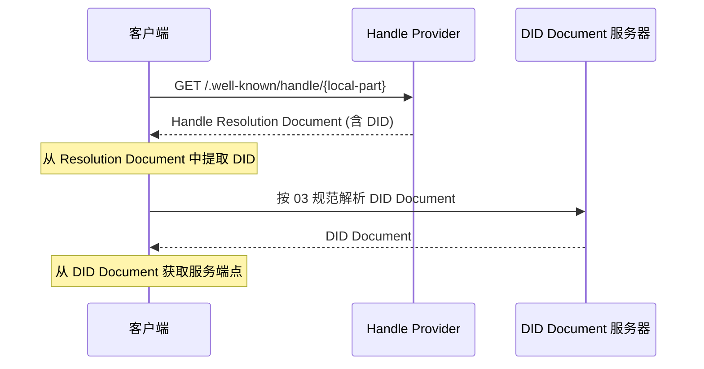
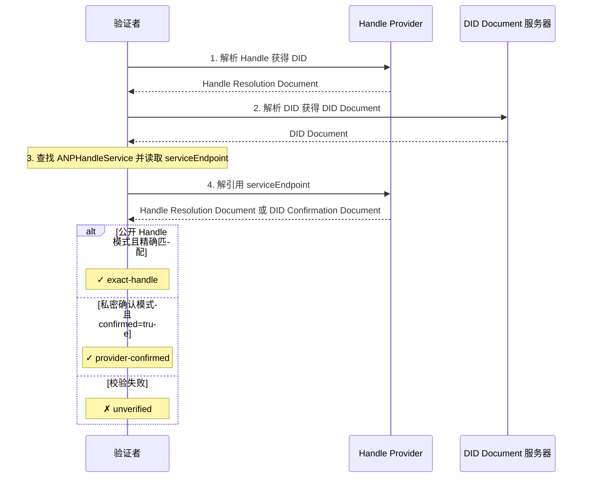

# ANP-基于DID:WBA的命名空间规范 (Draft)

简称：WNS (WBA Name Space)

备注：当前此规范仍是草案版本，会有进一步的优化与迭代。

## 摘要

本规范定义了 WNS（WBA Name Space），一个基于 did:wba 的人类可读命名空间。WNS 引入 Handle（如 `alice.example.com`）作为 `did:wba` DID 的可读别名，通过标准化解析流程将 Handle 映射到 DID，再按 [did:wba 方法规范](03-did-wba方法规范.md) 解析到 DID Document 与服务能力。

Handle 解决了 DID 标识符对人类不友好的问题——`did:wba:example.com:user:alice:e1_<fingerprint>` 这样的标识符对机器友好但难以记忆和传播。尤其在最新 did:wba 规范中，路径型 DID 默认会携带绑定公钥指纹，并且当绑定密钥或绑定 profile 变化时，路径型 DID 可能发生轮换。WNS 因而不仅提供类似 email 地址或社交平台用户名的体验，也承担“稳定的人类可读名称层”角色：Handle 可以保持稳定，而底层 did:wba 可以随着绑定密钥变化而轮换。

本规范关于handle相关功能，也可以和原生的did:web方法兼容，兼容方案参考附录A。

## 1. 背景与动机

### 1.1 问题陈述

`did:wba` 方法为智能体提供了去中心化的身份标识能力（详见 [did:wba 方法规范](03-did-wba方法规范.md)），但其标识符格式对人类并不友好：

- **难以记忆**：`did:wba:example.com:user:alice:e1_<fingerprint>` 包含方法前缀、域名、路径和绑定指纹等结构化信息，长度较长
- **难以传播**：在社交场景中分享 DID 标识符不便，容易出错
- **难以输入**：用户手动输入 DID 标识符的体验很差
- **可能轮换**：对于采用默认路径方案的路径型 DID，当绑定密钥或绑定 profile 发生变化时，DID 本身可能变化

这些问题在以下场景中尤为突出：
- 用户之间通过社交渠道分享智能体标识
- 在即时消息中输入收件人
- 在名片、文档、口头交流中引用智能体身份
- 在保持稳定对外引用的同时允许底层 DID 轮换

### 1.2 设计目标

WNS 的设计目标包括：

1. **人类可读**：提供简短、易记、易输入的别名，如 `alice.example.com`
2. **域名无关**：任何拥有域名和 TLS 证书的实体都可以托管 Handle 服务，不依赖特定中心化平台
3. **确定性解析**：Handle 到 DID 的映射关系明确，解析过程标准化
4. **稳定引用**：Handle 作为稳定名称层，允许底层路径型 did:wba 随绑定密钥变化而轮换
5. **双向绑定**：Handle 和 DID 之间支持双向验证，防止单方面篡改
6. **协议集成**：与现有 ANP 协议栈（03/07/08/09 规范）无缝集成
7. **最小化设计**：仅定义命名和解析的核心机制，不规定 Handle 的注册、管理等业务流程

### 1.3 与已有协议的关系

- **03-did:wba 方法规范**：WNS Handle 是 did:wba DID 的可读别名，Handle 解析最终依赖 03 规范完成 DID Document 的获取。对于采用默认路径方案的路径型 DID，WNS 不重新定义绑定指纹生成规则，而直接复用 03 规范。
- **07-智能体描述协议**：Handle 解析后通过 DID Document 的 service 到达 Agent Description 文档
- **08-智能体发现协议**：Handle Provider 可作为智能体发现的补充入口
- **09-端到端即时消息协议**：Handle 可用于收件人的展示和输入，消息路由仍基于 DID

## 2. 术语定义

| 术语 | 定义 |
|------|------|
| **Handle** | 人类可读的短标识符，格式为 `local-part.domain`，如 `alice.example.com` |
| **Handle Provider** | 托管 Handle 解析服务的域名方，负责维护 Handle 到 DID 的映射 |
| **Local Part** | Handle 中的用户标识部分，如 `alice.example.com` 中的 `alice` |
| **Domain** | Handle 的域名部分，如 `alice.example.com` 中的 `example.com` |
| **DID Binding** | Handle 到 DID 的一对一映射关系 |
| **Handle Resolution** | 将 Handle 解析为 DID 的过程 |
| **DID Rotation** | 对于路径型 did:wba，因绑定密钥或绑定 profile 变化导致 DID 发生变化的过程 |
| **WNS** | WBA Name Space，本规范定义的命名空间体系 |
| **Handle Resolution Document** | Handle 解析端点返回的 JSON 文档，包含 Handle 到 DID 的映射信息 |
| **DID Confirmation Endpoint** | Handle Provider 域下的确认端点，用于确认某个 DID 确实由该 Provider 负责解析，而无需在 DID Document 中公开具体 Handle |

## 3. Handle 格式规范

### 3.1 Handle 语法

Handle 采用 DNS 风格的语法，格式为 `local-part.domain`。

**ABNF 定义：**

```abnf
handle     = local-part "." domain
local-part = (ALPHA / DIGIT) *61(ALPHA / DIGIT / "-") (ALPHA / DIGIT)
domain     = ; 合法的完全限定域名 (FQDN)，参见 RFC 1035
```

**语法规则：**

- local-part 仅允许 ASCII 小写字母 `a-z`、数字 `0-9` 和连字符 `-`
- local-part 必须（MUST）以字母或数字开头和结尾
- local-part 中不允许（MUST NOT）出现连续的连字符 `--`
- local-part 长度为 1 到 63 个字符
- domain 必须（MUST）是由 TLS/SSL 证书保护的合法 FQDN
- Handle 的 domain 不携带端口号
- 所有输入在处理前必须（MUST）归一化为小写

**示例：**

```text
alice.example.com          ✓ 有效
bob-smith.example.com      ✓ 有效
agent-42.example.com       ✓ 有效
a.example.com              ✓ 有效（单字符 local-part）
-alice.example.com         ✗ 无效（以连字符开头）
alice-.example.com         ✗ 无效（以连字符结尾）
al--ice.example.com        ✗ 无效（连续连字符）
Alice.Example.com          → 归一化为 alice.example.com
```

### 3.2 URI 表示

为了在传播中明确标识 Handle，可使用 `wba://` 前缀：

```text
wba://alice.example.com
```

`wba://` 前缀仅用于传播和识别场景，语义等价于 Handle 本身。

- 客户端可以（MAY）接受带 `wba://` 前缀的输入；
- 如果客户端接受该前缀，则在解析前必须（MUST）去除 `wba://` 前缀后按标准流程解析；
- 实现不得（MUST NOT）将对 `wba://` 前缀的支持作为互操作前提。

> 注意：`wba://` 尚未在 IANA 注册为正式 URI scheme。实现者也可以使用以下 Web URL 作为替代：
> ```text
> https://{domain}/.well-known/handle/{local-part}
> ```

### 3.3 保留字原则

Handle Provider 应当（SHOULD）维护保留字列表，防止特定 local-part 被注册。协议定义以下保留字分类原则，具体列表由 Handle Provider 自行决定：

**a) 协议保留字**：与 ANP 协议关键字冲突的词汇，如 `did`、`agent`、`well-known`、`service` 等。

**b) 系统保留字**：与常见系统功能冲突的词汇，如 `admin`、`root`、`system`、`api` 等。

**c) 攻击防护保留字**：可能用于钓鱼或混淆攻击的词汇，如 `support`、`security`、`official` 等。

Handle Provider 应当（SHOULD）公开其保留字列表。

## 4. Handle 解析协议

### 4.1 解析流程

Handle 解析遵循以下流程：

```text
Handle → Handle Resolution Endpoint → DID → DID Document → service
```



### 4.2 Handle Resolution Endpoint

Handle Resolution Endpoint 是 Handle Provider 提供的标准化 HTTP 端点：

- **URL**: `https://{domain}/.well-known/handle/{local-part}`
- **方法**: `GET`
- **响应 Content-Type**: `application/json`

其中 `{domain}` 为 Handle 的域名部分，`{local-part}` 为用户标识部分。

**示例请求：**

```http
GET /.well-known/handle/alice HTTP/1.1
Host: example.com
Accept: application/json
```

### 4.3 Handle Resolution Document

Handle Resolution Endpoint 返回的 JSON 文档格式如下：

```json
{
  "handle": "alice.example.com",
  "did": "did:wba:example.com:user:alice:e1_<fingerprint>",
  "status": "active",
  "updated": "2025-01-01T00:00:00Z",
  "versionId": "42",
  "ttl": 300
}
```

**字段说明：**

| 字段 | 必须/可选 | 说明 |
|------|----------|------|
| `handle` | 必须 | 完整的 Handle 标识符 |
| `did` | 必须 | 该 Handle 当前绑定的 did:wba DID |
| `status` | 必须 | Handle 当前状态，取值见 4.7 节 |
| `updated` | 可选 | 最后更新时间，ISO 8601 格式 |
| `versionId` | 可选 | 映射版本标识，用于缓存和排障 |
| `ttl` | 可选 | 建议缓存秒数 |

### 4.3.1 DID Confirmation Endpoint

当 DID 持有者不希望在 DID Document 中公开具体 Handle 时，Handle Provider 可以（MAY）提供 DID Confirmation Endpoint。

**推荐 URL：**

```text
https://{domain}/.well-known/handle/by-did?did={urlencoded-did}
```

- **方法**：`GET`
- **响应 Content-Type**：`application/json`

**响应示例：**

```json
{
  "did": "did:wba:example.com:user:alice:e1_<fingerprint>",
  "confirmed": true,
  "status": "active",
  "updated": "2025-01-01T00:00:00Z",
  "ttl": 300
}
```

**字段说明：**

| 字段 | 必须/可选 | 说明 |
|------|----------|------|
| `did` | 必须 | 被确认的 DID |
| `confirmed` | 必须 | 必须为 `true`，表示该 DID 确实由该 Handle Provider 负责解析 |
| `status` | 可选 | 该 DID 在当前 Handle Provider 中的解析状态 |
| `updated` | 可选 | 最后更新时间，ISO 8601 格式 |
| `ttl` | 可选 | 建议缓存秒数 |

使用 DID Confirmation Endpoint 时，响应文档应当（SHOULD）不直接返回具体 `handle`，以避免在 DID Document 中间接公开 Handle。

### 4.4 Handle 到 DID 映射规则

Handle 与 DID 之间存在唯一对应关系，由 Handle Provider 维护。映射遵循以下规则：

1. **主机名一致性**：Handle 的 domain 部分必须（MUST）与 DID 中的主机名一致；如果 DID authority 包含端口号，则比较时必须（MUST）忽略端口，仅比较主机名
2. **唯一绑定**：一个 Handle 必须（MUST）只绑定一个 DID
3. **local-part 唯一**：同一 domain 内的 local-part 必须（MUST）唯一
4. **不重复定义 did:wba 绑定指纹**：如果 Handle 指向采用默认路径方案的路径型 did:wba，则 DID 路径最后一个绑定指纹段的生成、校验和 profile 语义完全由 03 规范定义，WNS 不重新定义也不覆盖该规则

**映射示例：**

```text
Handle:  alice.example.com
DID:     did:wba:example.com:user:alice:e1_<fingerprint>
```

```text
Handle:  alice.example.com
DID:     did:wba:example.com%3A8800:user:alice:e1_<fingerprint>
```

上例中，Handle 的 domain 为 `example.com`；第二个 DID 虽然包含编码后的端口 `%3A8800`，但其主机名仍为 `example.com`，因此映射仍然有效。Handle 本身不携带端口号；端口只影响 DID Document 的解析位置，不影响 Handle 的文本形式。

### 4.5 did:wba 标准解析

获得 DID 后，必须（MUST）按照 [did:wba 方法规范](03-did-wba方法规范.md) 解析 DID Document。

实现者不得（MUST NOT）绕过 DID Document，直接由 Handle 推断服务端点、绑定密钥或其他 DID 相关信息。DID Document 是智能体能力和服务的权威来源。

### 4.6 Handle 唯一性约束

- 一个 Handle 必须（MUST）只绑定一个 DID
- 同一 domain 内 local-part 必须（MUST）唯一
- 不同 domain 可以有相同的 local-part（去中心化模型）

例如 `alice.example.com` 和 `alice.other.com` 是两个不同的 Handle，指向不同的 DID。

### 4.7 Handle 状态

Handle 有以下三种状态：

| 状态 | 说明 |
|------|------|
| `active` | 正常状态，Handle 可被解析 |
| `suspended` | 暂停状态，暂时不可解析，可恢复 |
| `revoked` | 已撤销，不可恢复 |

### 4.8 错误响应

Handle Resolution Endpoint 应当（SHOULD）返回以下标准 HTTP 状态码：

| 状态码 | 含义 | 说明 |
|--------|------|------|
| `200 OK` | 解析成功 | 返回 Handle Resolution Document |
| `404 Not Found` | Handle 不存在 | 该 local-part 从未注册，或服务端不愿意披露该 Handle 存在 |
| `410 Gone` | Handle 已永久撤销 | 该 Handle 曾经存在但已被 revoked |
| `301 Moved Permanently` | Handle 已迁移 | `Location` 头指向新的 Resolution Endpoint |
| `308 Permanent Redirect` | Handle 已迁移 | 与 `301` 类似，但保持请求语义更明确 |
| `429 Too Many Requests` | 请求过于频繁 | 触发限流时返回，可携带 `Retry-After` |

当返回 `301` 或 `308` 时：

1. `Location` 仅作为迁移提示；
2. 客户端必须（MUST）在新地址重新执行第 6 节定义的双向绑定验证；
3. 客户端不得（MUST NOT）仅依据 HTTP 重定向就接受新的 Handle→DID 绑定关系。

**错误响应示例：**

```json
{
  "error": "handle_not_found",
  "message": "The handle 'bob.example.com' does not exist"
}
```

## 5. Profile URL

### 5.1 Profile 入口

Handle Provider 可以（MAY）为每个 Handle 提供 Profile 访问入口。推荐以下 URL 格式：

- 子域名方式：`https://{local-part}.{domain}/`
- 路径方式：`https://{domain}/{local-part}/`

### 5.2 Profile 格式

Profile 是业务性文档，本规范仅定义 Profile 的 URL 访问入口，不限定其内容格式。Profile 的具体内容和呈现方式由 Handle 使用者和 Handle Provider 自行定义。

Profile URL 是展示或业务入口，不是 Handle→DID 绑定或服务发现的权威来源。实现者不得（MUST NOT）仅根据 Profile URL 推断 DID、服务端点或授权能力；任何安全敏感的身份绑定、消息路由和服务发现仍必须（MUST）以 Handle → DID → DID Document 的标准链路为准。

## 6. 反向验证（双向绑定）

为防止恶意 Handle Provider 将任意 Handle 映射到他人 DID，WNS 定义了双向绑定验证机制。

### 6.1 Handle Provider 声明（正向）

Handle Provider 通过 Resolution Endpoint 声明 Handle 到 DID 的映射关系。这是标准解析流程的一部分（第 4 节）。

### 6.2 DID Document 声明（反向）

DID 持有者在其 DID Document 的 `service` 中添加 `ANPHandleService` 类型的条目，声明其使用的 Handle 绑定服务端点。`ANPHandleService.serviceEndpoint` 不再仅表示 provider domain，而是一个可解引用的 HTTPS 端点。该端点支持以下两种兼容模式：

1. **公开 Handle 模式**：`serviceEndpoint` 直接使用该 Handle 的标准 Resolution Endpoint；
2. **私密确认模式**：`serviceEndpoint` 指向 DID Confirmation Endpoint，用于确认该 DID 确实由该 Handle Provider 负责解析，而不在 DID Document 中公开具体 Handle。

**公开 Handle 模式示例：**

```json
{
  "id": "did:wba:example.com:user:alice:e1_<fingerprint>#handle",
  "type": "ANPHandleService",
  "serviceEndpoint": "https://example.com/.well-known/handle/alice"
}
```

**私密确认模式示例：**

```json
{
  "id": "did:wba:example.com:user:alice:e1_<fingerprint>#handle",
  "type": "ANPHandleService",
  "serviceEndpoint": "https://example.com/.well-known/handle/by-did?did=did%3Awba%3Aexample.com%3Auser%3Aalice%3Ae1_%3Cfingerprint%3E"
}
```

**字段说明：**

- `id`：服务的唯一标识符，建议使用 `#handle` 后缀
- `type`：必须为 `ANPHandleService`
- `serviceEndpoint`：必须（MUST）是位于 Handle Provider 域下、可解引用的 HTTPS 绝对 URI。公开 Handle 模式下，应（SHOULD）直接使用标准 Handle Resolution Endpoint；私密确认模式下，可以（MAY）使用 DID Confirmation Endpoint。

`ANPHandleService` 用于表达 DID 持有者对其 Handle 绑定服务的反向声明。

- 在公开 Handle 模式下，DID 持有者显式声明一个具体 Handle 的 Resolution Endpoint，验证者可以对“输入 Handle 与 DID 是否精确匹配”进行强校验；
- 在私密确认模式下，DID 持有者只声明其所接受的 Handle Provider 及 DID 确认端点，验证者可以确认 provider 关系，但不能仅据此推断某个具体 Handle 已被精确反向确认。

后续版本可以在保持兼容的前提下，引入 `providerDid`、`handleCommitment` 等更强的 Name Service 提供者身份或隐私保护机制。

### 6.3 验证流程

对于以下安全敏感场景，验证者必须（MUST）执行双向绑定验证：

- 身份认证
- 授权决策
- 即时消息收件人解析
- 会触发状态变更、写操作、扣费或资源创建的自动化调用

对于仅用于 UI 展示、搜索预览或目录浏览的场景，验证者可以（MAY）延迟执行双向绑定验证；但一旦进入安全敏感操作，仍必须（MUST）完成该验证。



**验证步骤：**

1. 通过标准 Handle Resolution Endpoint 解析输入 Handle，获得 Handle Resolution Document，并提取其中的 `did`；
2. 按 03 规范解析该 `did`，获得 DID Document；
3. 在 DID Document 的 `service` 中查找 `ANPHandleService` 类型的条目；
4. 验证 `serviceEndpoint` 是否为 `https` 绝对 URI，且其 hostname 与输入 Handle 的 domain 一致；
5. 对 `serviceEndpoint` 发起 `GET` 请求，并解析返回的 JSON 文档；
6. 若 `serviceEndpoint` 等于输入 Handle 的标准 Resolution Endpoint，且返回文档中的 `did` 与步骤 1 的 `did` 一致，且返回文档中的 `handle` 与输入 Handle 完全一致，则视为完成具体 Handle 的精确双向绑定验证；
7. 若返回文档中不包含 `handle`，但包含 `confirmed = true`，且返回文档中的 `did` 与步骤 1 的 `did` 一致，则说明该 DID 确实由该 Handle Provider 负责解析；此结果仅表示 provider 关系已确认；
8. 其他情况均必须（MUST）视为验证失败或验证强度不足。

对于需要确认“具体 Handle”的安全敏感场景，验证者必须（MUST）获得第 6 步定义的精确双向绑定验证结果；第 7 步的 provider 确认结果不足以单独满足此类场景。

### 6.3.1 ANPHandleService 的使用规则（v2）

验证者在执行双向绑定校验时，应按以下规则使用 `ANPHandleService.serviceEndpoint`：

1. 根据输入 Handle 提取其 domain 与 local-part，并构造该 Handle 的标准 Resolution Endpoint：`https://{domain}/.well-known/handle/{local-part}`；
2. 通过该 Resolution Endpoint 解析 Handle，获得 Handle Resolution Document，并提取其中的 `did`；
3. 按 03 规范解析该 `did` 对应的 DID Document；
4. 在 DID Document 的 `service` 中查找 `type = "ANPHandleService"` 的条目；
5. 验证该条目 `serviceEndpoint` 为 `https` 绝对 URI，且其 hostname 必须（MUST）与步骤 1 中的 Handle domain 一致；
6. 对 `serviceEndpoint` 发起 `GET` 请求，并获取返回的 JSON 文档；
7. 若 `serviceEndpoint` 与步骤 1 构造出的标准 Resolution Endpoint 完全一致，且返回文档中的 `did` 与步骤 2 中的 `did` 一致，且返回文档中的 `handle` 与输入 Handle 完全一致，则该 Handle 与 DID 视为已完成精确双向绑定验证；
8. 若返回文档中不包含 `handle`，但包含 `confirmed = true`，且返回文档中的 `did` 与步骤 2 中的 `did` 一致，则说明该 DID 确实由该 `ANPHandleService` 所在的 Handle Provider 负责解析；此结果仅表示 provider 关系已确认，不得单独视为某个具体 Handle 与该 DID 已完成精确双向绑定验证；
9. 若不存在 `ANPHandleService`、`serviceEndpoint` 非 `https`、hostname 不一致、`serviceEndpoint` 解引用失败、返回文档中的 `did` 不一致、或第 7 / 8 步校验失败，则该绑定不得视为已验证；
10. 对于身份认证、授权决策、消息发送前收件人确认等需要确认“具体 Handle”的安全敏感场景，验证者必须（MUST）获得第 7 步定义的“精确双向绑定验证”结果；仅第 8 步的 provider 确认结果不足以满足此类要求。

**说明：**

- 当 DID 持有者愿意公开其 Handle 时，`ANPHandleService.serviceEndpoint` 应（SHOULD）直接使用该 Handle 的标准 Resolution Endpoint；
- 当 DID 持有者不愿在 DID Document 中公开其 Handle 时，`ANPHandleService.serviceEndpoint` 可以（MAY）指向 DID Confirmation Endpoint，该端点返回 `did` 与 `confirmed = true`；
- 后续版本可以在保持兼容的前提下引入 `providerDid`、`handleCommitment` 或其他更强的隐私保护绑定机制。

### 6.3.2 验证结果语义

为避免把不同强度的验证结果混为一谈，实现者应当（SHOULD）至少区分以下三种结果：

| 结果 | 说明 |
|------|------|
| `exact-handle` | 输入 Handle 与 DID 完成精确双向绑定验证 |
| `provider-confirmed` | DID 与 Handle Provider 的解析关系已确认，但未确认某个具体 Handle |
| `unverified` | 未通过校验，或仅获得不足以信任的结果 |

`provider-confirmed` 适合 DID-first、目录浏览或隐私友好的 provider 归属确认场景；`exact-handle` 才能满足具体 Handle 绑定的高保证场景。

## 7. 与 ANP 协议栈的集成

### 7.1 与 DID Document（03 规范）

DID Document 的 `service` 中新增 `ANPHandleService` 类型，用于支持反向验证（第 6 节）。

```json
{
  "service": [
    {
      "id": "did:wba:example.com:user:alice:e1_<fingerprint>#ad",
      "type": "AgentDescription",
      "serviceEndpoint": "https://example.com/agents/alice/ad.json"
    },
    {
      "id": "did:wba:example.com:user:alice:e1_<fingerprint>#handle",
      "type": "ANPHandleService",
      "serviceEndpoint": "https://example.com/.well-known/handle/alice"
    }
  ]
}
```

对于采用默认路径方案的 did:wba，WNS 不定义绑定指纹的格式，也不通过 WNS 重复定义 `e1_` / `k1_` 规则；这些语义完全由 03 规范负责。

上例展示的是公开 Handle 模式。若 DID 持有者不希望在 DID Document 中公开具体 Handle，则 `ANPHandleService.serviceEndpoint` 也可以（MAY）改为 DID Confirmation Endpoint，例如：

```json
{
  "id": "did:wba:example.com:user:alice:e1_<fingerprint>#handle",
  "type": "ANPHandleService",
  "serviceEndpoint": "https://example.com/.well-known/handle/by-did?did=did%3Awba%3Aexample.com%3Auser%3Aalice%3Ae1_%3Cfingerprint%3E"
}
```

在该模式下，验证者只能确认 provider 关系，而不能仅据此把某个具体 Handle 视为已完成精确双向绑定验证。

### 7.2 与智能体描述协议（07 规范）

Agent Description 文档中可以（MAY）包含可选的 `handle` 字段：

```json
{
  "protocolType": "ANP",
  "protocolVersion": "1.0.0",
  "type": "AgentDescription",
  "did": "did:wba:example.com:user:alice:e1_<fingerprint>",
  "handle": "alice.example.com",
  "name": "Alice's Agent",
  "description": "..."
}
```

`handle` 字段为可选项，用于方便其他智能体获取人类可读的标识。其权威绑定关系仍以 WNS 解析结果和 DID Document 为准。

### 7.3 与智能体发现协议（08 规范）

在 `.well-known/agent-descriptions` 返回的集合中，每个条目可以（MAY）包含可选的 `handle` 字段：

```json
{
  "@type": "ad:AgentDescription",
  "name": "Alice's Agent",
  "@id": "https://example.com/agents/alice/ad.json",
  "handle": "alice.example.com"
}
```

此外，Handle Provider 的 `/.well-known/handle/` 路径可作为智能体发现的补充入口。

### 7.4 与即时消息协议（09 规范）

Handle 可用于即时消息场景中收件人的展示和输入：

- 用户可以通过输入 Handle（如 `alice.example.com`）来指定消息接收者
- 客户端将 Handle 解析为 DID 后进行消息路由
- 消息界面中可以将 DID 替换为 Handle 展示，提升可读性

消息路由和传输仍基于 DID，Handle 仅用于人机交互层面的展示和输入。

## 8. Handle Provider 要求

### 8.1 解析服务要求

Handle Provider 必须（MUST）满足以下要求：

- 必须（MUST）通过 HTTPS 提供解析服务
- 必须（MUST）实现 `/.well-known/handle/{local-part}` 端点
- 可以（MAY）实现 `/.well-known/handle/by-did` DID Confirmation Endpoint
- 应当（SHOULD）支持 HTTP 缓存头（至少 `Cache-Control`、`ETag`；可选支持 `Last-Modified`）
- 应当（SHOULD）实施速率限制，防止滥用
- 当返回 `429 Too Many Requests` 时，应当（SHOULD）携带 `Retry-After`
- 当 Handle 处于迁移或底层 DID 轮换窗口时，应当（SHOULD）降低缓存 TTL

### 8.2 Handle 管理

- Handle Provider 负责 Handle 的分配和生命周期管理
- Handle 的注册流程、身份验证方式、长度策略等由 Handle Provider 自行定义
- Handle Provider 必须（MUST）保证同一 domain 下 Handle 的唯一性

### 8.3 Handle Provider 迁移

用户可能需要将 Handle 从一个 Handle Provider 迁移到另一个。在迁移过程中：

- 旧 Handle Provider 可以（MAY）返回 `301 Moved Permanently` 或 `308 Permanent Redirect`，`Location` 头指向新 Handle Provider 的 Resolution Endpoint
- 迁移期间应当（SHOULD）同时维持新旧 Handle Provider 的解析能力
- DID 持有者需要更新 DID Document 中的 `ANPHandleService`，使其继续指向新 Handle Provider 域下的公开 Handle Resolution Endpoint 或 DID Confirmation Endpoint
- 客户端在新地址解析到结果后，必须（MUST）重新执行双向绑定验证，不得仅凭重定向接受新的绑定关系
- 如果未来需要在不改变当前互操作模式的前提下表达更强的 provider 身份，可在后续版本引入 `providerDid` 机制

### 8.4 底层 DID 轮换

对于采用默认路径方案的路径型 did:wba，当绑定密钥变化，或者 binding profile 在 `e1_` / `k1_` 之间切换时，底层 DID 会发生轮换。WNS 在此场景下的要求如下：

- Handle 可以（MAY）保持不变，以提供稳定的人类可读名称
- Handle Provider 应当（SHOULD）在新的 DID Document 可用后，尽快将 Handle 映射更新到新的 DID
- 在轮换窗口中，Handle Provider 应当（SHOULD）降低缓存 TTL，以减少客户端使用旧映射的时间
- 客户端不得（MUST NOT）假定 Handle 永远绑定同一个 DID；当前解析结果才是该 Handle 的权威当前 DID
- 对于安全敏感操作，客户端在使用 Handle 获得新的 DID 后，必须（MUST）重新执行双向绑定验证
- 若上层操作要求确认某个具体 Handle，则客户端必须（MUST）要求得到 `exact-handle` 结果，而不能仅接受 `provider-confirmed`
- 旧 DID 的停用、保留或并行存在策略，由 03 规范与具体部署共同决定；WNS 只负责稳定名称与当前 DID 的映射

## 9. 安全考虑

### 9.1 域名安全

WNS 的安全模型与 did:wba 方法一致，依赖 TLS/SSL 证书体系。Handle 的域名部分必须（MUST）由有效的 TLS 证书保护。Handle Provider 的安全性等同于其域名和 TLS 配置的安全性。

### 9.2 钓鱼与混淆攻击

WNS 通过以下机制降低钓鱼和混淆风险：

- local-part 限制为 ASCII 小写字母、数字和连字符，避免 Unicode 同形攻击
- Handle Provider 应当（SHOULD）维护保留字列表（见 3.3 节）
- 客户端应当（SHOULD）在展示 Handle 时突出显示域名部分，帮助用户识别来源

### 9.3 Handle 抢注

Handle Provider 应当（SHOULD）采取措施防止恶意抢注，包括但不限于：

- 维护保留字列表
- 实施注册审核机制
- 提供争议解决流程

具体策略由 Handle Provider 自行定义。

### 9.4 隐私考虑

- Handle Resolution Endpoint 会暴露 Handle 的存在性（例如通过 200 / 404 / 410 的差异），Handle Provider 应当（SHOULD）实施速率限制以减缓枚举攻击
- Handle Provider 不应当（SHOULD NOT）在 Resolution Endpoint 中返回除映射关系之外的敏感信息
- Handle Provider 应当（SHOULD）尽量统一错误响应结构，避免通过过多差异化字段泄露不必要的状态信息
- DID 持有者如果不希望在 DID Document 中公开具体 Handle，可以（MAY）使用 DID Confirmation Endpoint 模式，仅返回 provider 级确认信息
- 对于仅用于展示的场景，客户端可以（MAY）延迟执行双向绑定，以减少无必要的跨站解析请求

### 9.5 防篡改

WNS 的核心防篡改机制是双向绑定验证（第 6 节）：

1. Handle Provider 通过标准 Resolution Endpoint 正向声明 Handle → DID；
2. DID 持有者在 DID Document 中通过 `ANPHandleService` 反向声明一个位于同一 Handle Provider 域下、可解引用的 HTTPS 端点；
3. 验证者解引用该端点，并根据返回结果区分 `exact-handle` 与 `provider-confirmed`；
4. 对于需要确认具体 Handle 的高保证场景，验证者必须（MUST）要求 `exact-handle`，不得以 `provider-confirmed` 代替；
5. 后续版本可以进一步引入 `providerDid`、`handleCommitment` 等机制，提供更强的 Name Service 提供者身份验证与隐私保护能力。

对于采用默认路径方案的路径型 did:wba，DID 本身还可能携带由 03 规范定义的绑定指纹段（如 `e1_...` 或 `k1_...`），这属于 did:wba 方法层的绑定机制，不由 WNS 重新定义。

WNS 不再单独定义“由 Handle Provider 自行决定算法和编码方式的公钥指纹扩展”，以避免与 did:wba 默认路径方案发生重复定义或语义冲突。

## 10. 用例

### 10.1 社交传播

用户 Alice 可以在社交媒体上分享 `wba://alice.example.com`，其他用户看到后：

1. 识别 `wba://` 前缀，去除前缀得到 Handle `alice.example.com`
2. 解析 Handle 获得 DID
3. 通过 DID Document 获取 Alice 的智能体描述和服务端点
4. 与 Alice 的智能体建立交互

### 10.2 智能体间通信

智能体 A 需要与 Handle 为 `bob.example.com` 的智能体 B 通信：

1. 解析 Handle `bob.example.com` 获得 DID
2. 按 03 规范解析 DID Document
3. 从 DID Document 的 service 中获取 AgentDescription 端点
4. 获取 Agent Description 文档，了解智能体 B 的能力和接口
5. 根据接口定义发起通信

### 10.3 即时消息

用户在即时消息应用中输入收件人 Handle `carol.example.com`：

1. 客户端解析 Handle 获得 DID
2. 通过 DID Document 获取消息服务端点
3. 使用 09 规范定义的即时消息协议发送消息
4. 消息界面中显示收件人的 Handle 而非 DID

### 10.4 稳定 Handle 与 DID 轮换

用户 Alice 对外长期使用 Handle `alice.example.com`。一段时间后，由于绑定密钥轮换，底层路径型 did:wba 从：

```text
did:wba:example.com:user:alice:e1_<old-fingerprint>
```

轮换为：

```text
did:wba:example.com:user:alice:e1_<new-fingerprint>
```

在该过程中：

1. Alice 的 Handle `alice.example.com` 保持不变
2. Handle Provider 将该 Handle 的映射更新为新的 DID
3. Alice 更新新 DID Document 中的 `ANPHandleService`
4. 解析者重新执行双向绑定验证后，继续通过同一个 Handle 找到 Alice 的当前 DID

## 11. 规范性要求摘要

以下整理本规范中所有 MUST/SHOULD/MAY 要求（术语定义遵循 [RFC 2119](https://www.rfc-editor.org/rfc/rfc2119)）：

### MUST（必须）

1. Handle 的 local-part 必须以字母或数字开头和结尾
2. Handle 的 local-part 中不得出现连续连字符
3. Handle 的 domain 必须是由 TLS/SSL 证书保护的合法 FQDN
4. 所有 Handle 输入必须归一化为小写
5. 如果客户端接受 `wba://` 前缀输入，则解析前必须去除该前缀
6. Handle 的 domain 部分必须与 DID 中的主机名一致；若 DID 包含端口，比较时必须忽略端口
7. 一个 Handle 必须只绑定一个 DID
8. 同一 domain 内 local-part 必须唯一
9. 获得 DID 后必须按 03 规范解析 DID Document
10. 不得绕过 DID Document 直接由 Handle 推断服务端点、绑定密钥或其他 DID 信息
11. Handle Provider 必须通过 HTTPS 提供解析服务
12. Handle Provider 必须实现 `/.well-known/handle/{local-part}` 端点
13. 在身份认证、授权决策、即时消息收件人解析及其他安全敏感场景中，验证者必须执行双向绑定验证
14. `ANPHandleService.serviceEndpoint` 必须是位于 Handle Provider 域下的 HTTPS 绝对 URI；执行校验时，其 hostname 必须与输入 Handle 的 domain 一致
15. 执行双向绑定校验时，验证者必须解引用 `ANPHandleService.serviceEndpoint`
16. 若要将某个具体 Handle 视为已验证绑定，验证者必须获得 `exact-handle` 结果
17. `provider-confirmed` 结果不得单独视为某个具体 Handle 与 DID 已完成精确双向绑定验证
18. 当客户端跟随 `301` / `308` 迁移到新 Resolution Endpoint 后，必须重新执行双向绑定验证，不得仅依据重定向接受新的绑定关系
19. 对于底层 DID 轮换后的安全敏感操作，客户端必须重新执行双向绑定验证
20. Profile URL 不得作为 Handle→DID 绑定或服务发现的权威来源

### SHOULD（应当）

1. Handle Provider 应维护并公开保留字列表
2. Handle Resolution Endpoint 应支持 HTTP 缓存头
3. Handle Resolution Endpoint 应实施速率限制
4. Handle 迁移时旧 Provider 应返回 301 或 308 重定向提示
5. 客户端展示 Handle 时应突出显示域名部分
6. Handle Provider 不应在 Resolution Endpoint 中返回敏感信息
7. Handle Provider 在迁移或底层 DID 轮换窗口中应降低缓存 TTL
8. Handle Provider 在返回 `429 Too Many Requests` 时应携带 `Retry-After`
9. Handle Provider 应尽量统一错误响应结构，减少不必要的状态侧漏
10. DID 持有者在愿意公开具体 Handle 时，应直接使用该 Handle 的标准 Resolution Endpoint 作为 `ANPHandleService.serviceEndpoint`
11. 使用 DID Confirmation Endpoint 时，响应文档应不直接返回具体 `handle`
12. 实现者应区分 `exact-handle`、`provider-confirmed` 与 `unverified` 三种结果
13. DID 持有者在 Handle Provider 迁移后应更新 DID Document 中的 `ANPHandleService`
14. 当底层路径型 DID 轮换时，Handle Provider 应尽快将 Handle 映射更新到新的 DID

### MAY（可以）

1. 客户端可以接受带 `wba://` 前缀的输入
2. Handle Provider 可以为 Handle 提供 Profile 入口
3. Agent Description 文档中可以包含 `handle` 字段
4. 智能体发现集合中的条目可以包含 `handle` 字段
5. 对于仅用于 UI 展示、搜索预览或目录浏览的场景，验证者可以延迟执行双向绑定验证
6. Handle Provider 可以实现 `/.well-known/handle/by-did` DID Confirmation Endpoint
7. DID 持有者在不希望公开具体 Handle 时，可以使用 DID Confirmation Endpoint 作为 `ANPHandleService.serviceEndpoint`
8. Handle 可以在底层路径型 DID 轮换时保持不变，以提供稳定的人类可读名称

## 附录 A：原生`did:web` 兼容方案

参考文档[附录B：与原生did-web-的兼容.md](/chinese/附录B：与原生did-web-的兼容.md)

## 参考文献

- [W3C DID Core Specification](https://www.w3.org/TR/did-core/)
- [RFC 2119 - Key words for use in RFCs to Indicate Requirement Levels](https://www.rfc-editor.org/rfc/rfc2119)
- [RFC 1035 - Domain Names - Implementation and Specification](https://www.rfc-editor.org/rfc/rfc1035)
- [RFC 6585 - Additional HTTP Status Codes](https://www.rfc-editor.org/rfc/rfc6585)
- [RFC 8615 - Well-Known URIs](https://www.rfc-editor.org/rfc/rfc8615)
- [RFC 9110 - HTTP Semantics](https://www.rfc-editor.org/rfc/rfc9110)
- [ANP 技术白皮书](01-AgentNetworkProtocol技术白皮书.md)
- [DID:WBA 方法设计规范](03-did-wba-method-specification.md)
- [智能体描述协议规范](07-ANP-智能体描述协议规范.md)
- [智能体发现协议规范](08-ANP-智能体发现协议规范.md)
- [端到端即时消息协议规范](09-ANP-端到端即时消息协议规范.md)

## 版权声明

Copyright (c) 2024 ANP Community  
本文件依据 [MIT 许可证](LICENSE) 发布，您可以自由使用和修改，但必须保留本版权声明。
