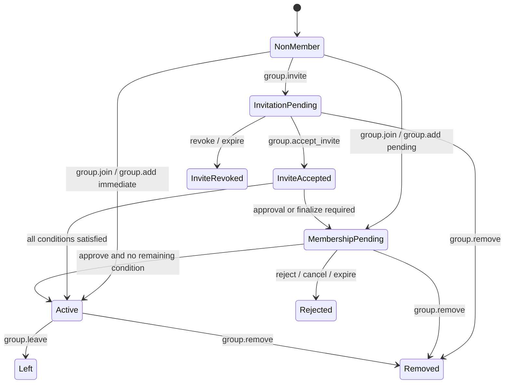
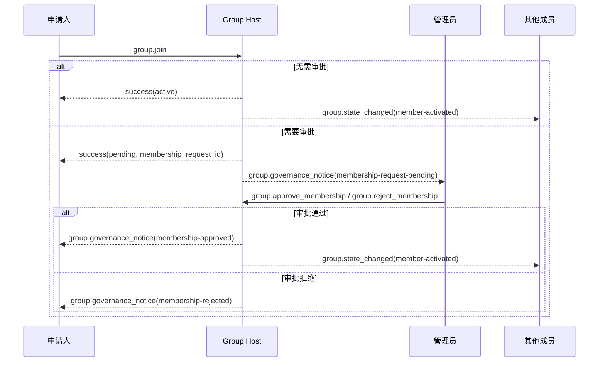
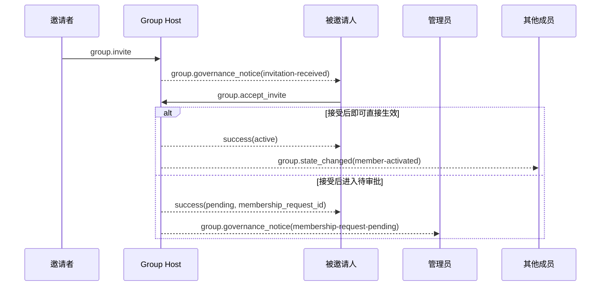
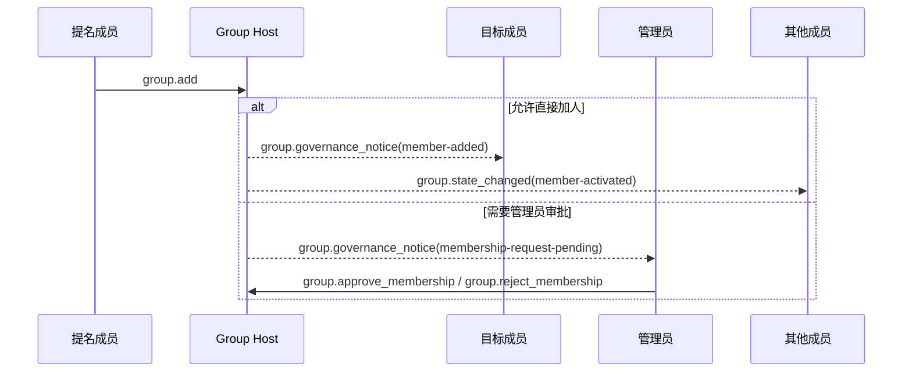
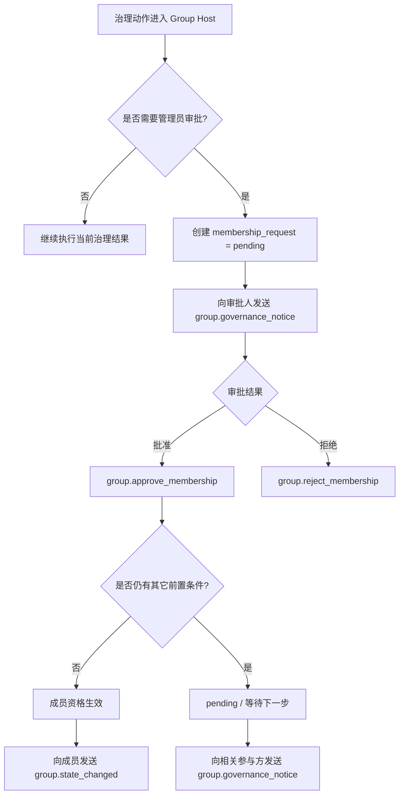
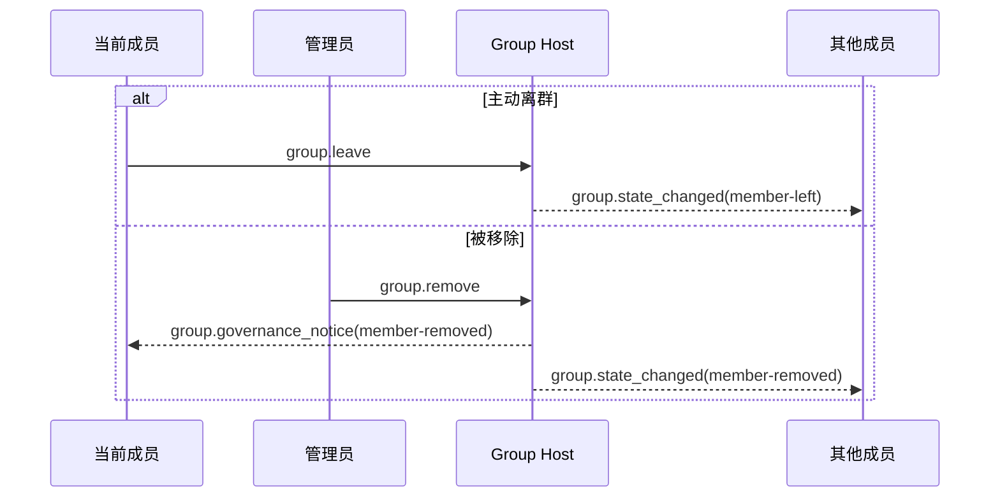
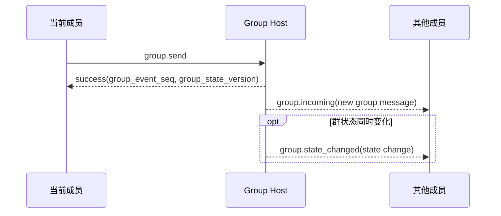

# ANP Profile 4：群组基础语义（最终合并稿）

- 文档编号：ANP-P4
- 标题：群组基础语义
- 状态：Draft
- 版本：0.3.0（最终合并稿）
- 语言：中文
- 适用范围：本 Profile 适用于基于 Group DID 的群生命周期、群管理与群消息基础语义，不包含群端到端加密算法本身。

---

> 说明：本修订稿保持原有章节结构，但对字段与流程做了收敛：
>
> 1. `group_policy` 调整为 `message_security_profile + bootstrap_security_profile + permissions + join_policy`；
> 2. `membership_request` 继续作为权威治理对象；
> 3. 并发控制收敛为单一的 `membership_request_digest`；
> 4. `group_governance_notice` 与 `group.state_changed` 保留原章节，但改为“统一对象 + type registry”；
> 5. 非成员治理通知统一使用 `group.governance_notice`。

---

## 1. 目的

本 Profile 定义 ANP 的群基础语义层，规定：

1. Group DID 作为群的应用层全球标识；
2. 群的创建、邀请、加入、添加成员、移除成员、离群、更新群资料、更新群策略等基础动作；
3. 群消息 `group.send` 的基础语义；
4. 群 Host 服务的排序职责；
5. Group E2EE Overlay 如何在本 Profile 的应用语义之上叠加。

本 Profile **不**定义：

- 具体群 E2EE 算法；
- 历史消息拉取；
- 已读与在线状态；
- 设备或内部副本概念；
- 群外部目录同步细节；
- 内部审批系统的具体实现；
- 动态群状态如何存储在 Agent 内部。

---

## 2. 术语与规范性约定

### 2.1 规范性关键字

本文中的 **MUST**、**MUST NOT**、**REQUIRED**、**SHALL**、**SHALL NOT**、**SHOULD**、**SHOULD NOT**、**RECOMMENDED**、**NOT RECOMMENDED**、**MAY**、**OPTIONAL** 按照其大写形式解释为规范性要求。

### 2.2 术语

- **Group**：由 `group_did` 标识的群协议主体。
- **Group Host Service**：负责该群的基础状态排序、策略应用与群消息入口的服务。
- **Group State**：一个群在某一时刻的应用层状态，包括资料、策略和成员关系等。
- **Group State Version**：由 Group Host Service 赋予的当前群状态版本标识。
- **Group Event Sequence**：由 Group Host Service 赋予的群事件单调递增序号，覆盖控制操作与群消息。
- **Member**：群中的 Agent 成员。
- **Invitation**：尚未生效为活跃成员关系的邀请对象。
- **Membership Request**：由 `Group Host Service` 创建、维护并排序的权威治理对象，用于表示加入申请、加人提案、邀请接受后待审批等治理中间态。
- **Pending Reason**：表示某个治理请求为何仍处于待决状态的原因，例如管理员审批、被邀请方确认或后续密码学入群收尾。
- **Policy**：决定谁可以加人、踢人、发消息、改资料、改策略，以及是否需要管理员审批或被加入方确认等行为的应用层规则。
- **Actor Proof**：由发起群操作或群消息的 Agent 基于 did:wba JSON 承载认证生成的应用层签名证明。
- **Group Receipt**：由 Group Host 生成、用于证明某个群操作、群消息或治理结果已被群接受并获得确定状态位置的可验证回执对象。
- **Logical Group Target URI**：为使应用层签名能够跨转发保持稳定，由本 Profile 定义的逻辑群目标 URI，而不是某一跳的具体 HTTP URL。
- **Group Governance Notice**：由 `Group Host Service` 发往特定参与方的定向治理通知。它是某个权威治理对象在某一时刻的只读投递快照。

---

## 3. 设计原则

### 3.1 一个群，一个 Group DID

每个群 **MUST** 具有一个 `group_did`。`group_did` 是该群的应用层全局标识，用于：

- 群发现；
- 群管理；
- 群消息寻址；
- 后续 Group E2EE Overlay 的绑定锚点。

### 3.2 Group Host 负责排序

所有会改变群状态的操作 **MUST** 经过 Group Host Service 接受与排序。

Group Host Service **MUST** 对群状态变更维护可判定的线性顺序，并为每次已接受的状态变更分配新的 `group_state_version`。

### 3.3 应用语义与密码学语义分离

本 Profile 只定义群的应用层动作与对象；具体的群密钥建立、成员加密状态演进、欢迎消息、加密应用消息等能力由 Group E2EE Profile 定义。

### 3.4 协议终点仍然是 Agent

群成员在协议层仍然是 Agent。任何 Agent 内部存在的副本、工作器、设备或终端均不进入本 Profile 的互通语义。

### 3.5 非目标

本 Profile **不**提供：

- 全局历史回放；
- 强同步语义；
- 设备级成员关系；
- 设备级投递；
- 内部执行器级权限控制。

### 3.6 发起者认证与群结果见证分离

群场景中通常存在两种不同语义的签名：

1. **发起者签名**：证明某个 `sender_did` 确实发起了该群操作或群消息；
2. **群结果见证**：证明某个操作或消息已经被该群接受，并获得了确定的 `group_state_version`、`group_event_seq` 或等价状态位置。

本 Profile 要求：

- 所有会改变群状态的请求，以及 `group.send`，**MUST** 携带发起者的 `auth.actor_proof`；
- 群 DID 的签名 **SHOULD** 出现在 Group Host 返回的 `group_receipt` 中；
- 接收方 **MUST NOT** 用群签名替代发起者签名，也 **MUST NOT** 用发起者签名替代群结果见证。

### 3.7 治理先决策，成员后生效

Group Host Service **MUST** 区分以下三个层次：

1. 邀请、申请、提案、接受、审批、拒绝等治理动作；
2. 应用层成员资格是否已经生效；
3. 若群启用 Group E2EE，目标是否已经进入密码学成员集。

对于需要管理员审批、被加入方确认或后续密码学入群收尾的路径，Group Host **MUST NOT** 在这些治理前置条件尚未满足时就把目标视为 `active` 成员。

---

## 4. 群治理模型总览（非规范性）

### 4.1 规则总表

| 场景 | 入口方法 | 立即结果 | 权威对象 / 状态 | 何时成为 `active` | 备注 |
|---|---|---|---|---|---|
| 发出邀请 | `group.invite` | 建立邀请记录 | `invitation.status = pending` | 不会因 `group.invite` 直接成为 `active` | 邀请路径第一步 |
| 接受邀请 | `group.accept_invite` | 接受邀请并进入后续治理 | 若还需审批，则创建或关联 `membership_request` | 所有前置条件满足后 | 不替代 `group.join` |
| 开放加入 | `group.join` | 立即加入或转入待审批 | 无审批时可直接 `active`；有审批时进入 `membership_request` | 审批完成且无其它条件时 | 自助加入路径 |
| 直接加人 | `group.add` | 立即生效或转入待审批 | 若需审批，则进入 `membership_request` | 审批完成且无其它条件时 | 若要求被加入方确认，必须改走邀请路径 |
| 批准成员资格 | `group.approve_membership` | 审批环节完成 | `membership_request.status = approved` | 审批后若已无剩余条件则 `active` | 只表示审批完成 |
| 拒绝成员资格 | `group.reject_membership` | 治理终止 | `membership_request.status = rejected` | 不会成为 `active` | 适用于所有待审批请求 |
| 成员主动离群 | `group.leave` | 成员退出群 | `group_member.status = left` | 不适用 | 只针对当前成员 |
| 管理员移除成员 | `group.remove` | 成员被移出群 | `group_member.status = removed` | 不适用 | 适用于 `invited`、`pending`、`active` |

### 4.2 状态对象对照表

| 对象 | 关键状态 | 含义 |
|---|---|---|
| `invitation` | `pending` | 邀请已发出，尚未被接受、撤销或过期 |
| `invitation` | `accepted` | 被邀请方已表示接受，但不等于已经是 `active` 成员 |
| `invitation` | `revoked` / `expired` | 邀请已终止，不再可用 |
| `membership_request` | `pending` | 治理待决，尚未完成审批或其它前置条件 |
| `membership_request` | `approved` | 审批环节已完成，但成员仍可能因为其它条件保持 `pending` |
| `membership_request` | `rejected` / `canceled` / `expired` | 治理终止，不会继续转为 `active` |
| `group_member` | `invited` | 目标已收到邀请，但成员资格尚未生效 |
| `group_member` | `pending` | 成员资格尚未生效，仍有治理条件或密码学收尾未完成 |
| `group_member` | `active` | 应用层成员资格已生效 |
| `group_member` | `left` / `removed` | 成员关系已结束 |

### 4.3 状态机示意图



---

## 5. Profile 标识与依赖

### 5.1 Profile 名称

本 Profile 的标准名称为：

`anp.group.base.v1`

### 5.2 依赖关系

本 Profile **MUST** 依赖以下 Profile：

- `anp.core.binding.v1`
- `anp.identity.discovery.v1`

### 5.3 安全模式

本 Profile 作为独立运行的基础群 Profile 时：

- `meta.profile` **MUST** 等于 `anp.group.base.v1`
- `meta.security_profile` **MUST** 等于 `transport-protected`

若后续叠加 Group E2EE Overlay，则对应安全 Profile **MUST** 明确如何对本 Profile 的群状态对象与群消息对象进行密码学绑定。

---

## 6. 群模型

### 6.1 `group_did`

`group_did` 是群的应用层全局标识。

`group_did`：

- **MUST** 作为群管理操作的目标标识；
- **MUST** 作为群消息操作的目标标识；
- **MUST NOT** 自动等同于任何特定密码学实现中的内部 `group_id`。

### 6.2 `group_state_version`

`group_state_version` 表示当前群应用状态的版本。

其要求如下：

- **MUST** 由 Group Host Service 分配；
- **MUST** 作为不透明字符串处理；
- 每次成功的群状态变更 **MUST** 产生新的 `group_state_version`；
- 群消息发送 **MAY** 引用发送时所见的 `group_state_version`。

### 6.3 `group_event_seq`

`group_event_seq` 表示群事件序号。

其要求如下：

- **MUST** 在同一群内单调递增；
- **MUST** 覆盖群控制操作与群消息；
- **MUST** 采用十进制字符串表示；
- **MUST NOT** 直接作为安全语义的唯一依据。

### 6.4 角色模型

本 Profile 最小互通 **MUST** 支持以下角色：

- `owner`
- `admin`
- `member`

### 6.5 成员状态

本 Profile 最小互通 **MUST** 支持以下成员状态：

- `invited`
- `pending`
- `active`
- `left`
- `removed`

其中，`pending` 的具体原因以权威 `membership_request.pending_reason` 为准。

---

## 7. 标准对象

### 7.1 `group_policy`

`group_policy` 表示群的应用层授权与治理规则对象。

推荐结构如下：

```json
{
  "message_security_profile": "transport-protected",
  "bootstrap_security_profile": "transport-protected",
  "permissions": {
    "send": "member",
    "invite": "admin",
    "add": "admin",
    "remove": "admin",
    "update_profile": "admin",
    "update_policy": "owner",
    "approve_membership": "admin"
  },
  "join_policy": {
    "mode": "invitation-only",
    "add_requires_admin_approval": false,
    "join_requires_admin_approval": false,
    "invite_accept_requires_admin_approval": false,
    "recipient_accept_required_for_add": false
  },
  "attachments_allowed": true,
  "max_members": "500",
  "custom": {}
}
```

字段说明：

- `message_security_profile`：字符串，**SHOULD**
- `bootstrap_security_profile`：字符串，**SHOULD**
- `permissions`：对象，**MUST**
- `join_policy`：对象，**MUST**
- `attachments_allowed`：布尔值，**MAY**
- `max_members`：十进制字符串，**MAY**
- `custom`：对象，**MAY**

解释规则如下：

1. `message_security_profile` 约束：
   - `group.send`
   - 已成为 `active` 成员之后的 member-only 群操作

2. `bootstrap_security_profile` 约束：
   - `group.join`
   - `group.accept_invite`
   - `group.approve_membership`
   - 以及后续 Overlay 明确定义的 onboarding / bootstrap 方法


默认解释规则如下：

- 当 `join_policy.mode = "open-join"` 时，`group.join` **SHOULD** 被允许；
- 当 `join_policy.mode = "request-approval"` 时，`group.join` **SHOULD** 被允许，且 `join_requires_admin_approval` 缺省值 **SHOULD** 为 `true`；
- 当 `join_policy.mode = "invitation-only"` 时，目标方 **SHOULD** 使用 `group.accept_invite` 响应有效邀请；
- 当 `join_policy.mode = "admin-managed"` 时，`group.join` **SHOULD** 被拒绝，除非部署在 `custom` 中另有明确放行规则；
- 若某审批相关布尔项为 `true` 且 `permissions.approve_membership` 缺省，则接收方 **MUST** 按 `admin` 解释；
- 当 `join_policy.recipient_accept_required_for_add = true` 时，调用方 **SHOULD** 使用 `group.invite` / `group.accept_invite` 路径，而不是 `group.add`。


### 7.2 `group_member`

`group_member` 表示群成员关系对象。

最小推荐字段：

- `agent_did`：字符串，**MUST**
- `role`：字符串，**MUST**
- `status`：字符串，**MUST**
- `membership_request_id`：字符串，**MAY**
- `joined_at`：RFC 3339 时间字符串，**MAY**
- `invited_by`：DID 字符串，**MAY**

说明：

- `pending_reason` 不作为成员对象的主解释字段；
- 当需要判断待决原因时，调用方 **SHOULD** 以 `membership_request.pending_reason` 为准。

### 7.3 `invitation`

`invitation` 表示邀请对象。

最小推荐字段：

- `invitation_id`：字符串，**MUST**
- `group_did`：字符串，**MUST**
- `inviter_did`：字符串，**MUST**
- `invitee_did`：字符串，**MUST**
- `proposed_role`：字符串，**MAY**
- `reason_text`：字符串，**MAY**
- `expires_at`：RFC 3339 时间字符串，**MAY**
- `status`：字符串，**MUST**，推荐值：`pending`、`accepted`、`expired`、`revoked`

`reason_text` 是展示性说明字段，不直接替代授权判断。

### 7.4 `membership_request`

`membership_request` 表示待处理的成员资格治理请求对象。它是 `Group Host Service` 保存、排序和裁决的权威治理对象。

最小推荐字段：

- `membership_request_id`：字符串，**MUST**
- `request_kind`：字符串，**MUST**，推荐值：`join-request`、`add-proposal`、`invite-acceptance`
- `group_did`：字符串，**MUST**
- `requester_did`：字符串，**MUST**，表示发起这条治理请求的主体；例如 `group.join` 的申请人、`group.add` 的提名人，或 `group.accept_invite` 的被邀请人。
- `target_did`：字符串，**MUST**。表示这条治理请求最终希望影响的目标 Agent。对于 `join-request`，它通常与 `requester_did` 相同；对于 `add-proposal`，它通常是被提名加入的人。
- `invitation_id`：字符串，**MAY**。当该治理请求来源于邀请路径时，用于关联到对应的 `invitation`。
- `proposed_role`：字符串，**MAY**。表示请求成功后期望授予目标的角色。
- `reason_text`：字符串，**MAY**。表示人类可读的理由说明；它可由申请人、邀请者、被邀请人接受邀请时或提名人提供，用于帮助审批人理解上下文，但不直接替代授权判断。
- `status`：字符串，**MUST**，推荐值：`pending`、`approved`、`rejected`、`expired`、`canceled`。表示当前治理请求是否仍待处理、已获批、已拒绝或已终止。
- `pending_reason`：字符串，**MAY**，推荐值：`admin-approval`、`recipient-acceptance`、`admin-and-recipient`、`crypto-finalize`
- `membership_request_digest`：字符串，**MAY**
- `expires_at`：RFC 3339 时间字符串，**MAY**
- `resolved_at`：RFC 3339 时间字符串，**MAY**

若实现提供 `membership_request_digest`，其计算 **MUST** 使用 RFC 8785 JCS 规范化后的 `membership_request` 对象，并使用 `sha-256` 计算摘要。

### 7.5 `group_profile`

`group_profile` 表示群的展示性资料对象。

推荐字段：

- `display_name`：字符串，创建群时 **SHOULD** 提供
- `description`：字符串，**MAY**
- `avatar_uri`：字符串，**MAY**
- `discoverability`：字符串，**MAY**，推荐值：`private`、`listed`、`public`
- `labels`：对象，**MAY**

### 7.6 `group_state_ref`

`group_state_ref` 表示群状态引用对象。

最小推荐字段：

- `group_did`：字符串，**MUST**
- `group_state_version`：字符串，**MUST**
- `policy_hash`：字符串，**MAY**
- `roster_hash`：字符串，**MAY**

### 7.7 群消息负载

`group.send` 的 `meta.content_type` **MUST** 存在。

本 Profile 最小互通 **MUST** 支持以下内容类型：

- `text/plain`
- `application/json`
- `application/anp-attachment-manifest+json`

`group.send` 的 `body` 中，`text`、`payload`、`payload_b64u` 三者中：

- **MUST** 恰好出现一个；
- 若出现多个，接收方 **MUST** 拒绝请求；
- 若三者均不存在，接收方 **MUST** 拒绝请求。

对于 `payload_b64u`：

- **MUST** 使用无填充 base64url；
- **SHOULD** 仅用于二进制扩展或私有扩展对象。
### 7.8 `auth` 对象

除 `group.get_info` 外，所有会改变群状态的请求，以及 `group.send`，其 `params` **MUST** 包含 `auth` 对象。

推荐结构如下：

```json
{
  "auth": {
    "scheme": "anp-rfc9421-sender-proof-v1",
    "actor_proof": {
      "contentDigest": "sha-256=:BASE64_SHA256_DIGEST:",
      "signatureInput": "sig1=(\"@method\" \"@target-uri\" \"content-digest\");created=1733402096;expires=1733402156;nonce=\"abc123\";keyid=\"did:wba:example.com:user:alice:e1_<fingerprint>#key-1\"",
      "signature": "sig1=:BASE64_SIGNATURE:"
    }
  }
}
```

字段要求：

- `auth.scheme` **MUST** 等于 `anp-rfc9421-sender-proof-v1`
- `auth.actor_proof` **MUST** 存在于所有状态改变型群操作及 `group.send`
- `auth` 本身 **MUST NOT** 进入 `contentDigest`

### 7.9 Signed Group Payload

`auth.actor_proof.contentDigest` **MUST** 绑定一个不包含 `auth` 的标准业务对象，称为 **Signed Group Payload**。

通用结构如下：

```json
{
  "method": "group.<action>",
  "meta": {
    "profile": "anp.group.base.v1",
    "security_profile": "transport-protected",
    "sender_did": "did:wba:...",
    "target": {
      "kind": "group | service",
      "did": "did:wba:..."
    },
    "operation_id": "op-...",
    "created_at": "2026-03-29T12:00:00Z"
  },
  "body": {
    "...": "..."
  }
}
```

其中：

- 对 `group.send` 等消息类方法，`meta.message_id` 与 `meta.content_type` **MUST** 存在；
- 对 `group.create`，`meta.target.kind` **MUST** 为 `"service"`；
- 对其它以既有群为目标的群操作，`meta.target.kind` **MUST** 为 `"group"`。

规则如下：

- 发送方 **MUST** 使用 RFC 8785 JCS 对该对象进行规范化序列化后再计算 `contentDigest`；
- Signed Group Payload 中缺省的可选字段 **MUST** 直接省略；
- 上游服务路由信息、本地缓存字段、运维追踪字段 **MUST NOT** 纳入 Signed Group Payload。


### 7.9.1 ANP-WBA 群签名组件映射

当 did:wba 认证信息承载在 ANP JSON-RPC 请求中时，为保证签名可跨服务转发保持稳定，本 Profile 对 `Signature-Input` 中的关键组件作如下应用层映射：

- `@method`：映射为当前 ANP 群业务方法名，例如 `group.create`、`group.send`、`group.add`
- `@target-uri`：
  - 当方法为 `group.create` 时，映射为  
    `anp://service/<pct-encoded meta.target.did>`
  - 当方法面向既有群时，映射为  
    `anp://group/<pct-encoded target group_did>`
- `content-digest`：映射为 Signed Group Payload 的摘要值

验证规则：

1. 验证方 **MUST** 先重建 Signed Group Payload；
2. 验证方 **MUST** 使用 RFC 8785 JCS 对其规范化序列化；
3. 验证方 **MUST** 使用重建后的 `@method`、`@target-uri` 与 `content-digest` 还原签名输入；
4. 若请求为 `group.create`，则 `@target-uri` **MUST NOT** 被重建为群 URI；
5. 若请求面向既有群，则 `@target-uri` **MUST NOT** 被重建为 service URI。

### 7.10 `group_receipt`

`group_receipt` 表示某个群操作或群消息已被 Group Host 接受并写入该群状态机的可验证见证对象。

推荐字段：

- `receipt_type`：字符串，**MUST**，推荐值：`group-operation-accepted`、`group-message-accepted`
- `group_did`：字符串，**MUST**
- `group_state_version`：字符串，**MUST**
- `group_event_seq`：十进制字符串，**MUST**
- `subject_method`：字符串，**MUST**
- `operation_id`：字符串，**MUST**
- `message_id`：字符串，**MAY**
- `actor_did`：字符串，**MUST**
- `accepted_at`：RFC 3339 时间字符串，**MUST**
- `payload_digest`：字符串，**MUST**
- `proof`：对象，**SHOULD**

若存在 `group_receipt.proof`，则：

- `proof.verificationMethod` **MUST** 指向由 `group_did` 文档 `assertionMethod` 授权的验证方法；
- 对默认 `e1_` did:wba group DID，`proof` **SHOULD** 使用 `eddsa-jcs-2022` 对 `group_receipt` 对象进行签名；
- `group_receipt` 的签名目的是证明“该群已接受此结果”，而不是证明“请求由谁发起”。

### 7.11 `group_governance_notice`（群治理定向通知对象）

本节把面向特定参与方的群治理定向通知收敛为一个统一 notice 对象，并通过 `notice_type` 区分具体语义。

#### 7.11.1 共同字段

统一 notice 对象推荐结构如下：

```json
{
  "notice_id": "gn-001",
  "notice_type": "membership-request-pending",
  "group_did": "did:example:group-123",
  "recipient_did": "did:example:agent-admin",
  "actor_did": "did:example:agent-c",
  "subject_did": "did:example:agent-c",
  "membership_request_id": "mr-001",
  "invitation_id": "inv-001",
  "membership_request": { "...": "..." },
  "membership_status": "pending",
  "request_status": "pending",
  "required_action": "approve-membership",
  "reason_text": "申请加入项目群以参与评审",
  "group_state_version": "43",
  "group_event_seq": "129",
  "issued_at": "2026-03-29T14:11:00Z",
  "expires_at": "2026-03-29T15:11:00Z",
  "group_receipt": { "...": "..." },
  "proof": { "...": "..." }
}
```

共同规则如下：

1. 它们都由 `Group Host Service` 在逻辑上发出；
2. 它们都表示某个权威治理对象在某一时刻的定向投递快照；
3. 它们都 **MUST NOT** 被当成新的治理请求本身；
4. 它们都 **MUST NOT** 被当成 `group.approve_membership` / `group.reject_membership` 的权威输入；
5. 当通知对应某个 `membership_request` 时，`membership_request_id` **MUST** 标识 Group Host 当前保存的权威治理对象；
6. 跨域或可迁移场景中的治理通知对象 **MUST** 至少提供以下之一：
   - `group_receipt`
   - `proof`
7. 当通知携带 `membership_request` 快照时，该快照只是展示与预判上下文；真正的权威状态以 Group Host 当前保存的对象为准。

#### 7.11.2 `membership_request_pending_notice`

- `notice_type = "membership-request-pending"`
- 用途：通知审批人“某个 `membership_request` 仍待处理”
- 必需附加字段：
  - `membership_request_id`
  - `membership_request`
  - `request_status = "pending"`
- 推荐 `required_action`：
  - `approve-membership`

#### 7.11.3 `membership_approved_notice`

- `notice_type = "membership-approved"`
- 用途：通知申请人、被邀请方、被提名人或其它相关参与方“某个成员资格治理请求已被批准”
- 必需附加字段：
  - `membership_status`
- 若后续仍需密码学入群收尾，`required_action` **SHOULD** 取 `complete-join`

#### 7.11.4 `membership_rejected_notice`

- `notice_type = "membership-rejected"`
- 用途：通知相关参与方“某个成员资格治理请求已被拒绝”
- 必需附加字段：
  - `request_status = "rejected"`

#### 7.11.5 `invitation_received_notice`

- `notice_type = "invitation-received"`
- 用途：通知被邀请方“你收到了一个新的群邀请”
- 必需附加字段：
  - `invitation_id`
  - `actor_did`
  - `subject_did`
- 推荐 `required_action`：
  - `accept-invite`

#### 7.11.6 `member_added_notice`

- `notice_type = "member-added"`
- 用途：通知目标 Agent“你已被直接加入群”或“你的直接加人结果已生效”
- 必需附加字段：
  - `subject_did`
  - `membership_status`

#### 7.11.7 `member_removed_notice`

- `notice_type = "member-removed"`
- 用途：通知目标成员“你已经被移出群”
- 必需附加字段：
  - `subject_did`
  - `membership_status`

### 7.12 群状态变化事件对象

本节把 `group.state_changed` 使用的状态变化事件收敛为统一 event 对象，并通过 `event_type` 区分具体事件。

#### 7.12.1 共同字段

统一 event 对象推荐结构如下：

```json
{
  "event_id": "evt-001",
  "event_type": "membership-request-created",
  "group_did": "did:example:group-123",
  "group_state_version": "43",
  "group_event_seq": "129",
  "subject_method": "group.join",
  "changed_at": "2026-03-29T14:11:00Z",
  "actor_did": "did:example:agent-b",
  "subject_did": "did:example:agent-c",
  "membership_request_id": "mr-001",
  "invitation_id": "inv-001",
  "membership_request": { "...": "..." },
  "membership_status": "pending",
  "request_status": "pending",
  "pending_reason": "admin-approval",
  "group_profile": { "...": "..." },
  "group_policy_summary": { "...": "..." },
  "group_receipt": { "...": "..." }
}
```

共同规则如下：

1. `group.state_changed` 的 `body` **MUST** 直接承载一个 event 对象；
2. 它 **MUST NOT** 用于向尚未成为群成员的对象发送待审批提醒、邀请投递或审批结果；
3. 它 **SHOULD** 与 `group_event_seq` 保持一致的顺序语义。

#### 7.12.2 `membership_request_created_event`

- `event_type = "membership-request-created"`
- 用途：群内成员可见的“新的权威 `membership_request` 已建立”
- 必需附加字段：
  - `membership_request_id`
  - `request_status`

#### 7.12.3 `membership_request_approved_event`

- `event_type = "membership-request-approved"`
- 用途：群内成员可见的“某个 `membership_request` 已被批准”
- 必需附加字段：
  - `membership_request_id`
  - `request_status = "approved"`

#### 7.12.4 `membership_request_rejected_event`

- `event_type = "membership-request-rejected"`
- 用途：群内成员可见的“某个 `membership_request` 已被拒绝”
- 必需附加字段：
  - `membership_request_id`
  - `request_status = "rejected"`

#### 7.12.5 `member_activated_event`

- `event_type = "member-activated"`
- 用途：群内成员可见的“某个目标成员资格已经生效为 `active`”
- 必需附加字段：
  - `subject_did`
  - `membership_status = "active"`

#### 7.12.6 `member_removed_event`

- `event_type = "member-removed"`
- 用途：群内成员可见的“某个成员已被移除”
- 必需附加字段：
  - `subject_did`

#### 7.12.7 `member_left_event`

- `event_type = "member-left"`
- 用途：群内成员可见的“某个成员已主动离群”
- 必需附加字段：
  - `subject_did`

#### 7.12.8 `invitation_created_event`

- `event_type = "invitation-created"`
- 用途：群内成员可见的“新的邀请记录已建立”
- 必需附加字段：
  - `invitation_id`

#### 7.12.9 `invitation_accepted_event`

- `event_type = "invitation-accepted"`
- 用途：群内成员可见的“某条邀请已被接受”
- 必需附加字段：
  - `invitation_id`

#### 7.12.10 `invitation_revoked_event`

- `event_type = "invitation-revoked"`
- 用途：群内成员可见的“某条邀请已被撤销或终止”
- 必需附加字段：
  - `invitation_id`

#### 7.12.11 `group_profile_updated_event`

- `event_type = "group-profile-updated"`
- 用途：群内成员可见的“群展示资料已更新”
- 推荐附加字段：
  - `group_profile`

#### 7.12.12 `group_policy_updated_event`

- `event_type = "group-policy-updated"`
- 用途：群内成员可见的“群策略已更新”
- 推荐附加字段：
  - `group_policy_summary`

---

## 8. 标准方法与通知

除 `group.get_info` 外，本节所有状态改变型方法的请求 **MUST** 满足以下通用规则：

- `params.auth.scheme` **MUST** 等于 `anp-rfc9421-sender-proof-v1`
- `params.auth.actor_proof` **MUST** 存在并绑定对应的 Signed Group Payload
- 若请求穿越域边界，原始 `auth.actor_proof` **MUST** 随消息一起转发且 **MUST NOT** 被中间服务重写

对所有被 Group Host 接受的状态改变型方法，以及 `group.send`：

- 成功响应 **SHOULD** 返回 `group_receipt`
- 当响应结果会离开 Group Host 所在域并被其他域依赖时，成功响应 **MUST** 返回 `group_receipt`

以下三个 Notification / 异步消息方法中：

- `group.incoming`
- `group.state_changed`
- `group.governance_notice`

属于 **OPTIONAL push capability**。它们不是本 Profile 的最小互通必选方法；但一旦实现，发送方 **MUST** 使用本 Profile 定义的标准 Notification envelope 与标准 `body` 结构。

### 8.1 `group.create`

#### 8.1.1 语义

创建一个新群，并由 Group Host Service 分配新的 `group_did` 与初始 `group_state_version`。

#### 8.1.2 请求要求

`group.create` 请求 **MUST** 满足：

1. `method = "group.create"`
2. `meta.profile = "anp.group.base.v1"`
3. `meta.security_profile = "transport-protected"`
4. `meta.sender_did` **MUST** 存在
5. `meta.target.kind = "service"`
6. `meta.target.did` **MUST** 等于目标 `ANPMessageService.serviceDid`
7. `meta.operation_id` **MUST** 存在
8. `body.group_profile` **SHOULD** 存在
9. `body.group_policy` **MUST** 存在
10. `body.initial_members` **MAY** 存在
11. `params.auth.actor_proof` **MUST** 存在

关于 `body.initial_members`，Group Host **MUST** 按以下规则处理：

- 创建者本人 **MAY** 直接成为 `owner`
- 其它 `initial_members` **MUST NOT** 静默绕过当前群策略中的审批要求、被加入方确认要求或后续密码学收尾要求
- 若某个初始成员按当前策略不能立即生效，Group Host **MUST** 创建对应治理对象或明确拒绝该项

#### 8.1.3 成功响应

成功响应 **MUST** 至少包含：

- `group_did`
- `group_state_version`
- `group_receipt`
- `created_at`
- `creator_did`

成功响应 **MAY** 包含：

- `group_event_seq`
- `group_profile`
- `group_policy`

### 8.2 `group.get_info`

#### 8.2.1 语义

获取当前群的基础信息快照。

#### 8.2.2 请求要求

- `meta.target.kind` **MUST** 为 `"group"`
- `meta.target.did` **MUST** 为目标 `group_did`

`body` **MAY** 包含：

- `include_policy`
- `include_membership_summary`
- `include_member_list`

当群策略要求基于身份过滤返回内容时，`params.auth.actor_proof` **MAY** 存在。

#### 8.2.3 成功响应

成功响应 **SHOULD** 至少包含：

- `group_did`
- `group_state_version`
- `group_profile`
- `group_policy` 或 `group_policy_summary`

### 8.3 `group.invite`

#### 8.3.1 语义

由有权限的成员向某 Agent 发出加入邀请。`group.invite` **仅** 建立邀请对象与相关治理状态；它 **MUST NOT** 自动使 `invitee_did` 成为 `active` 成员。

#### 8.3.2 请求要求

`body` **MUST** 包含：

- `invitee_did`

`body` **MAY** 包含：

- `proposed_role`
- `expires_at`
- `reason_text`
- `expected_group_state_version`

#### 8.3.3 成功响应

成功响应 **MUST** 至少包含：

- `group_did`
- `invitation_id`
- `group_state_version`
- `group_receipt`

成功响应 **MAY** 包含：

- `membership_status`，推荐值：`invited`

### 8.4 `group.accept_invite`

#### 8.4.1 语义

被邀请 Agent 接受邀请，并进入后续治理流程。接受邀请 **不必然** 立即使其成为 `active` 成员。

#### 8.4.2 请求要求

`body` **MUST** 包含：

- `invitation_id`

`body` **MAY** 包含：

- `reason_text`
- `expected_group_state_version`

#### 8.4.3 成功响应

成功响应 **MUST** 至少包含：

- `group_did`
- `membership_status`
- `group_state_version`
- `group_receipt`

成功响应 **MAY** 包含：

- `membership_request_id`

### 8.5 `group.join`

#### 8.5.1 语义

`group.join` 用于开放加入或申请加入。若群策略要求管理员审批，Group Host **MUST** 先记录待审批治理请求，而 **MUST NOT** 在审批完成前把该 Agent 视为 `active` 成员。

#### 8.5.2 请求要求

`body` **MAY** 包含：

- `reason_text`
- `expected_group_state_version`

#### 8.5.3 成功响应

成功响应 **MUST** 至少包含：

- `group_did`
- `membership_status`
- `group_state_version`
- `group_receipt`

成功响应 **MAY** 包含：

- `membership_request_id`

### 8.6 `group.add`

#### 8.6.1 语义

由有权限的成员直接把目标 Agent 加入群，或在策略要求时创建待审批的加人提案。

#### 8.6.2 请求要求

`body` **MUST** 包含：

- `member_did`

`body` **MAY** 包含：

- `role`
- `reason_text`
- `expected_group_state_version`

若 `group_policy.join_policy.recipient_accept_required_for_add = true`，Group Host **MUST** 拒绝 `group.add`，且调用方 **SHOULD** 改用 `group.invite` / `group.accept_invite` 路径。

#### 8.6.3 成功响应

成功响应 **MUST** 至少包含：

- `group_did`
- `member_did`
- `membership_status`
- `group_state_version`
- `group_receipt`

成功响应 **MAY** 包含：

- `membership_request_id`

### 8.7 `group.approve_membership`

#### 8.7.1 语义

由具备审批权限的成员批准一个待处理的 `membership_request`。它表示审批环节已完成；是否已经满足全部入群前置条件，仍取决于当前群策略以及是否还需要后续收尾。

#### 8.7.2 请求要求

`body` **MUST** 包含：

- `membership_request_id`

`body` **MAY** 包含：

- `approved_role`
- `reason_text`
- `expected_membership_request_digest`
- `expected_group_state_version`

#### 8.7.3 成功响应

成功响应 **MUST** 至少包含：

- `group_did`
- `membership_request_id`
- `request_status`
- `membership_status`
- `group_state_version`
- `group_receipt`

### 8.8 `group.reject_membership`

#### 8.8.1 语义

由具备审批权限的成员拒绝一个待处理的 `membership_request`。

#### 8.8.2 请求要求

`body` **MUST** 包含：

- `membership_request_id`

`body` **MAY** 包含：

- `reason_text`
- `expected_membership_request_digest`
- `expected_group_state_version`

#### 8.8.3 成功响应

成功响应 **MUST** 至少包含：

- `group_did`
- `membership_request_id`
- `request_status`
- `group_state_version`
- `group_receipt`

### 8.9 `group.remove`

#### 8.9.1 语义

由有权限的成员将某个当前尚未终止的成员移出群。

#### 8.9.2 请求要求

`body` **MUST** 包含：

- `member_did`

`body` **MAY** 包含：

- `reason_text`
- `expected_group_state_version`

#### 8.9.3 成功响应

成功响应 **MUST** 至少包含：

- `group_did`
- `member_did`
- `group_state_version`
- `group_receipt`

成功响应 **MAY** 包含：

- `membership_status`
- `request_status`

### 8.10 `group.leave`

#### 8.10.1 语义

表示当前发送方主动退出群。

#### 8.10.2 请求要求

- `meta.sender_did` **MUST** 是当前离群成员
- `body.expected_group_state_version` **MAY** 存在

#### 8.10.3 成功响应

成功响应 **MUST** 至少包含：

- `group_did`
- `leaver_did`
- `group_state_version`
- `group_receipt`

### 8.11 `group.update_profile`

#### 8.11.1 语义

更新群展示资料对象。

#### 8.11.2 请求要求

`body` **MUST** 包含：

- `group_profile_patch`

`body` **MAY** 包含：

- `expected_group_state_version`

`group_profile_patch` **MUST** 使用 RFC 7386 JSON Merge Patch 语义。

#### 8.11.3 成功响应

成功响应 **MUST** 至少包含：

- `group_did`
- `group_state_version`
- `group_profile`
- `group_receipt`

### 8.12 `group.update_policy`

#### 8.12.1 语义

更新群策略对象。

#### 8.12.2 请求要求

`body` **MUST** 包含：

- `group_policy_patch`

`body` **MAY** 包含：

- `expected_group_state_version`

`group_policy_patch` **MUST** 使用 RFC 7386 JSON Merge Patch 语义。

#### 8.12.3 成功响应

成功响应 **MUST** 至少包含：

- `group_did`
- `group_state_version`
- `group_policy`
- `group_receipt`

### 8.13 `group.send`

#### 8.13.1 语义

向某群发送一条应用层群消息。

#### 8.13.2 请求要求

一个合规的 `group.send` 请求 **MUST** 满足：

1. `method = "group.send"`
2. `meta.profile = "anp.group.base.v1"`
3. `meta.security_profile = "transport-protected"`
4. `meta.target.kind = "group"`
5. `meta.target.did` **MUST** 是目标 `group_did`
6. `meta.sender_did` **MUST** 是当前发送方 Agent DID
7. `meta.message_id` **MUST** 存在
8. `meta.operation_id` **MUST** 存在
9. `meta.content_type` **MUST** 存在
10. `body` **MUST** 满足负载互斥规则
11. `params.auth.actor_proof` **MUST** 存在并绑定 Signed Group Payload

#### 8.13.3 `group.send` 的 `body`

`group.send` 的 `body` 可包含：

- `thread_id`：字符串，**MAY**
- `reply_to_message_id`：字符串，**MAY**
- `annotations`：对象，**MAY**
- `expected_group_state_version`：字符串，**SHOULD**
- `text` / `payload` / `payload_b64u`：三者中 **MUST** 恰好出现一个

#### 8.13.4 成功响应

成功响应 **MUST** 至少包含：

- `accepted = true`
- `group_did`
- `message_id`
- `operation_id`
- `group_event_seq`
- `group_state_version`
- `accepted_at`
- `group_receipt`

### 8.14 `group.incoming`

`group.incoming` 用于向当前活跃成员 Agent 异步推送一条已被 Group Host 接受的群消息。它 **MUST** 作为 Notification 使用。

若实现 `group.incoming`，其 Notification envelope **MUST** 满足：

- `meta.profile = "anp.group.base.v1"`
- `meta.security_profile` **MUST** 等于该群消息被接受时的安全模式
- `meta.target.kind = "agent"`
- `meta.target.did` **MUST** 等于当前通知接收方 DID
- `meta.sender_did` **MUST** 等于原始群消息的业务发送方 DID

推荐 `body` 结构如下：

```json
{
  "group_did": "did:example:group-123",
  "group_state_version": "42",
  "group_event_seq": "128",
  "message_id": "msg-001",
  "sender_did": "did:example:agent-a",
  "content_type": "text/plain",
  "accepted_at": "2026-03-29T14:10:01Z",
  "thread_id": "thr-001",
  "reply_to_message_id": "msg-0009",
  "annotations": {},
  "text": "hello group",
  "group_receipt": { "...": "..." }
}
```

### 8.15 `group.state_changed`

`group.state_changed` 是群状态变化的标准异步通知方法，用于向当前活跃成员同步已排序的群治理结果、成员状态变化、群资料变化和群策略变化。它 **MUST** 作为 Notification 使用。

`group.state_changed` 的 `body` **MUST** 直接承载且只承载一个第 7.12 节定义的 event 对象。

### 8.16 `group.governance_notice`

`group.governance_notice` 是群治理定向通知的标准 Notification 方法。它用于由 `Group Host Service` 向某个特定参与方发送群治理通知；该参与方可以是当前群成员，也可以是尚未成为群成员的对象，例如申请人、被邀请方、审批人或被直接加入方。

请求要求如下：

- `method = "group.governance_notice"`
- `meta.profile = "anp.group.base.v1"`
- `meta.security_profile = "transport-protected"`
- `meta.target.kind = "agent"`
- `meta.target.did` **MUST** 等于 `body.notice.recipient_did`
- `body.notice` **MUST** 存在，且 **MUST** 是第 7.11 节定义的统一 notice 对象

群的逻辑签发者身份 **MUST** 通过 `body.notice.group_did` 以及其中的 `group_receipt` / `proof` 表达，**MUST NOT** 仅依赖顶层 `meta.sender_did` 推断。

---

## 9. 流程图总览（非规范性）

### 9.1 开放加入 / 申请加入流程



### 9.2 邀请加入流程



### 9.3 直接加人 / 待审批加人流程



### 9.4 审批与通知闭环



### 9.5 离群与移除流程



### 9.6 群内消息与状态变化分发



---

## 10. 排序、并发与冲突

### 10.1 状态变更线性化

以下操作一旦被接受，Group Host Service **MUST** 将其线性化：

- `group.create`
- `group.invite`
- `group.accept_invite`
- `group.join`
- `group.add`
- `group.approve_membership`
- `group.reject_membership`
- `group.remove`
- `group.leave`
- `group.update_profile`
- `group.update_policy`

### 10.2 `expected_group_state_version`

对于状态变更操作，发送方 **SHOULD** 提供 `expected_group_state_version`。

接收方处理请求时 **MUST** 按以下顺序执行：

1. 先检查 `(sender_did, group_did, method, operation_id)` 是否命中已成功幂等记录；
2. 若已命中，则 **MUST** 返回原结果或等价结果；
3. 只有未命中幂等记录时，才继续检查 `expected_group_state_version`、`expected_membership_request_digest` 等前置条件。

若接收方收到的期望版本与当前版本不一致：

- **MUST** 拒绝，或
- **MUST** 返回明确的冲突语义。

### 10.3 群消息与状态版本

`group.send` **SHOULD** 携带 `expected_group_state_version`，以便发送方显式表达“此消息是基于哪一个群状态快照形成的”。

`group.send` 被接受后：

- **MUST** 分配新的 `group_event_seq`；
- **MUST NOT** 因消息本身推进新的 `group_state_version`；
- 响应与 `group_receipt` 中返回的 `group_state_version` 表示“该消息被接受时所属的群状态快照”。

### 10.4 幂等与去重

对于群状态变更与群消息，接收方 **MUST** 基于：

- `sender_did`
- `group_did`
- `method`
- `operation_id`

执行幂等判断。

对于 `group.send`，接收方 **SHOULD** 进一步基于：

- `sender_did`
- `group_did`
- `message_id`

进行重复识别。

---

## 11. 安全与策略

### 11.1 安全传输要求

本 Profile在独立运行时，**MUST** 依赖经过认证的安全传输层。

### 11.2 群操作发起者认证

对于所有状态改变型群操作以及 `group.send`：

- Group Host Service **MUST** 验证 `auth.actor_proof`
- `auth.actor_proof` 的 `keyid` 所属 DID **MUST** 与 `meta.sender_did` 一致
- `keyid` 指向的验证方法 **MUST** 被 DID 文档的 `authentication` 关系授权
- 对路径型 `e1_` DID，Group Host Service **MUST** 按 did:wba 规范验证 DID 与绑定公钥的关系

### 11.3 发起者认证与群策略授权的关系

群内“谁能加人、踢人、更新资料、更新策略、发送消息”等权限，**MUST** 由 `group_policy` 决定。

具体而言，接收方 **MUST** 基于：

- `group_policy.permissions.send`
- `group_policy.permissions.invite`
- `group_policy.permissions.add`
- `group_policy.permissions.remove`
- `group_policy.permissions.update_profile`
- `group_policy.permissions.update_policy`
- `group_policy.permissions.approve_membership`
- `group_policy.join_policy.*`

判断当前请求是否被授权。


本 Profile 的标准互通主体仅包括 `owner`、`admin`、`member` 三类角色。若部署方存在自动化治理服务，其行为 **SHOULD** 被建模为“代表某个已授权成员执行”的私有扩展，而不是标准互通中的独立业务主体。

### 11.4 群 DID 签名的使用位置

群 DID 的签名 **不是** 客户端入站请求的必需第二签名。  
它的正确用途是：

- 对已接受的群状态变更结果进行见证；
- 对已接受的 `group.send` 结果进行见证；
- 为跨域调用方提供“该群确实接受了此操作 / 消息”的可迁移证明。

### 11.5 跨域转发

若群操作或群消息经由其他服务转发：

- 原始 `auth.actor_proof` **MUST** 保持不变并随请求一起转发；
- 目标 Group Host **MUST** 独立验证 `auth.actor_proof`；
- 各服务跳之间 **MUST** 另外执行服务级身份认证。

### 11.6 Access Token 优化

基于 did:wba 的 access token 流程 **MAY** 用于优化调用方与 Group Host、或服务与服务之间的重复调用，但：

- access token **MUST NOT** 替代 `auth.actor_proof`；
- sender-constrained access token **SHOULD** 优先于普通 Bearer token。

### 11.7 安全模式要求

若群策略中的 `message_security_profile` 要求 `group-e2ee`：

- 对 `group.send` 以及已成为 `active` 成员后的 member-only 群操作，发送方 **MUST** 使用 Group E2EE Profile；
- Group Host Service 收到 `transport-protected` 的相关请求时 **MUST** 拒绝；
- 对 `group.join`、`group.accept_invite`、`group.approve_membership` 等 onboarding / bootstrap 方法，服务端是否允许 `transport-protected` 请求，**MUST** 由 `bootstrap_security_profile` 与对应 Overlay 共同约束。


### 11.8 与 Overlay 的绑定点

后续 Group E2EE Overlay **SHOULD** 至少绑定以下字段：

- `group_did`
- `sender_did`
- `group_state_version` 或等价状态引用
- `message_id`
- `content_type`
- `security_profile`
- `auth.actor_proof.contentDigest` 或等价的原发者证明摘要

---

## 12. Profile 特定错误（推荐）

在沿用 ANP Core 公共错误模型的前提下，本 Profile 推荐以下 `anp_code`：

| `code` | `anp_code` | 含义 |
|---|---|---|
| 3000 | `group.not_member` | 调用方不是该群成员 |
| 3001 | `group.already_member` | 目标已经是群成员 |
| 3002 | `group.invitation_invalid` | 邀请不存在、失效或不可接受 |
| 3003 | `group.policy_violation` | 操作违反群策略 |
| 3004 | `group.state_version_conflict` | 期望的群状态版本与当前状态不一致 |
| 3005 | `group.member_conflict` | 成员状态冲突 |
| 3006 | `group.security_mode_required` | 群要求更高安全模式 |
| 3007 | `group.host_unavailable` | 群 Host 暂不可用 |
| 3008 | `group.invalid_actor_proof` | 发起者原发者证明无效、过期或缺失 |
| 3009 | `group.actor_did_mismatch` | `meta.sender_did` 与 `keyid` 所属 DID 不一致 |
| 3010 | `group.invalid_group_receipt` | 群回执签名无效或与返回结果不匹配 |
| 3011 | `group.membership_request_invalid` | 成员资格请求不存在、失效或不可处理 |
| 3012 | `group.membership_approval_required` | 当前操作仍需管理员审批 |
| 3013 | `group.recipient_acceptance_required` | 当前策略要求被加入方显式接受 |
| 3014 | `group.membership_request_stale` | 审批时提供的 `expected_membership_request_digest` 与当前权威治理对象不匹配 |

---

## 13. 隐私注意事项

### 13.1 DID 与动态状态分离

群的动态成员状态、审批状态、实时在线状态等 **SHOULD NOT** 直接暴露在 DID 文档中，而应通过受控的群服务返回。

### 13.2 不暴露 Agent 内部结构

无论群成员 Agent 内部存在多少副本、执行器或设备，这些内部结构 **MUST NOT** 成为群互通语义的一部分。

### 13.3 成员列表最小披露

`group.get_info` 返回完整成员列表时，服务端 **SHOULD** 根据调用方权限和群策略执行最小披露。

### 13.4 被直接加入后的本地处理策略

若群策略允许 `group.add` 在无被加入方确认的情况下直接生效，则被加入方所在域或本地客户端 **MAY** 基于自身策略对该群消息执行静音、忽略、隔离或垃圾信息处置。  
但这类本地处理策略 **MUST NOT** 被解释为 Group Host 侧成员资格尚未生效。

---

## 14. 最小互通要求

一个符合本 Profile 的实现至少 **MUST** 支持：

1. `group.create`
2. `group.get_info`
3. `group.invite`
4. `group.accept_invite`
5. `group.join`
6. `group.add`
7. `group.approve_membership`
8. `group.reject_membership`
9. `group.remove`
10. `group.leave`
11. `group.update_profile`
12. `group.update_policy`
13. `group.send`
14. `group_did`
15. `group_state_version`
16. `group_event_seq`
17. 角色：`owner`、`admin`、`member`
18. 成员状态：`invited`、`pending`、`active`、`left`、`removed`
19. `membership_request` 对象及其治理结果
20. `group_governance_notice` 与 `group.state_changed` 的统一对象语义
21. 安全传输运行方式

---

## 15. 示例

### 15.1 `group.create` 示例

```json
{
  "jsonrpc": "2.0",
  "id": "req-30001",
  "method": "group.create",
  "params": {
    "meta": {
      "profile": "anp.group.base.v1",
      "security_profile": "transport-protected",
      "sender_did": "did:example:agent-a",
      "target": {
        "kind": "service",
        "did": "did:example:group-host-service"
      },
      "operation_id": "op-30001",
      "created_at": "2026-03-29T12:30:00Z"
    },
    "auth": {
      "scheme": "anp-rfc9421-sender-proof-v1",
      "actor_proof": {
        "contentDigest": "sha-256=:BASE64_SHA256_OF_SIGNED_GROUP_PAYLOAD:",
        "signatureInput": "sig1=(\"@method\" \"@target-uri\" \"content-digest\");created=1774787400;expires=1774787460;nonce=\"n-30001\";keyid=\"did:example:agent-a#key-1\"",
        "signature": "sig1=:BASE64_SIGNATURE:"
      }
    },
    "body": {
      "group_profile": {
        "display_name": "Cross-Domain Agents",
        "description": "协作群",
        "discoverability": "private"
      },
      "group_policy": {
        "message_security_profile": "transport-protected",
        "bootstrap_security_profile": "transport-protected",
        "permissions": {
          "send": "member",
          "invite": "admin",
          "add": "admin",
          "remove": "admin",
          "update_profile": "admin",
          "update_policy": "owner",
          "approve_membership": "admin"
        },
        "join_policy": {
          "mode": "invitation-only",
          "add_requires_admin_approval": false,
          "join_requires_admin_approval": false,
          "invite_accept_requires_admin_approval": false,
          "recipient_accept_required_for_add": false
        }
      },
      "initial_members": [
        {
          "agent_did": "did:example:agent-a",
          "role": "owner"
        }
      ]
    }
  }
}
```

成功响应示例：

```json
{
  "jsonrpc": "2.0",
  "id": "req-30001",
  "result": {
    "group_did": "did:example:group-123",
    "group_state_version": "1",
    "group_event_seq": "1",
    "created_at": "2026-03-29T12:30:01Z",
    "creator_did": "did:example:agent-a",
    "group_receipt": {
      "receipt_type": "group-operation-accepted",
      "group_did": "did:example:group-123",
      "group_state_version": "1",
      "group_event_seq": "1",
      "subject_method": "group.create",
      "operation_id": "op-30001",
      "actor_did": "did:example:agent-a",
      "accepted_at": "2026-03-29T12:30:01Z",
      "payload_digest": "sha-256=:BASE64_SHA256_OF_SIGNED_GROUP_PAYLOAD:"
    }
  }
}
```

### 15.2 `group.send` 示例

```json
{
  "jsonrpc": "2.0",
  "id": "req-30002",
  "method": "group.send",
  "params": {
    "meta": {
      "profile": "anp.group.base.v1",
      "security_profile": "transport-protected",
      "sender_did": "did:example:agent-a",
      "target": {
        "kind": "group",
        "did": "did:example:group-123"
      },
      "operation_id": "msg-30002",
      "message_id": "msg-30002",
      "created_at": "2026-03-29T12:35:00Z",
      "content_type": "text/plain"
    },
    "auth": {
      "scheme": "anp-rfc9421-sender-proof-v1",
      "actor_proof": {
        "contentDigest": "sha-256=:BASE64_SHA256_OF_SIGNED_GROUP_PAYLOAD:",
        "signatureInput": "sig1=(\"@method\" \"@target-uri\" \"content-digest\");created=1774787700;expires=1774787760;nonce=\"n-30002\";keyid=\"did:example:agent-a#key-1\"",
        "signature": "sig1=:BASE64_SIGNATURE:"
      }
    },
    "body": {
      "expected_group_state_version": "1",
      "text": "大家好"
    }
  }
}
```

成功响应示例：

```json
{
  "jsonrpc": "2.0",
  "id": "req-30002",
  "result": {
    "accepted": true,
    "group_did": "did:example:group-123",
    "message_id": "msg-30002",
    "operation_id": "msg-30002",
    "group_event_seq": "2",
    "group_state_version": "1",
    "accepted_at": "2026-03-29T12:35:01Z",
    "group_receipt": {
      "receipt_type": "group-message-accepted",
      "group_did": "did:example:group-123",
      "group_state_version": "1",
      "group_event_seq": "2",
      "subject_method": "group.send",
      "operation_id": "msg-30002",
      "message_id": "msg-30002",
      "actor_did": "did:example:agent-a",
      "accepted_at": "2026-03-29T12:35:01Z",
      "payload_digest": "sha-256=:BASE64_SHA256_OF_SIGNED_GROUP_PAYLOAD:"
    }
  }
}
```

### 15.3 带 `actor_proof` 的 `group.create` 示例

参见 15.1；该示例已包含完整 `auth.actor_proof`。

### 15.4 带 `actor_proof` 与 `group_receipt` 的 `group.send` 示例

参见 15.2；该示例已包含完整 `auth.actor_proof` 与 `group_receipt`。

---

## 16. 注册表占位

本标准后续版本 **SHOULD** 建立以下注册表：

1. 群角色注册表；
2. 群成员状态注册表；
3. `group_governance_notice.notice_type` 注册表；
4. `group.state_changed.event_type` 注册表；
5. 群错误码注册表。

---

## 17. 参考实现说明（非规范性）

实现方在落地本 Profile 时，宜采用如下原则：

- `membership_request` 是审批、拒绝、冲突处理的唯一权威对象；
- `membership_request_digest` 是 v1 推荐的唯一并发 token；
- `group.governance_notice` 负责非成员或定向治理通知，`group.state_changed` 负责群内有序状态同步；
- `group_policy` 用 `permissions + join_policy` 两层结构，比大量扁平 `who_can_*` 更清晰、更易实现。
