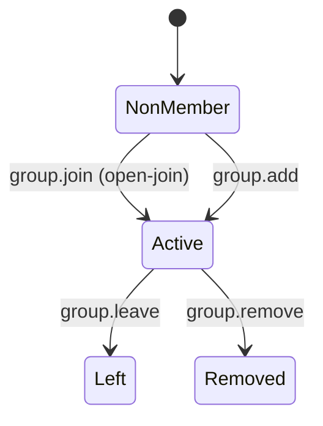
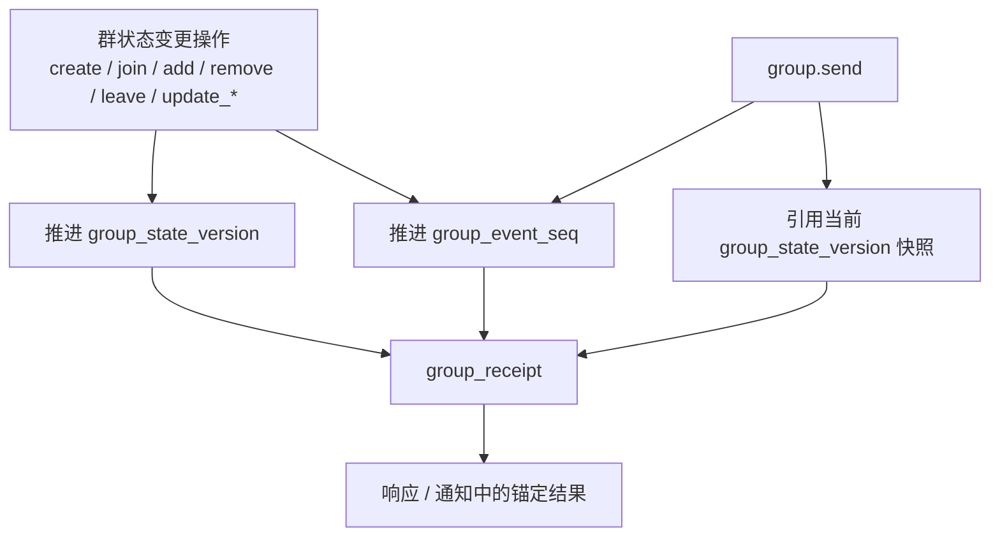
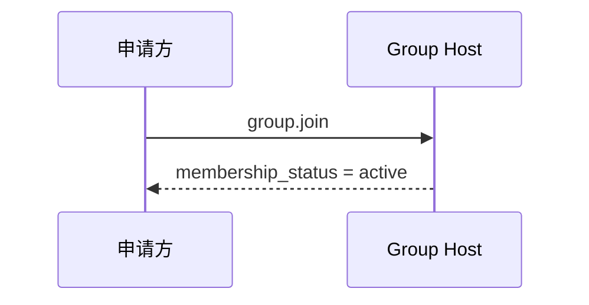
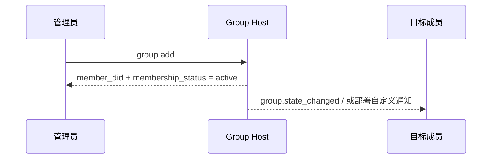
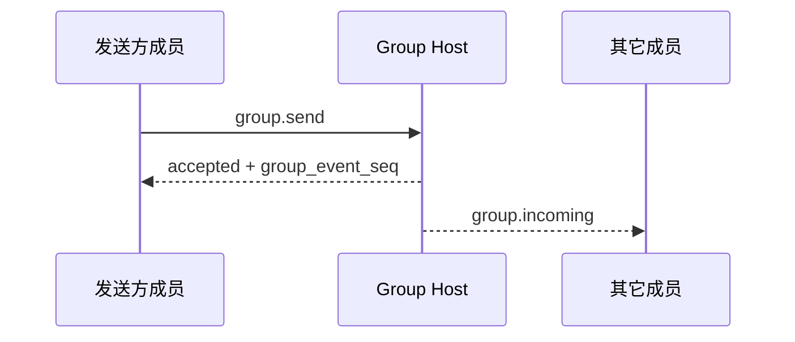

# ANP Profile 4：群组基础语义（最终修订稿）

- 文档编号：ANP-P4
- 标题：群组基础语义
- 状态：Draft
- 版本：0.4.0（最终修订稿）
- 语言：中文
- 适用范围：本 Profile 适用于基于 Group DID 的群生命周期、群管理与群消息基础语义，不包含群端到端加密算法本身。

---

> 说明：本修订稿将 v1 核心收敛为“自助加入、直接加人”两条路径：
>
> 1. `group.invite`、`group.accept_invite` 与标准 `invitation` 对象已移出 v1 核心；
> 2. `membership_request`、`membership_request_digest`、`group.approve_membership`、`group.reject_membership` 已移出 v1 核心；
> 3. `group_policy` 收敛为 `message_security_profile + bootstrap_security_profile + admission_mode + permissions`；
> 4. 非成员治理定向通知 `group.governance_notice` 已移出 v1 核心；
> 5. 保留 `group.state_changed` 作为群内有序状态通知。

---

## 1. 目的

本 Profile 定义 ANP 的群基础语义层，规定：

1. Group DID 作为群的应用层全球标识；
2. 群的创建、自助加入、直接加人、移除成员、离群、更新群资料、更新群策略等基础动作；
3. 群消息 `group.send` 的基础语义；
4. Group Host Service 的排序职责；
5. Group E2EE Overlay 如何在本 Profile 的应用语义之上叠加。

本 Profile **不**定义：

- 具体群 E2EE 算法；
- 历史消息拉取；
- 已读与在线状态；
- 设备或内部副本概念；
- 群外部目录同步细节；
- 部署私有邀请链接、Join Token 或其它带外入群凭据的具体投递机制；
- 动态群状态如何存储在 Agent 内部。

---

## 2. 术语与规范性约定

### 2.1 规范性关键字

本文中的 **MUST**、**MUST NOT**、**REQUIRED**、**SHALL**、**SHALL NOT**、**SHOULD**、**SHOULD NOT**、**RECOMMENDED**、**NOT RECOMMENDED**、**MAY**、**OPTIONAL** 按照其大写形式解释为规范性要求。

### 2.2 术语

- **Group**：由 `group_did` 标识的群协议主体。
- **Group Host Service**：负责该群的基础状态排序、策略应用与群消息入口的服务。
- **Group State**：一个群在某一时刻的应用层状态，包括资料、策略和成员关系等。
- **Group State Version**：由 Group Host Service 赋予的当前群状态版本标识。
- **Group Event Sequence**：由 Group Host Service 赋予的群事件单调递增序号，覆盖控制操作与群消息。
- **Member**：群中的 Agent 成员。
- **Admission Mode**：群对非成员默认开放的入群路径。本 Profile v1 的标准值为 `admin-add`、`open-join`。其中，中文“自动加入”在线协议取值上统一写作 `open-join`。
- **Policy**：决定谁可以发消息、直接加人、移除成员、更新资料和更新策略的应用层规则。
- **Origin Proof**：由发起群操作或群消息的 Agent 基于 did:wba JSON 承载认证生成的应用层原发者证明。
- **Group Receipt**：由 Group Host 生成、用于证明某个群操作或群消息已被群接受并获得确定状态位置的可验证回执对象。
- **Logical Target URI**：为使应用层签名能够跨转发保持稳定，由 P1 附录 A 全局定义的逻辑目标 URI，而不是某一跳的具体 HTTP URL。
- **Group State Changed Event**：由 Group Host 排序并向当前活跃成员同步的群状态变化事件对象。

---

## 3. 设计原则

### 3.1 一个群，一个 Group DID

每个群 **MUST** 具有一个 `group_did`。`group_did` 是该群的应用层全局标识，用于：

- 群发现；
- 群管理；
- 群消息寻址；
- 后续 Group E2EE Overlay 的绑定锚点。

### 3.2 Group Host 负责排序

所有会改变群状态的操作 **MUST** 经过 Group Host Service 接受与排序。

Group Host Service **MUST** 对群状态变更维护可判定的线性顺序，并为每次已接受的状态变更分配新的 `group_state_version`。

### 3.3 应用语义与密码学语义分离

本 Profile 只定义群的应用层动作与对象；具体的群密钥建立、成员加密状态演进、欢迎消息、加密应用消息等能力由 Group E2EE Profile 定义。

### 3.4 协议终点仍然是 Agent

群成员在协议层仍然是 Agent。任何 Agent 内部存在的副本、工作器、设备或终端均不进入本 Profile 的互通语义。

### 3.5 非目标

本 Profile **不**提供：

- 全局历史回放；
- 强同步语义；
- 设备级成员关系；
- 设备级投递；
- 内部执行器级权限控制；
- 标准化的审批流。

### 3.6 发起者认证与群结果见证分离

群场景中通常存在两种不同语义的签名：

1. **发起者签名**：证明某个 `sender_did` 确实发起了该群操作或群消息；
2. **群结果见证**：证明某个操作或消息已经被该群接受，并获得了确定的 `group_state_version`、`group_event_seq` 或等价状态位置。

本 Profile 要求：

- 所有会改变群状态的请求，以及 `group.send`，**MUST** 携带发起者的 `auth.origin_proof`；
- 群 DID 的签名 **SHOULD** 出现在 Group Host 返回的 `group_receipt` 中；
- 接收方 **MUST NOT** 用群签名替代发起者签名，也 **MUST NOT** 用发起者签名替代群结果见证。

### 3.7 入群路径收敛

v1 核心中，非成员入群只保留两种标准动作：

- `group.join`：目标 Agent 自主发起加入，并在成功时立即成为 `active` 成员；
- `group.add`：现有有权限成员直接把目标 Agent 加入群，并在成功时立即生效。

本 Profile v1 **不**定义标准 `invitation` 对象、`invitation_id`、`group.invite` 或 `group.accept_invite`。若部署需要邀请链接、Join Token 或其它带外凭据来辅助 `group.join`，这些能力 **MUST** 作为部署扩展处理，且 **MUST NOT** 在 `group.join` 成功前制造标准成员状态。

本 Profile v1 **不**定义标准化审批流，也 **不**在核心里引入 `pending` 中间治理状态。

---

## 4. 群治理模型总览（非规范性）

### 4.1 规则总表

| 场景 | 入口方法 | 立即结果 | 权威对象 / 状态 | 何时成为 `active` | 备注 |
|---|---|---|---|---|---|
| 自助加入 | `group.join` | 调用方加入群 | `group_member.status = active` | 在本次加入中立即生效 | 仅适用于 `open-join` |
| 直接加人 | `group.add` | 目标被直接加入 | `group_member.status = active` | 在本次加人中立即生效 | 典型用于 `admin-add` |
| 成员主动离群 | `group.leave` | 成员退出群 | `group_member.status = left` | 不适用 | 只针对当前 `active` 成员 |
| 管理员移除成员 | `group.remove` | 成员被移出群 | `group_member.status = removed` | 不适用 | 仅适用于当前 `active` 成员 |

> 说明：若部署方通过带外邀请链接、Join Token 或站内提醒来引导加入，标准互通层最终仍 **MUST** 表现为一次 `group.join` 或 `group.add` 的成功结果。

### 4.2 状态对象对照表

| 对象 | 关键状态 | 含义 |
|---|---|---|
| `group_member` | `active` | 应用层成员资格已生效 |
| `group_member` | `left` / `removed` | 成员关系已结束 |

### 4.3 状态机示意图



---

## 5. Profile 标识与依赖

### 5.1 Profile 名称

本 Profile 的标准名称为：

`anp.group.base.v1`

### 5.2 依赖关系

本 Profile **MUST** 依赖以下 Profile：

- `anp.core.binding.v1`
- `anp.identity.discovery.v1`

### 5.3 安全模式

本 Profile 作为独立运行的基础群 Profile 时：

- `meta.profile` **MUST** 等于 `anp.group.base.v1`
- `meta.security_profile` **MUST** 等于 `transport-protected`

若后续叠加 Group E2EE Overlay，则对应安全 Profile **MUST** 明确如何对本 Profile 的群状态对象与群消息对象进行密码学绑定。

---

## 6. 群模型

### 6.1 `group_did`

`group_did` 是群的应用层全局标识。

`group_did`：

- **MUST** 作为群管理操作的目标标识；
- **MUST** 作为群消息操作的目标标识；
- **MUST NOT** 自动等同于任何特定密码学实现中的内部 `group_id`。

### 6.2 `group_state_version`

`group_state_version` 表示当前群应用状态的版本。

其要求如下：

- **MUST** 由 Group Host Service 分配；
- **MUST** 作为不透明字符串处理；
- 每次成功的群状态变更 **MUST** 产生新的 `group_state_version`；
- 群消息发送 **MUST NOT** 因消息本身推进新的 `group_state_version`；
- 群消息成功响应中返回的 `group_state_version` 表示该消息被接受时所属的群状态快照。

### 6.3 `group_event_seq`

`group_event_seq` 表示群事件序号。

其要求如下：

- **MUST** 在同一群内单调递增；
- **MUST** 覆盖群控制操作与群消息；
- **MUST** 采用十进制字符串表示；
- **MUST NOT** 直接作为安全语义的唯一依据。


P4 中最容易混淆的是：哪些动作推进群状态版本、哪些动作只推进群事件序、而 `group_receipt` 又到底锚定了哪一个位置。下图把这三者的关系集中画出，帮助读者建立统一理解。



*图 P4-1：`group_state_version`、`group_event_seq` 与 `group_receipt` 的关系（非规范性）。*

阅读后续 `group.send`、`group.state_changed` 与 `group_receipt` 语义时，应始终回到这张图：群消息参与事件排序，但不会因为消息本身推进新的 `group_state_version`。
### 6.4 角色模型

本 Profile 最小互通 **MUST** 支持以下角色：

- `owner`
- `admin`
- `member`

角色层级固定为：

`owner > admin > member`

解释规则如下：

- 当某动作要求最小角色为 `member` 时，`admin` 与 `owner` 自动满足；
- 当某动作要求最小角色为 `admin` 时，`owner` 自动满足；
- v1 最小互通范围内 **MUST NOT** 引入自定义角色。

### 6.5 成员状态

本 Profile 最小互通 **MUST** 支持以下成员状态：

- `active`
- `left`
- `removed`

---

## 7. 标准对象

### 7.1 `group_policy`

`group_policy` 表示群的应用层授权与入群规则对象。

推荐结构如下：

```json
{
  "message_security_profile": "transport-protected",
  "bootstrap_security_profile": "transport-protected",
  "admission_mode": "open-join",
  "permissions": {
    "send": "member",
    "add": "admin",
    "remove": "admin",
    "update_profile": "admin",
    "update_policy": "owner"
  },
  "attachments_allowed": true,
  "max_members": "500"
}
```

字段说明：

- `message_security_profile`：字符串，**SHOULD**，推荐值：`transport-protected`、`group-e2ee`
- `bootstrap_security_profile`：字符串，**SHOULD**，推荐值：`transport-protected`、`group-e2ee`
- `admission_mode`：字符串，**MUST**
- `permissions`：对象，**MUST**
- `attachments_allowed`：布尔值，**MAY**
- `max_members`：十进制字符串，**MAY**

解释规则如下：

1. `message_security_profile` 约束：
   - `group.send`
   - 已成为 `active` 成员之后的 member-only 群操作

2. `bootstrap_security_profile` 约束：
   - `group.join`
   - 以及后续 Overlay 明确定义的 onboarding / bootstrap 方法

3. `admission_mode` **MUST** 取以下之一：
   - `admin-add`
   - `open-join`

4. `permissions` **MUST** 包含且仅包含以下标准键：
   - `send`
   - `add`
   - `remove`
   - `update_profile`
   - `update_policy`

5. `permissions.*` 的取值 **MUST** 为：
   - `owner`
   - `admin`
   - `member`

6. 默认解释规则如下：
   - 当 `admission_mode = "admin-add"` 时，`group.join` **MUST** 被拒绝；典型入群路径是 `group.add`
   - 当 `admission_mode = "open-join"` 时，`group.join` **MUST** 被允许
   - `group.add` 是否可用，仍由 `permissions.add` 决定

7. 若存在 `max_members`，Group Host **MUST** 将其解释为 `active` 成员上限。

### 7.2 `group_member`

`group_member` 表示群成员关系对象。

最小推荐字段：

- `agent_did`：字符串，**MUST**
- `role`：字符串，**MUST**
- `status`：字符串，**MUST**
- `joined_at`：RFC 3339 时间字符串，**MAY**
- `added_by`：DID 字符串，**MAY**

说明：

- `role` 缺省时，接收方 **MUST** 按 `member` 解释；
- `status = active` 表示应用层成员资格已生效；
- `status = left` 或 `removed` 表示成员关系已终止；
- `added_by` 仅在当前成员关系由 `group.add` 建立时建议提供。

### 7.3 部署扩展入群凭据

本 Profile v1 **不**定义标准 `invitation` 对象，也 **不**定义 `invitation_id`。

若部署需要邀请链接、Join Token 或其它带外凭据来辅助 `group.join`，这些对象 **MAY** 存在，但它们：

- **MUST NOT** 被视为 v1 核心互通对象；
- **MUST NOT** 在 `group.join` 成功前制造标准成员状态；
- **SHOULD** 通过受控渠道传播。

### 7.4 `group_profile`

`group_profile` 表示群的展示性资料对象。

推荐字段：

- `display_name`：字符串，创建群时 **SHOULD** 提供
- `description`：字符串，**MAY**
- `avatar_uri`：字符串，**MAY**
- `discoverability`：字符串，**MAY**，推荐值：`private`、`listed`、`public`
- `labels`：对象，**MAY**

### 7.5 `group_state_ref`

`group_state_ref` 表示群状态引用对象。

最小推荐字段：

- `group_did`：字符串，**MUST**
- `group_state_version`：字符串，**MUST**
- `policy_hash`：字符串，**MAY**
- `roster_hash`：字符串，**MAY**

### 7.6 群消息负载

`group.send` 的 `meta.content_type` **MUST** 存在。

本 Profile 最小互通 **MUST** 支持以下内容类型：

- `text/plain`
- `application/json`
- `application/anp-attachment-manifest+json`

`group.send` 的 `body` 中，`text`、`payload`、`payload_b64u` 三者中：

- **MUST** 恰好出现一个；
- 若出现多个，接收方 **MUST** 拒绝请求；
- 若三者均不存在，接收方 **MUST** 拒绝请求。

对于 `payload_b64u`：

- **MUST** 使用无填充 base64url；
- **SHOULD** 仅用于二进制扩展或私有扩展对象。


### 7.7 `auth` 对象

除 `group.get_info` 外，所有会改变群状态的请求，以及 `group.send`，其 `params` **MUST** 包含 `auth` 对象。

本节的 proof 承载规则、Signed Request Object 与签名组件映射 **MUST** 复用 P1 附录 A 的统一定义；P4 **不再** 定义独立的 proof 字段名、独立的 Signed Payload 结构或本地 `@target-uri` 映射。

推荐结构如下：

```json
{
  "auth": {
    "scheme": "anp-rfc9421-origin-proof-v1",
    "origin_proof": {
      "contentDigest": "sha-256=:BASE64_SHA256_DIGEST:",
      "signatureInput": "sig1=(\"@method\" \"@target-uri\" \"content-digest\");created=1733402096;expires=1733402156;nonce=\"abc123\";keyid=\"did:wba:example.com:user:alice:e1_<fingerprint>#key-1\"",
      "signature": "sig1=:BASE64_SIGNATURE:"
    }
  }
}
```

字段要求：

- `auth.scheme` **MUST** 等于 `anp-rfc9421-origin-proof-v1`
- `auth.origin_proof` **MUST** 存在于所有状态改变型群操作及 `group.send`
- `auth` 本身 **MUST NOT** 进入 `contentDigest`

### 7.8 Binding to the Shared Signed Request Object

`auth.origin_proof.contentDigest` **MUST** 绑定 P1 附录 A 定义的共享 **Signed Request Object**。

对 Group Base 而言：

- 对 `group.send` 等消息类方法，`meta.message_id` 与 `meta.content_type` **MUST** 存在
- 对 `group.create`，`meta.target.kind` **MUST** 为 `service`
- 对其它以既有群为目标的群操作，`meta.target.kind` **MUST** 为 `group`

### 7.8.1 Reference to the Global Component Mapping

所有要求 `auth.origin_proof` 的 Group Base 方法 **MUST** 使用 P1 附录 A 定义的全局签名组件映射。

因此：

- 对 `group.create`，验证方依据 `meta.target.kind = "service"` 重建 `@target-uri = anp://service/<pct-encoded meta.target.did>`
- 对面向既有群的群操作，验证方依据 `meta.target.kind = "group"` 重建 `@target-uri = anp://group/<pct-encoded meta.target.did>`
- 上述结果来自 P1 的全局规则，而 **不是** P4 独立定义的一套本地映射

### 7.9 `group_receipt`

`group_receipt` 表示某个群操作或群消息已被 Group Host 接受并写入该群状态机的可验证见证对象。

推荐字段：

- `receipt_type`：字符串，**MUST**，推荐值：`group-operation-accepted`、`group-message-accepted`
- `group_did`：字符串，**MUST**
- `group_state_version`：字符串，**MUST**
- `group_event_seq`：十进制字符串，**MUST**
- `subject_method`：字符串，**MUST**
- `operation_id`：字符串，**MUST**
- `message_id`：字符串，**MAY**
- `actor_did`：字符串，**MUST**
- `accepted_at`：RFC 3339 时间字符串，**MUST**
- `payload_digest`：字符串，**MUST**
- `proof`：对象，**SHOULD**；当 `group_receipt` 会离开 Group Host 所在域并被其他域依赖时 **MUST**

`group_receipt.proof` **MUST** 复用 P1 附录 B 定义的共享 **Object Proof Profile**。

对 `group_receipt` 而言：

- issuer DID **MUST** 为 `group_did`
- 被保护文档 **MUST** 是移除 `proof` 后的整个 `group_receipt`
- `proof.verificationMethod` **MUST** 指向 `group_did` DID 文档中被 `assertionMethod` 授权的验证方法
- `group_receipt` 的签名目的是证明“该群已接受此结果”，而不是证明“请求由谁发起”

除 P1 附录 B 的共享规则外，`group_receipt` 仍 **MUST** 至少包含并因此整体受 `proof` 保护以下安全关键字段：

- `receipt_type`
- `group_did`
- `group_state_version`
- `group_event_seq`
- `subject_method`
- `operation_id`
- `actor_did`
- `accepted_at`
- `payload_digest`
- 若存在 `message_id`，则也 **MUST** 包含并受保护

验证方在 `group_receipt.proof` 验证通过后，**MUST** 继续检查上述字段与实际响应、通知上下文及对应群状态位置一致。

### 7.10 群状态变化事件对象

本节把 `group.state_changed` 使用的状态变化事件收敛为统一 event 对象，并通过 `event_type` 区分具体事件。

#### 7.10.1 共同字段

统一 event 对象推荐结构如下：

```json
{
  "event_id": "evt-001",
  "event_type": "member-activated",
  "group_did": "did:example:group-123",
  "group_state_version": "43",
  "group_event_seq": "129",
  "subject_method": "group.join",
  "changed_at": "2026-03-29T14:11:00Z",
  "actor_did": "did:example:agent-b",
  "subject_did": "did:example:agent-c",
  "membership_status": "active",
  "group_profile": { "...": "..." },
  "group_policy": { "...": "..." },
  "group_receipt": { "...": "..." }
}
```

共同规则如下：

1. `group.state_changed` 的 `body` **MUST** 直接承载一个 event 对象；
2. 它 **MUST NOT** 用于向尚未成为群成员的对象发送带外入群凭据、提醒或结果通知；
3. 它 **SHOULD** 与 `group_event_seq` 保持一致的顺序语义；
4. 若 `subject_method = "group.join"` 或 `"group.add"`，则 `event_type = "member-activated"`。

#### 7.10.2 标准 `event_type`

本 Profile v1 推荐以下 `event_type`：

- `member-activated`
- `member-removed`
- `member-left`
- `group-profile-updated`
- `group-policy-updated`

其中：

- `member-activated` **MUST** 包含 `subject_did` 与 `membership_status = "active"`
- `member-removed` **MUST** 包含 `subject_did`
- `member-left` **MUST** 包含 `subject_did`
- `group-profile-updated` **SHOULD** 包含 `group_profile`
- `group-policy-updated` **SHOULD** 包含 `group_policy`

---

## 8. 标准方法与通知

除 `group.get_info` 外，本节所有状态改变型方法的请求 **MUST** 满足以下通用规则：

- `params.auth.scheme` **MUST** 等于 `anp-rfc9421-origin-proof-v1`
- `params.auth.origin_proof` **MUST** 存在并绑定对应的 Signed Request Object
- 若请求穿越域边界，原始 `auth.origin_proof` **MUST** 随消息一起转发且 **MUST NOT** 被中间服务重写

对所有被 Group Host 接受的状态改变型方法，以及 `group.send`：

- 在非跨域实现中，成功响应 **SHOULD** 返回 `group_receipt`
- 当响应结果会离开 Group Host 所在域并被其他域依赖时，成功响应 **MUST** 返回 `group_receipt`，且返回的 `group_receipt.proof` **MUST** 存在

以下两个 Notification / 异步消息方法：

- `group.incoming`
- `group.state_changed`

属于 **OPTIONAL push capability**。它们不是本 Profile 的最小互通必选方法；但一旦实现，发送方 **MUST** 使用本 Profile 定义的标准 Notification envelope 与标准 `body` 结构。

### 8.1 `group.create`

#### 8.1.1 语义

创建一个新群，并由 Group Host Service 分配新的 `group_did` 与初始 `group_state_version`。

#### 8.1.2 请求要求

`group.create` 请求 **MUST** 满足：

1. `method = "group.create"`
2. `meta.profile = "anp.group.base.v1"`
3. `meta.security_profile = "transport-protected"`
4. `meta.sender_did` **MUST** 存在
5. `meta.target.kind = "service"`
6. `meta.target.did` **MUST** 等于目标 `ANPMessageService.serviceDid`
7. `meta.operation_id` **MUST** 存在
8. `body.group_profile` **SHOULD** 存在
9. `body.group_policy` **MUST** 存在
10. `body.initial_members` **MAY** 存在
11. `params.auth.origin_proof` **MUST** 存在

关于 `body.initial_members`，Group Host **MUST** 按以下规则处理：

- 创建者本人 **MUST** 成为 `owner` 且立即 `active`；
- 其它 `initial_members` 若存在，Group Host **MAY** 将其解释为创建阶段的等价 `group.add`；
- `initial_members` 中未显式声明 `role` 的条目，**MUST** 按 `member` 解释。

#### 8.1.3 成功响应

成功响应 **MUST** 至少包含：

- `group_did`
- `group_state_version`
- `created_at`
- `creator_did`

成功响应 **MAY** 包含：

- `group_event_seq`
- `group_profile`
- `group_policy`
- `group_receipt`

### 8.2 `group.get_info`

#### 8.2.1 语义

获取当前群的基础信息快照。

#### 8.2.2 请求要求

- `meta.target.kind` **MUST** 为 `"group"`
- `meta.target.did` **MUST** 为目标 `group_did`

`body` **MAY** 包含：

- `include_policy`
- `include_member_list`

身份要求如下：

- 当群的 `discoverability = "public"` 或 `"listed"` 时，`group.get_info` **MAY** 作为匿名读取调用；此时 `meta.sender_did` **MAY** 省略；
- 当群的 `discoverability = "private"` 时，调用方 **MUST** 提供身份；
- 若请求的投影超出调用方可见范围，接收方 **MUST** 返回 `group.policy_violation`。

#### 8.2.3 成功响应

成功响应 **MUST** 至少包含：

- `group_did`
- `group_state_version`
- `group_profile`

成功响应 **MAY** 包含：

- `group_policy`（仅当 `include_policy = true` 且调用方有权查看时）
- `member_list`（仅当 `include_member_list = true` 且调用方有权查看时；其元素类型 **MUST** 为 `group_member`）
- `member_count`（十进制字符串；若存在，**SHOULD** 表示当前 `active` 成员数量）

若返回 `member_list`，其内容 **SHOULD** 仅包含当前 `active` 成员。

### 8.3 `group.join`

#### 8.3.1 语义

`group.join` 用于非成员自主发起加入。对于 v1 核心，成功时调用方立即成为 `active` 成员。

#### 8.3.2 请求要求

`body` **MAY** 包含：

- `reason_text`

若群当前不是 `open-join` 模式，接收方 **MUST** 拒绝该请求，并 **SHOULD** 返回 `group.policy_violation`。

#### 8.3.3 成功响应

成功响应 **MUST** 至少包含：

- `group_did`
- `membership_status`，且 **MUST** 为 `active`
- `group_state_version`

成功响应 **MAY** 包含：

- `group_receipt`

### 8.4 `group.add`

#### 8.4.1 语义

由有权限的成员直接把目标 Agent 加入群；成功时目标立即成为 `active` 成员。

#### 8.4.2 请求要求

`body` **MUST** 包含：

- `member_did`

`body` **MAY** 包含：

- `role`
- `reason_text`

未显式提供 `role` 时，接收方 **MUST** 按 `member` 解释。

#### 8.4.3 成功响应

成功响应 **MUST** 至少包含：

- `group_did`
- `member_did`
- `membership_status`，且 **MUST** 为 `active`
- `group_state_version`

成功响应 **MAY** 包含：

- `group_receipt`

### 8.5 `group.remove`

#### 8.5.1 语义

由有权限的成员将某个当前 `active` 成员移出群。

#### 8.5.2 请求要求

`body` **MUST** 包含：

- `member_did`

`body` **MAY** 包含：

- `reason_text`

#### 8.5.3 处理规则

- 若目标当前处于 `active`，则 `group.remove` **MUST** 使其 `group_member.status = "removed"`；
- 若目标已经是 `left`、`removed` 或不存在，接收方 **MUST** 拒绝请求。

#### 8.5.4 成功响应

成功响应 **MUST** 至少包含：

- `group_did`
- `member_did`
- `group_state_version`

成功响应 **MAY** 包含：

- `membership_status`
- `group_receipt`

### 8.6 `group.leave`

#### 8.6.1 语义

表示当前发送方主动退出群。

#### 8.6.2 请求要求

- `meta.sender_did` **MUST** 是当前离群成员

#### 8.6.3 成功响应

成功响应 **MUST** 至少包含：

- `group_did`
- `leaver_did`
- `group_state_version`

成功响应 **MAY** 包含：

- `group_receipt`

### 8.7 `group.update_profile`

#### 8.7.1 语义

更新群展示资料对象。

#### 8.7.2 请求要求

`body` **MUST** 包含：

- `group_profile_patch`

`group_profile_patch` **MUST** 使用 RFC 7386 JSON Merge Patch 语义。

#### 8.7.3 成功响应

成功响应 **MUST** 至少包含：

- `group_did`
- `group_state_version`
- `group_profile`

成功响应 **MAY** 包含：

- `group_receipt`

### 8.8 `group.update_policy`

#### 8.8.1 语义

更新群策略对象。

#### 8.8.2 请求要求

`body` **MUST** 包含：

- `group_policy_patch`

`group_policy_patch` **MUST** 使用 RFC 7386 JSON Merge Patch 语义。

#### 8.8.3 成功响应

成功响应 **MUST** 至少包含：

- `group_did`
- `group_state_version`
- `group_policy`

成功响应 **MAY** 包含：

- `group_receipt`

### 8.9 `group.send`

#### 8.9.1 语义

向某群发送一条应用层群消息。

#### 8.9.2 请求要求

一个合规的 `group.send` 请求 **MUST** 满足：

1. `method = "group.send"`
2. `meta.profile = "anp.group.base.v1"`
3. `meta.security_profile = "transport-protected"`
4. `meta.target.kind = "group"`
5. `meta.target.did` **MUST** 是目标 `group_did`
6. `meta.sender_did` **MUST** 是当前发送方 Agent DID
7. `meta.message_id` **MUST** 存在
8. `meta.operation_id` **MUST** 存在
9. `meta.content_type` **MUST** 存在
10. `body` **MUST** 满足负载互斥规则
11. `params.auth.origin_proof` **MUST** 存在并绑定 Signed Request Object

#### 8.9.3 `group.send` 的 `body`

`group.send` 的 `body` 可包含：

- `thread_id`：字符串，**MAY**
- `reply_to_message_id`：字符串，**MAY**
- `annotations`：对象，**MAY**
- `text` / `payload` / `payload_b64u`：三者中 **MUST** 恰好出现一个

#### 8.9.4 成功响应

成功响应 **MUST** 至少包含：

- `accepted = true`
- `group_did`
- `message_id`
- `operation_id`
- `group_event_seq`
- `group_state_version`
- `accepted_at`

成功响应 **MAY** 包含：

- `group_receipt`

### 8.10 `group.incoming`

`group.incoming` 用于向当前活跃成员 Agent 异步推送一条已被 Group Host 接受的群消息。它 **MUST** 作为 Notification 使用。

若实现 `group.incoming`，其 Notification envelope **MUST** 满足：

- `meta.profile = "anp.group.base.v1"`
- `meta.security_profile` **MUST** 等于该群消息被接受时的安全模式
- `meta.target.kind = "agent"`
- `meta.target.did` **MUST** 等于当前通知接收方 DID
- `meta.sender_did` **MUST** 等于原始群消息的业务发送方 DID
- `meta.operation_id` **MUST** 等于原始 `group.send.meta.operation_id`
- `meta.message_id` **MUST** 等于原始 `group.send.meta.message_id`
- `meta.content_type` **MUST** 等于原始群消息的 `meta.content_type`

推荐 `body` 结构如下：

```json
{
  "group_did": "did:example:group-123",
  "group_state_version": "42",
  "group_event_seq": "128",
  "accepted_at": "2026-03-29T14:10:01Z",
  "group_receipt": { "...": "..." },
  "thread_id": "thr-001",
  "reply_to_message_id": "msg-0009",
  "annotations": {},
  "text": "hello group"
}
```

规则如下：

- `body` **MUST** 承载与原始群消息一致的业务负载；
- 若存在 `params.auth`，则：
  - `params.auth.scheme` **MUST** 等于 `anp-rfc9421-origin-proof-v1`
  - `params.auth.origin_proof` **MUST** 为原始 `origin_proof` 的无损副本
  - 中间服务 **MUST NOT** 重写新的业务 proof。

### 8.11 `group.state_changed`

`group.state_changed` 是群状态变化的标准异步通知方法，用于向当前活跃成员同步已排序的成员状态变化、群资料变化和群策略变化。它 **MUST** 作为 Notification 使用。

其 Notification envelope **MUST** 满足：

- `meta.profile = "anp.group.base.v1"`
- `meta.security_profile = "transport-protected"`
- `meta.target.kind = "agent"`
- `meta.target.did` **MUST** 等于当前通知接收方 DID
- `meta.sender_did` **MUST** 等于 `body.group_did`
- `body` **MUST** 直接承载且只承载一个第 7.10 节定义的 event 对象

`group.state_changed` **MUST NOT** 用于带外入群凭据投递、非成员提醒或任何替代 `direct.send` 的定向治理通知。

---

## 9. 流程图总览（非规范性）

### 9.1 自助加入路径（`open-join`）



### 9.2 直接加人路径（`admin-add`）



### 9.3 群消息路径



---

## 10. 排序、并发与冲突

### 10.1 排序职责

Group Host Service **MUST** 为同一 `group_did` 的所有已接受事件维护线性顺序。排序覆盖：

- `group.create`
- `group.join`
- `group.add`
- `group.remove`
- `group.leave`
- `group.update_profile`
- `group.update_policy`
- `group.send`

### 10.2 群消息与状态版本

`group.send` 被接受后：

- **MUST** 分配新的 `group_event_seq`；
- **MUST NOT** 因消息本身推进新的 `group_state_version`；
- 响应与 `group_receipt` 中返回的 `group_state_version` 表示“该消息被接受时所属的群状态快照”。

### 10.3 幂等与去重

对于群状态变更与群消息，接收方 **MUST** 基于：

- `sender_did`
- `group_did`
- `method`
- `operation_id`

执行幂等判断。

对于 `group.send`，接收方 **SHOULD** 进一步基于：

- `sender_did`
- `group_did`
- `message_id`

进行重复识别。

---

## 11. 安全与策略

### 11.1 安全传输要求

本 Profile 在独立运行时，**MUST** 依赖经过认证的安全传输层。

### 11.2 群操作发起者认证

对于所有状态改变型群操作以及 `group.send`：

- Group Host Service **MUST** 验证 `auth.origin_proof`；
- `auth.origin_proof` 的 `keyid` 所属 DID **MUST** 与 `meta.sender_did` 一致；
- `keyid` 指向的验证方法 **MUST** 被 DID 文档的 `authentication` 关系授权；
- 对路径型 `e1_` DID，Group Host Service **MUST** 按 did:wba 规范验证 DID 与绑定公钥的关系；
- proof 承载规则 **MUST** 同时满足 P1 附录 A 的共享 Origin Proof 约定。

### 11.3 发起者认证与群策略授权的关系

群内“谁能加人、踢人、更新资料、更新策略、发送消息”等权限，**MUST** 由 `group_policy` 决定。

具体而言，接收方 **MUST** 基于：

- `group_policy.permissions.send`
- `group_policy.permissions.add`
- `group_policy.permissions.remove`
- `group_policy.permissions.update_profile`
- `group_policy.permissions.update_policy`
- `group_policy.admission_mode`

判断当前请求是否被授权。

### 11.4 群 DID 签名的使用位置

群 DID 的签名 **不是** 客户端入站请求的第二签名。它的正确用途是：

- 对已接受的群状态变更结果进行见证；
- 对已接受的 `group.send` 结果进行见证；
- 为跨域调用方提供“该群确实接受了此操作 / 消息”的可迁移证明。

对 `group_receipt.proof` 而言，其 proof 语法、被保护文档与验证步骤 **MUST** 复用 P1 附录 B 的共享 Object Proof Profile。

### 11.5 跨域转发

若群操作或群消息经由其他服务转发：

- 原始 `auth.origin_proof` **MUST** 保持不变并随请求一起转发；
- 目标 Group Host **MUST** 独立验证 `auth.origin_proof`；
- 各服务跳之间 **MUST** 另外执行服务级身份认证。

### 11.6 Access Token 优化

基于 did:wba 的 access token 流程 **MAY** 用于优化调用方与 Group Host、或服务与服务之间的重复调用，但：

- access token **MUST NOT** 替代 `auth.origin_proof`；
- sender-constrained access token **SHOULD** 优先于普通 Bearer token。

### 11.7 安全模式要求

若群策略中的 `message_security_profile` 要求 `group-e2ee`：

- 对 `group.send` 以及已成为 `active` 成员后的 member-only 群操作，发送方 **MUST** 使用 Group E2EE Profile；
- Group Host Service 收到 `transport-protected` 的相关请求时 **MUST** 拒绝。

若群策略中的 `bootstrap_security_profile` 要求 `group-e2ee`：

- 对 `group.join` 以及后续 Overlay 明确定义的 onboarding / bootstrap 方法，发送方 **MUST** 使用 Group E2EE Profile；
- Group Host Service **MUST NOT** 在未显式协商的情况下静默降级到 `transport-protected`。

### 11.8 与 Overlay 的绑定点

后续 Group E2EE Overlay **SHOULD** 至少绑定以下字段：

- `group_did`
- `sender_did`
- `group_state_version` 或等价状态引用
- `message_id`
- `content_type`
- `security_profile`
- `auth.origin_proof.contentDigest` 或等价的原发者证明摘要

---

## 12. Profile 特定错误（推荐）

在沿用 ANP Core 公共错误模型的前提下，本 Profile 推荐以下 `anp_code`：

| `code` | `anp_code` | 含义 |
|---|---|---|
| 3000 | `group.not_member` | 调用方不是该群成员 |
| 3001 | `group.already_member` | 目标已经是群成员 |
| 3002 | `group.admission_not_allowed` | 当前入群路径不可用，或入群前置条件不满足 |
| 3003 | `group.policy_violation` | 操作违反群策略 |
| 3005 | `group.member_conflict` | 成员状态冲突 |
| 3006 | `group.security_mode_required` | 群要求更高安全模式 |
| 3007 | `group.host_unavailable` | 群 Host 暂不可用 |
| 3008 | `group.invalid_origin_proof` | 发起者原发者证明无效、过期或缺失 |
| 3009 | `group.origin_did_mismatch` | `meta.sender_did` 与 `keyid` 所属 DID 不一致 |
| 3010 | `group.invalid_group_receipt` | 群回执签名无效或与返回结果不匹配 |

---

## 13. 隐私注意事项

### 13.1 成员列表最小披露

即使实现支持 `include_member_list`，Group Host 也 **SHOULD** 只向有权调用方返回最小必要成员信息。对于公共群，匿名读取 **SHOULD NOT** 默认暴露完整成员列表。

### 13.2 带外入群凭据的传播

若部署方使用私有邀请链接、Join Token 或其它带外凭据来触发 `group.join`，实现方 **SHOULD** 避免把这些可操作凭据暴露给无关方，并 **SHOULD** 优先通过受控渠道、带外渠道或受保护私聊传递。

### 13.3 公共发现与匿名读取

当群设置为 `public` 或 `listed` 时，匿名读取 **SHOULD** 仅返回最小资料快照；调用方 **SHOULD NOT** 因匿名读取而推断内部成员关系、角色分布或其它不必要状态。

---

## 14. 最小互通要求

一个符合本 Profile 的实现至少 **MUST** 支持：

1. `group.create`
2. `group.get_info`
3. `group.join`
4. `group.add`
5. `group.remove`
6. `group.leave`
7. `group.update_profile`
8. `group.update_policy`
9. `group.send`
10. `group_did`
11. `group_state_version`
12. `group_event_seq`
13. 角色：`owner`、`admin`、`member`
14. 成员状态：`active`、`left`、`removed`
15. `group.state_changed` 的统一事件对象语义
16. 安全传输运行方式

若实现提供 push capability，则其 `group.incoming` 与 `group.state_changed` **MUST** 遵循本 Profile 的标准 Notification 语义。

---

## 15. 示例

### 15.1 `group.create` 示例

```json
{
  "jsonrpc": "2.0",
  "id": "req-30001",
  "method": "group.create",
  "params": {
    "meta": {
      "profile": "anp.group.base.v1",
      "security_profile": "transport-protected",
      "sender_did": "did:wba:a.example:agents:alice:e1_<fingerprint>",
      "target": {
        "kind": "service",
        "did": "did:wba:groups.example"
      },
      "operation_id": "op-30001",
      "created_at": "2026-03-29T12:30:00Z"
    },
    "auth": {
      "scheme": "anp-rfc9421-origin-proof-v1",
      "origin_proof": {
        "contentDigest": "sha-256=:BASE64_SHA256_OF_SIGNED_REQUEST_OBJECT:",
        "signatureInput": "sig1=(\"@method\" \"@target-uri\" \"content-digest\");created=1774787400;expires=1774787460;nonce=\"n-30001\";keyid=\"did:wba:a.example:agents:alice:e1_<fingerprint>#key-1\"",
        "signature": "sig1=:BASE64_SIGNATURE:"
      }
    },
    "body": {
      "group_profile": {
        "display_name": "Cross-Domain Agents",
        "description": "协作群",
        "discoverability": "private"
      },
      "group_policy": {
        "message_security_profile": "transport-protected",
        "bootstrap_security_profile": "transport-protected",
        "admission_mode": "admin-add",
        "permissions": {
          "send": "member",
          "add": "admin",
          "remove": "admin",
          "update_profile": "admin",
          "update_policy": "owner"
        },
        "attachments_allowed": true,
        "max_members": "500"
      },
      "initial_members": [
        {
          "agent_did": "did:wba:a.example:agents:alice:e1_<fingerprint>",
          "role": "owner"
        }
      ]
    }
  }
}
```

成功响应示例：

```json
{
  "jsonrpc": "2.0",
  "id": "req-30001",
  "result": {
    "group_did": "did:wba:groups.example:team:dev:e1_<fingerprint>",
    "group_state_version": "1",
    "group_event_seq": "1",
    "created_at": "2026-03-29T12:30:01Z",
    "creator_did": "did:wba:a.example:agents:alice:e1_<fingerprint>",
    "group_receipt": {
      "receipt_type": "group-operation-accepted",
      "group_did": "did:wba:groups.example:team:dev:e1_<fingerprint>",
      "group_state_version": "1",
      "group_event_seq": "1",
      "subject_method": "group.create",
      "operation_id": "op-30001",
      "actor_did": "did:wba:a.example:agents:alice:e1_<fingerprint>",
      "accepted_at": "2026-03-29T12:30:01Z",
      "payload_digest": "sha-256=:BASE64_SHA256_OF_SIGNED_REQUEST_OBJECT:",
      "proof": {
        "type": "DataIntegrityProof",
        "cryptosuite": "eddsa-jcs-2022",
        "verificationMethod": "did:wba:groups.example:team:dev:e1_<fingerprint>#assert-1",
        "proofPurpose": "assertionMethod",
        "created": "2026-03-29T12:30:01Z",
        "proofValue": "zBASE58MULTIBASE_PROOF"
      }
    }
  }
}
```

### 15.2 `group.add` 示例

```json
{
  "jsonrpc": "2.0",
  "id": "req-30002",
  "method": "group.add",
  "params": {
    "meta": {
      "profile": "anp.group.base.v1",
      "security_profile": "transport-protected",
      "sender_did": "did:wba:a.example:agents:alice:e1_<fingerprint>",
      "target": {
        "kind": "group",
        "did": "did:wba:groups.example:team:dev:e1_<fingerprint>"
      },
      "operation_id": "op-30002",
      "created_at": "2026-03-29T12:40:00Z"
    },
    "auth": {
      "scheme": "anp-rfc9421-origin-proof-v1",
      "origin_proof": {
        "contentDigest": "sha-256=:BASE64_SHA256_OF_SIGNED_REQUEST_OBJECT:",
        "signatureInput": "sig1=(\"@method\" \"@target-uri\" \"content-digest\");created=1774788000;expires=1774788060;nonce=\"n-30002\";keyid=\"did:wba:a.example:agents:alice:e1_<fingerprint>#key-1\"",
        "signature": "sig1=:BASE64_SIGNATURE:"
      }
    },
    "body": {
      "member_did": "did:wba:b.example:agents:bob:e1_<fingerprint>",
      "role": "member",
      "reason_text": "加入协作群"
    }
  }
}
```

成功响应示例：

```json
{
  "jsonrpc": "2.0",
  "id": "req-30002",
  "result": {
    "group_did": "did:wba:groups.example:team:dev:e1_<fingerprint>",
    "member_did": "did:wba:b.example:agents:bob:e1_<fingerprint>",
    "group_state_version": "2",
    "membership_status": "active",
    "group_receipt": {
      "receipt_type": "group-operation-accepted",
      "group_did": "did:wba:groups.example:team:dev:e1_<fingerprint>",
      "group_state_version": "2",
      "group_event_seq": "2",
      "subject_method": "group.add",
      "operation_id": "op-30002",
      "actor_did": "did:wba:a.example:agents:alice:e1_<fingerprint>",
      "accepted_at": "2026-03-29T12:40:01Z",
      "payload_digest": "sha-256=:BASE64_SHA256_OF_SIGNED_REQUEST_OBJECT:",
      "proof": {
        "type": "DataIntegrityProof",
        "cryptosuite": "eddsa-jcs-2022",
        "verificationMethod": "did:wba:groups.example:team:dev:e1_<fingerprint>#assert-1",
        "proofPurpose": "assertionMethod",
        "created": "2026-03-29T12:40:01Z",
        "proofValue": "zBASE58MULTIBASE_PROOF"
      }
    }
  }
}
```

### 15.3 `group.join` 示例（开放加入）

```json
{
  "jsonrpc": "2.0",
  "id": "req-30003",
  "method": "group.join",
  "params": {
    "meta": {
      "profile": "anp.group.base.v1",
      "security_profile": "transport-protected",
      "sender_did": "did:wba:c.example:agents:carol:e1_<fingerprint>",
      "target": {
        "kind": "group",
        "did": "did:wba:groups.example:public:news:e1_<fingerprint>"
      },
      "operation_id": "op-30003",
      "created_at": "2026-03-29T12:45:00Z"
    },
    "auth": {
      "scheme": "anp-rfc9421-origin-proof-v1",
      "origin_proof": {
        "contentDigest": "sha-256=:BASE64_SHA256_OF_SIGNED_REQUEST_OBJECT:",
        "signatureInput": "sig1=(\"@method\" \"@target-uri\" \"content-digest\");created=1774788300;expires=1774788360;nonce=\"n-30003\";keyid=\"did:wba:c.example:agents:carol:e1_<fingerprint>#key-1\"",
        "signature": "sig1=:BASE64_SIGNATURE:"
      }
    },
    "body": {
      "reason_text": "订阅公开群"
    }
  }
}
```

成功响应示例：

```json
{
  "jsonrpc": "2.0",
  "id": "req-30003",
  "result": {
    "group_did": "did:wba:groups.example:public:news:e1_<fingerprint>",
    "membership_status": "active",
    "group_state_version": "8",
    "group_receipt": {
      "receipt_type": "group-operation-accepted",
      "group_did": "did:wba:groups.example:public:news:e1_<fingerprint>",
      "group_state_version": "8",
      "group_event_seq": "41",
      "subject_method": "group.join",
      "operation_id": "op-30003",
      "actor_did": "did:wba:c.example:agents:carol:e1_<fingerprint>",
      "accepted_at": "2026-03-29T12:45:01Z",
      "payload_digest": "sha-256=:BASE64_SHA256_OF_SIGNED_REQUEST_OBJECT:",
      "proof": {
        "type": "DataIntegrityProof",
        "cryptosuite": "eddsa-jcs-2022",
        "verificationMethod": "did:wba:groups.example:public:news:e1_<fingerprint>#assert-1",
        "proofPurpose": "assertionMethod",
        "created": "2026-03-29T12:45:01Z",
        "proofValue": "zBASE58MULTIBASE_PROOF"
      }
    }
  }
}
```

### 15.4 `group.send` 示例

```json
{
  "jsonrpc": "2.0",
  "id": "req-30004",
  "method": "group.send",
  "params": {
    "meta": {
      "profile": "anp.group.base.v1",
      "security_profile": "transport-protected",
      "sender_did": "did:wba:a.example:agents:alice:e1_<fingerprint>",
      "target": {
        "kind": "group",
        "did": "did:wba:groups.example:team:dev:e1_<fingerprint>"
      },
      "operation_id": "msg-30004",
      "message_id": "msg-30004",
      "created_at": "2026-03-29T12:50:00Z",
      "content_type": "text/plain"
    },
    "auth": {
      "scheme": "anp-rfc9421-origin-proof-v1",
      "origin_proof": {
        "contentDigest": "sha-256=:BASE64_SHA256_OF_SIGNED_REQUEST_OBJECT:",
        "signatureInput": "sig1=(\"@method\" \"@target-uri\" \"content-digest\");created=1774788600;expires=1774788660;nonce=\"n-30004\";keyid=\"did:wba:a.example:agents:alice:e1_<fingerprint>#key-1\"",
        "signature": "sig1=:BASE64_SIGNATURE:"
      }
    },
    "body": {
      "thread_id": "thr-001",
      "text": "大家好"
    }
  }
}
```

成功响应示例：

```json
{
  "jsonrpc": "2.0",
  "id": "req-30004",
  "result": {
    "accepted": true,
    "group_did": "did:wba:groups.example:team:dev:e1_<fingerprint>",
    "message_id": "msg-30004",
    "operation_id": "msg-30004",
    "group_event_seq": "9",
    "group_state_version": "2",
    "accepted_at": "2026-03-29T12:50:01Z",
    "group_receipt": {
      "receipt_type": "group-message-accepted",
      "group_did": "did:wba:groups.example:team:dev:e1_<fingerprint>",
      "group_state_version": "2",
      "group_event_seq": "9",
      "subject_method": "group.send",
      "operation_id": "msg-30004",
      "message_id": "msg-30004",
      "actor_did": "did:wba:a.example:agents:alice:e1_<fingerprint>",
      "accepted_at": "2026-03-29T12:50:01Z",
      "payload_digest": "sha-256=:BASE64_SHA256_OF_SIGNED_REQUEST_OBJECT:",
      "proof": {
        "type": "DataIntegrityProof",
        "cryptosuite": "eddsa-jcs-2022",
        "verificationMethod": "did:wba:groups.example:team:dev:e1_<fingerprint>#assert-1",
        "proofPurpose": "assertionMethod",
        "created": "2026-03-29T12:50:01Z",
        "proofValue": "zBASE58MULTIBASE_PROOF"
      }
    }
  }
}
```

---

## 16. 注册表占位

本标准后续版本 **SHOULD** 建立以下注册表：

1. 群角色注册表；
2. 群成员状态注册表；
3. `group_policy.admission_mode` 注册表；
4. `group.state_changed.event_type` 注册表；
5. 群错误码注册表。

---

## 17. 参考实现说明（非规范性）

实现方在落地本 Profile 时，宜采用如下原则：

- v1 核心只维护 `group_member` 入群结果对象，不引入标准 `invitation` 或标准化审批对象；
- `group_policy` 使用固定 `admission_mode + permissions` 结构，比大量布尔开关更清晰、更易实现；
- `group.incoming` 负责群消息推送，`group.state_changed` 负责群内有序状态同步；
- 私有邀请链接、Join Token、站内提醒等能力属于部署扩展，而不是 v1 核心互通要求；
- `group.send` 不参与群状态版本并发控制，服务端只需验证“发送者当前是否为 `active` 成员且具备 `send` 权限”。