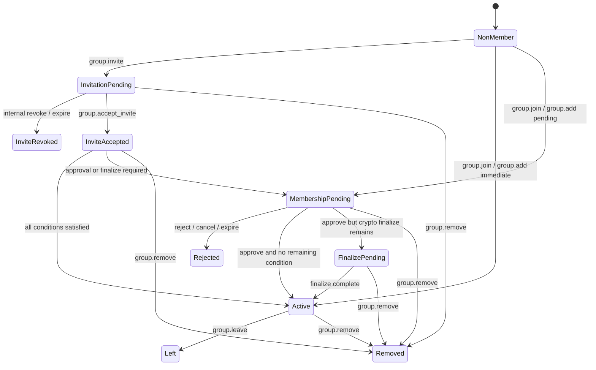
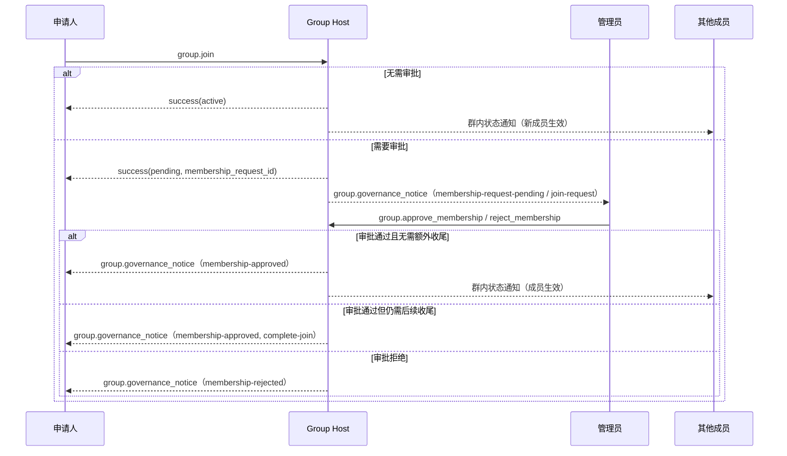
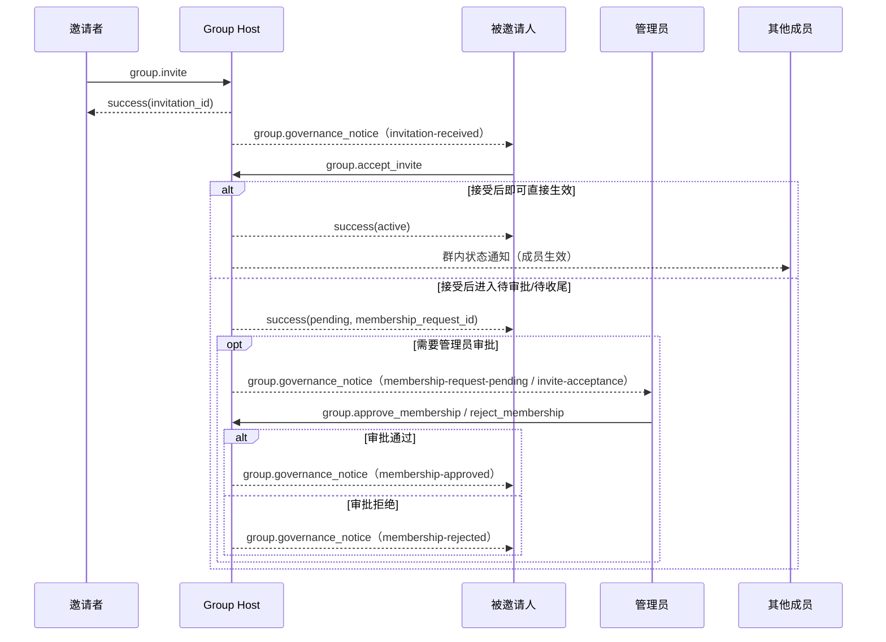
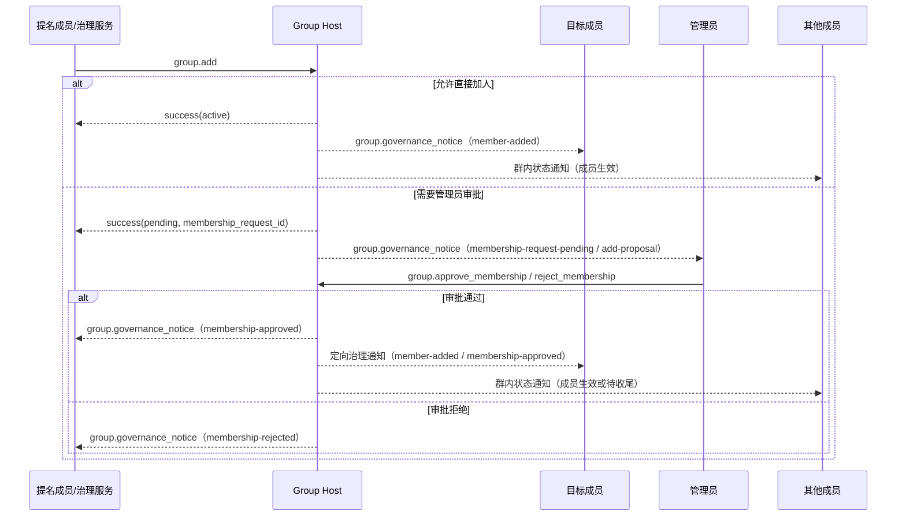
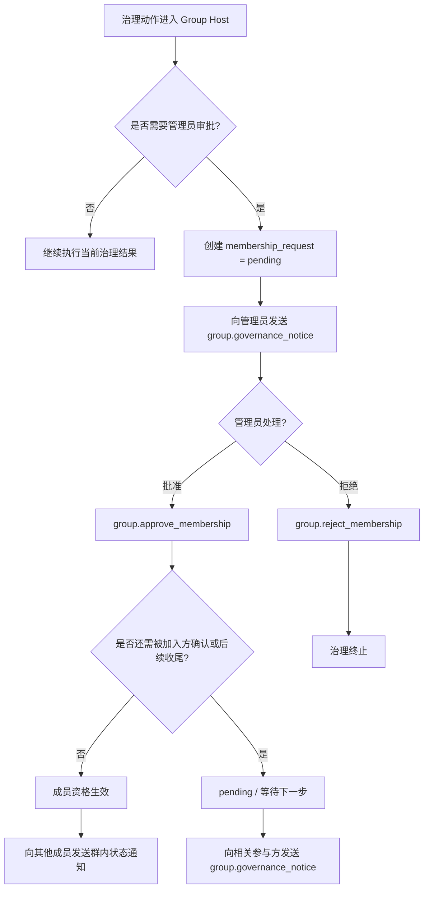
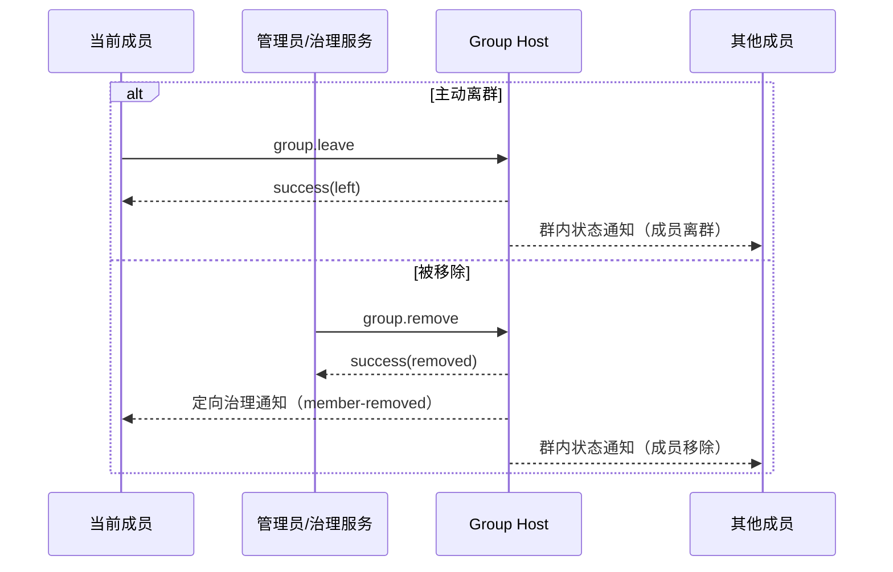
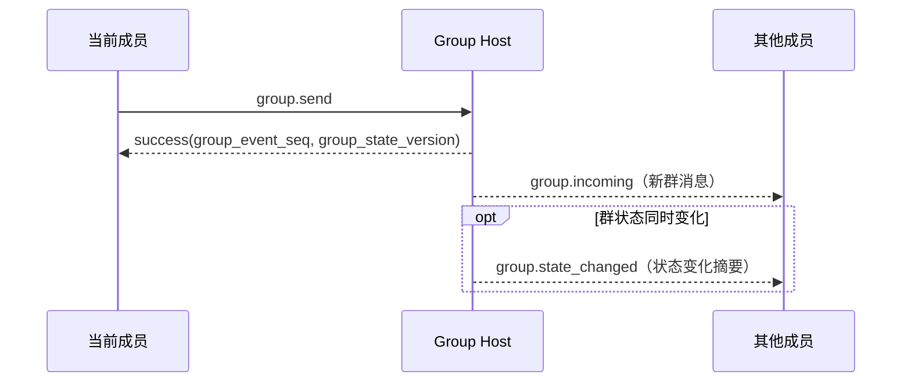

# ANP Profile 4：群组基础语义（草案）

- 文档编号：ANP-P4
- 标题：群组基础语义
- 状态：Draft
- 版本：0.2.8
- 语言：中文
- 适用范围：本 Profile 适用于基于 Group DID 的群生命周期、群管理与群消息基础语义，不包含群端到端加密算法本身。

---

> 说明：本版在重排章节布局的基础上，继续把 `group_governance_notice` 与 `group.state_changed` 的多类型内容拆分为多个独立的 notice / event 对象，以便读者按类型查阅字段与使用时机；协议语义与字段含义保持不变。
> 建议先阅读第 4 章“群治理模型总览”，再阅读第 7～12 章的对象、方法、流程图与通知模型。

---

## 1. 目的

本 Profile 定义 ANP 的群基础语义层，规定：

1. Group DID 作为群的应用层全球标识；
2. 群的创建、邀请、加入、添加成员、移除成员、离群、更新群资料、更新群策略等基础动作；
3. 群消息 `group.send` 的基础语义；
4. 群 Host 服务的排序职责；
5. Group E2EE Overlay 如何在本 Profile 的应用语义之上叠加。

本 Profile **不**定义：

- 具体群 E2EE 算法；
- 历史消息拉取；
- 已读与在线状态；
- 设备或内部副本概念；
- 群外部目录同步细节；
- 内部审批系统的具体实现；
- 动态群状态如何存储在 Agent 内部。


---

## 2. 术语与规范性约定

### 2.1 规范性关键字

本文中的 **MUST**、**MUST NOT**、**REQUIRED**、**SHALL**、**SHALL NOT**、**SHOULD**、**SHOULD NOT**、**RECOMMENDED**、**NOT RECOMMENDED**、**MAY**、**OPTIONAL** 按照其大写形式解释为规范性要求。

### 2.2 术语

- **Group**：由 `group_did` 标识的群协议主体。
- **Group Host Service**：负责该群的基础状态排序、策略应用与群消息入口的服务。
- **Group State**：一个群在某一时刻的应用层状态，包括资料、策略和成员关系等。
- **Group State Version**：由 Group Host Service 赋予的当前群状态版本标识。
- **Group Event Sequence**：由 Group Host Service 赋予的群事件单调递增序号，覆盖控制操作与群消息。
- **Member**：群中的 Agent 成员。
- **Invitation**：尚未生效为活跃成员关系的邀请对象。
- **Membership Request**：由 `Group Host Service` 创建、维护并排序的权威治理对象，用于表示加入申请、加人提案、邀请接受后待审批等治理中间态。后续审批、拒绝与状态通知均围绕该对象展开。
- **Pending Reason**：表示某个成员关系或治理请求为何仍处于待决状态的原因，例如管理员审批、被邀请方确认或后续密码学入群收尾。
- **Policy**：决定谁可以加人、踢人、发消息、改资料、改策略，以及是否需要管理员审批或被加入方确认等行为的应用层规则。
- **Actor Proof**：由发起群操作或群消息的 Agent 基于 did:wba JSON 承载认证生成的应用层签名证明。
- **Group Receipt**：由 Group Host 生成、用于证明某个群操作、群消息或治理结果已被群接受并获得确定状态位置的可验证回执对象。
- **Logical Group Target URI**：为使应用层签名能够跨转发保持稳定，由本 Profile 定义的逻辑群目标 URI，而不是某一跳的具体 HTTP URL。
- **Group Governance Notice**：由 `Group Host Service` 发往特定参与方的定向治理通知。它是某个权威治理对象（如 `membership_request` 或 `invitation`）在某一时刻的只读投递快照，用于提醒接收方采取后续动作或知晓治理结果。


---

## 3. 设计原则

### 3.1 一个群，一个 Group DID

每个群 **MUST** 具有一个 `group_did`。`group_did` 是该群的应用层全局标识，用于：

- 群发现；
- 群管理；
- 群消息寻址；
- 后续 Group E2EE Overlay 的绑定锚点。

### 3.2 Group Host 负责排序

所有会改变群状态的操作 **MUST** 经过 Group Host Service 接受与排序。

Group Host Service **MUST** 对群状态变更维护可判定的线性顺序，并为每次已接受的状态变更分配新的 `group_state_version`。

### 3.3 应用语义与密码学语义分离

本 Profile 只定义群的应用层动作与对象；具体的群密钥建立、成员加密状态演进、欢迎消息、加密应用消息等能力由 Group E2EE Profile 定义。

### 3.4 协议终点仍然是 Agent

群成员在协议层仍然是 Agent。任何 Agent 内部存在的副本、工作器、设备或终端均不进入本 Profile 的互通语义。

### 3.5 非目标

本 Profile **不**提供：

- 全局历史回放；
- 强同步语义；
- 设备级成员关系；
- 设备级投递；
- 内部执行器级权限控制。


### 3.6 发起者认证与群结果见证分离

群场景中通常存在两种不同语义的签名：

1. **发起者签名**：证明某个 `sender_did` 确实发起了该群操作或群消息；
2. **群结果见证**：证明某个操作或消息已经被该群接受，并获得了确定的 `group_state_version`、`group_event_seq` 或等价状态位置。

本 Profile 要求：

- 所有会改变群状态的请求，以及 `group.send`，**MUST** 携带发起者的 `auth.actor_proof`；
- 群 DID 的签名 **SHOULD** 出现在 Group Host 返回的 `group_receipt` 中，而不是作为客户端入站请求的第二个必需签名；
- 接收方 **MUST NOT** 用群签名替代发起者签名，也 **MUST NOT** 用发起者签名替代群结果见证。


---

### 3.7 治理先决策，成员后生效

Group Host Service **MUST** 区分以下三个层次：

1. 邀请、申请、提案、接受、审批、拒绝等治理动作；
2. 应用层成员资格是否已经生效；
3. 若群启用 Group E2EE，目标是否已经进入 MLS 成员集。

对于需要管理员审批、被加入方确认或后续密码学入群收尾的路径，Group Host **MUST NOT** 在这些治理前置条件尚未满足时就把目标视为 `active` 成员。若后续 Profile 需要改变 MLS 成员集，则该改变 **MUST** 发生在治理前置条件满足之后。


---

## 4. 群治理模型总览（非规范性）

为便于实现，本节把前述规范收束为一个统一的群治理状态机视图。本节为**非规范性摘要**；发生冲突时，以前述对象定义、方法定义和策略约束为准。

### 4.1 规则总表

| 场景 | 入口方法 | 立即结果 | 治理对象 / 状态 | 何时成为 `active` | 备注 |
|---|---|---|---|---|---|
| 发出邀请 | `group.invite` | 建立邀请记录 | `invitation.status = pending`，目标可视为 `membership_status = invited` | 不会因 `group.invite` 直接成为 `active` | 邀请路径的第一步 |
| 接受邀请 | `group.accept_invite` | 接受邀请并进入后续治理 | 若还需审批或密码学收尾，则创建或关联 `membership_request`，并保持 `membership_status = pending` | 所有前置条件满足后 | 邀请路径的标准接受动作 |
| 开放加入 | `group.join` | 立即加入或转入待审批 | 无审批时可直接 `active`；有审批时进入 `membership_request(request_kind = join-request)` | 当审批完成，且不存在其它待决条件时 | `group.join` **MUST NOT** 直接替代 `group.accept_invite` 去消费邀请 |
| 直接加人 | `group.add` | 立即生效或转入待审批 | 若允许直接加人，则可直接成为成员；若需审批，则进入 `membership_request(request_kind = add-proposal)` | 当审批完成，且不存在其它待决条件时 | 若要求被加入方确认，则必须改走邀请路径 |
| 批准成员资格 | `group.approve_membership` | 审批环节完成 | `membership_request.status = approved`；成员状态可能为 `pending` 或 `active` | 审批后若已无剩余条件，则立即 `active`；否则继续 `pending` | 它只表示“审批完成”，不必然表示“全部入群完成” |
| 拒绝成员资格 | `group.reject_membership` | 治理终止 | `membership_request.status = rejected` | 不会成为 `active` | 适用于 `join-request`、`add-proposal`、`invite-acceptance` |
| 内部撤销 / 取消 / 超时 | 部署内部流程 | 治理终止 | `invitation.status = revoked`，或 `membership_request.status = canceled / expired` | 不会成为 `active` | v1 不要求标准互通方法 |
| 成员主动离群 | `group.leave` | 成员退出群 | `group_member.status = left` | 不适用 | 只针对当前成员 |
| 管理员移除成员 | `group.remove` | 成员被移出群 | `group_member.status = removed` | 不适用 | 适用于当前尚未终止的成员关系，例如 `invited`、`pending`、`active` |

### 4.2 状态对象对照表

| 对象 | 关键状态 | 含义 |
|---|---|---|
| `invitation` | `pending` | 邀请已发出，尚未被接受、撤销或过期 |
| `invitation` | `accepted` | 被邀请方已表示接受，但不等于已经是 `active` 成员 |
| `invitation` | `revoked` / `expired` | 邀请已终止，不再可用 |
| `membership_request` | `pending` | 治理待决，尚未完成审批或其它前置条件 |
| `membership_request` | `approved` | 审批环节已完成，但成员仍可能因为其它条件保持 `pending` |
| `membership_request` | `rejected` / `canceled` / `expired` | 治理终止，不会继续转为 `active` |
| `group_member` | `invited` | 目标已收到邀请，但成员资格尚未生效 |
| `group_member` | `pending` | 成员资格尚未生效，仍有治理条件或密码学收尾未完成 |
| `group_member` | `active` | 应用层成员资格已生效 |
| `group_member` | `left` / `removed` | 成员关系已结束 |

### 4.3 状态机示意图



实现时可按以下简化原则理解：

- 邀请路径统一使用 `group.invite` → `group.accept_invite`；
- 自助加入路径统一使用 `group.join`；
- 代他人加入路径统一使用 `group.add`；
- 只要还有审批、被加入方确认或密码学收尾未完成，成员都停留在 `pending`；
- `group.remove` 可用于终止尚未结束的成员关系，包括 `invited`、`pending`、`active`。


---

## 5. Profile 标识与依赖

### 5.1 Profile 名称

本 Profile 的标准名称为：

`anp.group.base.v1`

### 5.2 依赖关系

本 Profile **MUST** 依赖以下 Profile：

- `anp.core.binding.v1`
- `anp.identity.discovery.v1`

### 5.3 安全模式

本 Profile 作为独立运行的基础群 Profile 时：

- `meta.profile` **MUST** 等于 `anp.group.base.v1`
- `meta.security_profile` **MUST** 等于 `transport-protected`

若后续叠加 Group E2EE Overlay，则对应安全 Profile **MUST** 明确如何对本 Profile 的群状态对象与群消息对象进行密码学绑定。


---

## 6. 群模型

### 6.1 `group_did`

`group_did` 是群的应用层全局标识。

`group_did`：

- **MUST** 作为群管理操作的目标标识；
- **MUST** 作为群消息操作的目标标识；
- **MUST NOT** 自动等同于任何特定密码学实现中的内部 `group_id`；
- 若某 Group E2EE Profile 另有内部 `crypto_group_id`，则对应 Profile **MUST** 定义其与 `group_did` 的绑定关系。

### 6.2 `group_state_version`

`group_state_version` 表示当前群应用状态的版本。

其要求如下：

- **MUST** 由 Group Host Service 分配；
- **MUST** 作为不透明字符串处理；
- 每次成功的群状态变更 **MUST** 产生新的 `group_state_version`；
- 群消息发送 **MAY** 引用发送时所见的 `group_state_version`。

### 6.3 `group_event_seq`

`group_event_seq` 表示群事件序号。

其要求如下：

- **MUST** 在同一群内单调递增；
- **MUST** 覆盖群控制操作与群消息；
- **MUST** 采用十进制字符串表示；
- **MUST NOT** 直接作为安全语义的唯一依据。

### 6.4 角色模型

本 Profile 最小互通 **MUST** 支持以下角色：

- `owner`
- `admin`
- `member`

实现方 **MAY** 扩展更多角色，但跨实现最小互通只要求理解上述三类。

### 6.5 成员状态

本 Profile 最小互通 **MUST** 支持以下成员状态：

- `invited`
- `active`
- `left`
- `removed`
- `pending`

其中，`pending` 表示治理前置条件或后续密码学入群收尾尚未完成。实现方 **SHOULD** 结合 `group_member.pending_reason` 或 `membership_request.pending_reason` 解释该待决状态。


---

## 7. 标准对象

> 说明：本章按“治理策略 → 治理对象 → 群基础状态对象 → 群消息与见证对象”的顺序组织，以便先理解群治理，再理解消息与回执对象。

### 7.1 `group_policy`

`group_policy` 表示群的应用层授权与治理规则对象。

最小推荐字段：

- `required_security_profile`：字符串，**SHOULD**
- `membership_mode`：字符串，**MUST**，推荐值：`invitation-only`、`admin-managed`、`open-join`、`request-approval`
- `who_can_send`：字符串，**MUST**，推荐值：`owner`、`admin`、`member`
- `who_can_invite`：字符串，**MUST**
- `who_can_add`：字符串，**MUST**
- `who_can_remove`：字符串，**MUST**
- `who_can_update_profile`：字符串，**MUST**
- `who_can_update_policy`：字符串，**MUST**
- `who_can_approve_membership`：字符串，**MAY**，推荐值：`owner`、`admin`
- `add_requires_admin_approval`：布尔值，**MAY**
- `join_requires_admin_approval`：布尔值，**MAY**
- `invite_accept_requires_admin_approval`：布尔值，**MAY**
- `recipient_accept_required_for_add`：布尔值，**MAY**
- `attachments_allowed`：布尔值，**MAY**
- `max_members`：十进制字符串，**MAY**
- `custom`：对象，**MAY**

其中，`required_security_profile` 的作用域默认如下：

- 对 `group.send` 以及其它已成为 `active` 成员后发起的 member-only 群操作生效；
- 对 `group.join`、`group.accept_invite`、`group.approve_membership` 等 onboarding / governance bootstrap 方法，若调用方尚未建立所要求的群安全上下文，**MAY** 先使用 `transport-protected`；
- 若后续 Overlay 希望收紧该例外，**MUST** 在对应 Overlay Profile 中显式定义。

默认解释规则如下：

- 当 `membership_mode = "open-join"` 时，`group.join` **SHOULD** 被允许，且 `join_requires_admin_approval` 缺省值 **SHOULD** 为 `false`；
- 当 `membership_mode = "request-approval"` 时，`group.join` **SHOULD** 被允许，且 `join_requires_admin_approval` 缺省值 **SHOULD** 为 `true`；
- 当 `membership_mode = "invitation-only"` 时，目标方 **SHOULD** 使用 `group.accept_invite` 响应有效邀请；`group.join` **SHOULD NOT** 直接替代 `group.accept_invite` 去消费邀请；
- 当 `membership_mode = "admin-managed"` 时，`group.join` **SHOULD** 被拒绝，除非部署在 `custom` 中另有明确放行规则；
- 当 `add_requires_admin_approval`、`join_requires_admin_approval` 或 `invite_accept_requires_admin_approval` 任一为 `true` 且 `who_can_approve_membership` 缺省时，接收方 **MUST** 按 `admin` 解释；
- 当 `recipient_accept_required_for_add = true` 时，调用方 **SHOULD** 使用 `group.invite` / `group.accept_invite` 路径，而不是直接使用 `group.add`。

### 7.2 `group_member`

`group_member` 表示群成员关系对象，用于描述某个 `agent_did` 当前在该群中的应用层成员资格。

最小推荐字段：

- `agent_did`：字符串，**MUST**。表示该成员关系对应的 Agent DID。
- `role`：字符串，**MUST**。表示该成员在群中的应用层角色，例如 `owner`、`admin`、`member`。
- `status`：字符串，**MUST**。表示该成员关系当前处于 `invited`、`pending`、`active`、`left` 或 `removed` 等状态。
- `pending_reason`：字符串，**MAY**，推荐值：`admin-approval`、`recipient-acceptance`、`admin-and-recipient`、`crypto-finalize`。当 `status = pending` 时，用来解释为什么尚未生效。
- `membership_request_id`：字符串，**MAY**。若该成员状态直接来源于某个治理请求，则此字段引用对应的权威 `membership_request`；接收方可据此把成员状态与治理流程关联起来。
- `joined_at`：RFC 3339 时间字符串，**MAY**。表示该成员关系变为 `active` 的时间。
- `invited_by`：DID 字符串，**MAY**。表示最初发起邀请或提名的主体。

### 7.3 `invitation`

`invitation` 表示邀请对象，用于记录某个邀请方把某个目标 Agent 引入群治理流程这一事实。

最小推荐字段：

- `invitation_id`：字符串，**MUST**。表示该邀请对象的稳定标识。后续 `group.accept_invite` 和相关通知都通过它关联到这份邀请。
- `group_did`：字符串，**MUST**。表示该邀请所属的群。
- `inviter_did`：字符串，**MUST**。表示发起邀请的主体。
- `invitee_did`：字符串，**MUST**。表示被邀请加入的目标 Agent。
- `proposed_role`：字符串，**MAY**。表示邀请方希望对方加入后采用的角色。
- `reason_text`：字符串，**MAY**。表示邀请方提供的人类可读原因，用于帮助被邀请方或审批人理解该邀请的上下文；它用于展示和审核，不直接决定授权结果。
- `expires_at`：RFC 3339 时间字符串，**MAY**。表示该邀请在何时之后不再可用。
- `status`：字符串，**MUST**，推荐值：`pending`、`accepted`、`expired`、`revoked`。

`invitation.status = accepted` 仅表示被邀请方已表示愿意加入；它 **MUST NOT** 自动等同于 `group_member.status = active`。若群策略要求管理员审批、进一步密码学入群收尾或其它治理前置条件，则成员关系 **MUST** 保持 `pending`。

`invitation.status = revoked` **MAY** 由部署内部的撤销、超时清理或管理员工作流产生；v1 **不要求** 标准互通的 `group.revoke_invitation` 方法。

### 7.4 `membership_request`

`membership_request` 表示待处理的成员资格治理请求对象。它是 `Group Host Service` 保存、排序和裁决的**权威治理对象**；任何审批、拒绝或后续入群收尾，最终都 **MUST** 指向由 `membership_request_id` 标识的当前权威对象。

最小推荐字段：

- `membership_request_id`：字符串，**MUST**。由 `Group Host Service` 分配的稳定标识。后续 `group.approve_membership`、`group.reject_membership`、`group.governance_notice` 和任何相关状态机关联都使用它。
- `request_kind`：字符串，**MUST**，推荐值：`join-request`、`add-proposal`、`invite-acceptance`。它说明这条治理请求属于“主动申请加入”“成员提名加人”还是“邀请接受后待审批”。
- `group_did`：字符串，**MUST**。表示该治理请求所属的群。
- `requester_did`：字符串，**MUST**。表示发起这条治理请求的主体；例如 `group.join` 的申请人、`group.add` 的提名人，或 `group.accept_invite` 的被邀请人。
- `target_did`：字符串，**MUST**。表示这条治理请求最终希望影响的目标 Agent。对于 `join-request`，它通常与 `requester_did` 相同；对于 `add-proposal`，它通常是被提名加入的人。
- `invitation_id`：字符串，**MAY**。当该治理请求来源于邀请路径时，用于关联到对应的 `invitation`。
- `proposed_role`：字符串，**MAY**。表示请求成功后期望授予目标的角色。
- `reason_text`：字符串，**MAY**。表示人类可读的理由说明；它可由申请人、邀请者、被邀请人接受邀请时或提名人提供，用于帮助审批人理解上下文，但不直接替代授权判断。
- `status`：字符串，**MUST**，推荐值：`pending`、`approved`、`rejected`、`expired`、`canceled`。表示当前治理请求是否仍待处理、已获批、已拒绝或已终止。
- `pending_reason`：字符串，**MAY**，推荐值：`admin-approval`、`recipient-acceptance`、`admin-and-recipient`、`crypto-finalize`。当 `status = pending` 时，用来解释仍待决的原因。
- `changed_at`：RFC 3339 时间字符串，**MAY**。表示该权威治理对象最近一次被 Group Host 更新的时间；通知接收方可把它作为“我看到的是哪一版对象”的时间锚点。
- `membership_request_digest`：字符串，**MAY**。表示当前权威治理对象或其规范化摘要的不可透明摘要；通知接收方可把它作为乐观并发校验值，在审批时通过 `expected_membership_request_digest` 回传，避免基于过期通知审批。
- `expires_at`：RFC 3339 时间字符串，**MAY**。表示该治理请求在何时之后不再可处理。
- `resolved_at`：RFC 3339 时间字符串，**MAY**。表示该治理请求进入终态（如 `approved`、`rejected`、`expired`、`canceled`）的时间。

`membership_request.status = canceled` 或 `expired` **MAY** 由部署内部的取消、超时或后台治理流程产生；v1 **不要求** 标准互通的 `group.cancel_membership_request` 方法。

若实现提供 `membership_request_digest`，其计算 **MUST** 使用 RFC 8785 JCS 规范化后的 `membership_request` 对象，并使用 `sha-256` 计算摘要。

### 7.5 `group_profile`

`group_profile` 表示群的展示性资料对象。

推荐字段：

- `display_name`：字符串，创建群时 **SHOULD** 提供
- `description`：字符串，**MAY**
- `avatar_uri`：字符串，**MAY**
- `discoverability`：字符串，**MAY**，推荐值：`private`、`listed`、`public`
- `labels`：对象，**MAY**

### 7.6 `group_state_ref`

`group_state_ref` 表示群状态引用对象。

最小推荐字段：

- `group_did`：字符串，**MUST**
- `group_state_version`：字符串，**MUST**
- `policy_hash`：字符串，**MAY**
- `roster_hash`：字符串，**MAY**

### 7.7 群消息负载

`group.send` 的 `meta.content_type` **MUST** 存在。

本 Profile 最小互通 **MUST** 支持以下内容类型：

- `text/plain`
- `application/json`
- `application/anp-attachment-manifest+json`

`group.send` 的 `body` 中，`text`、`payload`、`payload_b64u` 三者中：

- **MUST** 恰好出现一个；
- 若出现多个，接收方 **MUST** 拒绝请求；
- 若三者均不存在，接收方 **MUST** 拒绝请求。

对于 `payload_b64u`：

- **MUST** 使用无填充 base64url；
- **SHOULD** 仅用于二进制扩展或私有扩展对象。

### 7.8 `auth` 对象

除 `group.get_info` 外，所有会改变群状态的请求，以及 `group.send`，其 `params` **MUST** 包含 `auth` 对象。

推荐结构如下：

```json
{
  "auth": {
    "scheme": "anp-rfc9421-sender-proof-v1",
    "actor_proof": {
      "contentDigest": "sha-256=:BASE64_SHA256_DIGEST:",
      "signatureInput": "sig1=(\"@method\" \"@target-uri\" \"content-digest\");created=1733402096;expires=1733402156;nonce=\"abc123\";keyid=\"did:wba:example.com:user:alice:e1_<fingerprint>#key-1\"",
      "signature": "sig1=:BASE64_SIGNATURE:"
    }
  }
}
```

字段要求：

- `auth.scheme` **MUST** 等于 `anp-rfc9421-sender-proof-v1`；
- `auth.actor_proof` **MUST** 存在于所有状态改变型群操作及 `group.send`；
- `group.get_info` **MAY** 携带 `auth.actor_proof`，以支持基于身份的返回过滤；
- `auth` 本身 **MUST NOT** 进入 `contentDigest`。

### 7.9 Signed Group Payload

`auth.actor_proof.contentDigest` **MUST** 绑定一个不包含 `auth` 的标准业务对象，称为 **Signed Group Payload**。

Signed Group Payload 的规范化结构适用于所有需要 `auth.actor_proof` 绑定的 `group.*` 请求；其通用结构如下：

```json
{
  "method": "group.<action>",
  "meta": {
    "anp_version": "1.0",
    "profile": "anp.group.base.v1",
    "security_profile": "transport-protected",
    "sender_did": "did:wba:...",
    "target": {
      "kind": "group | service",
      "did": "did:wba:..."
    },
    "operation_id": "op-...",
    "created_at": "2026-03-29T12:00:00Z"
  },
  "body": {
    "...": "..."
  }
}
```

其中：

- 对 `group.send` 等消息类方法，`meta.message_id` 与 `meta.content_type` **MUST** 存在；
- 对 `group.create`，`meta.target.kind` **MUST** 为 `"service"`；
- 对其它以既有群为目标的群操作，`meta.target.kind` **MUST** 为 `"group"`。

规则如下：

- 发送方 **MUST** 使用 RFC 8785 JCS 对该对象进行规范化序列化后再计算 `contentDigest`；
- Signed Group Payload 中缺省的可选字段 **MUST** 直接省略，**MUST NOT** 使用 `null`、空字符串或其它占位值替代；
- 上游服务路由信息、本地缓存字段、运维追踪字段 **MUST NOT** 纳入 Signed Group Payload。

对 `Signature-Input` 的应用层组件映射如下：

- 对以现有 `group_did` 为目标的方法（如 `group.send`、`group.add`、`group.remove` 等），`@target-uri` **MUST** 映射为 `anp://group/<pct-encoded group_did>`；
- 对 `group.create`，`@target-uri` **MUST** 映射为 `anp://service/<pct-encoded meta.target.did>/group.create`；
- `@method` **MUST** 映射为对应的 ANP 业务方法名；
- `content-digest` **MUST** 映射为 Signed Group Payload 的摘要值。

### 7.10 `group_receipt`

`group_receipt` 表示某个群操作或群消息已被 Group Host 接受并写入该群状态机的可验证见证对象。

推荐字段：

- `receipt_type`：字符串，**MUST**，推荐值：`group-operation-accepted`、`group-message-accepted`
- `group_did`：字符串，**MUST**
- `group_state_version`：字符串，**MUST**
- `group_event_seq`：十进制字符串，**MUST**
- `subject_method`：字符串，**MUST**
- `operation_id`：字符串，**MUST**
- `message_id`：字符串，**MAY**
- `actor_did`：字符串，**MUST**
- `accepted_at`：RFC 3339 时间字符串，**MUST**
- `payload_digest`：字符串，**MUST**，表示对应 Signed Group Payload 的摘要值
- `proof`：对象，**SHOULD**

若存在 `group_receipt.proof`，则：

- `proof.verificationMethod` **MUST** 指向由 `group_did` 文档 `assertionMethod` 授权的验证方法；
- 对默认 `e1_` did:wba group DID，`proof` **SHOULD** 使用 `eddsa-jcs-2022` 对 `group_receipt` 对象进行签名；
- `group_receipt` 的签名目的是证明“该群已接受此结果”，而不是证明“请求由谁发起”。


---


### 7.11 `group_governance_notice`（群治理定向通知对象）

本节把面向特定参与方的群治理定向通知拆分为多个**独立 notice 对象**。  
这些对象统称为 **`group_governance_notice`**：也就是说，文档中提到 `group_governance_notice` 时，指的是本节定义的若干具体 notice 对象之一，而不是一个必须再包一层的额外对象。

所有群治理定向通知都 **MUST** 满足以下共同原则：

1. 它们都由 `Group Host Service` 在逻辑上发出；
2. 它们都表示某个权威治理对象（例如 `membership_request` 或 `invitation`）在某一时刻的**定向投递快照**；
3. 它们都 **MUST NOT** 被当成新的治理请求本身；
4. 它们都 **MUST NOT** 被当成 `group.approve_membership` / `group.reject_membership` 的权威输入；
5. 当通知对应某个 `membership_request` 时，`membership_request_id` **MUST** 标识 Group Host 当前保存的权威治理对象；
6. 当通知携带 `membership_request` 快照时，该快照只是只读展示与预判上下文；若与 Group Host 当前权威对象不一致，**MUST** 以 Group Host 当前保存的对象为准；
7. 为证明该通知确由 Group Host / Group DID 所认可，跨域或可迁移场景中的每个治理通知对象 **MUST** 至少提供以下之一：
   - `group_receipt`，且其中的 `proof` 由 `group_did` 文档 `assertionMethod` 授权；
   - `proof`，且 `proof.verificationMethod` 指向 `group_did` 文档 `assertionMethod` 授权的验证方法；
8. 若通知对应某个已被 Group Host 接受并排序的治理动作，则 `group_receipt` **SHOULD** 存在；
9. 若通知仅用于表达一个待处理动作提醒且尚无可迁移 `group_receipt`，则 `proof` **SHOULD** 存在。

#### 7.11.1 共同字段

除非具体 notice 对象另有更严格要求，本节通知对象可使用以下共同字段：

- `notice_id`：字符串，**MUST**。表示这条通知消息自身的稳定标识。
- `notice_type`：字符串，**MUST**。用于标识该 notice 对象的类型；其值由各具体 notice 对象固定。
- `group_did`：字符串，**MUST**。表示该通知对应的群。
- `recipient_did`：字符串，**MUST**。表示该通知投递给哪个 Agent。
- `actor_did`：字符串，**MAY**。表示触发当前治理动作的发起者，例如申请人、邀请者、提名人或审批人。
- `subject_did`：字符串，**MAY**。表示当前治理动作直接针对的目标 Agent。
- `membership_request_id`：字符串，**MAY**。若该通知对应某个权威治理请求，则此字段引用该对象。
- `membership_request`：对象，**MAY**。表示由 Group Host 当前权威 `membership_request` 派生的只读快照。该快照用于帮助接收方展示和预判，不是后续审批的权威输入。
- `invitation_id`：字符串，**MAY**。若该通知对应某个邀请对象，则用它关联到 `invitation`。
- `reason_text`：字符串，**MAY**。表示适合直接展示给接收方的人类可读说明；它 **MAY** 直接来自 `membership_request.reason_text` 或 `invitation.reason_text`。
- `membership_status`：字符串，**MAY**。表示当前成员资格状态，例如 `pending` 或 `active`。
- `request_status`：字符串，**MAY**。表示对应治理请求的状态，例如 `pending`、`approved`、`rejected`。
- `required_action`：字符串，**MAY**，推荐值：
  - `approve-membership`
  - `reject-membership`
  - `accept-invite`
  - `complete-join`
  - `none`
- `group_state_version`：字符串，**MUST**。表示该通知对应的群状态版本。
- `group_event_seq`：十进制字符串，**MAY**。表示该通知对应的群事件序号。
- `issued_at`：RFC 3339 时间字符串，**MUST**。表示该通知被 Group Host 形成的时间。
- `expires_at`：RFC 3339 时间字符串，**MAY**。表示该通知在何时之后不再建议继续使用。
- `group_receipt`：对象，**SHOULD**。若该通知对应某个已被 Group Host 接受并排序的治理动作，则该字段用于证明该动作确已被群接受。
- `proof`：对象，**SHOULD**。当该通知仅用于提醒、尚无独立 `group_receipt` 可迁移时，可使用该字段表达“该通知确由 Group Host / Group DID 授权发出”。

当 `membership_request` 快照存在时：

- `membership_request_id` **MUST** 同时存在；
- 该快照 **SHOULD** 包含 `membership_request.changed_at` 和/或 `membership_request.membership_request_digest`，以便接收方在后续审批时把它们通过 `expected_changed_at` 和 `expected_membership_request_digest` 回传给 Group Host，降低基于过期通知审批的风险。

#### 7.11.2 `membership_request_pending_notice`

`membership_request_pending_notice` 用于向审批人表达“某个 `membership_request` 仍待处理”。它统一覆盖以下三类待审批场景：

- `join-request`
- `add-proposal`
- `invite-acceptance`

具体属于哪一类，接收方 **MUST** 通过 `membership_request.request_kind` 区分。

固定字段与要求如下：

- `notice_type = "membership-request-pending"`
- `group_did`：**MUST**
- `recipient_did`：**MUST**
- `membership_request_id`：**MUST**
- `membership_request`：**MUST**
- `group_state_version`：**MUST**
- `issued_at`：**MUST**
- `required_action`：若存在，**SHOULD** 取 `approve-membership`
- `membership_request` 快照 **MUST** 至少包含：
  - `membership_request_id`
  - `request_kind`
  - `requester_did`
  - `target_did`
  - `status`
  - `pending_reason`
- `membership_request` 快照在存在时还 **SHOULD** 包含：
  - `invitation_id`
  - `proposed_role`
  - `reason_text`
  - `changed_at`
  - `membership_request_digest`
  - `expires_at`

该对象用于帮助审批人无需额外查询即可看懂上下文，并直接调用：

- `group.approve_membership`
- `group.reject_membership`

审批时 **MUST** 使用通知里的 `membership_request_id` 作为权威对象标识。

#### 7.11.3 `membership_approved_notice`

`membership_approved_notice` 用于向申请人、被邀请方、被提名人或其它相关参与方表达“某个成员资格治理请求已被批准”。

固定字段与要求如下：

- `notice_type = "membership-approved"`
- `group_did`：**MUST**
- `recipient_did`：**MUST**
- `membership_status`：**MUST**
- `group_state_version`：**MUST**
- `issued_at`：**MUST**
- 若对应某个治理请求，则 `membership_request_id` **MUST** 存在
- 若对应某个治理请求，则 `membership_request` 快照 **SHOULD** 存在
- 若后续仍需密码学入群收尾，则 `required_action` **SHOULD** 取 `complete-join`

该对象用于表达“审批已完成”；它不必然表示“所有入群前置条件都已完成”。

#### 7.11.4 `membership_rejected_notice`

`membership_rejected_notice` 用于向申请人、被邀请方、被提名人或其它相关参与方表达“某个成员资格治理请求已被拒绝”。

固定字段与要求如下：

- `notice_type = "membership-rejected"`
- `group_did`：**MUST**
- `recipient_did`：**MUST**
- `request_status`：**MUST**
- `group_state_version`：**MUST**
- `issued_at`：**MUST**
- 若对应某个治理请求，则 `membership_request_id` **MUST** 存在
- 若对应某个治理请求，则 `membership_request` 快照 **SHOULD** 存在

该对象用于表达治理终止；接收方 **MUST NOT** 将其解释为后续还能继续完成入群。

#### 7.11.5 `invitation_received_notice`

`invitation_received_notice` 用于向被邀请方表达“你收到了一个新的群邀请”。

固定字段与要求如下：

- `notice_type = "invitation-received"`
- `group_did`：**MUST**
- `recipient_did`：**MUST**
- `actor_did`：**MUST**
- `subject_did`：**MUST**
- `invitation_id`：**MUST**
- `group_state_version`：**MUST**
- `issued_at`：**MUST**
- `required_action`：若存在，**SHOULD** 取 `accept-invite`
- `membership_request_id`：**MAY** 不存在
- `membership_request`：**MAY** 不存在

该对象不是 `group.invite` 方法本身的替代，而是 `group.invite` 被 Group Host 接受后，发往被邀请方的定向通知。

#### 7.11.6 `member_added_notice`

`member_added_notice` 用于向目标 Agent 表达“你已经被直接加入群”或“你对应的直接加人结果已经生效”。

固定字段与要求如下：

- `notice_type = "member-added"`
- `group_did`：**MUST**
- `recipient_did`：**MUST**
- `subject_did`：**MUST**
- `membership_status`：**MUST**
- `group_state_version`：**MUST**
- `issued_at`：**MUST**
- `membership_request_id`：若来源于先前已存在的治理请求，则 **MAY** 存在
- `membership_request`：若来源于先前已存在的治理请求，则 **MAY** 存在
- `required_action`：若存在，**SHOULD** 取 `none`，或在仍需后续收尾时取 `complete-join`

#### 7.11.7 `member_removed_notice`

`member_removed_notice` 用于向被移除的目标成员表达“你已经被移出群”。

固定字段与要求如下：

- `notice_type = "member-removed"`
- `group_did`：**MUST**
- `recipient_did`：**MUST**
- `subject_did`：**MUST**
- `membership_status`：**MUST**
- `group_state_version`：**MUST**
- `issued_at`：**MUST**
- `membership_request_id`：若该移除动作来源于某个治理请求或需要关联上下文，则 **MAY** 存在
- `membership_request`：若该移除动作来源于某个治理请求或需要关联上下文，则 **MAY** 存在

### 7.12 群状态变化事件对象

本节把 `group.state_changed` 使用的状态变化事件拆分为多个**独立 event 对象**。  
这些对象统称为 **群状态变化事件对象**：也就是说，`group.state_changed` 的 `body` **MUST** 直接承载且只承载本节定义的某一个具体 event 对象。

#### 7.12.1 共同字段

除非具体 event 对象另有更严格要求，本节事件对象可使用以下共同字段：

- `event_id`：字符串，**MUST**。表示这条状态变化事件自身的稳定标识。
- `event_type`：字符串，**MUST**。用于标识该事件对象的类型；其值由各具体 event 对象固定。
- `group_did`：字符串，**MUST**。表示该状态变化所属的群。
- `group_state_version`：字符串，**MUST**。表示该状态变化所对应的群状态版本。
- `group_event_seq`：十进制字符串，**MUST**。表示该状态变化所对应的群事件序号。
- `subject_method`：字符串，**MUST**。表示导致该状态变化的原始群方法。
- `changed_at`：RFC 3339 时间字符串，**MUST**。表示该状态变化被 Group Host 记录的时间。
- `actor_did`：字符串，**MAY**。表示触发该状态变化的发起者。
- `subject_did`：字符串，**MAY**。表示该状态变化直接作用到的目标 Agent。
- `membership_request_id`：字符串，**MAY**。若该状态变化与某个治理请求直接相关，则引用对应权威对象。
- `membership_request`：对象，**MAY**。表示由 Group Host 当前权威 `membership_request` 派生的只读摘要。
- `invitation_id`：字符串，**MAY**。若该状态变化与某个邀请对象直接相关，则引用对应邀请。
- `membership_status`：字符串，**MAY**。表示该变化之后的成员资格状态。
- `request_status`：字符串，**MAY**。表示该变化之后的治理请求状态。
- `pending_reason`：字符串，**MAY**。若该变化导致成员或治理请求进入 `pending`，则用于解释原因。
- `group_profile`：对象，**MAY**。仅当事件与群资料更新直接相关时使用。
- `group_policy_summary`：对象，**MAY**。仅当事件与群策略更新直接相关时使用。
- `group_receipt`：对象，**SHOULD**。当该通知离开 Group Host 所在域并被其它域依赖时，**MUST** 存在。

`group.state_changed` 用于表达“群内部已排序状态变化”，因此：

1. 它 **MUST NOT** 用于向尚未成为群成员的对象发送待审批提醒、邀请投递或审批结果；
2. 它 **SHOULD** 与 `group_event_seq` 保持一致的顺序语义；
3. 若某变化同时伴随群消息投递，则实现 **MAY** 先发送 `group.state_changed` 再发送 `group.incoming`，或按部署选择的稳定顺序发送，但 **MUST** 维持 `group_event_seq` 的单调解释。

#### 7.12.2 `membership_request_created_event`

`membership_request_created_event` 用于向当前群成员表达：某个新的权威 `membership_request` 已被创建并进入群治理状态机。

固定字段与要求如下：

- `event_type = "membership-request-created"`
- `group_did`：**MUST**
- `group_state_version`：**MUST**
- `group_event_seq`：**MUST**
- `subject_method`：**MUST**
- `changed_at`：**MUST**
- `membership_request_id`：**MUST**
- `request_status`：**MUST**
- `membership_request`：**SHOULD**
- `pending_reason`：若 `request_status = pending`，**SHOULD** 存在

#### 7.12.3 `membership_request_approved_event`

`membership_request_approved_event` 用于向当前群成员表达：某个权威 `membership_request` 已被批准。

固定字段与要求如下：

- `event_type = "membership-request-approved"`
- `group_did`：**MUST**
- `group_state_version`：**MUST**
- `group_event_seq`：**MUST**
- `subject_method`：**MUST**
- `changed_at`：**MUST**
- `membership_request_id`：**MUST**
- `request_status`：**MUST**
- `membership_status`：**MAY**
- `membership_request`：**SHOULD**

#### 7.12.4 `membership_request_rejected_event`

`membership_request_rejected_event` 用于向当前群成员表达：某个权威 `membership_request` 已被拒绝。

固定字段与要求如下：

- `event_type = "membership-request-rejected"`
- `group_did`：**MUST**
- `group_state_version`：**MUST**
- `group_event_seq`：**MUST**
- `subject_method`：**MUST**
- `changed_at`：**MUST**
- `membership_request_id`：**MUST**
- `request_status`：**MUST**
- `membership_request`：**SHOULD**

#### 7.12.5 `member_activated_event`

`member_activated_event` 用于向当前群成员表达：某个目标成员资格已经生效为 `active`。

固定字段与要求如下：

- `event_type = "member-activated"`
- `group_did`：**MUST**
- `group_state_version`：**MUST**
- `group_event_seq`：**MUST**
- `subject_method`：**MUST**
- `changed_at`：**MUST**
- `subject_did`：**MUST**
- `membership_status`：**MUST**
- `membership_request_id`：若该激活来自某个治理请求，则 **MAY** 存在

#### 7.12.6 `member_removed_event`

`member_removed_event` 用于向当前群成员表达：某个成员已被移除。

固定字段与要求如下：

- `event_type = "member-removed"`
- `group_did`：**MUST**
- `group_state_version`：**MUST**
- `group_event_seq`：**MUST**
- `subject_method`：**MUST**
- `changed_at`：**MUST**
- `subject_did`：**MUST**
- `membership_status`：**MAY**

#### 7.12.7 `member_left_event`

`member_left_event` 用于向当前群成员表达：某个成员已主动离群。

固定字段与要求如下：

- `event_type = "member-left"`
- `group_did`：**MUST**
- `group_state_version`：**MUST**
- `group_event_seq`：**MUST**
- `subject_method`：**MUST**
- `changed_at`：**MUST**
- `subject_did`：**MUST**
- `membership_status`：**MAY**

#### 7.12.8 `invitation_created_event`

`invitation_created_event` 用于向当前群成员表达：一条新的邀请记录已建立。

固定字段与要求如下：

- `event_type = "invitation-created"`
- `group_did`：**MUST**
- `group_state_version`：**MUST**
- `group_event_seq`：**MUST**
- `subject_method`：**MUST**
- `changed_at`：**MUST**
- `invitation_id`：**MUST**
- `subject_did`：**MAY**
- `actor_did`：**MAY**

#### 7.12.9 `invitation_accepted_event`

`invitation_accepted_event` 用于向当前群成员表达：某条邀请已被目标方接受。

固定字段与要求如下：

- `event_type = "invitation-accepted"`
- `group_did`：**MUST**
- `group_state_version`：**MUST**
- `group_event_seq`：**MUST**
- `subject_method`：**MUST**
- `changed_at`：**MUST**
- `invitation_id`：**MUST**
- `subject_did`：**MAY**
- `membership_request_id`：若接受邀请同时生成了治理请求，则 **MAY** 存在

#### 7.12.10 `invitation_revoked_event`

`invitation_revoked_event` 用于向当前群成员表达：某条邀请已被撤销或终止。

固定字段与要求如下：

- `event_type = "invitation-revoked"`
- `group_did`：**MUST**
- `group_state_version`：**MUST**
- `group_event_seq`：**MUST**
- `subject_method`：**MUST**
- `changed_at`：**MUST**
- `invitation_id`：**MUST**

#### 7.12.11 `group_profile_updated_event`

`group_profile_updated_event` 用于向当前群成员表达：群展示资料已更新。

固定字段与要求如下：

- `event_type = "group-profile-updated"`
- `group_did`：**MUST**
- `group_state_version`：**MUST**
- `group_event_seq`：**MUST**
- `subject_method`：**MUST**
- `changed_at`：**MUST**
- `group_profile`：**SHOULD**

#### 7.12.12 `group_policy_updated_event`

`group_policy_updated_event` 用于向当前群成员表达：群策略已更新。

固定字段与要求如下：

- `event_type = "group-policy-updated"`
- `group_did`：**MUST**
- `group_state_version`：**MUST**
- `group_event_seq`：**MUST**
- `subject_method`：**MUST**
- `changed_at`：**MUST**
- `group_policy_summary`：**SHOULD**


---


## 8. 标准方法与通知

除 `group.get_info` 外，本节所有状态改变型方法的请求 **MUST** 满足以下通用规则：

- `params.auth.scheme` **MUST** 等于 `anp-rfc9421-sender-proof-v1`；
- `params.auth.actor_proof` **MUST** 存在并绑定对应的 Signed Group Payload；
- 若请求穿越域边界，原始 `auth.actor_proof` **MUST** 随消息一起转发且 **MUST NOT** 被中间服务重写。

对所有被 Group Host 接受的状态改变型方法，以及 `group.send`：

- 成功响应 **SHOULD** 返回 `group_receipt`；
- 当响应结果会离开 Group Host 所在域并被其他域依赖时，成功响应 **MUST** 返回 `group_receipt`。

对于需要人工审批、被邀请方确认或后续密码学入群收尾的治理流程，当前请求的成功响应仅表示“当前这一步治理状态已被 Group Host 接受并排序”；后续步骤 **SHOULD** 通过 `group.state_changed`、`group.governance_notice` 或等价异步机制继续推进。

对于与成员资格相关的方法：

- `membership_status = pending` 表示治理前置条件尚未全部满足；
- 目标在 `membership_status = active` 之前 **MUST NOT** 被视为活跃成员；
- 若后续叠加 Group E2EE，`membership_status = pending` 的目标也 **MUST NOT** 被视为已经进入 MLS 成员集。

以下三个 Notification / 异步消息方法中：

- `group.incoming`
- `group.state_changed`
- `group.governance_notice`

属于 **OPTIONAL push capability**。它们不是本 Profile 的最小互通必选方法；但一旦实现，发送方 **MUST** 使用本 Profile 定义的标准 Notification envelope 与标准 `body` 结构。

### 8.1 `group.create`

#### 8.1.1 语义

创建一个新群，并由 Group Host Service 分配新的 `group_did` 与初始 `group_state_version`。

#### 8.1.2 请求要求

`group.create` 请求 **MUST** 满足：

1. `method = "group.create"`
2. `meta.profile = "anp.group.base.v1"`
3. `meta.security_profile = "transport-protected"`
4. `meta.sender_did` **MUST** 存在
5. `meta.target.kind = "service"`
6. `meta.target.did` **MUST** 等于目标 `ANPMessageService.serviceDid`
7. `meta.operation_id` **MUST** 存在
8. `body.group_profile` **SHOULD** 存在
9. `body.group_policy` **MUST** 存在
10. `body.initial_members` **MAY** 存在
11. `params.auth.actor_proof` **MUST** 存在

关于 `body.initial_members`，Group Host **MUST** 按以下规则处理：

- 创建者本人 **MAY** 直接成为 `owner`；
- 其它 `initial_members` **MUST NOT** 静默绕过当前群策略中的审批要求、被加入方确认要求或后续密码学收尾要求；
- 若某个初始成员按当前策略不能立即生效，Group Host **MUST**：
  - 创建对应的 `invitation`、`membership_request` 或等价治理对象；或
  - 明确拒绝该 `initial_members` 项；
- Group Host **MUST NOT** 因 `initial_members` 的存在而自动把不满足前置条件的目标设为 `active` 成员。

#### 8.1.3 成功响应

成功响应 **MUST** 至少包含：

- `group_did`
- `group_state_version`
- `group_receipt`（见第 7.10 节）
- `created_at`
- `creator_did`

成功响应 **MAY** 包含：

- `group_event_seq`
- `group_service_endpoint`
- `group_profile`
- `group_policy`

### 8.2 `group.get_info`

#### 8.2.1 语义

获取当前群的基础信息快照。

#### 8.2.2 请求要求

- `meta.target.kind` **MUST** 为 `"group"`
- `meta.target.did` **MUST** 为目标 `group_did`

`body` **MAY** 包含：

- `include_policy`：布尔值，**MAY**
- `include_membership_summary`：布尔值，**MAY**
- `include_member_list`：布尔值，**MAY**

当群策略要求基于身份过滤返回内容时，`params.auth.actor_proof` **MAY** 存在。

#### 8.2.3 成功响应

成功响应 **SHOULD** 至少包含：

- `group_did`
- `group_state_version`
- `group_profile`
- `group_policy` 或 `group_policy_summary`

若调用方请求成员信息，服务端 **MAY** 返回：

- `membership_summary`
- `member_list`

成员列表是否返回，取决于群策略和调用方权限。

### 8.3 `group.invite`

#### 8.3.1 语义

由有权限的成员向某 Agent 发出加入邀请。`group.invite` **仅** 建立邀请对象与相关治理状态；它 **MUST NOT** 自动使 `invitee_did` 成为 `active` 成员。

#### 8.3.2 请求要求

`params.auth.actor_proof` **MUST** 存在。

`body` **MUST** 包含：

- `invitee_did`

`body` **MAY** 包含：

- `proposed_role`
- `expires_at`
- `reason_text`：字符串，**MAY**。表示邀请方写给被邀请方或审批人的人类可读说明，例如“邀请你加入项目讨论群”。Group Host **SHOULD** 把它写入 `invitation.reason_text`，并在后续衍生的 `membership_request` 中继续保留。
- `expected_group_state_version`

#### 8.3.3 成功响应

成功响应 **MUST** 至少包含：

- `group_did`
- `invitation_id`
- `group_state_version`
- `group_receipt`（见第 7.10 节）

成功响应 **MAY** 包含：

- `membership_status`，推荐值：`invited`

### 8.4 `group.accept_invite`

#### 8.4.1 语义

被邀请 Agent 接受邀请，并进入后续治理流程。`group.accept_invite` 是邀请路径的标准接受动作。接受邀请 **不必然** 立即使其成为 `active` 成员；若群策略要求管理员审批或后续密码学入群收尾，则 Group Host **MUST** 将其置为 `pending`。

#### 8.4.2 请求要求

`params.auth.actor_proof` **MUST** 存在。

`body` **MUST** 包含：

- `invitation_id`

`body` **MAY** 包含：

- `reason_text`：字符串，**MAY**。表示被邀请方在接受邀请时给审批人或群主的补充说明，例如“我确认参与该协作”。若后续生成 `membership_request`，Group Host **SHOULD** 将其写入 `membership_request.reason_text` 或用于补充上下文。
- `expected_group_state_version`

#### 8.4.3 成功响应

成功响应 **MUST** 至少包含：

- `group_did`
- `membership_status`
- `group_state_version`
- `group_receipt`（见第 7.10 节）

成功响应 **MAY** 包含：

- `membership_request_id`

`membership_status` 推荐值：

- `active`
- `pending`

### 8.5 `group.join`

#### 8.5.1 语义

`group.join` 用于开放加入或申请加入。`group.join` **MUST NOT** 直接替代 `group.accept_invite` 去消费邀请，也 **MUST NOT** 兼作批准后的密码学 finalize 方法；若后续 Overlay 需要额外 finalize 步骤，必须由对应 Overlay 单独定义。若群策略要求管理员审批，Group Host **MUST** 先记录待审批治理请求，而 **MUST NOT** 在审批完成前把该 Agent 视为 `active` 成员。

#### 8.5.2 请求要求

`params.auth.actor_proof` **MUST** 存在。

`body` **MAY** 包含：

- `reason_text`：字符串，**MAY**。表示申请加入方或自助入群方提供的原因说明，便于审批人理解加入目的。若本次调用创建了新的 `membership_request`，Group Host **SHOULD** 将其写入权威对象的 `reason_text`。
- `expected_group_state_version`

#### 8.5.3 成功响应

成功响应 **MUST** 至少包含：

- `group_did`
- `membership_status`
- `group_state_version`
- `group_receipt`（见第 7.10 节）

成功响应 **MAY** 包含：

- `membership_request_id`

### 8.6 `group.add`

#### 8.6.1 语义

由有权限的成员或治理服务直接把目标 Agent 加入群，或在策略要求时创建待审批的加人提案。

#### 8.6.2 请求要求

`params.auth.actor_proof` **MUST** 存在。

`body` **MUST** 包含：

- `member_did`

`body` **MAY** 包含：

- `role`
- `reason_text`：字符串，**MAY**。表示提名人或治理服务对“为什么要把目标加入群”的人类可读说明，便于后续审批人和被加入方理解上下文。若本次调用创建了新的 `membership_request`，Group Host **SHOULD** 将其写入权威对象的 `reason_text`。
- `expected_group_state_version`

若 `group_policy.recipient_accept_required_for_add = true`，Group Host **MUST** 拒绝 `group.add`，且调用方 **SHOULD** 改用 `group.invite` / `group.accept_invite` 路径。

若群策略要求管理员审批，且当前发起者不具备 `who_can_approve_membership` 所定义的审批权限，则 Group Host **MUST** 创建 `membership_request`，并以 `membership_status = pending` 返回，而 **MUST NOT** 直接使 `member_did` 成为 `active` 成员。

#### 8.6.3 成功响应

成功响应 **MUST** 至少包含：

- `group_did`
- `member_did`
- `membership_status`
- `group_state_version`
- `group_receipt`（见第 7.10 节）

成功响应 **MAY** 包含：

- `membership_request_id`

### 8.7 `group.approve_membership`

#### 8.7.1 语义

由具备审批权限的成员或治理服务批准一个待处理的 `membership_request`。`group.approve_membership` 表示审批环节已完成；是否已经满足全部入群前置条件，仍取决于当前群策略以及是否还需要被加入方确认或后续密码学入群收尾。

#### 8.7.2 请求要求

`params.auth.actor_proof` **MUST** 存在。

`body` **MUST** 包含：

- `membership_request_id`

`body` **MAY** 包含：

- `approved_role`：字符串，**MAY**。表示审批人希望在批准时显式指定或覆盖目标角色。
- `reason_text`：字符串，**MAY**。表示审批人对本次批准给出的补充说明。
- `expected_changed_at`：RFC 3339 时间字符串，**MAY**。表示审批人基于通知中看到的 `membership_request.changed_at` 进行审批；若当前权威对象的 `changed_at` 不匹配，Group Host **MUST** 拒绝或返回明确冲突。
- `expected_membership_request_digest`：字符串，**MAY**。表示审批人基于通知中看到的 `membership_request.membership_request_digest` 进行审批；若当前权威对象的摘要不匹配，Group Host **MUST** 拒绝或返回明确冲突。
- `expected_group_state_version`

#### 8.7.3 成功响应

成功响应 **MUST** 至少包含：

- `group_did`
- `membership_request_id`
- `request_status`，推荐值：`approved`
- `membership_status`，推荐值：`active`、`pending`
- `group_state_version`
- `group_receipt`（见第 7.10 节）

### 8.8 `group.reject_membership`

#### 8.8.1 语义

由具备审批权限的成员或治理服务拒绝一个待处理的 `membership_request`。

#### 8.8.2 请求要求

`params.auth.actor_proof` **MUST** 存在。

`body` **MUST** 包含：

- `membership_request_id`

`body` **MAY** 包含：

- `reason_text`：字符串，**MAY**。表示审批人对本次拒绝给出的补充说明。
- `expected_changed_at`：RFC 3339 时间字符串，**MAY**。表示拒绝操作基于通知中看到的权威治理对象版本时间锚点。
- `expected_membership_request_digest`：字符串，**MAY**。表示拒绝操作基于通知中看到的权威治理对象摘要。
- `expected_group_state_version`

#### 8.8.3 成功响应

成功响应 **MUST** 至少包含：

- `group_did`
- `membership_request_id`
- `request_status`，推荐值：`rejected`
- `group_state_version`
- `group_receipt`（见第 7.10 节）

### 8.9 `group.remove`

#### 8.9.1 语义

由有权限的成员或治理服务将某个当前尚未终止的成员移出群。

#### 8.9.2 请求要求

`params.auth.actor_proof` **MUST** 存在。

`body` **MUST** 包含：

- `member_did`

`body` **MAY** 包含：

- `reason_text`
- `expected_group_state_version`

若目标当前已处于 `left` 或 `removed`，Group Host **MUST** 拒绝 `group.remove`。若目标当前处于 `invited`、`pending` 或 `active`，Group Host **MAY** 接受 `group.remove`，并在需要时同步终止相关 `invitation` 或 `membership_request`，例如将其标记为 `revoked`、`canceled` 或等价终态。

#### 8.9.3 成功响应

成功响应 **MUST** 至少包含：

- `group_did`
- `member_did`
- `group_state_version`
- `group_receipt`（见第 7.10 节）

成功响应 **MAY** 包含：

- `membership_status`
- `request_status`

### 8.10 `group.leave`

#### 8.10.1 语义

表示当前发送方主动退出群。

#### 8.10.2 请求要求

- `params.auth.actor_proof` **MUST** 存在
- `meta.sender_did` **MUST** 是当前离群成员
- `body.expected_group_state_version` **MAY** 存在

#### 8.10.3 成功响应

成功响应 **MUST** 至少包含：

- `group_did`
- `leaver_did`
- `group_state_version`
- `group_receipt`（见第 7.10 节）

### 8.11 `group.update_profile`

#### 8.11.1 语义

更新群展示资料对象。

#### 8.11.2 请求要求

`params.auth.actor_proof` **MUST** 存在。

`body` **MUST** 包含：

- `group_profile_patch`

`body` **MAY** 包含：

- `expected_group_state_version`

`group_profile_patch` **MUST** 使用 RFC 7386 JSON Merge Patch 语义。

#### 8.11.3 成功响应

成功响应 **MUST** 至少包含：

- `group_did`
- `group_state_version`
- `group_profile`
- `group_receipt`（见第 7.10 节）

### 8.12 `group.update_policy`

#### 8.12.1 语义

更新群策略对象。

#### 8.12.2 请求要求

`params.auth.actor_proof` **MUST** 存在。

`body` **MUST** 包含：

- `group_policy_patch`

`body` **MAY** 包含：

- `expected_group_state_version`

`group_policy_patch` **MUST** 使用 RFC 7386 JSON Merge Patch 语义。

#### 8.12.3 成功响应

成功响应 **MUST** 至少包含：

- `group_did`
- `group_state_version`
- `group_policy`
- `group_receipt`（见第 7.10 节）

### 8.13 `group.send`

#### 8.13.1 语义

向某群发送一条应用层群消息。

#### 8.13.2 请求要求

一个合规的 `group.send` 请求 **MUST** 满足：

1. `method = "group.send"`
2. `meta.profile = "anp.group.base.v1"`
3. `meta.security_profile = "transport-protected"`
4. `meta.target.kind = "group"`
5. `meta.target.did` **MUST** 是目标 `group_did`
6. `meta.sender_did` **MUST** 是当前发送方 Agent DID
7. `meta.message_id` **MUST** 存在
8. `meta.operation_id` **MUST** 存在
9. `meta.content_type` **MUST** 存在
10. `body` **MUST** 满足负载互斥规则
11. `params.auth.actor_proof` **MUST** 存在并绑定 Signed Group Payload

#### 8.13.3 `group.send` 的 `body`

`group.send` 的 `body` 字段规则与 Direct Base 类似，可包含：

- `thread_id`：字符串，**MAY**
- `reply_to_message_id`：字符串，**MAY**
- `annotations`：对象，**MAY**
- `expected_group_state_version`：字符串，**SHOULD**
- `text` / `payload` / `payload_b64u`：三者中 **MUST** 恰好出现一个

#### 8.13.4 成功响应

成功响应 **MUST** 至少包含：

- `accepted`：布尔值，且 **MUST** 为 `true`
- `group_did`
- `message_id`
- `operation_id`
- `group_event_seq`
- `group_state_version`
- `accepted_at`
- `group_receipt`（见第 7.10 节）

### 8.14 `group.incoming`

`group.incoming` 用于向当前活跃成员 Agent 异步推送一条已被 Group Host 接受的群消息。它 **MUST** 作为 Notification 使用。

当实现主动向当前成员推送新群消息时，**SHOULD** 使用 `group.incoming` 或对其进行无损包装。该方法主要服务于群成员消息分发，不应用于向非成员参与方（如被邀请人、申请人、审批人）发送治理通知。

若实现 `group.incoming`，其 Notification envelope **MUST** 满足：

- `meta.profile = "anp.group.base.v1"`
- `meta.security_profile` **MUST** 等于该群消息被接受时的安全模式
- `meta.target.kind = "agent"`
- `meta.target.did` **MUST** 等于当前通知接收方 DID
- `meta.sender_did` **MUST** 等于原始群消息的业务发送方 DID
- `params.body` **MUST** 满足本节定义的 `group.incoming` body 结构
- `params.auth` 若存在，只能表达通知发送 hop 的附加认证，**MUST NOT** 改写原始 `auth.actor_proof` 所绑定的业务语义

推荐 `body` 结构如下：

```json
{
  "group_did": "did:example:group-123",
  "group_state_version": "42",
  "group_event_seq": "128",
  "message_id": "msg-001",
  "sender_did": "did:example:agent-a",
  "content_type": "text/plain",
  "accepted_at": "2026-03-29T14:10:01Z",
  "thread_id": "thr-001",
  "reply_to_message_id": "msg-0009",
  "annotations": {},
  "text": "hello group",
  "group_receipt": { ... }
}
```

字段要求如下：

- `group_did`：字符串，**MUST**
- `group_state_version`：字符串，**MUST**
- `group_event_seq`：十进制字符串，**MUST**
- `message_id`：字符串，**MUST**
- `sender_did`：字符串，**MUST**，表示原始群消息发送者
- `content_type`：字符串，**MUST**
- `accepted_at`：RFC 3339 时间字符串，**MUST**
- `thread_id`：字符串，**MAY**
- `reply_to_message_id`：字符串，**MAY**
- `annotations`：对象，**MAY**
- `text` / `payload` / `payload_b64u`：当承载的是 Base Profile 明文群消息时，三者中 **MUST** 恰好出现一个
- `group_receipt`：对象，**SHOULD**；当该通知离开 Group Host 所在域并被接收方依赖时，**MUST** 存在

若后续 Overlay Profile 需要在 `group.incoming` 中承载加密消息对象或附加的密码学上下文，则 **MUST** 在不改变本节基础字段语义的前提下扩展其 `body`。


### 8.15 `group.state_changed`

`group.state_changed` 是群状态变化的标准异步通知方法，用于向当前活跃成员同步已排序的群治理结果、成员状态变化、群资料变化和群策略变化。它 **MUST** 作为 Notification 使用。

当 Group Host 主动向成员域或成员连接推送已排序的群状态变化时，**MUST** 使用 `group.state_changed` 或对其进行无损包装。`group.state_changed` 面向当前成员；对非成员参与方的邀请、审批、拒绝等定向治理通知，**MUST NOT** 使用该方法，而 **SHOULD** 使用 `group.governance_notice`。

若实现 `group.state_changed`，其 Notification envelope **MUST** 满足：

- `meta.profile = "anp.group.base.v1"`
- `meta.security_profile` **MUST** 等于该状态变化被排序时的安全模式
- `meta.target.kind = "agent"`
- `meta.target.did` **MUST** 等于当前通知接收方 DID
- `meta.sender_did` **MAY** 省略；若存在，**SHOULD** 表示该通知在业务语义上的发送主体 DID，而不是某一跳服务 DID
- `params.body` **MUST** 直接承载本节定义的状态变化事件对象

`group.state_changed` 的 `body` **MUST** 直接承载且只承载一个第 7.12 节定义的具体状态变化事件对象。  
也就是说：

- 当 `body.event_type = "membership-request-created"` 时，`body` **MUST** 满足 `membership_request_created_event` 的要求；
- 当 `body.event_type = "member-removed"` 时，`body` **MUST** 满足 `member_removed_event` 的要求；
- 其它 `event_type` 以第 7.12 节对应的事件对象定义为准。

推荐 `body` 示例（以 `membership_request_created_event` 为例）如下：

```json
{
  "event_id": "evt-001",
  "event_type": "membership-request-created",
  "group_did": "did:example:group-123",
  "group_state_version": "43",
  "group_event_seq": "129",
  "subject_method": "group.join",
  "changed_at": "2026-03-29T14:11:00Z",
  "actor_did": "did:example:agent-b",
  "subject_did": "did:example:agent-c",
  "membership_request_id": "mr-001",
  "membership_request": {
    "membership_request_id": "mr-001",
    "request_kind": "join-request",
    "requester_did": "did:example:agent-c",
    "target_did": "did:example:agent-c",
    "status": "pending",
    "pending_reason": "admin-approval"
  },
  "request_status": "pending",
  "pending_reason": "admin-approval",
  "group_receipt": { ... }
}
```

使用规则如下：

1. `group.state_changed` 用于表达“群内部已排序状态变化”，因此它 **MUST NOT** 用于向尚未成为群成员的对象发送待审批提醒、邀请投递或审批结果；
2. 它 **SHOULD** 与 `group_event_seq` 保持一致的顺序语义；
3. 当某成员加入、移除、离开、邀请状态变化或审批状态变化会影响当前成员所观察到的群状态时，Group Host **SHOULD** 发送 `group.state_changed`；
4. 若某变化同时伴随群消息投递，则实现 **MAY** 先发送 `group.state_changed` 再发送 `group.incoming`，或按部署选择的稳定顺序发送，但 **MUST** 维持 `group_event_seq` 的单调解释。

### 8.16 `group.governance_notice`

`group.governance_notice` 是群治理定向通知的标准 Notification 方法。它用于由 `Group Host Service` 向某个**特定参与方**发送群治理通知；该参与方可以是当前群成员，也可以是尚未成为群成员的对象，例如申请人、被邀请方、审批人或被直接加入方。

`group.governance_notice` **MUST** 逻辑上由 `Group Host Service` 发出。跨域场景中，它 **MAY** 直接发送给群外目标 Agent 所在域，但无论经过何种联邦转发，通知中的群授权语义 **MUST** 以通知对象里的 `group_receipt` 或 `proof` 为准。

当实现主动向特定参与方投递群治理通知时，**SHOULD** 使用 `group.governance_notice` 或对其进行无损包装。

推荐请求要求如下：

- `method = "group.governance_notice"`
- `meta.profile = "anp.group.base.v1"`
- `meta.security_profile = "transport-protected"`
- `meta.target.kind = "agent"`
- `meta.target.did` **MUST** 等于 `body.notice.recipient_did`
- `meta.sender_did` **MAY** 省略；若存在，表示该通知在业务语义上的逻辑发送主体 DID
- `body.notice` **MUST** 存在，且 **MUST** 是第 7.11 节定义的某一个具体治理 notice 对象

`group.governance_notice` 是 Notification 方法，因此发送方 **MUST NOT** 期望应用层成功响应来表示整条治理流程完成；该通知本身只表示“某个权威治理对象的当前快照已被投递”。

群的逻辑签发者身份 **MUST** 通过 `body.notice.group_did` 以及其中的 `group_receipt` / `proof` 表达，**MUST NOT** 仅依赖顶层 `meta.sender_did` 推断。

推荐 `body` 示例（以 `membership_request_pending_notice` 为例）如下：

```json
{
  "notice": {
    "notice_id": "gn-001",
    "notice_type": "membership-request-pending",
    "group_did": "did:example:group-123",
    "recipient_did": "did:example:agent-admin",
    "membership_request_id": "mr-001",
    "membership_request": {
      "membership_request_id": "mr-001",
      "request_kind": "join-request",
      "requester_did": "did:example:agent-c",
      "target_did": "did:example:agent-c",
      "status": "pending",
      "pending_reason": "admin-approval",
      "reason_text": "申请加入项目群以参与评审",
      "changed_at": "2026-03-29T14:11:00Z"
    },
    "group_state_version": "43",
    "group_event_seq": "129",
    "issued_at": "2026-03-29T14:11:00Z",
    "group_receipt": { ... }
  }
}
```

使用规则如下：

1. `body.notice` **MUST** 是第 7.11 节定义的某一个具体治理 notice 对象；
2. 当 `body.notice.notice_type = "membership-request-pending"` 时，`body.notice` **MUST** 满足 `membership_request_pending_notice` 的要求；
3. 当 `body.notice.notice_type = "invitation-received"` 时，`body.notice` **MUST** 满足 `invitation_received_notice` 的要求；
4. 其它 `notice_type` 以第 7.11 节对应的具体 notice 对象定义为准；
5. 审批人收到通知后，若要发起审批，**MUST** 使用通知中的 `membership_request_id` 调用 `group.approve_membership` / `group.reject_membership`；**MUST NOT** 把通知载荷本身视为可直接审批的权威治理对象；
6. 当通知携带 `membership_request` 快照时，该快照只是便于展示和预判；真正的权威状态始终由 Group Host 当前保存的 `membership_request` 对象决定。


## 9. 流程图总览（非规范性）

本章仅用于把第 7～8 章的群治理与通知流程串联为可视化阅读入口，**不改变任何规范语义**。  
图中使用如下约定：

- **定向治理通知**：表示使用 `group.governance_notice` 或语义等价机制向特定参与方发送的治理通知。
- **群内状态通知**：表示使用 `group.state_changed` 向当前群成员发送的状态变化通知。
- **群内消息推送**：表示使用 `group.incoming` 向当前群成员发送的新群消息。

### 9.1 开放加入 / 申请加入流程



### 9.2 邀请加入流程



### 9.3 直接加人 / 待审批加人流程



### 9.4 审批与通知闭环



### 9.5 离群与移除流程



### 9.6 群内消息与状态变化分发




---

## 10. 排序、并发与冲突

### 10.1 状态变更线性化

以下操作一旦被接受，Group Host Service **MUST** 将其线性化：

- `group.create`
- `group.invite`
- `group.accept_invite`
- `group.join`
- `group.add`
- `group.approve_membership`
- `group.reject_membership`
- `group.remove`
- `group.leave`
- `group.update_profile`
- `group.update_policy`

### 10.2 `expected_group_state_version`

对于状态变更操作，发送方 **SHOULD** 提供 `expected_group_state_version`。

接收方处理请求时 **MUST** 按以下顺序执行：

1. 先检查 `(sender_did, group_did, method, operation_id)` 是否命中已成功幂等记录；
2. 若已命中，则 **MUST** 返回原结果或等价结果；
3. 只有未命中幂等记录时，才继续检查 `expected_group_state_version`、`expected_changed_at`、`expected_membership_request_digest` 等前置条件。

若接收方收到的期望版本与当前版本不一致：

- **MUST** 拒绝，或
- **MUST** 返回明确的冲突语义

接收方 **MUST NOT** 在调用方要求版本匹配时静默改用最新状态继续执行。

### 10.3 群消息与状态版本

`group.send` **SHOULD** 携带 `expected_group_state_version`，以便发送方显式表达“此消息是基于哪一个群状态快照形成的”。

`group.send` 被接受后：

- **MUST** 分配新的 `group_event_seq`；
- **MUST NOT** 因消息本身推进新的 `group_state_version`；
- 响应与 `group_receipt` 中返回的 `group_state_version` 表示“该消息被接受时所属的群状态快照”，而不是“该消息产生了新的群状态版本”。

若调用方未提供该字段：

- 接收方 **MAY** 按当前最新群状态受理；
- 但 **MUST NOT** 承诺该消息与某个特定成员集合或策略快照绑定。

### 10.4 幂等与去重

对于群状态变更与群消息，接收方 **MUST** 基于：

- `sender_did`
- `group_did`
- `method`
- `operation_id`

执行幂等判断。

若幂等键已命中已成功请求，接收方 **MUST** 在检查任何版本冲突或乐观并发条件之前，直接返回原结果或等价结果。

对于 `group.send`，接收方 **SHOULD** 进一步基于：

- `sender_did`
- `group_did`
- `message_id`

进行重复识别。


---

## 11. 安全与策略

### 11.1 安全传输要求

本 Profile 在独立运行时，**MUST** 依赖经过认证的安全传输层。

### 11.2 群操作发起者认证

对于所有状态改变型群操作以及 `group.send`：

- Group Host Service **MUST** 验证 `auth.actor_proof`；
- `auth.actor_proof` 的 `keyid` 所属 DID **MUST** 与 `meta.sender_did` 一致；
- `keyid` 指向的验证方法 **MUST** 被 DID 文档的 `authentication` 关系授权；
- 对路径型 `e1_` DID，Group Host Service **MUST** 按 did:wba 规范验证 DID 与绑定公钥的关系；
- 若 `auth.actor_proof` 缺失、失效、过期、疑似重放，或与 `meta.sender_did` 不匹配，**MUST** 拒绝请求。

### 11.3 发起者认证与群策略授权的关系

群内“谁能加人、踢人、更新资料、更新策略、发送消息”等权限，**MUST** 由 `group_policy` 决定。

发起者签名只回答“谁发起了这个请求”；它 **MUST NOT** 自动等同于“该请求已被授权”。

因此，Group Host Service 在处理状态改变型请求时，**MUST** 先完成以下两步，再判断是否受理：

1. 验证 `auth.actor_proof` 对应的发起者身份；
2. 根据当前 `group_policy`、成员状态与角色判断该发起者是否有权执行该操作。

对于 `group.accept_invite`、`group.join`、`group.add`、`group.approve_membership` 等与成员资格相关的操作，Group Host Service **MUST** 进一步判断：

- 是否还需要管理员审批；
- 是否还需要被加入方显式接受；
- 是否还需要后续密码学入群收尾。

只要上述任何前置条件尚未完成，Group Host **MUST** 把目标保持为 `membership_status = pending`，并 **MUST NOT** 把其视为 `active` 成员。

`group_did` 文档中的 `controller` 仅表示谁可以控制 DID 文档本身，**MUST NOT** 被机械等同为群内应用层管理员权限。

### 11.4 群 DID 签名的使用位置

群 DID 的签名 **不是** 客户端入站请求的必需第二签名。

本 Profile 中，群 DID 签名的正确用途是：

- 对已接受的群状态变更结果进行见证；
- 对已接受的 `group.send` 结果进行见证；
- 为跨域调用方提供“该群确实接受了此操作/消息”的可迁移证明。

因此：

- 客户端请求 **MUST** 携带 `auth.actor_proof`；
- Group Host **SHOULD** 在成功响应中返回 `group_receipt`；
- 当成功结果离开 Group Host 所在域并被其他域依赖时，`group_receipt` **MUST** 存在；
- 若存在 `group_receipt.proof`，其验证方法 **MUST** 由 `group_did` 文档的 `assertionMethod` 授权。

### 11.5 跨域转发

若群操作或群消息经由其他服务转发：

- 原始 `auth.actor_proof` **MUST** 保持不变并随请求一起转发；
- 目标 Group Host **MUST** 独立验证 `auth.actor_proof`；
- 各服务跳之间 **MUST** 另外执行服务级身份认证；服务级认证可以采用 did:wba 的 HTTP 头承载方式，或采用 ANP Federation and Relay Profile 的等价机制；
- 上游服务对 `auth.actor_proof` 的本地验证成功，**MUST NOT** 免除 Group Host 的独立验证义务。

### 11.6 Access Token 优化

基于 did:wba 的 access token 流程 **MAY** 用于优化调用方与 Group Host、或服务与服务之间的重复调用，但：

- access token **MUST NOT** 替代 `auth.actor_proof`；
- sender-constrained access token **SHOULD** 优先于普通 Bearer token；
- 对需要跨域证明发起者身份的群操作与群消息，**SHOULD** 保留与业务对象绑定的 `auth.actor_proof`。

### 11.7 安全模式要求

若群策略中的 `required_security_profile` 要求 `group-e2ee`：

- 对 `group.send` 以及已成为 `active` 成员后的 member-only 群操作，发送方 **MUST** 使用 Group E2EE Profile；
- Group Host Service 收到 `transport-protected` 的 `group.send` 或已成为 `active` 成员后的 member-only 群控制操作时 **MUST** 拒绝；
- 对 `group.join`、`group.accept_invite`、`group.approve_membership` 等 onboarding / governance bootstrap 方法，若调用方尚未建立 `group-e2ee` 上下文，服务端 **MAY** 接受 `transport-protected` 请求；
- 服务端 **MUST NOT** 在未显式协商的情况下静默降级。

### 11.8 与 Overlay 的绑定点

后续 Group E2EE Overlay **SHOULD** 至少绑定以下字段：

- `group_did`
- `sender_did`
- `group_state_version` 或等价状态引用
- `message_id`
- `content_type`
- `security_profile`
- `auth.actor_proof.contentDigest` 或等价的原发者证明摘要

---

## 12. Profile 特定错误（推荐）

在沿用 ANP Core 公共错误模型的前提下，本 Profile 推荐以下 `anp_code`：

| `code` | `anp_code` | 含义 |
|---|---|---|
| 3000 | `group.not_member` | 调用方不是该群成员 |
| 3001 | `group.already_member` | 目标已经是群成员 |
| 3002 | `group.invitation_invalid` | 邀请不存在、失效或不可接受 |
| 3003 | `group.policy_violation` | 操作违反群策略 |
| 3004 | `group.state_version_conflict` | 期望的群状态版本与当前状态不一致 |
| 3005 | `group.member_conflict` | 成员状态冲突 |
| 3006 | `group.security_mode_required` | 群要求更高安全模式 |
| 3007 | `group.host_unavailable` | 群 Host 暂不可用 |
| 3008 | `group.invalid_actor_proof` | 发起者原发者证明无效、过期或缺失 |
| 3009 | `group.actor_did_mismatch` | `meta.sender_did` 与 `keyid` 所属 DID 不一致 |
| 3010 | `group.invalid_group_receipt` | 群回执签名无效或与返回结果不匹配 |
| 3011 | `group.membership_request_invalid` | 成员资格请求不存在、失效或不可处理 |
| 3012 | `group.membership_approval_required` | 当前操作仍需管理员审批 |
| 3013 | `group.recipient_acceptance_required` | 当前策略要求被加入方显式接受 |
| 3014 | `group.membership_request_stale` | 审批时提供的 `expected_changed_at` 或 `expected_membership_request_digest` 与当前权威治理对象不匹配 |


---

## 13. 隐私注意事项

### 13.1 DID 与动态状态分离

群的动态成员状态、审批状态、实时在线状态等 **SHOULD NOT** 直接暴露在 DID 文档中，而应通过受控的群服务返回。

### 13.2 不暴露 Agent 内部结构

无论群成员 Agent 内部存在多少副本、执行器或设备，这些内部结构 **MUST NOT** 成为群互通语义的一部分。

### 13.3 成员列表最小披露

`group.get_info` 返回完整成员列表时，服务端 **SHOULD** 根据调用方权限和群策略执行最小披露。

### 13.4 被直接加入后的本地处理策略

若群策略允许 `group.add` 在无被加入方确认的情况下直接生效，则被加入方所在域或本地客户端 **MAY** 基于自身策略对该群消息执行静音、忽略、隔离或垃圾信息处置。

但这类本地处理策略 **MUST NOT** 被解释为 Group Host 侧成员资格尚未生效；除非后续执行 `group.leave`、`group.remove` 或其它治理动作，Group Host 仍 **MUST** 以其自身状态机中的成员状态为准。


---

## 14. 最小互通要求

一个符合本 Profile 的实现至少 **MUST** 支持：

1. `group.create`
2. `group.get_info`
3. `group.invite`
4. `group.accept_invite`
5. `group.join`
6. `group.add`
7. `group.approve_membership`
8. `group.reject_membership`
9. `group.remove`
10. `group.leave`
11. `group.update_profile`
12. `group.update_policy`
13. `group.send`
14. `group_did`
15. `group_state_version`
16. `group_event_seq`
17. 角色：`owner`、`admin`、`member`
18. 成员状态：`invited`、`active`、`left`、`removed`、`pending`
19. `membership_request` 对象及其 `pending` / `approved` / `rejected` 治理结果
20. `group_governance_notice` 与 `group.state_changed` 事件对象的标准语义
21. 安全传输运行方式


---

## 15. 示例

### 15.1 `group.create` 示例

```json
{
  "jsonrpc": "2.0",
  "id": "req-30001",
  "method": "group.create",
  "params": {
    "meta": {
      "anp_version": "1.0",
      "profile": "anp.group.base.v1",
      "security_profile": "transport-protected",
      "sender_did": "did:example:agent-a",
      "target": {
        "kind": "service",
        "did": "did:example:group-host-service"
      },
      "operation_id": "op-30001",
      "created_at": "2026-03-29T12:30:00Z"
    },
    "auth": {
      "scheme": "anp-rfc9421-sender-proof-v1",
      "actor_proof": {
        "contentDigest": "sha-256=:BASE64_SHA256_OF_SIGNED_GROUP_PAYLOAD:",
        "signatureInput": "sig1=(\"@method\" \"@target-uri\" \"content-digest\");created=1774787400;expires=1774787460;nonce=\"n-30001\";keyid=\"did:example:agent-a#key-1\"",
        "signature": "sig1=:BASE64_SIGNATURE:"
      }
    },
    "body": {
      "group_profile": {
        "display_name": "Cross-Domain Agents",
        "description": "协作群",
        "discoverability": "private"
      },
      "group_policy": {
        "required_security_profile": "transport-protected",
        "membership_mode": "invitation-only",
        "who_can_send": "member",
        "who_can_invite": "admin",
        "who_can_add": "admin",
        "who_can_remove": "admin",
        "who_can_update_profile": "admin",
        "who_can_update_policy": "owner"
      },
      "initial_members": [
        {
          "agent_did": "did:example:agent-a",
          "role": "owner"
        }
      ]
    }
  }
}
```

成功响应示例：

```json
{
  "jsonrpc": "2.0",
  "id": "req-30001",
  "result": {
    "group_did": "did:example:group-123",
    "group_state_version": "1",
    "group_event_seq": "1",
    "created_at": "2026-03-29T12:30:01Z",
    "creator_did": "did:example:agent-a",
    "group_receipt": {
      "receipt_type": "group-operation-accepted",
      "group_did": "did:example:group-123",
      "group_state_version": "1",
      "group_event_seq": "1",
      "subject_method": "group.create",
      "operation_id": "op-30001",
      "actor_did": "did:example:agent-a",
      "accepted_at": "2026-03-29T12:30:01Z",
      "payload_digest": "sha-256=:BASE64_SHA256_OF_SIGNED_GROUP_PAYLOAD:"
    }
  }
}
```

### 15.2 `group.send` 示例

```json
{
  "jsonrpc": "2.0",
  "id": "req-30002",
  "method": "group.send",
  "params": {
    "meta": {
      "anp_version": "1.0",
      "profile": "anp.group.base.v1",
      "security_profile": "transport-protected",
      "sender_did": "did:example:agent-a",
      "target": {
        "kind": "group",
        "did": "did:example:group-123"
      },
      "operation_id": "op-30002",
      "message_id": "msg-30002",
      "created_at": "2026-03-29T12:35:00Z",
      "content_type": "text/plain"
    },
    "auth": {
      "scheme": "anp-rfc9421-sender-proof-v1",
      "actor_proof": {
        "contentDigest": "sha-256=:BASE64_SHA256_OF_SIGNED_GROUP_PAYLOAD:",
        "signatureInput": "sig1=(\"@method\" \"@target-uri\" \"content-digest\");created=1774787700;expires=1774787760;nonce=\"n-30002\";keyid=\"did:example:agent-a#key-1\"",
        "signature": "sig1=:BASE64_SIGNATURE:"
      }
    },
    "body": {
      "expected_group_state_version": "1",
      "text": "大家好"
    }
  }
}
```

成功响应示例：

```json
{
  "jsonrpc": "2.0",
  "id": "req-30002",
  "result": {
    "accepted": true,
    "group_did": "did:example:group-123",
    "message_id": "msg-30002",
    "operation_id": "op-30002",
    "group_event_seq": "2",
    "group_state_version": "1",
    "accepted_at": "2026-03-29T12:35:01Z",
    "group_receipt": {
      "receipt_type": "group-message-accepted",
      "group_did": "did:example:group-123",
      "group_state_version": "1",
      "group_event_seq": "2",
      "subject_method": "group.send",
      "operation_id": "op-30002",
      "message_id": "msg-30002",
      "actor_did": "did:example:agent-a",
      "accepted_at": "2026-03-29T12:35:01Z",
      "payload_digest": "sha-256=:BASE64_SHA256_OF_SIGNED_GROUP_PAYLOAD:"
    }
  }
}
```

---


### 15.3 带 `actor_proof` 的 `group.create` 示例

```json
{
  "jsonrpc": "2.0",
  "id": "req-group-003",
  "method": "group.create",
  "params": {
    "meta": {
      "anp_version": "1.0",
      "profile": "anp.group.base.v1",
      "security_profile": "transport-protected",
      "sender_did": "did:wba:a.example:agents:alice:e1_<fingerprint>",
      "target": {
        "kind": "service",
        "did": "did:wba:host.example"
      },
      "operation_id": "op-group-create-003",
      "created_at": "2026-03-29T14:00:00Z"
    },
    "auth": {
      "scheme": "anp-rfc9421-sender-proof-v1",
      "actor_proof": {
        "contentDigest": "sha-256=:BASE64_SHA256_OF_SIGNED_GROUP_PAYLOAD:",
        "signatureInput": "sig1=(\"@method\" \"@target-uri\" \"content-digest\");created=1774792800;expires=1774792860;nonce=\"n-201\";keyid=\"did:wba:a.example:agents:alice:e1_<fingerprint>#key-1\"",
        "signature": "sig1=:BASE64_SIGNATURE:"
      }
    },
    "body": {
      "group_profile": {
        "display_name": "ANP Working Group"
      },
      "group_policy": {
        "membership_mode": "invitation-only",
        "who_can_send": "member",
        "who_can_invite": "admin",
        "who_can_add": "admin",
        "who_can_remove": "admin",
        "who_can_update_profile": "admin",
        "who_can_update_policy": "owner"
      }
    }
  }
}
```

### 15.4 带 `actor_proof` 与 `group_receipt` 的 `group.send` 示例

```json
{
  "jsonrpc": "2.0",
  "id": "req-group-004",
  "method": "group.send",
  "params": {
    "meta": {
      "anp_version": "1.0",
      "profile": "anp.group.base.v1",
      "security_profile": "transport-protected",
      "sender_did": "did:wba:a.example:agents:alice:e1_<fingerprint>",
      "target": {
        "kind": "group",
        "did": "did:wba:groups.example:team:dev:e1_<fingerprint>"
      },
      "operation_id": "op-group-send-004",
      "message_id": "msg-group-004",
      "content_type": "text/plain",
      "created_at": "2026-03-29T14:10:00Z"
    },
    "auth": {
      "scheme": "anp-rfc9421-sender-proof-v1",
      "actor_proof": {
        "contentDigest": "sha-256=:BASE64_SHA256_OF_SIGNED_GROUP_PAYLOAD:",
        "signatureInput": "sig1=(\"@method\" \"@target-uri\" \"content-digest\");created=1774793400;expires=1774793460;nonce=\"n-202\";keyid=\"did:wba:a.example:agents:alice:e1_<fingerprint>#key-1\"",
        "signature": "sig1=:BASE64_SIGNATURE:"
      }
    },
    "body": {
      "expected_group_state_version": "42",
      "text": "hello group"
    }
  }
}
```

成功响应可返回：

```json
{
  "jsonrpc": "2.0",
  "id": "req-group-004",
  "result": {
    "accepted": true,
    "group_did": "did:wba:groups.example:team:dev:e1_<fingerprint>",
    "message_id": "msg-group-004",
    "operation_id": "op-group-send-004",
    "group_event_seq": "128",
    "group_state_version": "42",
    "accepted_at": "2026-03-29T14:10:01Z",
    "group_receipt": {
      "receipt_type": "group-message-accepted",
      "group_did": "did:wba:groups.example:team:dev:e1_<fingerprint>",
      "group_state_version": "42",
      "group_event_seq": "128",
      "subject_method": "group.send",
      "operation_id": "op-group-send-004",
      "message_id": "msg-group-004",
      "actor_did": "did:wba:a.example:agents:alice:e1_<fingerprint>",
      "accepted_at": "2026-03-29T14:10:01Z",
      "payload_digest": "sha-256=:BASE64_SHA256_OF_SIGNED_GROUP_PAYLOAD:",
      "proof": {
        "type": "DataIntegrityProof",
        "cryptosuite": "eddsa-jcs-2022",
        "created": "2026-03-29T14:10:01Z",
        "verificationMethod": "did:wba:groups.example:team:dev:e1_<fingerprint>#key-1",
        "proofPurpose": "assertionMethod",
        "proofValue": "z..."
      }
    }
  }
}
```

---

## 16. 注册表占位

本标准后续版本 **SHOULD** 建立以下注册表：

1. Group 业务错误码注册表；
2. Group 角色名称注册表；
3. Group 成员状态注册表；
4. Group 政策字段注册表；
5. Group 事件类型注册表。


---

## 17. 参考实现说明（非规范性）

实现方在落地本 Profile 时，宜把它视为：

- Group DID 对应的应用层群语义；
- Group E2EE Overlay 的应用层承载；
- 跨域群管理与群消息的最小互通层。

真正的群密钥更新、成员加密状态和加密群消息保护，不应回流到本 Profile 中，而应由 Group E2EE Profile 定义。
