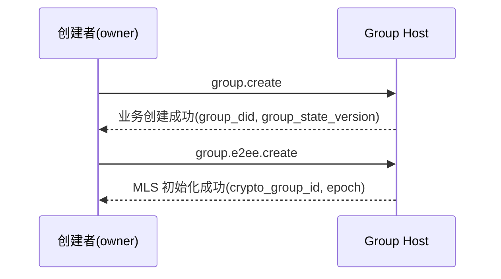
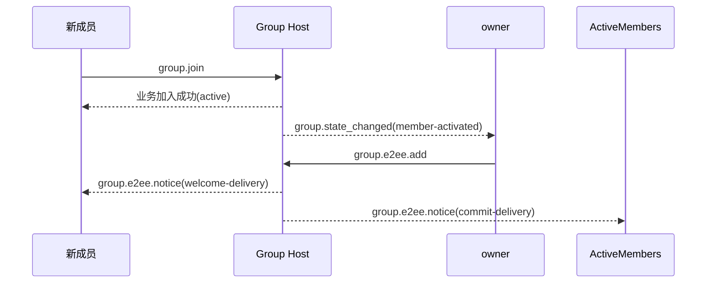
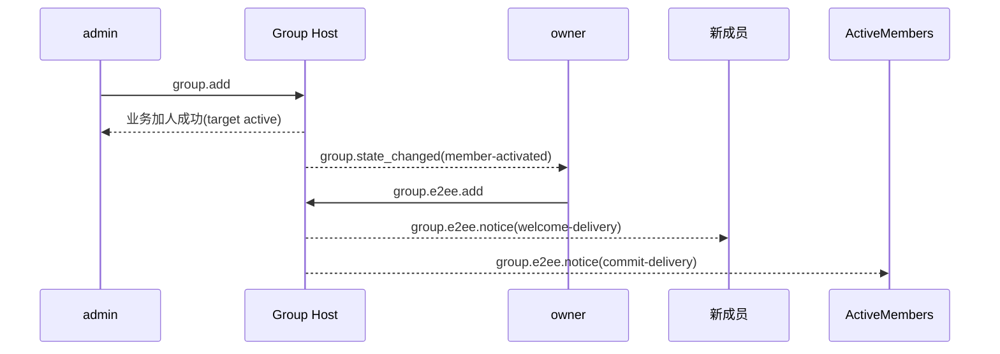
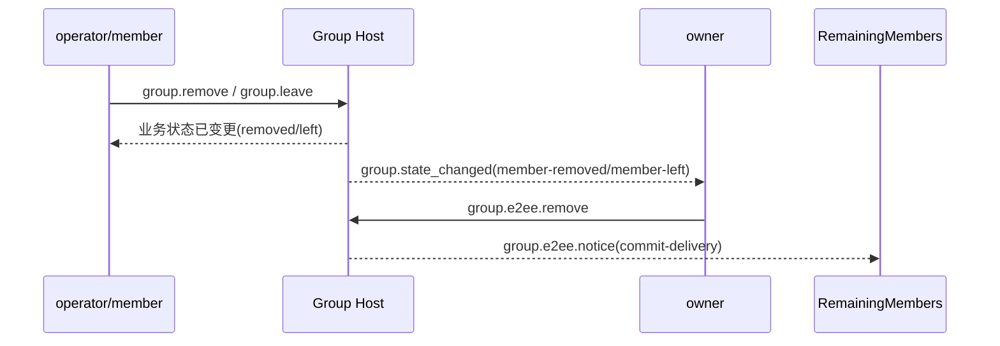
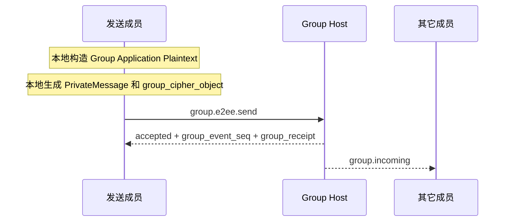

# ANP Profile 6：群组端到端加密（MLS Usage Profile 修订稿）

- 文档编号：ANP-P6
- 标题：群组端到端加密
- 状态：Draft
- 版本：0.3.2（MLS Usage Profile 修订稿）
- 语言：中文
- 适用范围：本 Profile 适用于基于 Group DID 的群组端到端加密控制层，紧密配合 `anp.group.base.v1` 使用。

---

## 1. 目的

本 Profile 定义 ANP 的群组端到端加密控制层，规定：

1. 如何把 `group_did`、`group_state_version`、`group_event_seq` 与群密码学状态机绑定；
2. 如何使用 MLS 作为群密钥建立、成员变更和应用消息保护的基础协议；
3. 如何将 `did:wba` 身份与 MLS 成员凭证、KeyPackage、叶子签名键进行绑定；
4. 如何定义一组独立的 `group.e2ee.*` JSON-RPC 方法，专门承载 MLS 密码学动作；
5. 如何通过**状态耦合**而不是“P4 方法内嵌 MLS 握手对象”的方式，与 `anp.group.base.v1` 紧密协作；
6. 如何处理 `epoch`、`Welcome`、`PrivateMessage`、`PublicMessage`、`epoch_authenticator`、分叉检测与恢复。

本 Profile **不**定义：

- 历史消息拉取；
- 已读与在线状态；
- 设备或内部副本概念；
- Agent 内部多个执行单元之间如何共享群密钥状态；
- 群外目录同步的具体实现；
- 非群场景的端到端加密；
- External Commit 主线；
- `group_join_info` 与 `group.e2ee.get_join_info`；
- `accept_welcome` 协议方法；
- 第二套业务成员状态模型。

---

## 2. 术语与规范性约定

### 2.1 规范性关键字

本文中的 **MUST**、**MUST NOT**、**REQUIRED**、**SHALL**、**SHALL NOT**、**SHOULD**、**SHOULD NOT**、**RECOMMENDED**、**NOT RECOMMENDED**、**MAY**、**OPTIONAL** 按照其大写形式解释为规范性要求。

### 2.2 术语

- **Group DID**：群的应用层全球标识，即 `group_did`。
- **Crypto Group ID**：群密码学内部标识，对应 MLS `group_id`，可与 `group_did` 不同。
- **Group Host Service**：负责群基础状态排序、策略应用与群消息入口的服务；不是 MLS 控制者。
- **MLS Group State**：基于 MLS 维护的群密码学状态。
- **Epoch**：MLS 群状态的一次代际推进。
- **KeyPackage**：MLS 加入材料对象，用于把一个新成员加入群。
- **Welcome**：MLS 欢迎对象，用于帮助新成员初始化群状态。
- **PrivateMessage**：加密且带成员认证的 MLS 消息。
- **PublicMessage**：仅签名而不加密的 MLS 消息。
- **did:wba Binding**：把某个 MLS 叶子签名键、成员凭证或 KeyPackage 绑定到某个 `agent_did` 的可验证证明对象。
- **MLS Controller**：负责执行 MLS 成员变更控制动作的主体。v1 中固定为群 `owner`。
- **State Coupling**：P4 与 P6 不做逐方法映射，而是通过业务状态变化触发密码学状态推进的耦合方式。
- **E2EE Notice**：P6 自己定义的独立加密通知对象，用于交付 `commit`、`welcome` 等密码学结果。
- **Fork**：对同一 `group_did`，不同成员观察到无法调和的 `epoch` / `epoch_authenticator` / 状态推进序列。

---

## 3. 设计原则

### 3.1 群身份与密码学状态分层

本 Profile 明确区分：

- `group_did`：应用层群全球标识；
- `crypto_group_id`：密码学群内部标识；
- `group_state_version`：由 Group Host 分配的应用层群状态版本；
- `epoch`：由 MLS 状态机分配的密码学群代际。

这四者 **MUST NOT** 被机械等同；但它们之间 **MUST** 有可验证的绑定关系。

### 3.2 一个 Agent = 一个外部群成员

本 Profile 的外部互通边界中，一个群成员始终由一个 `agent_did` 表示。协议层 **不**引入设备、终端或内部副本成员概念。

某 Agent 内部若有多个执行副本，它们如何共享或同步 MLS 群状态，属于该 Agent 内部实现，不属于本 Profile 的互通语义。

### 3.3 P4 是业务主协议，P6 是密码学控制层

本 Profile 与 `anp.group.base.v1` 的关系如下：

- P4 定义群的业务动作、业务状态、排序语义与回执语义；
- P6 定义 MLS 密码学动作、密码学对象、绑定规则和验证要求；
- P4 仍然是业务层权威；
- P6 **不**重新定义 `active / left / removed` 等业务成员状态；
- P6 **不**要求在 P4 方法体内直接携带 MLS 原生对象。

### 3.4 状态耦合，而不是逐方法映射

P4 与 P6 的耦合通过**状态**实现，而不是通过“某个 P4 方法直接映射某个 P6 方法”的方式实现。

也就是说：

- P4 决定某件事在业务上是否成立；
- P6 观察该业务状态变化，并推进 MLS 状态。

例如：

- 某群在 P4 中创建成功，且创建者已成为 `owner` → owner 自动执行 `group.e2ee.create`
- 某成员在 P4 中成为 `active`，且尚未进入 MLS 成员集 → owner 自动执行 `group.e2ee.add`
- 某成员在 P4 中变为 `left` 或 `removed`，且仍在 MLS 成员集 → owner 自动执行 `group.e2ee.remove`

### 3.5 owner 是唯一 MLS 控制者

v1 中，**只有 owner 承担 MLS 控制者角色**。

owner 负责：

- 创建 MLS group；
- 执行 `add`；
- 执行 `remove`；
- 生成成员变更对应的 `commit`；
- 为新成员生成 `welcome`；
- 推进成员变更后的 `epoch`。

### 3.6 Group Host 负责排序，不负责 MLS 控制

Group Host Service 的职责是：

- 接收并排序 P4 业务操作；
- 为已接受事件分配 `group_event_seq`；
- 推进 `group_state_version`；
- 生成 `group_receipt`；
- 分发群消息与 E2EE Notice；
- 见证 MLS 控制结果在业务层的落位。

默认情况下，Group Host Service：

- **不应** 作为 MLS 控制者；
- **不应** 作为 MLS 群成员；
- **不应** 持有群应用明文的解密能力。

### 3.7 owner 管群状态，active 成员管群消息

owner 只控制：

- 成员变更；
- 群密码学状态推进；
- `epoch` 更新。

所有 `active` 成员都可以：

- 使用当前群状态生成自己的群消息密文；
- 调用 `group.e2ee.send` 发送自己的群消息；
- 解密其它成员的群消息。

本 Profile **不**要求所有群消息都由 owner 代为加密。

### 3.8 v1 不支持 External Commit

v1 中：

- 不支持 External Commit；
- 不定义 `group_join_info`；
- 不定义 `group.e2ee.get_join_info`；
- 不定义 `accept_welcome` 协议方法。

所有入群路径在密码学层最终统一为 owner 发起的 MLS `add`。

### 3.9 只有消息面进入 PrivateMessage

v1 中：

- 只有 `group.e2ee.send` 的应用消息内容进入 MLS `PrivateMessage` 并被加密；
- `group.e2ee.create`、`group.e2ee.add`、`group.e2ee.remove` 都继续使用明文 JSON-RPC 请求体；
- `commit`、`welcome` 等对象作为方法输入或 Notice 载荷出现，而不是再嵌进 P4 业务方法体。

---

## 4. 依赖、Profile 标识与目标建模

### 4.1 Profile 名称

本 Profile 的标准名称为：

`anp.group.e2ee.v1`

### 4.2 依赖关系

本 Profile **MUST** 依赖以下 Profile：

- `anp.core.binding.v1`
- `anp.identity.discovery.v1`
- `anp.group.base.v1`

### 4.3 安全模式

使用本 Profile 时：

- `meta.profile` **MUST** 等于 `anp.group.e2ee.v1`。

其中：

- `group.e2ee.publish_key_package`、`group.e2ee.get_key_package`、`group.e2ee.notice` **MUST** 使用 `transport-protected`
- `group.e2ee.create`、`group.e2ee.add`、`group.e2ee.remove`、`group.e2ee.send` **MUST** 使用 `group-e2ee`

对 `group.e2ee.send` 而言，`group-e2ee` 表示它承载的消息语义属于群 E2EE 面；并不表示其外层 JSON-RPC 请求体再次被群加密。

### 4.4 方法目标建模

### 4.4.1 service-scoped

以下方法 **MUST** 为 `service-scoped`：

- `group.e2ee.publish_key_package`
- `group.e2ee.get_key_package`
- `group.e2ee.create`

规则：

- `meta.target.kind = "service"`
- `meta.target.did` **MUST** 等于目标公开 `ANPMessageService.serviceDid`

其中 `group.e2ee.create` 采用 service-scoped 的原因是：  
在业务层 `group.create` 成功前，群的业务状态刚刚建立，`group_did` 虽已生成，但创建动作本身仍面向群 Host 服务入口完成密码学初始化，因此 v1 统一采用 service-scoped。

### 4.4.2 group-addressed

以下方法 **MUST** 为 `group-addressed`：

- `group.e2ee.add`
- `group.e2ee.remove`
- `group.e2ee.send`

规则：

- `meta.target.kind = "group"`
- `meta.target.did` **MUST** 等于目标 `group_did`

### 4.4.3 agent-addressed notification

以下通知 **MUST** 为 `agent-addressed`：

- `group.e2ee.notice`

规则：

- `meta.target.kind = "agent"`
- `meta.target.did` **MUST** 等于通知接收方 Agent DID

---

## 5. 密码学主线与 MTI 套件

### 5.1 主线协议

本 Profile 的群密钥主线 **MUST** 基于 MLS 1.0 语义实现，但 v1 只固定其受限使用子集。

v1 主线至少包括：

- KeyPackage
- Add
- Remove
- Commit
- Welcome
- PrivateMessage
- Epoch 推进

其中：

- `commit_b64u` **MUST** 以完整 MLS `MLSMessage`（`mls-public-message`）按 TLS 序列化后的原始字节表示；
- `welcome_b64u` **MUST** 以 MLS `Welcome` 对象按 TLS 序列化后的原始字节表示；
- `PrivateMessage` **MUST** 作为群应用消息的唯一密文承载对象。

MLS 库 **MAY** 额外支持 `Update`、proposal batching、PSK、ReInit 等标准能力；但这些能力 **不属于** 本 Profile v1 的最小协议主线，也 **不构成** v1 的互通要求。

### 5.2 Mandatory-to-Implement 套件

为保证最小互通，符合本 Profile 的实现 **MUST** 支持下列 MTI 套件：

`MLS_128_DHKEMX25519_AES128GCM_SHA256_Ed25519`

### 5.3 额外套件

实现 **MAY** 支持更多 MLS 套件，但：

- 所有成员在同一群内 **MUST** 对所用套件达成一致；
- 若群策略限制允许套件集合，则 MLS Controller **MUST** 拒绝不满足策略的套件。

### 5.4 与 did:wba 的关系

本 Profile 的主线与 did:wba 的关系如下：

- DID 文档中的 `authentication` / `assertionMethod` 用于身份绑定证明；
- DID 文档中的 `keyAgreement` **SHOULD** 至少包含一个 X25519 条目，表示该 Agent 具备 E2EE 能力；
- MLS 群成员的叶子签名键 **不应** 直接等同于 DID 长期身份签名键；
- 叶子签名键 **SHOULD** 单独生成，并通过 `did:wba Binding` 绑定到 `agent_did`。

---

## 6. did:wba 与 MLS 的绑定模型

### 6.1 绑定目标

本 Profile 要求把以下 MLS 元素绑定到 `agent_did`：

1. KeyPackage 所属者；
2. 当前叶子签名键；
3. 群成员凭证中的身份字符串。

### 6.2 Credential Identity 规则

对于本 Profile，MLS 成员凭证中的 `credential.identity` **MUST** 等于 `agent_did` 的 UTF-8 字节串。

实现 **MUST NOT** 使用本地账号 ID、设备 ID、数值用户 ID 或其它非 DID 字符串替代 `credential.identity`。

### 6.3 `did_wba_binding` 对象

本 Profile 定义 `did_wba_binding` 对象，用于把 MLS 叶子签名键绑定到 `agent_did`。

推荐结构如下：

```json
{
  "agent_did": "did:wba:example.com:agents:alice:e1_<fingerprint>",
  "verification_method": "did:wba:example.com:agents:alice:e1_<fingerprint>#key-1",
  "leaf_signature_key_b64u": "BASE64URL_ED25519_LEAF_PK",
  "issued_at": "2026-03-29T12:00:00Z",
  "expires_at": "2026-04-29T12:00:00Z",
  "proof": {
    "type": "DataIntegrityProof",
    "cryptosuite": "eddsa-jcs-2022",
    "created": "2026-03-29T12:00:00Z",
    "proofPurpose": "assertionMethod",
    "verificationMethod": "did:wba:example.com:agents:alice:e1_<fingerprint>#key-1",
    "proofValue": "z..."
  }
}
```

`did_wba_binding.proof` **MUST** 复用 P1 附录 B 定义的共享 **Object Proof Profile**。

对 `did_wba_binding` 而言：

- issuer DID **MUST** 为 `agent_did`
- 被保护文档 **MUST** 是移除 `proof` 后的整个 `did_wba_binding` 对象
- `proof.verificationMethod` **MUST** 指向 `agent_did` DID 文档中被 `assertionMethod` 授权的验证方法

### 6.4 `did_wba_binding` 验证规则

接收方在接受 KeyPackage、LeafNode 更新或新成员加入前，**MUST** 完成以下验证：

1. `agent_did` 可被解析；
2. `verification_method` 存在于该 DID 文档中；
3. `verification_method` **MUST** 被 DID 文档的 `assertionMethod` 授权；
4. `proof` **MUST** 存在，并 **MUST** 满足 P1 附录 B 的共享 Object Proof Profile；
5. `proof` 的 issuer DID **MUST** 等于 `agent_did`；
6. `proof` 验证通过；
7. `proof` 绑定的文档内容 **MUST** 至少覆盖 `agent_did`、`verification_method`、`leaf_signature_key_b64u`、`issued_at`、`expires_at`；
8. KeyPackage / LeafNode 中实际的叶子签名公钥与 `leaf_signature_key_b64u` 一致；
9. MLS 凭证中的 `credential.identity` 与 `agent_did` 一致；
10. 若存在 `issued_at` / `expires_at`，实现 **MUST** 按本地时间有效性策略校验其时间窗口。

### 6.5 `e1_` 与 `k1_` 兼容

- 对默认 `e1_` DID，`did_wba_binding.proof` **MUST** 复用 P1 附录 B 的共享 Object Proof Profile；
- 对兼容型 `k1_` DID，`did_wba_binding.proof` **MAY** 使用显式扩展协商定义的替代 Object Proof Profile；但在未显式扩展协商时，v1 MTI **不**把 `k1_` 绑定 proof 作为默认互通路径；
- 无论 DID 的身份曲线为何，MLS 群的 MTI 叶子签名键仍 **MAY** 使用 Ed25519，只要绑定证明成立即可。

---

## 7. 核心对象

### 7.1 `crypto_group_id`

`crypto_group_id` 表示 MLS 的内部 `group_id`。

规则如下：

- `crypto_group_id` **MUST** 作为不透明字节串处理；
- 在 JSON 中 **MUST** 采用 `base64url` 表示，字段名推荐为 `crypto_group_id_b64u`；
- `crypto_group_id` **MUST** 与 `group_did` 建立可验证绑定。

### 7.2 `group_state_ref`

本 Profile 复用 P4 的 `group_state_ref` 概念，并要求在 E2EE 群中至少包含：

- `group_did`
- `group_state_version`
- `policy_hash`（若群策略已哈希化）

### 7.3 `group_key_package`

本 Profile 定义群加入材料包装对象：

```json
{
  "key_package_id": "kp-001",
  "owner_did": "did:wba:example.com:agents:bob:e1_<fingerprint>",
  "suite": "MLS_128_DHKEMX25519_AES128GCM_SHA256_Ed25519",
  "mls_key_package_b64u": "BASE64URL_KEYPACKAGE",
  "did_wba_binding": { ... },
  "expires_at": "2026-04-30T00:00:00Z"
}
```

其中：

- `key_package_id` **MUST** 存在；
- `owner_did` **MUST** 存在；
- `suite` **MUST** 存在；
- `mls_key_package_b64u` **MUST** 存在；
- `did_wba_binding` **MUST** 存在；
- `expires_at` **SHOULD** 存在；
- `mls_key_package_b64u` **MUST** 为 MLS `KeyPackage` 对象按 MLS 1.0 TLS 序列化后的原始字节的无填充 base64url。

`group_key_package` 主要用于 owner 后续执行 `group.e2ee.add`。

### 7.4 `group_cipher_object`

`group_cipher_object` 是 `group.e2ee.send` 的线协议消息体对象。

推荐结构如下：

```json
{
  "crypto_group_id_b64u": "BASE64URL_GROUPID",
  "epoch": "7",
  "private_message_b64u": "BASE64URL_PRIVATEMESSAGE",
  "group_state_ref": {
    "group_did": "did:wba:groups.example:team:dev:e1_<fingerprint>",
    "group_state_version": "42",
    "policy_hash": "sha-256:..."
  },
  "epoch_authenticator": "BASE64URL_AUTH"
}
```

规则：

- `crypto_group_id_b64u` **MUST** 存在；
- `epoch` **MUST** 存在；
- `private_message_b64u` **MUST** 存在；
- `private_message_b64u` **MUST** 为 MLS `PrivateMessage` 对象按 MLS 1.0 TLS 序列化后的原始字节的无填充 base64url；
- `group_state_ref.group_did` **MUST** 等于外层目标 `group_did`。

### 7.5 `Group Application Plaintext`

群应用消息在进入 MLS `PrivateMessage` 加密前，**MUST** 归一化为以下内层明文对象：

```json
{
  "application_content_type": "text/plain | application/json | application/anp-attachment-manifest+json | ...",
  "thread_id": "thr-001",
  "reply_to_message_id": "msg-0009",
  "annotations": {},
  "text": "...",
  "payload": {},
  "payload_b64u": "..."
}
```

规则：

- `application_content_type` **MUST** 存在；
- `text` / `payload` / `payload_b64u` **MUST** 恰好出现一个；
- P4 中消息语义字段 `thread_id`、`reply_to_message_id`、`annotations` 在群 E2EE 下 **MUST** 位于该内层对象中；
- 发送方在加密前 **MUST** 将整个 `Group Application Plaintext` 对象使用 UTF-8 + RFC 8785 JCS 序列化为字节串；接收方解密后 **MUST** 按相同规则解释该对象。

### 7.6 `e2ee_notice_object`

P6 定义独立的加密通知对象，用于交付密码学结果。

推荐结构如下：

```json
{
  "notice_id": "en-001",
  "notice_type": "commit-delivery | welcome-delivery",
  "group_did": "did:wba:groups.example:team:dev:e1_<fingerprint>",
  "group_state_ref": {
    "group_did": "did:wba:groups.example:team:dev:e1_<fingerprint>",
    "group_state_version": "43",
    "policy_hash": "sha-256:..."
  },
  "crypto_group_id_b64u": "BASE64URL_GROUPID",
  "epoch": "8",
  "subject_did": "did:wba:b.example:agents:bob:e1_<fingerprint>",
  "commit_b64u": "BASE64URL_MLSMESSAGE",
  "welcome_b64u": "BASE64URL_WELCOME",
  "ratchet_tree_b64u": "BASE64URL_RATCHET_TREE",
  "epoch_authenticator": "BASE64URL_AUTH",
  "group_receipt": { ... }
}
```

规则：

- `notice_type` **MUST** 存在；
- `group_did` **MUST** 存在；
- `group_state_ref` **MUST** 存在；
- `crypto_group_id_b64u` **MUST** 存在；
- `epoch` **MUST** 存在；
- `notice_type = "commit-delivery"` 时，`commit_b64u` **MUST** 存在；
- `notice_type = "welcome-delivery"` 时，`welcome_b64u` 与 `ratchet_tree_b64u` **MUST** 同时存在；
- `ratchet_tree_b64u` **MUST** 为 ratchet tree 的 TLS 序列化原始字节的无填充 base64url；
- `group_receipt` **MAY** 存在，用于把密码学结果与业务排序位置关联起来。

---

## 8. KeyPackage 发布与发现方法

### 8.1 `group.e2ee.publish_key_package`

#### 8.1.1 语义

由某 Agent 向其自己公开的 `ANPMessageService` 发布一个可用于群加入的 KeyPackage。

#### 8.1.2 请求要求

- `method = "group.e2ee.publish_key_package"`
- `meta.profile = "anp.group.e2ee.v1"`
- `meta.security_profile = "transport-protected"`
- `meta.target.kind = "service"`
- `meta.target.did` **MUST** 等于发布方自己公开的 `ANPMessageService.serviceDid`
- `meta.sender_did` **MUST** 存在
- `body.group_key_package` **MUST** 存在
- `body.group_key_package.owner_did` **MUST** 等于 `meta.sender_did`

认证约束：

- 该方法属于 **service-scoped** 控制面方法；
- 调用方 **MUST** 运行在已认证的本域会话或等价 hop / service 认证上下文中；
- v1 **不要求** 为该方法额外定义新的业务层 `origin_proof`。

#### 8.1.3 成功响应

成功响应 **MUST** 至少包含：

- `published = true`
- `owner_did`
- `key_package_id`
- `published_at`

### 8.2 `group.e2ee.get_key_package`

#### 8.2.1 语义

通过目标 Agent 的 `ANPMessageService` 获取一个可用 KeyPackage。

#### 8.2.2 请求要求

- `meta.profile = "anp.group.e2ee.v1"`
- `meta.security_profile = "transport-protected"`
- `meta.target.kind = "service"`
- `meta.target.did` **MUST** 等于目标 Agent 公开的 `ANPMessageService.serviceDid`

`body` **MUST** 包含：

- `target_did`

`body` **MAY** 包含：

- `preferred_suite`
- `require_fresh`

认证约束：

- 该方法属于 **service-scoped** 控制面方法；
- v1 最小互通要求至少是 hop / service 级认证；
- **匿名获取 KeyPackage 不属于 v1 MTI**。

#### 8.2.3 成功响应

成功响应 **MUST** 至少包含：

- `target_did`
- `group_key_package`

#### 8.2.4 服务端发放规则

`ANPMessageService` 在返回 `group_key_package` 时：

- **SHOULD** 返回未过期、未撤销且未消费的 KeyPackage；
- **MAY** 在返回后先把它标记为 `reserved` 或等价状态，以避免并发重复发放；
- 当对应的 `group.e2ee.add` 被 Group Host 成功接受并完成密码学成员变更后，**MUST** 将其标记为 `consumed` 或从发布集合中删除；
- 若对应流程失败、取消或超时，是否释放该保留态 KeyPackage 由部署策略决定，但 **SHOULD NOT** 导致同一个 KeyPackage 被两个都会成功的 `group.e2ee.add` 并发复用；
- caller identity、限流与防滥用策略 **MUST** 基于 hop / service 级认证实施。

---

## 9. MLS 控制面方法

### 9.1 总则

本章方法是独立的 JSON-RPC 方法。它们不是 P4 业务方法的“附加字段”，而是 P6 自己的密码学控制动作。

其中：

- `group.e2ee.create`、`group.e2ee.add`、`group.e2ee.remove` 是**成员变更控制方法**
- `group.e2ee.send` 是**消息发送方法**
- `group.e2ee.create/add/remove` 绑定到 P4 的既有业务状态，但**不会再创建新的 P4 业务成员状态**
- `group.e2ee.send` 直接作为线上发送方法，不再经 `group.send` 二次包装

### 9.2 `group.e2ee.create`

#### 9.2.1 语义

创建新的 MLS 群状态，并把 owner 作为初始成员加入。

#### 9.2.2 调用者

仅 owner。

#### 9.2.3 请求要求

- `method = "group.e2ee.create"`
- `meta.profile = "anp.group.e2ee.v1"`
- `meta.security_profile = "group-e2ee"`
- `meta.target.kind = "service"`
- `meta.target.did` **MUST** 等于目标群 Host 公开的 `ANPMessageService.serviceDid`
- `meta.sender_did` **MUST** 等于当前群 `owner`
- `auth.origin_proof` **MUST** 存在

`body` **MUST** 至少包含：

- `group_did`
- `group_state_ref`
- `suite`
- `creator_key_package`
- `crypto_group_id_b64u`
- `epoch`

规则：

- `creator_key_package.owner_did` **MUST** 等于 `meta.sender_did`
- `group_state_ref.group_did` **MUST** 等于 `body.group_did`
- `epoch` 对于初始群状态 **SHOULD** 为 `"0"` 或实现明确约定的初始值

#### 9.2.4 成功响应

成功响应 **MUST** 至少包含：

- `created = true`
- `group_did`
- `group_state_ref`
- `crypto_group_id_b64u`
- `epoch`
- `accepted_at`

说明：

- `group.e2ee.create` 本身 **MUST NOT** 单独创建新的 P4 业务群；
- 它只在 `group.create` 已被业务层接受之后执行；
- 它不再单独产生新的 `group_state_version` 或 `group_event_seq`。

### 9.3 `group.e2ee.add`

#### 9.3.1 语义

由 owner 执行 MLS `add`，把一个已经在业务层成为 `active`、但尚未进入 MLS 成员集的成员加入密码学群。

#### 9.3.2 调用者

仅 owner。

#### 9.3.3 请求要求

- `method = "group.e2ee.add"`
- `meta.profile = "anp.group.e2ee.v1"`
- `meta.security_profile = "group-e2ee"`
- `meta.target.kind = "group"`
- `meta.target.did` **MUST** 等于目标 `group_did`
- `meta.sender_did` **MUST** 等于当前群 `owner`
- `auth.origin_proof` **MUST** 存在

`body` **MUST** 至少包含：

- `member_did`
- `group_state_ref`
- `group_key_package`
- `crypto_group_id_b64u`
- `epoch`
- `commit_b64u`
- `welcome_b64u`
- `ratchet_tree_b64u`

规则：

- `group_state_ref.group_did` **MUST** 等于外层目标 `group_did`
- `group_key_package.owner_did` **MUST** 等于 `member_did`
- `commit_b64u` **MUST** 为完整 MLS `MLSMessage` 对象按 TLS 序列化后的无填充 base64url
- `welcome_b64u` **MUST** 为 MLS `Welcome` 对象按 TLS 序列化后的无填充 base64url
- `ratchet_tree_b64u` **MUST** 为 ratchet tree 的 TLS 序列化原始字节的无填充 base64url
- `epoch` **MUST** 表示本次 `add` 后的新 `epoch`

#### 9.3.4 成功响应

成功响应 **MUST** 至少包含：

- `accepted = true`
- `group_did`
- `member_did`
- `group_state_ref`
- `crypto_group_id_b64u`
- `epoch`
- `accepted_at`

说明：

- `group.e2ee.add` 本身 **MUST NOT** 把目标成员的 P4 业务状态改成 `active`；
- 该业务状态必须已经由 P4 决定；
- 本方法只负责把该业务结果落地到 MLS。

### 9.4 `group.e2ee.remove`

#### 9.4.1 语义

由 owner 执行 MLS `remove`，把一个已经在业务层变为 `removed` 或 `left` 的成员移出密码学群。

#### 9.4.2 调用者

仅 owner。

#### 9.4.3 请求要求

- `method = "group.e2ee.remove"`
- `meta.profile = "anp.group.e2ee.v1"`
- `meta.security_profile = "group-e2ee"`
- `meta.target.kind = "group"`
- `meta.target.did` **MUST** 等于目标 `group_did`
- `meta.sender_did` **MUST** 等于当前群 `owner`
- `auth.origin_proof` **MUST** 存在

`body` **MUST** 至少包含：

- `member_did`
- `group_state_ref`
- `crypto_group_id_b64u`
- `epoch`
- `commit_b64u`

规则：

- `commit_b64u` **MUST** 为完整 MLS `MLSMessage` 对象按 TLS 序列化后的无填充 base64url
- `epoch` **MUST** 表示本次 `remove` 后的新 `epoch`

#### 9.4.4 成功响应

成功响应 **MUST** 至少包含：

- `accepted = true`
- `group_did`
- `member_did`
- `group_state_ref`
- `crypto_group_id_b64u`
- `epoch`
- `accepted_at`

### 9.5 `group.e2ee.send`

#### 9.5.1 语义

向某群直接发送一条 MLS 加密群消息。

#### 9.5.2 调用者

任意当前 `active` 成员。

#### 9.5.3 请求要求

一个合规的 `group.e2ee.send` 请求 **MUST** 满足：

1. `method = "group.e2ee.send"`
2. `meta.profile = "anp.group.e2ee.v1"`
3. `meta.security_profile = "group-e2ee"`
4. `meta.target.kind = "group"`
5. `meta.target.did` **MUST** 是目标 `group_did`
6. `meta.sender_did` **MUST** 是当前发送方 Agent DID
7. `meta.message_id` **MUST** 存在
8. `meta.operation_id` **MUST** 存在
9. `meta.content_type` **MUST** 固定为 `application/anp-group-cipher+json`
10. `auth.origin_proof` **MUST** 存在
11. `body` **MUST** 直接是 `group_cipher_object`

说明：

- `group.e2ee.send` 直接就是线上发送方法；
- 它不再通过 P4 `group.send` 再包装一层。

#### 9.5.4 成功响应

成功响应 **MUST** 至少包含：

- `accepted = true`
- `group_did`
- `message_id`
- `operation_id`
- `group_event_seq`
- `group_state_version`
- `accepted_at`
- `epoch`
- `group_receipt`

该成功语义表示：

- Group Host 已接受并排序了一个 MLS 密文对象；
- 它 **不**自动表示所有成员都已经成功解密该消息。

---

## 10. 状态耦合规则

### 10.1 总则

P4 与 P6 的耦合通过**业务状态变化**完成。  
本 Profile **不**再要求维护一张 `group.create -> create`、`group.add -> add` 的逐方法映射表。

owner **MUST** 通过受信任的状态观察方式获知：

- 某群已经在业务层创建完成；
- 某成员已经在业务层成为 `active`；
- 某成员已经在业务层变为 `left` 或 `removed`。

状态观察方式 **MAY** 是：

- 本地与 Group Host 的内部编排；
- 对 `group.state_changed` 的订阅；
- 或其它等价且可信的状态观察机制。

### 10.2 群创建耦合规则

当 owner 观察到以下业务状态同时成立时：

- 某 `group_did` 已被创建；
- 创建者是自己；
- 该群尚未附着任何 `crypto_group_id`

owner **MUST** 触发一次 `group.e2ee.create`。

### 10.3 成员加入耦合规则

当 owner 观察到以下业务状态同时成立时：

- 某 `member_did` 在 P4 中已经是该群的 `active` 成员；
- 该成员当前尚未进入 MLS 成员集；
- 该成员有可用的 `group_key_package`

owner **MUST** 触发一次 `group.e2ee.add`。

本规则同时适用于：

- `group.join`
- `group.add`
- 部署扩展的邀请加入
- 部署扩展的审批通过

也就是说，P4 的各种加入业务入口在密码学层最终都收敛为一次 `group.e2ee.add`。

### 10.4 成员移除 / 离群耦合规则

当 owner 观察到以下业务状态同时成立时：

- 某 `member_did` 在 P4 中已经变为 `removed` 或 `left`；
- 该成员当前仍在 MLS 成员集

owner **SHOULD** 触发一次 `group.e2ee.remove`。

### 10.5 消息发送规则

`group.e2ee.send` **不是**状态耦合触发的方法。  
它是成员显式发起的线上发送方法。

但它的业务一致性要求仍与 P4 紧密绑定：

- 发送者 **MUST** 是当前 `active` 成员；
- 发送者 **MUST** 满足 P4 `group_policy.permissions.send`
- 成功响应中的 `group_event_seq`、`group_state_version`、`group_receipt` 语义沿用 P4 对群消息的定义。

---


## 11. MLS Usage Profile（规范性）

### 11.1 总则与外部规范引用

本章定义本 Profile 对 MLS 的**受限使用子集与固定配置**。  
本章的目标不是重写 MLS 标准，而是规定：

- v1 允许使用 MLS 的哪些对象与状态机动作；
- 这些对象在线协议中如何编码；
- owner、active member、Group Host 分别需要承担哪些本地状态与处理义务；
- `group.e2ee.create`、`group.e2ee.add`、`group.e2ee.remove`、`group.e2ee.send` 背后对应什么 MLS 语义。

实现 **MUST NOT** 修改 MLS 的核心算法语义；但当 MLS 标准库默认自由度与本 Profile 的 v1 受限规则发生冲突时，**MUST** 以本 Profile 为准。

### 11.2 v1 允许的 MLS 子集

本 Profile v1 的 MLS 主线只允许以下对象和动作进入互通边界：

- `KeyPackage`
- `Add`
- `Remove`
- `Commit`
- `Welcome`
- `PrivateMessage`
- `epoch` 推进

在本 Profile v1 中：

- `commit_b64u` **MUST** 对应完整 MLS `MLSMessage`，其 wire format **MUST** 为 `mls-public-message`
- `welcome_b64u` **MUST** 对应 MLS `Welcome`
- `private_message_b64u` **MUST** 对应 MLS `PrivateMessage`

本 Profile v1 **不**把以下能力纳入互通主线：

- External Commit
- `GroupInfo` / `group_join_info`
- `group.e2ee.get_join_info`
- 独立 `accept_welcome` 协议方法
- 多控制者并发提交
- 非 owner 发起的成员变更
- 作为协议级主线动作的 `Update`
- proposal batching 作为互通要求
- ReInit、PSK、Subgroup 或自定义 MLS 扩展作为 v1 MTI 要求

实现使用的 MLS 库 **MAY** 支持上述能力；但未显式扩展协商时，**MUST NOT** 把它们带入 v1 线协议互通。

### 11.3 MTI 套件与固定算法

本 Profile v1 **MUST** 实现以下 MTI 套件：

`MLS_128_DHKEMX25519_AES128GCM_SHA256_Ed25519`

对应固定算法配置如下：

- KEM / HPKE DH：`DHKEMX25519`
- AEAD：`AES-128-GCM`
- Hash / KDF 基础：`SHA-256`
- 叶子签名：`Ed25519`

此外，本 Profile 中所有进入 proof、AAD 或内层明文绑定的 JSON 对象 **MUST** 使用 UTF-8 + RFC 8785 JCS 编码。这一要求至少适用于：

- `did_wba_binding` 的被保护对象
- `Group Application Plaintext`
- `group.e2ee.send` 的 `authenticated_data`
- 成员变更提交的受认证绑定对象

### 11.4 `group.e2ee.create` 的 MLS 语义

`group.e2ee.create` 只在 `group.create` 已被业务层接受后执行。

执行 `group.e2ee.create` 时，owner 的本地 MLS runtime **MUST**：

1. 验证 `creator_key_package`
2. 验证其中的 `did_wba_binding`
3. 创建新的 MLS group state
4. 生成新的 `crypto_group_id`
5. 把 owner 作为第一个 MLS 成员加入
6. 形成初始 `epoch`
7. 建立 owner 本地持久状态

`group.e2ee.create` **MUST NOT** 单独创造新的 P4 业务群；它只为已存在的业务群创建对应的初始 MLS 状态。

### 11.5 `group.e2ee.add` 的 MLS 语义

`group.e2ee.add` 是 v1 中唯一标准入群密码学主线。

执行 `group.e2ee.add` 时，owner 的本地 MLS runtime **MUST**：

1. 获取并验证目标成员的 `group_key_package`
2. 校验 `KeyPackage` 与 `did_wba_binding`
3. 校验目标成员在业务层已经成为 `active`
4. 基于当前群状态执行 MLS `Add`
5. 生成新的 `Commit`
6. 为新成员生成 `Welcome`
7. 导出或构造足以让新成员 bootstrap 的 ratchet tree 材料
8. 推进新的 `epoch`
9. 更新 owner 本地群状态

因此，v1 中的标准入群密码学主线为：

```text
KeyPackage
→ Add
→ Commit
→ Welcome
→ ratchet_tree
→ 新 epoch
```

为降低实现歧义，v1 规定：

- `commit_b64u` **MUST** 为完整 MLS `MLSMessage` 的 TLS 序列化原始字节；
- `welcome_b64u` **MUST** 为 MLS `Welcome` 的 TLS 序列化原始字节；
- `ratchet_tree_b64u` **MUST** 单独显式提供给新成员；
- `welcome-delivery` **MUST NOT** 依赖“Welcome 内部可能自带 ratchet tree”这一库级可选行为。

### 11.6 `group.e2ee.remove` 的 MLS 语义

执行 `group.e2ee.remove` 时，owner 的本地 MLS runtime **MUST**：

1. 校验目标成员在业务层已经进入 `removed` 或 `left`
2. 校验该成员当前仍在 MLS 成员集
3. 基于当前群状态执行 MLS `Remove`
4. 生成新的 `Commit`
5. 推进新的 `epoch`
6. 更新 owner 本地群状态
7. 使被移除成员失去后续消息解密能力

`group.e2ee.remove` 的线协议输出 **MUST** 至少包含：

- `commit_b64u`
- `crypto_group_id_b64u`
- `epoch`
- `group_state_ref`

### 11.7 `group.e2ee.send` 的加密语义

发送者调用 `group.e2ee.send` 时，其本地 MLS runtime **MUST**：

1. 校验自己当前是 `active` 成员
2. 校验自己满足 P4 `permissions.send`
3. 构造 `Group Application Plaintext`
4. 构造第 13 章定义的 `authenticated_data`
5. 使用当前 MLS group state 把内层明文加密为 MLS `PrivateMessage`
6. 构造 `group_cipher_object`
7. 将该对象作为 `group.e2ee.send` 的 `body` 提交给 Group Host

`group.e2ee.send` 的成功仅表示：

- Group Host 已接受并排序了一个 MLS 密文对象；
- 它 **不**自动表示所有成员都已成功解密该消息。

### 11.8 群消息解密义务

接收成员在收到 `group.e2ee.send` 对应的密文对象后，**MUST**：

1. 根据 `group_did` 找到本地对应的 MLS group state
2. 校验 `crypto_group_id_b64u` 与本地绑定一致
3. 校验 `epoch` 是否在可接受窗口内
4. 使用本地 MLS state 解密 `private_message_b64u`
5. 校验 `authenticated_data`
6. 解析内层 `Group Application Plaintext`
7. 仅在全部检查通过后，把消息交付上层

若任一步骤失败，接收方 **MUST NOT** 把该消息作为有效群消息交付应用层。

### 11.9 `group.e2ee.notice` 的本地处理义务

#### 11.9.1 `commit-delivery`

收到 `notice_type = "commit-delivery"` 时，接收方本地 MLS runtime **MUST**：

1. 解码 `commit_b64u`
2. 校验 `group_did`、`group_state_ref`、`crypto_group_id_b64u`、`epoch`
3. 把该 commit 应用到本地 MLS group state
4. 更新本地当前 `epoch`
5. 记录必要的 `epoch_authenticator` 或一致性状态（若存在）

#### 11.9.2 `welcome-delivery`

收到 `notice_type = "welcome-delivery"` 时，新成员本地 MLS runtime **MUST**：

1. 解码 `welcome_b64u`
2. 解码 `ratchet_tree_b64u`
3. 校验 `group_did`、`group_state_ref`、`crypto_group_id_b64u`、`epoch`
4. 用 `welcome_b64u` + `ratchet_tree_b64u` 初始化本地 MLS group state
5. 把该状态绑定到本地的 `group_did`
6. 准备接收后续 `commit-delivery` 与群消息

Welcome 处理是**本地行为规范**，不是新的 JSON-RPC 协议方法。

### 11.10 本地持久状态要求

为保证跨重启与跨通知时序下的可实现性，各参与方 **SHOULD** 至少持久化以下状态。

#### 11.10.1 owner

owner **SHOULD** 至少持久化：

- `group_did`
- `crypto_group_id`
- 当前 `epoch`
- 当前 MLS group state
- 当前业务层已同步的成员集视图
- 最近一次成功应用的 `add/remove` 结果引用

#### 11.10.2 active member

普通 active 成员 **SHOULD** 至少持久化：

- `group_did`
- `crypto_group_id`
- 当前可用 MLS group state
- 当前 `epoch`
- 最近一次成功应用的 `commit/welcome` 引用

#### 11.10.3 Group Host

Group Host **SHOULD** 至少持久化：

- `group_state_version`
- `group_event_seq`
- `group_receipt`
- 与 `crypto_group_id`、`epoch` 的外层绑定引用

Group Host 默认 **不要求** 持久化可解密群消息的 MLS 私有状态。

### 11.11 v1 不支持的 MLS 能力

除第 11.2 节列出的排除项外，本 Profile v1 还 **不支持**：

- 把 `Update` 作为独立的协议级动作暴露
- 通过 notice 交付未绑定 `group_state_ref` 的密码学结果
- 依赖 MLS 库隐式自动恢复缺失的 tree material
- 让非 owner 成员提交改变成员集的 `Commit`
- 让 Group Host 代替成员完成最终 MLS 有效性判断

---

## 12. 独立通知模型

### 12.1 总则

P6 自己定义独立通知：

- `group.e2ee.notice`

它**不复用** P4 的 `group.state_changed` 来传递 Welcome 或 Commit。  
P4 的 `group.state_changed` 继续只负责**业务状态变化**；  
P6 的 `group.e2ee.notice` 专门负责**密码学结果交付**。

### 12.2 `group.e2ee.notice`

#### 12.2.1 语义

向某个目标 Agent 定向投递群密码学相关的结果对象。

#### 12.2.2 Notification envelope 约束

- `method = "group.e2ee.notice"`
- `meta.profile = "anp.group.e2ee.v1"`
- `meta.security_profile = "transport-protected"`
- `meta.target.kind = "agent"`
- `meta.target.did` **MUST** 等于当前通知接收方 DID
- `meta.sender_did` **SHOULD** 等于 `group_did`
- `body` **MUST** 直接承载 `e2ee_notice_object`

### 12.3 `notice_type = "commit-delivery"`

用于向当前已有 MLS 成员交付：

- `commit_b64u`
- 新 `epoch`
- 新 `epoch_authenticator`（若可得）

接收方收到后应按本地 MLS runtime 规则处理该 commit。

### 12.4 `notice_type = "welcome-delivery"`

用于向新成员定向交付：

- `welcome_b64u`
- `ratchet_tree_b64u`
- 新 `epoch`
- `group_state_ref`

规则如下：

- `welcome_b64u` **MUST** 为 MLS `Welcome` 的 TLS 序列化原始字节；
- `ratchet_tree_b64u` **MUST** 为 ratchet tree 的 TLS 序列化原始字节；
- 该 notice **MUST NOT** 发送给目标新成员之外的其它接收方；
- 新成员 **MUST** 使用 `welcome_b64u + ratchet_tree_b64u` 完成本地 bootstrap。

### 12.5 与 P4 通知的关系

- P4 `group.state_changed`：只承载业务事件
- P4 `group.incoming`：继续承载群消息投递
- P6 `group.e2ee.notice`：只承载密码学 notice

这样三者边界清楚，不互相冒充。

---

## 13. 绑定、AAD 与验证要求

### 13.1 最小绑定集合

以下字段 **MUST** 进入受认证绑定范围：

- `group_did`
- `crypto_group_id`
- `group_state_version`（或 `group_state_ref`）
- `policy_hash`（若存在）
- `meta.sender_did`
- `meta.message_id` / `meta.operation_id`
- `meta.security_profile = group-e2ee`

### 13.1.1 `group.e2ee.send` 的 `authenticated_data`

`group.e2ee.send` 使用 MLS `PrivateMessage` 时，其 `authenticated_data` **MUST** 是以下 JSON 对象经 UTF-8 + RFC 8785 JCS 编码后的字节串：

```json
{
  "content_type": "application/anp-group-cipher+json",
  "group_did": "<outer meta.target.did>",
  "crypto_group_id_b64u": "<body.crypto_group_id_b64u>",
  "group_state_ref": { "...": "..." },
  "security_profile": "group-e2ee",
  "sender_did": "<outer meta.sender_did>",
  "message_id": "<outer meta.message_id>",
  "operation_id": "<outer meta.operation_id>"
}
```

### 13.1.2 `group.e2ee.add/remove` 的提交绑定

owner 在本地生成 `commit_b64u` 时，**SHOULD** 至少把以下语义放入其受认证绑定范围（例如 MLS `authenticated_data` 或等价上下文）：

```json
{
  "group_did": "<outer meta.target.did>",
  "crypto_group_id_b64u": "<body.crypto_group_id_b64u>",
  "group_state_ref": { "...": "..." },
  "subject_method": "group.e2ee.add | group.e2ee.remove",
  "member_did": "<body.member_did>",
  "epoch": "<body.epoch>",
  "security_profile": "group-e2ee",
  "sender_did": "<outer meta.sender_did>",
  "operation_id": "<outer meta.operation_id>"
}
```

所有缺省可选字段 **MUST** 直接省略，**MUST NOT** 使用 `null`、空字符串或其它占位值代替省略字段。

### 13.2 KeyPackage 验证

接收方在接受某 KeyPackage 用于入群前，**MUST**：

1. 解码 MLS `KeyPackage`
2. 校验其 protocol version 与 suite 满足本群要求
3. 校验其未过期、未撤销且未被标记为已消费
4. 校验 `leaf_node` 对 `KeyPackage` 有效
5. 使用 `leaf_node.credential` 中的公钥验证 `KeyPackage` 签名
6. 校验 `credential.identity == owner_did`
7. 校验 `did_wba_binding`
8. 校验叶子签名公钥与 `did_wba_binding.leaf_signature_key_b64u` 一致

若某 KeyPackage 已经成功用于一次 `group.e2ee.add` 并被 Group Host 接受，则实现 **MUST NOT** 再把它视为可重用的有效加入材料，除非部署显式声明 last-resort 例外。

### 13.3 `group.e2ee.send` 请求验证

Group Host 在接受一个 `group.e2ee.send` 前，**MUST** 至少验证：

1. `auth.origin_proof` 合法
2. `group_did` 存在且可被当前 Host 管理
3. `group_state_ref.group_did` 与外层目标一致
4. `meta.sender_did` 当前是 `active` 成员
5. `group_policy.permissions.send` 允许该发送者
6. `group_cipher_object` 字段完整且格式正确

### 13.4 `group.e2ee.add/remove` 请求验证

Group Host 在接受一个 `group.e2ee.add` 或 `group.e2ee.remove` 前，**MUST** 至少验证：

1. `auth.origin_proof` 合法
2. `meta.sender_did` 当前是群 `owner`
3. `group_state_ref.group_did` 与外层目标一致
4. `crypto_group_id` 与该群当前密码学绑定一致
5. `member_did` 与请求目标语义一致
6. `commit_b64u`（以及 `welcome_b64u`，若存在）字段格式合法

### 13.5 `group.e2ee.create` 请求验证

Group Host 在接受一个 `group.e2ee.create` 前，**MUST** 至少验证：

1. `auth.origin_proof` 合法
2. `meta.sender_did` 是当前业务层 owner
3. `creator_key_package.owner_did` 与 `meta.sender_did` 一致
4. `crypto_group_id_b64u`、`epoch`、`group_state_ref` 字段完整
5. 该群当前尚未存在已接受的 MLS 初始状态

---

## 14. 排序、Epoch、回执与分叉

### 14.1 排序职责

- P4 业务操作和 `group.e2ee.send` 由 Group Host 进入群事件排序链路；
- `group.e2ee.create/add/remove` 是绑定到既有业务状态的密码学控制动作，**MUST NOT** 单独创造新的 P4 `group_state_version`；
- 相关密码学结果通过 `group.e2ee.notice` 交付。

### 14.2 `epoch` 处理

- `epoch` **MUST** 作为十进制字符串在外层对象中表达；
- 接收方 **MUST** 拒绝明显过旧且超出容忍窗口的应用消息；
- 实现 **MAY** 为延迟消息保留有限旧 epoch 解密窗口，但 **MUST** 设定上限。

### 14.3 `epoch_authenticator`

若套件可导出 `epoch_authenticator` 或等价一致性令牌，实现 **SHOULD** 在：

- `group_cipher_object`
- `group.e2ee.notice`
- `group_receipt`（如适用）

中暴露该值，以便成员做一致性抽检。

### 14.4 群回执

- `group_receipt` 继续由 Group Host 生成；
- 对 `group.e2ee.send`，`group_receipt` 仍是标准返回字段；
- 对 `group.e2ee.add/remove/create`，`group_receipt` **MAY** 作为 `group.e2ee.notice` 的附加信息出现，用于把密码学结果锚定到对应业务状态；
- 若 `group_receipt` 携带 `proof`，其 proof 语法、被保护文档与验证步骤 **MUST** 复用 P4 第 7.9 节及 P1 附录 B 的共享 Object Proof Profile。

### 14.5 分叉检测

若成员观察到：

- 同一 `group_did` 对应多个不可调和的 `crypto_group_id`
- 相同或相邻状态下出现不一致的 `epoch_authenticator`
- 相同上下文下存在不同有效 `Commit`

则实现 **SHOULD** 将该群标记为 `fork-suspected`，并暂停新的群消息发送，直到状态被重新确认。

---

## 15. 流程图章节

### 15.1 建群流程



### 15.2 自助加入流程（open-join）



### 15.3 直接加人流程（admin-add）



### 15.4 移除 / 离群流程



### 15.5 群消息发送流程



---

## 16. 安全与策略要求

### 16.1 Host 不替代成员加密权限

Group Host **MUST NOT** 因为它负责排序，就被视为当然拥有群明文解密能力。

### 16.2 `origin_proof` 与 MLS 成员签名的关系

- `auth.origin_proof` 证明“谁在应用层请求了这次动作”；
- MLS 成员签名/提交对象证明“哪个密码学群成员产生了这份密文或 commit”。

两者 **MUST NOT** 互相替代。

### 16.3 群策略优先于纯密码学能力

即便某成员从纯 MLS 角度“能生成某种 Proposal/Commit/PrivateMessage”，应用层是否允许其执行，仍 **MUST** 由 P4 的 `group_policy` 判断。

### 16.4 `group.e2ee.send` 的发送权限

只有当发送者：

- 当前是 `active` 成员；
- 满足 `group_policy.permissions.send`；

时，Group Host 才能接受 `group.e2ee.send`。

### 16.5 owner 作为唯一控制者

只要 v1 未扩展到多控制者模型，则：

- 只有 owner 能调用 `group.e2ee.create/add/remove`
- admin 不能直接调用这些方法
- admin 的业务层动作只影响 P4 状态，最终由 owner 落地到 MLS

---

## 17. Profile 特定错误（推荐）

在沿用 ANP Core 公共错误模型的前提下，本 Profile 推荐以下 `anp_code`：

| `code` | `anp_code` | 含义 |
|---|---|---|
| 5000 | `group.e2ee.key_package_not_found` | 未找到可用的 KeyPackage |
| 5001 | `group.e2ee.invalid_key_package` | KeyPackage 无效 |
| 5002 | `group.e2ee.did_binding_invalid` | did:wba 绑定验证失败 |
| 5003 | `group.e2ee.controller_required` | 当前调用方不是 MLS 控制者 |
| 5004 | `group.e2ee.state_not_ready` | 对应业务状态尚未 ready |
| 5005 | `group.e2ee.epoch_conflict` | epoch 冲突 |
| 5006 | `group.e2ee.crypto_group_mismatch` | `group_did` 与 `crypto_group_id` 绑定不一致 |
| 5007 | `group.e2ee.private_message_invalid` | 群消息密文对象无效 |
| 5008 | `group.e2ee.commit_invalid` | Commit 对象无效 |
| 5009 | `group.e2ee.welcome_invalid` | Welcome 对象无效 |
| 5010 | `group.e2ee.fork_suspected` | 检测到潜在分叉 |
| 5011 | `group.e2ee.notice_type_unsupported` | 不支持的 E2EE Notice 类型 |
| 5012 | `group.e2ee.key_package_consumed` | KeyPackage 已被消费，不可复用 |

---

## 18. 最小互通要求

一个符合本 Profile 的实现至少 **MUST** 支持：

1. `MLS_128_DHKEMX25519_AES128GCM_SHA256_Ed25519`
2. 第 11 章定义的 MLS Usage Profile 受限使用子集
3. `group.e2ee.publish_key_package`
4. `group.e2ee.get_key_package`
5. `group.e2ee.create`
6. `group.e2ee.add`
7. `group.e2ee.remove`
8. `group.e2ee.send`
9. did:wba 绑定验证
10. `group.e2ee.create` 的 service-scoped 目标模型
11. `group.e2ee.add/remove/send` 的 group-addressed 目标模型
12. `group.e2ee.notice` 的 agent-addressed 通知模型
13. owner 作为唯一 MLS 控制者
14. 通过 P4 业务状态驱动 `create/add/remove`
15. `group.e2ee.send` 直接发送 MLS 密文，不再经 `group.send` 包装
16. `group.e2ee.notice` 用于 `welcome-delivery` 与 `commit-delivery`
17. `welcome-delivery` 中显式交付 `ratchet_tree_b64u`
18. `group.incoming` 继续作为群消息接收通知
19. 只有消息面进入 `PrivateMessage`
20. `group_receipt`、`group_state_version`、`group_event_seq` 的业务语义与 P4 一致

本 Profile v1 **不要求**：

- External Commit
- `group_join_info`
- `group.e2ee.get_join_info`
- `accept_welcome`
- 独立的 `get_state` 方法
- 作为协议级主线动作的 `Update`
- 多控制者并发提交

---

## 19. 示例

### 19.1 `group.e2ee.publish_key_package` 示例

```json
{
  "jsonrpc": "2.0",
  "id": "req-gk-001",
  "method": "group.e2ee.publish_key_package",
  "params": {
    "meta": {
      "anp_version": "1.0",
      "profile": "anp.group.e2ee.v1",
      "security_profile": "transport-protected",
      "sender_did": "did:wba:a.example:agents:alice:e1_<fingerprint>",
      "target": {
        "kind": "service",
        "did": "did:wba:a.example"
      },
      "operation_id": "op-gk-001",
      "created_at": "2026-03-29T16:00:00Z"
    },
    "body": {
      "group_key_package": {
        "key_package_id": "kp-001",
        "owner_did": "did:wba:a.example:agents:alice:e1_<fingerprint>",
        "suite": "MLS_128_DHKEMX25519_AES128GCM_SHA256_Ed25519",
        "mls_key_package_b64u": "BASE64URL_KEYPACKAGE",
        "did_wba_binding": {
          "agent_did": "did:wba:a.example:agents:alice:e1_<fingerprint>",
          "verification_method": "did:wba:a.example:agents:alice:e1_<fingerprint>#key-1",
          "leaf_signature_key_b64u": "BASE64URL_ED25519_LEAF_PK",
          "issued_at": "2026-03-29T16:00:00Z",
          "expires_at": "2026-04-29T16:00:00Z",
          "proof": {
            "type": "DataIntegrityProof",
            "cryptosuite": "eddsa-jcs-2022",
            "created": "2026-03-29T16:00:00Z",
            "proofPurpose": "assertionMethod",
            "verificationMethod": "did:wba:a.example:agents:alice:e1_<fingerprint>#key-1",
            "proofValue": "z..."
          }
        },
        "expires_at": "2026-04-30T00:00:00Z"
      }
    }
  }
}
```

### 19.2 `group.e2ee.create` 示例

```json
{
  "jsonrpc": "2.0",
  "id": "req-gec-001",
  "method": "group.e2ee.create",
  "params": {
    "meta": {
      "anp_version": "1.0",
      "profile": "anp.group.e2ee.v1",
      "security_profile": "group-e2ee",
      "sender_did": "did:wba:a.example:agents:alice:e1_<fingerprint>",
      "target": {
        "kind": "service",
        "did": "did:wba:groups.example"
      },
      "operation_id": "op-gec-001",
      "created_at": "2026-03-29T16:10:00Z"
    },
    "auth": {
      "scheme": "anp-rfc9421-origin-proof-v1",
      "origin_proof": {
        "contentDigest": "sha-256=:BASE64_DIGEST:",
        "signatureInput": "sig1=(\"@method\" \"@target-uri\" \"content-digest\");created=1774797000;expires=1774797060;nonce=\"n-create\";keyid=\"did:wba:a.example:agents:alice:e1_<fingerprint>#key-1\"",
        "signature": "sig1=:BASE64_SIGNATURE:"
      }
    },
    "body": {
      "group_did": "did:wba:groups.example:team:dev:e1_<fingerprint>",
      "group_state_ref": {
        "group_did": "did:wba:groups.example:team:dev:e1_<fingerprint>",
        "group_state_version": "1",
        "policy_hash": "sha-256:abcd"
      },
      "suite": "MLS_128_DHKEMX25519_AES128GCM_SHA256_Ed25519",
      "creator_key_package": {
        "key_package_id": "kp-owner-001",
        "owner_did": "did:wba:a.example:agents:alice:e1_<fingerprint>",
        "suite": "MLS_128_DHKEMX25519_AES128GCM_SHA256_Ed25519",
        "mls_key_package_b64u": "BASE64URL_KEYPACKAGE",
        "did_wba_binding": { "agent_did": "did:wba:a.example:agents:alice:e1_<fingerprint>" }
      },
      "crypto_group_id_b64u": "BASE64URL_GROUPID",
      "epoch": "0"
    }
  }
}
```

### 19.3 `group.e2ee.add` 示例

```json
{
  "jsonrpc": "2.0",
  "id": "req-gea-001",
  "method": "group.e2ee.add",
  "params": {
    "meta": {
      "anp_version": "1.0",
      "profile": "anp.group.e2ee.v1",
      "security_profile": "group-e2ee",
      "sender_did": "did:wba:a.example:agents:alice:e1_<fingerprint>",
      "target": {
        "kind": "group",
        "did": "did:wba:groups.example:team:dev:e1_<fingerprint>"
      },
      "operation_id": "op-gea-001",
      "created_at": "2026-03-29T16:20:00Z"
    },
    "auth": {
      "scheme": "anp-rfc9421-origin-proof-v1",
      "origin_proof": {
        "contentDigest": "sha-256=:BASE64_DIGEST:",
        "signatureInput": "sig1=(\"@method\" \"@target-uri\" \"content-digest\");created=1774797600;expires=1774797660;nonce=\"n-add\";keyid=\"did:wba:a.example:agents:alice:e1_<fingerprint>#key-1\"",
        "signature": "sig1=:BASE64_SIGNATURE:"
      }
    },
    "body": {
      "member_did": "did:wba:b.example:agents:bob:e1_<fingerprint>",
      "group_state_ref": {
        "group_did": "did:wba:groups.example:team:dev:e1_<fingerprint>",
        "group_state_version": "2",
        "policy_hash": "sha-256:efgh"
      },
      "group_key_package": {
        "key_package_id": "kp-bob-001",
        "owner_did": "did:wba:b.example:agents:bob:e1_<fingerprint>",
        "suite": "MLS_128_DHKEMX25519_AES128GCM_SHA256_Ed25519",
        "mls_key_package_b64u": "BASE64URL_KEYPACKAGE",
        "did_wba_binding": { "agent_did": "did:wba:b.example:agents:bob:e1_<fingerprint>" }
      },
      "crypto_group_id_b64u": "BASE64URL_GROUPID",
      "epoch": "1",
      "commit_b64u": "BASE64URL_MLSMESSAGE_COMMIT",
      "welcome_b64u": "BASE64URL_WELCOME",
      "ratchet_tree_b64u": "BASE64URL_RATCHET_TREE"
    }
  }
}
```

### 19.4 `group.e2ee.send` 示例

```json
{
  "jsonrpc": "2.0",
  "id": "req-ges-001",
  "method": "group.e2ee.send",
  "params": {
    "meta": {
      "anp_version": "1.0",
      "profile": "anp.group.e2ee.v1",
      "security_profile": "group-e2ee",
      "sender_did": "did:wba:a.example:agents:alice:e1_<fingerprint>",
      "target": {
        "kind": "group",
        "did": "did:wba:groups.example:team:dev:e1_<fingerprint>"
      },
      "operation_id": "msg-ges-001",
      "message_id": "msg-ges-001",
      "content_type": "application/anp-group-cipher+json",
      "created_at": "2026-03-29T16:30:00Z"
    },
    "auth": {
      "scheme": "anp-rfc9421-origin-proof-v1",
      "origin_proof": {
        "contentDigest": "sha-256=:BASE64_DIGEST:",
        "signatureInput": "sig1=(\"@method\" \"@target-uri\" \"content-digest\");created=1774798200;expires=1774798260;nonce=\"n-send\";keyid=\"did:wba:a.example:agents:alice:e1_<fingerprint>#key-1\"",
        "signature": "sig1=:BASE64_SIGNATURE:"
      }
    },
    "body": {
      "crypto_group_id_b64u": "BASE64URL_GROUPID",
      "epoch": "1",
      "private_message_b64u": "BASE64URL_PRIVATEMESSAGE",
      "group_state_ref": {
        "group_did": "did:wba:groups.example:team:dev:e1_<fingerprint>",
        "group_state_version": "2",
        "policy_hash": "sha-256:efgh"
      },
      "epoch_authenticator": "BASE64URL_AUTH"
    }
  }
}
```

### 19.5 `group.e2ee.notice` 示例（welcome-delivery）

```json
{
  "jsonrpc": "2.0",
  "method": "group.e2ee.notice",
  "params": {
    "meta": {
      "profile": "anp.group.e2ee.v1",
      "security_profile": "transport-protected",
      "sender_did": "did:wba:groups.example:team:dev:e1_<fingerprint>",
      "target": {
        "kind": "agent",
        "did": "did:wba:b.example:agents:bob:e1_<fingerprint>"
      },
      "operation_id": "op-notice-001",
      "created_at": "2026-03-29T16:21:00Z"
    },
    "body": {
      "notice_id": "en-001",
      "notice_type": "welcome-delivery",
      "group_did": "did:wba:groups.example:team:dev:e1_<fingerprint>",
      "group_state_ref": {
        "group_did": "did:wba:groups.example:team:dev:e1_<fingerprint>",
        "group_state_version": "2",
        "policy_hash": "sha-256:efgh"
      },
      "crypto_group_id_b64u": "BASE64URL_GROUPID",
      "epoch": "1",
      "subject_did": "did:wba:b.example:agents:bob:e1_<fingerprint>",
      "welcome_b64u": "BASE64URL_WELCOME",
      "ratchet_tree_b64u": "BASE64URL_RATCHET_TREE"
    }
  }
}
```

---

## 20. 注册表占位

本标准后续版本 **SHOULD** 建立以下注册表：

1. Group E2EE 套件注册表；
2. did:wba Binding 证明类型注册表；
3. `group.e2ee.notice.notice_type` 注册表；
4. Group E2EE 错误码注册表。

---

## 21. 参考实现说明（非规范性）

实现方在落地本 Profile 时，宜把它视为：

- 与 `anp.group.base.v1` 紧密协作的 MLS 控制层；
- owner 负责成员变更控制、成员负责普通消息发送的群 E2EE 模型；
- 通过状态变化驱动 `create/add/remove` 的收敛式方案；
- 通过独立 `group.e2ee.notice` 完成 `commit` 与 `welcome` 交付的方案。

对未来版本，可进一步考虑：

- admin 作为备选 MLS 控制者；
- 多控制者协同；
- External Commit 作为可选扩展重新引入；
- 更细的 fork 恢复机制；
- 后量子群套件。
