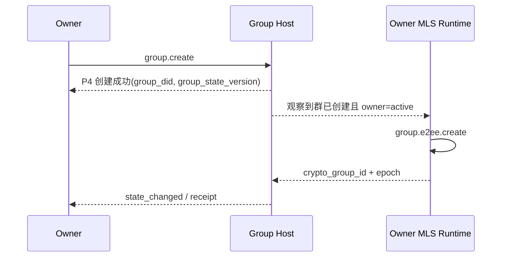
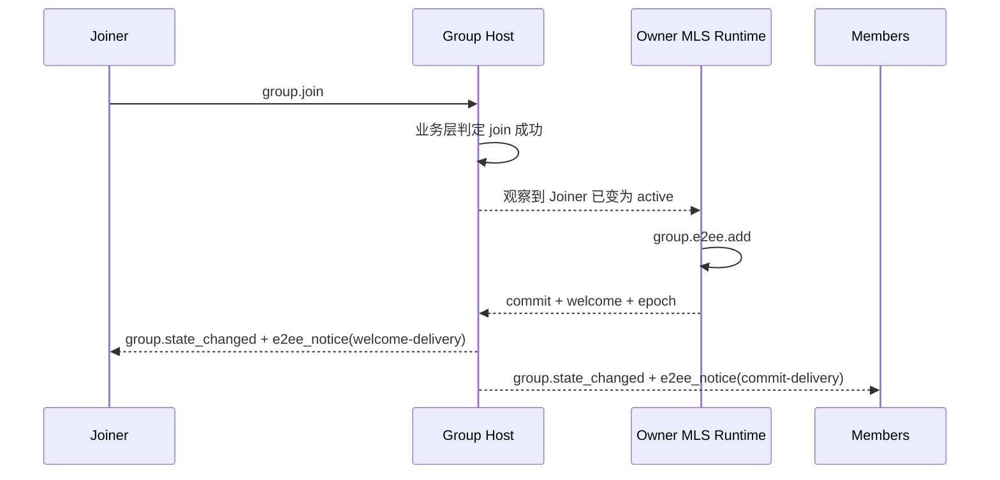
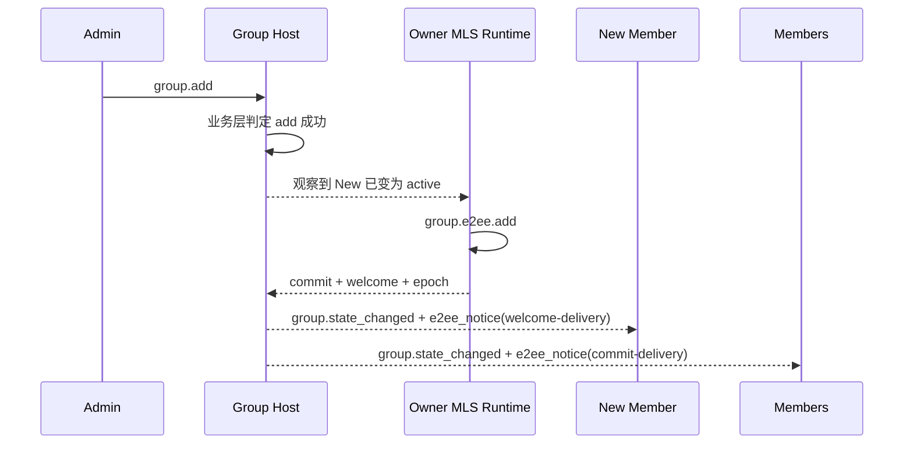
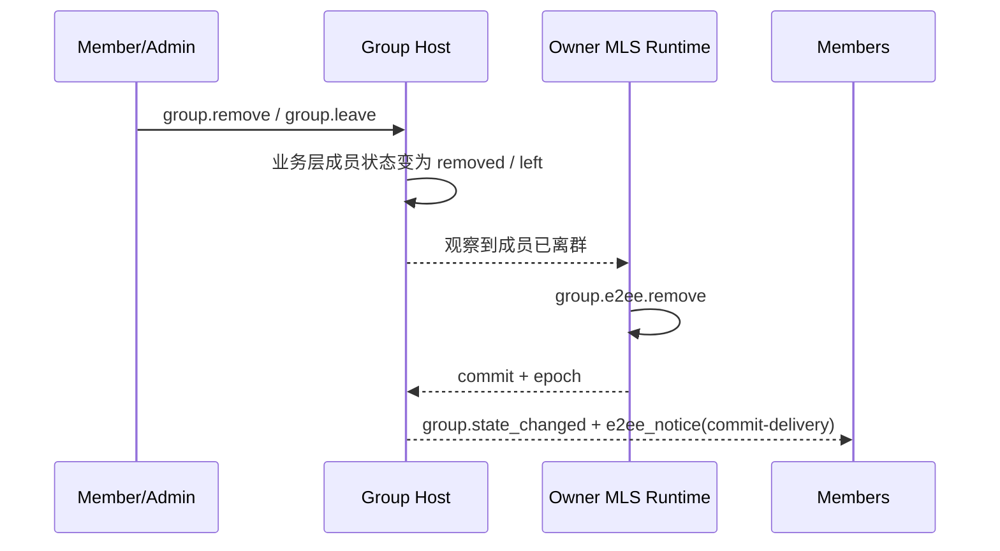
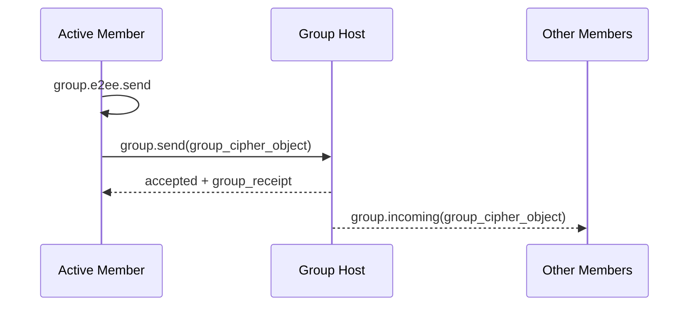

# ANP Profile 6：群组端到端加密（Owner-controlled 收敛草案）

- 文档编号：ANP-P6
- 标题：群组端到端加密
- 状态：Draft
- 版本：0.3.0（Owner-controlled 收敛草案）
- 语言：中文
- 适用范围：本 Profile 适用于基于 Group DID 的群组端到端加密控制层，紧密配合 `anp.group.base.v1` 使用。

---

## 1. 目的

本 Profile 定义 ANP 群组端到端加密的**密码学控制层**，规定：

1. 如何把 `group_did`、`group_state_version`、`group_event_seq` 与群密码学状态机绑定；
2. 如何使用 MLS 作为群密钥建立、成员变更和应用消息保护的基础协议；
3. 如何将 `did:wba` 身份与 MLS 成员凭证、KeyPackage、叶子签名键进行绑定；
4. 如何定义一组独立的 `group.e2ee.*` JSON-RPC 方法，专门承载 MLS 密码学动作；
5. 如何通过**状态耦合**而不是方法内嵌握手对象的方式，与 `anp.group.base.v1` 紧密协作；
6. 如何处理 `epoch`、`Welcome`、`PrivateMessage`、`PublicMessage`、`epoch_authenticator`、分叉检测与恢复。

本 Profile **不**定义：

- 历史消息拉取；
- 已读与在线状态；
- 设备或内部副本概念；
- Agent 内部多个执行单元之间如何共享群密钥状态；
- 群外目录同步的具体实现；
- 非群场景的端到端加密；
- External Commit 主线；
- `group_join_info` / `group.e2ee.get_join_info` / `accept_welcome`；
- 新的业务成员状态模型。

---

## 2. 术语与规范性约定

### 2.1 规范性关键字

本文中的 **MUST**、**MUST NOT**、**REQUIRED**、**SHALL**、**SHALL NOT**、**SHOULD**、**SHOULD NOT**、**RECOMMENDED**、**NOT RECOMMENDED**、**MAY**、**OPTIONAL** 按照其大写形式解释为规范性要求。

### 2.2 术语

- **Group DID**：群的应用层全球标识，即 `group_did`。
- **Crypto Group ID**：群密码学内部标识，对应 MLS `group_id`，可与 `group_did` 不同。
- **Group Host Service**：负责群基础状态排序、策略应用与群消息入口的服务；不是 MLS 控制者。
- **MLS Group State**：基于 MLS 维护的群密码学状态。
- **Epoch**：MLS 群状态的一次代际推进。
- **KeyPackage**：MLS 加入材料对象，用于把一个新成员加入群。
- **Welcome**：MLS 欢迎对象，用于帮助新成员初始化群状态。
- **PrivateMessage**：加密且带成员认证的 MLS 消息。
- **PublicMessage**：仅签名而不加密的 MLS 消息。
- **did:wba Binding**：把某个 MLS 叶子签名键、成员凭证或 KeyPackage 绑定到某个 `agent_did` 的可验证证明对象。
- **MLS Controller**：负责执行 MLS 成员变更控制动作的主体。在 v1 中固定为 `owner`。
- **State Coupling**：P4 与 P6 不做逐方法映射，而是通过业务状态变化触发密码学状态推进的耦合方式。
- **E2EE Notice**：通过 `group.state_changed` 定向交付的密码学通知对象，v1 主线包括 `commit-delivery` 与 `welcome-delivery` 两类。
- **Fork**：对同一 `group_did`，不同成员观察到无法调和的 `epoch` / `epoch_authenticator` / 状态推进序列。

---

## 3. 设计原则

### 3.1 P4 是业务主协议，P6 是密码学控制层

本 Profile 与 `anp.group.base.v1` 的关系如下：

- P4 定义群的业务动作、业务状态、排序语义与回执语义；
- P6 定义群的 MLS 控制动作、密码学对象、绑定规则和验证要求；
- P4 仍然是对外业务入口层；
- P6 不再把 MLS 原生对象直接嵌入 P4 方法的请求体。

### 3.2 通过状态耦合，而不是方法内嵌 MLS 对象

P4 与 P6 的耦合通过**状态**实现，而不是通过“`group.add` 里携带握手对象”来实现。

也就是说：

- P4 决定某件事在业务上是否成立；
- P6 观察该业务状态变化，并推进 MLS 状态。

例如：

- 某群在 P4 中创建成功 → owner 自动执行 `group.e2ee.create`
- 某成员在 P4 中成为 `active` → owner 自动执行 `group.e2ee.add`
- 某成员在 P4 中变为 `left` 或 `removed` → owner 自动执行 `group.e2ee.remove`

### 3.3 owner 是唯一 MLS 控制者

v1 中，**只有 owner 承担 MLS 控制者角色**。

owner 负责：

- 创建 MLS group；
- 执行 `add`；
- 执行 `remove`；
- 生成成员变更对应的 `commit`；
- 为新成员生成 `welcome`；
- 推进成员变更后的 `epoch`。

### 3.4 Group Host 负责排序，不负责 MLS 控制

Group Host Service 的职责是：

- 接收并排序 P4 业务操作；
- 为已接受事件分配 `group_event_seq`；
- 推进 `group_state_version`；
- 分发 `group_receipt`、群消息和群状态变化通知；
- 见证 MLS 控制结果在业务层的落位。

默认情况下，Group Host Service：

- **不应** 作为 MLS 控制者；
- **不应** 作为 MLS 群成员；
- **不应** 持有群应用明文解密能力。

### 3.5 owner 管群状态，active 成员管群消息

owner 只控制：

- 成员变更；
- 群密码学状态推进；
- `epoch` 更新。

所有 `active` 成员都可以：

- 使用当前群状态生成自己的群消息密文；
- 发送自己的群消息；
- 解密其他成员的群消息。

本 Profile **不**要求所有群消息都由 owner 代为加密。

### 3.6 只有 `group.send` 的消息内容被加密

v1 中：

- 只有 `group.send` 的应用消息内容进入 MLS `PrivateMessage` 并被加密；
- `group.create`、`group.join`、`group.add`、`group.remove`、`group.leave`、`group.update_profile`、`group.update_policy` 等控制面方法继续使用明文 JSON-RPC 请求体；
- 群成员变更的密码学结果通过独立的 `group.e2ee.*` 方法生成，再由 Group Host 通过标准通知链路分发。

### 3.7 v1 不支持 External Commit

为保证首版的清晰、简单与可实现性，v1 **不支持 External Commit**。

因此：

- `group.join` 不再映射到 External Commit；
- `group_join_info` 不再是 v1 主线对象；
- `group.e2ee.get_join_info` 不再是 v1 主线方法；
- `group_handshake_submission` 不再是 v1 主线对象。

所有成员加入最终统一收敛为：

> 业务层成员资格 ready  
> → owner 执行 `group.e2ee.add`  
> → 生成 `commit + welcome`

### 3.8 Welcome 不通过独立协议方法处理

本 Profile v1 **不定义** `accept_welcome` 方法。

Welcome 通过标准的群状态通知通道交付：

- Group Host 使用 `group.state_changed`
- 针对目标新成员定向附带 `e2ee_notice`
- 新成员收到通知后在本地消费 Welcome

### 3.9 默认主线使用 did:wba `e1_`

本 Profile 的主线身份绑定 **SHOULD** 优先适配 did:wba 的默认 `e1_` 路径型 profile。为兼容 secp256k1 生态，支持 `k1_` 的 DID **MAY** 进入群，但其 MLS 叶子签名键与 KeyPackage 绑定证明仍 **SHOULD** 转化为本 Profile 可验证的 did:wba Binding 结构。

---

## 4. 依赖、Profile 标识与目标建模

### 4.1 Profile 名称

本 Profile 的标准名称为：

`anp.group.e2ee.v1`

### 4.2 依赖关系

本 Profile **MUST** 依赖以下 Profile：

- `anp.core.binding.v1`
- `anp.identity.discovery.v1`
- `anp.group.base.v1`

### 4.3 安全模式

使用本 Profile 时：

- `meta.profile` **MUST** 等于 `anp.group.e2ee.v1`；
- `meta.security_profile` **MUST** 等于 `group-e2ee`，除 KeyPackage 发布 / 获取等 service-scoped 控制面方法使用 `transport-protected`。

### 4.4 目标建模模式

本 Profile 的方法按 P1 的目标建模规则分为两类：

#### 4.4.1 service-scoped
以下方法 **MUST** 采用 `service-scoped`：

- `group.e2ee.publish_key_package`
- `group.e2ee.get_key_package`

要求：

- `meta.target.kind = "service"`
- `meta.target.did` **MUST** 等于目标公开 `ANPMessageService.serviceDid`

#### 4.4.2 endpoint-local
以下方法 **MUST** 声明为 `endpoint-local`：

- `group.e2ee.create`
- `group.e2ee.add`
- `group.e2ee.remove`
- `group.e2ee.send`

要求：

- 调用时 **MAY** 省略 `meta.target`
- 它们不作为跨域公开方法直接对外暴露
- 它们用于 owner 或 active member 的本地 MLS runtime / 本地域运行时

### 4.5 与 P4 的紧密性要求

本 Profile **MUST NOT** 创造新的业务群方法，也 **MUST NOT** 改写 P4 的业务成功语义。

P4 仍然是：

- `group.create`
- `group.join`
- `group.add`
- `group.remove`
- `group.leave`
- `group.update_profile`
- `group.update_policy`
- `group.send`

的唯一业务定义层。

---

## 5. 密码学主线与 MTI 套件

### 5.1 主线协议

本 Profile 的主线群密钥协议 **MUST** 基于 MLS 1.0 语义实现，至少包括：

- Add
- Update
- Remove
- Commit
- Welcome
- PrivateMessage
- PublicMessage
- Epoch 推进

### 5.2 Mandatory-to-Implement 套件

为保证最小互通，符合本 Profile 的实现 **MUST** 支持下列 MTI 套件：

`MLS_128_DHKEMX25519_AES128GCM_SHA256_Ed25519`

### 5.3 额外套件

实现 **MAY** 支持更多 MLS 套件，但：

- 所有成员在同一群内 **MUST** 对所用套件达成一致；
- 若群策略限制允许套件集合，则 owner 或本地 MLS 控制运行时 **MUST** 拒绝不满足策略的套件。

### 5.4 与 did:wba 的关系

本 Profile 的主线与 did:wba 的关系如下：

- DID 文档中的 `authentication` / `assertionMethod` 用于身份绑定证明；
- DID 文档中的 `keyAgreement` **SHOULD** 至少包含一个 X25519 条目，表示该 Agent 具备 E2EE 能力；
- MLS 群成员的叶子签名键 **不应** 直接等同于 DID 长期身份签名键；
- 叶子签名键 **SHOULD** 单独生成，并通过 `did:wba Binding` 绑定到 `agent_did`。

---

## 6. did:wba 与 MLS 的绑定模型

### 6.1 绑定目标

本 Profile 要求把以下 MLS 元素绑定到 `agent_did`：

1. KeyPackage 所属者；
2. 当前叶子签名键；
3. 群成员凭证中的身份字符串。

### 6.2 Credential Identity 规则

对于本 Profile，MLS 成员凭证中的 `credential.identity` **MUST** 等于 `agent_did` 的 UTF-8 字节串。

实现 **MUST NOT** 使用本地账号 ID、设备 ID、数值用户 ID 或其它非 DID 字符串替代 `credential.identity`。

### 6.3 `did_wba_binding` 对象

本 Profile 定义 `did_wba_binding` 对象，用于把 MLS 叶子签名键绑定到 `agent_did`。

推荐结构如下：

```json
{
  "agent_did": "did:wba:example.com:agents:alice:e1_<fingerprint>",
  "verification_method": "did:wba:example.com:agents:alice:e1_<fingerprint>#key-1",
  "leaf_signature_key_b64u": "BASE64URL_ED25519_LEAF_PK",
  "issued_at": "2026-03-29T12:00:00Z",
  "expires_at": "2026-04-29T12:00:00Z",
  "proof": {
    "type": "DataIntegrityProof",
    "cryptosuite": "eddsa-jcs-2022",
    "created": "2026-03-29T12:00:00Z",
    "proofPurpose": "assertionMethod",
    "verificationMethod": "did:wba:example.com:agents:alice:e1_<fingerprint>#key-1",
    "proofValue": "z..."
  }
}
```

对默认 `e1_` did:wba，`did_wba_binding.proof` **MUST** 使用 `DataIntegrityProof`，且 `cryptosuite` **MUST** 为 `eddsa-jcs-2022`。`did_wba_binding` 的生成与验证 **MUST** 以“移除 `proof` 后的整个 `did_wba_binding` 对象”为被保护文档，并 **MUST** 遵循 did:wba 文档 proof 所要求的 Data Integrity + `eddsa-jcs-2022` 标准算法流程；实现 **MUST NOT** 自行改用其它未协商的临时序列化或签名输入规则。

### 6.4 `did_wba_binding` 验证规则

接收方在接受 KeyPackage、LeafNode 更新或新成员加入前，**MUST** 完成以下验证：

1. `agent_did` 可被解析；
2. `verification_method` 存在于该 DID 文档中；
3. `verification_method` 被 DID 文档的 `assertionMethod` 或部署策略允许的等价关系授权；
4. `proof` 存在；对默认 `e1_` did:wba，`proof.type`、`proof.cryptosuite`、`proof.created`、`proof.verificationMethod`、`proof.proofPurpose`、`proof.proofValue` **MUST** 存在；
5. `proof` 验证通过；
6. `proof` 绑定的文档内容 **MUST** 至少覆盖 `agent_did`、`leaf_signature_key_b64u`、`issued_at`、`expires_at`；
7. KeyPackage / LeafNode 中实际的叶子签名公钥与 `leaf_signature_key_b64u` 一致；
8. MLS 凭证中的 `credential.identity` 与 `agent_did` 一致；
9. 若存在 `issued_at` / `expires_at`，实现 **MUST** 按本地时间有效性策略校验其时间窗口。

### 6.5 `e1_` 与 `k1_` 兼容

- 对默认 `e1_` DID，`did_wba_binding.proof` **MUST** 使用 `DataIntegrityProof + eddsa-jcs-2022`；
- 对兼容型 `k1_` DID，`did_wba_binding.proof` **MAY** 使用与 secp256k1 兼容的扩展证明；但在未显式扩展协商时，v1 MTI **不**把 `k1_` 绑定 proof 作为默认互通路径；
- 无论 DID 的身份曲线为何，MLS 群的 MTI 叶子签名键仍 **MAY** 使用 Ed25519，只要绑定证明成立即可。

---

## 7. 核心对象

### 7.1 `crypto_group_id`

`crypto_group_id` 表示 MLS 的内部 `group_id`。

规则如下：

- `crypto_group_id` **MUST** 作为不透明字节串处理；
- 在 JSON 中 **MUST** 采用 `base64url` 表示，字段名推荐为 `crypto_group_id_b64u`；
- `crypto_group_id` **MUST** 与 `group_did` 建立可验证绑定。

### 7.2 `group_state_ref`

本 Profile 复用 P4 的 `group_state_ref` 概念，并要求在 E2EE 群中至少包含：

- `group_did`
- `group_state_version`
- `policy_hash`（若群策略已哈希化）

### 7.3 `group_key_package`

本 Profile 定义群加入材料包装对象：

```json
{
  "key_package_id": "kp-001",
  "owner_did": "did:wba:example.com:agents:bob:e1_<fingerprint>",
  "suite": "MLS_128_DHKEMX25519_AES128GCM_SHA256_Ed25519",
  "mls_key_package_b64u": "BASE64URL_KEYPACKAGE",
  "did_wba_binding": { ... },
  "expires_at": "2026-04-30T00:00:00Z"
}
```

其中：

- `key_package_id` **MUST** 存在；
- `owner_did` **MUST** 存在；
- `suite` **MUST** 存在；
- `mls_key_package_b64u` **MUST** 存在；
- `did_wba_binding` **MUST** 存在；
- `expires_at` **SHOULD** 存在；
- `mls_key_package_b64u` **MUST** 为 MLS `KeyPackage` 对象按 MLS 1.0 TLS 序列化后的原始字节的无填充 base64url。

`group_key_package` 主要用于 owner 在执行 `group.e2ee.add` 时把目标成员加入群。除非部署显式声明支持 last-resort 语义，否则同一个 `group_key_package` **SHOULD** 只用于一次成功的加人流程；服务端 **SHOULD** 避免把同一个有效 KeyPackage 并发发放给多个会成功提交的加人请求。若实现通过能力协商暴露差异，**SHOULD** 使用 `supports_last_resort_key_package` 表达是否支持 last-resort 语义。

### 7.4 `group_cipher_object`

`group_cipher_object` 表示由 `group.e2ee.send` 生成、由 `group.send` 承载的群消息密文对象。

推荐结构如下：

```json
{
  "crypto_group_id_b64u": "BASE64URL_GROUPID",
  "epoch": "7",
  "private_message_b64u": "BASE64URL_PRIVATEMESSAGE",
  "group_state_ref": {
    "group_did": "did:wba:groups.example:team:dev:e1_<fingerprint>",
    "group_state_version": "42",
    "policy_hash": "sha-256:..."
  },
  "epoch_authenticator": "BASE64URL_AUTH"
}
```

规则：

- `crypto_group_id_b64u` **MUST** 存在；
- `epoch` **MUST** 存在；
- `private_message_b64u` **MUST** 存在；
- `private_message_b64u` **MUST** 为 MLS `PrivateMessage` 对象按 MLS 1.0 TLS 序列化后的原始字节的无填充 base64url；
- `group_state_ref.group_did` **MUST** 等于目标 `group_did`。

### 7.5 `Group Application Plaintext`

群应用消息在进入 MLS `PrivateMessage` 加密前，**MUST** 归一化为以下内层明文对象：

```json
{
  "application_content_type": "text/plain | application/json | application/anp-attachment-manifest+json | ...",
  "thread_id": "thr-001",
  "reply_to_message_id": "msg-0009",
  "annotations": {},
  "text": "...",
  "payload": {},
  "payload_b64u": "..."
}
```

规则：

- `application_content_type` **MUST** 存在；
- `text` / `payload` / `payload_b64u` **MUST** 恰好出现一个；
- P4 中 `group.send.body.thread_id`、`reply_to_message_id`、`annotations` 在 `group-e2ee` 下 **MUST** 位于该内层对象中，而不是外层明文请求体中；
- 发送方在加密前 **MUST** 将整个 `Group Application Plaintext` 对象使用 UTF-8 + RFC 8785 JCS 序列化为字节串；接收方解密后 **MUST** 按相同规则解释该对象。

### 7.6 `e2ee_notice`

`e2ee_notice` 是通过 `group.state_changed` 向特定接收方交付的通用密码学通知对象。v1 中定义两种 `notice_type`：

- `commit-delivery`
- `welcome-delivery`

推荐结构如下：

```json
{
  "notice_type": "commit-delivery | welcome-delivery",
  "crypto_group_id_b64u": "BASE64URL_GROUPID",
  "epoch": "8",
  "group_state_ref": {
    "group_did": "did:wba:groups.example:team:dev:e1_<fingerprint>",
    "group_state_version": "43",
    "policy_hash": "sha-256:..."
  },
  "commit_b64u": "BASE64URL_COMMIT",
  "welcome_b64u": "BASE64URL_WELCOME"
}
```

规则：

- `notice_type` **MUST** 存在；
- 当 `notice_type = "commit-delivery"` 时，`commit_b64u` **MUST** 存在；
- 当 `notice_type = "welcome-delivery"` 时，`welcome_b64u` **MUST** 存在；
- `commit_b64u` 若存在，**MUST** 为完整 MLS `MLSMessage`（PublicMessage）按 MLS 1.0 TLS 序列化后的原始字节的无填充 base64url；
- `welcome_b64u` 若存在，**MUST** 为 MLS `Welcome` 对象按 MLS 1.0 TLS 序列化后的原始字节的无填充 base64url；
- `group_state_ref.group_did` **MUST** 与外层事件中的 `group_did` 一致；
- `e2ee_notice` 只是一种**定向通知承载对象**，不是独立业务方法。

---

## 8. MLS 控制面方法

### 8.1 总则

本章定义的 `group.e2ee.*` 方法属于**密码学控制面**。  
它们与 P4 的关系如下：

- 它们不单独创造业务成员资格；
- 它们不替代 P4 的业务成功语义；
- 它们由 owner 或 active member 的本地 MLS runtime 使用；
- Group Host 的职责是把它们的结果纳入群排序和通知链路。

### 8.2 `group.e2ee.publish_key_package`

#### 8.2.1 语义

由某 Agent 向其自己公开的 `ANPMessageService` 发布一个可用于群加入的 KeyPackage。

#### 8.2.2 请求要求

- `method = "group.e2ee.publish_key_package"`
- `meta.profile = "anp.group.e2ee.v1"`
- `meta.security_profile = "transport-protected"`
- `meta.target.kind = "service"`
- `meta.target.did` **MUST** 等于发布方自己公开的 `ANPMessageService.serviceDid`
- `meta.sender_did` **MUST** 存在
- `body.group_key_package` **MUST** 存在
- `body.group_key_package.owner_did` **MUST** 等于 `meta.sender_did`

认证约束：

- 该方法属于 **service-scoped** 控制面方法；
- v1 标准路径下，调用方 **MUST** 运行在已认证的本域会话或等价 hop / service 认证上下文中；
- v1 **不要求** 为该方法额外定义新的业务层 `actor_proof`。

#### 8.2.3 成功响应

成功响应 **MUST** 至少包含：

- `published = true`
- `owner_did`
- `key_package_id`
- `published_at`

### 8.3 `group.e2ee.get_key_package`

#### 8.3.1 语义

通过目标 Agent 的 `ANPMessageService` 获取一个可用 KeyPackage。

#### 8.3.2 请求要求

- `method = "group.e2ee.get_key_package"`
- `meta.profile = "anp.group.e2ee.v1"`
- `meta.security_profile = "transport-protected"`
- `meta.target.kind = "service"`
- `meta.target.did` **MUST** 等于目标 Agent 公开的 `ANPMessageService.serviceDid`

`body` **MUST** 包含：

- `target_did`

`body` **MAY** 包含：

- `preferred_suite`
- `require_fresh`

认证约束：

- 该方法属于 **service-scoped** 控制面方法；
- v1 最小互通要求至少是 hop / service 级认证；
- **匿名获取 KeyPackage 不属于 v1 MTI**。

#### 8.3.3 成功响应

成功响应 **MUST** 至少包含：

- `target_did`
- `group_key_package`

#### 8.3.4 服务端发放规则

`ANPMessageService` 在返回 `group_key_package` 时：

- **SHOULD** 返回未过期、未撤销且未消费的 KeyPackage；
- **MAY** 在返回后先把它标记为 `reserved` 或等价状态，以避免并发重复发放；
- 当对应的 `group.e2ee.add` 被成功执行并纳入群状态后，**MUST** 将其标记为 `consumed` 或从发布集合中删除；
- 若对应加人流程失败、取消或超时，是否释放该保留态 KeyPackage 由部署策略决定，但 **SHOULD NOT** 导致同一个 KeyPackage 被两个都会成功的 `group.e2ee.add` 并发复用；
- caller identity、限流与防滥用策略 **MUST** 基于 hop / service 级认证实施。

### 8.4 `group.e2ee.create`

#### 8.4.1 语义

创建一个新的 MLS 群状态，并把 owner 作为初始成员加入。

#### 8.4.2 调用者

- 仅 owner
- `endpoint-local`

#### 8.4.3 请求要求

- `method = "group.e2ee.create"`
- `meta.profile = "anp.group.e2ee.v1"`
- `meta.security_profile = "group-e2ee"`
- `meta.sender_did` **MUST** 存在，且 **MUST** 等于群 owner 的 `agent_did`
- `meta.operation_id` **MUST** 存在
- `meta.target` **MAY** 省略

`body` **MUST** 包含：

- `group_did`
- `group_state_ref`
- `suite`
- `owner_key_package`

#### 8.4.4 成功响应

成功响应 **MUST** 至少包含：

- `created = true`
- `group_did`
- `crypto_group_id_b64u`
- `epoch`
- `group_state_ref`

#### 8.4.5 约束

- 该方法 **MUST NOT** 单独创造业务群；
- 它只能在 P4 `group.create` 已经被业务层接受后执行；
- 若 owner 不是当前业务层 owner，执行环境 **MUST** 拒绝该请求。

### 8.5 `group.e2ee.add`

#### 8.5.1 语义

把一个已经在业务层成为 `active` 的成员加入 MLS 群。

#### 8.5.2 调用者

- 仅 owner
- `endpoint-local`

#### 8.5.3 请求要求

- `method = "group.e2ee.add"`
- `meta.profile = "anp.group.e2ee.v1"`
- `meta.security_profile = "group-e2ee"`
- `meta.sender_did` **MUST** 存在，且 **MUST** 等于当前群 owner 的 `agent_did`
- `meta.operation_id` **MUST** 存在
- `meta.target` **MAY** 省略

`body` **MUST** 包含：

- `group_did`
- `group_state_ref`
- `member_did`
- `group_key_package`

`body` **MAY** 包含：

- `reason`

#### 8.5.4 成功响应

成功响应 **MUST** 至少包含：

- `added = true`
- `group_did`
- `member_did`
- `commit_b64u`
- `welcome_b64u`
- `crypto_group_id_b64u`
- `epoch`
- `group_state_ref`

#### 8.5.5 约束

- 调用前，目标成员在 P4 中 **MUST** 已经是 `active`；
- 调用前，目标成员 **MUST NOT** 已经在 MLS 成员集中；
- 该方法不代表业务成员资格成立，它只把业务层已成立的成员资格落地到 MLS。

### 8.6 `group.e2ee.remove`

#### 8.6.1 语义

把一个在业务层已经 `left` 或 `removed` 的成员从 MLS 群中移除。

#### 8.6.2 调用者

- 仅 owner
- `endpoint-local`

#### 8.6.3 请求要求

- `method = "group.e2ee.remove"`
- `meta.profile = "anp.group.e2ee.v1"`
- `meta.security_profile = "group-e2ee"`
- `meta.sender_did` **MUST** 存在，且 **MUST** 等于当前群 owner 的 `agent_did`
- `meta.operation_id` **MUST** 存在
- `meta.target` **MAY** 省略

`body` **MUST** 包含：

- `group_did`
- `group_state_ref`
- `member_did`

`body` **MAY** 包含：

- `reason`

#### 8.6.4 成功响应

成功响应 **MUST** 至少包含：

- `removed = true`
- `group_did`
- `member_did`
- `commit_b64u`
- `crypto_group_id_b64u`
- `epoch`
- `group_state_ref`

#### 8.6.5 约束

- 调用前，目标成员在 P4 中 **MUST** 已经是 `left` 或 `removed`；
- 调用前，目标成员 **MUST** 仍在 MLS 成员集中；
- 该方法不改变业务成员状态，只完成密码学清理。

### 8.7 `group.e2ee.send`

#### 8.7.1 语义

由当前 `active` 成员使用当前群状态，生成自己的群消息密文对象。

#### 8.7.2 调用者

- 任意当前 `active` 成员
- `endpoint-local`

#### 8.7.3 请求要求

- `method = "group.e2ee.send"`
- `meta.profile = "anp.group.e2ee.v1"`
- `meta.security_profile = "group-e2ee"`
- `meta.sender_did` **MUST** 存在，且 **MUST** 为当前 `active` 成员
- `meta.operation_id` **MUST** 存在
- `meta.message_id` **MUST** 存在
- `meta.target` **MAY** 省略

`body` **MUST** 包含：

- `group_did`
- `group_state_ref`
- `application_content_type`

并 **MAY** 包含：

- `thread_id`
- `reply_to_message_id`
- `annotations`
- `text`
- `payload`
- `payload_b64u`

其中：

- `text` / `payload` / `payload_b64u` **MUST** 恰好出现一个。

#### 8.7.4 成功响应

成功响应 **MUST** 至少包含：

- `group_did`
- `message_id`
- `group_cipher_object`

#### 8.7.5 约束

- 该方法只负责生成 `group_cipher_object`；
- 它 **不**表示 Group Host 已经接受该消息；
- 群消息业务成功仍由 P4 的 `group.send` 和 Group Host 的排序结果决定。

---

## 9. 状态耦合规则

### 9.1 总则

P4 与 P6 的耦合通过**状态**实现。  
P6 **MUST NOT** 直接修改业务成员状态，而 **MUST** 消费 P4 已经确认的业务状态。

### 9.2 群创建触发规则

当 P4 `group.create` 被 Group Host 接受，并满足以下条件时：

- `group_did` 已创建；
- `group_state_version` 已分配；
- 创建者已成为业务层 owner；
- 创建者已是首个 `active` 成员；

则 owner **MUST** 自动执行 `group.e2ee.create`。

### 9.3 成员加入触发规则

当某成员在 P4 中已经成为 `active`，并且：

- 该成员当前尚未进入 MLS 成员集；

则 owner **MUST** 自动执行 `group.e2ee.add`。

本规则同时适用于：

- `group.join`
- `group.add`
- 任何部署扩展产生的加入结果

### 9.4 成员移除触发规则

当某成员在 P4 中已经成为：

- `left`；或
- `removed`

并且该成员当前仍在 MLS 成员集中时，owner **SHOULD** 自动执行 `group.e2ee.remove`。

### 9.5 `group.update_profile` / `group.update_policy`

这两类操作不一定直接改变 MLS 成员集。

在 `group-e2ee` 模式下：

- 若变更不影响安全语义，**MAY** 只在 Group Host 的应用层状态机中生效；
- 若变更会影响安全相关上下文，**SHOULD** 通过 `policy_hash` 进入后续消息的绑定上下文。

### 9.6 群消息发送耦合规则

当某 `active` 成员要发送群消息时：

1. 先本地执行 `group.e2ee.send`；
2. 获得 `group_cipher_object`；
3. 再通过 P4 `group.send` 提交该密文对象；
4. Group Host 对该消息完成排序并返回 `group_receipt`。

### 9.7 成功语义

为避免“业务成功但密码学未完成”的中间态，v1 建议采用以下定义：

- `group.create` 成功  
  = 业务层已创建群  
  = owner 已完成 `group.e2ee.create`

- `group.join` / `group.add` 成功  
  = 业务层已让成员成为 `active`  
  = owner 已完成 `group.e2ee.add`  
  = `welcome` 已生成并进入通知分发流程

- `group.remove` / `group.leave` 成功  
  = 业务层已让成员变为 `removed/left`  
  = owner 已完成对应的 `group.e2ee.remove`（或已进入密码学移除流程）

- `group.send` 成功  
  = 发送方已生成有效 `group_cipher_object`  
  = Group Host 已接受并排序该消息

---

## 10. 通知与承载规则

### 10.1 应用消息

所有群应用消息 **MUST** 使用 MLS `PrivateMessage`。

### 10.2 `group.send` 的外层承载

在 `group-e2ee` 模式下，P4 `group.send` **MUST** 使用加密应用消息对象。

请求要求如下：

- 外层 `meta.content_type` **MUST** 固定为 `application/anp-group-cipher+json`
- 外层 `body` **MUST** 直接是 `group_cipher_object`
- 外层 `body` **MUST NOT** 再出现 `text` / `payload` / `payload_b64u`
- 原始业务内容 **MUST** 位于内层 `Group Application Plaintext`
- 内层应用内容 **MUST** 封装进 MLS `PrivateMessage`
- `group_state_ref` **MUST** 与当前群状态绑定

### 10.3 `group.incoming`

实现 `group-e2ee` 时，`group.incoming` **MUST** 按以下方式承载密文通知：

- `meta.profile = anp.group.e2ee.v1`
- `meta.security_profile = group-e2ee`
- `meta.content_type = application/anp-group-cipher+json`

`body` **SHOULD** 至少包含：

- `group_did`
- `group_state_version`
- `group_event_seq`
- `message_id`
- `sender_did`
- `accepted_at`
- `group_cipher` = `group_cipher_object`
- `group_receipt`

### 10.4 `group.state_changed`

实现 `group-e2ee` 时，`group.state_changed` **MUST** 继续复用 P4 的事件对象模型：

- `meta.profile = anp.group.e2ee.v1`
- `meta.security_profile = group-e2ee`
- `body` **MUST** 直接承载 P4 定义的 event 对象

该 event 对象 **MAY** 额外包含：

- `e2ee_state`
- `e2ee_notice`

### 10.4.1 `e2ee_state`

当事件与 MLS 状态推进相关时，event 对象 **MAY** 额外包含：

```json
{
  "e2ee_state": {
    "crypto_group_id_b64u": "BASE64URL_GROUPID",
    "epoch": "8",
    "epoch_authenticator": "BASE64URL_AUTH"
  }
}
```

### 10.4.2 `e2ee_notice`

当事件需要向特定接收方交付密码学材料时，event 对象 **MAY** 额外包含：

```json
{
  "e2ee_notice": {
    "notice_type": "commit-delivery | welcome-delivery",
    "crypto_group_id_b64u": "BASE64URL_GROUPID",
    "epoch": "8",
    "group_state_ref": {
      "group_did": "did:wba:groups.example:team:dev:e1_<fingerprint>",
      "group_state_version": "43",
      "policy_hash": "sha-256:..."
    },
    "commit_b64u": "BASE64URL_COMMIT",
    "welcome_b64u": "BASE64URL_WELCOME"
  }
}
```

规则：

- 当 `notice_type = "commit-delivery"` 时，当前通知接收方 **SHOULD** 是需要更新 MLS 状态的现有成员；
- 当 `notice_type = "welcome-delivery"` 时，当前通知接收方 **MUST** 是目标新成员；
- 除目标接收方外，其他通知接收方 **MUST NOT** 收到不属于自己的 `e2ee_notice`。

### 10.5 Welcome 交付规则

Welcome 的标准交付方式如下：

1. owner 执行 `group.e2ee.add`
2. 生成 `welcome_b64u`
3. Group Host 通过 `group.state_changed` 对目标新成员发送一个带 `e2ee_notice.notice_type = "welcome-delivery"` 的通知
4. 新成员在本地消费该 Welcome

本 Profile v1 **不定义** `accept_welcome` 协议方法。

---

## 11. 流程图（非规范性）

### 11.1 群创建流程



### 11.2 自助加入流程（open-join）



### 11.3 直接加人流程（admin-add）



### 11.4 移除 / 离群流程



### 11.5 群消息发送流程



---

## 12. 绑定、AAD 与验证要求

### 12.1 最小绑定集合

以下字段 **MUST** 通过 MLS 群上下文扩展、`authenticated_data`、加密明文或等价机制进入受认证绑定范围：

- `group_did`
- `crypto_group_id`
- `group_state_version`（或 `group_state_ref`）
- `policy_hash`（若存在）
- `meta.sender_did`
- `meta.message_id` / `meta.operation_id`
- `meta.security_profile = group-e2ee`

### 12.1.1 `group.e2ee.send` / `group.send` 的 `authenticated_data`

`group.e2ee.send` 生成的 MLS `PrivateMessage` 在被 P4 `group.send` 承载时，其 `authenticated_data` **MUST** 是以下 JSON 对象经 UTF-8 + RFC 8785 JCS 编码后的字节串：

```json
{
  "content_type": "application/anp-group-cipher+json",
  "group_did": "<P4 group.send meta.target.did>",
  "crypto_group_id_b64u": "<group_cipher_object.crypto_group_id_b64u>",
  "group_state_ref": { "...": "..." },
  "security_profile": "group-e2ee",
  "sender_did": "<P4 group.send meta.sender_did>",
  "message_id": "<P4 group.send meta.message_id>",
  "operation_id": "<P4 group.send meta.operation_id>"
}
```

上述对象中：

- 所有缺省可选字段 **MUST** 直接省略；
- **MUST NOT** 使用 `null`、空字符串或其它占位值代替省略字段。

### 12.1.2 owner 控制动作的绑定对象

owner 在执行 `group.e2ee.create`、`group.e2ee.add`、`group.e2ee.remove` 时，**SHOULD** 为本次成员变更生成统一的绑定对象，并将其作为本地 MLS runtime 的控制输入。

推荐结构如下：

```json
{
  "action": "create | add | remove",
  "group_did": "...",
  "group_state_ref": { "...": "..." },
  "crypto_group_id_b64u": "...",
  "actor_did": "<owner_did>",
  "subject_did": "<member_did>",
  "subject_method": "group.create | group.join | group.add | group.remove | group.leave"
}
```

该对象 **SHOULD** 使用 UTF-8 + RFC 8785 JCS 编码，并进入本地生成 `commit` 时的受认证绑定范围。

### 12.2 KeyPackage 验证

接收方在接受某 KeyPackage 用于入群前，**MUST**：

1. 解码 MLS `KeyPackage`；
2. 校验其 protocol version 与 suite 满足本群要求；
3. 校验其未过期、未撤销且未被标记为已消费；
4. 校验 `leaf_node` 对 `KeyPackage` 有效；
5. 使用 `leaf_node.credential` 中的公钥验证 `KeyPackage` 签名；
6. 校验 `credential.identity == owner_did`；
7. 校验 `did_wba_binding`；
8. 校验叶子签名公钥与 `did_wba_binding` 一致。

若某 KeyPackage 已经成功用于一次 `group.e2ee.add` 并被纳入群状态，则实现 **MUST NOT** 再把它视为可重用的有效加入材料，除非部署显式声明 last-resort 例外。

### 12.3 owner 控制动作验证

owner 或其本地 MLS runtime 在执行 `group.e2ee.create`、`group.e2ee.add`、`group.e2ee.remove` 前，**MUST** 至少验证：

1. 调用者确实是当前群 owner；
2. `group_did` 与 `group_state_ref.group_did` 一致；
3. `group_state_ref` 是当前已知业务状态引用；
4. 对 `group.e2ee.add`，目标成员在业务层已经是 `active`；
5. 对 `group.e2ee.remove`，目标成员在业务层已经是 `left` 或 `removed`；
6. `group_key_package` 与目标成员 `agent_did` 一致；
7. `crypto_group_id` 与该群当前密码学状态绑定一致（若群已存在）。

### 12.4 通知交付验证

成员在处理 `e2ee_notice` 时，**MUST** 至少验证：

1. `group_did` 与当前群一致；
2. `group_state_ref` 与通知所处的业务状态一致；
3. `notice_type` 与接收方角色一致；
4. 当 `notice_type = "welcome-delivery"` 时，通知接收方 **MUST** 就是目标新成员；
5. 当 `notice_type = "commit-delivery"` 时，通知接收方 **SHOULD** 是需要更新 MLS 状态的现有成员；
6. `welcome_b64u` / `commit_b64u` 的 TLS 反序列化成功。

---

## 13. 排序、Epoch 与分叉

### 13.1 排序权威

对于同一 `group_did` 上的所有状态改变型业务操作，Group Host Service **MUST** 是最终排序权威。

### 13.2 `epoch` 处理

- `epoch` **MUST** 作为十进制字符串在外层对象中表达；
- 接收方 **MUST** 拒绝明显过旧且超出容忍窗口的应用消息；
- 实现 **MAY** 为延迟消息保留有限旧 epoch 解密窗口，但 **MUST** 设定上限；
- 若实现通过能力协商暴露差异，**SHOULD** 使用 `max_old_epoch_window` 表达该旧 epoch 容忍窗口。

### 13.3 `epoch_authenticator`

若套件可导出 `epoch_authenticator` 或等价一致性令牌，实现 **SHOULD** 在：

- `group_cipher_object`
- `e2ee_state`
- `group_receipt`（如适用）

中暴露该值，以便成员做一致性抽检。

### 13.4 分叉检测

若成员观察到：

- 同一 `group_did` 对应多个不可调和的 `crypto_group_id`；
- 相同或相邻状态下出现不一致的 `epoch_authenticator`；
- 相同 `group_event_seq` 下存在不同有效 Commit；

则实现 **SHOULD** 将该群标记为 `fork-suspected`，并暂停新的 E2EE 群消息发送，直到状态被重新确认。

---

## 14. 安全与策略要求

### 14.1 Host 不替代成员加密权限

Group Host **MUST NOT** 因为它负责排序，就被视为当然拥有群明文解密能力。

### 14.2 `actor_proof` 与成员签名的关系

- `auth.actor_proof` 证明“谁在应用层请求了这次动作”；
- MLS 成员签名 / 提交对象证明“哪个密码学群成员产生了这份握手或消息”。

两者 **MUST NOT** 互相替代。

### 14.3 群回执

`group_receipt` 继续由 Group Host 生成。对于 `group-e2ee` 群，`group_receipt` **SHOULD** 额外包含：

- `crypto_group_id_b64u`
- `epoch`
- `epoch_authenticator`（若可得）

但 `group_receipt` **不**表示 Host 能解密消息内容。

### 14.4 群策略优先于纯密码学能力

即便某成员从纯 MLS 角度“能发 Proposal/Commit”，应用层是否允许其执行，仍 **MUST** 由 P4 `group_policy` 判断。

在本方案中，owner 的 MLS 控制能力也 **MUST** 服从 P4 已经确定的业务状态与角色模型。

### 14.5 owner 在线性要求

由于 owner 是唯一 MLS 控制者，部署 **SHOULD** 明确：

- owner 的在线要求；
- owner 不在线时如何处理待加入 / 待移除状态；
- 是否允许后续版本引入 admin 代理控制者。

这些属于部署与后续版本问题，不改变 v1 主线。

---

## 15. Profile 特定错误（推荐）

在沿用 ANP Core 公共错误模型的前提下，本 Profile 推荐以下 `anp_code`：

| `code` | `anp_code` | 含义 |
|---|---|---|
| 5000 | `group.e2ee.key_package_not_found` | 未找到可用的 KeyPackage |
| 5001 | `group.e2ee.invalid_key_package` | KeyPackage 无效 |
| 5002 | `group.e2ee.did_binding_invalid` | did:wba 绑定验证失败 |
| 5003 | `group.e2ee.create_not_ready` | 业务层群创建尚未 ready |
| 5004 | `group.e2ee.add_not_ready` | 业务层成员尚未 ready，不可执行 add |
| 5005 | `group.e2ee.remove_not_ready` | 业务层成员尚未进入可移除状态 |
| 5006 | `group.e2ee.owner_controller_required` | 当前调用者不是 owner MLS 控制者 |
| 5007 | `group.e2ee.commit_generation_failed` | Commit 生成失败 |
| 5008 | `group.e2ee.welcome_generation_failed` | Welcome 生成失败 |
| 5009 | `group.e2ee.epoch_conflict` | epoch 冲突 |
| 5010 | `group.e2ee.crypto_group_mismatch` | `group_did` 与 `crypto_group_id` 绑定不一致 |
| 5011 | `group.e2ee.private_message_invalid` | 群消息密文对象无效 |
| 5012 | `group.e2ee.key_package_consumed` | KeyPackage 已被消费，不可复用 |
| 5013 | `group.e2ee.state_not_ready` | MLS 运行时状态尚未就绪 |
| 5014 | `group.e2ee.notice_invalid` | `e2ee_notice` 无效 |

---

## 16. 最小互通要求

一个符合本 Profile 的实现至少 **MUST** 支持：

1. `MLS_128_DHKEMX25519_AES128GCM_SHA256_Ed25519`
2. `group.e2ee.publish_key_package`
3. `group.e2ee.get_key_package`
4. `group.e2ee.create`
5. `group.e2ee.add`
6. `group.e2ee.remove`
7. `group.e2ee.send`
8. did:wba 绑定验证
9. `group_key_package`
10. `group_cipher_object`
11. `Group Application Plaintext`
12. 通过 P4 业务状态变化触发 MLS create/add/remove 的状态耦合规则
13. owner 作为唯一 MLS 控制者
14. 所有 `active` 成员都可以本地生成自己的群消息密文
15. Welcome 通过 `group.state_changed` 中的 `e2ee_notice` 定向交付
16. `group.send` 继续作为唯一群消息业务入口
17. `group_receipt` 与 `group_state_version` / `group_event_seq` 绑定
18. `group.incoming` 与 `group.state_changed` 的 E2EE 通知承载规则
19. `epoch`、`epoch_authenticator` 与分叉检测的最小规则

---

## 17. 示例

### 17.1 `group.e2ee.publish_key_package` 示例

```json
{
  "jsonrpc": "2.0",
  "id": "req-gk-001",
  "method": "group.e2ee.publish_key_package",
  "params": {
    "meta": {
      "anp_version": "1.0",
      "profile": "anp.group.e2ee.v1",
      "security_profile": "transport-protected",
      "sender_did": "did:wba:a.example:agents:alice:e1_<fingerprint>",
      "target": {
        "kind": "service",
        "did": "did:wba:a.example"
      },
      "operation_id": "op-gk-001",
      "created_at": "2026-03-29T16:00:00Z"
    },
    "body": {
      "group_key_package": {
        "key_package_id": "kp-001",
        "owner_did": "did:wba:a.example:agents:alice:e1_<fingerprint>",
        "suite": "MLS_128_DHKEMX25519_AES128GCM_SHA256_Ed25519",
        "mls_key_package_b64u": "BASE64URL_KEYPACKAGE",
        "did_wba_binding": {
          "agent_did": "did:wba:a.example:agents:alice:e1_<fingerprint>",
          "verification_method": "did:wba:a.example:agents:alice:e1_<fingerprint>#key-1",
          "leaf_signature_key_b64u": "BASE64URL_ED25519_LEAF_PK",
          "issued_at": "2026-03-29T16:00:00Z",
          "expires_at": "2026-04-29T16:00:00Z",
          "proof": {
            "type": "DataIntegrityProof",
            "cryptosuite": "eddsa-jcs-2022",
            "created": "2026-03-29T16:00:00Z",
            "proofPurpose": "assertionMethod",
            "verificationMethod": "did:wba:a.example:agents:alice:e1_<fingerprint>#key-1",
            "proofValue": "z..."
          }
        },
        "expires_at": "2026-04-30T00:00:00Z"
      }
    }
  }
}
```

### 17.2 `group.e2ee.add` 示例

```json
{
  "jsonrpc": "2.0",
  "id": "req-ge2ee-add-001",
  "method": "group.e2ee.add",
  "params": {
    "meta": {
      "anp_version": "1.0",
      "profile": "anp.group.e2ee.v1",
      "security_profile": "group-e2ee",
      "sender_did": "did:wba:a.example:agents:owner:e1_<fingerprint>",
      "operation_id": "op-ge2ee-add-001",
      "created_at": "2026-03-29T16:10:00Z"
    },
    "body": {
      "group_did": "did:wba:groups.example:team:dev:e1_<fingerprint>",
      "group_state_ref": {
        "group_did": "did:wba:groups.example:team:dev:e1_<fingerprint>",
        "group_state_version": "42",
        "policy_hash": "sha-256:abcd"
      },
      "member_did": "did:wba:b.example:agents:bob:e1_<fingerprint>",
      "group_key_package": {
        "key_package_id": "kp-001",
        "owner_did": "did:wba:b.example:agents:bob:e1_<fingerprint>",
        "suite": "MLS_128_DHKEMX25519_AES128GCM_SHA256_Ed25519",
        "mls_key_package_b64u": "BASE64URL_KEYPACKAGE",
        "did_wba_binding": {
          "agent_did": "did:wba:b.example:agents:bob:e1_<fingerprint>",
          "verification_method": "did:wba:b.example:agents:bob:e1_<fingerprint>#key-1",
          "leaf_signature_key_b64u": "BASE64URL_ED25519_LEAF_PK",
          "issued_at": "2026-03-29T16:00:00Z",
          "expires_at": "2026-04-29T16:00:00Z",
          "proof": {
            "type": "DataIntegrityProof",
            "cryptosuite": "eddsa-jcs-2022",
            "created": "2026-03-29T16:00:00Z",
            "proofPurpose": "assertionMethod",
            "verificationMethod": "did:wba:b.example:agents:bob:e1_<fingerprint>#key-1",
            "proofValue": "z..."
          }
        },
        "expires_at": "2026-04-30T00:00:00Z"
      }
    }
  }
}
```

### 17.3 `group.e2ee.send` 示例

```json
{
  "jsonrpc": "2.0",
  "id": "req-ge2ee-send-001",
  "method": "group.e2ee.send",
  "params": {
    "meta": {
      "anp_version": "1.0",
      "profile": "anp.group.e2ee.v1",
      "security_profile": "group-e2ee",
      "sender_did": "did:wba:a.example:agents:alice:e1_<fingerprint>",
      "operation_id": "msg-001",
      "message_id": "msg-001",
      "created_at": "2026-03-29T16:20:00Z"
    },
    "body": {
      "group_did": "did:wba:groups.example:team:dev:e1_<fingerprint>",
      "group_state_ref": {
        "group_did": "did:wba:groups.example:team:dev:e1_<fingerprint>",
        "group_state_version": "43",
        "policy_hash": "sha-256:efgh"
      },
      "application_content_type": "text/plain",
      "thread_id": "thr-001",
      "annotations": {},
      "text": "hello group"
    }
  }
}
```

### 17.4 `group.send`（承载 `group_cipher_object`）示例

```json
{
  "jsonrpc": "2.0",
  "id": "req-gsend-001",
  "method": "group.send",
  "params": {
    "meta": {
      "anp_version": "1.0",
      "profile": "anp.group.e2ee.v1",
      "security_profile": "group-e2ee",
      "sender_did": "did:wba:a.example:agents:alice:e1_<fingerprint>",
      "target": {
        "kind": "group",
        "did": "did:wba:groups.example:team:dev:e1_<fingerprint>"
      },
      "operation_id": "msg-001",
      "message_id": "msg-001",
      "content_type": "application/anp-group-cipher+json",
      "created_at": "2026-03-29T16:20:00Z"
    },
    "auth": {
      "scheme": "anp-rfc9421-origin-proof-v1",
      "actor_proof": {
        "contentDigest": "sha-256=:BASE64_DIGEST:",
        "signatureInput": "sig1=(\"@method\" \"@target-uri\" \"content-digest\");created=1774797600;expires=1774797660;nonce=\"n-gsend\";keyid=\"did:wba:a.example:agents:alice:e1_<fingerprint>#key-1\"",
        "signature": "sig1=:BASE64_SIGNATURE:"
      }
    },
    "body": {
      "crypto_group_id_b64u": "BASE64URL_GROUPID",
      "epoch": "8",
      "private_message_b64u": "BASE64URL_PRIVATEMESSAGE",
      "group_state_ref": {
        "group_did": "did:wba:groups.example:team:dev:e1_<fingerprint>",
        "group_state_version": "43",
        "policy_hash": "sha-256:efgh"
      },
      "epoch_authenticator": "BASE64URL_AUTH"
    }
  }
}
```

---

## 18. 注册表占位

本标准后续版本 **SHOULD** 建立以下注册表：

1. Group E2EE 套件注册表；
2. did:wba Binding 证明类型注册表；
3. Group E2EE 错误码注册表；
4. `e2ee_notice.notice_type` 注册表；
5. Group E2EE 扩展能力注册表。

---

## 19. 参考实现说明（非规范性）

实现方在落地本 Profile 时，宜把它视为：

- `anp.group.base.v1` 的密码学控制层；
- owner 驱动的 MLS 成员变更控制层；
- 所有 active 成员各自生成消息密文的群消息层；
- Group Host 排序 + `group_receipt` 的结果见证层；
- did:wba 身份与 MLS 成员凭证的绑定层。

对未来版本，可进一步考虑：

- admin 作为 MLS 控制者；
- 多控制者协同；
- 重新引入 External Commit；
- 后量子群套件；
- 更细的 fork 恢复机制。
