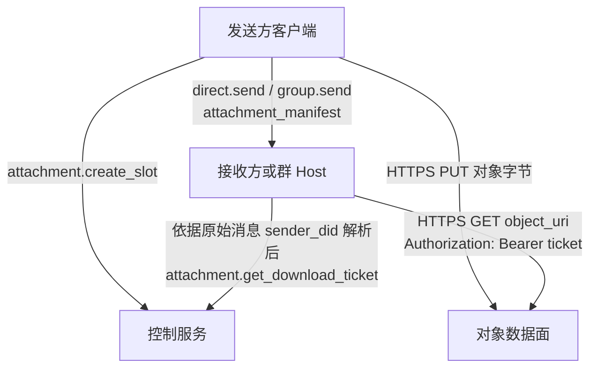
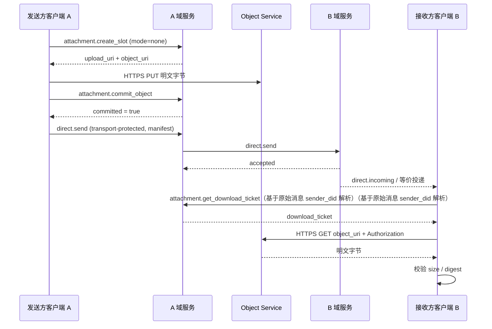
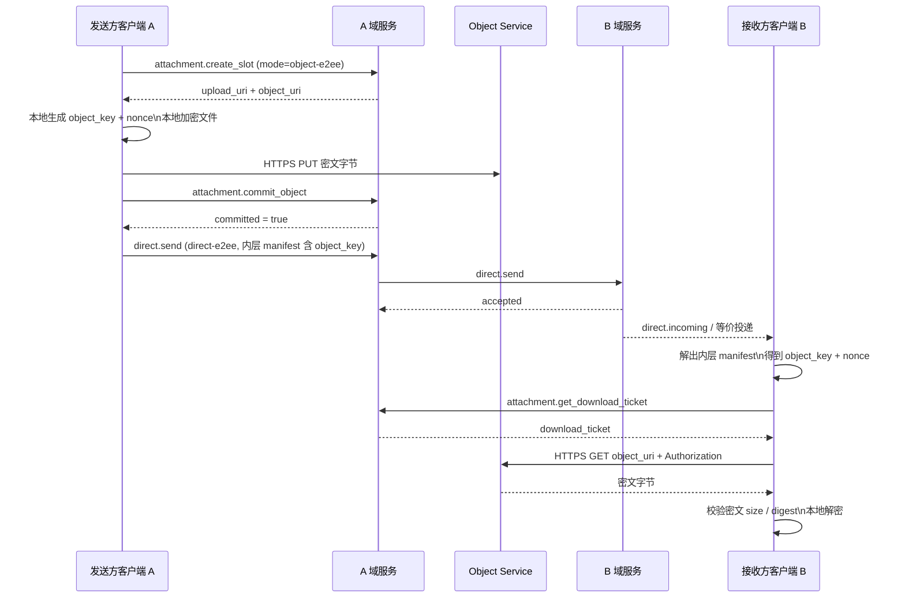
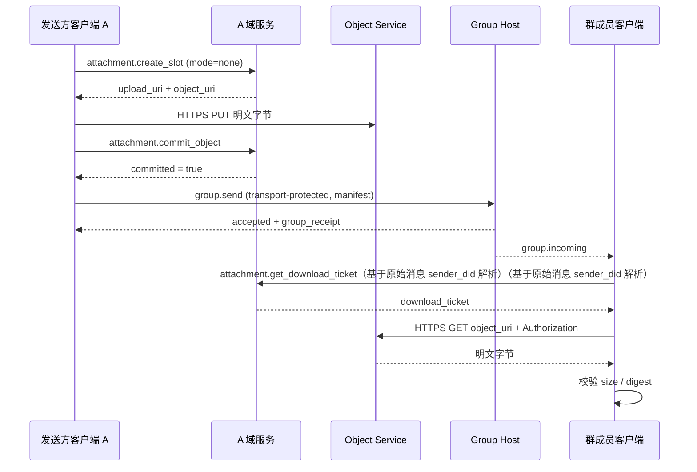
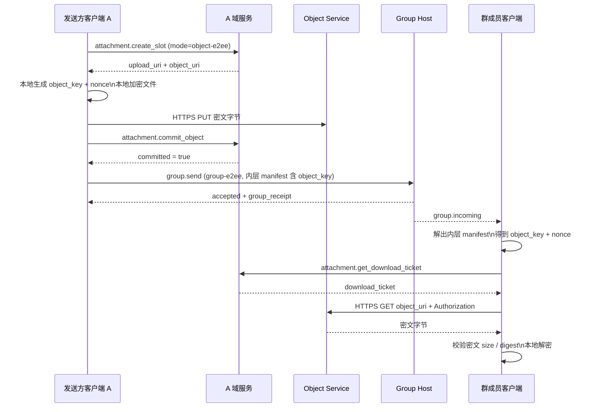

# ANP Profile 7：Attachments and Object Transfer

- 文档编号：ANP-P7
- 标题：附件与对象传输
- 状态：Draft
- 版本：0.5.0
- 语言：中文
- 适用范围：本 Profile 适用于 ANP 中附件、大对象与媒体对象的互通语义，支持私聊、群聊、非加密消息承载以及端到端加密消息承载。

---

## 1. 目的

本 Profile 定义 ANP 的附件与对象传输语义，规定：

1. 如何在私聊与群聊中表达附件；
2. 如何在非 E2EE 与 E2EE 消息中承载统一的 `attachment_manifest`；
3. 如何将附件传输拆分为消息面、控制面、数据面三层；
4. 如何通过独立 HTTPS 通道上传和下载对象内容；
5. 如何通过对象定位 URI、短时下载票据和对象级加密降低链接泄露风险；
6. 如何对对象内容做完整性校验、访问控制和对象级加密；
7. 如何保持 v1 方案清晰、简单、可落地。

本 Profile **不**定义：

- 对象存储的内部实现；
- 对象审核与风控策略；
- 对象下载票据的具体密码学签发格式；
- 对象字节流通过 ANP 跨域调用链路转发；
- `service-managed` 对象加密模式；
- `wrapped_object_key`、文件级密钥协商协议、直链下载、镜像 URI、内联下载票据等分叉路径；
- 专门的缩略图子对象与专门的分块清单对象。

---

## 2. 术语与规范性关键字

本文中的 **MUST**、**MUST NOT**、**REQUIRED**、**SHALL**、**SHALL NOT**、**SHOULD**、**SHOULD NOT**、**RECOMMENDED**、**NOT RECOMMENDED**、**MAY**、**OPTIONAL** 按其大写形式解释为规范性要求。

术语定义：

- **Attachment**：通过 ANP 消息引用的外部对象，其内容可以是文件、图片、音频、视频或任意字节流。
- **Object**：附件对应的实际字节内容。
- **Attachment Message**：以一个或多个 `attachment_manifest` 作为主要负载的 ANP 消息。
- **Attachment Manifest**：描述对象位置、摘要、大小、媒体属性与加密属性的结构化对象。
- **Object Service**：负责附件控制面与对象数据面的服务。
- **Control Plane**：`attachment.create_slot`、`attachment.commit_object`、`attachment.abort_object`、`attachment.get_download_ticket` 等协议方法所在的平面。
- **Data Plane**：对象字节通过独立 HTTPS PUT/GET 传输的平面。
- **Message Plane**：`direct.send`、`group.send` 承载 `attachment_manifest` 的平面。
- **Upload Slot**：发送方为上传对象而申请的临时上传能力与元数据占位。
- **Committed Object**：已经上传完成并可被消息引用的对象。
- **Object URI**：对象定位 URI。v1 中它是一个 locator 风格的 HTTPS 资源地址，不等价于公开直链。
- **Download Ticket**：对象下载时使用的临时访问票据。
- **Access Grant**：发送方服务在附件消息成功发出后为某个附件建立的下载授权记录。
- **Object-Level Encryption**：由发送方在本地对对象内容进行的加密，而不是仅依赖传输层机密性。
- **Object Key**：发送方为某个对象单独生成的随机对称密钥。
- **Nonce**：与对象加密一起使用的随机数；在 v1 MTI 中长度固定为 12 字节。

---

## 3. 设计总则与 v1 收口决策

### 3.1 三层分离

附件传输 **MUST** 被理解为三个平面：

1. **消息面**：只负责把 `attachment_manifest` 送给接收方；
2. **控制面**：只负责申请上传槽、提交对象、废弃对象、签发下载票据；
3. **数据面**：只负责 PUT/GET 对象字节。

这三层职责 **MUST NOT** 混淆。尤其是：

- 控制面方法不负责把附件发给接收方；
- 消息面不负责中继对象字节；
- 数据面不负责业务消息投递。

### 3.2 v1 主线路径

v1 的标准主线路径 **MUST** 为：

1. 发送方调用 `attachment.create_slot`；
2. 若启用对象级加密，发送方先在本地加密文件；
3. 发送方通过独立 HTTPS `PUT` 上传对象字节；
4. 发送方调用 `attachment.commit_object`；
5. 发送方通过 `direct.send` 或 `group.send` 发送附件清单；
6. 接收方依据承载该附件清单的原始消息发送者 DID 解析其公开 `ANPMessageService`，并通过 `attachment.get_download_ticket` 获取下载票据；
7. 接收方通过独立 HTTPS `GET object_uri`，并在 `Authorization` 头中携带票据下载对象；
8. 接收方校验摘要；若对象启用了 `object-e2ee`，再执行解密与解密后校验。

### 3.3 只保留两种对象模式

v1 中，`encryption_info.mode` **MUST** 只允许以下两个取值：

- `none`
- `object-e2ee`

`service-managed` **MUST NOT** 出现在协议字段里。

服务端磁盘加密、KMS、对象仓库静态加密等都属于实现细节，**MUST NOT** 被建模为协议互通模式。

### 3.4 消息安全与对象安全分离

附件的安全有两层：

1. **消息安全**：由承载该清单的 `transport-protected`、`direct-e2ee`、`group-e2ee` 决定；
2. **对象安全**：由 `encryption_info.mode` 决定。

v1 的规则是：

- 在 `transport-protected` 承载下，附件对象 **MUST** 使用 `mode = "none"`；
- 在 `direct-e2ee` 或 `group-e2ee` 承载下，附件对象 **MAY** 使用 `mode = "none"` 或 `mode = "object-e2ee"`。

### 3.5 对象密钥只随 E2EE 清单下发

当 `mode = "object-e2ee"` 时：

- `object_key_b64u` 与 `nonce_b64u` **MUST** 只出现在受 `direct-e2ee` 或 `group-e2ee` 保护的附件清单中；
- `object_key_b64u` 与 `nonce_b64u` **MUST NOT** 出现在 `attachment.create_slot` 或 `attachment.commit_object` 的控制面请求中；
- v1 **不定义** 单独的文件级密钥协商协议。

### 3.6 v1 明确删除的分叉路径

为保持 v1 清晰、简单、可落地，以下路径 **不**进入本 Profile：

- `service-managed`
- `wrapped_object_key_b64u`
- `key_wrap_alg`
- 内联下载票据
- 自定义票据传输头协商
- 永久公开直链
- 镜像 URI
- 专门的分块清单结构
- 专门的缩略图子对象
- 通过 ANP 业务方法中继对象字节

### 3.7 允许组合矩阵

| 承载方式 | `meta.security_profile` | 允许的 `encryption_info.mode` | 清单里能否出现 `object_key_b64u` |
|---|---|---|---|
| Direct Base | `transport-protected` | `none` | 否 |
| Group Base | `transport-protected` | `none` | 否 |
| Direct E2EE | `direct-e2ee` | `none` / `object-e2ee` | 是 |
| Group E2EE | `group-e2ee` | `none` / `object-e2ee` | 是 |

---

## 4. Profile 标识与依赖

### 4.1 Profile 名称

本 Profile 的标准名称为：

`anp.attachment.v1`

### 4.2 依赖关系

本 Profile **MUST** 依赖：

- `anp.core.binding.v1`
- `anp.identity.discovery.v1`

本 Profile **MAY** 与以下 Profile 组合使用：

- `anp.direct.base.v1`
- `anp.group.base.v1`
- `anp.direct.e2ee.v1`
- `anp.group.e2ee.v1`

### 4.3 安全模式

本 Profile 本身不定义新的安全模式，而复用承载它的业务 Profile：

- `transport-protected`
- `direct-e2ee`
- `group-e2ee`

---

## 5. 附件传输流程图

### 5.1 总体分层流程图



### 5.2 私聊 / 非加密附件



### 5.3 私聊 / E2EE 附件



### 5.4 群聊 / 非加密附件



### 5.5 群聊 / E2EE 附件



---

## 6. 承载规则：私聊、群聊、加密、非加密

### 6.1 在 Direct Base 中承载

当附件清单通过 `direct.send` 在 `anp.direct.base.v1` 中发送时：

- `meta.profile` **MUST** 等于 `anp.direct.base.v1`
- `meta.security_profile` **MUST** 等于 `transport-protected`
- `meta.content_type` **MUST** 等于 `application/anp-attachment-manifest+json`
- `body.payload` **MUST** 为 Attachment Message 对象
- `auth.origin_proof` **MUST** 按 P3 要求存在并绑定整个 Signed Direct Payload
- 其中每个 `attachment_manifest.encryption_info.mode` **MUST** 等于 `none`

### 6.2 在 Group Base 中承载

当附件清单通过 `group.send` 在 `anp.group.base.v1` 中发送时：

- `meta.profile` **MUST** 等于 `anp.group.base.v1`
- `meta.security_profile` **MUST** 等于 `transport-protected`
- `meta.content_type` **MUST** 等于 `application/anp-attachment-manifest+json`
- `body.payload` **MUST** 为 Attachment Message 对象
- `auth.origin_proof` **MUST** 按 P4 要求存在并绑定整个 Signed Group Payload
- 成功响应 **SHOULD** 返回 `group_receipt`
- 其中每个 `attachment_manifest.encryption_info.mode` **MUST** 等于 `none`

### 6.3 在 Direct E2EE 中承载

当附件清单通过 `anp.direct.e2ee.v1` 发送时：

- 建链后常规路径下，外层 `meta.content_type` **MUST** 为 `application/anp-direct-cipher+json`
- 若使用 P5 允许的首条 init 携带应用消息路径，外层 `meta.content_type` **MAY** 为 `application/anp-direct-init+json`
- 附件清单 **MUST** 作为加密前 `Application Plaintext` 的内层业务对象出现
- 内层 `application_content_type` **MUST** 等于 `application/anp-attachment-manifest+json`

### 6.4 在 Group E2EE 中承载

当附件清单通过 `anp.group.e2ee.v1` 发送时：

- 外层 `meta.content_type` **MUST** 固定为 `application/anp-group-cipher+json`
- 外层 `body` **MUST NOT** 直接出现明文附件清单
- 附件清单 **MUST** 作为加密前的 `Group Application Plaintext` 的内层业务对象出现
- 内层 `application_content_type` **MUST** 等于 `application/anp-attachment-manifest+json`

---

## 7. `attachment_message` 与 `attachment_manifest` 对象

### 7.1 Attachment Message 顶层结构

Attachment Message 推荐结构如下：

```json
{
  "attachments": [
    {
      "attachment_id": "att-001",
      "filename": "report.pdf",
      "mime_type": "application/pdf",
      "size": "1048576",
      "digest": {
        "alg": "sha-256",
        "value_b64u": "BASE64URL_DIGEST"
      },
      "access_info": {
        "object_uri": "https://objects.example.com/objects/obj-001"
      },
      "encryption_info": {
        "mode": "none"
      }
    }
  ],
  "caption": "附件说明",
  "primary_attachment_id": "att-001"
}
```

规则：

- `attachments` **MUST** 存在且非空
- `caption` **MAY** 存在
- `primary_attachment_id` **MAY** 存在；若存在，**MUST** 指向 `attachments` 中某个已存在的 `attachment_id`

### 7.2 `attachment_id` 作用域

- `attachment_id` **MUST** 在单个 Attachment Message 内唯一
- `attachment_id` **不保证** 跨消息全局唯一
- 任何下载票据绑定、授权记录或审计记录，**MUST** 使用 `(message_id, attachment_id)` 或 `(object_uri, message_id, attachment_id)`，而不是只使用 `attachment_id`

### 7.3 单个 `attachment_manifest`

每个 `attachment_manifest` **MUST** 包含：

- `attachment_id`
- `mime_type`
- `size`
- `digest`
- `access_info`
- `encryption_info`

每个 `attachment_manifest` **MAY** 包含：

- `filename`
- `media_info`

字段说明：

- `filename`：展示性文件名；**MAY**
- `mime_type`：原始文件的 MIME type；**MUST**
- `size`：上传对象字节大小，十进制字符串；**MUST**
- `digest`：上传对象字节摘要；**MUST**
- `access_info`：对象下载定位信息；**MUST**
- `encryption_info`：对象级加密信息；**MUST**
- `media_info`：图片、音视频等媒体对象的补充描述；**MAY**

### 7.4 `digest`

`digest` **MUST** 包含：

- `alg`
- `value_b64u`

规则：

- `digest.alg` 在 v1 **MUST** 固定为 `sha-256`
- `digest.value_b64u` **MUST** 是上传对象字节的 SHA-256 摘要
- 当 `encryption_info.mode = "none"` 时，摘要对应明文字节
- 当 `encryption_info.mode = "object-e2ee"` 时，摘要对应密文字节

### 7.5 `access_info`

`access_info` 结构如下：

```json
{
  "object_uri": "https://objects.example.com/objects/obj-001"
}
```

规则：

1. `object_uri` **MUST** 为 `https://` URL
2. `object_uri` 在 v1 中表示 locator 风格的对象地址；它不是永久公开直链
3. 接收方下载前 **MUST** 先调用 `attachment.get_download_ticket`
4. 接收方 **MUST** 依据承载该附件清单的原始消息发送者 DID，解析其公开 `ANPMessageService`
5. 在群场景中，上述原始消息发送者 DID **MUST** 取自承载附件清单的原始群消息发送者（例如 `group.incoming.meta.sender_did`）
6. `attachment.get_download_ticket` **MUST** 发往该发送者公开服务对应的 `serviceDid`
7. 接收方下载时 **MUST** 对 `object_uri` 发起 `GET`，并在 `Authorization` 头中携带票据
8. 调用方 **MUST NOT** 仅根据 `object_uri` 的 URL 域名猜测控制面服务

### 7.6 `media_info`

`media_info` 适用于图片、音频、视频等媒体对象。推荐字段：

- `width`
- `height`
- `duration_ms`
- `codec`

若出现数值字段，**MUST** 使用十进制字符串。

### 7.7 缩略图与分块

v1 不定义专门的 `thumbnail` 字段，也不定义专门的 `chunking_info` 字段。

若需要缩略图，发送方 **SHOULD** 把缩略图作为一个普通附件发送。

若需要大文件分块上传，**SHOULD** 在 HTTP 上传实现内部完成；这不改变本 Profile 的清单结构。

---

## 8. 对象级加密

### 8.1 `encryption_info`

`encryption_info` **MUST** 为以下两种结构之一。

未加密对象：

```json
{
  "mode": "none"
}
```

对象级加密对象：

```json
{
  "mode": "object-e2ee",
  "object_cipher": "chacha20-poly1305",
  "object_key_b64u": "BASE64URL_32_BYTES",
  "nonce_b64u": "BASE64URL_12_BYTES",
  "plaintext_size": "1048576"
}
```

规则：

1. `mode` **MUST** 取 `none` 或 `object-e2ee`
2. `mode = "none"` 表示发送方未对对象内容做本地加密
3. `mode = "object-e2ee"` 表示发送方先在本地加密对象，再上传密文字节
4. 在 `transport-protected` 承载下，`mode` **MUST** 为 `none`
5. `object_key_b64u` 与 `nonce_b64u` **MUST NOT** 出现在 `transport-protected` 承载的附件清单中
6. `service-managed`、密钥包装算法、文件级密钥协商都 **不**属于本 Profile

### 8.2 `object-e2ee` 的 MTI 算法

v1 的 `object-e2ee` MTI 算法 **MUST** 为：

- `object_cipher = "chacha20-poly1305"`
- `object_key_b64u`：32 字节随机对称密钥
- `nonce_b64u`：12 字节随机 nonce
- `plaintext_size`：原始文件字节长度，十进制字符串

### 8.3 发送方加密步骤（规范性）

当 `encryption_info.mode = "object-e2ee"` 时，发送方 **MUST** 按以下步骤执行：

1. 读取原始文件字节，记为 `P`
2. 生成新的随机 32 字节对象密钥 `K`
3. 生成新的随机 12 字节 nonce `N`
4. 令 `AAD = 空字节串`
5. 计算：

```text
C = ChaCha20-Poly1305-Encrypt(
      key = K,
      nonce = N,
      aad = "",
      plaintext = P
    )
```

6. 上传到 Object Service 的对象字节 **MUST** 是 `C`
7. `attachment_manifest.size` **MUST** 等于 `len(C)` 的十进制字符串
8. `attachment_manifest.digest` **MUST** 等于 `sha-256(C)`
9. `encryption_info.plaintext_size` **MUST** 等于 `len(P)` 的十进制字符串
10. `mime_type` **MUST** 继续表示原始文件的 MIME type，而不是密文对象 MIME type

补充要求：

- 每个 committed object **MUST** 使用新的随机 `K`
- 发送方 **MUST NOT** 复用相同的 `(K, N)` 组合
- 即使同一个文件内容重复发送，发送方 **SHOULD** 重新生成新的 `K` 与 `N`
- `object_key_b64u` **MUST NOT** 直接取自 P5 的 ratchet key，也 **MUST NOT** 直接取自 P6 的 MLS epoch secret 或其它会话密钥

### 8.4 `expected_size` 与 `plaintext_size`

在 v1 MTI 的 `chacha20-poly1305` 下：

- 上传对象大小 = 原始文件大小 + 16 字节认证标签
- 若发送方在 `attachment.create_slot` 中填入 `expected_size`，则该值 **SHOULD** 指向上传对象大小，而不是原始文件大小
- 若 `mode = "object-e2ee"`，发送方 **SHOULD** 同时在本地保存原始文件大小，以便稍后写入 `encryption_info.plaintext_size`

### 8.5 接收方校验与解密步骤（规范性）

当接收方拿到对象字节后：

1. **MUST** 先校验下载字节长度是否等于 `attachment_manifest.size`
2. **MUST** 计算 `sha-256(下载字节)`，并与 `attachment_manifest.digest` 比较
3. 若 `encryption_info.mode = "none"`，校验成功后即可交付上层
4. 若 `encryption_info.mode = "object-e2ee"`，接收方 **MUST** 使用：

```text
P = ChaCha20-Poly1305-Decrypt(
      key = object_key_b64u,
      nonce = nonce_b64u,
      aad = "",
      ciphertext = downloaded_bytes
    )
```

5. 若解密失败，接收方 **MUST** 拒绝该附件
6. 若解密成功，接收方 **MUST** 校验 `len(P)` 是否等于 `plaintext_size`
7. 校验通过后，接收方方可把明文字节交付上层业务

### 8.6 对象密钥分发规则

v1 的标准对象密钥分发路径只有一条：

- 当附件消息本身由 `direct-e2ee` 或 `group-e2ee` 保护时，发送方 **MAY** 直接把 `object_key_b64u` 与 `nonce_b64u` 放进内层 `attachment_manifest`
- 接收方从该 E2EE 消息中取得对象密钥后，再通过控制面拿票据、通过数据面下载密文对象

这意味着：

- v1 **不需要** 再为附件单独设计复杂的密钥协商协议
- 在群场景下，能解密该群消息的人，就都能拿到这把对象密钥
- v1 **不保证** 追溯性撤权；被移出群的成员若此前已拿到对象密钥和对象内容，本规范不承诺事后抹除其已获得的信息

---

## 9. 访问授权与下载票据

### 9.1 票据目标

下载票据的目标不是绝对防止合法接收方转发，而是：

1. 防止第三方仅凭清单直接下载对象
2. 防止 `object_uri` 变成长期公共链接
3. 把下载授权约束到明确的请求者与消息上下文
4. 为对象服务实施审计、限流和撤销提供抓手

### 9.2 Access Grant 语义

`attachment.create_slot` 与 `attachment.commit_object` **只**负责创建对象，不授予任何接收方下载权限。

对象何时对某个消息的接收方可下载，**MUST** 通过 Access Grant 决定。

当包含该附件的 `direct.send` 或 `group.send` 被发送方服务或 Group Host 成功接受后，发送方侧系统 **MUST** 为每个附件创建一条 Access Grant。

Access Grant 至少 **MUST** 绑定：

- `message_id`
- `attachment_id`
- `object_uri`
- `message_security_profile`
- 私聊上下文中的 `message_target_did`；或群聊上下文中的 `group_did`

### 9.3 `intended_target` 的边界

`attachment.create_slot.body.intended_target` 只是发送方上传阶段的策略 hint。

`intended_target`：

- **MAY** 用于 Object Service 提前做大小、类型或保留策略判定
- **MUST NOT** 单独作为下载授权依据

真正的下载授权依据 **MUST** 来自成功发送后的 Access Grant。

### 9.4 票据绑定

v1 中，下载票据 **MUST** 至少绑定以下上下文：

- `attachment_id`
- `object_uri`
- `requester_did`
- `message_id`
- `message_security_profile`
- 私聊上下文中的 `message_target_did`；或群聊上下文中的 `group_did`
- `expires_at`

### 9.5 票据有效期与使用方式

- 下载票据 **SHOULD** 为短时票据
- 默认有效期 **SHOULD NOT** 超过 5 分钟
- 对高敏感对象 **MAY** 使用一次性票据
- 下载票据 **MUST** 通过 HTTP `Authorization` 头传输
- 下载票据 **MUST NOT** 通过 URL 查询参数承载

v1 固定下载方式为：

```http
GET {object_uri}
Authorization: Bearer {download_ticket}
```

### 9.6 票据签发校验

Object 控制服务在处理 `attachment.get_download_ticket` 时，**MUST** 校验：

1. `meta.target.kind = "service"`
2. `meta.target.did` **MUST** 等于由原始附件消息发送者 DID 解析得到的公开 `ANPMessageService.serviceDid`
3. `requester_did = meta.sender_did`
4. `(message_id, attachment_id, object_uri)` 对应的 Access Grant 存在
5. `message_security_profile` 与 Access Grant 一致
6. 私聊上下文时，`message_target_did` 存在且符合策略
7. 群聊上下文时，`group_did` 存在且 `requester_did` 当前仍符合群访问策略

### 9.7 跨服务同步

v1 **不单独标准化** Access Grant 在多个内部服务之间的同步协议。

在 v1 默认路径中，下载票据由原始附件消息发送者公开的 `ANPMessageService` 负责签发；该公开服务入口在内部是否再路由到独立 Object Service，属于实现细节。若部署方在内部拆分了对象控制组件，**MUST** 保证对外公开服务能够以本地状态或内部同步方式拿到签发下载票据所需的 Access Grant。

### 9.8 成员变化后的访问边界

v1 **不保证追溯性撤权**。

这意味着：

- Object Service **SHOULD** 基于当前群状态拒绝为已移出成员签发新的下载票据
- 但若对象字节、对象密钥或已下载内容此前已经到达合法成员，本规范 **不承诺** 事后撤回其已获得的访问能力

---

## 10. 控制面方法

### 10.1 总则

本节方法用于对象控制面。它们 **不**改变 `direct.send`、`group.send` 的发送成功语义。

这些方法默认运行在：

- `meta.profile = "anp.attachment.v1"`
- `meta.security_profile = "transport-protected"`

并采用以下认证模型：

1. `attachment.create_slot`
2. `attachment.commit_object`
3. `attachment.abort_object`
4. `attachment.get_download_ticket`

都属于 **service-scoped** 控制面方法。

因此：

- `meta.target.kind` **MUST** 等于 `service`
- `meta.target.did` **MUST** 等于目标公开 `ANPMessageService.serviceDid`
- 跨域外层认证由 P8 的 `serviceDid + HTTP Message Signatures` 保证
- v1 **不要求** 在 Object 控制服务端再次直接验证独立终端的 `origin_proof`

### 10.2 `attachment.create_slot`

#### 10.2.1 语义

为待上传对象申请一个 Upload Slot。

#### 10.2.2 请求要求

该方法 **MUST** 使用：

- `meta.target.kind = "service"`
- `meta.target.did = 目标公开 ANPMessageService.serviceDid`

`body` **MUST** 包含：

- `attachment_id`
- `intended_message_security_profile`
- `object_encryption_mode`

`body` **SHOULD** 包含：

- `expected_size`
- `mime_type`

`body` **MAY** 包含：

- `filename`
- `expected_digest`
- `intended_target`

字段规则：

- `attachment_id`：字符串
- `intended_message_security_profile`：`transport-protected` / `direct-e2ee` / `group-e2ee`
- `object_encryption_mode`：`none` / `object-e2ee`
- `expected_size`：上传对象字节大小，十进制字符串
- `expected_digest`：上传对象字节摘要
- `intended_target`：对象；推荐结构如下：

```json
{
  "kind": "agent | group",
  "did": "did:example:..."
}
```

约束：

1. 当 `intended_message_security_profile = "transport-protected"` 时，`object_encryption_mode` **MUST** 为 `none`
2. 当 `object_encryption_mode = "object-e2ee"` 时，`expected_size` **SHOULD** 对应密文字节大小
3. `intended_target` 只是 hint，**MUST NOT** 单独构成授权

#### 10.2.3 成功响应

成功响应 **MUST** 至少包含：

- `attachment_id`
- `slot_id`
- `upload_uri`
- `object_uri`
- `commit_token`
- `expires_at`

成功响应 **MAY** 包含：

- `upload_headers`

发送方后续构造 `attachment_manifest.access_info` 时，`object_uri` **SHOULD** 直接取自 `attachment.create_slot` 或 `attachment.commit_object` 的成功响应；接收方在下载前则按本 Profile 规定，基于原始附件消息发送者 DID 发现票据服务。

### 10.3 `attachment.commit_object`

#### 10.3.1 语义

通知 Object Service：对象已上传完成，可以提交为可引用对象。

#### 10.3.2 请求要求

该方法 **MUST** 使用：

- `meta.target.kind = "service"`
- `meta.target.did = 目标公开 ANPMessageService.serviceDid`

`body` **MUST** 至少包含：

- `attachment_id`
- `slot_id`
- `commit_token`
- `size`
- `digest`
- `object_encryption_mode`

`body` **MAY** 包含：

- `plaintext_size`
- `media_info`

规则：

1. `digest.alg` **MUST** 等于 `sha-256`
2. 当 `object_encryption_mode = "object-e2ee"` 时，`plaintext_size` **MUST** 存在
3. `attachment.commit_object` **MUST NOT** 传输 `object_key_b64u`
4. `attachment.commit_object` **MUST NOT** 传输 `nonce_b64u`
5. `attachment.commit_object` 成功 **不等于** 接收方已经被授权下载该对象；真正下载授权取决于后续消息成功发送后的 Access Grant

#### 10.3.3 成功响应

成功响应 **MUST** 至少包含：

- `committed`
- `attachment_id`
- `object_uri`
- `committed_at`

其中：

- `committed` **MUST** 为 `true`

### 10.4 `attachment.abort_object`

#### 10.4.1 语义

终止一个未完成或不再需要的上传槽位。

#### 10.4.2 请求要求

该方法 **MUST** 使用：

- `meta.target.kind = "service"`
- `meta.target.did = 目标公开 ANPMessageService.serviceDid`

`body` **MUST** 至少包含：

- `attachment_id`
- `slot_id`

#### 10.4.3 成功响应

成功响应 **MUST** 至少包含：

- `aborted`
- `attachment_id`
- `aborted_at`

其中：

- `aborted` **MUST** 为 `true`

### 10.5 `attachment.get_download_ticket`

#### 10.5.1 语义

当对象访问需要票据时，接收方通过本方法获取临时下载票据。

#### 10.5.2 请求要求

该方法 **MUST** 使用：

- `meta.target.kind = "service"`
- `meta.target.did` **MUST** 等于由原始附件消息发送者 DID 解析得到的公开 `ANPMessageService.serviceDid`

`body` **MUST** 至少包含：

- `attachment_id`
- `object_uri`
- `requester_did`
- `message_security_profile`
- `message_id`

并按上下文补充其一：

- 私聊上下文：`message_target_did`
- 群聊上下文：`group_did`

`body` **MAY** 包含：

- `one_time`

字段规则：

- `requester_did` **MUST** 等于 `meta.sender_did`
- `message_security_profile` 指的是承载该附件清单的消息安全模式，而不是本次控制面调用的 `meta.security_profile`
- `message_target_did` 指的是原始私聊消息的目标 Agent DID
- `group_did` 指的是原始群消息所属的群 DID
- 发送票据请求前，调用方 **MUST** 先依据原始附件消息发送者 DID 解析其公开 `ANPMessageService`；在群场景中，该 DID 取自原始群消息发送者，而不是 `group_did`

#### 10.5.3 成功响应

成功响应 **MUST** 至少包含：

- `download_ticket_b64u`
- `expires_at`
- `ticket_binding`

`ticket_binding` **MUST** 至少包含：

- `attachment_id`
- `object_uri`
- `requester_did`
- `message_id`
- `message_security_profile`

并按上下文补充其一：

- `message_target_did`
- `group_did`

---

## 11. 数据面规则

### 11.1 上传

发送方 **MUST** 使用独立 HTTPS 通道向 `upload_uri` 发起 `PUT`。

规则：

- 当 `object_encryption_mode = "none"` 时，上传明文字节
- 当 `object_encryption_mode = "object-e2ee"` 时，上传密文字节
- 上传请求 **MAY** 携带 `upload_headers`
- 对象字节 **MUST NOT** 嵌入 ANP 的 JSON-RPC 业务消息中

### 11.2 下载

接收方 **MUST** 使用独立 HTTPS 通道向 `object_uri` 发起 `GET`。

固定格式如下：

```http
GET {object_uri}
Authorization: Bearer {download_ticket}
```

对象字节 **MUST NOT** 通过 ANP 的跨域服务调用链路作为常规转发通道。

### 11.3 下载后校验

接收方 **MUST** 在下载完成后至少执行：

1. 长度校验
2. 摘要校验
3. 若 `mode = "object-e2ee"`，则执行解密与 `plaintext_size` 校验

任何关键校验失败时，接收方：

- **MUST NOT** 把对象作为有效附件交付给上层业务
- **SHOULD** 记录诊断信息

---

## 12. 错误条件与建议错误码

本 Profile 为附件与对象传输错误固定分配 `6000-6013` 码段。服务端返回本节错误时，`error.data.anp_code` **MUST** 存在。

| `code` | `anp_code` | 含义 |
|---|---|---|
| 6000 | `anp.attachment.slot_not_found` | 未找到可用 Upload Slot，或 `slot_id` 与当前上下文不匹配 |
| 6001 | `anp.attachment.slot_expired` | Upload Slot 已过期，不能继续上传、提交或废弃 |
| 6002 | `anp.attachment.commit_token_invalid` | 提交令牌缺失、非法、校验失败，或与当前对象上下文不匹配 |
| 6003 | `anp.attachment.object_too_large` | 对象大小超出服务限制、策略限制，或超出允许范围 |
| 6004 | `anp.attachment.unsupported_mime_type` | `mime_type` 不被当前服务或策略接受 |
| 6005 | `anp.attachment.grant_not_found` | 未找到对应的 Access Grant，或消息尚未建立下载授权 |
| 6006 | `anp.attachment.unauthorized_requester` | 当前 `requester_did` 不满足下载策略、目标约束或群访问约束 |
| 6007 | `anp.attachment.download_ticket_invalid` | 下载票据缺失、非法、验签失败、无法解析，或已被作废 |
| 6008 | `anp.attachment.ticket_binding_mismatch` | 下载票据绑定的对象、消息或请求方上下文与实际请求不一致 |
| 6009 | `anp.attachment.ticket_expired` | 下载票据已过期 |
| 6010 | `anp.attachment.digest_mismatch` | 上传或下载后的对象摘要与期望摘要不一致 |
| 6011 | `anp.attachment.decrypt_failed` | `object-e2ee` 对象解密失败 |
| 6012 | `anp.attachment.object_unavailable` | 对象未完成提交、已被废弃、已被清理，或暂时不可用 |
| 6013 | `anp.attachment.encryption_policy_violation` | 对象加密模式与消息安全模式组合不合法，或违反本 Profile 约束 |

错误响应 **SHOULD** 在 `error.data` 中提供：

- `attachment_id`
- `slot_id`
- `object_uri`
- `message_id`
- `expected_digest`

## 13. 最小互通要求

一个符合本 Profile 的实现至少 **MUST** 支持：

1. `attachment.create_slot`
2. `attachment.commit_object`
3. `attachment.abort_object`
4. `attachment.get_download_ticket`
5. `application/anp-attachment-manifest+json`
6. `attachment_message.attachments`
7. `attachment_manifest` 的 `attachment_id`、`mime_type`、`size`、`digest`、`access_info`、`encryption_info`
8. `access_info.object_uri`
9. 基于原始附件消息发送者 DID 发现 `attachment.get_download_ticket` 目标服务
10. `digest.alg = sha-256`
11. 独立 HTTPS `PUT upload_uri`
12. 独立 HTTPS `GET object_uri`
13. `Authorization: Bearer {download_ticket}` 下载模式
14. 所有 `attachment.*` 控制面方法使用 `target.kind = "service"`
15. 对象字节不通过 ANP 业务消息或跨域服务调用链路转发
16. `transport-protected` 承载下的 `mode = "none"`

若实现宣称支持 E2EE 附件，还 **MUST**：

17. 支持 `mode = "object-e2ee"`
18. 支持本 Profile 规定的 `chacha20-poly1305` 对象加密流程
19. 在 E2EE 附件清单中直接分发 `object_key_b64u` 与 `nonce_b64u`
20. 在对象下载后执行密文字节摘要校验与本地解密
21. 明确遵守“v1 不保证追溯性撤权”的访问边界

---

## 14. 示例

### 14.1 `attachment.create_slot` 请求示例

```json
{
  "jsonrpc": "2.0",
  "id": "req-70001",
  "method": "attachment.create_slot",
  "params": {
    "meta": {
      "anp_version": "1.0",
      "profile": "anp.attachment.v1",
      "security_profile": "transport-protected",
      "sender_did": "did:example:agent-a",
      "target": {
        "kind": "service",
        "did": "did:example:domain-a"
      },
      "operation_id": "op-70001",
      "created_at": "2026-03-29T14:00:00Z"
    },
    "body": {
      "attachment_id": "att-001",
      "expected_size": "1048592",
      "mime_type": "application/pdf",
      "filename": "report.pdf",
      "intended_message_security_profile": "direct-e2ee",
      "intended_target": {
        "kind": "agent",
        "did": "did:example:agent-b"
      },
      "object_encryption_mode": "object-e2ee"
    }
  }
}
```

### 14.2 `attachment.create_slot` 成功响应示例

```json
{
  "jsonrpc": "2.0",
  "id": "req-70001",
  "result": {
    "attachment_id": "att-001",
    "slot_id": "slot-70001",
    "upload_uri": "https://objects.example.com/upload/slot-70001",
    "upload_headers": {
      "Content-Type": "application/octet-stream"
    },
    "object_uri": "https://objects.example.com/objects/obj-abc",
    "commit_token": "ct-abc-123",
    "expires_at": "2026-03-29T14:15:00Z"
  }
}
```

### 14.3 `attachment.commit_object` 请求示例

```json
{
  "jsonrpc": "2.0",
  "id": "req-70002",
  "method": "attachment.commit_object",
  "params": {
    "meta": {
      "anp_version": "1.0",
      "profile": "anp.attachment.v1",
      "security_profile": "transport-protected",
      "sender_did": "did:example:agent-a",
      "target": {
        "kind": "service",
        "did": "did:example:domain-a"
      },
      "operation_id": "op-70002",
      "created_at": "2026-03-29T14:03:00Z"
    },
    "body": {
      "attachment_id": "att-001",
      "slot_id": "slot-70001",
      "commit_token": "ct-abc-123",
      "size": "1048592",
      "digest": {
        "alg": "sha-256",
        "value_b64u": "BASE64URL_SHA256_OF_CIPHERTEXT"
      },
      "object_encryption_mode": "object-e2ee",
      "plaintext_size": "1048576"
    }
  }
}
```

### 14.4 `attachment.commit_object` 成功响应示例

```json
{
  "jsonrpc": "2.0",
  "id": "req-70002",
  "result": {
    "committed": true,
    "attachment_id": "att-001",
    "object_uri": "https://objects.example.com/objects/obj-abc",
    "committed_at": "2026-03-29T14:03:05Z"
  }
}
```

### 14.5 `attachment.abort_object` 请求示例

```json
{
  "jsonrpc": "2.0",
  "id": "req-70003",
  "method": "attachment.abort_object",
  "params": {
    "meta": {
      "anp_version": "1.0",
      "profile": "anp.attachment.v1",
      "security_profile": "transport-protected",
      "sender_did": "did:example:agent-a",
      "target": {
        "kind": "service",
        "did": "did:example:domain-a"
      },
      "operation_id": "op-70003",
      "created_at": "2026-03-29T14:04:00Z"
    },
    "body": {
      "attachment_id": "att-abort-001",
      "slot_id": "slot-abort-001"
    }
  }
}
```

### 14.6 `attachment.abort_object` 成功响应示例

```json
{
  "jsonrpc": "2.0",
  "id": "req-70003",
  "result": {
    "aborted": true,
    "attachment_id": "att-abort-001",
    "aborted_at": "2026-03-29T14:04:01Z"
  }
}
```

### 14.7 `attachment.get_download_ticket` 请求示例（私聊 / E2EE）

```json
{
  "jsonrpc": "2.0",
  "id": "req-70004",
  "method": "attachment.get_download_ticket",
  "params": {
    "meta": {
      "anp_version": "1.0",
      "profile": "anp.attachment.v1",
      "security_profile": "transport-protected",
      "sender_did": "did:example:agent-b",
      "target": {
        "kind": "service",
        "did": "did:example:domain-a"
      },
      "operation_id": "op-70004",
      "created_at": "2026-03-29T14:10:00Z"
    },
    "body": {
      "attachment_id": "att-001",
      "object_uri": "https://objects.example.com/objects/obj-abc",
      "requester_did": "did:example:agent-b",
      "message_security_profile": "direct-e2ee",
      "message_id": "msg-70008",
      "message_target_did": "did:example:agent-b",
      "one_time": true
    }
  }
}
```

### 14.8 `attachment.get_download_ticket` 成功响应示例

```json
{
  "jsonrpc": "2.0",
  "id": "req-70004",
  "result": {
    "download_ticket_b64u": "BASE64URL_TICKET",
    "expires_at": "2026-03-29T14:15:00Z",
    "ticket_binding": {
      "attachment_id": "att-001",
      "object_uri": "https://objects.example.com/objects/obj-abc",
      "requester_did": "did:example:agent-b",
      "message_id": "msg-70008",
      "message_security_profile": "direct-e2ee",
      "message_target_did": "did:example:agent-b"
    }
  }
}
```

### 14.9 HTTPS 上传示例（数据面）

```http
PUT /upload/slot-70001 HTTP/1.1
Host: objects.example.com
Content-Type: application/octet-stream
Content-Length: 1048592

<encrypted object bytes>
```

### 14.10 `direct.send` 承载非加密附件清单示例（Direct Base）

```json
{
  "jsonrpc": "2.0",
  "id": "req-70005",
  "method": "direct.send",
  "params": {
    "meta": {
      "profile": "anp.direct.base.v1",
      "security_profile": "transport-protected",
      "sender_did": "did:example:agent-a",
      "target": {
        "kind": "agent",
        "did": "did:example:agent-b"
      },
      "operation_id": "msg-70005",
      "message_id": "msg-70005",
      "created_at": "2026-03-29T14:20:00Z",
      "content_type": "application/anp-attachment-manifest+json"
    },
    "auth": {
      "scheme": "anp-rfc9421-origin-proof-v1",
      "origin_proof": {
        "contentDigest": "sha-256=:BASE64_SHA256_OF_SIGNED_DIRECT_PAYLOAD:",
        "signatureInput": "sig1=(\"@method\" \"@target-uri\" \"content-digest\");created=1774794000;expires=1774794060;nonce=\"n-70005\";keyid=\"did:example:agent-a#key-1\"",
        "signature": "sig1=:BASE64_SIGNATURE:"
      }
    },
    "body": {
      "payload": {
        "attachments": [
          {
            "attachment_id": "att-plain-001",
            "filename": "report.pdf",
            "mime_type": "application/pdf",
            "size": "1048576",
            "digest": {
              "alg": "sha-256",
              "value_b64u": "BASE64URL_SHA256_OF_PLAINTEXT"
            },
            "access_info": {
              "object_uri": "https://objects.example.com/objects/obj-plain-001"
            },
            "encryption_info": {
              "mode": "none"
            }
          }
        ],
        "caption": "请查收附件",
        "primary_attachment_id": "att-plain-001"
      }
    }
  }
}
```

### 14.11 `group.send` 承载非加密附件清单示例（Group Base）

```json
{
  "jsonrpc": "2.0",
  "id": "req-70006",
  "method": "group.send",
  "params": {
    "meta": {
      "profile": "anp.group.base.v1",
      "security_profile": "transport-protected",
      "sender_did": "did:example:agent-a",
      "target": {
        "kind": "group",
        "did": "did:example:group-123"
      },
      "operation_id": "msg-70006",
      "message_id": "msg-70006",
      "created_at": "2026-03-29T14:25:00Z",
      "content_type": "application/anp-attachment-manifest+json"
    },
    "auth": {
      "scheme": "anp-rfc9421-origin-proof-v1",
      "origin_proof": {
        "contentDigest": "sha-256=:BASE64_SHA256_OF_SIGNED_GROUP_PAYLOAD:",
        "signatureInput": "sig1=(\"@method\" \"@target-uri\" \"content-digest\");created=1774794300;expires=1774794360;nonce=\"n-70006\";keyid=\"did:example:agent-a#key-1\"",
        "signature": "sig1=:BASE64_SIGNATURE:"
      }
    },
    "body": {
      "payload": {
        "attachments": [
          {
            "attachment_id": "att-group-plain-001",
            "filename": "team-plan.pdf",
            "mime_type": "application/pdf",
            "size": "204800",
            "digest": {
              "alg": "sha-256",
              "value_b64u": "BASE64URL_SHA256_OF_PLAINTEXT"
            },
            "access_info": {
              "object_uri": "https://objects.example.com/objects/obj-group-plain-001"
            },
            "encryption_info": {
              "mode": "none"
            }
          }
        ],
        "caption": "群文件",
        "primary_attachment_id": "att-group-plain-001"
      }
    }
  }
}
```

### 14.12 `direct.send` 外层密文示例（Direct E2EE）

```json
{
  "jsonrpc": "2.0",
  "id": "req-70008",
  "method": "direct.send",
  "params": {
    "meta": {
      "anp_version": "1.0",
      "profile": "anp.direct.e2ee.v1",
      "security_profile": "direct-e2ee",
      "sender_did": "did:example:agent-a",
      "target": {
        "kind": "agent",
        "did": "did:example:agent-b"
      },
      "operation_id": "msg-70008",
      "message_id": "msg-70008",
      "created_at": "2026-03-29T14:30:00Z",
      "content_type": "application/anp-direct-cipher+json"
    },
    "body": {
      "session_id": "BASE64URL_16_BYTES",
      "ratchet_header": {
        "dh_pub_b64u": "BASE64URL_DH_PUB",
        "pn": "12",
        "n": "3"
      },
      "ciphertext_b64u": "BASE64URL_DIRECT_CIPHERTEXT"
    }
  }
}
```

### 14.13 Direct E2EE 内层 `Application Plaintext` 示例（附件对象已加密）

```json
{
  "application_content_type": "application/anp-attachment-manifest+json",
  "payload": {
    "attachments": [
      {
        "attachment_id": "att-001",
        "filename": "report.pdf",
        "mime_type": "application/pdf",
        "size": "1048592",
        "digest": {
          "alg": "sha-256",
          "value_b64u": "BASE64URL_SHA256_OF_CIPHERTEXT"
        },
        "access_info": {
          "object_uri": "https://objects.example.com/objects/obj-abc"
        },
        "encryption_info": {
          "mode": "object-e2ee",
          "object_cipher": "chacha20-poly1305",
          "object_key_b64u": "BASE64URL_32_BYTES_OBJECT_KEY",
          "nonce_b64u": "BASE64URL_12_BYTES_NONCE",
          "plaintext_size": "1048576"
        }
      }
    ],
    "caption": "请查收附件",
    "primary_attachment_id": "att-001"
  }
}
```

### 14.14 `group.send` 外层密文示例（Group E2EE）

```json
{
  "jsonrpc": "2.0",
  "id": "req-70009",
  "method": "group.send",
  "params": {
    "meta": {
      "anp_version": "1.0",
      "profile": "anp.group.e2ee.v1",
      "security_profile": "group-e2ee",
      "sender_did": "did:example:agent-a",
      "target": {
        "kind": "group",
        "did": "did:example:group-123"
      },
      "operation_id": "msg-70009",
      "message_id": "msg-70009",
      "created_at": "2026-03-29T14:35:00Z",
      "content_type": "application/anp-group-cipher+json"
    },
    "auth": {
      "scheme": "anp-rfc9421-origin-proof-v1",
      "origin_proof": {
        "contentDigest": "sha-256=:BASE64_SHA256_OF_SIGNED_GROUP_PAYLOAD:",
        "signatureInput": "sig1=(\"@method\" \"@target-uri\" \"content-digest\");created=1774794900;expires=1774794960;nonce=\"n-70009\";keyid=\"did:example:agent-a#key-1\"",
        "signature": "sig1=:BASE64_SIGNATURE:"
      }
    },
    "body": {
      "crypto_group_id_b64u": "BASE64URL_GROUPID",
      "epoch": "8",
      "private_message_b64u": "BASE64URL_PRIVATE_MESSAGE",
      "group_state_ref": {
        "group_did": "did:example:group-123",
        "group_state_version": "43",
        "policy_hash": "sha-256:BASE64URL_POLICY_HASH"
      },
      "epoch_authenticator": "BASE64URL_EPOCH_AUTH"
    }
  }
}
```

### 14.15 Group E2EE 内层 `Group Application Plaintext` 示例（附件对象已加密）

```json
{
  "application_content_type": "application/anp-attachment-manifest+json",
  "payload": {
    "attachments": [
      {
        "attachment_id": "att-group-e2ee-001",
        "filename": "design.png",
        "mime_type": "image/png",
        "size": "524304",
        "digest": {
          "alg": "sha-256",
          "value_b64u": "BASE64URL_SHA256_OF_CIPHERTEXT"
        },
        "access_info": {
          "object_uri": "https://objects.example.com/objects/obj-group-e2ee-001"
        },
        "encryption_info": {
          "mode": "object-e2ee",
          "object_cipher": "chacha20-poly1305",
          "object_key_b64u": "BASE64URL_32_BYTES_OBJECT_KEY",
          "nonce_b64u": "BASE64URL_12_BYTES_NONCE",
          "plaintext_size": "524288"
        },
        "media_info": {
          "width": "1920",
          "height": "1080"
        }
      }
    ],
    "caption": "设计稿",
    "primary_attachment_id": "att-group-e2ee-001"
  }
}
```

### 14.16 HTTPS 下载示例（数据面）

```http
GET /objects/obj-abc HTTP/1.1
Host: objects.example.com
Authorization: Bearer BASE64URL_TICKET
```

---

## 附录 A（信息性）：实现建议

1. 默认让 `operation_id = message_id`
2. 默认每个附件都走 `attachment.get_download_ticket`
3. 默认每个对象都使用新的随机对象密钥
4. 默认把缩略图作为独立附件，而不是发明新的子对象
5. 若确实需要更复杂的对象能力，应在未来新版本单独定义，而不是把 v1 主线路径重新分叉
