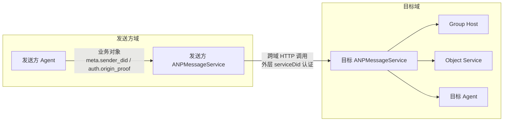
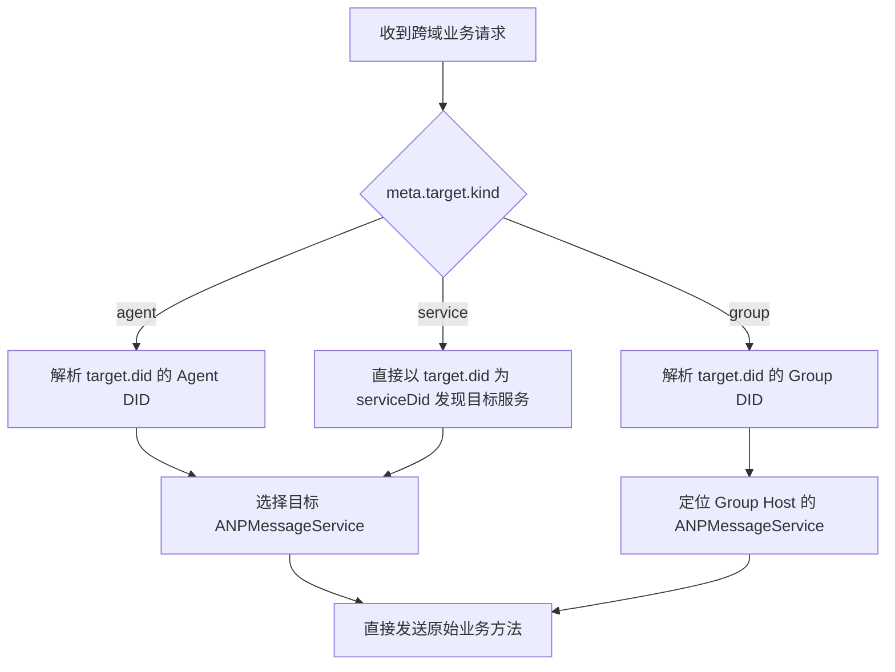
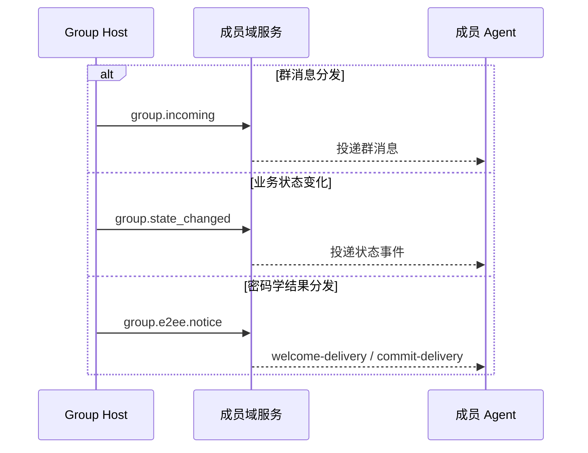
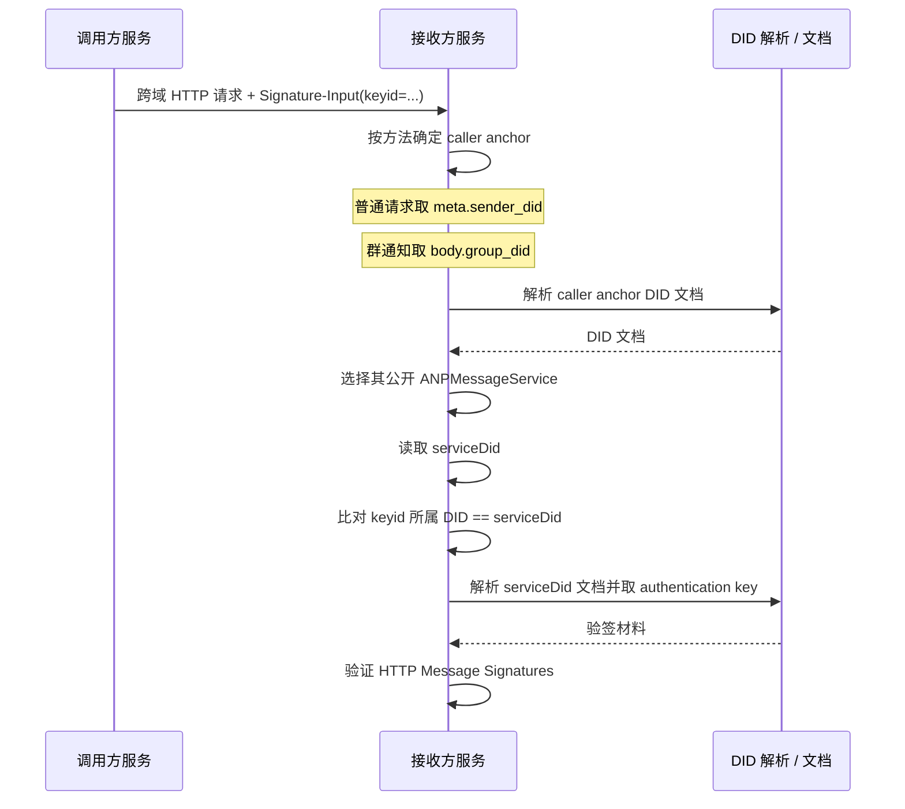
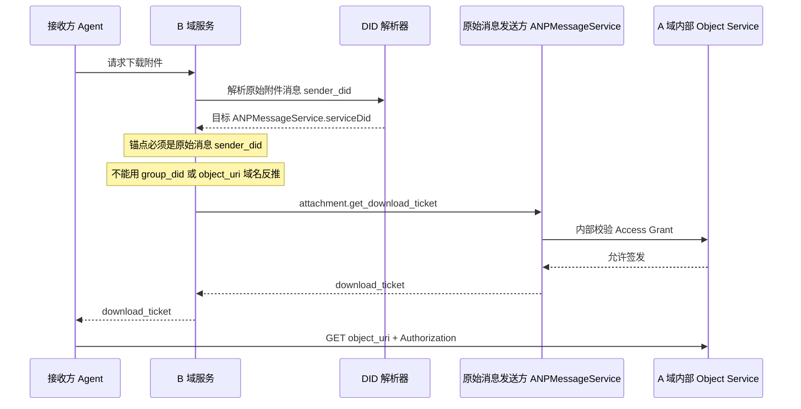

# ANP Profile 8：联邦与跨域（最终合并稿）

- 文档编号：ANP-P8
- 标题：联邦与跨域
- 状态：Draft
- 版本：0.4.0（最终合并稿）
- 语言：中文
- 适用范围：本 Profile 适用于 ANP 的跨域服务发现、服务到服务调用、群事件分发以及对象控制面的跨域调用。

---

## 1. 目的

本 Profile 只说明 **跨域场景下不同服务之间如何建立连接、如何调用、以及应遵循哪些原则**。

本 Profile 的重点是：

1. 一个域如何把面向远端 Agent 的请求发送到对方域公开的 ANP 服务入口；
2. 一个域如何把面向远端群的操作发送到群 Host 所在域；
3. Group Host 如何把已排序的群事件分发到成员所在域；
4. 对象控制面（而非对象字节流）如何跨域调用；
5. `attachment.get_download_ticket` 的跨域调用如何落地；
6. 跨域服务调用外层 HTTP 身份认证中应使用哪个 DID；
7. 跨域服务调用的安全、幂等、重试与成功语义。

本 Profile **不**重复定义以下内容，它们以其它 Profile 为准：

- `direct.send`、`group.send`、`group.add`、`group.remove` 等业务方法本身；
- E2EE 负载结构与密码学语义；
- 附件对象结构、票据格式与对象校验规则；
- DID 文档中的服务类型与发现基础规则；
- 域内路由实现、历史同步、已读回执、Presence；
- 对象字节流中继、CDN 或对象存储的内部实现。

---

## 2. 术语与规范性约定

### 2.1 规范性关键字

本文中的 **MUST**、**MUST NOT**、**REQUIRED**、**SHALL**、**SHALL NOT**、**SHOULD**、**SHOULD NOT**、**RECOMMENDED**、**NOT RECOMMENDED**、**MAY**、**OPTIONAL** 按照其大写形式解释为规范性要求。

### 2.2 术语

- **发送方域服务**：发送方所在域中接受本地请求并负责发起跨域服务调用的服务，通常是该域对外的 `ANPMessageService`。
- **目标域服务**：目标 DID 所公开、负责接收该跨域请求的服务端点。
- **联邦服务 DID**：某个域在跨域服务到服务 HTTP 身份认证中使用的 DID。它通常由发送方 `ANPMessageService` 条目的 `serviceDid` 字段声明，标识的是发起跨域调用的服务身份，而不是原始业务发送者。对于 `did:web` 与 `did:wba`，推荐使用裸域名 DID。
- **Group Host Service**：对某个 `group_did` 拥有排序权和群状态推进职责的服务。
- **Object Service**：负责附件对象上传、下载、票据签发和访问控制的服务。
- **Ordered Group Event**：已经由 Group Host 接受并分配了 `group_event_seq` 的群事件。
- **Final Acceptance**：一次跨域操作到达其最终协议责任端点并被接受。

---

## 3. 设计原则

### 3.1 直接使用原有方法跨域

跨域场景中，发送方域服务 **SHOULD** 直接使用原有业务方法或控制方法与目标域服务交互，而不是额外包一层独立的 Relay JSON-RPC 方法。也就是说：

- 私聊跨域直接使用 `direct.send`；
- 群 Base 跨域直接使用 `group.create`、`group.get_info`、`group.join`、`group.add`、`group.remove`、`group.leave`、`group.update_profile`、`group.update_policy`、`group.send`；
- 群 E2EE 跨域直接使用 `group.e2ee.publish_key_package`、`group.e2ee.get_key_package`、`group.e2ee.create`、`group.e2ee.add`、`group.e2ee.remove`、`group.e2ee.send`；
- 对象控制面跨域直接使用 `attachment.create_slot`、`attachment.commit_object`、`attachment.abort_object`、`attachment.get_download_ticket`。

### 3.2 先发现目标服务，再建立跨域调用

跨域调用前，发送方域服务 **MUST** 先根据 DID 文档或等价缓存结果确定目标服务位置，再发起服务到服务调用。具体的 DID 文档解释与服务发现规则由 P2 定义，本 Profile 不重复定义。

### 3.3 群排序以 Group Host 为准

同一 `group_did` 上会改变群状态或群事件序的操作，**MUST** 由对应的 Group Host Service 做最终线性排序。跨域调用只能把请求送到 Group Host；不能绕过 Group Host 自行决定 `group_event_seq` 或 `group_state_version`。

### 3.4 对象字节流不走跨域服务调用链路

对象内容本身 **MUST NOT** 通过 ANP 的跨域服务调用链路作为常规转发通道。也就是说：

- 服务到服务调用 **不得** 转发文件字节、图片字节、音视频字节；
- 对象本体 **MUST** 通过独立 HTTP(S) 通道直接从 Object Service 下载；
- 跨域服务调用层最多参与“如何拿到对象”的控制面，而不参与“把对象本身搬运过去”的数据面。

### 3.5 E2EE 负载对中间服务透明

当跨域调用承载 `direct-e2ee` 或 `group-e2ee` 业务消息时，中间服务或域网关 **MUST** 将其有效载荷视为不透明字节或不透明对象；除本 Profile 明确要求用于路由、幂等或目标校验的外层元数据外，**MUST NOT** 修改它。

### 3.6 外层服务身份与业务主体身份分离

跨域服务到服务调用的外层 HTTP 身份认证，**MUST** 使用发送方域服务自己的联邦服务 DID，而不是原始业务消息中的 `meta.sender_did`、`group_did` 或其他应用层主体 DID。

换言之：

- 外层 HTTP 认证回答的是“**哪个域服务正在调用我**”；
- `meta.sender_did` 与 `auth.origin_proof` 回答的是“**哪个业务主体发起了该动作**”；
- 两层身份可以相关，但语义上 **MUST NOT** 混淆。

---

P8 的任务不是重新定义业务协议，而是说明跨域时这些既有业务对象如何在服务之间流动。下图先给出一个总览，把业务主体、外层服务身份、Group Host 和 Object Service 放在同一个视图中。

*图 P8-1：联邦与跨域总览（非规范性）。*

阅读后续章节时，可以把这张图理解为 P8 的总前提：业务对象沿既有方法跨域传递，而外层 HTTP 认证只证明当前是哪一个公开服务入口在执行一跳调用。
## 4. Profile 标识与依赖

### 4.1 Profile 名称

本 Profile 的标准名称为：

`anp.federation.relay.v1`

> 说明：为保持与既有文档和实现的兼容性，本次修订保留原有 Profile 名称；但本 Profile 的内容重点已调整为“联邦与跨域服务调用原则”，而不是定义独立的 Relay 包装协议。

### 4.2 依赖关系

本 Profile **MUST** 依赖以下 Profile：

- `anp.core.binding.v1`
- `anp.identity.discovery.v1`
- `anp.direct.base.v1`
- `anp.group.base.v1`

本 Profile **MAY** 与以下 Overlay / 扩展一起使用：

- `anp.direct.e2ee.v1`
- `anp.group.e2ee.v1`
- `anp.attachment.v1`

### 4.3 安全模式

跨域服务到服务调用 **MUST** 运行在 `transport-protected` 模式上。

被直接发送的业务请求的 `meta.security_profile` **MAY** 为：

- `transport-protected`
- `direct-e2ee`
- `group-e2ee`

跨域调用方 **MUST NOT** 擅自改变原始业务请求中的 `meta.security_profile`。

---

## 5. 跨域连接方式

跨域实现最先要做的不是签名，而是决定请求到底该落到哪一类目标服务。下图把 `agent`、`group` 和 `service` 三种目标建模模式下的路由决策收敛为一个统一流程。

*图 P8-2：跨域路由决策（非规范性）。*

本图的重点是“直接发送原始业务方法”：P8 不鼓励再包一层额外的 Relay 方法，而是要求先发现最终公开服务，再把原始请求送到正确的业务责任端点。
### 5.1 Agent 到 Agent

当 `meta.target.kind = "agent"` 时，发送方域服务 **MUST**：

1. 解析目标 `agent_did`；
2. 根据 DID 文档或能力协商选择目标 `ANPMessageService`；
3. 直接把原始 `direct.send` 发送到该目标服务。

也就是说，跨域私聊时，发送方域服务扮演的是“出站服务调用者”，而不是额外定义一层新的中继协议。

### 5.2 面向 Group DID

当 `meta.target.kind = "group"` 时，发送方域服务 **MUST**：

1. 解析目标 `group_did`；
2. 根据 Group DID 文档或缓存的群状态引用确定 Group Host Service 对应的 `ANPMessageService`；
3. 直接将原始群操作请求发送给该 Group Host Service。

适用方法包括但不限于：

- `group.get_info`
- `group.join`
- `group.add`
- `group.remove`
- `group.leave`
- `group.update_profile`
- `group.update_policy`
- `group.send`
- `group.e2ee.add`
- `group.e2ee.remove`
- `group.e2ee.send`

对于当前 P4 v1 核心中的 `group.join` 与 `group.add`，跨域成功语义以 Group Host 返回的业务结果为准；在当前 v1 主线下，成功即表示相应业务成员状态已经成立。若部署方额外引入带外凭据、审批流或其它治理中间态，属于扩展路径，不属于本 Profile 的 v1 核心成功语义。

### 5.3 面向 Object Service

跨域对象控制面时，调用方 **MUST** 直接使用原始对象控制面方法与目标 Object Service 交互。适用方法包括：

- `attachment.create_slot`
- `attachment.commit_object`
- `attachment.abort_object`
- `attachment.get_download_ticket`

对于 `attachment.get_download_ticket`，调用方 **MUST** 先依据原始附件消息发送者 DID 发现其公开 `ANPMessageService`，再向该服务发起跨域调用；群场景中仍使用原始群消息发送者 DID，而不是 `group_did`。

### 5.3.1 E2EE 材料方法的跨域路由

当实现与 P5 / P6 组合使用时，以下 service-scoped getter / material 方法在跨域时 **MUST** 直接路由到最终公开 `ANPMessageService`，而不是通过私有中继包一层新协议：

- `direct.e2ee.get_prekey_bundle`
  1. 解析 `body.target_did`
  2. 找到目标 Agent 公开的 `ANPMessageService`
  3. 直接调用该服务

- `group.e2ee.get_key_package`
  1. 解析 `body.target_did`
  2. 找到目标 Agent 公开的 `ANPMessageService`
  3. 直接调用该服务

这些方法在 v1 最小互通中 **不**假定匿名访问；调用方身份、限流和防滥用控制 **MUST** 由 hop / service 级认证保证。

群 E2EE onboarding 所需的 `welcome` / `ratchet_tree` 等密码学结果由 `group.e2ee.notice` 交付；v1 不定义独立的 `group.e2ee.get_join_info` 标准跨域路由。

### 5.4 群事件分发

当 Group Host 需要主动向成员域分发已排序群事件时，**SHOULD** 直接使用既有群 Notification 方法，或采用语义等价的部署机制，而不是新增独立的 Relay 包装方法：

- 对群消息分发，**SHOULD** 使用 `group.incoming`；
- 对群状态变化分发，**SHOULD** 使用 `group.state_changed`；
- 对群 E2EE 的密码学结果分发，**SHOULD** 使用 `group.e2ee.notice`；
- 若部署方采用等价机制，该机制 **MUST** 保留原始群语义，并携带至少 `group_did`、`group_event_seq`、`group_state_version` 以及相应事件负载。

`group.e2ee.notice` 可以向尚未完成 MLS bootstrap 的目标 Agent 定向交付 `welcome-delivery`，也可以向现有成员交付 `commit-delivery`；这属于 P6 的密码学结果分发，而不是 P4 的群成员广播。带外邀请凭据或其它非成员治理消息若存在，属于部署扩展，不构成 v1 标准跨域路径。

---

P8 不要求 Group Host 为群事件重新设计一套新协议，而是鼓励直接复用既有通知方法。下图把消息分发、业务状态变化和密码学结果交付三条路径并列展示，帮助读者区分各自的语义边界。

*图 P8-3：群事件跨域分发（非规范性）。*

实现侧若采用等价机制，也应保留这三条路径在语义上的分离，而不应把业务事件、群消息和密码学 notice 混装到同一个通知对象中。
## 6. 服务到服务安全要求

### 6.1 安全信道

所有服务到服务调用 **MUST** 运行在经过双向认证或等价对端认证的安全信道之上。

### 6.2 来源可识别

每次服务到服务调用 **MUST** 可被接收方识别其来源服务身份。对于基于 DID 的部署，该来源服务身份 **MUST** 通过外层 HTTP Message Signatures 的 `Signature-Input` / `keyid` 参数表达，并且该 `keyid` 所属 DID **MUST** 与发送方 `ANPMessageService.serviceDid` 一致。

#### 6.2.1 联邦服务 DID 的选择规则

在跨域服务到服务 HTTP 请求中：

1. 发送方用于跨域调用的 `ANPMessageService` 条目 **MUST** 声明 `serviceDid`；
2. 若发送方域采用 `did:web`，则该 `serviceDid` **SHOULD** 使用裸域名 DID，例如 `did:web:alice.com`；
3. 若发送方域采用 `did:wba`，则该 `serviceDid` **SHOULD** 使用裸域名 DID，例如 `did:wba:alice.com`；
4. `Signature-Input` 中的 `keyid` **MUST** 为完整 DID URL，并指向该 `serviceDid` 文档中某个被 `authentication` 关系授权的验证方法；
5. 接收方 **MUST** 按对应 DID 方法规范完成 DID 解析、验证方法存在性检查、`authentication` 关系检查以及 HTTP Message Signatures 验证。

例如，对 `alice.com` 而言，以下 DID 可作为域级联邦服务 DID：

- `did:web:alice.com`
- `did:wba:alice.com`

其中，`did:wba:alice.com:agents:relay:e1_<fingerprint-a>` 是路径型 DID；它可以是某个普通 Agent 或子身份 DID，但**不应（SHOULD NOT）**作为本 Profile 默认规定的域级联邦服务 DID。

#### 6.2.2 基于 `serviceDid` 的校验流程

当 did A 的服务向 did B 的服务发送跨域请求时，B 侧服务 **MUST** 先按方法类型确定“用于推导 caller `serviceDid` 的业务锚点（caller anchor）”，再执行服务身份校验。

caller anchor 规则如下：

- 对普通跨域请求，包括：
  - `direct.send`
  - `group.create`
  - `group.get_info`
  - `group.join`
  - `group.add`
  - `group.remove`
  - `group.leave`
  - `group.update_profile`
  - `group.update_policy`
  - `group.send`
  - `direct.e2ee.*`
  - `group.e2ee.publish_key_package`
  - `group.e2ee.get_key_package`
  - `group.e2ee.create`
  - `group.e2ee.add`
  - `group.e2ee.remove`
  - `group.e2ee.send`
  - `attachment.*`

  caller anchor **MUST** 取 `meta.sender_did`

- 对 `group.incoming`、`group.state_changed` 与 `group.e2ee.notice`：

  caller anchor **MUST** 取 `body.group_did`

随后，接收方 **MUST** 按如下顺序校验发送方服务身份：

1. 根据上面的规则确定 caller anchor；
2. 解析 caller anchor 的 DID 文档；
3. 根据 P2 的服务选择规则，选择该 DID 对应的公开 `ANPMessageService`；
4. 读取该服务条目的 `serviceDid`；
5. 从外层 HTTP `Signature-Input` 中提取 `keyid`，并获得其中所属的 DID；
6. 验证 `keyid` 所属 DID 与步骤 4 的 `serviceDid` 完全一致；
7. 解析该 `serviceDid` 对应的 DID 文档；
8. 使用该 `serviceDid` 文档中 `authentication` 关系授权的公钥，对外层 HTTP 请求签名进行验证。

若步骤 3 选出的 `ANPMessageService` 未声明 `serviceDid`，或者步骤 6 比较不一致，则接收方 **MUST** 将该跨域服务身份认证视为失败。

接收方 **MUST NOT** 一律从 `meta.sender_did` 推导 caller `serviceDid`；对于群通知，这会把“原始业务发送者”错误当成“当前跨域调用者”。

按方法类型确定 caller anchor，是 P8 中最容易实现错的一步。下面的时序图把 caller anchor、`ANPMessageService.serviceDid` 与外层 HTTP `keyid` 的校验顺序显式画出来。

*图 P8-4：caller anchor 与 `serviceDid` 校验（非规范性）。*

接收方不应一律从 `meta.sender_did` 推导 caller `serviceDid`；对于 `group.incoming`、`group.state_changed` 和 `group.e2ee.notice` 这类群通知，业务锚点应切换为 `body.group_did`。
#### 6.2.3 裸域名 DID 的使用约定

若某域采用 `did:wba` 进行跨域服务身份认证，部署方 **SHOULD** 使用其裸域名 DID 作为域级联邦服务 DID，并且 **SHOULD NOT** 使用普通 Agent DID、Group DID 或其他路径型 DID 替代该域级身份。

实现方 **MAY** 在同一裸域名 DID 文档中维护多个可用于 `authentication` 的验证方法，以支持不同服务实例、不同密钥世代或平滑轮换；具体选择哪个验证方法参与某次服务到服务认证，由部署策略决定。

### 6.3 保持原始业务对象

服务到服务调用时，原始业务请求的 `method`、`params.meta` 和 `params.body` **SHOULD** 保持与本地域收到的业务请求等价。若实现为了序列化或网关转换必须重编码 JSON，对象语义 **MUST** 保持不变。

### 6.4 保留原发者证明

若原始业务请求携带 `auth.origin_proof`，则跨域发送方 **MUST** 保持该证明对象不变并随请求一起发送。目标域服务 **MUST** 按各业务 Profile 的要求独立验证该证明。

外层联邦服务 DID 的 HTTP 认证 **MUST NOT** 替代该原发者证明；发送方域服务也 **MUST NOT** 把 `auth.origin_proof` 改写为自己的联邦服务 DID。

对当前 P7 v1 主线下的 `attachment.*` 控制面方法，通常不存在终端业务 `auth.origin_proof`；外层 `serviceDid` hop 认证 **MUST NOT** 被误认为业务原发者证明。

### 6.5 外层最小可见性

对跨域发送的业务请求，中间服务可见且允许用于路由 / 幂等的字段，仅限：

- `meta.profile`
- `meta.security_profile`
- `meta.sender_did`
- `meta.target`
- `meta.operation_id`
- `meta.message_id`（若存在）
- `meta.content_type`

任何其它字段，尤其是 E2EE 保护的业务内容，中间服务 **MUST NOT** 擅自依赖、修改或重写。

### 6.6 禁止静默降级

跨域调用链路中的任何一方 **MUST NOT** 在未显式协商的情况下，把原始请求从更高安全模式静默降级到更低安全模式。

---

## 7. 幂等与重试

### 7.1 业务幂等优先

跨域服务调用 **MUST** 复用原始业务方法定义的幂等语义。也就是说：

- `direct.send` 继续使用其原有的 `sender_did + target.did + method + operation_id` 规则；
- `group.*` 继续使用群方法各自定义的幂等与去重规则；
- `attachment.*` 继续使用对象控制面方法各自定义的幂等与去重规则。

### 7.2 重试要求

当出现网络故障、超时或不确定结果时，发送方域服务 **MAY** 重试；但重试时：

- **MUST** 保持原始 `operation_id` 不变；
- 若存在消息语义，**MUST** 保持原始 `message_id` 不变；
- 若为对象控制调用，**SHOULD** 保持原始 `attachment_id` 与相关上下文不变；
- **MUST** 保持业务负载语义等价。

### 7.3 实现内部追踪字段

部署方 **MAY** 在实现内部维护 trace id、attempt number、route hint 等字段，但这些字段不属于本 Profile 定义的标准跨域请求对象，**MUST NOT** 替代原有业务 Profile 的幂等键。

### 7.4 幂等响应

若接收方识别到一个已经被成功处理过的原始业务请求，**SHOULD** 返回与首次成功处理等价的响应，而不是重复执行该业务请求。

---

## 8. 跨域成功语义

### 8.1 `direct.send`

对于跨域 `direct.send`：

- 当最终目标域服务接受该消息后，发送方域服务 **MAY** 向本地调用方返回成功；
- 后续目标 Agent 域内如何处理、排队、路由，不属于本 Profile 的成功语义范围。

### 8.2 P4 群控制操作

对于 `group.join`、`group.add`、`group.remove`、`group.update_profile`、`group.update_policy` 等 P4 控制操作：

- 当最终 Group Host Service 接受并排序后，发送方域服务 **MAY** 向本地调用方返回成功；
- 对当前 P4 v1 核心而言，`group.join` / `group.add` 的成功即表示对应业务成员状态已经成立；
- 成员域同步以及与 P6 的密码学落位是后续异步阶段。

### 8.3 P6 密码学控制操作

对于 `group.e2ee.create`、`group.e2ee.add`、`group.e2ee.remove`：

- 当最终 Group Host Service 接受该密码学控制动作并返回成功结果后，发送方域服务 **MAY** 向本地调用方返回成功；
- 该成功表示相关 MLS 控制结果已被目标 Host 接受，并与既有业务状态完成锚定；
- 它 **MUST NOT** 被解释为单独创建了新的 P4 业务成员状态。

### 8.4 `group.send`

对于跨域 `group.send`：

- 当 Group Host Service 接受并为其分配 `group_event_seq` 后，可视为跨域成功；
- 成员域何时收到该事件由后续事件分发机制决定。

### 8.5 `group.e2ee.send`

对于跨域 `group.e2ee.send`：

- 当 Group Host Service 接受并排序该 MLS 密文对象，并返回对应的 `group_event_seq`、`group_state_version`、`group_receipt` 后，可视为跨域成功；
- 该成功表示 Host 已接受并排序一条群 E2EE 密文；
- 各成员何时收到并能否成功解密，取决于后续分发与本地 MLS 状态，不属于跨域成功语义。

### 8.6 `attachment.get_download_ticket`

对于跨域 `attachment.get_download_ticket`：

- 当最终 Object Service 返回成功票据或明确拒绝后，可视为跨域成功；
- 返回票据 **不等于** 下载成功；
- 对象下载与摘要校验仍是后续独立 HTTPS 数据面步骤。

## 9. 附件与下载票据的跨域要点

### 9.1 最终处理端点

`attachment.get_download_ticket` 的协议级最终目标 **MUST** 是由原始附件消息发送者 DID 所公开的 `ANPMessageService`。该公开服务入口可以在内部再路由到真正处理对象控制逻辑的 Object Service，但这属于实现细节。

因此，标准互通语义中的“最终处理端点”是：

- 协议级：原始附件消息发送者 DID 对应的公开 `ANPMessageService`
- 实现级：该服务背后的内部 Object Service（可选）

在群场景中，调用方 **MUST** 使用原始群消息发送者 DID 作为发现锚点，而不是 `group_did`。调用方 **MUST NOT** 仅凭 `object_uri` 的 URL 域名去猜测控制面服务。

### 9.2 谁来发起票据请求

v1 标准互通路径 **MUST** 以“域服务代理模式”为主线：

#### 模式 A：域服务代理模式（v1 标准路径）

请求方 Agent 把 `attachment.get_download_ticket` 提交给本地 `ANPMessageService` 或等价的域服务，由该服务作为出站代理发起跨域请求。

该模式适用于：

- 需要统一域级审计；
- 需要统一服务对服务身份认证；
- Agent 自身不直接处理所有跨域服务调用细节。

在该模式下，本地域服务 **MUST** 依据原始附件消息发送者 DID 解析其公开 `ANPMessageService`，并把 `attachment.get_download_ticket` 发送到该服务。

#### 模式 B：Agent 直达模式（部署扩展）

请求方 Agent 直接解析原始附件消息发送者 DID，并调用其公开 `ANPMessageService`。

该模式 **不属于 v1 MTI**；若部署启用，必须自行解决：

- Agent 如何依据原始附件消息发送者 DID 获得并验证目标 `serviceDid`
- 客户端如何执行外层服务认证
- 客户端如何统一处理限流、重试和审计策略

附件下载票据的跨域落点非常容易被实现者误判为 `object_uri` 所在域，或者误判为 `group_did`。下图把标准路径画出来，强调控制面发现锚点必须是原始附件消息发送者 DID。

*图 P8-5：跨域 `attachment.get_download_ticket` 流程（非规范性）。*

本图同时说明了协议级与实现级的边界：对外标准互通的终点是公开 `ANPMessageService`，它在内部是否再路由到独立 Object Service，属于实现细节。
### 9.3 下载动作

拿到票据后，请求方 **MUST** 使用独立 HTTPS 通道向 Object Service 发起下载：

- 票据 **SHOULD** 放在 `Authorization` 头或指定自定义头中；
- 票据 **SHOULD NOT** 放在 URL 查询参数中；
- 下载成功后，请求方 **MUST** 按 P7 校验对象摘要；
- 若对象采用 `object-e2ee`，还 **MUST** 执行对象级解密与解密后校验。

Object 控制服务在签发票据时，标准路径下 **MUST** 基于以下两层上下文作授权判断：

1. 外层 caller `serviceDid` 已通过 HTTP Message Signatures 验证；
2. 请求体中的 `requester_did`、`security_profile`、`target_did` / `group_did`、`message_id` 等上下文满足对象服务策略。

Object 控制服务默认 **不要求** 再直接验证终端用户的独立业务 proof。

## 10. 最小互通要求

一个符合本 Profile 的实现至少 **MUST** 支持：

1. 对 `agent_did` 和 `group_did` 进行服务发现；
2. 跨域时直接使用原始业务方法与目标服务交互；
3. 保持原始 `security_profile`、`operation_id` 与相关原发者证明不变；
4. 把会改变群状态或群事件序的操作送到最终 Group Host Service；
5. 支持把 `group.join`、`group.add`、`group.remove`、`group.leave`、`group.update_profile`、`group.update_policy` 与 `group.send` 直接路由到最终 Group Host Service；
6. 当与 P6 组合使用时，支持 `group.e2ee.create`、`group.e2ee.add`、`group.e2ee.remove`、`group.e2ee.send` 的正确跨域落点；
7. 当与 P5 / P6 组合使用时，支持 `direct.e2ee.get_prekey_bundle` 与 `group.e2ee.get_key_package` 的跨域路由；
8. 把 `attachment.get_download_ticket` 送到原始附件消息发送者 DID 所公开的 `ANPMessageService`；
9. 明确禁止对象字节通过跨域服务调用链路常规转发；
10. 至少支持一种已排序群事件向成员域分发的机制；与 P6 组合使用时，**MUST** 支持 `group.e2ee.notice` 的跨域分发；
11. 为参与跨域调用的 `ANPMessageService` 声明 `serviceDid`，并按方法级 caller anchor 校验外层 HTTP Message Signatures；
12. 对 `did:wba` 部署，支持使用裸域名 DID 作为域级联邦服务 DID。

## 11. 参考实现说明（非规范性）

实现方在落地本 Profile 时，宜把它视为：

- 01～07 各业务 Profile 在跨域场景下的连接原则补充；
- 服务到服务直接调用的约束层；
- 服务到服务外层 DID 身份认证的选型规则；
- Group Host 排序与群事件异步分发的原则说明；
- 对象控制面跨域落点与下载职责边界的说明。

换句话说，本 Profile 解决的是“**跨域时怎么连、怎么发、怎么判定成功**”，而不是重新定义一套独立的业务协议。 
