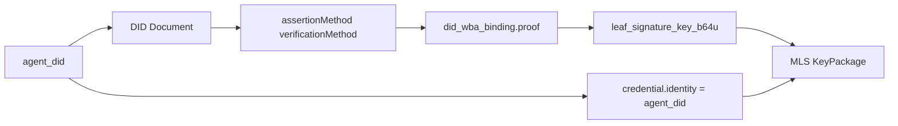
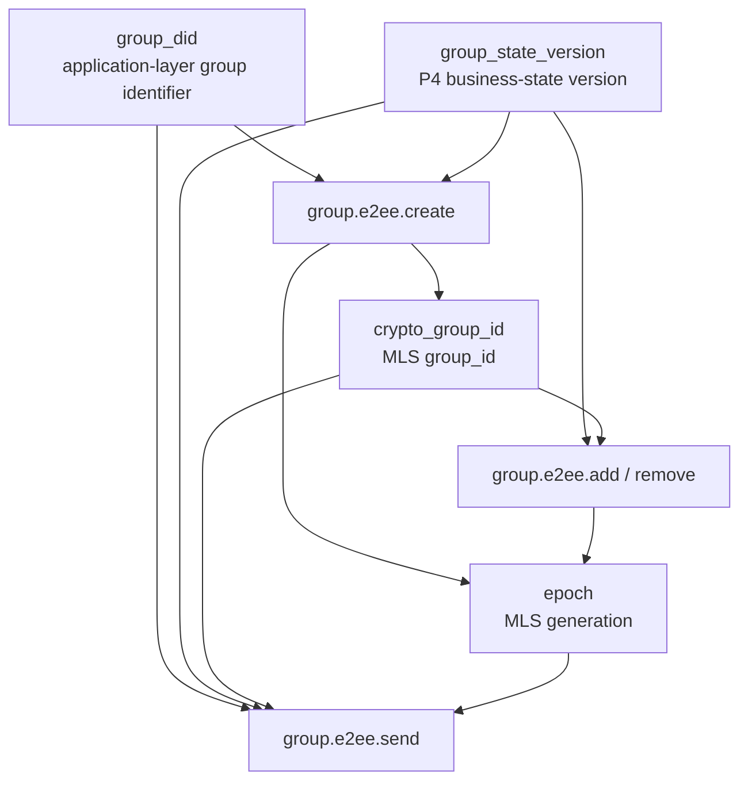
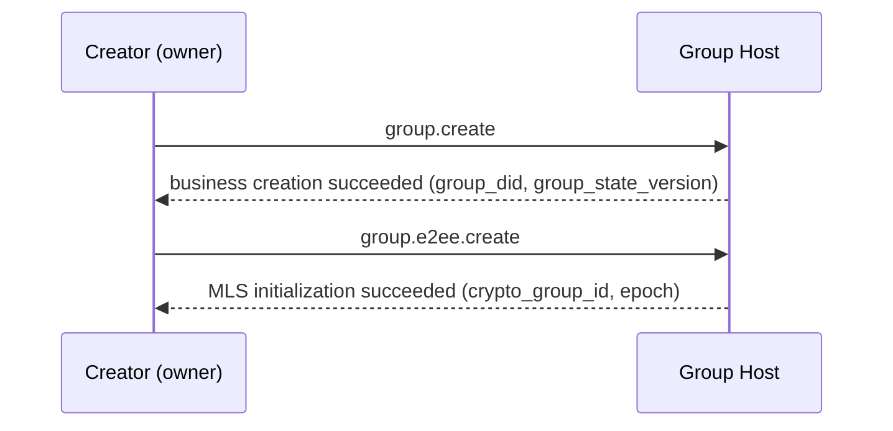
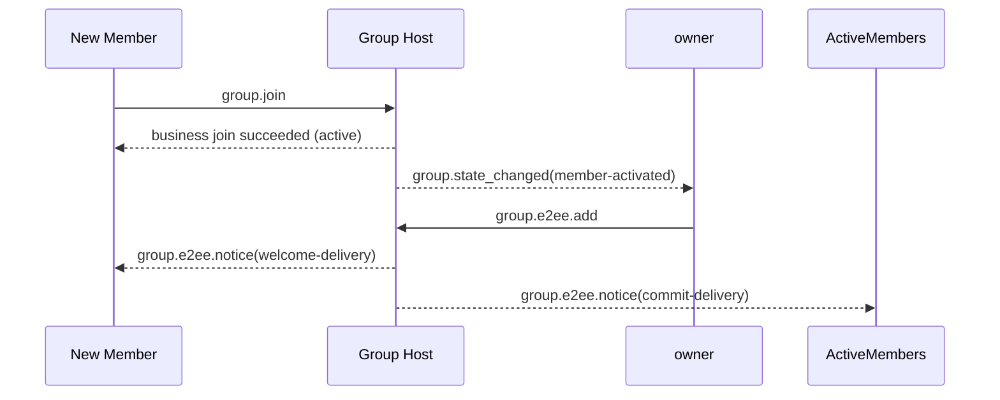
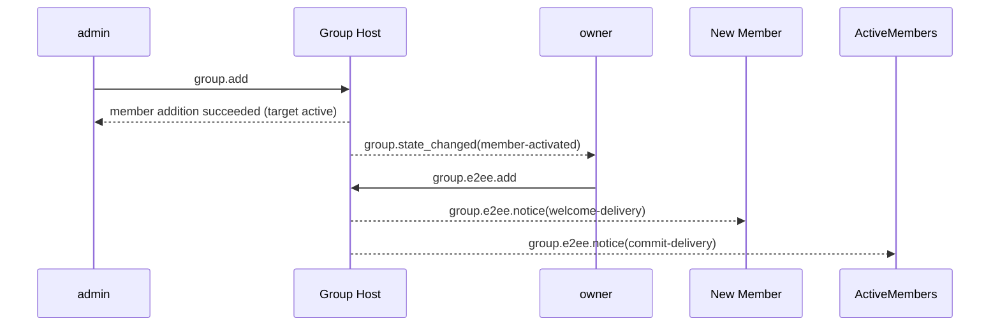
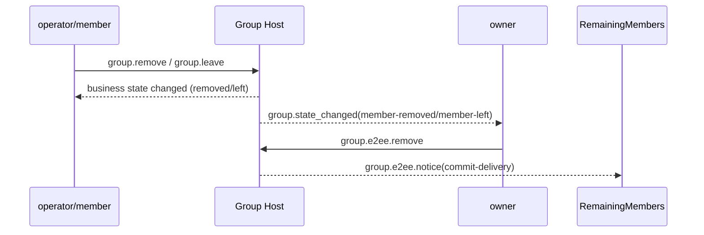
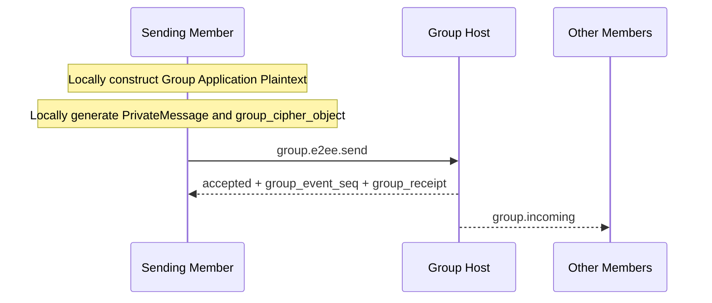
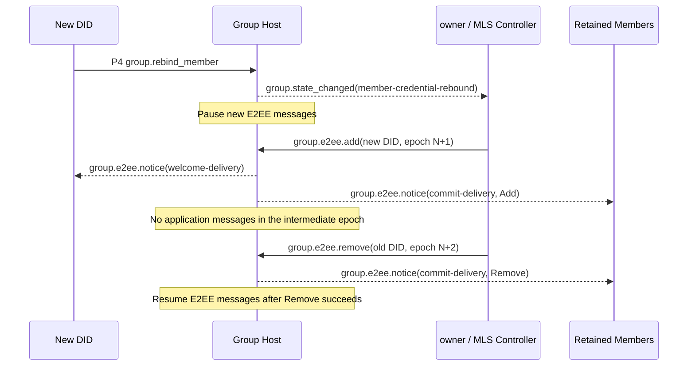

# ANP Profile 6: Group End-to-End Encryption

- Document ID: ANP-P6
- Title: Group End-to-End Encryption
- Status: Released
- Version: 1.1
- Language: English
- Applicability: This Profile is suitable for the Group End-to-End Encryption control layer based on Group DID and works closely with `anp.group.base.v1`.

---

## 1. Purpose

This Profile defines the Group End-to-End Encryption control layer of ANP, stipulating:

1. How to bind `group_did`, `group_state_version`, and `group_event_seq` to the group cryptography state machine;
2. How to use MLS as the basic protocol for group key establishment, member changes, and application message protection;
3. How to bind the `did:wba` identity with MLS member credentials, KeyPackage, and leaf signature keys;
4. How to define a set of independent `group.e2ee.*` JSON-RPC methods to specifically carry MLS cryptographic actions;
5. How to work closely with `anp.group.base.v1` through **state coupling** instead of "embedding the MLS handshake object in the P4 method";
6. How to deal with `epoch`, `Welcome`, `PrivateMessage`, `PublicMessage`, `epoch_authenticator`, fork detection and recovery.
7. How to replace the corresponding MLS leaf through an ordered `group.e2ee.add` and `group.e2ee.remove` after P4 accepts a DID rebind for a Handle-backed Member.

This Profile does not define:

- Pull historical messages;
- Read and online status;
- Device or internal copy concept;
- How to share group key status among multiple execution units within the Agent;
- Specific implementation of directory synchronization outside the group;
- end-to-end encryption for non-group scenarios;
- External Commit main line;
- `group_join_info` and `group.e2ee.get_join_info`;
- `accept_welcome` protocol method;
- The second set of business member status models.
- Recovery or redistribution of lost historical MLS epoch secrets.

---

## 2. Terminology and Normative Conventions

### 2.1 Normative Keywords

In this article, **MUST**, **MUST NOT**, **REQUIRED**, **SHALL**, **SHALL NOT**, **SHOULD**, **SHOULD NOT**, **RECOMMENDED**, **NOT RECOMMENDED**, **MAY**, **OPTIONAL** are interpreted as normative requirements according to their capitalized form.

### 2.2 Terminology

- **Group DID**: The application layer global identifier of the group, which is `group_did`.
- **Crypto Group ID**: Group cryptography internal identifier, corresponding to MLS `group_id`, which can be different from `group_did`.
- **Group Host Service**: The service responsible for the group basic status ordering, policy application and group message entry; not the MLS controller.
- **MLS Group State**: Group cryptographic state maintained based on MLS.
- **Epoch**: A generational advance in MLS group state.
- **KeyPackage**: MLS adding material object, used to add a new member to the group.
- **Welcome**: MLS welcome object, used to help new members initialize the group state.
- **PrivateMessage**: Encrypted MLS message with member authentication.
- **PublicMessage**: MLS message that is only signed and not encrypted.
- **did:wba Binding**: Binds an MLS leaf signature key, member credential, or KeyPackage to a verifiable proof object of `agent_did`.
- **MLS Controller**: The subject responsible for executing MLS member change control actions. Fixed to group `owner` in v1.
- **State Coupling**: P4 and P6 do not do method-by-method mapping, but a coupling method that triggers cryptographic state advancement through business state changes.
- **E2EE Notice**: P6's self-defined independent encryption notification object, used to deliver cryptographic results such as `commit` and `welcome`.
- **Fork**: An irreconcilable sequence of `epoch` / `epoch_authenticator` / status advancement was observed by different members for the same `group_did`.
- **MLS Member Credential Rebind**: After P4 accepts a DID rebind for the same Handle member, the cryptographic orchestration that replaces the MLS leaf through two ordered Commits: `group.e2ee.add(new DID)` followed by `group.e2ee.remove(old DID)`.

---

## 3. Design Principles

### 3.1 Group identity and cryptographic status stratification

This Profile clearly distinguishes between:

- `group_did`: application layer group global identifier;
- `crypto_group_id`: cryptography group internal identifier;
- `group_state_version`: Application layer group state version assigned by Group Host;
- `epoch`: Cryptozoological group generation assigned by the MLS state machine.

The four MUST NOT be mechanically equivalent; but there MUST be a verifiable binding between them.

### 3.2 An Agent = an external group member

Within the external interoperability boundary of this Profile, an MLS member is always represented by its current `agent_did`. P4's optional `member_handle` is a stable business-membership anchor, but it **MUST NOT** replace the current DID in MLS `credential.identity`. The protocol layer does not introduce devices, terminals, local User IDs, or internal replica members.

If there are multiple execution copies within an Agent, how they share or synchronize the MLS group state belongs to the internal implementation of the Agent and does not belong to the interoperability semantics of this Profile.

### 3.3 P4 is the main business protocol, and P6 is the cryptography control layer

The relationship between this Profile and `anp.group.base.v1` is as follows:

- P4 defines the business actions, business state, ordering semantics and receipt semantics of the group;
- P6 defines MLS cryptographic actions, cryptographic objects, binding rules and verification requirements;
- P4 is still the business layer authority;
- P6 **does not** redefine business member status such as `active / left / removed`;
- P6 does not require MLS native objects to be carried directly in the P4 method body.

### 3.4 State coupling instead of method-by-method mapping

The coupling between P4 and P6 is achieved through **state**, rather than through "a certain P4 method directly mapping a certain P6 method".

Specifically:

- P4 determines whether something is valid in business terms;
- P6 observes business-state changes and advances the MLS state accordingly.

For example:

- A group is successfully created in P4, and the creator has become `owner` → owner automatically executes `group.e2ee.create`
- A member becomes `active` in P4 and has not yet entered the MLS membership set → owner automatically executes `group.e2ee.add`
- A member becomes `left` or `removed` in P4 and is still in the MLS membership set → owner automatically executes `group.e2ee.remove`
- A Handle-backed Member produces `member-credential-rebound` in P4 while the old-DID leaf remains in the MLS membership set → owner automatically executes `group.e2ee.add(new DID)` and, after it succeeds, `group.e2ee.remove(old DID)`

### 3.5 owner is the only MLS controller

In v1, only the owner assumes the MLS controller role.

owner is responsible for:

- Create MLS group;
- Execute `add`;
- Execute `remove`;
- Execute member credential rebinds through an ordered `add(new DID)` and `remove(old DID)`;
- Generate `commit` corresponding to member changes;
- Generate `welcome` for new members;
- Advance `epoch` after member change.

The core idea of P6 is not to put MLS objects into P4 method bodies, but to let cryptographic state advance together with business state. The following diagram summarizes this state coupling so that readers can understand the causal relationships among methods before reading the detailed constraints below.

```mermaid
flowchart TB
P4[P4 business-state changes<br/>group.create / member active / member left or removed / credential rebound]
OBS[owner observes business state]

CREATE[group.e2ee.create]
ADD[group.e2ee.add]
REMOVE[group.e2ee.remove]
REBIND_ADD[group.e2ee.add(new DID)]
REBIND_REMOVE[group.e2ee.remove(old DID)]

HOST[Group Host]
NOTICE[group.e2ee.notice]

P4 --> OBS
OBS -->|group created and has no crypto_group_id yet| CREATE
OBS -->|member active and not yet in MLS| ADD
OBS -->|member left or removed and still in MLS| REMOVE
OBS -->|Handle member rebound and old leaf still in MLS| REBIND_ADD

CREATE --> HOST
ADD --> HOST
REMOVE --> HOST
REBIND_ADD --> HOST
REBIND_ADD -->|execute after rebind Add is accepted| REBIND_REMOVE
REBIND_REMOVE --> HOST

HOST --> NOTICE
```

*Figure P6-1: Overview of P4 / P6 state coupling (non-normative).*

This diagram emphasizes trigger relationships rather than a new business state machine: P4 remains the authority for the business layer, and P6 only observes those business results and materializes them as MLS create / add / remove operations.

### 3.6 Group Host is responsible for ordering and is not responsible for MLS control

The responsibilities of Group Host Service are:

- Receive and ordering P4 business operations;
- Assign `group_event_seq` to accepted events;
- Advance `group_state_version`;
- generate `group_receipt`;
- Distribute group messages and E2EE Notice;
- Witness the implementation of MLS control results at the business layer.

By default, Group Host Service:

- **SHOULD NOT** act as an MLS controller;
- **SHOULD NOT** serve as an MLS group member;
- **SHOULD NOT** hold group application plaintext decryption capabilities.

### 3.7 The owner manages group state; active members manage group messages

The owner controls only:

- Member changes;
- Advancement of the group cryptographic state;
- Updates to `epoch`.

All `active` members can:

- Use the current group state to generate their own group-message ciphertext;
- Call `group.e2ee.send` to send their own group message;
- Decrypt other members' group messages.

This Profile does not require that all group messages be encrypted by the owner.

### 3.8 v1 does not support External Commit

In v1:

- External Commit is not supported;
- `group_join_info` is not defined;
- `group.e2ee.get_join_info` is not defined;
- The `accept_welcome` protocol method is not defined.

All group entry paths are eventually unified into MLS `add` initiated by the owner at the cryptographic layer.

### 3.9 Only the message side enters PrivateMessage

In v1:

- Only the application message content of `group.e2ee.send` enters MLS `PrivateMessage` and is encrypted;
- `group.e2ee.create`, `group.e2ee.add`, and `group.e2ee.remove` all continue to use plaintext JSON-RPC request bodies; rebind orchestration reuses `add` and `remove` and defines no new request method;
- Objects such as `commit` and `welcome` appear as method inputs or Notice payloads instead of being embedded in the P4 business method body.

---

## 4. Dependency, Profile identification and target modeling

### 4.1 Profile name

The standard name of this Profile is:

`anp.group.e2ee.v1`

### 4.2 Dependencies

This Profile **MUST** depend on the following Profiles:

- `anp.core.binding.v1`
- `anp.identity.discovery.v1`
- `anp.group.base.v1`

### 4.3 Security Profile

When using this Profile:

- `meta.profile` **MUST** be equal to `anp.group.e2ee.v1`.

Among them:

- `group.e2ee.publish_key_package`, `group.e2ee.get_key_package`, `group.e2ee.notice` **MUST** use `transport-protected`
- `group.e2ee.create`, `group.e2ee.add`, `group.e2ee.remove`, `group.e2ee.send` **MUST** use `group-e2ee`

For `group.e2ee.send`, `group-e2ee` means that the message semantics it carries belong to the group E2EE side; it does not mean that its outer JSON-RPC request body is encrypted by the group again.

### 4.4 Method Target Modeling

### 4.4.1 service-scoped

The following methods **MUST** be `service-scoped`:

- `group.e2ee.publish_key_package`
- `group.e2ee.get_key_package`
- `group.e2ee.create`

Rules:

- `meta.target.kind = "service"`
- `meta.target.did` **MUST** equal target public `ANPMessageService.serviceDid`

The reason why `group.e2ee.create` uses service-scoped is:
Before the success of `group.create` in the business layer, the business state of the group has just been established. Although `group_did` has been generated, the creation action itself still completes cryptographic initialization for the group Host service entrance, so v1 uniformly uses service-scoped.

### 4.4.2 group-addressed

The following methods **MUST** be `group-addressed`:

- `group.e2ee.add`
- `group.e2ee.remove`
- `group.e2ee.send`

Rules:

- `meta.target.kind = "group"`
- `meta.target.did` **MUST** equal target `group_did`

### 4.4.3 agent-addressed notification

The following notification **MUST** be `agent-addressed`:

- `group.e2ee.notice`

Rules:

- `meta.target.kind = "agent"`
- `meta.target.did` **MUST** be equal to the notification recipient Agent DID

---

## 5. Cryptographic Mainline and MTI Suite

### 5.1 Mainline Protocol

This Profile's group key mainline **MUST** be implemented based on MLS 1.0 semantics, but v1 only fixes a restricted usage subset of it.

v1 mainline includes at least:

- KeyPackage
- Add
- Remove
- Commit
- Welcome
- PrivateMessage
- Epoch advancement

A Handle-backed Member credential rebind introduces neither a new P6 method nor a new MLS primitive. It first uses `group.e2ee.add` to Commit the new-DID leaf, then uses `group.e2ee.remove` to Commit removal of the old-DID leaf.

Among them:

- `commit_b64u` **MUST** be represented as raw bytes of the complete MLS `MLSMessage` (`mls-public-message`) serialized by TLS;
- `welcome_b64u` **MUST** be represented as raw bytes of the MLS `Welcome` object serialized by TLS;
- `PrivateMessage` **MUST** serve as the only ciphertext bearer object for group application messages.

The MLS library **MAY** additionally supports standard capabilities such as `Update`, proposal batching, PSK, and ReInit; however, these capabilities **do not belong** to the minimum protocol mainline of this Profile v1, and do not constitute interoperability requirements for v1.

### 5.2 Mandatory-to-Implement Suite

To ensure minimal interoperability, implementations conforming to this Profile MUST support the following MTI packages:

`MLS_128_DHKEMX25519_AES128GCM_SHA256_Ed25519`

### 5.3 Additional Suites

Implementation **MAY** support more MLS suites, but:

- All members within the same group **MUST** agree on the kit used;
- If group policy restrictions allow package collection, MLS Controller **MUST** reject packages that do not satisfy the policy.

### 5.4 Relationship with did:wba

The relationship between the main line of this Profile and did:wba is as follows:

- `authentication`/`assertionMethod` in the DID document is used for identity binding proof;
- `keyAgreement` **SHOULD** in the DID document contains at least one X25519 entry, indicating that the Agent has E2EE capabilities;
- The MLS group member's leaf signing key **SHOUNT** be directly equivalent to the DID long-term identity signing key;
- The leaf signature key **SHOULD** be generated separately and bound to `agent_did` via `did:wba Binding`.

---

## 6. did:wba and MLS binding model

### 6.1 Binding target

This Profile requires the following MLS elements to be bound to `agent_did`:

1. KeyPackage owner;
2. Current leaf signature key;
3. The identity string in the group member's credentials.

### 6.2 Credential Identity Rules

For this Profile, `credential.identity` in an MLS member credential **MUST** equal the UTF-8 byte string of that leaf's current `agent_did`. A Handle **MUST NOT** be written into or replace `credential.identity`.

Implementation **MUST NOT** replace `credential.identity` with a local account ID, device ID, numeric user ID, or other non-DID string.

### 6.3 `did_wba_binding` object

This Profile defines the `did_wba_binding` object used to bind the MLS leaf signature key to `agent_did`.

The recommended structure is as follows:

```json
{
  "agent_did": "did:wba:example.com:agents:alice:e1_<fingerprint>",
  "verification_method": "did:wba:example.com:agents:alice:e1_<fingerprint>#key-1",
  "leaf_signature_key_b64u": "BASE64URL_ED25519_LEAF_PK",
  "issued_at": "2026-03-29T12:00:00Z",
  "expires_at": "2026-04-29T12:00:00Z",
  "proof": {
    "type": "DataIntegrityProof",
    "cryptosuite": "eddsa-jcs-2022",
    "created": "2026-03-29T12:00:00Z",
    "proofPurpose": "assertionMethod",
    "verificationMethod": "did:wba:example.com:agents:alice:e1_<fingerprint>#key-1",
    "proofValue": "z..."
  }
}
```

`did_wba_binding.proof` **MUST** reuse the shared **Object Proof Profile** defined in P1 Appendix B.

For `did_wba_binding`:

- issuer DID **MUST** be `agent_did`
- The protected document **MUST** be the entire `did_wba_binding` object after removing `proof`
- `proof.verificationMethod` **MUST** point to the authentication method authorized by `assertionMethod` in the `agent_did` DID document

### 6.4 `did_wba_binding` verification rules

The recipient MUST complete the following verifications before accepting KeyPackage, LeafNode updates, or new members:

1. `agent_did` can be parsed;
2. `verification_method` exists in the DID document;
3. `verification_method` **MUST** be authorized by `assertionMethod` of the DID document;
4. `proof` **MUST** exist, and **MUST** meet the shared Object Proof Profile of P1 Appendix B;
5. The issuer DID **MUST** of `proof` is equal to `agent_did`;
6. `proof` verification passed;
7. The document content bound to `proof` **MUST** cover at least `agent_did`, `verification_method`, `leaf_signature_key_b64u`, `issued_at`, and `expires_at`;
8. The actual leaf signature public key in KeyPackage / LeafNode is consistent with `leaf_signature_key_b64u`;
9. `credential.identity` in the MLS certificate is consistent with `agent_did`;
10. If `issued_at` / `expires_at` exists, implement **MUST** to verify its time window according to the local time validity policy.

P6 defines `did_wba_binding` because the MLS leaf signature key should not be directly equated with the DID long-term identity signing key. The following diagram connects `agent_did`, the DID document, the binding object, and KeyPackage / `credential.identity` so that readers can understand the verification order.



*Figure P6-2: did:wba and MLS binding chain (non-normative).*

During verification, the recipient should not only check that the internal MLS signature is valid. It should also follow this chain to confirm that `credential.identity`, the leaf signature key, and `agent_did` are fully bound.

### 6.5 `e1_` is compatible with `k1_`

- For the default `e1_` DID, `did_wba_binding.proof` **MUST** reuse the shared Object Proof Profile of P1 Appendix B;
- For compatible `k1_` DID, `did_wba_binding.proof` **MAY** use the alternative Object Proof Profile defined by explicit extension negotiation; but when there is no explicit extension negotiation, v1 MTI **does not** bind `k1_` proof as the default interworking path;
- MTI leaf signature keys for MLS groups still **MAY** use Ed25519 regardless of the DID's identity curve, as long as the proof of binding holds.

---

## 7. Core objects

### 7.1 `crypto_group_id`

`crypto_group_id` represents the MLS's internal `group_id`.

The rules are as follows:

- `crypto_group_id` **MUST** treated as opaque bytes;
- In JSON, **MUST** be represented by `base64url`, and the field name is recommended to be `crypto_group_id_b64u`;
- `crypto_group_id` **MUST** establish a verifiable binding to `group_did`.

### 7.2 `group_state_ref`

This Profile reuses the `group_state_ref` concept of P4 and requires that the E2EE group contains at least:

- `group_did`
- `group_state_version`
- `policy_hash` (if the group policy has been hashed)

In group E2EE, readers can easily connect the wrong mental model among four identifiers / versions at different layers: Group DID, business-state version, cryptographic internal group ID, and MLS epoch. The following diagram puts their sources and advancement relationships in one view.



*Figure P6-3: Relationship among `group_did`, `crypto_group_id`, `group_state_version`, and `epoch` (non-normative).*

When reading the subsequent object structures and verification rules, treat these four values as coordinates from different layers: they need to be bound, but they cannot replace each other and should not be mechanically treated as the same value.

### 7.3 `group_key_package`

This Profile definition group adds material packaging objects:

```json
{
  "key_package_id": "kp-001",
  "owner_did": "did:wba:example.com:agents:bob:e1_<fingerprint>",
  "suite": "MLS_128_DHKEMX25519_AES128GCM_SHA256_Ed25519",
  "mls_key_package_b64u": "BASE64URL_KEYPACKAGE",
  "did_wba_binding": { ... },
  "expires_at": "2026-04-30T00:00:00Z"
}
```

Among them:

- `key_package_id` **MUST** exist;
- `owner_did` **MUST** exist;
- `suite` **MUST** exist;
- `mls_key_package_b64u` **MUST** exist;
- `did_wba_binding` **MUST** exist;
- `expires_at` **SHOULD** exist;
- `mls_key_package_b64u` **MUST** be no-padding base64url for the raw bytes of the MLS `KeyPackage` object after serialization by MLS 1.0 TLS.

`group_key_package` is mainly used by owner to subsequently execute `group.e2ee.add`.

### 7.4 `group_cipher_object`

`group_cipher_object` is the wire protocol message body object of `group.e2ee.send`.

The recommended structure is as follows:

```json
{
  "crypto_group_id_b64u": "BASE64URL_GROUPID",
  "epoch": "7",
  "private_message_b64u": "BASE64URL_PRIVATEMESSAGE",
  "group_state_ref": {
    "group_did": "did:wba:groups.example:team:dev:e1_<fingerprint>",
    "group_state_version": "42",
    "policy_hash": "sha-256:..."
  },
  "epoch_authenticator": "BASE64URL_AUTH"
}
```

Rules:

- `crypto_group_id_b64u` **MUST** exist;
- `epoch` **MUST** exist;
- `private_message_b64u` **MUST** exist;
- `private_message_b64u` **MUST** be no-padding base64url for the raw bytes of the MLS `PrivateMessage` object serialized by MLS 1.0 TLS;
- `group_state_ref.group_did` **MUST** be equal to the outer target `group_did`.

### 7.5 `Group Application Plaintext`

Before group application messages enter MLS `PrivateMessage` encryption, **MUST** be normalized into the following inner plaintext objects:

```json
{
  "application_content_type": "text/plain | application/json | application/anp-attachment-manifest+json | ...",
  "thread_id": "thr-001",
  "reply_to_message_id": "msg-0009",
  "annotations": {},
  "text": "...",
  "payload": {},
  "payload_b64u": "..."
}
```

Rules:

- `application_content_type` **MUST** exist;
- Exactly one of `text`, `payload`, or `payload_b64u` **MUST** be present;
- The message semantic fields `thread_id`, `reply_to_message_id`, and `annotations` in P4 **MUST** be located in the inner object under group E2EE;
- The sender **MUST** serialize the entire `Group Application Plaintext` object into a byte string using UTF-8 + RFC 8785 JCS before encryption; the receiver **MUST** interpret the object according to the same rules after decryption.

When `application_content_type = "application/json"`, `payload` **MUST**
directly carry the JSON object. This Profile does not define the business meaning
of fields inside that object.

Ordinary JSON group application plaintext example:

```json
{
  "application_content_type": "application/json",
  "thread_id": "thr-001",
  "payload": {
    "type": "example",
    "data": {
      "hello": "group"
    }
  }
}
```

### 7.6 `e2ee_notice_object`

P6 defines an independent cryptographic notification object used to deliver cryptographic results.

The recommended structure is as follows:

```json
{
  "notice_id": "en-001",
  "notice_type": "commit-delivery | welcome-delivery",
  "group_did": "did:wba:groups.example:team:dev:e1_<fingerprint>",
  "group_state_ref": {
    "group_did": "did:wba:groups.example:team:dev:e1_<fingerprint>",
    "group_state_version": "43",
    "policy_hash": "sha-256:..."
  },
  "crypto_group_id_b64u": "BASE64URL_GROUPID",
  "epoch": "8",
  "subject_did": "did:wba:b.example:agents:bob:e1_<fingerprint>",
  "subject_status": "active | removed",
  "commit_b64u": "BASE64URL_MLSMESSAGE",
  "welcome_b64u": "BASE64URL_WELCOME",
  "ratchet_tree_b64u": "BASE64URL_RATCHET_TREE",
  "epoch_authenticator": "BASE64URL_AUTH",
  "group_receipt": { ... }
}
```

Rules:

- `notice_type` **MUST** exist;
- `group_did` **MUST** exist;
- `group_state_ref` **MUST** exist;
- `crypto_group_id_b64u` **MUST** exist;
- `epoch` **MUST** exist;
- `commit_b64u` **MUST** exist when `notice_type = "commit-delivery"` is present;
- When `notice_type = "welcome-delivery"`, `welcome_b64u` and `ratchet_tree_b64u` **MUST** exist at the same time;
- For a notice produced by credential-rebind orchestration, `group_state_ref` **MUST** exactly reference the accepted P4 `member-credential-rebound` event used by both P6 operations. The receiver **MUST** obtain the Handle, binding generation, previous DID, and new DID from that P4 event rather than from duplicated P6 continuity fields;
- `subject_did` and `subject_status` describe the leaf affected by this specific P6 operation: Add uses the new DID with `active`, while Remove uses the previous DID with `removed`;
- `ratchet_tree_b64u` **MUST** be no-padding base64url of raw bytes for TLS serialization of the ratchet tree;
- `group_receipt` **MAY** exist to associate cryptographic results with the location of business ordering.

---

## 8. KeyPackage publishing and discovery methods

### 8.1 `group.e2ee.publish_key_package`

#### 8.1.1 Semantics

Published by an Agent to its own exposed `ANPMessageService`, a KeyPackage that can be used for group joining.

#### 8.1.2 Request Requirements

- `method = "group.e2ee.publish_key_package"`
- `meta.profile = "anp.group.e2ee.v1"`
- `meta.security_profile = "transport-protected"`
- `meta.target.kind = "service"`
- `meta.target.did` **MUST** be equal to the publisher’s own public `ANPMessageService.serviceDid`
- `meta.sender_did` **MUST** exist
- `body.group_key_package` **MUST** exist
- `body.group_key_package.owner_did` **MUST** equal `meta.sender_did`

Authentication constraints:

- This method belongs to **service-scoped** Control-Plane Methods;
- The caller **MUST** be running in an authenticated local session or an equivalent hop- and service-level authentication context;
- v1 does **not** require an additional business-layer `origin_proof` for this method.

#### 8.1.3 Successful Response

A successful response **MUST** contain at least:

- `published = true`
- `owner_did`
- `key_package_id`
- `published_at`

### 8.2 `group.e2ee.get_key_package`

#### 8.2.1 Semantics

Get an available KeyPackage through the target Agent's `ANPMessageService`.

#### 8.2.2 Request Requirements

- `meta.profile = "anp.group.e2ee.v1"`
- `meta.security_profile = "transport-protected"`
- `meta.target.kind = "service"`
- `meta.target.did` **MUST** be equal to the `ANPMessageService.serviceDid` exposed by the target Agent

`body` **MUST** contain:

- `target_did`

`body` **MAY** contain:

- `preferred_suite`
- `require_fresh`

Authentication constraints:

- This method belongs to **service-scoped** Control-Plane Methods;
- v1 Minimum Interoperability Requirements is at least hop/service level certification;
- **Anonymous retrieval of KeyPackage is not part of v1 MTI**.

#### 8.2.3 Successful Response

A successful response **MUST** contain at least:

- `target_did`
- `group_key_package`

#### 8.2.4 Server-side distribution rules

`ANPMessageService` When returning `group_key_package`:

- **SHOULD** return KeyPackage that has not expired, not been revoked and not consumed;
- The server **MAY** mark it as `reserved`, or assign an equivalent status after return, to avoid concurrent re-issuance;
- When the corresponding `group.e2ee.add`, including the Add step of a rebind orchestration, is successfully accepted by the Group Host and the cryptographic membership change is completed, the service **MUST** mark it as `consumed` or delete it from the publishing set;
- If the corresponding process fails, is canceled, or times out, release of the reserved KeyPackage is deployment-specific, but it **SHOULD NOT** allow the same KeyPackage to be concurrently reused by two successful `group.e2ee.add` operations;
- Caller identity, rate limiting and anti-abuse policies **MUST** be implemented based on hop/service level authentication.

---

## 9. MLS Control-Plane Methods

### 9.1 General

The methods in this chapter are independent JSON-RPC methods. They are not "additional fields" to the P4 business method, but are P6's own cryptographic control actions.

Among them:

- `group.e2ee.create`, `group.e2ee.add`, and `group.e2ee.remove` are **member change control methods**
- `group.e2ee.send` is the **message sending method**
- `group.e2ee.create/add/remove` is bound to existing P4 business state, but **does not create new P4 business member state**
- `group.e2ee.send` is directly used as the online delivery method, without secondary packaging by `group.send`

### 9.2 `group.e2ee.create`

#### 9.2.1 Semantics

Create a new MLS group state and add the owner as the initial member.

#### 9.2.2 Caller

owner only.

#### 9.2.3 Request Requirements

- `method = "group.e2ee.create"`
- `meta.profile = "anp.group.e2ee.v1"`
- `meta.security_profile = "group-e2ee"`
- `meta.target.kind = "service"`
- `meta.target.did` **MUST** be equal to the `ANPMessageService.serviceDid` exposed by the target group Host
- `meta.sender_did` **MUST** be equal to the current group `owner`
- `auth.origin_proof` **MUST** exist

`body` **MUST** contain at least:

- `group_did`
- `group_state_ref`
- `suite`
- `creator_key_package`
- `crypto_group_id_b64u`
- `epoch`

Rules:

- `creator_key_package.owner_did` **MUST** equal `meta.sender_did`
- `group_state_ref.group_did` **MUST** equal `body.group_did`
- `epoch` For the initial group state **SHOULD** be `"0"` or an initial value explicitly agreed upon by the implementation

#### 9.2.4 Successful Response

A successful response **MUST** contain at least:

- `created = true`
- `group_did`
- `group_state_ref`
- `crypto_group_id_b64u`
- `epoch`
- `accepted_at`

Notes:

- `group.e2ee.create` itself **MUST NOT** create a new P4 business group;
- It is only executed after `group.create` has been accepted by the business layer;
- It no longer generates new `group_state_version` or `group_event_seq` independently.

### 9.3 `group.e2ee.add`

#### 9.3.1 Semantics

The owner executes MLS `add` to add a member who has become `active` in the business layer but has not yet entered the MLS membership set to the cryptography group.

#### 9.3.2 Caller

owner only.

#### 9.3.3 Request Requirements

- `method = "group.e2ee.add"`
- `meta.profile = "anp.group.e2ee.v1"`
- `meta.security_profile = "group-e2ee"`
- `meta.target.kind = "group"`
- `meta.target.did` **MUST** equal target `group_did`
- `meta.sender_did` **MUST** be equal to the current group `owner`
- `auth.origin_proof` **MUST** exist

`body` **MUST** contain at least:

- `member_did`
- `group_state_ref`
- `group_key_package`
- `crypto_group_id_b64u`
- `epoch`
- `commit_b64u`
- `welcome_b64u`
- `ratchet_tree_b64u`

Rules:

- `group_state_ref.group_did` **MUST** equal outer target `group_did`
- `group_key_package.owner_did` **MUST** equal `member_did`
- `commit_b64u` **MUST** be no-padding base64url for the complete MLS `MLSMessage` object serialized by TLS
- `welcome_b64u` **MUST** be no-padding base64url for the MLS `Welcome` object after serialization by TLS
- `ratchet_tree_b64u` **MUST** be no-padding base64url of raw bytes for TLS serialization of the ratchet tree
- `epoch` **MUST** indicate the new `epoch` after this `add`
- On an ordinary join path, `member_did` **MUST** be a P4 `active` DID that has not yet entered the MLS membership set;
- On a rebind path, `group_state_ref` **MUST** exactly reference an accepted P4 `member-credential-rebound` event, `member_did` **MUST** equal that event's `subject_did`, and the new KeyPackage **MUST** bind that new DID;
- The rebind-path `group.e2ee.add(new DID)` **MUST** succeed before the corresponding `group.e2ee.remove(old DID)`.

#### 9.3.4 Successful Response

A successful response **MUST** contain at least:

- `accepted = true`
- `group_did`
- `member_did`
- `group_state_ref`
- `crypto_group_id_b64u`
- `epoch`
- `accepted_at`

Notes:

- `group.e2ee.add` itself **MUST NOT** change the P4 business state of the target member to `active`;
- The business state **MUST** already have been determined by P4;
- This method is only responsible for implementing the business results to MLS.

### 9.4 `group.e2ee.remove`

#### 9.4.1 Semantics

The owner executes MLS `remove` to remove a member who has become `removed` or `left` at the business layer from the cryptographic group, or to remove the old-DID leaf in an accepted Handle rebind orchestration.

#### 9.4.2 Caller

owner only.

#### 9.4.3 Request Requirements

- `method = "group.e2ee.remove"`
- `meta.profile = "anp.group.e2ee.v1"`
- `meta.security_profile = "group-e2ee"`
- `meta.target.kind = "group"`
- `meta.target.did` **MUST** equal target `group_did`
- `meta.sender_did` **MUST** be equal to the current group `owner`
- `auth.origin_proof` **MUST** exist

`body` **MUST** contain at least:

- `member_did`
- `group_state_ref`
- `crypto_group_id_b64u`
- `epoch`
- `commit_b64u`

Rules:

- `commit_b64u` **MUST** be no-padding base64url for the complete MLS `MLSMessage` object serialized by TLS
- `epoch` **MUST** indicate the new `epoch` after this `remove`
- On an ordinary removal path, the P4 membership status corresponding to `member_did` **MUST** already be `removed` or `left`;
- The rebind path is the only exception: `member_did` **MUST** equal `previous_subject_did` in the referenced P4 `member-credential-rebound` event, `group_state_ref` **MUST** exactly match the previously successful `group.e2ee.add(new DID)`, and that Add must already have added the event's `subject_did`;
- The rebind exception **MUST NOT** be used to remove an arbitrary member whose status remains `active`.

#### 9.4.4 Successful Response

A successful response **MUST** contain at least:

- `accepted = true`
- `group_did`
- `member_did`
- `group_state_ref`
- `crypto_group_id_b64u`
- `epoch`
- `accepted_at`

### 9.5 `group.e2ee.send`

#### 9.5.1 Semantics

Send an MLS encrypted group message directly to a group.

#### 9.5.2 Caller

Any current `active` member.

#### 9.5.3 Request Requirements

A compliant `group.e2ee.send` request **MUST** satisfy:

1. `method = "group.e2ee.send"`
2. `meta.profile = "anp.group.e2ee.v1"`
3. `meta.security_profile = "group-e2ee"`
4. `meta.target.kind = "group"`
5. `meta.target.did` **MUST** be the target `group_did`
6. `meta.sender_did` **MUST** be the current sender Agent DID
7. `meta.message_id` **MUST** exist
8. `meta.operation_id` **MUST** exist
9. `meta.content_type` **MUST** be fixed to `application/anp-group-cipher+json`
10. `auth.origin_proof` **MUST** exist
11. `body` **MUST** directly carry `group_cipher_object`

Notes:

- `group.e2ee.send` is the online sending method itself;
- It no longer wraps another layer via P4 `group.send`.

#### 9.5.4 Successful Response

A successful response **MUST** contain at least:

- `accepted = true`
- `group_did`
- `message_id`
- `operation_id`
- `group_event_seq`
- `group_state_version`
- `accepted_at`
- `epoch`
- `group_receipt`

The Success Semantics says:

- Group Host has accepted and ordering an MLS ciphertext object;
- It does not automatically mean that all members have successfully decrypted the message.

---

## 10. State coupling rules

### 10.1 General

The coupling between P4 and P6 is completed through **business-state changes**.
This Profile no longer requires the maintenance of a method-by-method mapping table for `group.create -> create` and `group.add -> add`.

owner **MUST** be known via trusted state observation:

- A certain group has been created at the business layer;
- A member has become `active` at the business level;
- A member has become `left` or `removed` at the business level;
- A Handle-backed Member has produced `member-credential-rebound`.

The status observation method **MAY** be:

- Internal orchestration of local and Group Host;
- Subscription to `group.state_changed`;
- Or other equivalent and reliable state observation mechanism.

### 10.2 Group creation coupling rules

When the owner observes that the following business states are simultaneously true:

- A certain `group_did` has been created;
- The creator is yourself;
- There are no `crypto_group_id`s attached to this group yet

owner **MUST** trigger `group.e2ee.create` once.

### 10.3 Member joining coupling rules

When the owner observes that the following business states are simultaneously true:

- A certain `member_did` is already a member of `active` of the group in P4;
- The member is not currently in the MLS membership;
- The member has `group_key_package` available

owner **MUST** trigger `group.e2ee.add` once.

This rule also applies to:

- `group.join`
- `group.add`
- Deployment extension invites to join
- Deployment extension approved

In other words, P4’s various service entry points eventually converge to `group.e2ee.add` at the cryptographic layer.

### 10.4 Member Removal / Leaving Coupling Rules

When the owner observes that the following business states are simultaneously true:

- An `member_did` has become `removed` or `left` in P4;
- The member is currently still in the MLS membership set

owner **SHOULD** trigger `group.e2ee.remove` once.

### 10.5 Member Credential Rebind Coupling Rules

When the owner observes a P4 `member-credential-rebound` event, its `subject_did` identifies the new DID and its `previous_subject_did` identifies the old DID. If the old-DID leaf remains in the MLS membership set, the owner **MUST** orchestrate the existing methods in this order:

1. Call `group.e2ee.add` with the event's `subject_did` and a new KeyPackage;
2. After Add succeeds and advances one epoch, call `group.e2ee.remove` with the event's `previous_subject_did`;
3. Complete the cryptographic rebind after Remove succeeds and advances the epoch again.

Both requests **MUST** exactly reference the same P4 `member-credential-rebound` `group_state_ref`. Add **MUST** succeed before Remove. Remove may delete only the event's `previous_subject_did` and **MUST NOT** use the rebind workflow to remove another member.

During rebind orchestration, the Group Host **MUST** serialize P6 member-change control actions. Except for an idempotent retry of the current step and the matching Remove immediately after Add succeeds, the Group Host **MUST NOT** accept an unrelated `group.e2ee.add` or `group.e2ee.remove` until the rebind completes.

From acceptance of the P4 rebind event until Remove succeeds, the Group Host **MUST** pause acceptance of new `group.e2ee.send` operations for the group. The intermediate epoch produced by Add **MUST NOT** carry application messages. If Add fails, the implementation **MUST** remain paused and retry Add. If Add succeeds but Remove fails, the old and new leaves may temporarily coexist, but the implementation **MUST** remain paused and retry Remove.

A P6 failure **MUST NOT** roll back the P4 rebind, restore the old DID's P4 authority, or create a new P6 business-membership state. P4 membership, role, status, join time, and member count remain determined by the original rebind event.

If the rebind target is the owner, the new DID **MUST** initiate Add as the current P4 owner using its own `origin_proof`. The transitional Add Commit **MAY** be generated from the retained MLS state of the old-owner leaf. After the new-owner leaf joins, the Remove(old DID) Commit **MUST** be generated by the new-owner leaf. If the owner has lost current MLS state and no other authorized controller can continue, the system **MUST** fail closed and keep the E2EE message plane paused.

### 10.6 Message sending rules

`group.e2ee.send` is **not** a method that triggers state coupling.
It is an online sending method explicitly initiated by members.

But its business consistency requirements are still tightly tied to P4:

- The sender **MUST** be a current member of `active`;
- Sender **MUST** meet P4 `group_policy.permissions.send`
- The semantics of `group_event_seq`, `group_state_version`, and `group_receipt` in Successful Response follow the definition of group messages in P4.

---


## 11. MLS Usage Profile (normative)

### 11.1 General and external specification references

This chapter defines the **restricted use subset and fixed configuration** of this Profile for MLS.
The goal of this chapter is not to rewrite the MLS standards, but to provide:

- Which objects and state machine actions of MLS are allowed to be used in v1;
- How these objects are encoded in the online protocol;
- What local status and processing obligations do owner, active member, and Group Host need to bear respectively?
- What are the MLS semantics behind `group.e2ee.create`, `group.e2ee.add`, `group.e2ee.remove`, and `group.e2ee.send`.

Implement **MUST NOT** to modify the core algorithm semantics of MLS; but when the default degrees of freedom of the MLS standard library conflict with the v1 restricted rules of this Profile, **MUST** shall prevail.

### 11.2 MLS Subset Allowed in v1

The MLS mainline of this Profile v1 only allows the following objects and actions to enter the interoperability boundary:

- `KeyPackage`
- `Add`
- `Remove`
- `Commit`
- `Welcome`
- `PrivateMessage`
- `epoch` Advance

In this Profile v1:

- `commit_b64u` **MUST** correspond to the complete MLS `MLSMessage`, and its wire format **MUST** be `mls-public-message`
- `welcome_b64u` **MUST** correspond to MLS `Welcome`
- `private_message_b64u` **MUST** correspond to MLS `PrivateMessage`

This Profile v1 **does not** include the following capabilities into the main interoperability line:

- External Commit
- `GroupInfo` / `group_join_info`
- `group.e2ee.get_join_info`
- Standalone `accept_welcome` protocol method
- Concurrent submission by multiple controllers
- Member changes initiated by non-owner
- `Update` as protocol-level mainline action
- proposal batching as an interoperability requirement
- ReInit, PSK, Subgroup or custom MLS extensions required as v1 MTI

The MLS library used by the implementation **MAY** support the above capabilities; but when not explicitly extended for negotiation, **MUST NOT** bring them into v1 wire protocol interworking.

### 11.3 MTI suite and fixed algorithm

This Profile v1 **MUST** implement the following MTI suites:

`MLS_128_DHKEMX25519_AES128GCM_SHA256_Ed25519`

The corresponding fixed algorithm configuration is as follows:

- KEM / HPKE DH: `DHKEMX25519`
- AEAD: `AES-128-GCM`
- Hash/KDF base: `SHA-256`
- Leaf signature: `Ed25519`

Additionally, all JSON objects in this Profile that go into proof, AAD, or inner plaintext bindings MUST be encoded using UTF-8 + RFC 8785 JCS. This requirement applies at least to:

- Protected object of `did_wba_binding`
- `Group Application Plaintext`
- `group.e2ee.send` of `authenticated_data`
- Authenticated binding object submitted by member change

### 11.4 MLS semantics of `group.e2ee.create`

`group.e2ee.create` is only executed after `group.create` has been accepted by the business layer.

When executing `group.e2ee.create`, owner's local MLS runtime **MUST**:

1. Verify `creator_key_package`
2. Verify `did_wba_binding` in it
3. Create a new MLS group state
4. Generate new `crypto_group_id`
5. Add owner as the first MLS member
6. Form initial `epoch`
7. Establish local persistent state of owner

`group.e2ee.create` **MUST NOT** create a new P4 business group separately; it only creates the corresponding initial MLS state for the existing business group.

### 11.5 MLS Semantics of `group.e2ee.add`

`group.e2ee.add` is the only standard entry cryptography mainline in v1.

When executing `group.e2ee.add`, owner's local MLS runtime **MUST**:

1. Obtain and verify the `group_key_package` of the target member
2. Verify `KeyPackage` and `did_wba_binding`
3. Verify that the target DID is either a P4 `active` member on an ordinary join path or the `subject_did` in the referenced P4 `member-credential-rebound` event
4. Execute MLS `Add` based on current group state
5. Generate new `Commit`
6. Generate `Welcome` for new members
7. Export or construct ratchet tree materials sufficient for bootstrap of new members
8. Promote new `epoch`
9. Update owner local group state

Therefore, the main line of standard group cryptography in v1 is:

```text
KeyPackage
→ Add
→ Commit
→ Welcome
→ ratchet_tree
→ new epoch
```

To reduce implementation ambiguity, v1 stipulates:

- `commit_b64u` **MUST** be the TLS-serialized raw bytes of the complete MLS `MLSMessage`;
- `welcome_b64u` **MUST** be the TLS-serialized raw bytes of the MLS `Welcome` object;
- `ratchet_tree_b64u` **MUST** be provided explicitly, and only to new members;
- `welcome-delivery` **MUST NOT** rely on the library-level optional behavior "Welcome may come with ratchet tree internally".

In credential-rebind orchestration, the Add in this section is the first step. It **MUST** reference the P4 rebind event's `group_state_ref`, add a leaf bound to the new DID, and deliver the Welcome to that new DID. It does not itself remove the old-DID leaf.

### 11.6 MLS Semantics of `group.e2ee.remove`

When executing `group.e2ee.remove`, owner's local MLS runtime **MUST**:

1. Verify that the target member has entered `removed` or `left` on an ordinary path, or is exactly the referenced P4 event's `previous_subject_did` on a rebind path
2. Verify that the member is still in the MLS membership set
3. Execute MLS `Remove` based on the current group state
4. Generate new `Commit`
5. Promote new `epoch`
6. Update the owner's local group state
7. Make the removed members lose the ability to decrypt subsequent messages

The line protocol output for `group.e2ee.remove` **MUST** contain at least:

- `commit_b64u`
- `crypto_group_id_b64u`
- `epoch`
- `group_state_ref`

In credential-rebind orchestration, the Remove in this section is the second step. It may execute only after Add(new DID) has succeeded with the same `group_state_ref`, and it may remove only the old-DID leaf identified by that P4 event.

### 11.7 Encryption semantics of `group.e2ee.send`

When the sender calls `group.e2ee.send`, its local MLS runtime **MUST**:

1. Verify that you are currently a member of `active`
2. Verify that it meets P4 `permissions.send`
3. Construct `Group Application Plaintext`
4. Construct `authenticated_data` defined in Chapter 13
5. Use the current MLS group state to encrypt the inner plaintext to MLS `PrivateMessage`
6. Construct `group_cipher_object`
7. Submit the object to the Group Host as `body` of `group.e2ee.send`

Success with `group.e2ee.send` simply means:

- Group Host has accepted and ordering an MLS ciphertext object;
- It does not automatically mean that all members have successfully decrypted the message.

### 11.8 Group message decryption obligations

After the receiving member receives the ciphertext object corresponding to `group.e2ee.send`, **MUST**:

1. Find the local corresponding MLS group state based on `group_did`
2. Verify that `crypto_group_id_b64u` is consistent with local binding
3. Verify whether `epoch` is within the acceptable window
4. Decrypt `private_message_b64u` using local MLS state
5. Verify `authenticated_data`
6. Parse inner layer `Group Application Plaintext`
7. Only after all checks pass, the message is delivered to the upper layer

If any step fails, the receiver **MUST NOT** deliver the message to the application layer as a valid group message.

### 11.9 Local processing obligations for `group.e2ee.notice`

#### 11.9.1 `commit-delivery`

When receiving `notice_type = "commit-delivery"`, the receiver's local MLS runtime **MUST**:

1. Decode `commit_b64u`
2. Verify `group_did`, `group_state_ref`, `crypto_group_id_b64u`, `epoch`
3. Apply the commit to the local MLS group state
4. Update local current `epoch`
5. Document the necessary `epoch_authenticator` or consistency status if present

#### 11.9.2 `welcome-delivery`

New member local MLS runtime **MUST** when receiving `notice_type = "welcome-delivery"`:

1. Decode `welcome_b64u`
2. Decode `ratchet_tree_b64u`
3. Verify `group_did`, `group_state_ref`, `crypto_group_id_b64u`, `epoch`
4. Initialize the local MLS group state with `welcome_b64u` + `ratchet_tree_b64u`
5. Bind this status to local `group_did`
6. Prepare to receive subsequent `commit-delivery` and group messages

Welcome handling is a local behavior specification, not a new JSON-RPC protocol method.

### 11.10 Local persistent state requirements

In order to ensure achievability across restarts and across notification timings, each participant **SHOULD** must at least persist the following states.

#### 11.10.1 owner

owner **SHOULD** be at least persistent:

- `group_did`
- `crypto_group_id`
- Current `epoch`
- Current MLS group state
- The synchronized member set view of the current business layer
- Reference to the most recently accepted `add/remove` result, including both steps of credential-rebind orchestration

#### 11.10.2 active member

Ordinary active members **SHOULD** be at least persistent:

- `group_did`
- `crypto_group_id`
- Currently available MLS group state
- Current `epoch`
- The most recent successfully applied `commit/welcome` reference

#### 11.10.3 Group Host

The Group Host **SHOULD** persist at least:

- `group_state_version`
- `group_event_seq`
- `group_receipt`
- Outer binding reference to `crypto_group_id`, `epoch`
- The current public DID-to-leaf projection derived from accepted `create/add/remove` operations; this projection **MUST NOT** contain MLS private keys or epoch secrets
- Internal progress indicating whether credential-rebind orchestration is at Add or Remove; this progress is not a new protocol-level membership state

By default, the Group Host is **not required** to persist MLS private state capable of decrypting group messages.

### 11.11 MLS Capabilities Not Supported in v1

In addition to the exclusions listed in Section 11.2, this Profile v1 does not support:

- Expose `Update` as a separate protocol-level action
- Deliver unbound cryptographic results of `group_state_ref` via notice
- Rely on MLS library to implicitly and automatically restore missing tree material
- Let non-owner members submit `Commit` that changes the membership set
- Let the Group Host complete the final MLS validity judgment on behalf of the members

### 11.12 Handle-backed Member Rebind MLS Orchestration

The owner's local MLS runtime **MUST**:

1. Verify the corresponding P4 `member-credential-rebound` state event and confirm its old DID, new DID, and `group_state_ref`;
2. Verify that the old DID currently corresponds to exactly one MLS leaf;
3. Obtain and fully verify the new DID's `group_key_package` and `did_wba_binding`;
4. Generate the first Commit, using `group.e2ee.add` to add the new-DID leaf and advance to epoch N+1;
5. Deliver the corresponding `Welcome` and explicit ratchet tree to the new DID, and deliver the Add Commit to current members;
6. Generate the second Commit, using `group.e2ee.remove` to remove the old-DID leaf and advance to epoch N+2;
7. Deliver the Remove Commit to retained members;
8. Resume application messages only after Remove succeeds, and ensure the old leaf cannot derive or decrypt epoch N+2 or later application messages.

Both Commits **MUST** bind the same P4 `group_state_ref`. Epoch N+1 is an intermediate epoch used only to complete the rebind and **MUST NOT** carry application messages. The new DID obtains only current and subsequent state through this Welcome; this Profile **MUST NOT** restore lost historical epoch secrets to it.

If the rebind target is the owner, the transitional Add Commit **MAY** be generated using the retained MLS state of the old-owner leaf. After the new-owner leaf joins, the Remove Commit **MUST** be generated by the new-owner leaf. If the owner has lost current MLS state and v1 has no other authorized MLS Controller, the implementation **MUST** fail closed. This Profile provides no automatic owner MLS recovery, and the Group Host **MUST NOT** release current or historical epoch secrets to the new DID.

---

## 12. Independent notification model

### 12.1 General

P6 defines independent notifications by yourself:

- `group.e2ee.notice`

It does not reuse P4's `group.state_changed` to pass Welcome or Commit.
`group.state_changed` of P4 continues to be only responsible for **business-state changes**;
P6's `group.e2ee.notice` is specifically responsible for cryptographic result delivery.

### 12.2 `group.e2ee.notice`

#### 12.2.1 Semantics

Directly deliver group cryptography-related result objects to a target Agent.

#### 12.2.2 Notification envelope constraints

- `method = "group.e2ee.notice"`
- `meta.profile = "anp.group.e2ee.v1"`
- `meta.security_profile = "transport-protected"`
- `meta.target.kind = "agent"`
- `meta.target.did` **MUST** equal the current notification recipient DID
- `meta.sender_did` **SHOULD** be equal to `group_did`
- `body` **MUST** directly carry `e2ee_notice_object`

### 12.3 `notice_type = "commit-delivery"`

For delivery to current MLS members:

- `commit_b64u`
- NEW `epoch`
- New `epoch_authenticator` (if available)

After receiving it, the receiver should process the commit according to the local MLS runtime rules.

### 12.4 `notice_type = "welcome-delivery"`

For targeted delivery to new members:

- `welcome_b64u`
- `ratchet_tree_b64u`
- NEW `epoch`
- `group_state_ref`

The rules are as follows:

- `welcome_b64u` **MUST** be the TLS-serialized raw bytes of the MLS `Welcome` object;
- `ratchet_tree_b64u` **MUST** be the TLS-serialized raw bytes of the ratchet tree;
- This notice **MUST NOT** be sent to a recipient other than the intended new member;
- The new member **MUST** use `welcome_b64u + ratchet_tree_b64u` to complete local bootstrap.
- For the Add step of credential-rebind orchestration, the notice target **MUST** be the new DID identified by the event's `subject_did`; a Welcome **MUST NOT** be sent to `previous_subject_did`.

### 12.5 Relationship to P4 Notifications

- P4 `group.state_changed`: only carries business events
- P4 `group.incoming`: Continue to carry group message delivery
- P6 `group.e2ee.notice`: only carries cryptographic notice

In this way, the boundaries between the three are clear and they do not pretend to be each other.

---

## 13. Binding, AAD and Authentication Requirements

### 13.1 Minimum binding set

The following fields **MUST** enter the authenticated binding scope:

- `group_did`
- `crypto_group_id`
- `group_state_version` (or `group_state_ref`)
- `policy_hash` (if present)
- `meta.sender_did`
- `meta.message_id` / `meta.operation_id`
- `meta.security_profile = group-e2ee`

### 13.1.1 `authenticated_data` for `group.e2ee.send`

`group.e2ee.send` When using MLS `PrivateMessage`, its `authenticated_data` **MUST** be the UTF-8 + RFC 8785 JCS encoded byte string of the following JSON object:

```json
{
  "content_type": "application/anp-group-cipher+json",
  "group_did": "<outer meta.target.did>",
  "crypto_group_id_b64u": "<body.crypto_group_id_b64u>",
  "group_state_ref": { "...": "..." },
  "security_profile": "group-e2ee",
  "sender_did": "<outer meta.sender_did>",
  "message_id": "<outer meta.message_id>",
  "operation_id": "<outer meta.operation_id>"
}
```

### 13.1.2 Submission Binding of `group.e2ee.add/remove`

When the owner generates `commit_b64u` locally for `group.e2ee.add/remove`, it **SHOULD** put at least the following semantics into the authenticated binding scope, for example through MLS `authenticated_data` or equivalent context:

```json
{
  "group_did": "<outer meta.target.did>",
  "crypto_group_id_b64u": "<body.crypto_group_id_b64u>",
  "group_state_ref": { "...": "..." },
  "subject_method": "group.e2ee.add | group.e2ee.remove",
  "member_did": "<body.member_did>",
  "epoch": "<body.epoch>",
  "security_profile": "group-e2ee",
  "sender_did": "<outer meta.sender_did>",
  "operation_id": "<outer meta.operation_id>"
}
```

All default optional fields **MUST** be omitted directly and **MUST NOT** be represented by `null`, an empty string, or another placeholder. `member_did` **MUST** always identify the target DID of the actual Add or Remove operation.

For credential-rebind orchestration, both Commits **MUST** use the binding above and reference the same P4 `group_state_ref`: Add's `member_did` **MUST** equal the event's `subject_did`, and Remove's `member_did` **MUST** equal the event's `previous_subject_did`. P6 requests add no `member_handle`, `handle_binding_generation`, `previous_member_did`, or `new_member_did` fields; those continuity fields are provided by the referenced P4 event.

### 13.2 KeyPackage verification

Before the receiver accepts a KeyPackage for joining the group, **MUST**:

1. Decoding MLS `KeyPackage`
2. Verify that its protocol version and suite meet the requirements of this group
3. Verify that it has not expired, been revoked and has not been marked as consumed
4. Verify that `leaf_node` is valid for `KeyPackage`
5. Verify the `KeyPackage` signature using the public key in `leaf_node.credential`
6. Verify `credential.identity == owner_did`
7. Verify `did_wba_binding`
8. Verify that the leaf signature public key is consistent with `did_wba_binding.leaf_signature_key_b64u`

If a KeyPackage has been successfully used for `group.e2ee.add`, including the Add step of rebind orchestration, and accepted by the Group Host, implementations **MUST NOT** treat it as reusable valid join material unless the deployment explicitly declares a last-resort exception.

### 13.3 `group.e2ee.send` Request Verification

Before accepting an `group.e2ee.send`, the Group Host **MUST** verify at least:

1. `auth.origin_proof` is legal
2. `group_did` exists and can be managed by the current Host
3. `group_state_ref.group_did` is consistent with the outer target
4. `meta.sender_did` is currently a member of `active`
5. `group_policy.permissions.send` allows this sender
6. The `group_cipher_object` field is complete and in the correct format.

### 13.4 `group.e2ee.add/remove` Request Verification

Before the Group Host accepts an `group.e2ee.add` or `group.e2ee.remove`, **MUST** verify at least:

1. `auth.origin_proof` is legal
2. `meta.sender_did` is currently the group `owner`
3. `group_state_ref.group_did` is consistent with the outer target
4. `crypto_group_id` is consistent with the current cryptographic binding of the group
5. `member_did` is semantically consistent with the request target
6. The `commit_b64u` (and `welcome_b64u`, if present) field format is legal

In addition:

- An ordinary Add **MUST** target a current P4 `active` DID that is not yet in MLS. A rebind Add **MUST** exactly reference a P4 `member-credential-rebound`, target its `subject_did`, and verify that the new KeyPackage binds that DID;
- An ordinary Remove **MUST** target a DID whose P4 status is already `removed` or `left`. A rebind Remove **MUST** target the same event's `previous_subject_did`, reference exactly the same `group_state_ref` as Add, and confirm that Add(new DID) has succeeded;
- The Group Host **MUST** reject a rebind Remove that precedes its corresponding Add and **MUST** reject use of the rebind exception to remove another `active` member;
- After Add succeeds, the Group Host **MUST** make the corresponding Remove the next acceptable member-change control action and reject or defer unrelated Add/Remove operations;
- Add and Remove retries for the same P4 rebind event **MUST** have idempotent semantics.

These Group Host checks **MUST NOT** replace final Commit and Welcome validation by member MLS runtimes.

### 13.5 `group.e2ee.create` Request Verification

Before accepting an `group.e2ee.create`, the Group Host **MUST** verify at least:

1. `auth.origin_proof` is legal
2. `meta.sender_did` is the current business layer owner
3. `creator_key_package.owner_did` is consistent with `meta.sender_did`
4. `crypto_group_id_b64u`, `epoch`, and `group_state_ref` fields are complete
5. There is currently no accepted MLS initial status for this group.

---

## 14. ordering, Epoch, receipt and forks

### 14.1 ordering Responsibilities

- P4 business operation and `group.e2ee.send` enter the group event ordering link from the Group Host;
- `group.e2ee.create/add/remove` is a cryptographic control action bound to existing business state and **MUST NOT** independently create a new P4 `group_state_version`;
- Relevant cryptographic results are delivered via `group.e2ee.notice`.

### 14.2 `epoch` processing

- `epoch` **MUST** expressed as a decimal string in the outer object;
- The receiver **MUST** reject application messages that are obviously old and outside the tolerance window;
- The implementation **MAY** reserve a finite old epoch decryption window for delayed messages, but **MUST** set an upper limit.

### 14.3 `epoch_authenticator`

If the package can export `epoch_authenticator` or equivalent consistency token, implement **SHOULD** in:

- `group_cipher_object`
- `group.e2ee.notice`
- `group_receipt` (if applicable)

Expose this value so that members can do consistency checks.

### 14.4 Group receipt

- `group_receipt` continues to be generated by Group Host;
- For `group.e2ee.send`, `group_receipt` is still the standard return field;
- For `group.e2ee.add/remove/create`, `group_receipt` **MAY** appear as additional information in `group.e2ee.notice` to anchor cryptographic results to the corresponding business state;
- If `group_receipt` carries `proof`, its proof syntax, protected document and verification steps **MUST** reuse the shared Object Proof Profile of P4 Section 7.9 and P1 Appendix B.

### 14.5 Fork detection

If a member observes:

- The same `group_did` corresponds to multiple irreconcilable `crypto_group_id`
- Inconsistent `epoch_authenticator` in the same or adjacent state
- There are different valid `Commit`s in the same context

Then implement **SHOULD** to mark the group as `fork-suspected` and suspend the sending of new group messages until the status is reconfirmed.

---

## 15. Flow Diagrams

### 15.1 Group establishment process



### 15.2 Self-service joining process (open-join)



### 15.3 Direct addition process (admin-add)



### 15.4 Removal / Leaving Process



### 15.5 Group message sending process



### 15.6 Handle-backed Member Credential Rebind Process



---

## 16. Security and Policy Requirements

### 16.1 Host does not replace member encryption permissions

The Group Host **MUST NOT** be presumed to have access to group plaintext merely because it is responsible for ordering.

### 16.2 Relationship between `origin_proof` and MLS member signatures

- `auth.origin_proof` proves "who requested this action at the application layer";
- MLS member signature/commit object proves "which cryptographic group member produced this ciphertext or commit".

Both **MUST NOT** replace each other.

### 16.3 Group policy takes precedence over pure cryptography capabilities

Even if a member "can generate some kind of Proposal/Commit/PrivateMessage" from a pure MLS perspective, whether the application layer allows its execution is still **MUST** determined by P4's `group_policy`.

### 16.4 Sending permission of `group.e2ee.send`

Only if sender:

- Currently a member of `active`;
- Meet `group_policy.permissions.send`;

Group Host can only accept `group.e2ee.send`.

### 16.5 owner as sole controller

As long as v1 is not extended to the multi-controller model, then:

- Only owner can call `group.e2ee.create/add/remove`
- admin cannot call these methods directly
- The business layer actions of admin only affect the P4 status, and are eventually implemented to MLS by owner

### 16.6 Future Secrecy and Historical Boundary After Rebind

- After the `group.e2ee.remove(old DID)` Commit is accepted, the old-DID leaf **MUST NOT** decrypt messages from that new epoch or later epochs;
- The intermediate epoch between Add(new DID) and Remove(old DID) **MUST NOT** carry application messages;
- The new DID receives only the new epoch and later state through this Welcome. This Profile **MUST NOT** redistribute lost historical epoch secrets;
- Historical ciphertext, sender DIDs, MLS credentials, and receipts **MUST NOT** be rewritten because of a rebind;
- Applications that require historical plaintext recovery need an explicit encrypted backup mechanism outside this Profile.

---

## 17. Profile specific errors (recommended)

On the premise of following the ANP Core public error model, this Profile recommends the following `anp_code`:

| `code` | `anp_code` | Meaning |
|---|---|---|
| 5000 | `group.e2ee.key_package_not_found` | No available KeyPackage found |
| 5001 | `group.e2ee.invalid_key_package` | KeyPackage is invalid |
| 5002 | `group.e2ee.did_binding_invalid` | did:wba binding verification failed |
| 5003 | `group.e2ee.controller_required` | The current caller is not an MLS controller |
| 5004 | `group.e2ee.state_not_ready` | The corresponding business state is not ready yet |
| 5005 | `group.e2ee.epoch_conflict` | epoch conflict |
| 5006 | `group.e2ee.crypto_group_mismatch` | The binding of `group_did` and `crypto_group_id` is inconsistent |
| 5007 | `group.e2ee.private_message_invalid` | The group message ciphertext object is invalid |
| 5008 | `group.e2ee.commit_invalid` | The Commit object is invalid |
| 5009 | `group.e2ee.welcome_invalid` | The Welcome object is invalid |
| 5010 | `group.e2ee.fork_suspected` | Potential fork detected |
| 5011 | `group.e2ee.notice_type_unsupported` | Unsupported E2EE Notice type |
| 5012 | `group.e2ee.key_package_consumed` | KeyPackage has been consumed and cannot be reused |

Credential-rebind orchestration defines no dedicated error codes. If state is not ready, a Commit is invalid, an epoch conflicts, or the caller is not the controller, implementations reuse `group.e2ee.state_not_ready`, `group.e2ee.commit_invalid`, `group.e2ee.epoch_conflict`, and `group.e2ee.controller_required`, respectively.

---

## 18. Minimum Interoperability Requirements

An implementation conforming to this Profile MUST support at least:

1. `MLS_128_DHKEMX25519_AES128GCM_SHA256_Ed25519`
2. MLS Usage Profile Restricted Use Subset as defined in Chapter 11
3. `group.e2ee.publish_key_package`
4. `group.e2ee.get_key_package`
5. `group.e2ee.create`
6. `group.e2ee.add`
7. `group.e2ee.remove`
8. `group.e2ee.send`
9. did:wba binding verification
10. Service-scoped target model of `group.e2ee.create`
11. Group-addressed target model of `group.e2ee.add/remove/send`
12. Agent-addressed notification model of `group.e2ee.notice`
13. owner as sole MLS controller
14. Drive `create/add/remove` through P4 business state
15. Drive `add(new DID)` followed by `remove(old DID)` from P4 `member-credential-rebound`, with both steps bound to the same `group_state_ref`
16. Pause application messages from acceptance of the P4 rebind until Remove completes, and serialize member-change control actions between Add and Remove
17. `group.e2ee.send` directly sends MLS ciphertext without being packaged by `group.send`
18. `group.e2ee.notice` is used for `welcome-delivery` and `commit-delivery`
19. Explicit delivery of `ratchet_tree_b64u` in `welcome-delivery`
20. `group.incoming` continues to receive notifications as group messages
21. Only the message side enters `PrivateMessage`
22. The business semantics of `group_receipt`, `group_state_version`, and `group_event_seq` are consistent with P4
23. Prevent the old leaf from decrypting future messages after Remove(old DID) succeeds

This Profile v1 does **not** require:

- External Commit
- `group_join_info`
- `group.e2ee.get_join_info`
- `accept_welcome`
- Standalone `get_state` method
- `Update` as protocol-level mainline action
- Concurrent submission by multiple controllers

---

## 19. Example

### 19.1 `group.e2ee.publish_key_package` Example

```json
{
  "jsonrpc": "2.0",
  "id": "req-gk-001",
  "method": "group.e2ee.publish_key_package",
  "params": {
    "meta": {
      "anp_version": "1.0",
      "profile": "anp.group.e2ee.v1",
      "security_profile": "transport-protected",
      "sender_did": "did:wba:a.example:agents:alice:e1_<fingerprint>",
      "target": {
        "kind": "service",
        "did": "did:wba:a.example"
      },
      "operation_id": "op-gk-001",
      "created_at": "2026-03-29T16:00:00Z"
    },
    "body": {
      "group_key_package": {
        "key_package_id": "kp-001",
        "owner_did": "did:wba:a.example:agents:alice:e1_<fingerprint>",
        "suite": "MLS_128_DHKEMX25519_AES128GCM_SHA256_Ed25519",
        "mls_key_package_b64u": "BASE64URL_KEYPACKAGE",
        "did_wba_binding": {
          "agent_did": "did:wba:a.example:agents:alice:e1_<fingerprint>",
          "verification_method": "did:wba:a.example:agents:alice:e1_<fingerprint>#key-1",
          "leaf_signature_key_b64u": "BASE64URL_ED25519_LEAF_PK",
          "issued_at": "2026-03-29T16:00:00Z",
          "expires_at": "2026-04-29T16:00:00Z",
          "proof": {
            "type": "DataIntegrityProof",
            "cryptosuite": "eddsa-jcs-2022",
            "created": "2026-03-29T16:00:00Z",
            "proofPurpose": "assertionMethod",
            "verificationMethod": "did:wba:a.example:agents:alice:e1_<fingerprint>#key-1",
            "proofValue": "z..."
          }
        },
        "expires_at": "2026-04-30T00:00:00Z"
      }
    }
  }
}
```

### 19.2 `group.e2ee.create` Example

```json
{
  "jsonrpc": "2.0",
  "id": "req-gec-001",
  "method": "group.e2ee.create",
  "params": {
    "meta": {
      "anp_version": "1.0",
      "profile": "anp.group.e2ee.v1",
      "security_profile": "group-e2ee",
      "sender_did": "did:wba:a.example:agents:alice:e1_<fingerprint>",
      "target": {
        "kind": "service",
        "did": "did:wba:groups.example"
      },
      "operation_id": "op-gec-001",
      "created_at": "2026-03-29T16:10:00Z"
    },
    "auth": {
      "scheme": "anp-rfc9421-origin-proof-v1",
      "origin_proof": {
        "contentDigest": "sha-256=:BASE64_DIGEST:",
        "signatureInput": "sig1=(\"@method\" \"@target-uri\" \"content-digest\");created=1774797000;expires=1774797060;nonce=\"n-create\";keyid=\"did:wba:a.example:agents:alice:e1_<fingerprint>#key-1\"",
        "signature": "sig1=:BASE64_SIGNATURE:"
      }
    },
    "body": {
      "group_did": "did:wba:groups.example:team:dev:e1_<fingerprint>",
      "group_state_ref": {
        "group_did": "did:wba:groups.example:team:dev:e1_<fingerprint>",
        "group_state_version": "1",
        "policy_hash": "sha-256:abcd"
      },
      "suite": "MLS_128_DHKEMX25519_AES128GCM_SHA256_Ed25519",
      "creator_key_package": {
        "key_package_id": "kp-owner-001",
        "owner_did": "did:wba:a.example:agents:alice:e1_<fingerprint>",
        "suite": "MLS_128_DHKEMX25519_AES128GCM_SHA256_Ed25519",
        "mls_key_package_b64u": "BASE64URL_KEYPACKAGE",
        "did_wba_binding": { "agent_did": "did:wba:a.example:agents:alice:e1_<fingerprint>" }
      },
      "crypto_group_id_b64u": "BASE64URL_GROUPID",
      "epoch": "0"
    }
  }
}
```

### 19.3 `group.e2ee.add` Example

```json
{
  "jsonrpc": "2.0",
  "id": "req-gea-001",
  "method": "group.e2ee.add",
  "params": {
    "meta": {
      "anp_version": "1.0",
      "profile": "anp.group.e2ee.v1",
      "security_profile": "group-e2ee",
      "sender_did": "did:wba:a.example:agents:alice:e1_<fingerprint>",
      "target": {
        "kind": "group",
        "did": "did:wba:groups.example:team:dev:e1_<fingerprint>"
      },
      "operation_id": "op-gea-001",
      "created_at": "2026-03-29T16:20:00Z"
    },
    "auth": {
      "scheme": "anp-rfc9421-origin-proof-v1",
      "origin_proof": {
        "contentDigest": "sha-256=:BASE64_DIGEST:",
        "signatureInput": "sig1=(\"@method\" \"@target-uri\" \"content-digest\");created=1774797600;expires=1774797660;nonce=\"n-add\";keyid=\"did:wba:a.example:agents:alice:e1_<fingerprint>#key-1\"",
        "signature": "sig1=:BASE64_SIGNATURE:"
      }
    },
    "body": {
      "member_did": "did:wba:b.example:agents:bob:e1_<fingerprint>",
      "group_state_ref": {
        "group_did": "did:wba:groups.example:team:dev:e1_<fingerprint>",
        "group_state_version": "2",
        "policy_hash": "sha-256:efgh"
      },
      "group_key_package": {
        "key_package_id": "kp-bob-001",
        "owner_did": "did:wba:b.example:agents:bob:e1_<fingerprint>",
        "suite": "MLS_128_DHKEMX25519_AES128GCM_SHA256_Ed25519",
        "mls_key_package_b64u": "BASE64URL_KEYPACKAGE",
        "did_wba_binding": { "agent_did": "did:wba:b.example:agents:bob:e1_<fingerprint>" }
      },
      "crypto_group_id_b64u": "BASE64URL_GROUPID",
      "epoch": "1",
      "commit_b64u": "BASE64URL_MLSMESSAGE_COMMIT",
      "welcome_b64u": "BASE64URL_WELCOME",
      "ratchet_tree_b64u": "BASE64URL_RATCHET_TREE"
    }
  }
}
```

### 19.4 `group.e2ee.send` Example

```json
{
  "jsonrpc": "2.0",
  "id": "req-ges-001",
  "method": "group.e2ee.send",
  "params": {
    "meta": {
      "anp_version": "1.0",
      "profile": "anp.group.e2ee.v1",
      "security_profile": "group-e2ee",
      "sender_did": "did:wba:a.example:agents:alice:e1_<fingerprint>",
      "target": {
        "kind": "group",
        "did": "did:wba:groups.example:team:dev:e1_<fingerprint>"
      },
      "operation_id": "msg-ges-001",
      "message_id": "msg-ges-001",
      "content_type": "application/anp-group-cipher+json",
      "created_at": "2026-03-29T16:30:00Z"
    },
    "auth": {
      "scheme": "anp-rfc9421-origin-proof-v1",
      "origin_proof": {
        "contentDigest": "sha-256=:BASE64_DIGEST:",
        "signatureInput": "sig1=(\"@method\" \"@target-uri\" \"content-digest\");created=1774798200;expires=1774798260;nonce=\"n-send\";keyid=\"did:wba:a.example:agents:alice:e1_<fingerprint>#key-1\"",
        "signature": "sig1=:BASE64_SIGNATURE:"
      }
    },
    "body": {
      "crypto_group_id_b64u": "BASE64URL_GROUPID",
      "epoch": "1",
      "private_message_b64u": "BASE64URL_PRIVATEMESSAGE",
      "group_state_ref": {
        "group_did": "did:wba:groups.example:team:dev:e1_<fingerprint>",
        "group_state_version": "2",
        "policy_hash": "sha-256:efgh"
      },
      "epoch_authenticator": "BASE64URL_AUTH"
    }
  }
}
```

### 19.5 `group.e2ee.notice` example (welcome-delivery)

```json
{
  "jsonrpc": "2.0",
  "method": "group.e2ee.notice",
  "params": {
    "meta": {
      "profile": "anp.group.e2ee.v1",
      "security_profile": "transport-protected",
      "sender_did": "did:wba:groups.example:team:dev:e1_<fingerprint>",
      "target": {
        "kind": "agent",
        "did": "did:wba:b.example:agents:bob:e1_<fingerprint>"
      },
      "operation_id": "op-notice-001",
      "created_at": "2026-03-29T16:21:00Z"
    },
    "body": {
      "notice_id": "en-001",
      "notice_type": "welcome-delivery",
      "group_did": "did:wba:groups.example:team:dev:e1_<fingerprint>",
      "group_state_ref": {
        "group_did": "did:wba:groups.example:team:dev:e1_<fingerprint>",
        "group_state_version": "2",
        "policy_hash": "sha-256:efgh"
      },
      "crypto_group_id_b64u": "BASE64URL_GROUPID",
      "epoch": "1",
      "subject_did": "did:wba:b.example:agents:bob:e1_<fingerprint>",
      "welcome_b64u": "BASE64URL_WELCOME",
      "ratchet_tree_b64u": "BASE64URL_RATCHET_TREE"
    }
  }
}
```

### 19.6 Handle-backed Member Rebind Orchestration Example

After P4 `member-credential-rebound` is accepted and the message plane is paused, the owner first submits Add(new DID):

```json
{
  "jsonrpc": "2.0",
  "id": "req-ger-add-001",
  "method": "group.e2ee.add",
  "params": {
    "meta": {
      "anp_version": "1.0",
      "profile": "anp.group.e2ee.v1",
      "security_profile": "group-e2ee",
      "sender_did": "did:wba:a.example:agents:alice:e1_<fingerprint>",
      "target": {
        "kind": "group",
        "did": "did:wba:groups.example:team:dev:e1_<fingerprint>"
      },
      "operation_id": "op-ger-add-001",
      "created_at": "2026-03-29T16:25:00Z"
    },
    "auth": {
      "scheme": "anp-rfc9421-origin-proof-v1",
      "origin_proof": {
        "contentDigest": "sha-256=:BASE64_DIGEST:",
        "signatureInput": "sig1=(\"@method\" \"@target-uri\" \"content-digest\");created=1774797900;expires=1774797960;nonce=\"n-rebind-add\";keyid=\"did:wba:a.example:agents:alice:e1_<fingerprint>#key-1\"",
        "signature": "sig1=:BASE64_SIGNATURE:"
      }
    },
    "body": {
      "member_did": "did:wba:b.example:agents:bob:e1_<new-fingerprint>",
      "group_state_ref": {
        "group_did": "did:wba:groups.example:team:dev:e1_<fingerprint>",
        "group_state_version": "3",
        "policy_hash": "sha-256:efgh"
      },
      "group_key_package": {
        "key_package_id": "kp-bob-002",
        "owner_did": "did:wba:b.example:agents:bob:e1_<new-fingerprint>",
        "suite": "MLS_128_DHKEMX25519_AES128GCM_SHA256_Ed25519",
        "mls_key_package_b64u": "BASE64URL_NEW_KEYPACKAGE",
        "did_wba_binding": {
          "agent_did": "did:wba:b.example:agents:bob:e1_<new-fingerprint>"
        }
      },
      "crypto_group_id_b64u": "BASE64URL_GROUPID",
      "epoch": "2",
      "commit_b64u": "BASE64URL_ADD_NEW_DID_COMMIT",
      "welcome_b64u": "BASE64URL_NEW_DID_WELCOME",
      "ratchet_tree_b64u": "BASE64URL_RATCHET_TREE"
    }
  }
}
```

After Add is accepted and advances to epoch 2, the Group Host keeps application messages paused and the owner submits Remove(old DID). Both requests use exactly the same `group_state_ref`:

```json
{
  "jsonrpc": "2.0",
  "id": "req-ger-remove-001",
  "method": "group.e2ee.remove",
  "params": {
    "meta": {
      "anp_version": "1.0",
      "profile": "anp.group.e2ee.v1",
      "security_profile": "group-e2ee",
      "sender_did": "did:wba:a.example:agents:alice:e1_<fingerprint>",
      "target": {
        "kind": "group",
        "did": "did:wba:groups.example:team:dev:e1_<fingerprint>"
      },
      "operation_id": "op-ger-remove-001",
      "created_at": "2026-03-29T16:26:00Z"
    },
    "auth": {
      "scheme": "anp-rfc9421-origin-proof-v1",
      "origin_proof": {
        "contentDigest": "sha-256=:BASE64_DIGEST:",
        "signatureInput": "sig1=(\"@method\" \"@target-uri\" \"content-digest\");created=1774797960;expires=1774798020;nonce=\"n-rebind-remove\";keyid=\"did:wba:a.example:agents:alice:e1_<fingerprint>#key-1\"",
        "signature": "sig1=:BASE64_SIGNATURE:"
      }
    },
    "body": {
      "member_did": "did:wba:b.example:agents:bob:e1_<old-fingerprint>",
      "group_state_ref": {
        "group_did": "did:wba:groups.example:team:dev:e1_<fingerprint>",
        "group_state_version": "3",
        "policy_hash": "sha-256:efgh"
      },
      "crypto_group_id_b64u": "BASE64URL_GROUPID",
      "epoch": "3",
      "commit_b64u": "BASE64URL_REMOVE_OLD_DID_COMMIT"
    }
  }
}
```

---

## 20. Registry Placeholder

Subsequent versions of this standard **SHOULD** establish the following registry:

1. Group E2EE suite registration form;
2. did:wba Binding certification type registry;
3. `group.e2ee.notice.notice_type` registry;
4. Group E2EE error code registry.

---

## 21. Reference Implementation Notes (Non-Normative)

When implementing this Profile, the implementer should regard it as:

- MLS control layer that works closely with `anp.group.base.v1`;
- A group E2EE model in which the owner is responsible for member change control and members are responsible for sending ordinary messages;
- Convergent scheme that drives `create/add/remove` through state changes;
- An ordered two-Commit workflow of add(new DID) followed by remove(old DID), driven by the P4 `member-credential-rebound` event;
- The solution to complete the delivery of `commit` and `welcome` through independent `group.e2ee.notice`.

For future versions, further consideration may be given to:

- admin as alternate MLS controller;
- Multi-controller collaboration;
- External Commit is reintroduced as an optional extension;
- More detailed fork recovery mechanism;
- Post-Quantum Swarm Kit.
