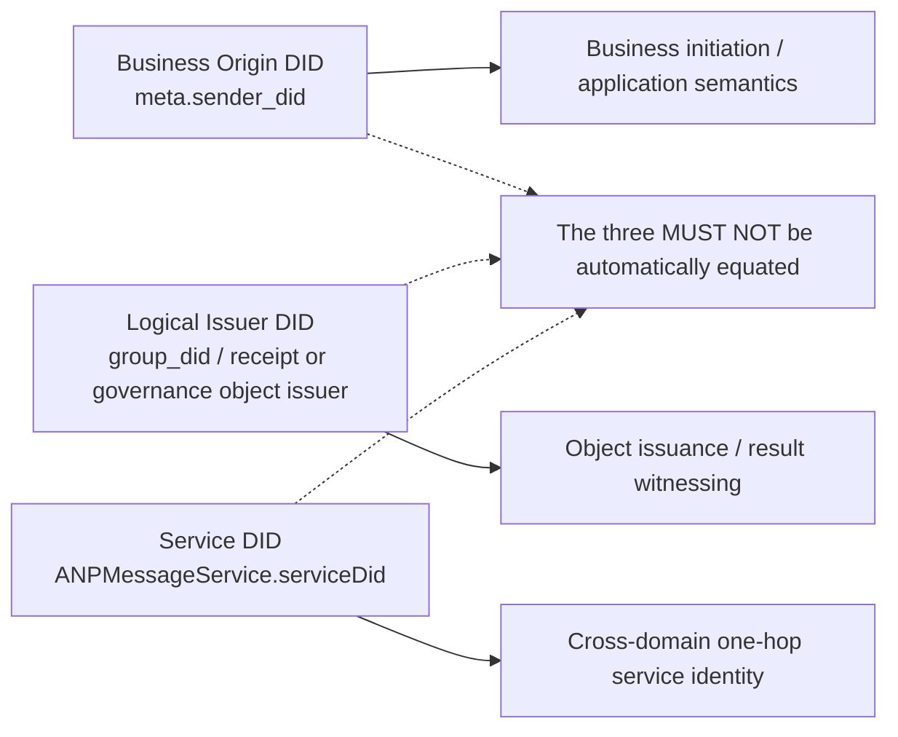
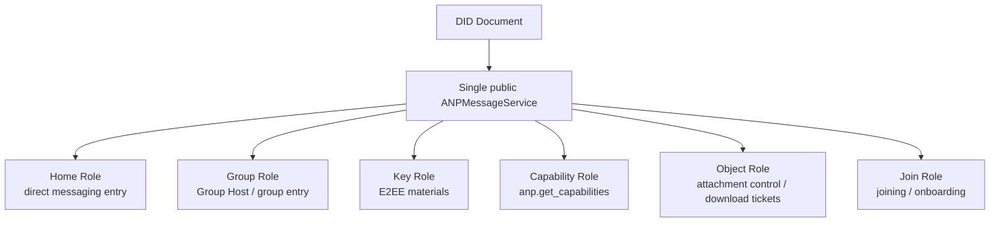
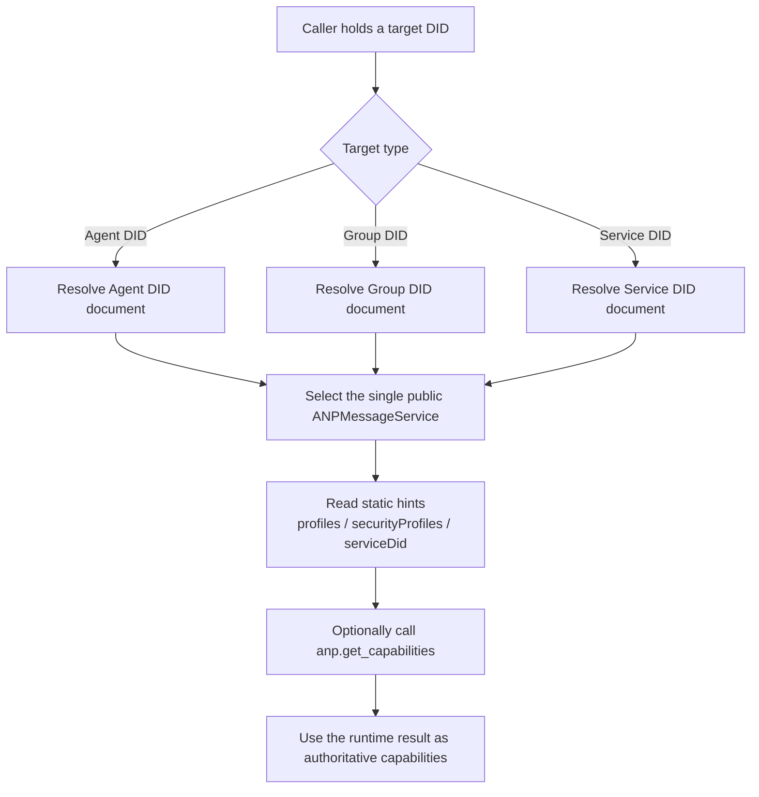

# ANP Profile 2: Identity and Discovery (Final Revision)

- Document ID: ANP-P2
- Title: Identity and Discovery
- Status: Draft
- Version: 0.2.0 (Final Revision)
- Language: English
- Applicability: This Profile applies to Agent identity, Group identity, service discovery and service endpoint interpretation in ANP.

---

## 1. Purpose

This Profile defines the identification model and discovery model of ANP, stipulating:

1. How to use DID to represent Agent and Group;
2. Which attributes in the DID document have normative significance for ANP;
3. How to express ANP service endpoint in DID document;
4. How the caller discovers the interactive ANP service based on the DID document;
5. Which dynamic states must not be put into DID documents.

This Profile does not define:

- The DID method itself;
- DID parsing protocol itself;
- Equipment identification;
- Internal copy synchronization;
- Specific E2EE algorithm details;
- Specific group state machine details.

---

## 2. Terminology and Normative Conventions

### 2.1 Normative Keywords

In this article, **MUST**, **MUST NOT**, **REQUIRED**, **SHALL**, **SHALL NOT**, **SHOULD**, **SHOULD NOT**, **RECOMMENDED**, **NOT RECOMMENDED**, **MAY**, **OPTIONAL** are interpreted as normative requirements according to their capitalized form.

### 2.2 Terminology

- **Agent DID**: Represents the DID of an Agent protocol subject.
- **Group DID**: Represents the DID of a group agreement subject.
- **Controller**: An entity capable of updating DID documents or initiating controlled actions on behalf of DID.
- **ANPMessageService**: The unified ANP service entrance for DID documents to be exposed to the outside world.
- **Federated Service DID**: The service DID used by the deployer in cross-domain service-to-service HTTP authentication, typically asserted by `ANPMessageService.serviceDid`.
- **Discovery**: The process of parsing a DID document based on its DID document and selecting the appropriate service endpoint to complete subsequent interactions.

---

## 3. Identity model

### 3.1 Basic principles

ANP adopts the following first class designations:

- **Agent DID**
- **Group DID**

The ANP protocol layer does not define device DIDs, terminal DIDs, session DIDs, or replica DIDs.
If there are multiple running copies, multiple devices, and multiple executors within an implementation, these entities belong to the internal implementation issues of the Agent and do not belong to the ANP interoperability boundary.

### 3.2 Agent DID

Each Agent capable of sending or receiving messages as an ANP protocol subject MUST hold an `agent_did`.

`agent_did` is used for:

1. Identify the sender and receiver of the direct message;
2. Identify the initiator of the control operation;
3. service endpoint can be used for analysis;
4. Obtain public materials required for security overlay;
5. Establish authorization and audit context.

### 3.3 Group DID

Each group that can be discovered, referenced, managed, or group messages sent across domains **MUST** hold an `group_did`.

`group_did` is used for:

1. As the global application layer identifier of the group;
2. Serve as the anchor point for group discovery and governance;
3. As a common target identifier for group management and group messaging;
4. Serves as the discovery entrance of group service endpoint;
5. Serve as the binding object for subsequent group encryption profiles.

### 3.4 Separation of Cryptographic Identifiers

If a subsequent security overlay profile defines independent cryptographic internal identifiers, such as `crypto_group_id`, `session_id`, and `channel_id`, then:

- They **MAY** be not the same as `group_did` or `agent_did`;
- But the corresponding Profile **MUST** clearly stipulates how to cryptographically bind these internal identifiers to DID;
- This binding **MUST** be verifiable by the receiver.

### 3.5 ANP identity layering

To avoid mixing different levels of identities across documents, ANP distinguishes at least the following three types of DIDs:

1. **Business Origin DID**: Business initiator or business logic sending subject, such as `meta.sender_did` in the request;
2. **Logical Issuer DID**: The issuing subject that some notifications, receipt or governance objects logically represent, such as `group_did`;
3. **Service DID**: The service identity used when executing hop-level service-to-service invocation, that is, `ANPMessageService.serviceDid`.

The above three categories of identities:

- **MUST NOT** be automatically treated as the same subject;
- The corresponding Profile **MUST** clearly state who is responsible for signing, who is responsible for authorizing, and who is responsible for routing;
- In cross-domain scenarios, `serviceDid` **MUST NOT** replace the business-entity DID;
- `serviceDid` only indicates "which public service entrance is performing a one-hop service call", **MUST NOT** be directly used to participate in the determination of business roles such as `owner/admin/member` in the group.

---

One of the easiest mistakes in ANP is to conflate the business sender, the object issuer, and the one-hop service identity. The following diagram puts these three DID layers into one view so that subsequent Profiles can refer to them separately.



*Figure P2-1: ANP identity layering relationship (non-normative).*

When subsequent documents require signatures, authorization, or routing, they should explicitly state which DID layer they use instead of assuming that readers will treat the three subjects as the same entity.

## 4. ANP interpretation rules for DID documents

### 4.1 General rules

For the ANP, the DID document has the following responsibilities:

1. Provide a stable identity entrance;
2. Declare authentication relationships and trusted key materials;
3. Exposure service endpoint;
4. Provide clues to service discovery.

DID documents **MUST NOT** be treated as:

- Real-time message status database;
- Real-time storage of group members;
- Online status storage;
- High frequency key rotation log;
- Agent internal replica list.

### 4.2 Minimum requirements for DID documents

For DID documents used by ANP:

- `id` **MUST** exist;
- `service` **MUST** exist for DIDs that are actively discovered and interacted with;
- `service` **MAY** be omitted for DIDs used only for validation or reference;
- `authentication` **MUST** exist for a DID that would appear in the request as the business originator DID;
- If declarative signature objects are supported, `assertionMethod` **SHOULD** exist;
- If encryption Overlay is supported, `keyAgreement` **SHOULD** exist;
- `capabilityInvocation` is optional expansion capability, **MAY** exist, but is not part of v1 Minimum Interoperability Requirements.

### 4.3 DID document minimization principle

Information in the DID document **SHOULD** remain:

- Low frequency changes;
- low sensitivity;
- Low relevancy;
- Directly related to DID usage.

Any content that does not meet the above requirements is **SHOULD** moved to a controlled service endpoint provider rather than embedded directly into the DID document.

---

## 5. Agent DID specification

### 5.1 Agent DID document required semantics

An Agent DID document for ANP MUST express at least:

1. `id`
2. At least one `service` available for subsequent interactions

### 5.2 Authentication relationship

If the Agent DID will appear in `meta.sender_did` as the business initiator identity, or in the `keyid` verification link of any business proof that claims to use `anp-rfc9421-origin-proof-v1`, then the DID document **MUST** provide the `authentication` relationship.

If a request uses `auth.origin_proof`, the authenticator **MUST** check whether the authentication method pointed to by `keyid` is authorized by the `authentication` relationship for this DID document.

`authentication` **MAY** be omitted if the Agent DID is used only for passive reference, object ownership, or offline verification, and does not participate in ANP interactions as a request initiator.

If the Agent needs to assert on group management objects, declaration objects, and signature control objects, the DID document **SHOULD** provide the `assertionMethod` relationship.

### 5.3 Key negotiation relationship

If the Agent supports any E2EE Overlay, the DID document **SHOULD** provide the `keyAgreement` relationship.
Any verification method referenced by `keyAgreement` **MUST** be used only to represent public-key material for key agreement or for receiving confidential information.

### 5.4 Service Endpoints

Any Agent DID document that supports Direct Messaging, capability discovery, object-control operations, or any other ANP capability that requires active discovery **MUST** contain at least one `ANPMessageService`.

This unified service entry **MAY** also carry the following capabilities:

- Main entrance for direct messages;
- Negotiation of capabilities;
- Secure Overlay public material access;
- object control plane found with object download portal.

If the deployer internally splits these capabilities into multiple components, that split is an implementation detail; the DID document **SHOULD NOT** expose multiple independent ANP service types for each capability.

Publicly available attachments Control-Plane Methods **MUST** be still accessed through the unified `ANPMessageService` exposed in the DID document. Whether the deployer internally routes requests to independent Object Service, Key Service or Group Host subcomponents is an implementation detail and does not change the external standard service discovery model.

---

## 6. Group DID specification

### 6.1 Group DID document required semantics

A Group DID document for ANP MUST express at least:

1. `id`
2. `controller`
3. At least one group service endpoint (`ANPMessageService`)

### 6.2 Group control rights

`controller` can be a single DID or multiple DIDs.
If there are multiple controllers, the internal collaboration mechanism between them is not defined by this Profile, but:

- The legality of DID document updates **MUST** be guaranteed by the DID method;
- The caller **MUST** shall refer to the parsed DID document;
- Group governance Profile **MUST** further defines roles and authorization rules within the group.

### 6.3 Group governance verification relationship

For Group DID documents that support `anp.group.base.v1`:

- `assertionMethod` **MUST** exist;
- `capabilityInvocation` **MAY** exist as an additional governance capability delegation relationship, but does not replace `assertionMethod`.

When group-management objects, group-policy objects, and group-state objects require signatures, the verifier **MUST** use a verification relationship permitted by the DID document.

### 6.4 Group DID document prohibited content

The following MUST NOT be embedded directly into the Group DID document:

- Dynamic member list;
- Online member list;
- Current message sequence number;
- Current group epoch;
- message-by-message status;
- One-time pre-key list;
- MLS KeyPackage real-time collection;
- Highly changing invitation/group governance queue;
- Agent internal replica list.

### 6.5 Group DID document optional content

The following **MAY** exist, but sensitive disclosure must be avoided:

- Group display name;
- Group icon reference;
- Group public description;
- Summary of group public policy;
- Document version information;
- Summary of service capabilities.

If an optional field may pose a significant privacy leak or relevance risk, the implementation **SHOULD NOT** write it into the DID document and should instead provide it with restricted service endpoint.

---

## 7. ANP Service Endpoint Types

### 7.1 General

ANP does service discovery based on `service` in the DID document.
All ANP service endpoint objects **MUST** have:

- `id`
- `type`
- `serviceEndpoint`

The service endpoint object **MAY** carry a small number of static hints, but v1 standard interoperability only requires:

- `profiles`
- `securityProfiles`
- `serviceDid`

In the current version, the DID document **SHOULD** expose only one standard ANP service type: `ANPMessageService`.
If an implementer internally splits direct messaging, groups, keys, objects, or cross-domain forwarding capabilities into multiple components, this splitting is an implementation detail and not separate standards `service type` in the DID document.

To reduce service-selection ambiguity in cross-domain calls, each DID document **MUST** expose only one `ANPMessageService` that may be called across domains.
If there are multiple service components within the implementation, they **MUST** be converged under the same externally exposed cross-domain `ANPMessageService`.

### 7.2 `ANPMessageService`

#### 7.2.1 Semantics

`ANPMessageService` represents the Unified Messaging and Interaction entry discovered publicly by ANP in the DID document.

#### 7.2.2 Purpose

-Receive `direct.send`
- Receive `group.get_info`, `group.send`, `group.e2ee.send` and group management/group E2EE related actions
- Provide `anp.get_capabilities`
- Provide access to public materials required by Direct/Group E2EE
- Bearer reception or distribution of `group.e2ee.notice` (if deployment supports group E2EE)
- Provide `attachment.create_slot`, `attachment.commit_object`, `attachment.abort_object`, `attachment.get_download_ticket`
- Service anchor discovered as object HTTP(S) download portal (if supported by deployment)

Externally exposed attachment Control-Plane Methods **MUST** be still entered through the unified `ANPMessageService` exposed by this DID. Whether the deployer internally routes requests to independent Object Service, Key Service or Group Host subcomponents is an implementation detail and does not change the external standard service discovery model.

#### 7.2.3 Requirements

- An Agent DID document that can be actively discovered and interacted with **MUST** contain at least one `ANPMessageService`
- A Group DID document **MUST** contain at least one `ANPMessageService`
- If this `ANPMessageService` will participate in cross-domain service-to-service invocation, its service entry **MUST** declare `serviceDid`
- If there are multiple components within the implementation, the DID document **MUST** only exposes a unified entry and returns finer-grained capability boundaries through runtime capability negotiation.
- Externally exposed service-scoped methods, including key material methods and attachments Control-Plane Methods, **MUST** use the `serviceDid` of the unified entrance as the target service identity anchor, unless the corresponding Profile is explicitly declared as endpoint-local

To reduce cross-domain service-selection ambiguity, v1 encourages exposing only one unified `ANPMessageService` to the outside. The following diagram places that unified entry together with common internal logical roles, helping readers distinguish between a public service type and implementation-internal division of labor.



*Figure P2-2: Relationship between unified ANPMessageService and internal roles (non-normative).*

The roles in this diagram are only an illustration of internal capability boundaries. They do not define new DID `service type` values and should not replace standardized service-discovery fields.


### 7.3 Logical role of `ANPMessageService`

This section is only used for **non-normative explanation** of the common capability boundaries behind unified entry; they are not independent standard service types in DID documents, nor are they service selection fields in v1.

#### 7.3.1 Home Role

Home Role represents the main entry capability on the Agent side, which is used to receive `direct.send`, return capability information and indicate further interaction paths.

#### 7.3.2 Key Role

Key Role represents the ability to publish or discover public materials required by the security overlay, and is used for:

- Discover required disclosure materials for direct messaging E2EE
- Introductory materials needed to discover the group E2EE
- Discover public objects defined by subsequent security profiles

#### 7.3.3 Group Role

Group Role represents the main entrance or Host capability of the group and is used for:

- Process group management actions after `group.create`
- Receive `group.send` and `group.e2ee.send`
- Exposing group policies, group E2EE capabilities or related control entrances
- Serves as the authoritative entry point for ordering group-state changes

#### 7.3.4 Join Role

Join Role represents the ability to join the entry related to invitations.

#### 7.3.5 Capability Role

Capability Role represents the capability negotiation entry capability.

#### 7.3.6 Object Role

Object Role represents the capabilities of object uploading, object access control, Download Ticket issuance, and object download portal discovery.

#### 7.3.7 Cross-Domain forwarding function

The deployer **MAY** implement the cross-domain forwarding or domain gateway function behind `ANPMessageService`, but the current version **does not** define an independent DID service type for this function.

If the deployer enables cross-domain service-to-service invocation, when the domain gateway or domain service performs outer HTTP authentication, **SHOULD** use the federated service DID reserved by the domain name owner instead of the ordinary Agent DID or Group DID. The corresponding rules are defined by P8.

#### 7.3.8 Transparent directory and audit index

If the deployer supports directory transparency, transparent logs or audit indexes, **MAY** provide them as extension capabilities of `ANPMessageService`; the current version does not define a separate independent DID service type.

---

## 8. ANP Service Endpoint Extension Fields

In order to facilitate cross-implementation discovery, this Profile only uses a few fields as v1 static hints; the remaining capability information **SHOULD** sink to `anp.get_capabilities`.

### 8.1 `profiles`

- Type: string array
- Semantics: ANP Profile collection directly supported by service endpoint
- Requirements: **SHOULD**
- Note: This field only expresses static, cacheable coarse-grained hints and does not replace runtime capability negotiation.

### 8.2 `securityProfiles`

- Type: string array
- Semantics: service endpoint supported security profile collection
- Requirements: **SHOULD**
- Description: This field indicates the set of security profiles supported at the endpoint level. It does not guarantee that every method is available under every advertised security profile.

### 8.3 `acceptedContentTypes`

- Type: string array
- Semantics: Set of acceptable message content types for the service endpoint
- Requirements: **Not a standard v1 DID hint**
- Description:
  - If you need to expose such information, **SHOULD** return through `anp.get_capabilities`;
  - If this field appears in a DID document, the recipient **MAY** treat it as an implementation extension.

### 8.4 `acceptedObjectTypes`

- Type: string array
- Semantics: Set of acceptable control-plane object types for the service endpoint
- Requirements: **Not a standard v1 DID hint**
- Description: This information is RECOMMENDED as a runtime capability rather than a static DID-document hint.

### 8.5 `priority`

- Type: Integer
- Semantics: endpoint priority
- Requirements: **Not a standard v1 DID hint**
- Description:
  - The v1 specification does not rely on `priority` in the DID document for service selection;
  - If the deployment customizes this field, it should be treated as a private extension.

### 8.6 `authSchemes`

- Type: string array
- Semantics: caller → service caller authentication method supported by this endpoint
- Requirements: **Not a standard v1 DID hint**
- Description:
  - This capability typically changes with the runtime gateway configuration;
  - More suitable for exposure via `anp.get_capabilities`;
  - It also does **not** describe the proof bearer format for business layer `anp-rfc9421-origin-proof-v1`.

### 8.7 `serviceDid`

- Type: string
- Semantics: The `ANPMessageService` DID used in cross-domain service-to-service HTTP authentication
- Requirement: **MUST** if this endpoint participates in cross-domain service-to-service invocation

Rules:

1. `serviceDid` **MUST** be a DID string, not a DID URL;
2. `keyid` **MUST** of the outer HTTP Message Signatures points to a verification method authorized by the `authentication` relationship in the `serviceDid` document;
3. For the deployment of `did:web` and `did:wba`, `serviceDid` **SHOULD** preferentially uses the bare-domain DID;
4. `serviceDid` expresses "which service identity is performing the cross-domain call", not the business subject identity expressed by `meta.sender_did`;
5. The specific runtime verification process of `serviceDid` is defined by P8;
6. `serviceDid` in the DID document is a discovery hint, and true trust establishment is subject to successful P8 runtime verification;
7. For the service-scoped method, the caller **SHOULD** bind `meta.target.did` to the target public `ANPMessageService.serviceDid`; object control plane, key material method and group joining material method all follow this principle, unless the specific Profile is explicitly declared as endpoint-local.

---

## 9. Discovery process

The following sections describe the discovery details for Agent, Group, and `serviceDid`. The diagram below first gives a unified overview, showing that all three paths ultimately converge on the public `ANPMessageService` and runtime capability negotiation.



*Figure P2-3: Unified discovery flow for Agent / Group / Service (non-normative).*

When reading Sections 9.1, 9.2, and 9.3 below, treat them as concrete applications of this unified discovery diagram to three target types, not as three independent discovery philosophies.

### 9.1 Agent discovery

The discovery process for `agent_did` is as follows:

1. Parse `agent_did` and obtain the DID document;
2. Read the `service` list;
3. Select the only cross-domain `ANPMessageService`;
4. If cross-domain service-to-service invocation will be used later, read the `serviceDid` declared in the selected service entry;
5. Combine `profiles`, `securityProfiles`, runtime capability negotiation results and local policies to determine the specific capabilities available on the unified portal;
6. For explicit negotiation capabilities, call `anp.get_capabilities` on the same entry.

### 9.2 Group Discovery

The discovery process for `group_did` is as follows:

1. Parse `group_did` and obtain the DID document;
2. Read the unique `ANPMessageService`;
3. If cross-domain service-to-service invocation will be used later, read the `serviceDid` declared in the selected service entry;
4. Combine `profiles`, `securityProfiles`, runtime capability negotiation results and local policies to determine the group management, group messaging, joining or group E2EE related capabilities available on the unified portal;
5. If group E2EE is enabled, the group-side public materials, cryptographic result delivery capabilities and related control actions bound to the group encryption profile will be discovered through the same entrance; materials added by members will still be discovered through the unified entrance corresponding to the Agent DID.

### 9.3 Service DID discovery

When the target `serviceDid` of a service-scoped method is known to the caller, the discovery process is as follows:

1. Parse the DID document corresponding to `serviceDid`;
2. Select the `ANPMessageService` corresponding to the `serviceDid`;
3. Read its `serviceEndpoint` and static hint;
4. For precise capability boundaries, call `anp.get_capabilities` on the same entry;
5. This `serviceDid` can be regarded as a trusted cross-domain service identity only after passing the runtime service identity binding verification specified in P8.

For attachment Download Ticket retrieval, the caller **MUST** use the original message sender DID carrying the attachment list as the discovery anchor and resolves its public `ANPMessageService`; in a group scenario, the DID is taken from the original group message sender, not `group_did`. The caller **MUST NOT** use only the URL domain name of `object_uri` to push back the control plane service.


### 9.4 Service selection

If there are multiple candidate endpoints, the caller **MUST** first selects in the following order:

1. First filter by the requested `profile`;
2. Then filter by the requested `security_profile`;
3. Then use the runtime capability negotiation results as authoritative verification;
4. If there are still multiple results, select according to the local policy.

The v1 specification does not rely on `supportedMethods`, `logicalRoles` or `priority` in the DID document for standard service selection.

### 9.5 Caching

The caller **MAY** cache the DID parsing results and service selection results.
But **SHOULD** be re-parsed in the following situations:

- Signature verification failed;
- Key negotiation failed;
- service endpoint returns ability changes;
- Suspected change of DID control;
- `serviceDid` verification failed;
- endpoint-origin binding failed;
- Static hint conflicts with runtime capability results;
- Local cache expires.

---

## 10. The relationship between DID documents and security overlay

### 10.1 Use of `keyAgreement`

If an Agent DID or Group DID document declares `keyAgreement`, subsequent security profiles **MUST** only use the methods allowed therein as the basis for receiving confidential information or key negotiation for that DID.

### 10.2 Signature verification relationship

When an object is claimed to be asserted by a DID:

Among them, for requests using `auth.origin_proof`, the verifier **MUST** treat this as an authentication control action and checks `authentication`.

- If the object is an authentication control action, the verifier **SHOULD** check `authentication`;
- If the object is a declaration or a signature assertion behavior, the verifier **SHOULD** check `assertionMethod`;
- If the object is a governance capability invocation action, the verifier **MAY** check for `capabilityInvocation`, but this is not v1 Minimum Interoperability Requirements.

### 10.3 Dynamic security material external placement

The following **SHOULD** be provided via controlled service endpoint and is not embedded in the DID document:

- High-frequency rotation of public materials;
- Disposable guidance materials;
- Group epoch related materials;
- Dynamic group-state summaries.

---

## 11. Group DID and group governance

### 11.1 Role of Group DID

`group_did` is the application layer global identifier of the group and is not equal to any specific cryptography implementation internal ID.

### 11.2 Externalized Group Governance

Group membership, role authorization, invitation status, member status, policy versions, group-state summaries, and similar objects **SHOULD** be expressed through:

- `ANPMessageService` corresponding to the group
- Or future group governance Profile

Provided with a signature rather than in a DID document.

### 11.3 Separation of Control and Group Policy

`controller` in a DID document only indicates who has control over the DID document itself;
"Who may add members, remove members, or change policies" within the group is an application-layer governance rule set and should not be derived mechanically from `controller`.
In the same way, `serviceDid` only represents the service calling identity and should not be directly interpreted as a business role subject such as `owner/admin/member` in the group.

---

## 12. Privacy and Minimum Disclosure

### 12.1 Service Endpoint Minimization

The `service` section in the DID document **SHOULD** be minimized.
If a service is not required for public discovery, it **SHOULD NOT** appear in the DID document.

### 12.2 Relevance control

Implementers **SHOULD** avoid:

- Reusing unique endpoint patterns in multiple DID documents creates strong correlations;
- Place descriptions in the DID document that can directly infer the organizational structure, deployment topology, and internal role distribution;
- Expose message volume, activity, online status or internal replica structure through DID documents.

### 12.3 Separation of public and restricted

Information necessary for public discovery **MAY** be placed into the DID document;
Information requiring access control **SHOULD** returned by restricted service endpoint.

---

## 13. Minimum Interoperability Requirements

An implementation conforming to this Profile MUST at least:

1. Each Agent has `agent_did`;
2. Each Group has `group_did`;
3. The Agent DID and Group DID documents must provide at least one `ANPMessageService`;
4. Support the execution of service discovery based on DID documents;
5. Static hint supports at least `profiles`, `securityProfiles`, and `serviceDid`;
6. Runtime capabilities are authoritative with `anp.get_capabilities`;
7. Do not embed dynamic group state in DID documents;
8. Do not introduce the device/replica concept into the protocol layer.

---

## 14. Example

### 14.1 Agent DID document fragment example

```json
{
  "id": "did:example:agent-a",
  "verificationMethod": [
    {
      "id": "did:example:agent-a#sig-1",
      "type": "JsonWebKey2020",
      "controller": "did:example:agent-a",
      "publicKeyJwk": {
        "kty": "OKP",
        "crv": "Ed25519",
        "x": "..."
      }
    },
    {
      "id": "did:example:agent-a#ka-1",
      "type": "JsonWebKey2020",
      "controller": "did:example:agent-a",
      "publicKeyJwk": {
        "kty": "OKP",
        "crv": "X25519",
        "x": "..."
      }
    }
  ],
  "authentication": [
    "did:example:agent-a#sig-1"
  ],
  "assertionMethod": [
    "did:example:agent-a#sig-1"
  ],
  "keyAgreement": [
    "did:example:agent-a#ka-1"
  ],
  "service": [
    {
      "id": "did:example:agent-a#message",
      "type": "ANPMessageService",
      "serviceEndpoint": "https://agent-a.example.com/anp",
      "serviceDid": "did:example:domain-a",
      "profiles": [
        "anp.core.binding.v1",
        "anp.direct.base.v1",
        "anp.direct.e2ee.v1",
        "anp.attachment.v1"
      ],
      "securityProfiles": [
        "transport-protected",
        "direct-e2ee"
      ]
    }
  ]
}
```

### 14.2 Group DID document fragment example

```json
{
  "id": "did:example:group-123",
  "controller": [
    "did:example:group-host",
    "did:example:group-admin-controller"
  ],
  "verificationMethod": [
    {
      "id": "did:example:group-123#gov-1",
      "type": "JsonWebKey2020",
      "controller": "did:example:group-123",
      "publicKeyJwk": {
        "kty": "OKP",
        "crv": "Ed25519",
        "x": "..."
      }
    }
  ],
  "assertionMethod": [
    "did:example:group-123#gov-1"
  ],
  "service": [
    {
      "id": "did:example:group-123#message",
      "type": "ANPMessageService",
      "serviceEndpoint": "https://group-host.example.com/anp/groups/group-123",
      "serviceDid": "did:example:group-host-domain",
      "profiles": [
        "anp.core.binding.v1",
        "anp.group.base.v1",
        "anp.group.e2ee.v1"
      ],
      "securityProfiles": [
        "transport-protected",
        "group-e2ee"
      ]
    }
  ]
}
```

---

## 15. Registry Placeholder

Subsequent versions of this standard **SHOULD** establish the following registry:

1. ANP DID Service Type registry;
2. ANP service endpoint extended field registration form;
3. ANP identity discovery error code registry;
4. ANP group governance object type registry.

---

## 16. Reference Implementation Notes (Non-Normative)

Implementers should adopt the following principles when implementing this Profile:

- The DID document is a "stable entry", not a "real-time status table";
- service endpoint is "discovery anchor point", not "all data containers";
- Dynamic capabilities should be returned through `anp.get_capabilities` as much as possible instead of being piled in the DID document;
- Group DID is an "application layer group identifier", not a "unique serialization of all cryptographic internal states";
- Concepts such as devices, replicas, and internal executors remain inside the Agent and do not enter the wire protocol.
