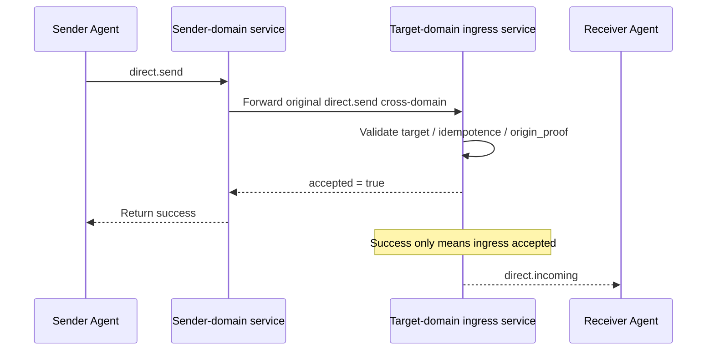

# ANP Profile 3: Direct Messaging Base Semantics (Final Revision)

- Document ID: ANP-P3
- Title: Direct Messaging Base Semantics
- Status: Draft
- Version: 0.2.1 (Final Revision)
- Language: English
- Applicability: This Profile applies to the basic direct messaging semantics between Agents and does not include the end-to-end encryption algorithm itself.

---

## 1. Purpose

This Profile defines the Direct Messaging Base Semantics layer of ANP, stipulating:

1. How to express agent-to-agent direct messages;
2. Minimum interoperable fields and content model of direct messaging message;
3. Success Semantics, idempotent semantics and ordering semantics of direct messaging message;
4. How to run the direct messaging message independently in non-E2EE mode;
5. How to express sender identity authentication based on did:wba and cross-domain origin proof;
6. How Direct E2EE Profile is superimposed on the business semantics of this Profile.

This Profile does not define:

- Specific E2EE algorithm;
- Device or internal copy concept;
- History pull;
- Read status;
- presence;
- Agent internal synchronization;
- Large object ciphertext format.

---

## 2. Terminology and Normative Conventions

### 2.1 Normative Keywords

In this article, **MUST**, **MUST NOT**, **REQUIRED**, **SHALL**, **SHALL NOT**, **SHOULD**, **SHOULD NOT**, **RECOMMENDED**, **NOT RECOMMENDED**, **MAY**, **OPTIONAL** are interpreted as normative requirements according to their capitalized form.

### 2.2 Terminology

- **Direct Message**: An application layer message sent from one Agent to another Agent.
- **Sender Agent**: The Agent that initiated `direct.send`, identified by outer `params.meta.sender_did`.
- **Recipient Agent**: The target Agent of `direct.send`, identified by the outer `params.meta.target.did`.
- **Ingress Service**: The main entrance service exposed by the target Agent to the outside world, used to receive direct messages.
- **Conversation**: Application layer conversation context between sender and receiver; whether stable `conversation_id` exists is determined by the business layer.
- **Accepted**: The message has been accepted by the target Agent's entry service and entered its processing boundary.
- **Rejected**: The message was rejected at the protocol layer and did not enter the processing boundary of the target Agent.
- **Origin Proof**: Application layer origin proof generated by the sender Agent based on did:wba JSON bearer authentication.
- **Hop Authentication**: Transport layer/request layer identity authentication between a certain hop service to service and Agent to service.
- **Logical Target URI**: To enable application layer signatures to remain stable across relays, a logical target URI defined globally by P1 Appendix A.

---

## 3. Design Principles

### 3.1 Agent is the end point of the protocol

The protocol endpoint of ANP Direct Messaging is the Agent, not the device, terminal, session replica, or internal execution unit.

As long as the target Agent's portal service accepts the message, the delivery mission of this Profile will be completed. How the target Agent internally synchronizes to how many replicas, how many executors, or how many devices, does not fall within the interoperability scope of this Profile.

### 3.2 Separation of Base semantics and Security Overlay

This Profile only defines business semantics and message semantics; if Direct E2EE Profile is subsequently added, then:

- The business action is still `direct.send`;
- direct messaging object is still `sender_did -> recipient_did`;
- Content types and application semantics are still defined by this Profile;
- Additional cryptographic objects, session state and security bindings are defined by the E2EE Profile.

### 3.3 Minimum Success Semantics

In this Profile, a successful `direct.send` only means:

- The target Agent's portal service has accepted the message;
- The message has entered the protocol processing boundary of the target Agent.

It does not mean that the target Agent has processed application payload, has been presented to the user, or has completed internal persistence.

The "minimum success semantics" of P3 can easily be misunderstood as "the peer has already read the message". The following sequence diagram places the sender, the outbound-domain service, the target ingress service, and the target Agent on the same path, making the success boundary explicit.



*Figure P3-1: End-to-end sequence of `direct.send` (non-normative).*

Therefore, success in this Profile only answers whether the target Agent's ingress service accepted the message. It does not answer whether the user has read it, whether it has been displayed, or whether persistence has completed inside the peer.

### 3.4 Non-Goals

This Profile does not attempt to provide:

- End-to-end confidentiality;
- Multi-device consistency;
- Global strict order;
- History replayable semantics;
- Device-level proof of delivery.

### 3.5 Separation of origin proof and hop authentication

In a cross-domain scenario, `direct.send` may involve at least two types of authentication:

1. **origin proof (Origin Proof)**: generated by the private key corresponding to `sender_did`, proving that "this business message was sent by the sender Agent";
2. **hop authentication (Hop Authentication)**: Generated by the one-hop caller of the current connection, proving "which service or agent submitted this network request to the next hop."

This Profile requires:

- `direct.send`'s business origin proof **MUST** remain stable across forwarding chains;
- Service level authentication **MAY** change for any hop;
- The recipient **MUST NOT** presume the identity of the business originator of `meta.sender_did` based solely on the identity of the upstream service.

---

## 4. Profile identification and dependencies

### 4.1 Profile name

The standard name of this Profile is:

`anp.direct.base.v1`

### 4.2 Dependencies

This Profile **MUST** depend on the following Profiles:

- `anp.core.binding.v1`
- `anp.identity.discovery.v1`

### 4.3 Security Profile

When this Profile is used as the basic direct messaging Profile running independently:

- `meta.profile` **MUST** equal `anp.direct.base.v1`
- `meta.security_profile` **MUST** equal `transport-protected`

If a subsequent Direct E2EE Overlay reuses the business actions and application semantics of this Profile, then:

- Corresponding Overlay **MUST** clearly explains how to overlay security objects on top of `direct.send` semantics;
- Receiver **MUST NOT** silently downgrade from high security profile to `transport-protected` without explicit negotiation;
- When `meta.profile = "anp.direct.e2ee.v1"`, the mandatory requirements for `auth.origin_proof` in this Profile are overridden by the Direct E2EE Profile;
- This coverage is deliberately designed: `direct-e2ee` gives priority to retaining stronger deniability. The sender identity authentication is mainly undertaken by the E2EE session establishment material, session binding and message AAD, and is no longer required to use P3's application layer `origin_proof` by default.

---

## 5. Direct addressing and session model

### 5.1 Target type

For `direct.send`, `meta.target.kind` **MUST** be `"agent"`.
`meta.target.did` **MUST** be a parsable `agent_did`.

If `target.kind` is not `"agent"`, the receiver **MUST** return `anp.invalid_target_binding`.

### 5.2 Sender and Receiver

Once `direct.send`:

- There **MUST** be only one sender Agent;
- There **MUST** be only one receiver Agent;
- **MUST NOT** broadcast directly to multiple target Agents.

### 5.3 `conversation_id`

This Profile **MAY** use `conversation_id` to represent the application layer context between the sender and receiver.

If `conversation_id` exists:

- it **MUST** be a string;
- it **MUST NOT** be interpreted as a device, session replica, or internal executor ID;
- It **MAY** be generated by the sender, or determined by the business logic negotiation of both parties;
- It **MUST NOT** act as a unique security context or anti-replay identifier.

### 5.4 Agent internal implementation is invisible

The following internal details of the receiver **MUST NOT** be exposed as wire protocol interoperability semantics:

- Number of internal queues;
- Number of internal copies;
- Number of internal workflow nodes;
- Number of internal devices;
- Internal forwarding path.

---

## 6. Content Model

### 6.1 Content Type

`meta.content_type` **MUST** for `direct.send` exists.

In Direct Base, `body` is a structured hosting container; `meta.content_type` represents the content type of the main business payload in the container, not the type of the JSON container object itself. This section follows P1’s unified definition of `meta.content_type`.

This Profile minimum interoperability **MUST** support the following content types:

- `text/plain`
- `application/json`
- `application/anp-attachment-manifest+json`

Implementers **MAY** support more content types, but **MUST** return `anp.unsupported_content_type` for unsupported content types.

### 6.2 `body` structure

`direct.send` of `body` **MUST** be an object and can contain the following fields:

#### 6.2.1 `conversation_id`

- Type: string
- Requirements: **MAY**
- Semantics: Application layer session context identification
- Note: This is a display and merge prompt field and does not belong to the minimum interoperability strong constraint.

#### 6.2.2 `reply_to_message_id`

- Type: string
- Requirements: **MAY**
- Semantics: Indicates the previous message to which this message replies

#### 6.2.3 `annotations`

- Type: Object
- Requirements: **MAY**
- Semantics: application layer additional metadata customized by the sender
- Rules:
  - Relay service **MUST NOT** unauthorized modification;
  - Unrecognized field **MAY** be ignored by the receiver;
  - It should not be used to covertly carry hidden control semantics that would alter authorization, security decisions, or routing decisions.

#### 6.2.4 `text`

- Type: string
- Requirement: **MUST** when `content_type = "text/plain"`
- Rule: When using `text`, `payload` and `payload_b64u` **MUST NOT** occur simultaneously.

#### 6.2.5 `payload`

- Type: JSON object
- Requirement: **MUST** when `content_type = "application/json"`
- Rules: `payload` **MUST** directly represent the application object; **MUST NOT** use dual serialization of "JSON string embedded in JSON". This Profile does not define the business meaning of fields inside the JSON object.

#### 6.2.6 `payload_b64u`

- Type: string
- Requirement: When the content is a binary extension or a private extension object **MAY**
- Rules:
  - Must be no padding base64url;
  - When using `payload_b64u`, `text` and `payload` **MUST NOT** appear simultaneously.

### 6.3 Payload Field Mutual Exclusion Rules

Among `direct.send`, `text`, `payload` and `payload_b64u`:

- Exactly one of these fields **MUST** be present;
- If more than one appears, the recipient **MUST** reject the request;
- If none of the three are present, the receiving party **MUST** reject the request.


### 6.4 `auth` object

When `meta.profile = "anp.direct.base.v1"` and `meta.security_profile = "transport-protected"`, `direct.send`'s `params` **MUST** contain the `auth` object.

The proof bearer rules, Signed Request Object and signature component mapping in this section **MUST** reuse the unified definition in P1 Appendix A; P3 **no longer** defines independent proof field names, independent Signed Payload structures or local `@target-uri` mappings.

The recommended structure is as follows:

```json
{
  "auth": {
    "scheme": "anp-rfc9421-origin-proof-v1",
    "origin_proof": {
      "contentDigest": "sha-256=:BASE64_SHA256_DIGEST:",
      "signatureInput": "sig1=(\"@method\" \"@target-uri\" \"content-digest\");created=1733402096;expires=1733402156;nonce=\"abc123\";keyid=\"did:wba:example.com:user:alice:e1_<fingerprint>#key-1\"",
      "signature": "sig1=:BASE64_SIGNATURE:"
    }
  }
}
```

Rules:

- `auth.scheme` **MUST** equal `anp-rfc9421-origin-proof-v1`
- `auth.origin_proof` **MUST** exist
- `auth` itself **MUST NOT** participate in the calculation of `contentDigest`

### 6.5 Binding to the Shared Signed Request Object

`auth.origin_proof.contentDigest` **MUST** bind the shared **Signed Request Object** defined in P1 Appendix A.

For `direct.send`:

- `method` **MUST** equal `direct.send`
- `meta.target.kind` **MUST** equal `agent`
- `meta.target.did` **MUST** equal the target recipient Agent DID
- `meta.message_id` and `meta.content_type` **MUST** exist

### 6.6 Reference to the Global Component Mapping

`direct.send` **MUST** use the global signature component mapping defined in P1 Appendix A.

Therefore:

- The verifier **MUST** rebuild `@method` from `method = "direct.send"`
- The verifier **MUST** reconstruct `@target-uri = anp://agent/<pct-encoded meta.target.did>` from `meta.target.kind = "agent"` and `meta.target.did`
- The above results come from the global rules of P1, and are **not** a set of local mappings independently defined by P3

---

## 7. Standard method

### 7.1 `direct.send`

#### 7.1.1 Semantics

`direct.send` indicates that the sender Agent sends a direct message to the target Agent.

#### 7.1.2 Request Requirements

A compliant `direct.send` request **MUST** satisfy:

1. `method = "direct.send"`
2. `meta.profile = "anp.direct.base.v1"`
3. `meta.security_profile = "transport-protected"`
4. `meta.sender_did` **MUST** exist
5. `meta.target.kind = "agent"`
6. `meta.target.did` **MUST** exist
7. `meta.operation_id` **MUST** exist
8. `meta.message_id` **MUST** exist
9. `meta.content_type` **MUST** exist
10. `body` **MUST** meet the content mutual exclusion rules of this Profile
11. `auth.scheme` **MUST** equal `anp-rfc9421-origin-proof-v1`
12. `auth.origin_proof` **MUST** exist and binds Signed Request Object

#### 7.1.3 Successful Response

`result` **MUST** for Successful Response contains at least:

- `accepted`: Boolean, and **MUST** be `true`
- `message_id`: consistent with `meta.message_id` in the request
- `operation_id`: consistent with `meta.operation_id` in the request
- `target_did`: Target Agent DID
- `accepted_at`: RFC 3339 time string

A successful response **MAY** contain:

- `conversation_id`

#### 7.1.4 Failure conditions

The receiver **MUST** reject `direct.send` under the following circumstances:

- The target DID does not exist or is unreachable;
- The caller of one hop of the current connection has not passed the caller authentication of this hop;
- Content type not supported;
- The request body does not comply with the content mutual exclusion rules;
- The target policy prohibits this message;
- The request violates the requirements of security profile;
- `auth.origin_proof` is missing, invalid, expired or suspected to be replayed;
- The DID to which `keyid` belongs in `auth.origin_proof` is inconsistent with `meta.sender_did`.

### 7.2 `direct.incoming` (required Notification)

#### 7.2.1 Semantics

`direct.incoming` is the standard push Notification of this Profile, which is used by an ANP Endpoint to push a direct message to the target Agent that has been accepted by the target ingress. It belongs to the minimum interoperability capability of P3.

#### 7.2.2 Scope of use

- This method **MUST** be implemented;
- It is the standard push path, but does not change `direct.send`'s Success Semantics;
- An implementation that conforms to this Profile MUST be able to send, receive, or handle `direct.incoming`.

#### 7.2.3 Constraints

- `direct.incoming` **MUST** sent as Notification;
- The receiver **MUST NOT** return a JSON-RPC Response to it;
- `params.meta.profile` **MUST** equal `anp.direct.base.v1`;
- `params.meta.security_profile` **MUST** equal security profile when original `direct.send` is accepted;
- `params.meta.target.kind` **MUST** be `"agent"`;
- `params.meta.target.did` **MUST** be equal to the notification recipient DID;
- `params.meta.sender_did` **MUST** be equal to the logical sending subject DID of the original business message;
- `params.meta.operation_id` **MUST** equal original `direct.send.meta.operation_id`;
- `params.meta.message_id` **MUST** equal original `direct.send.meta.message_id`;
- `params.meta.content_type` **MUST** equal to `meta.content_type` of the original business message;
- `params.body` **MUST** carry the service payload consistent with the original message;
- If `params.auth` is present, then:
  - `params.auth.scheme` **MUST** equal `anp-rfc9421-origin-proof-v1`;
  - `params.auth.origin_proof` **MUST** be a lossless copy of the original `origin_proof`;
  - The intermediate service **MUST NOT** regenerate a new business proof.

---

## 8. Delivery, idempotence and ordering semantics

### 8.1 Acceptance semantics

Once `direct.send` returns successfully, it simply means:

- The target Agent's portal service has accepted the message;
- The sender MAY stop retries for the same `operation_id` unless local policy requires otherwise.

### 8.2 Idempotence and deduplication

The receiver **MUST** make an idempotent judgment based on the following minimum set:

- `sender_did`
- `target.did`
- `method`
- `operation_id`

For message-level duplication, the receiver **SHOULD** be further based on:

- `sender_did`
- `target.did`
- `message_id`

Perform duplicate identification.

### 8.3 Ordering Semantics

This Profile does not provide global strict ordering guarantees.

For direct messages:

- The implementation party **MAY** perform best-effort sequential processing within the same `conversation_id`;
- The cross-domain interoperability layer **MUST NOT** assume that the network or the service will naturally provide strict FIFO ordering.

### 8.4 Retry

For `direct.send`, when the sender retries the same message:

- `operation_id` **MUST** remain unchanged;
- `message_id` **MUST** remain unchanged;
- The business payload **MUST** remain semantically equivalent.

For `direct.incoming`, if the service chooses to push the same accepted message again:

- `params.meta.operation_id` **SHOULD** remain unchanged;
- `params.meta.message_id` **SHOULD** remain unchanged;
- `params.body` **SHOULD** remain semantically equivalent to the original notification.

For `direct.send` and `direct.incoming`, whether to resend automatically after a transmission failure **MAY** be determined by the service according to local policy; this profile **MUST NOT** require resending, a fixed retry count, or a fixed backoff algorithm.

---

For implementers, the fields of `direct.send` are often not the real source of mistakes; the hard part is deciding whether to check `operation_id` or `message_id` first during retries. The following diagram makes the minimum-interoperability decision order explicit.

```mermaid
flowchart TD
R1[Receive direct.send]
R1 --> K1{Does (sender_did,target.did,method,operation_id)<br/>already exist?}

K1 -->|No| P[Process normally]
P --> M1{Is message_id duplicated?}
M1 -->|No| S[Write idempotence record and return accepted]
M1 -->|Yes| D[Apply duplicate-message policy]

K1 -->|Yes| K2{Is the request semantically equivalent?}
K2 -->|Yes| E[Return the same or equivalent result]
K2 -->|No| C[anp.idempotency_conflict]
```

*Figure P3-2: Direct-message idempotence and retry decision (non-normative).*

Implementations should first hit operation-level idempotence and then handle message-level duplicate detection; otherwise, semantically equivalent requests may be incorrectly treated as conflicts during network retries or cross-domain replay-protection scenarios.

## 9. Security and Policy

### 9.1 Transmission protection requirements

This Profile, when run independently, **MUST** rely on a certified secure transport layer. Unprotected bare HTTP, bare WebSocket, or other unauthenticated channel **MUST NOT** used.

### 9.2 Sender identity authentication of `direct.send`

For any `direct.send` that declares `meta.sender_did` under `meta.profile = "anp.direct.base.v1"`:

- Sender **MUST** provide `auth.origin_proof`;
- Receiver portal service **MUST** validate `auth.origin_proof` according to did:wba specification;
- The receiver **MUST** verify that the DID to which `keyid` belongs in `auth.origin_proof` is consistent with `meta.sender_did`;
- The receiver **MUST** verify that the authentication method pointed to by `keyid` is authorized by the `authentication` relationship of the DID document;
- For a path-type `e1_` DID, the receiver **MUST** perform a full DID binding check and **MUST NOT** consider the DID valid simply because there is an available public key in `authentication`.

Minimum requirements for `e1_` DID include:

1. DID Document top-level `proof` **MUST** exist;
2. `proof` **MUST** pass the Data Integrity verification required by did:wba;
3. `proof.verificationMethod` **MUST** point to an Ed25519 binding key authorized by the document;
4. The receiver **MUST** use the public key corresponding to `proof.verificationMethod` to recalculate the RFC 7638 thumbprint;
5. The recalculation result **MUST** be completely consistent with the `e1_` fingerprint in the DID path.

In other words, the validity of `meta.sender_did` is not established if "any `authentication` key in the DID document can be verified", but is established if "the request proof, DID path fingerprint and bound public key are all consistent".

### 9.3 Verification steps for `origin_proof`

The receiver’s verification steps for `auth.origin_proof` refer to the unified definition in Appendix A of P1


### 9.4 Cross-Domain forwarding and upstream service authentication

In a cross-domain deployment:

- The original `auth.origin_proof` **MUST** be forwarded with the message, and **MUST NOT** be overridden by the intermediate service;
- The receiving target domain **MUST** directly verify `auth.origin_proof`;
- Implementations **MUST** additionally perform service-level identity authentication at each service hop;
- The upstream service **MAY** verify `auth.origin_proof` locally before forwarding, but successful local verification **MUST NOT** exempt the target domain from independently verifying it.

### 9.5 Access Token optimization (non-normative)

The access token process **MAY** based on did:wba is used to optimize repeated requests, but it does not belong to the minimum interoperability main line of this Profile.

For `direct.send`:

- An access token **MUST NOT** replace `auth.origin_proof` as the cross-domain origin proof;
- sender-constrained access token **SHOULD** take precedence over ordinary Bearer token;
- The specific profile, issuance format and constraint mechanism of the access token can be defined by higher-level deployment specifications or implementation documents.


### 9.6 Security Profile Upgrade and Downgrade

If an Agent's policy requires `direct-e2ee`:

- The sender **MUST** use the corresponding Direct E2EE Profile;
- The receiver **MUST** reject when it receives `direct.send` for `transport-protected`;
- Receiver **MUST NOT** silently accept weaker security profile without explicit negotiation.

### 9.7 Binding points with Overlay

Subsequent Direct E2EE Overlay **SHOULD** include at least the following fields into the authenticated context:

- `sender_did`
- `target.did`
- `message_id`
- `conversation_id` (if present)
- `content_type`
- `security_profile`
- `auth.origin_proof.contentDigest` or equivalent origin proof digest

---

## 10. Privacy Considerations

### 10.1 Minimum Metadata Principle

The sender **SHOULD** only sends the minimum metadata necessary to enable interoperability.

### 10.2 Do not expose internal topology

Any implementation **MUST NOT** exposed through this Profile:

- Number of internal equipment;
- Number of internal copies;
- Internal workflow topology;
- Internal delivery routes.

### 10.3 Relay minimum knowledge

The relay or ingress service **SHOULD** check only the minimum fields necessary for protocol interoperability;
If the application payload does not need to be understood by it, then **SHOULD** treat it as an opaque payload.

---

## 11. Profile specific errors (recommended)

On the premise of following the ANP Core public error model, this Profile recommends the following `anp_code`:

| `code` | `anp_code` | Meaning |
|---|---|---|
| 2000 | `direct.recipient_unreachable` | The target Agent is temporarily unreachable |
| 2001 | `direct.policy_violation` | The target policy rejected the message |
| 2002 | `direct.invalid_payload_shape` | direct messagingpayload Illegal structure |
| 2003 | `direct.conversation_conflict` | Session context conflict |
| 2004 | `direct.security_mode_required` | Higher goals security profile |
| 2005 | `direct.invalid_origin_proof` | Sender origin proof is invalid, expired or missing |
| 2006 | `direct.origin_did_mismatch` | The DIDs to which `meta.sender_did` and `keyid` belong are inconsistent |
| 2007 | `direct.origin_proof_replayed` | The sender origin proof is suspected to be replayed |

---

## 12. Minimum Interoperability Requirements

An implementation conforming to this Profile MUST support at least:

1. `direct.send`
2. `direct.incoming`
3. `target.kind = "agent"`
4. `text/plain`
5. `application/json`
6. `application/anp-attachment-manifest+json`
7. Mutual exclusion rules for `text` / `payload` / `payload_b64u`
8. Idempotent processing of `message_id` and `operation_id`
9. Submission and verification of `auth.origin_proof`
10. Signed Request Object normalization and summary calculation rules defined in this Profile
11. Operation mode based on secure transmission

`conversation_id`, `reply_to_message_id` and `annotations` are commonly used optional fields, but do not belong to the strong minimum interoperability constraints of v1.

---

## 13. Example

### 13.1 Text message example

```json
{
  "jsonrpc": "2.0",
  "id": "req-20001",
  "method": "direct.send",
  "params": {
    "meta": {
      "profile": "anp.direct.base.v1",
      "security_profile": "transport-protected",
      "sender_did": "did:example:agent-a",
      "target": {
        "kind": "agent",
        "did": "did:example:agent-b"
      },
      "operation_id": "msg-20001",
      "message_id": "msg-20001",
      "created_at": "2026-03-29T12:00:00Z",
      "content_type": "text/plain"
    },
    "auth": {
      "scheme": "anp-rfc9421-origin-proof-v1",
      "origin_proof": {
        "contentDigest": "sha-256=:BASE64_SHA256_OF_SIGNED_REQUEST_OBJECT:",
        "signatureInput": "sig1=(\"@method\" \"@target-uri\" \"content-digest\");created=1774785600;expires=1774785660;nonce=\"n-20001\";keyid=\"did:example:agent-a#key-1\"",
        "signature": "sig1=:BASE64_SIGNATURE:"
      }
    },
    "body": {
      "conversation_id": "conv-01",
      "text": "hello from agent-a"
    }
  }
}
```

### 13.2 Example of attachment list

```json
{
  "jsonrpc": "2.0",
  "id": "req-20002",
  "method": "direct.send",
  "params": {
    "meta": {
      "profile": "anp.direct.base.v1",
      "security_profile": "transport-protected",
      "sender_did": "did:example:agent-a",
      "target": {
        "kind": "agent",
        "did": "did:example:agent-b"
      },
      "operation_id": "msg-20002",
      "message_id": "msg-20002",
      "created_at": "2026-03-29T12:05:00Z",
      "content_type": "application/anp-attachment-manifest+json"
    },
    "auth": {
      "scheme": "anp-rfc9421-origin-proof-v1",
      "origin_proof": {
        "contentDigest": "sha-256=:BASE64_SHA256_OF_SIGNED_REQUEST_OBJECT:",
        "signatureInput": "sig1=(\"@method\" \"@target-uri\" \"content-digest\");created=1774785900;expires=1774785960;nonce=\"n-20002\";keyid=\"did:example:agent-a#key-1\"",
        "signature": "sig1=:BASE64_SIGNATURE:"
      }
    },
    "body": {
      "payload": {
        "attachments": [
          {
            "attachment_id": "att-001",
            "filename": "report.pdf",
            "mime_type": "application/pdf",
            "size": "1048576",
            "digest": {
              "alg": "sha-256",
              "value_b64u": "BASE64URL_DIGEST"
            },
            "access_info": {
              "object_uri": "https://objects.example.com/objects/obj-plain-001"
            },
            "encryption_info": {
              "mode": "none"
            }
          }
        ],
        "caption": "Please check the attachment"
      }
    }
  }
}
```

> Note: This attachment list example is consistent with P7 and no longer explicitly carries the control plane service DID in `access_info`. The receiver should parse its public `ANPMessageService` based on the original message sender's DID before downloading, and then call `attachment.get_download_ticket`.

### 13.3 Example of ordinary JSON payload

The following example only demonstrates the `application/json` carrier. The fields
inside `payload` are application-defined and are not specified by ANP.

```json
{
  "jsonrpc": "2.0",
  "id": "req-20003",
  "method": "direct.send",
  "params": {
    "meta": {
      "profile": "anp.direct.base.v1",
      "security_profile": "transport-protected",
      "sender_did": "did:example:agent-a",
      "target": {
        "kind": "agent",
        "did": "did:example:agent-b"
      },
      "operation_id": "msg-20003",
      "message_id": "msg-20003",
      "created_at": "2026-03-29T12:10:00Z",
      "content_type": "application/json"
    },
    "body": {
      "conversation_id": "conv-01",
      "payload": {
        "type": "example",
        "data": {
          "hello": "world"
        }
      }
    }
  }
}
```

### 13.4 `direct.send` example with did:wba origin proof

```json
{
  "jsonrpc": "2.0",
  "id": "req-direct-003",
  "method": "direct.send",
  "params": {
    "meta": {
      "profile": "anp.direct.base.v1",
      "security_profile": "transport-protected",
      "sender_did": "did:wba:a.example:agents:alice:e1_<fingerprint>",
      "target": {
        "kind": "agent",
        "did": "did:wba:b.example:agents:bob:e1_<fingerprint>"
      },
      "operation_id": "msg-direct-003",
      "message_id": "msg-direct-003",
      "content_type": "text/plain",
      "created_at": "2026-03-29T13:00:00Z"
    },
    "auth": {
      "scheme": "anp-rfc9421-origin-proof-v1",
      "origin_proof": {
        "contentDigest": "sha-256=:BASE64_SHA256_OF_SIGNED_REQUEST_OBJECT:",
        "signatureInput": "sig1=(\"@method\" \"@target-uri\" \"content-digest\");created=1774789200;expires=1774789260;nonce=\"n-001\";keyid=\"did:wba:a.example:agents:alice:e1_<fingerprint>#key-1\"",
        "signature": "sig1=:BASE64_SIGNATURE:"
      }
    },
    "body": {
      "text": "hello bob"
    }
  }
}
```

---

## 14. Registry Placeholder

Subsequent versions of this standard **SHOULD** establish the following registry:

1. Direct content type registry;
2. Direct error code registration form;
3. Direct Notification method registry.

---

## 15. Reference Implementation Notes (Non-Normative)

Implementers should adopt the following principles when implementing this Profile:

- `direct.send` only answers "whether the target Agent accepts it" and does not answer "whether the end user reads it";
- `direct.incoming` is a standard push path, but whether to automatically resend after a failure is up to the implementation to decide;
- `annotations` and `conversation_id` are application convenience fields and should not be overly burdened with security or routing semantics;
- The sender's origin proof must be layered with hop-level service authentication;
- To simplify implementation, message class operations can usually use `operation_id = message_id` directly.
