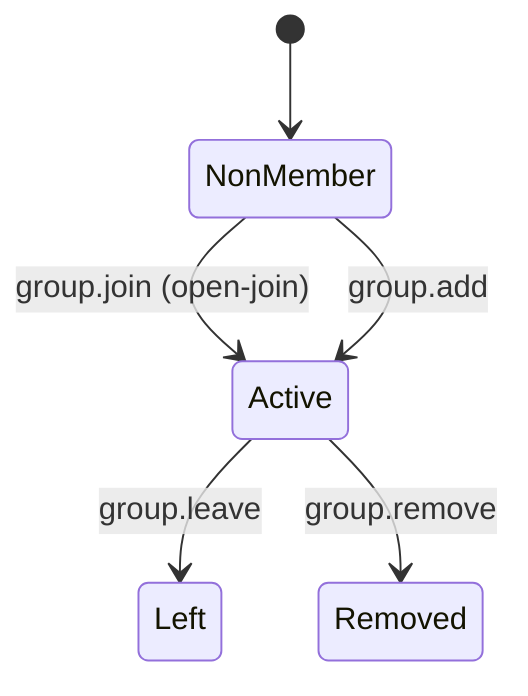
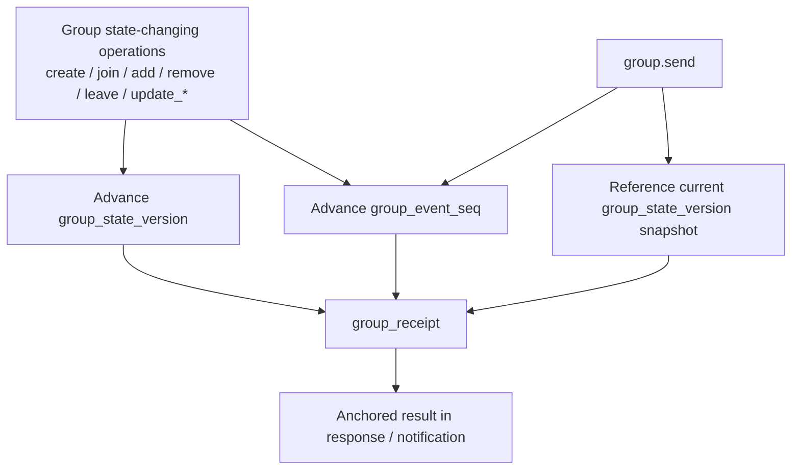
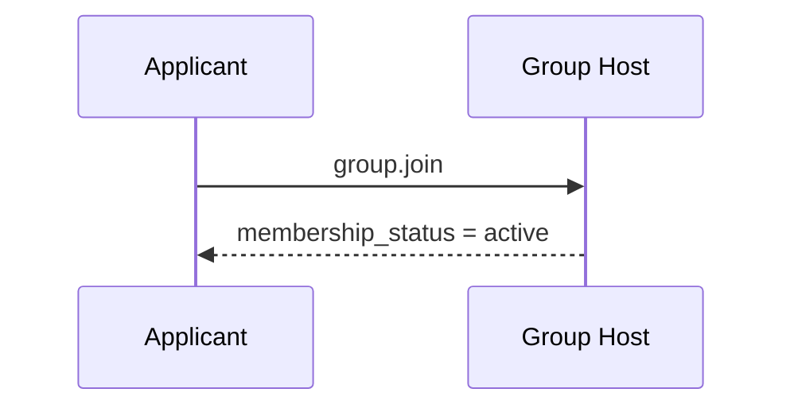
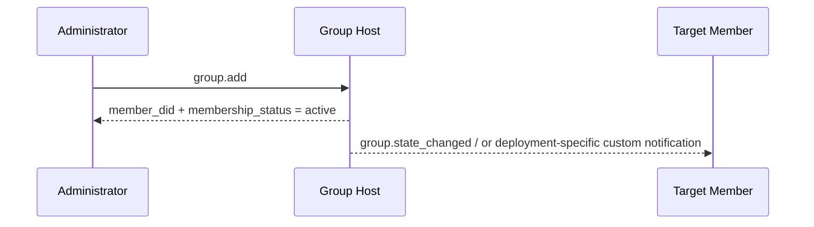
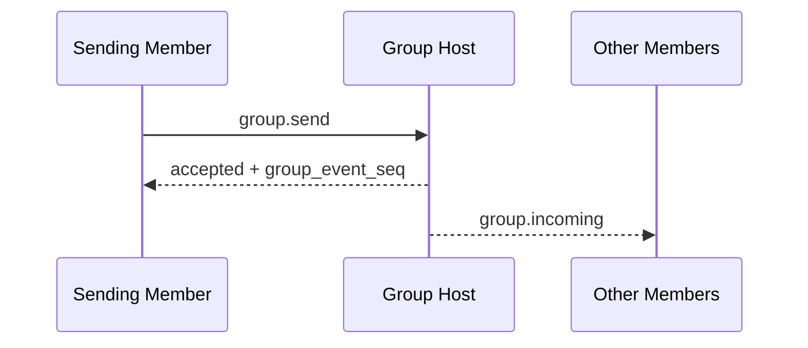

# ANP Profile 4: Group Messaging Base Semantics (Final Revision)

- Document ID: ANP-P4
- Title: Group Messaging Base Semantics
- Status: Draft
- Version: 0.4.0 (Final Revision)
- Language: English
- Applicability: This Profile applies to the group life cycle, group management and group message base semantics based on Group DID, and does not include the group end-to-end encryption algorithm itself.

---

> Note: This revised draft converges the v1 core into two paths: "self-service joining and direct addition":
>
> 1. `group.invite`, `group.accept_invite` and standard `invitation` objects have been moved out of the v1 core;
> 2. `membership_request`, `membership_request_digest`, `group.approve_membership`, and `group.reject_membership` have been moved out of the v1 core;
> 3. `group_policy` converges to `message_security_profile + bootstrap_security_profile + admission_mode + permissions`;
> 4. Non-member governance directed notification `group.governance_notice` has been moved out of v1 core;
> 5. Reserve `group.state_changed` as the order status notification within the group.

---

## 1. Purpose

This Profile defines the group base semantics layer of ANP, stipulating:

1. Group DID serves as the application layer global identifier of the group;
2. Basic actions such as group creation, self-service joining, direct member addition, member removal, leaving the group, updating group information, and updating group policies;
3. base semantics of group message `group.send`;
4. ordering responsibilities of Group Host Service;
5. How Group E2EE Overlay is superimposed on the application semantics of this Profile.

This Profile does not define:

- Specific group E2EE algorithm;
- Pull historical messages;
- Read and online status;
- Device or internal copy concept;
- Group external directory synchronization details;
- Deploy a specific delivery mechanism for private invitation links, Join Token or other out-of-band group membership credentials;
- How dynamic group state is stored inside the Agent.

---

## 2. Terminology and Normative Conventions

### 2.1 Normative Keywords

In this article, **MUST**, **MUST NOT**, **REQUIRED**, **SHALL**, **SHALL NOT**, **SHOULD**, **SHOULD NOT**, **RECOMMENDED**, **NOT RECOMMENDED**, **MAY**, **OPTIONAL** are interpreted as normative requirements according to their capitalized form.

### 2.2 Terminology

- **Group**: Group protocol subject identified by `group_did`.
- **Group Host Service**: The service responsible for the basic status ordering, policy application and group message entry of the group.
- **Group State**: The application layer state of a group at a certain moment, including information, policies, membership relationships, etc.
- **Group State Version**: The current group state version identifier assigned by the Group Host Service.
- **Group Event Sequence**: The group event monotonically increasing sequence number assigned by the Group Host Service covers control operations and group messages.
- **Member**: Agent member in the group.
- **Admission Mode**: The group’s admission path is open to non-members by default. The standard values ​​of this Profile v1 are `admin-add` and `open-join`. Among them, the Chinese "automatic join" online protocol value is uniformly written as `open-join`.
- **Policy**: Application-layer rules that determine who may send messages, add members directly, remove members, update group information, and update policies.
- **Origin Proof**: Application layer origin proof generated by the Agent that initiates group operations or group messages based on did:wba JSON bearer authentication.
- **Group Receipt**: A verifiable receipt object generated by the Group Host and used to prove that a group operation or group message has been accepted by the group and obtained a certain status.
- **Logical Target URI**: To make application layer signatures stable across forwards, a logical target URI defined globally by P1 Appendix A, rather than a specific HTTP URL for a hop.
- **Group State Changed Event**: Group state change event object synchronized by Group Host ordering to the currently active members.

---

## 3. Design Principles

### 3.1 A group, a Group DID

Each group **MUST** have one `group_did`. `group_did` is the application layer global identifier of this group and is used for:

- Group discovery;
- Group management;
- Group message addressing;
- Binding anchor point for subsequent Group E2EE Overlay.

### 3.2 Group Host is responsible for ordering

All operations that change group state **MUST** be accepted and ordered by the Group Host Service.

The Group Host Service **MUST** maintain a well-defined linear ordering of group-state changes and assign a new `group_state_version` to each accepted state change.

### 3.3 Separation of application semantics and cryptographic semantics

This Profile only defines the application layer actions and objects of the group; specific group key establishment, member encryption status evolution, welcome messages, encrypted application messages and other capabilities are defined by the Group E2EE Profile.

### 3.4 The end point of the protocol is still Agent

Group members are still agents at the protocol layer. Any replicas, workers, devices, or terminals that exist within the Agent do not enter the interoperability semantics of this Profile.

### 3.5 Non-Goals

This Profile does **not** provide:

- Global history playback;
- Strong synchronization semantics;
- Device-level membership;
- Device-level delivery;
- Internal executor-level permission control;
- Standardized approval flow.

### 3.6 Separation of Initiator Authentication and Group Result Witnessing

There are usually two signatures with different semantics in group scenarios:

1. **Initiator's signature**: Proves that a certain `sender_did` actually initiated the group operation or group message;
2. **group result witnessing**: Proves that an operation or message has been accepted by the group and assigned a confirmed `group_state_version`, `group_event_seq`, or equivalent state position.

This Profile requires:

- All requests that will change the group state, and `group.send`, **MUST** carry the initiator's `auth.origin_proof`;
- The Group DID signature **SHOULD** appear in the `group_receipt` returned by the Group Host;
- Recipients **MUST NOT** replace the initiator's signature with the group signature, and **MUST NOT** replace group-result witnessing with the initiator's signature.

### 3.7 Group entry path convergence

In the v1 core, only two standard actions are reserved for non-members joining the group:

- `group.join`: The target Agent initiates joining independently and immediately becomes a member of `active` upon success;
- `group.add`: Existing authorized members directly add the target Agent to the group, and it will take effect immediately upon success.

This Profile v1 does not define the standard `invitation` object, `invitation_id`, `group.invite`, or `group.accept_invite`. If the deployment requires an invitation link, Join Token, or other out-of-band credentials to assist `group.join`, these capabilities **MUST** be handled as deployment extensions, and **MUST NOT** create standard member status before `group.join` succeeds.

This Profile v1 does not define a standardized approval flow, nor does it introduce the `pending` intermediate governance state into the core.

---

## 4. Overview of group governance model (non-normative)

### 4.1 Summary list of rules

| Scenario | Entry Method | Immediate Result | Authoritative Object/State | When Becomes `active` | Remarks |
|---|---|---|---|---|---|
| Self-service joining | `group.join` | The caller joins the group | `group_member.status = active` | This join will take effect immediately | Only applicable to `open-join` |
| Add a member directly | `group.add` | The target is added directly | `group_member.status = active` | Effective immediately for this addition | Typically used for `admin-add` |
| Members actively leave the group | `group.leave` | Members withdraw from the group | `group_member.status = left` | Not applicable | Only for current `active` members |
| Administrator removes member | `group.remove` | Member removed from group | `group_member.status = removed` | Not applicable | Applies only to current `active` members |

> Note: If the deployer guides joining through the out-of-band invitation link, Join Token or on-site reminder, the standard interoperability layer will still **MUST** show a successful result of `group.join` or `group.add` in the end.

### 4.2 Status object comparison table

| Object | Key Status | Meaning |
|---|---|---|
| `group_member` | `active` | Application layer membership is in effect |
| `group_member` | `left` / `removed` | Membership ended |

### 4.3 State Machine Diagram



---

## 5. Profile identification and dependencies

### 5.1 Profile name

The standard name of this Profile is:

`anp.group.base.v1`

### 5.2 Dependencies

This Profile **MUST** depend on the following Profiles:

- `anp.core.binding.v1`
- `anp.identity.discovery.v1`

### 5.3 Security Profile

When this Profile is used as an independently running basic group profile:

- `meta.profile` **MUST** equal `anp.group.base.v1`
- `meta.security_profile` **MUST** equal `transport-protected`

If the Group E2EE Overlay is subsequently superimposed, the corresponding security profile **MUST** specify how to cryptographically bind the group state object and group message object of this profile.

---

## 6. Group model

### 6.1 `group_did`

`group_did` is the application layer global identifier of the group.

`group_did`:

- **MUST** be used as the target identifier for group-management operations;
- **MUST** serve as the target identifier for group-message operations;
- **MUST NOT** be treated as automatically equivalent to the internal `group_id` of any particular cryptographic implementation.

### 6.2 `group_state_version`

`group_state_version` identifies the current version of the application-layer group state.

The requirements are as follows:

- **MUST** be assigned by the Group Host Service;
- **MUST** be treated as an opaque string;
- Each successful group-state change **MUST** generate a new `group_state_version`;
- Sending a group message **MUST NOT** advance `group_state_version`;
- The `group_state_version` returned in the successful response to a group message identifies the group-state snapshot to which that message was accepted.

### 6.3 `group_event_seq`

`group_event_seq` represents the group event sequence number.

The requirements are as follows:

- **MUST** monotonically increases within the same group;
- **MUST** cover group control operations and group messages;
- **MUST** be represented by a decimal string;
- **MUST NOT** directly serves as the only basis for security semantics.

The point most easily confused in P4 is which actions advance the group-state version, which actions only advance the group event sequence, and what exactly `group_receipt` anchors. The following diagram puts these three relationships into one view.



*Figure P4-1: Relationship among `group_state_version`, `group_event_seq`, and `group_receipt` (non-normative).*

When reading the subsequent semantics of `group.send`, `group.state_changed`, and `group_receipt`, always return to this diagram: group messages participate in event ordering, but a message itself does not advance a new `group_state_version`.

### 6.4 Role model

This Profile minimum interoperability **MUST** support the following roles:

- `owner`
- `admin`
- `member`

The role hierarchy is fixed at:

`owner > admin > member`

The interpretation rules are as follows:

- When an action requires the minimum character to be `member`, `admin` and `owner` are automatically satisfied;
- When an action requires the minimum character to be `admin`, `owner` is automatically satisfied;
- v1 **MUST NOT** introduce custom roles within the minimum interoperability scope.

### 6.5 Member status

This Profile minimum interoperability **MUST** support the following member states:

- `active`
- `left`
- `removed`

---

## 7. Standard objects

### 7.1 `group_policy`

`group_policy` represents the application layer authorization and group entry rule objects of the group.

The recommended structure is as follows:

```json
{
  "message_security_profile": "transport-protected",
  "bootstrap_security_profile": "transport-protected",
  "admission_mode": "open-join",
  "permissions": {
    "send": "member",
    "add": "admin",
    "remove": "admin",
    "update_profile": "admin",
    "update_policy": "owner"
  },
  "attachments_allowed": true,
  "max_members": "500"
}
```

Field description:

- `message_security_profile`: string, **SHOULD**, recommended values: `transport-protected`, `group-e2ee`
- `bootstrap_security_profile`: string, **SHOULD**, recommended values: `transport-protected`, `group-e2ee`
- `admission_mode`: string, **MUST**
- `permissions`: Object, **MUST**
- `attachments_allowed`: Boolean value, **MAY**
- `max_members`: decimal string, **MAY**

The interpretation rules are as follows:

1. `message_security_profile` constraints:
   - `group.send`
   - Member-only group operations after becoming a member of `active`

2. `bootstrap_security_profile` constraints:
   - `group.join`
   - and subsequent Overlay's clearly defined onboarding / bootstrap methods

3. `admission_mode` **MUST** take one of the following values:
   - `admin-add`
   - `open-join`

4. `permissions` **MUST** contain and only contains the following standard keys:
   - `send`
   - `add`
   - `remove`
   - `update_profile`
   - `update_policy`

5. The value **MUST** of `permissions.*` is:
   - `owner`
   - `admin`
   - `member`

6. The default interpretation rules are as follows:
   - When `admission_mode = "admin-add"`, `group.join` **MUST** be rejected; the typical entry path is `group.add`
   - `group.join` **MUST** be allowed when `admission_mode = "open-join"`
   - Whether `group.add` is available is still determined by `permissions.add`

7. If `max_members` exists, Group Host **MUST** interpret it as the `active` member limit.

### 7.2 `group_member`

`group_member` represents the group membership object.

Minimum recommended fields:

- `agent_did`: string, **MUST**
- `role`: string, **MUST**
- `status`: string, **MUST**
- `joined_at`: RFC 3339 time string, **MAY**
- `added_by`: DID string, **MAY**

Notes:

- By default, the receiver **MUST** interpret `role` as `member`;
- `status = active` indicates that the application layer membership has taken effect;
- `status = left` or `removed` indicates that the membership has been terminated;
- `added_by` is only recommended if the current membership was established by `group.add`.

### 7.3 Deploy extended group credentials

This Profile v1 does not define the standard `invitation` object, nor does it define `invitation_id`.

If the deployment requires an invitation link, Join Token, or other out-of-band credentials to assist `group.join`, these objects **MAY** exist, but they:

- **MUST NOT** be considered a v1 core interworking object;
- **MUST NOT** create a standard member state before `group.join` succeeds;
- **SHOULD** be distributed through controlled channels.

### 7.4 `group_profile`

`group_profile` represents the group's presentational data object.

Recommended fields:

- `display_name`: string, provided by **SHOULD** when creating a group
- `description`: string, **MAY**
- `avatar_uri`: string, **MAY**
- `discoverability`: string, **MAY**, recommended values: `private`, `listed`, `public`
- `labels`: Object, **MAY**

### 7.5 `group_state_ref`

`group_state_ref` represents the group state reference object.

Minimum recommended fields:

- `group_did`: string, **MUST**
- `group_state_version`: string, **MUST**
- `policy_hash`: string, **MAY**
- `roster_hash`: string, **MAY**

### 7.6 Group message payload

`meta.content_type` **MUST** for `group.send` exists.

This Profile minimum interoperability **MUST** support the following content types:

- `text/plain`
- `application/json`
- `application/anp-attachment-manifest+json`

Among `group.send` and `body`, among `text`, `payload` and `payload_b64u`:

- Exactly one of these fields **MUST** be present;
- If more than one appears, the recipient **MUST** reject the request;
- If none of the three are present, the receiving party **MUST** reject the request.

For `payload_b64u`:

- **MUST** use no padding base64url;
- **SHOULD** be used only for binary extensions or private extension objects.

When `meta.content_type = "application/json"`, `body.payload` **MUST** carry
the JSON object directly. This Profile does not define the business meaning of
fields inside that object; group applications or hosts decide how to interpret it.

### 7.7 `auth` object

All requests that change the group state, except `group.get_info`, and `group.send`, whose `params` **MUST** contain an `auth` object.

The proof bearer rules, Signed Request Object and signature component mapping in this section **MUST** reuse the unified definition in P1 Appendix A; P4 **no longer** defines independent proof field names, independent Signed Payload structures or local `@target-uri` mappings.

The recommended structure is as follows:

```json
{
  "auth": {
    "scheme": "anp-rfc9421-origin-proof-v1",
    "origin_proof": {
      "contentDigest": "sha-256=:BASE64_SHA256_DIGEST:",
      "signatureInput": "sig1=(\"@method\" \"@target-uri\" \"content-digest\");created=1733402096;expires=1733402156;nonce=\"abc123\";keyid=\"did:wba:example.com:user:alice:e1_<fingerprint>#key-1\"",
      "signature": "sig1=:BASE64_SIGNATURE:"
    }
  }
}
```

Field requirements:

- `auth.scheme` **MUST** equal `anp-rfc9421-origin-proof-v1`
- `auth.origin_proof` **MUST** exist in all state-changing group operations and `group.send`
- `auth` itself **MUST NOT** enter `contentDigest`

### 7.8 Binding to the Shared Signed Request Object

`auth.origin_proof.contentDigest` **MUST** bind the shared **Signed Request Object** defined in P1 Appendix A.

For Group Base:

- For message class methods such as `group.send`, `meta.message_id` and `meta.content_type` **MUST** exist
- For `group.create`, `meta.target.kind` **MUST** be `service`
- For other group operations targeting existing groups, `meta.target.kind` **MUST** be `group`

### 7.8.1 Reference to the Global Component Mapping

All Group Base methods requiring `auth.origin_proof` **MUST** use the global signature component map defined in P1 Appendix A.

Therefore:

- For `group.create`, the verifier reconstructs `@target-uri = anp://service/<pct-encoded meta.target.did>` based on `meta.target.kind = "service"`
- For group operations targeting an existing group, the verifier rebuilds `@target-uri = anp://group/<pct-encoded meta.target.did>` based on `meta.target.kind = "group"`
- The above results come from the global rules of P1, and are **not** a set of local mappings independently defined by P4

### 7.9 `group_receipt`

`group_receipt` indicates that a group operation or group message has been accepted by the Group Host and written to the verifiable witness object of the group state machine.

Recommended fields:

- `receipt_type`: string, **MUST**, recommended values: `group-operation-accepted`, `group-message-accepted`
- `group_did`: string, **MUST**
- `group_state_version`: string, **MUST**
- `group_event_seq`: decimal string, **MUST**
- `subject_method`: string, **MUST**
- `operation_id`: string, **MUST**
- `message_id`: string, **MAY**
- `actor_did`: string, **MUST**
- `accepted_at`: RFC 3339 time string, **MUST**
- `payload_digest`: string, **MUST**
- `proof`: object, **SHOULD**; when `group_receipt` will leave the domain where the Group Host is located and be dependent on other domains **MUST**

`group_receipt.proof` **MUST** reuse the shared **Object Proof Profile** defined in P1 Appendix B.

For `group_receipt`:

- issuer DID **MUST** be `group_did`
- The protected document **MUST** be the entire `group_receipt` after removing `proof`
- `proof.verificationMethod` **MUST** point to the authentication method authorized by `assertionMethod` in the `group_did` DID document
- The signature Purpose of `group_receipt` is to prove "the group has accepted this result", rather than to prove "who initiated the request"

In addition to the sharing rules of P1 Appendix B, `group_receipt` still **MUST** contain at least the following security-critical fields, and are therefore protected in their entirety by `proof`:

- `receipt_type`
- `group_did`
- `group_state_version`
- `group_event_seq`
- `subject_method`
- `operation_id`
- `actor_did`
- `accepted_at`
- `payload_digest`
- `message_id`, if present, is also **MUST** included and protected

After `group_receipt.proof` has been verified successfully, the verifier **MUST** continue to check that the above fields are consistent with the actual response, the notification context, and the corresponding group-state position.

### 7.10 Group State Change Event Object

This section converges the state change events used by `group.state_changed` into a unified event object, and distinguishes specific events through `event_type`.

#### 7.10.1 Common fields

The recommended structure of the unified event object is as follows:

```json
{
  "event_id": "evt-001",
  "event_type": "member-activated",
  "group_did": "did:example:group-123",
  "group_state_version": "43",
  "group_event_seq": "129",
  "subject_method": "group.join",
  "changed_at": "2026-03-29T14:11:00Z",
  "actor_did": "did:example:agent-b",
  "subject_did": "did:example:agent-c",
  "membership_status": "active",
  "group_profile": { "...": "..." },
  "group_policy": { "...": "..." },
  "group_receipt": { "...": "..." }
}
```

The common rules are as follows:

1. `body` **MUST** of `group.state_changed` directly carries an event object;
2. It **MUST NOT** be used to send out-of-band group entry credentials, reminders or result notifications to objects that have not yet become group members;
3. It **SHOULD** maintain the same sequential semantics as `group_event_seq`;
4. If `subject_method = "group.join"` or `"group.add"`, then `event_type = "member-activated"`.

#### 7.10.2 Standard `event_type`

This Profile v1 recommends the following `event_type`:

- `member-activated`
- `member-removed`
- `member-left`
- `group-profile-updated`
- `group-policy-updated`

Among them:

- `member-activated` **MUST** contain `subject_did` and `membership_status = "active"`
- `member-removed` **MUST** contain `subject_did`
- `member-left` **MUST** contain `subject_did`
- `group-profile-updated` **SHOULD** contain `group_profile`
- `group-policy-updated` **SHOULD** contain `group_policy`

---

## 8. Standard methods and notifications

Except for `group.get_info`, requests for all state-changing methods in this section MUST meet the following general rules:

- `params.auth.scheme` **MUST** equal `anp-rfc9421-origin-proof-v1`
- `params.auth.origin_proof` **MUST** exist and binds the corresponding Signed Request Object
- If the request crosses a domain boundary, the original `auth.origin_proof` **MUST** be forwarded with the message and **MUST NOT** be overwritten by the intermediate service

For all state-changing methods accepted by the Group Host, as well as `group.send`:

- In a non-federated deployment, the successful response **SHOULD** return `group_receipt`
- If the response leaves the Group Host's domain and is intended to be relied upon by another domain, the successful response **MUST** return `group_receipt`, and `group_receipt.proof` **MUST** be present

The following two Notification / asynchronous message methods:

- `group.incoming`
- `group.state_changed`

Belongs to **OPTIONAL push capability**. They are not required minimum interoperability methods for this Profile; but once implemented, the sender **MUST** use the standard Notification envelope and standard `body` structure defined by this Profile.

### 8.1 `group.create`

#### 8.1.1 Semantics

Create a new group and assign a new `group_did` and initial `group_state_version` by the Group Host Service.

#### 8.1.2 Request Requirements

`group.create` request **MUST** satisfy:

1. `method = "group.create"`
2. `meta.profile = "anp.group.base.v1"`
3. `meta.security_profile = "transport-protected"`
4. `meta.sender_did` **MUST** exist
5. `meta.target.kind = "service"`
6. `meta.target.did` **MUST** equal target `ANPMessageService.serviceDid`
7. `meta.operation_id` **MUST** exist
8. `body.group_profile` **SHOULD** exist
9. `body.group_policy` **MUST** exist
10. `body.initial_members` **MAY** exist
11. `params.auth.origin_proof` **MUST** exist

Regarding `body.initial_members`, Group Host **MUST** be processed according to the following rules:

- The creator himself **MUST** become `owner` and immediately `active`;
- If other `initial_members` exists, the Group Host **MAY** interpret it as the equivalent `group.add` during the creation phase;
- Entries in `initial_members` that do not explicitly declare `role` **MUST** be interpreted as `member`.

#### 8.1.3 Successful Response

A successful response **MUST** contain at least:

- `group_did`
- `group_state_version`
- `created_at`
- `creator_did`

A successful response **MAY** contain:

- `group_event_seq`
- `group_profile`
- `group_policy`
- `group_receipt`

### 8.2 `group.get_info`

#### 8.2.1 Semantics

Get a snapshot of the current group's basic information.

#### 8.2.2 Request Requirements

- `meta.target.kind` **MUST** be `"group"`
- `meta.target.did` **MUST** target `group_did`

`body` **MAY** contain:

- `include_policy`
- `include_member_list`

The identity requirements are as follows:

- When the group's `discoverability = "public"` or `"listed"`, `group.get_info` **MAY** be called as an anonymous read; at this time, `meta.sender_did` **MAY** be omitted;
- When the group's `discoverability = "private"`, the caller **MUST** provide an identity;
- If the requested projection is outside the caller's visible range, the receiver **MUST** return `group.policy_violation`.

#### 8.2.3 Successful Response

A successful response **MUST** contain at least:

- `group_did`
- `group_state_version`
- `group_profile`

A successful response **MAY** contain:

- `group_policy` (only if `include_policy = true` and the caller has permission to view)
- `member_list` (only if `include_member_list = true` and the caller has permission to view; its element type **MUST** be `group_member`)
- `member_count` (decimal string; if present, **SHOULD** represent the current number of `active` members)

If `member_list` is returned, its content **SHOULD** only contains the current `active` member.

### 8.3 `group.join`

#### 8.3.1 Semantics

`group.join` is used for non-members to initiate joining independently. For v1 cores, the caller immediately becomes a member of `active` on success.

#### 8.3.2 Request Requirements

`body` **MAY** contain:

- `reason_text`

If the group is not currently in `open-join` mode, the recipient **MUST** reject the request and **SHOULD** return `group.policy_violation`.

#### 8.3.3 Successful Response

A successful response **MUST** contain at least:

- `group_did`
- `membership_status`, and **MUST** be `active`
- `group_state_version`

A successful response **MAY** contain:

- `group_receipt`

### 8.4 `group.add`

#### 8.4.1 Semantics

Members with permissions can directly add the target Agent to the group; upon success, the target will immediately become a member of `active`.

#### 8.4.2 Request Requirements

`body` **MUST** contain:

- `member_did`

`body` **MAY** contain:

- `role`
- `reason_text`

When `role` is not provided explicitly, the receiver **MUST** interpret `member` as such.

#### 8.4.3 Successful Response

A successful response **MUST** contain at least:

- `group_did`
- `member_did`
- `membership_status`, and **MUST** be `active`
- `group_state_version`

A successful response **MAY** contain:

- `group_receipt`

### 8.5 `group.remove`

#### 8.5.1 Semantics

A current `active` member is removed from the group by an authorized member.

#### 8.5.2 Request Requirements

`body` **MUST** contain:

- `member_did`

`body` **MAY** contain:

- `reason_text`

#### 8.5.3 Processing rules

- If the target is currently at `active`, then `group.remove` **MUST** make it `group_member.status = "removed"`;
- If the target is already `left`, `removed`, or does not exist, the recipient **MUST** reject the request.

#### 8.5.4 Successful Response

A successful response **MUST** contain at least:

- `group_did`
- `member_did`
- `group_state_version`

A successful response **MAY** contain:

- `membership_status`
- `group_receipt`

### 8.6 `group.leave`

#### 8.6.1 Semantics

Indicates that the current sender actively exits the group.

#### 8.6.2 Request Requirements

- `meta.sender_did` **MUST** be the current leave-group member

#### 8.6.3 Successful Response

A successful response **MUST** contain at least:

- `group_did`
- `leaver_did`
- `group_state_version`

A successful response **MAY** contain:

- `group_receipt`

### 8.7 `group.update_profile`

#### 8.7.1 Semantics

Update the group display data object.

#### 8.7.2 Request Requirements

`body` **MUST** contain:

- `group_profile_patch`

`group_profile_patch` **MUST** use RFC 7386 JSON Merge Patch semantics.

#### 8.7.3 Successful Response

A successful response **MUST** contain at least:

- `group_did`
- `group_state_version`
- `group_profile`

A successful response **MAY** contain:

- `group_receipt`

### 8.8 `group.update_policy`

#### 8.8.1 Semantics

Update the group policy object.

#### 8.8.2 Request Requirements

`body` **MUST** contain:

- `group_policy_patch`

`group_policy_patch` **MUST** use RFC 7386 JSON Merge Patch semantics.

#### 8.8.3 Successful Response

A successful response **MUST** contain at least:

- `group_did`
- `group_state_version`
- `group_policy`

A successful response **MAY** contain:

- `group_receipt`

### 8.9 `group.send`

#### 8.9.1 Semantics

Send an application layer group message to a group.

#### 8.9.2 Request Requirements

A compliant `group.send` request **MUST** satisfy:

1. `method = "group.send"`
2. `meta.profile = "anp.group.base.v1"`
3. `meta.security_profile = "transport-protected"`
4. `meta.target.kind = "group"`
5. `meta.target.did` **MUST** be the target `group_did`
6. `meta.sender_did` **MUST** be the current sender Agent DID
7. `meta.message_id` **MUST** exist
8. `meta.operation_id` **MUST** exist
9. `meta.content_type` **MUST** exist
10. `body` **MUST** satisfy the payload mutual exclusion rule
11. `params.auth.origin_proof` **MUST** exist and binds Signed Request Object

#### 8.9.3 `body` of `group.send`

`group.send` of `body` can contain:

- `thread_id`: string, **MAY**
- `reply_to_message_id`: string, **MAY**
- `annotations`: Object, **MAY**
- Exactly one of `text`, `payload`, or `payload_b64u` **MUST** be present

#### 8.9.4 Successful Response

A successful response **MUST** contain at least:

- `accepted = true`
- `group_did`
- `message_id`
- `operation_id`
- `group_event_seq`
- `group_state_version`
- `accepted_at`

A successful response **MAY** contain:

- `group_receipt`

### 8.10 `group.incoming`

`group.incoming` is used to asynchronously push a group message that has been accepted by the Group Host to the currently active member Agent. It **MUST** be used as a Notification.

If `group.incoming` is implemented, its Notification envelope **MUST** satisfy:

- `meta.profile = "anp.group.base.v1"`
- `meta.security_profile` **MUST** be equal to security profile when the group message is accepted
- `meta.target.kind = "agent"`
- `meta.target.did` **MUST** equal to the current notification recipient DID
- `meta.sender_did` **MUST** equal to the service sender DID of the original group message
- `meta.operation_id` **MUST** equal original `group.send.meta.operation_id`
- `meta.message_id` **MUST** equal original `group.send.meta.message_id`
- `meta.content_type` **MUST** equal `meta.content_type` of the original group message

The recommended structure of `body` is as follows:

```json
{
  "group_did": "did:example:group-123",
  "group_state_version": "42",
  "group_event_seq": "128",
  "accepted_at": "2026-03-29T14:10:01Z",
  "group_receipt": { "...": "..." },
  "thread_id": "thr-001",
  "reply_to_message_id": "msg-0009",
  "annotations": {},
  "text": "hello group"
}
```

The rules are as follows:

- `body` **MUST** carry the service payload consistent with the original group message;
- If `params.auth` is present, then:
  - `params.auth.scheme` **MUST** equal `anp-rfc9421-origin-proof-v1`
  - `params.auth.origin_proof` **MUST** be a lossless copy of the original `origin_proof`
  - Intermediate service **MUST NOT** rewrite new business proof.

### 8.11 `group.state_changed`

`group.state_changed` is the standard asynchronous notification method for group-state changes. It is used to synchronize ordered membership changes, group-data changes, and group-policy changes to currently active members. It **MUST** be used as a notification.

Its Notification envelope **MUST** satisfy:

- `meta.profile = "anp.group.base.v1"`
- `meta.security_profile = "transport-protected"`
- `meta.target.kind = "agent"`
- `meta.target.did` **MUST** equal to the current notification recipient DID
- `meta.sender_did` **MUST** equal `body.group_did`
- `body` **MUST** directly carry exactly one event object defined in Section 7.10

`group.state_changed` **MUST NOT** be used for out-of-band group-membership credential delivery, non-member reminders, or any targeted governance notification that would otherwise use `direct.send`.

---

## 9. Flow Overview (Non-Normative)

### 9.1 Self-service joining path (`open-join`)



### 9.2 Direct member-addition path (`admin-add`)



### 9.3 Group message path



---

## 10. ordering, Concurrency and Conflict

### 10.1 ordering Responsibilities

Group Host Service **MUST** maintain linear ordering for all accepted events for the same `group_did`. ordering covers:

- `group.create`
- `group.join`
- `group.add`
- `group.remove`
- `group.leave`
- `group.update_profile`
- `group.update_policy`
- `group.send`

### 10.2 Group message and status version

After `group.send` is accepted:

- **MUST** allocate a new `group_event_seq`;
- **MUST NOT** advance `group_state_version` because of the message itself;
- The `group_state_version` returned with `group_receipt` represents the group-state snapshot to which the message was accepted.

### 10.3 Idempotence and deduplication

For group-state changes and group messages, the recipient **MUST** use the following fields as the idempotency basis:

- `sender_did`
- `group_did`
- `method`
- `operation_id`

The receiver **MUST** perform idempotency checks using that tuple.

For `group.send`, the receiver **SHOULD** additionally use the following fields for duplicate detection:

- `sender_did`
- `group_did`
- `message_id`

The receiver **SHOULD** perform duplicate detection using that tuple.

---

## 11. Security and Policy

### 11.1 Secure transmission requirements

This Profile, when run independently, **MUST** rely on a certified secure transport layer.

### 11.2 Group operation initiator authentication

For all state-changing group operations and `group.send`:

- The Group Host Service **MUST** authenticate `auth.origin_proof`;
- The DID to which `keyid` of `auth.origin_proof` belongs **MUST** be consistent with `meta.sender_did`;
- The authentication method pointed to by `keyid` **MUST** be authorized by the `authentication` relationship of the DID document;
- For path type `e1_` DID, Group Host Service **MUST** verify the relationship between the DID and the bound public key according to the did:wba specification;
- The proof bearer rule **MUST** also satisfies the shared Origin Proof convention of P1 Appendix A.

### 11.3 The relationship between initiator authentication and group policy authorization

Permissions such as "who may add members, remove members, update group information, update policies, or send messages" **MUST** be determined by `group_policy`.

Specifically, the receiver **MUST** be based on:

- `group_policy.permissions.send`
- `group_policy.permissions.add`
- `group_policy.permissions.remove`
- `group_policy.permissions.update_profile`
- `group_policy.permissions.update_policy`
- `group_policy.admission_mode`

Determine whether the current request is authorized.

### 11.4 Where to use group DID signature

The signature of the group DID is **not** the second signature of the client's inbound request. Its correct use is:

- Witness the results of accepted group state changes;
- Witness the accepted `group.send` result;
- Provide cross-domain callers with portable proof that the operation/message was indeed accepted by the group.

For `group_receipt.proof`, its proof syntax, protected documents and verification steps **MUST** reuse the shared Object Proof Profile in P1 Appendix B.

### 11.5 Cross-Domain forwarding

If group operations or group messages are forwarded via other services:

- The original `auth.origin_proof` **MUST** remain unchanged and forwarded with the request;
- The target Group Host **MUST** independently verify `auth.origin_proof`;
- **MUST** additionally perform service-level authentication between service hops.

### 11.6 Access Token optimization

The access token process **MAY** based on did:wba is used to optimize repeated calls between the caller and the Group Host, or between services, but:

- An access token **MUST NOT** replace `auth.origin_proof`;
- sender-constrained access token **SHOULD** take precedence over ordinary Bearer tokens.

### 11.7 security profile requirements

If `message_security_profile` in the group policy requires `group-e2ee`:

- For member-only group operations on `group.send` and after becoming a member of `active`, the sender **MUST** use Group E2EE Profile;
- Group Host Service MUST reject requests related to `transport-protected`.

If `bootstrap_security_profile` in the group policy requires `group-e2ee`:

- For `group.join` and subsequent Overlay's clearly defined onboarding / bootstrap methods, the sender **MUST** use Group E2EE Profile;
- Group Host Service **MUST NOT** silently downgrade to `transport-protected` without explicit negotiation.

### 11.8 Binding points with Overlay

Subsequent Group E2EE Overlay **SHOULD** bind at least the following fields:

- `group_did`
- `sender_did`
- `group_state_version` or equivalent status reference
- `message_id`
- `content_type`
- `security_profile`
- `auth.origin_proof.contentDigest` or equivalent origin proof digest

---

## 12. Profile specific errors (recommended)

On the premise of following the ANP Core public error model, this Profile recommends the following `anp_code`:

| `code` | `anp_code` | Meaning |
|---|---|---|
| 3000 | `group.not_member` | The caller is not a member of the group |
| 3001 | `group.already_member` | The target is already a group member |
| 3002 | `group.admission_not_allowed` | The current path to join the group is unavailable, or the prerequisites for joining the group are not met |
| 3003 | `group.policy_violation` | Operation violates group policy |
| 3005 | `group.member_conflict` | Member status conflict |
| 3006 | `group.security_mode_required` | The group has higher requirements security profile |
| 3007 | `group.host_unavailable` | Group Host is temporarily unavailable |
| 3008 | `group.invalid_origin_proof` | Initiator origin proof is invalid, expired or missing |
| 3009 | `group.origin_did_mismatch` | The DIDs to which `meta.sender_did` and `keyid` belong are inconsistent |
| 3010 | `group.invalid_group_receipt` | The group receipt signature is invalid or does not match the returned result |

---

## 13. Privacy Considerations

### 13.1 Minimum Disclosure of Member List

Even if an implementation supports `include_member_list`, the Group Host **SHOULD** only returns the minimum necessary membership information to the authorized caller. For public groups, anonymous reads **SHOULD NOT** expose the full member list by default.

### 13.2 Propagation of out-of-band group entry credentials

If the deployer uses private invitation links, Join Tokens, or other out-of-band credentials to trigger `group.join`, the implementer **SHOULD** avoid exposing these actionable credentials to unrelated parties and **SHOULD** preferentially delivers them through controlled channels, out-of-band channels, or protected direct messagings.

### 13.3 Public discovery and anonymous reading

When the group is set to `public` or `listed`, an anonymous read **SHOULD** return only a minimal data snapshot; the caller **SHOULD NOT** infer internal membership, role distribution, or any other unnecessary state from such reads.

---

## 14. Minimum Interoperability Requirements

An implementation conforming to this Profile MUST support at least:

1. `group.create`
2. `group.get_info`
3. `group.join`
4. `group.add`
5. `group.remove`
6. `group.leave`
7. `group.update_profile`
8. `group.update_policy`
9. `group.send`
10. `group_did`
11. `group_state_version`
12. `group_event_seq`
13. Role: `owner`, `admin`, `member`
14. Member status: `active`, `left`, `removed`
15. Unified event object semantics of `group.state_changed`
16. Safe transmission operation mode

If an implementation provides a push capability, its `group.incoming` and `group.state_changed` **MUST** follow the standard Notification semantics of this Profile.

---

## 15. Example

### 15.1 `group.create` Example

```json
{
  "jsonrpc": "2.0",
  "id": "req-30001",
  "method": "group.create",
  "params": {
    "meta": {
      "profile": "anp.group.base.v1",
      "security_profile": "transport-protected",
      "sender_did": "did:wba:a.example:agents:alice:e1_<fingerprint>",
      "target": {
        "kind": "service",
        "did": "did:wba:groups.example"
      },
      "operation_id": "op-30001",
      "created_at": "2026-03-29T12:30:00Z"
    },
    "auth": {
      "scheme": "anp-rfc9421-origin-proof-v1",
      "origin_proof": {
        "contentDigest": "sha-256=:BASE64_SHA256_OF_SIGNED_REQUEST_OBJECT:",
        "signatureInput": "sig1=(\"@method\" \"@target-uri\" \"content-digest\");created=1774787400;expires=1774787460;nonce=\"n-30001\";keyid=\"did:wba:a.example:agents:alice:e1_<fingerprint>#key-1\"",
        "signature": "sig1=:BASE64_SIGNATURE:"
      }
    },
    "body": {
      "group_profile": {
        "display_name": "Cross-Domain Agents",
        "description": "Collaboration Group",
        "discoverability": "private"
      },
      "group_policy": {
        "message_security_profile": "transport-protected",
        "bootstrap_security_profile": "transport-protected",
        "admission_mode": "admin-add",
        "permissions": {
          "send": "member",
          "add": "admin",
          "remove": "admin",
          "update_profile": "admin",
          "update_policy": "owner"
        },
        "attachments_allowed": true,
        "max_members": "500"
      },
      "initial_members": [
        {
          "agent_did": "did:wba:a.example:agents:alice:e1_<fingerprint>",
          "role": "owner"
        }
      ]
    }
  }
}
```

Ordinary JSON payload example:

```json
{
  "jsonrpc": "2.0",
  "id": "req-30005",
  "method": "group.send",
  "params": {
    "meta": {
      "profile": "anp.group.base.v1",
      "security_profile": "transport-protected",
      "sender_did": "did:wba:a.example:agents:alice:e1_<fingerprint>",
      "target": {
        "kind": "group",
        "did": "did:wba:groups.example:team:dev:e1_<fingerprint>"
      },
      "operation_id": "msg-30005",
      "message_id": "msg-30005",
      "created_at": "2026-03-29T12:51:00Z",
      "content_type": "application/json"
    },
    "body": {
      "thread_id": "thr-001",
      "payload": {
        "type": "example",
        "data": {
          "hello": "group"
        }
      }
    }
  }
}
```

The fields inside `payload` are application-defined and are not specified by ANP.

Successful Response example:

```json
{
  "jsonrpc": "2.0",
  "id": "req-30001",
  "result": {
    "group_did": "did:wba:groups.example:team:dev:e1_<fingerprint>",
    "group_state_version": "1",
    "group_event_seq": "1",
    "created_at": "2026-03-29T12:30:01Z",
    "creator_did": "did:wba:a.example:agents:alice:e1_<fingerprint>",
    "group_receipt": {
      "receipt_type": "group-operation-accepted",
      "group_did": "did:wba:groups.example:team:dev:e1_<fingerprint>",
      "group_state_version": "1",
      "group_event_seq": "1",
      "subject_method": "group.create",
      "operation_id": "op-30001",
      "actor_did": "did:wba:a.example:agents:alice:e1_<fingerprint>",
      "accepted_at": "2026-03-29T12:30:01Z",
      "payload_digest": "sha-256=:BASE64_SHA256_OF_SIGNED_REQUEST_OBJECT:",
      "proof": {
        "type": "DataIntegrityProof",
        "cryptosuite": "eddsa-jcs-2022",
        "verificationMethod": "did:wba:groups.example:team:dev:e1_<fingerprint>#assert-1",
        "proofPurpose": "assertionMethod",
        "created": "2026-03-29T12:30:01Z",
        "proofValue": "zBASE58MULTIBASE_PROOF"
      }
    }
  }
}
```

### 15.2 `group.add` Example

```json
{
  "jsonrpc": "2.0",
  "id": "req-30002",
  "method": "group.add",
  "params": {
    "meta": {
      "profile": "anp.group.base.v1",
      "security_profile": "transport-protected",
      "sender_did": "did:wba:a.example:agents:alice:e1_<fingerprint>",
      "target": {
        "kind": "group",
        "did": "did:wba:groups.example:team:dev:e1_<fingerprint>"
      },
      "operation_id": "op-30002",
      "created_at": "2026-03-29T12:40:00Z"
    },
    "auth": {
      "scheme": "anp-rfc9421-origin-proof-v1",
      "origin_proof": {
        "contentDigest": "sha-256=:BASE64_SHA256_OF_SIGNED_REQUEST_OBJECT:",
        "signatureInput": "sig1=(\"@method\" \"@target-uri\" \"content-digest\");created=1774788000;expires=1774788060;nonce=\"n-30002\";keyid=\"did:wba:a.example:agents:alice:e1_<fingerprint>#key-1\"",
        "signature": "sig1=:BASE64_SIGNATURE:"
      }
    },
    "body": {
      "member_did": "did:wba:b.example:agents:bob:e1_<fingerprint>",
      "role": "member",
      "reason_text": "Join the collaboration group"
    }
  }
}
```

Successful Response example:

```json
{
  "jsonrpc": "2.0",
  "id": "req-30002",
  "result": {
    "group_did": "did:wba:groups.example:team:dev:e1_<fingerprint>",
    "member_did": "did:wba:b.example:agents:bob:e1_<fingerprint>",
    "group_state_version": "2",
    "membership_status": "active",
    "group_receipt": {
      "receipt_type": "group-operation-accepted",
      "group_did": "did:wba:groups.example:team:dev:e1_<fingerprint>",
      "group_state_version": "2",
      "group_event_seq": "2",
      "subject_method": "group.add",
      "operation_id": "op-30002",
      "actor_did": "did:wba:a.example:agents:alice:e1_<fingerprint>",
      "accepted_at": "2026-03-29T12:40:01Z",
      "payload_digest": "sha-256=:BASE64_SHA256_OF_SIGNED_REQUEST_OBJECT:",
      "proof": {
        "type": "DataIntegrityProof",
        "cryptosuite": "eddsa-jcs-2022",
        "verificationMethod": "did:wba:groups.example:team:dev:e1_<fingerprint>#assert-1",
        "proofPurpose": "assertionMethod",
        "created": "2026-03-29T12:40:01Z",
        "proofValue": "zBASE58MULTIBASE_PROOF"
      }
    }
  }
}
```

### 15.3 `group.join` example (open to join)

```json
{
  "jsonrpc": "2.0",
  "id": "req-30003",
  "method": "group.join",
  "params": {
    "meta": {
      "profile": "anp.group.base.v1",
      "security_profile": "transport-protected",
      "sender_did": "did:wba:c.example:agents:carol:e1_<fingerprint>",
      "target": {
        "kind": "group",
        "did": "did:wba:groups.example:public:news:e1_<fingerprint>"
      },
      "operation_id": "op-30003",
      "created_at": "2026-03-29T12:45:00Z"
    },
    "auth": {
      "scheme": "anp-rfc9421-origin-proof-v1",
      "origin_proof": {
        "contentDigest": "sha-256=:BASE64_SHA256_OF_SIGNED_REQUEST_OBJECT:",
        "signatureInput": "sig1=(\"@method\" \"@target-uri\" \"content-digest\");created=1774788300;expires=1774788360;nonce=\"n-30003\";keyid=\"did:wba:c.example:agents:carol:e1_<fingerprint>#key-1\"",
        "signature": "sig1=:BASE64_SIGNATURE:"
      }
    },
    "body": {
      "reason_text": "Subscribe to the public group"
    }
  }
}
```

Successful Response example:

```json
{
  "jsonrpc": "2.0",
  "id": "req-30003",
  "result": {
    "group_did": "did:wba:groups.example:public:news:e1_<fingerprint>",
    "membership_status": "active",
    "group_state_version": "8",
    "group_receipt": {
      "receipt_type": "group-operation-accepted",
      "group_did": "did:wba:groups.example:public:news:e1_<fingerprint>",
      "group_state_version": "8",
      "group_event_seq": "41",
      "subject_method": "group.join",
      "operation_id": "op-30003",
      "actor_did": "did:wba:c.example:agents:carol:e1_<fingerprint>",
      "accepted_at": "2026-03-29T12:45:01Z",
      "payload_digest": "sha-256=:BASE64_SHA256_OF_SIGNED_REQUEST_OBJECT:",
      "proof": {
        "type": "DataIntegrityProof",
        "cryptosuite": "eddsa-jcs-2022",
        "verificationMethod": "did:wba:groups.example:public:news:e1_<fingerprint>#assert-1",
        "proofPurpose": "assertionMethod",
        "created": "2026-03-29T12:45:01Z",
        "proofValue": "zBASE58MULTIBASE_PROOF"
      }
    }
  }
}
```

### 15.4 `group.send` Example

```json
{
  "jsonrpc": "2.0",
  "id": "req-30004",
  "method": "group.send",
  "params": {
    "meta": {
      "profile": "anp.group.base.v1",
      "security_profile": "transport-protected",
      "sender_did": "did:wba:a.example:agents:alice:e1_<fingerprint>",
      "target": {
        "kind": "group",
        "did": "did:wba:groups.example:team:dev:e1_<fingerprint>"
      },
      "operation_id": "msg-30004",
      "message_id": "msg-30004",
      "created_at": "2026-03-29T12:50:00Z",
      "content_type": "text/plain"
    },
    "auth": {
      "scheme": "anp-rfc9421-origin-proof-v1",
      "origin_proof": {
        "contentDigest": "sha-256=:BASE64_SHA256_OF_SIGNED_REQUEST_OBJECT:",
        "signatureInput": "sig1=(\"@method\" \"@target-uri\" \"content-digest\");created=1774788600;expires=1774788660;nonce=\"n-30004\";keyid=\"did:wba:a.example:agents:alice:e1_<fingerprint>#key-1\"",
        "signature": "sig1=:BASE64_SIGNATURE:"
      }
    },
    "body": {
      "thread_id": "thr-001",
      "text": "Hello everyone"
    }
  }
}
```

Successful Response example:

```json
{
  "jsonrpc": "2.0",
  "id": "req-30004",
  "result": {
    "accepted": true,
    "group_did": "did:wba:groups.example:team:dev:e1_<fingerprint>",
    "message_id": "msg-30004",
    "operation_id": "msg-30004",
    "group_event_seq": "9",
    "group_state_version": "2",
    "accepted_at": "2026-03-29T12:50:01Z",
    "group_receipt": {
      "receipt_type": "group-message-accepted",
      "group_did": "did:wba:groups.example:team:dev:e1_<fingerprint>",
      "group_state_version": "2",
      "group_event_seq": "9",
      "subject_method": "group.send",
      "operation_id": "msg-30004",
      "message_id": "msg-30004",
      "actor_did": "did:wba:a.example:agents:alice:e1_<fingerprint>",
      "accepted_at": "2026-03-29T12:50:01Z",
      "payload_digest": "sha-256=:BASE64_SHA256_OF_SIGNED_REQUEST_OBJECT:",
      "proof": {
        "type": "DataIntegrityProof",
        "cryptosuite": "eddsa-jcs-2022",
        "verificationMethod": "did:wba:groups.example:team:dev:e1_<fingerprint>#assert-1",
        "proofPurpose": "assertionMethod",
        "created": "2026-03-29T12:50:01Z",
        "proofValue": "zBASE58MULTIBASE_PROOF"
      }
    }
  }
}
```

---

## 16. Registry Placeholder

Subsequent versions of this standard **SHOULD** establish the following registry:

1. Group role registration form;
2. Group member status registration form;
3. `group_policy.admission_mode` registry;
4. `group.state_changed.event_type` registry;
5. Group error code registration table.

---

## 17. Reference Implementation Notes (Non-Normative)

Implementers should adopt the following principles when implementing this Profile:

- The v1 core only maintains the `group_member` group entry result object and does not introduce standard `invitation` or standardized approval objects;
- `group_policy` uses a fixed `admission_mode + permissions` structure, which is clearer and easier to implement than a large number of Boolean switches;
- `group.incoming` is responsible for group message push, and `group.state_changed` is responsible for orderly status synchronization within the group;
- Capabilities such as private invitation links, Join Token, and site reminders are deployment extensions, not v1 core interoperability requirements;
- `group.send` does not participate in group state version concurrency control. The server only needs to verify "whether the sender is currently a member of `active` and has `send` permissions."
