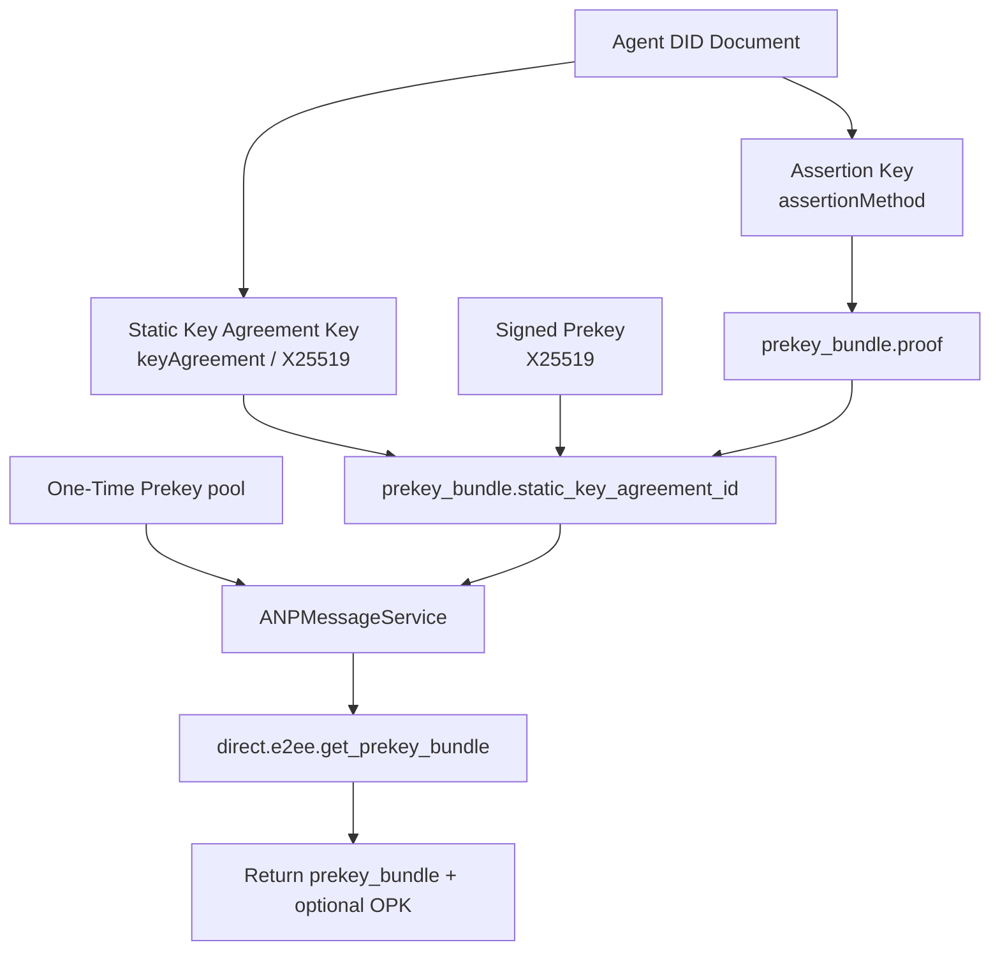
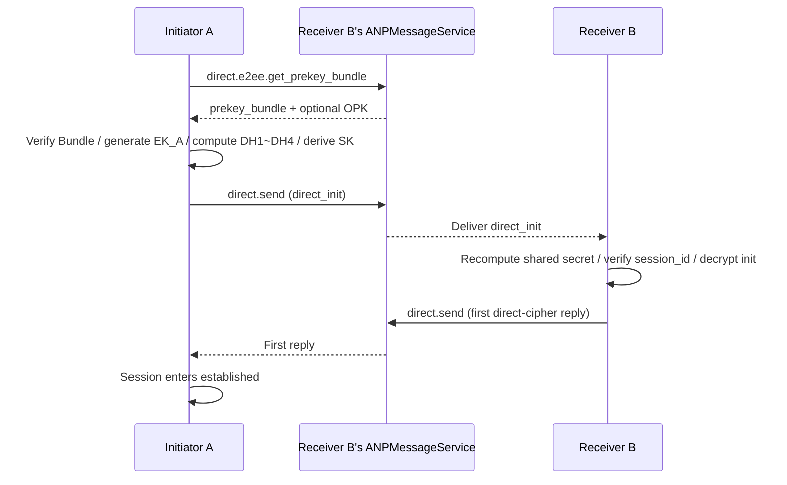
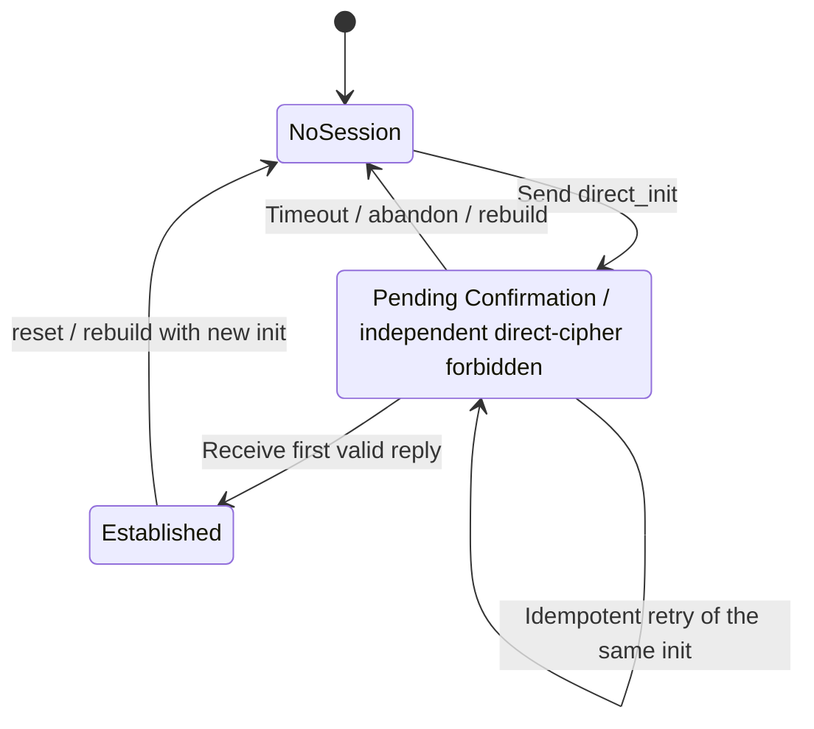

# ANP Profile 5: Direct End-to-End Encryption (Refined Draft)

- Document ID: ANP-P5
- Title: Direct End-to-End Encryption
- Status: Draft
- Version: 0.3.2 (Refined Draft)
- Language: English
- Applicability: This Profile applies to Direct End-to-End Encryption Overlay based on `agent_did`.
- Dependencies:
  - `anp.core.binding.v1`
  - `anp.identity.discovery.v1`
  - `anp.direct.base.v1`
  - `did:wba` Identity and Proof Profile (external dependency)

---

## 1. Goals and Scope

This Profile defines the complete implementable solution of ANP Direct End-to-End Encryption, stipulating:

1. How to connect `did:wba`’s identity and service discovery capabilities to direct messaging E2EE;
2. How to publish, discover and verify Prekey Bundle;
3. How to execute initial asynchronous session establishment based on `X3DH-like`;
4. How to use `Double Ratchet-like` to protect subsequent messages;
5. How to define AAD, replay protection, out-of-order processing, session reconstruction and error models;
6. How to bind direct messaging E2EE to Agent without introducing the concept of device.

This Profile does not define:

- Device, multi-end login or internal copy synchronization;
- Pull historical messages;
- Read status;
- presence;
-Group End-to-End Encryption;
- Agent internal key replication mechanism;
- The parsing, updating and undoing mechanism of the `did:wba` method itself.

---

## 2. Normative Keywords and Terminology

### 2.1 Normative Keywords

In this article, **MUST**, **MUST NOT**, **REQUIRED**, **SHALL**, **SHALL NOT**, **SHOULD**, **SHOULD NOT**, **RECOMMENDED**, **NOT RECOMMENDED**, **MAY**, **OPTIONAL** are interpreted as normative requirements according to their capitalized form.

### 2.2 Terminology

- **Agent DID**: Agent identification for external communication. In this Profile, it is not only the business subject identifier of the outer `direct.send`, but also the identity anchor of AAD, Bundle verification and session binding.
- **Assertion Key**: The signing key in the `did:wba` DID document that is authorized by `assertionMethod` and optionally also appears in `authentication`. It is used to sign Bundle or Binding Proof and does not participate in DH calculation.
- **Static Key Agreement Key**: The long-term X25519 public key declared in DID document `keyAgreement`. It is long-term DH identity material and is commonly referenced in online protocols by `static_key_agreement_id`.
- **Signed Prekey (SPK)**: The mid-term X25519 public key generated by the recipient and signed and bound by the Assertion Key. It participates in the DH calculation together with the sender's static/temporary key at the initial session establishment and is referenced via `signed_prekey.key_id`.
- **One-Time Prekey (OPK)**: The recipient's one-time use X25519 public key. It is used to provide an additional one-time forward security gain to the initial session establishment; if used successfully, it must be consumed and cannot be reused.
- **Prekey Bundle**: A collection of session establishment public materials for the initiator to obtain. It describes static information such as the long-term static negotiation key and the current SPK, but does not embed the OPK directly.
- **Direct Session**: An E2EE session between two Agents, identified by `session_id`. Subsequent Double Ratchet state, out-of-order handling, and replay detection are maintained around this session.
- **Application Plaintext**: direct messaging application layer plaintext object before being encrypted. It is the normalized inner representation of Direct Base application payload, used to enter AEAD encryption.
- **Ratchet Header**: Minimum public header field required for subsequent messages. The receiver relies on it to locate the receive chain, determine whether it needs to advance the DH ratchet, and handle out-of-order messages.
- **Replay Cache**: A collection of states used to identify duplicate initial messages or duplicate subsequent messages. It is a local state, not a standard wire protocol field.

---

## 3. General Design Principles

### 3.1 Agent is the end point of the protocol

The external communication endpoint of this Profile is `agent_did`. This Profile does not identify devices, terminals, replicas, workers or executors.

### 3.2 Separation of security overlay and business semantics

This Profile does not redefine the business semantics of direct messaging; it reuses `anp.direct.base.v1`'s:

- `direct.send` method;
- `sender_did` / `target.did` semantics;
- `message_id` / `operation_id` semantics;
- direct messagingSuccess Semantics (target Agent portal service accepted);
- Application layer content type semantics.

### 3.3 v1 baseline selection

The **v1 mandatory interoperability baseline** of this Profile adopts:

- Initial session establishment: `X3DH-like` (adapted for did:wba)
- Long-term static negotiation key: `X25519`
- KDF: `HKDF-SHA-256`
- Message AEAD: `ChaCha20-Poly1305`
- Subsequent Message: `Double Ratchet-like`

### 3.4 Future upgrade path

This Profile reserves room for upgrades to `PQXDH-like`. v1 does not force post-quantum suites, but a compatibility path should be maintained for v2 via the suite registry.

### 3.5 Long-term signing of init messages is not required by default

In v1, a long-term DID identity signature over the entire `direct_init` object is **not required** by default.

The reason is:

1. X3DH-like authentication itself comes from the combination of long-term static negotiation key and receiver SPK;
2. The receiver SPK has been bound by Assertion Key;
3. If the entire init message is required to be signed for a long time, it will significantly bias towards the "attributable control message" model and weaken the deniability of the Signal style.

If a deployment requires stronger auditability, it MAY enable the `Direct Init Accountability Extension`. That extension is optional and is not part of the default behavior of this profile.

### 3.6 MTI wire object collection of `anp.direct.e2ee.v1`

When `method = "direct.send"` and `meta.profile = "anp.direct.e2ee.v1"`, only the following two values are allowed for `meta.content_type` in the v1 MTI path:

- `application/anp-direct-init+json`
- `application/anp-direct-cipher+json`

The sender **MUST NOT** use a different wire object type in the v1 MTI path.
Recipients that receive other `content_type` MUST reject unless the capability has been explicitly enabled through extension negotiation.

### 3.7 Message ID constraints of `direct.send` under `anp.direct.e2ee.v1`

For `direct.send` of `meta.profile = "anp.direct.e2ee.v1"`:

- `meta.message_id` **MUST** exist;
- `meta.operation_id` **MUST** exist;
- `meta.operation_id` **MUST** be exactly equal to `meta.message_id`.

### 3.8 `auth` constraints of `direct.send` under `anp.direct.e2ee.v1`

`params.auth` **MUST** be absent for `direct.send` when `meta.profile = "anp.direct.e2ee.v1"`.

If the deployment explicitly negotiates the `Direct Init Accountability Extension`, it **MAY** introduce an additional attestation object. If the extension has not been negotiated, the receiver **MUST** reject any received `params.auth`.

---


### 3.9 Relationship to P3 Originator Binding Requirements

For the "`auth.origin_proof.contentDigest` or equivalent origin proof digest" requirement in P3 section 9.7, this Profile meets the equivalent binding through the following objects together:

- `AD_init`
- `AD_msg`
- `Application Plaintext` under AEAD protection

When `Direct Init Accountability Extension` is not negotiated, the v1 MTI **is not required** to additionally carry the P3 form of `params.auth.origin_proof`.

## 4. `did:wba` integration rules

### 4.1 Minimum requirements for DID documents

Agent DID documents that support this Profile **MUST** meet:

1. There is at least one Authentication Key that can be used for identity authentication and an Assertion Key that can be used for assertion signature;
2. There is at least one `keyAgreement` verification method;
3. There is at least one `ANPMessageService` or equivalent service entry;
4. The `ANPMessageService` **MUST** can be parsed and accessed by the caller and provides the key material methods required by this Profile.

### 4.2 Key role separation

This Profile **MUST** use key role separation:

1. The keys listed in `authentication` / `assertionMethod` are used for:
   - Sign Prekey Bundle;
   - Sign control objects that require strong identity ownership (if an extension is enabled);
2. The keys listed in `keyAgreement` are used for:
   - Long-term static negotiation;
   - Initial shared key derivation;
3. Assertion Key and Static Key Agreement Key **MUST NOT** be used together.

Supplementary note: In online protocols, the former is usually referenced through `proof.verificationMethod`, and the latter is usually referenced through `static_key_agreement_id` in Bundle or `sender_static_key_agreement_id` in init; the implementation should not let the same key bear both types of semantics.

### 4.3 `did:wba` fingerprint binding


Refer to the conventions of the `did:wba` specification.

### 4.4 Key material capabilities of `ANPMessageService`

`ANPMessageService` **MUST** support the following key-material capabilities required by this profile:

- Publish Prekey Bundle;
- Replenish or rotate the OPK pool;
- Query Prekey Bundle;
- Issue one available OPK on a per-time basis (if it exists and the policy allows it);
- Mark the OPK as allocated, consumed or unavailable for reuse;
- Returns the Bundle's revoked or invalidated status (if supported by the implementation).

The first barrier to understanding P5 is not the algorithm, but rather which party signs, which party performs DH, and which party publishes Bundles / OPKs. The following diagram places the DID document's key roles and the externally exposed materials in one view for the subsequent session-establishment flow.



*Figure P5-1: Relationship between key roles and public materials (non-normative).*

This diagram emphasizes separation of responsibilities: the Assertion Key is responsible for identity binding, while long-term `keyAgreement` and SPK / OPK keys are responsible for DH computation. Implementations should not let the same key carry both semantics.

---

## 5. Mandatory-to-Implement Suite (MTI)

### 5.1 MTI Suite Name

The MTI suite for v1 is defined as:

`ANP-DIRECT-E2EE-X3DH-25519-CHACHA20POLY1305-SHA256-V1`

### 5.2 MTI suite parameters

The kit parameters are fixed as follows:

- Static negotiation curve: `X25519`
- Temporary negotiation curve: `X25519`
- HKDF: `HKDF-SHA-256`
- AEAD: `ChaCha20-Poly1305`
- Bundle object proof profile: `prekey_bundle.proof` **MUST** reuse the shared `Object Proof Profile` defined in P1 Appendix B


This requirement applies to at least:

- Protected document of `prekey_bundle` (also referred to as `Signed Bundle Object` in this article)
- `AD_init`
- `AD_msg`
- `Application Plaintext`


### 5.3 Recommended Optional Suites

Implements **MAY** additional support for:

- `ANP-DIRECT-E2EE-X3DH-25519-AES256GCM-SHA256-V1`
- `ANP-DIRECT-E2EE-PQXDH-HYBRID-V1` (reserved)

But any v1 interoperability implementation **MUST** support the MTI suite.

---

## 6. Public Materials and Bundle Structure

### 6.1 Long-term static negotiation key

Each Agent **MUST** declare at least one long-lived static X25519 public key in its DID document `keyAgreement`.

Recommended fields:

- `id`: For example `did:wba:example.com:agent:alice:e1_xxx#ka-1`
- `type`: Implement self-selection, but it must be explicitly stated X25519
- `publicKeyMultibase` or equivalent public key representation


Field usage instructions:

- `id`: used to accurately indicate "which long-term DH key was used this time" in Bundle, Init message and AAD.
- `type`: Used to declare the algorithm and encoding method of the verification method, so that the peer can correctly decode and verify that it is indeed X25519.
- `publicKeyMultibase` or equivalent: carries the actual public key bytes and is the input source for the peer performing DH.

### 6.2 `prekey_bundle` structure

`prekey_bundle` represents **static session establishment material** published by the recipient on a long-term basis and bound by the `did:wba` identity certificate. In order to be consistent with the Signal-style OPK pay-per-view issuance model, `prekey_bundle` **MUST NOT** directly embeds `one_time_prekey`; the OPK is returned by the server when querying.

The recommended definition of `prekey_bundle` is as follows:

```json
{
  "bundle_id": "bundle-20260329-001",
  "owner_did": "did:wba:example.com:agent:alice:e1_xxx",
  "suite": "ANP-DIRECT-E2EE-X3DH-25519-CHACHA20POLY1305-SHA256-V1",
  "static_key_agreement_id": "did:wba:example.com:agent:alice:e1_xxx#ka-1",
  "signed_prekey": {
    "key_id": "spk-001",
    "public_key_b64u": "BASE64URL_X25519_SPK",
    "expires_at": "2026-04-05T00:00:00Z"
  },
  "proof": {
    "type": "DataIntegrityProof",
    "cryptosuite": "eddsa-jcs-2022",
    "verificationMethod": "did:wba:example.com:agent:alice:e1_xxx#assert-1",
    "proofPurpose": "assertionMethod",
    "created": "2026-03-29T00:00:00Z",
    "proofValue": "zBASE58MULTIBASE_PROOF"
  }
}
```

Field usage instructions:

- `bundle_id`: The stable identifier of this static Bundle version. The sender will bring it into `direct_init` and `AD_init`, and the receiver can also use it for auditing, cache hits and replay range differentiation.
- `owner_did`: Agent DID to which the Bundle belongs. The sender parses the DID document, verifies `proof` and confirms the identity of the Bundle based on it.
- `suite`: The name of the cipher suite applicable to this Bundle. The sender should first determine whether it is supported locally and then decide whether to use the Bundle session establishment.
- `static_key_agreement_id`: DID URL pointing to the long-lived static X25519 key in the `owner_did` DID document. It tells the peer "which long-term DH key this Bundle corresponds to."
- `signed_prekey.key_id`: The stable identifier of the current SPK. The sender references this in `direct_init`, which the receiver uses to locate the correct SPK private key.
- `signed_prekey.public_key_b64u`: The public key bytes of the SPK, represented using unpadded base64url, is one of the inputs to the initial DH.
- `signed_prekey.expires_at`: SPK expiration time. The sender must verify that the Bundle has not expired before using it.
- `proof.type`: Type of proof object; v1 MTI is fixed to `DataIntegrityProof`.
- `proof.cryptosuite`: specific proof cryptosuite name; v1 MTI is fixed to `eddsa-jcs-2022`.
- `proof.verificationMethod`: Verification method DID URL used to sign the bundle. The sender should check if it belongs to an `assertionMethod` relationship allowed by the `owner_did` document.
- `proof.proofPurpose`: Declares the authorization relationship used in the signature, which is used to correspond to the authorization relationship in the DID document.
- `proof.created`: The time when this certificate was generated, used for auditing and policy checking.
- `proof.proofValue`: Normalizes the attestation value of the Bundle representation checkout.

### 6.2.1 `prekey_bundle.proof` and shared Object Proof Profile

`prekey_bundle.proof` **MUST** reuse the shared **Object Proof Profile** defined in P1 Appendix B.

For `prekey_bundle`:

- issuer DID **MUST** be `owner_did`
- The protected document **MUST** be the entire `prekey_bundle` object after removing `proof`
- This article refers to the protected document as `Signed Bundle Object`
- `proof.verificationMethod` **MUST** point to the authentication method authorized by `assertionMethod` in the `owner_did` DID document
- `proofPurpose` **MUST** fixed to `assertionMethod`


### 6.2.2 Non-redefinable semantics of `bundle_id`

Within the local acceptance window, the same `bundle_id` **MUST** be mapped uniquely and only to the following combination of fields:

- `owner_did`
- `suite`
- `static_key_agreement_id`
- `signed_prekey.key_id`
- `signed_prekey.public_key_b64u`

The server **MAY** accept multiple different `bundle_id` values concurrently within a short grace period, but **MUST NOT** redefine the same `bundle_id`.

While an `bundle_id` is still within the acceptance window, the recipient **MUST** retain its corresponding SPK private key, Bundle metadata, and necessary lookup indexes until the end of the acceptance window.

### 6.2.3 Object-specific constraints for Bundle proof

In addition to the sharing rules of P1 Appendix B, in v1 MTI, `prekey_bundle` **MUST** satisfy:

- `proof` **MUST** exist
- `proof.verificationMethod` belongs to a DID **MUST** equal to `owner_did`
- If `prekey_bundle.proof` does not meet P1 Appendix B, or its issuer DID is inconsistent with `owner_did`, the recipient **MUST** reject the Bundle with `anp.direct.e2ee.bundle_invalid`

### 6.3 Bundle field requirements

`prekey_bundle` **MUST** contain:

- `bundle_id`
- `owner_did`
- `suite`
- `static_key_agreement_id`
- `signed_prekey`
- `proof`

`prekey_bundle` **MUST NOT** directly contains:

- `one_time_prekey`

### 6.4 Object-specific field constraints of Bundle proof

In addition to the unified protection scope requirement of P1 Appendix B for "the entire object after `proof` is removed", `prekey_bundle` still **MUST** contain at least the following security-critical fields and are therefore protected in their entirety by `proof`:

- `bundle_id`
- `owner_did`
- `suite`
- `static_key_agreement_id`
- `signed_prekey`

`proof` is bound to a static Bundle; the OPK **MUST NOT** issued on a per-time basis during runtime is used as the coverage content of the static Bundle proof.

### 6.5 Bundle verification requirements

The sender **MUST** before using the Bundle:

1. Parse the DID document of `owner_did`;
2. Verify whether the public key referenced by `proof.verificationMethod` belongs to the verification method authorized by `assertionMethod` in the `owner_did` DID document;
3. Verify `prekey_bundle.proof` according to the shared Object Proof Profile defined in Appendix B of P1 (its protected document is `Signed Bundle Object`);
4. Verify whether `static_key_agreement_id` exists in DID document `keyAgreement`;
5. Verify whether `suite` is a locally supported package;
6. Verify that `signed_prekey.expires_at` has not expired;
7. If `direct.e2ee.get_prekey_bundle`’s Successful Response comes with `one_time_prekey`, the sender **MUST** verify that its field format is legal and records its `key_id` for subsequent session establishment, consumption and auditing.
8. When the sender subsequently constructs `direct_init`, `recipient_signed_prekey_id` **MUST** be equal to the selected `prekey_bundle.signed_prekey.key_id`.

### 6.6 OPK Strategy

`one_time_prekey` is used by **SHOULD** in v1, but **MAY** be the default.

In order to be consistent with the Signal-style one-time pre-key issuance method, the recipient **SHOULD** upload a batch of OPKs available for issuance to its `ANPMessageService` in advance, and the server returns one of the available OPKs in `direct.e2ee.get_prekey_bundle`'s Successful Response one at a time.

When Successful Response comes with an OPK, its object format is recommended as follows:

```json
{
  "key_id": "opk-001",
  "public_key_b64u": "BASE64URL_X25519_OPK"
}
```

Field usage instructions:

- `key_id`: Stable ID for this OPK record. The sender refers to it through `recipient_one_time_prekey_id` in `direct_init`, and the receiver uses it to locate and consume the corresponding private key.
- `public_key_b64u`: The public key bytes of this OPK, represented using unpadded base64url, are input to optional `DH4`.

The rules are as follows:

- The server **SHOULD** immediately marks the OPK as allocated when it returns;
- The same OPK **MUST NOT** be distributed to multiple senders concurrently;
- If an OPK has completed a successful initial session establishment, the server **MUST** will mark it as consumed, and the receiver **MUST** will delete the corresponding OPK private key;
- If session establishment is not completed after allocation, whether recycling is allowed is determined by the deployment policy; however, any OPK **MUST NOT** that is confirmed to be used for successful session establishment must be issued again;
- If `direct.e2ee.get_prekey_bundle`'s Successful Response does not come with an OPK, the initiator can still proceed with session establishment, but the forward security of the initial shared secret will rely more on the SPK life cycle.

---

## 7. Key Service method

### 7.1 `direct.e2ee.publish_prekey_bundle`

This method is used to publish a new static Prekey Bundle to the sender's own public `ANPMessageService`, and optionally supplement a batch of OPKs.

#### Request Requirements

- `meta.profile = anp.direct.e2ee.v1`
- `meta.security_profile = transport-protected`
- `meta.target.kind = "service"`
- `meta.target.did` **MUST** be equal to the publisher’s own public `ANPMessageService.serviceDid`
- `meta.sender_did` **MUST** exist
- `meta.operation_id` **MUST** exist
- `params.auth` **MUST** be absent unless the extension has been negotiated
- `body.prekey_bundle` **MUST** exist
- `body.prekey_bundle.owner_did` **MUST** equal `meta.sender_did`
- `body.one_time_prekeys` **MAY** exist; if it exists, **MUST** be a non-empty array, and each element **MUST** contain at least `key_id` and `public_key_b64u`

Authentication constraints:

- This method belongs to **service-scoped** Control-Plane Methods;
- Under the v1 standard path, the caller **MUST** run in an authenticated local session or an equivalent hop- and service-level authentication context;
- v1 does **not** require an additional business-layer `origin_proof` for this method;
- Before accepting the request, the server **MUST**, in addition to verifying hop- and service-level authentication, verify that the authenticated caller is authorized to publish materials for `body.prekey_bundle.owner_did` on behalf of `meta.sender_did`.


Idempotent requirements:

- The server **MUST** use `(meta.sender_did, meta.target.did, method, meta.operation_id)` as the idempotent key;
- For repeated requests with the same idempotent key, if `body.prekey_bundle` and `body.one_time_prekeys` are semantically equivalent, **MUST** return the original result or equivalent result;
- If the request body semantics corresponding to the same idempotent key conflict, **MUST** return `anp.idempotency_conflict` or equivalent error.

Field usage instructions:

- `meta.security_profile = transport-protected` indicates that this is the key control plane call, not the E2EE ciphertext transmission after the session has been established.
- `body.prekey_bundle` is used to publish or replace static session establishment material currently available to others.
- `body.one_time_prekeys` is used to replenish the OPK pool in one go; it is an optional bulk upload and does not go into the static Bundle proof.

#### Successful Response

A successful response **MUST** contain at least:

- `published = true`
- `owner_did`
- `bundle_id`
- `published_at`

A successful response **MAY** contain:

- `published_opk_count`


### 7.2 `direct.e2ee.get_prekey_bundle`

This method is used to obtain an available static Bundle via `ANPMessageService` exposed by the target Agent, along with an available OPK on demand.

#### Request Requirements

- `meta.profile = anp.direct.e2ee.v1`
- `meta.security_profile = transport-protected`
- `meta.target.kind = "service"`
- `meta.target.did` **MUST** be equal to the `ANPMessageService.serviceDid` exposed by the target Agent
- `meta.sender_did` **MUST** exist
- `meta.operation_id` **MUST** exist
- `params.auth` **MUST** be absent unless the extension has been negotiated

`body` **MUST** contain:

- `target_did`

`body` **MAY** contain:

- `preferred_suite`
- `require_opk`

Authentication constraints:

- This method belongs to **service-scoped** Control-Plane Methods;
- The v1 minimum-interoperability baseline requires at least hop- and service-level authentication;
- Under the v1 standard path, if the extension has not been negotiated, `params.auth` **MUST** be absent;
- **Anonymous acquisition of Bundle or OPK does not belong to v1 MTI**; if a deployment allows anonymous access, it is an additional deployment strategy.

Field usage instructions:

- `target_did`: Indicates whose session establishment material you want to obtain; the server should return the Bundle bound to the DID instead of the cached results of other subjects.
- `preferred_suite`: When the server maintains multiple packages at the same time, it is used to express which package the caller wants to get the materials first.
- `require_opk`: means "Do not degrade session establishment without an available OPK"; if it is `true`, the caller expects to get a one-time prekey that can be used directly for `DH4`.


#### Successful Response

A successful response **MUST** contain at least:

- `target_did`
- `prekey_bundle`

A successful response **MAY** contain:

- `one_time_prekey`


The Successful Response field is used as follows:

- `target_did`: Echo the target DID that the returned material actually belongs to, so that the caller can check whether the cache is consistent with the requested target.
- `prekey_bundle`: Returns the static session establishment material currently available to the target subject; the sender still needs to complete verification according to Section 6.5 before the real session establishment.
- `one_time_prekey`: If present, it means that the server has allocated an available OPK for this query; the sender should treat it as material bound to subsequent init attempts, rather than long-term cached public information.

If `require_opk = true` and the server currently has no OPK to issue, the server **SHOULD** return an explicit error instead of forging or reusing the old OPK.


Idempotent and OPK allocation requirements:

- The server **MUST** use `(meta.sender_did, meta.target.did, method, meta.operation_id)` as the idempotent key;
- If a certain Successful Response has assigned `one_time_prekey` to the idempotent key, then retry of the same idempotent key **MUST** return the same `prekey_bundle` and the same `one_time_prekey`;
- The server **MUST** complete "idempotent record writing + OPK allocation/retention state writing" in an atomic manner;
- The server **MUST NOT** reallocate another OPK due to retries with the same idempotent key.


### 7.3 Server-side Bundle distribution rules

`ANPMessageService` When returning Bundle:

- **SHOULD** give priority to return the latest static `prekey_bundle` that is still valid;
- If there is an available OPK and the policy allows it, **SHOULD** come with an additional `one_time_prekey`;
- The returned `one_time_prekey` **MUST** come from the OPK pool currently available for `owner_did`, and **MUST NOT** be passed off as part of its signature by the static Bundle proof;
- After returning the OPK, the server **SHOULD** mark it as allocated;
- When this return comes with an OPK, the server **MUST** complete "idempotent record writing of this response + OPK allocation/retention status writing" in an atomic manner;
- The server **MUST NOT** distribute the same OPK concurrently to multiple senders;
- After the target receiver successfully processes init, the server **MUST** mark the corresponding OPK as consumed, and the receiver **MUST** delete the corresponding OPK private key;
- If the target service rejects the request or processing otherwise fails, whether OPK recycling is allowed is deployment-specific; however, any OPK confirmed to have been used for successful session establishment **MUST NOT** be issued again;
- Caller identity, rate limiting, and anti-abuse policies **MUST** be enforced using hop- and service-level authentication.

---

## 8. Initial Session Establishment: X3DH-like (did:wba Adapted Version)

## 8.1 Design Description

The initial session establishment of this Profile is not a copy of Signal X3DH as it is, but an **X3DH-like** adapted version:

- The long-term identity DH key in the original design of X3DH is assumed by the long-term static X25519 key of DID document `keyAgreement` in this Profile;
- The Assertion Key of DID does not participate in DH, but is only responsible for signing the Bundle;
- Because the signing key is separated from the DH key, some of the domain separation details introduced by the original X3DH for XEdDSA same-key usage no longer need to be copied unchanged.

## 8.2 Participating Keys

### Sender A

- `KA_A`: Sender long-term static X25519 `keyAgreement` public/private key pair. In online protocols it is usually specified by `sender_static_key_agreement_id`.
- `EK_A`: Sender's one-time temporary X25519 public/private key pair. It is regenerated for each new init and exposes its public key portion via `sender_ephemeral_pub_b64u`.

### Receiver B

- `KA_B`: Receiver long-term static X25519 `keyAgreement` public/private key pair. The sender determines the Bundle version selected by `recipient_bundle_id` and indirectly by the `static_key_agreement_id` in it.
- `SPK_B`: Receiver's signed interim X25519 prekey. It is specified by `recipient_signed_prekey_id` in the online protocol and bound to the DID identity by the Bundle proof.
- `OPK_B`: Receiver one-time X25519 prekey (optional). If the server returns it, it will be specified by `recipient_one_time_prekey_id` in the online protocol and consumed after successful session establishment.

## 8.3 Session Establishment Preconditions

`recipient_did` in this section is the abbreviation of outer `direct.send.params.meta.target.did`, and no independent line protocol field is added.

The sender **MUST** before initiating session establishment:

1. Parse and verify the target `recipient_did`;
2. Obtain and verify the target `prekey_bundle`; if the response comes with `one_time_prekey`, record the OPK as well;
3. Obtain and verify the sender's own long-term static `keyAgreement` key;
4. Generate a new temporary X25519 key pair `EK_A`.

## 8.4 DH calculation

If no OPK is present in the successful response to `direct.e2ee.get_prekey_bundle`, the sender **MUST** calculate:

```text
DH1 = DH(KA_A, SPK_B)
DH2 = DH(EK_A, KA_B)
DH3 = DH(EK_A, SPK_B)
IKM = DH1 || DH2 || DH3
```

If there is an OPK in Successful Response of `direct.e2ee.get_prekey_bundle`, the sender **MUST** additionally calculates:

```text
DH4 = DH(EK_A, OPK_B)
IKM = DH1 || DH2 || DH3 || DH4
```

## 8.5 Initial shared secret derivation

Sender and receiver **MUST** use:

```text
PRK = HKDF-Extract(salt = 0x00...00(32 bytes), IKM)
SK  = HKDF-Expand(PRK, info = "ANP Direct E2EE v1 Initial Secret", L = 32)
```

Then derive from `SK`:

```text
RK0 = HKDF-Expand(SK, info = "ANP Direct E2EE v1 Root Key", L = 32)
CK0 = HKDF-Expand(SK, info = "ANP Direct E2EE v1 Chain Key", L = 32)
SID = HKDF-Expand(SK, info = "ANP Direct E2EE v1 Session ID", L = 16)
```

Among them:

- `RK0`: Initial Root Key
- `CK0`: The starting point of the initial chain before the first init ciphertext is consumed
- `SID`: 16-byte session ID, encoded as Base64URL as `session_id`


### 8.5.1 First message key and nonce

After `SK` derives `RK0` and `CK0`, the sender and receiver **MUST** immediately execute `kdf_ck` on `CK0`:

```text
CK1, MK0, NONCE0 = kdf_ck(CK0)
```

Among them:

- `MK0` is used only to encrypt or decrypt `direct_init.ciphertext_b64u`
- `NONCE0` is only used for the AEAD nonce of the first init ciphertext
- `CK1` is the only starting point for subsequent chain states after init succeeds

v1 unified regulations: the init message consumes the 0th message in the chain. In other words, `CK0` is only used to derive `MK0`, `NONCE0` and `CK1`; after the init is successful, both parties **MUST** continue from `CK1`, and **MUST NOT** use `CK0` as the starting point of the subsequent sending chain or receiving chain.

In addition, `ciphertext_b64u` **only contains the AEAD ciphertext (including certification label) body**, without additional splicing or prefixed nonce; the nonce is always derived according to the KDF rules of this Profile.


## 8.6 Initial Associated Data

The initial AEAD AAD at session establishment is recorded as `AD_init`. Its canonical JSON structure and unique byte sequence are defined in section 9.4.2, and **MUST** use UTF-8 + RFC 8785 JCS encoding.

`AD_init` **MUST** bind at least the following fields:

- `content_type = application/anp-direct-init+json`
- `sender_did`
- `recipient_did`
- `suite`
- `recipient_bundle_id`
- `sender_static_key_agreement_id`
- `recipient_signed_prekey_id`
- `recipient_one_time_prekey_id` (if present)
- `session_id`
- `message_id`
- `profile = anp.direct.e2ee.v1`
- `security_profile = direct-e2ee`

These fields serve the following purposes:

- `content_type`: Bind the current wire object type to prevent the same ciphertext from being interpreted as other object types.
- `sender_did` / `recipient_did`: Bind the business identities of both parties to session establishment to reduce the risk of identity misbinding.
- `suite`: Bind the cipher suite used to prevent the same ciphertext from being misinterpreted across suites.
- `recipient_bundle_id`: Bind the specific Bundle version used by the recipient to prevent the mixing of materials between different Bundles.
- `sender_static_key_agreement_id`: Binds the sender's long-term static key that actually participates in DH.
- `recipient_signed_prekey_id`: The SPK version used by the binding receiver this time.
- `recipient_one_time_prekey_id`: If it exists, bind the OPK record consumed by session establishment this time.
- `session_id`: Bind the session ID derived this time to prevent the same ciphertext from being used in other sessions.
- `message_id`: This refers to the outer `direct.send.meta.message_id`, which is used to bind the init ciphertext to a specific business message instance.
- `profile`/`security_profile`: Bind protocol interpretation context, preventing cross-Profile or cross-security profile substitution.


## 8.7 Initial application message

In v1 MTI, `direct_init.ciphertext_b64u` **MUST** carry a complete inner `Application Plaintext` object.

That is, the v1 MTI does not define an "empty init" object; after the sender successfully derives `SK`, it MUST encrypt the first `Application Plaintext` using `MK0` / `NONCE0` derived from `CK0` via `kdf_ck` and write it to `ciphertext_b64u`.

The following sequence diagram connects Bundle retrieval, optional OPK selection, sending `direct_init`, receiver bootstrap, and the first reply into one complete path. Readers can then see how messages and state advance together while reading the formulas below.



*Figure P5-2: X3DH-like initial session-establishment sequence (non-normative).*

Here, "establishment succeeds" does not mean Bundle retrieval succeeded. It means both parties have completed bootstrap based on the same derived results, and the initiator has received the first valid reply under the same `session_id`.


---

## 9. `application/anp-direct-init+json` object

### 9.1 Top-level structure

When `meta.content_type = application/anp-direct-init+json`, `body` **MUST** adopt the following structure:

```json
{
  "session_id": "BASE64URL_16_BYTES",
  "suite": "ANP-DIRECT-E2EE-X3DH-25519-CHACHA20POLY1305-SHA256-V1",
  "sender_static_key_agreement_id": "did:wba:example.com:agent:alice:e1_xxx#ka-1",
  "recipient_bundle_id": "bundle-20260329-001",
  "recipient_signed_prekey_id": "spk-001",
  "recipient_one_time_prekey_id": "opk-001",
  "sender_ephemeral_pub_b64u": "BASE64URL_X25519_EK_A",
  "ciphertext_b64u": "BASE64URL_INIT_CIPHERTEXT"
}
```

### 9.2 Field requirements

`direct_init` **MUST** contain:

- `session_id`
- `suite`
- `sender_static_key_agreement_id`
- `recipient_bundle_id`
- `recipient_signed_prekey_id`
- `sender_ephemeral_pub_b64u`
- `ciphertext_b64u`

`direct_init` **MAY** contain:

- `recipient_one_time_prekey_id`

Field usage instructions:

- `session_id`: The identifier of this new session. It is derived from the initial shared secret and reused in subsequent `application/anp-direct-cipher+json` messages to index the ratchet state.
- `suite`: Declares the cipher suite used in this init. The receiver should first select the correct KDF, AEAD and message interpretation rules accordingly.
- `sender_static_key_agreement_id`: Points to the long-lived static `keyAgreement` key in the sender's DID document that actually participates in the DH.
- `recipient_bundle_id`: Indicates which static Bundle version of the receiver is used for this init; the receiver can locate the corresponding SPK life cycle, local acceptance window and replay range accordingly.
- `recipient_signed_prekey_id`: Points to the SPK record used by the receiver this time, and the receiver needs to find the correct SPK private key accordingly. When the sender constructs `direct_init`, its value **MUST** be equal to the selected `prekey_bundle.signed_prekey.key_id`.
- `recipient_one_time_prekey_id`: If it exists, it means that this init has also consumed an OPK; the receiver should locate it accordingly and consume the corresponding private key after successful session establishment.
- `sender_ephemeral_pub_b64u`: The temporary X25519 public key newly generated by the sender for this init, and the receiver will participate in the DH calculation together with the local long-term/prekey.
- `ciphertext_b64u`: The AEAD ciphertext byte encrypted using the first message key derived by init; in v1, the nonce is not transmitted separately, but is derived according to the `kdf_ck` rules of this Profile, so `ciphertext_b64u` ** only contains the ciphertext body and does not splice the nonce**.


### 9.3 Requirements for outer methods

`direct_init` **MUST** be carried in `direct.send` and **MUST** satisfy the following:

- `meta.profile = anp.direct.e2ee.v1`
- `meta.security_profile = direct-e2ee`
- `meta.content_type = application/anp-direct-init+json`
- `meta.operation_id` **MUST** be exactly the same as `meta.message_id`
- `params.auth` **MUST** be absent unless the extension has been negotiated

Supplementary explanation: The outer layer `meta.content_type` here describes which E2EE bearer object format is used by `body`; the first real business type that applies plaintext is located in the inner layer `Application Plaintext` encrypted by `ciphertext_b64u`.

### 9.4 Unique Session Establishment and State Initialization Algorithm (Normative)

This section uniformly defines the init ciphertext generation, local state establishment after init, the responder's first reply, and the status advancement rules before and after the initiator receives the first reply. Implementations **MUST NOT** additionally define bootstrap semantics in other sections that conflict with this section.

#### 9.4.1 Input and preconditions

Sender A **MUST** complete before initiating `direct_init`:

1. Parse and verify target `recipient_did`
2. Obtain and verify target `prekey_bundle`
3. If the response comes with `one_time_prekey`, log the OPK
4. Obtain and verify the sender's own long-term static `keyAgreement` key
5. Generate a new temporary X25519 key pair `EK_A`

The sender and receiver deduce according to Sections 8.4 and 8.5:

- `SK`
- `RK0`
- `CK0`
- `SID`

And order:

- `session_id = base64url(SID)`

When the receiver processes `direct_init`, it **MUST** verify that the received `body.session_id` is identical to the locally derived `session_id`.

#### 9.4.2 Unique byte sequence of `AD_init`

`AD_init` **MUST** be the UTF-8 + RFC 8785 JCS encoded byte string of the following JSON object:

```json
{
  "content_type": "application/anp-direct-init+json",
  "message_id": "<outer meta.message_id>",
  "profile": "anp.direct.e2ee.v1",
  "security_profile": "direct-e2ee",
  "sender_did": "<outer meta.sender_did>",
  "recipient_did": "<outer meta.target.did>",
  "suite": "<body.suite>",
  "recipient_bundle_id": "<body.recipient_bundle_id>",
  "sender_static_key_agreement_id": "<body.sender_static_key_agreement_id>",
  "recipient_signed_prekey_id": "<body.recipient_signed_prekey_id>",
  "recipient_one_time_prekey_id": "<body.recipient_one_time_prekey_id>",
  "session_id": "<body.session_id>"
}
```

Among them:

- `recipient_one_time_prekey_id` **MUST** be omitted by default;
- All default optional fields **MUST** be omitted directly;
- **MUST NOT** use `null`, an empty string, or any other placeholder value in place of an omitted field.

#### 9.4.3 Inner Init Plaintext Bytes

The encrypted `Application Plaintext` **MUST** in init is first constructed into the inner plaintext object defined in Section 10.4, and then encoded into a byte string using UTF-8 + RFC 8785 JCS.

#### 9.4.4 init ciphertext generation

The sender and receiver **MUST** execute first:

```text
CK1, MK0, NONCE0 = kdf_ck(CK0)
```

Then:

- The sender **MUST** encrypt the inner init plaintext using `MK0`, `NONCE0`, and `AD_init`;
- The generated AEAD ciphertext (including tag) is written to `ciphertext_b64u`;
- `ciphertext_b64u` **MUST NOT** include the nonce.

#### 9.4.5 init consumes the 0th message in the chain

v1 unified regulations: the init ciphertext is the 0th message of the "initial A -> B chain".

Therefore, after sender A successfully sends `direct_init`, the local status **MUST** be set to:

- `RK = RK0`
- `DHs = EK_A`
- `DHr = null`
- `CKs = CK1`
- `CKr = null`
- `Ns = 1`
- `Nr = 0`
- `PN = 0`
- `MKSKIPPED = empty`
- `status = "pending-confirmation"`

Among them:

- `Ns = 1` indicates that the 0th message has been consumed by init;
- `status` is a local status field, not a line protocol field.

#### 9.4.6 Sending limit before the initiator’s first reply

When local session `status = "pending-confirmation"`, the initiator **MUST NOT** send a separate `application/anp-direct-cipher+json`.

Idempotent retries for the same `direct_init` are allowed; but additional application messages **MUST** be buffered locally until the first valid reply from the peer under the same `session_id` is received and successfully decrypted.

#### 9.4.7 Local status after the receiver successfully handles init

After receiver B successfully decrypts `direct_init`, **MUST**:

1. If `recipient_one_time_prekey_id` exists, consumption corresponds to OPK
2. Create the following local state:

- `RK = RK0`
- `DHr = EK_A`
- `CKr = CK1`
- `Nr = 1`
- `DHs = GenerateRatchetKeyPair()`
- `(RK, CKs) = kdf_rk(RK, DH(DHs, DHr))`
- `Ns = 0`
- `PN = 0`
- `MKSKIPPED = empty`
- `status = "established"`

#### 9.4.8 Receiver’s first reply

Receiver B's first reply **MUST** use `application/anp-direct-cipher+json`.

`ratchet_header` **MUST** for this message satisfies:

- `dh_pub_b64u = DHs.public`
- `pn = "0"`
- `n = "0"`

Its message key **MUST** be derived, together with the nonce, via `kdf_ck(CKs)`. After transmission completes, the receiver **MUST** update the local `CKs` to the derived `CKs'` and set `Ns = 1`.

#### 9.4.9 The initiator receives the first reply

When initiator A receives the first valid reply under the same `session_id`, if the current session is `status = "pending-confirmation"`, the received `ratchet_header` **MUST** first satisfy:

- `pn = "0"`
- `n = "0"`

If these conditions are not met, the initiator **MUST** reject with `anp.direct.e2ee.bad_init_message` or `anp.direct.e2ee.invalid_security_binding`, and **MUST NOT** advance local state.

After the above checks have succeeded, the initiator **MUST** proceed in the following order:

1. Let `DHr_new = ratchet_header.dh_pub_b64u`
2. Calculate:
   - `(RK, CKr) = kdf_rk(RK, DH(DHs, DHr_new))`
3. Let `DHr = DHr_new`
4. Let `PN = Ns`
5. Let `Ns = 0`
6. Let `Nr = 0`
7. Generate new local send DH key pair `DHs_new`
8. Calculate:
   - `(RK, CKs) = kdf_rk(RK, DH(DHs_new, DHr))`
9. Let `DHs = DHs_new`
10. Execution:
    - `CKr_next, MK_reply0, NONCE_reply0 = kdf_ck(CKr)`
11. Decrypt the first reply using `MK_reply0`, `NONCE_reply0`, and `AD_msg` as defined in Section 10.5
12. If the decryption is successful, let:
    - `CKr = CKr_next`
    - `Nr = 1`
    - `status = "established"`

If decryption fails in step 11, the implementation **MUST** discard this tentative state advancement and leave the session state unchanged from before the message was received.

After the definition of this section is completed, subsequent messages enter the steady-state Double Ratchet processing in Chapter 10.

With text alone, implementers can easily misunderstand the boundary between `pending-confirmation` and `established`. The following state diagram compresses the v1 bootstrap state into one view and highlights the constraint that the initiator must not send independent subsequent ciphertext before receiving the first valid reply.



*Figure P5-3: Session bootstrap state (non-normative).*

When handling the initiator's local buffering, retransmission, and error recovery, implementations should follow this state diagram instead of treating a session as fully usable for steady-state traffic immediately after `direct_init` is sent.


### 9.5 Init messages are not signed by default

By default, v1 does **not** require an additional long-term DID signature over the entire `direct_init` object.

If a deployment requires stronger auditability, the `Direct Init Accountability Extension` **MAY** be enabled. That extension **MAY** introduce `origin_proof` or an equivalent attestation object in `params.auth`. Otherwise, `params.auth` **MUST** be absent.

This extension is not part of v1 MTI.


---

## 10. Subsequent Messages: Double Ratchet-like

## 10.1 Initialization state

The init bootstrap, the first init ciphertext, the receiver's first reply, and the state initialization before and after the initiator receives the first reply are all defined by Section 9.4. This section only lists the fields that a steady-state session needs to save at least.

Each session **MUST** save at least:

- `session_id`
- `suite`
- `peer_did`
- `RK`: Root Key
- `DHs`: Send DH private key/public key pair locally
- `DHr`: The latest DH public key of the peer
- `CKs`: Send chain Chain Key
- `CKr`: Receive chain Chain Key
- `Ns`: sending chain message number
- `Nr`: receiving chain message number
- `PN`: length of the previous sending chain
- `MKSKIPPED`: Skip message key caching
- `status`: local session status, recommended values: `pending-confirmation`, `established`

The functions of each status field are as follows:

- `session_id`: Index the ratchet status corresponding to this session.
- `suite`: Indicates the cipher suite that should be used for this session so that subsequent messages can be processed according to the same rules.
- `peer_did`: Record the peer Agent DID for use by AAD binding and session ownership checks.
- `RK`: Root Key, used to continue to derive new chain keys after each DH ratchet advance.
- `DHs`: The local DH key pair currently sending ratchet; it will be updated when the local end switches ratchet.
- `DHr`: The last ratchet public key accepted by the peer; used to determine when it is necessary to advance the receiving side DH ratchet.
- `CKs` / `CKr`: Represents the Chain Key of the sending chain and receiving chain respectively, used to derive message keys one by one.
- `Ns`/`Nr`: Indicates the message counters in the current sending chain and receiving chain respectively.
- `PN`: The length of the previous sending chain, used to help the peer process the number hopping message before ratchet switching through `ratchet_header.pn`.
- `MKSKIPPED`: used to cache the derived message key corresponding to the out-of-order message so that decryption can be resumed within a reasonable window.
- `status`: Local session phase; the initiator enters `pending-confirmation` after sending init, and enters `established` after receiving and decrypting the first valid reply from the peer.

## 10.2 Ratchet Header

When `meta.content_type = application/anp-direct-cipher+json`, `body` **MUST** contain `ratchet_header`:

```json
{
  "dh_pub_b64u": "BASE64URL_DH_PUB",
  "pn": "12",
  "n": "3"
}
```

Field requirements:

- `dh_pub_b64u`: **MUST**
- `pn`: **MUST**
- `n`: **MUST**

Field usage instructions:

- `dh_pub_b64u`: The current sender ratchet public key, which the receiver uses to determine whether to advance the DH ratchet.
- `pn`: The total number of messages in the previous sending chain, used to tell the receiver how many old chain messages there may be at most before ratchet switching.
- `n`: The message sequence number in the current sending chain; the receiver combines `dh_pub_b64u` and `n` to determine which message key should be derived or looked up.

### 10.2.1 KDF rules (normative)

To ensure interoperability across implementations, this Profile **MUST** use the following derivation rules:

**`kdf_rk(RK, dh_out) -> (RK', CK)`**

```text
PRK = HKDF-Extract(salt = RK, IKM = dh_out)
OUT = HKDF-Expand(PRK, info = "ANP Direct E2EE v1 KDF_RK", L = 64)
RK' = OUT[0:32]
CK  = OUT[32:64]
```

**`kdf_ck(CK) -> (CK', MK, NONCE)`**

```text
PRK = HKDF-Extract(salt = 0x00...00(32 bytes), IKM = CK)
OUT = HKDF-Expand(PRK, info = "ANP Direct E2EE v1 KDF_CK", L = 76)
CK'   = OUT[0:32]
MK    = OUT[32:64]
NONCE = OUT[64:76]
```

Notes:

- `MK` is the AEAD key;
- `NONCE` is fixed to 12 bytes, directly used as ChaCha20-Poly1305 nonce;
- In v1, the nonce is not transmitted separately, nor is the nonce spliced into `ciphertext_b64u`.

### 10.2.2 DH Ratchet advancement (normative)

This section only defines steady-state DH Ratchet advancement for established sessions. The state initialization before and after the init boot, the first init ciphertext, the receiver's first reply, and the initiator's first reply are all defined by Section 9.4.

If the current session is still in `pending-confirmation`, or if `DHr` has not yet been established, processing **MUST** follow Section 9.4.9, and this section **MUST NOT** be applied directly.

When the `ratchet_header.dh_pub_b64u` received by the receiver is inconsistent with the currently recorded `DHr`, **MUST** perform a steady-state DH ratchet:

1. Press `ratchet_header.pn` first to process the skipped message keys that may still need to be retained on the old receiving chain.
2. Let `DHr_new = ratchet_header.dh_pub_b64u`
3. Calculate:
   - `(RK, CKr) = kdf_rk(RK, DH(DHs, DHr_new))`
4. Let `DHr = DHr_new`
5. Let `PN = Ns`
6. Let `Ns = 0`
7. Let `Nr = 0`
8. Generate new local send DH key pair `DHs_new`
9. Calculation:
   - `(RK, CKs) = kdf_rk(RK, DH(DHs_new, DHr))`
10. Order `DHs = DHs_new`


### 10.2.3 Message key derivation and decryption processing (normative)

This section defines the minimum interoperability processing algorithm under steady-state.

#### 10.2.3.1 `RatchetEncrypt()`

When the sender sends a subsequent message **MUST**:

1. Execute `CKs_next, MK, NONCE = kdf_ck(CKs)`
2. Construct `ratchet_header = { dh_pub_b64u = DHs.public, pn = decimal(PN), n = decimal(Ns) }`
3. Construct `AD_msg` as per Section 10.5
4. Encrypt `Application Plaintext` from Section 10.4 using `MK`, `NONCE`, and `AD_msg`
5. Send the post-command:
   - `CKs = CKs_next`
   - `Ns = Ns + 1`

#### 10.2.3.2 `TrySkippedMessageKeys()`

The receiver **MUST** check `MKSKIPPED[(dh_pub_b64u, n)]` before processing a subsequent message. If hit, then:

1. Take out the corresponding `MK` and `NONCE`
2. Construct `AD_msg` as per Section 10.5
3. Attempt to decrypt
4. Regardless of success or failure, **MUST** delete the entry
5. If the decryption is successful, complete the message processing; if it fails, **MUST** return `anp.direct.e2ee.decrypt_failed`

#### 10.2.3.3 `SkipMessageKeys(until_n)`

**MUST NOT** generate new skipped keys when `until_n < Nr`.
When `until_n - Nr > MAX_SKIP`, **MUST** return `anp.direct.e2ee.max_skip_exceeded`.

Otherwise, the receiver **MUST** repeat the following while `Nr < until_n`:

1. Execute `CKr_next, MK, NONCE = kdf_ck(CKr)`
2. Write `(MK, NONCE)` to `MKSKIPPED` using key `(DHr, Nr)` or equivalent key
3. Let `CKr = CKr_next`
4. Let `Nr = Nr + 1`

#### 10.2.3.4 `RatchetDecrypt()`

When the receiver processes a subsequent message **MUST**:

1. Execute `TrySkippedMessageKeys()` first
2. If `ratchet_header.dh_pub_b64u` is inconsistent with the current `DHr`, execute the steady-state DH ratchet in Section 10.2.2 first.
3. If `ratchet_header.n < Nr` and `MKSKIPPED` is not hit, then **MUST** return `anp.direct.e2ee.decrypt_failed`
4. Execute `SkipMessageKeys(ratchet_header.n)`
5. Execute `CKr_next, MK, NONCE = kdf_ck(CKr)`
6. Construct `AD_msg` as per Section 10.5
7. Decrypt using `MK`, `NONCE` and `AD_msg`
8. If the decryption is successful, let:
   - `CKr = CKr_next`
   - `Nr = Nr + 1`

Implement **SHOULD** to execute steps 5-8 in tentative state or equivalent rollback mechanism; if decryption fails, **MUST NOT** consume `CKr` or increase `Nr`, and **MUST** return `anp.direct.e2ee.decrypt_failed`.

After entering steady state, the hard part of P5 becomes distinguishing ordinary chain advancement from a new DH ratchet. The following diagram summarizes the core advancement path for `RK / DHs / DHr / CKs / CKr / Ns / Nr / PN`.

```mermaid
flowchart TD
Start[Current session state<br/>RK / DHs / DHr / CKs / CKr / Ns / Nr / PN]

Start --> Send[Send subsequent message]
Send --> K1[kdf_ck(CKs)]
K1 --> MK1[Obtain MK / NONCE / CKs']
MK1 --> SMsg[Encrypt Application Plaintext]
SMsg --> SUpd[Update CKs = CKs' ; Ns++]

Start --> RecvSame[Receive message<br/>dh_pub equals current DHr]
RecvSame --> K2[kdf_ck(CKr)]
K2 --> MK2[Obtain MK / NONCE / CKr']
MK2 --> RMsg[Decrypt and verify AD_msg]
RMsg --> RUpd[Update CKr = CKr' ; Nr++]

Start --> RecvNew[Receive message<br/>dh_pub differs from current DHr]
RecvNew --> RK1[kdf_rk(RK, DH(DHs, DHr_new))]
RK1 --> NewCKr[Obtain new CKr]
NewCKr --> Rotate[Generate new DHs]
Rotate --> RK2[kdf_rk(RK, DH(DHs_new, DHr_new))]
RK2 --> NewCKs[Obtain new CKs]
NewCKs --> ResetCtr[PN = Ns ; Ns = 0 ; Nr = 0]
```

*Figure P5-4: Double Ratchet state advancement (non-normative).*

When reading the following `RatchetEncrypt()`, `RatchetDecrypt()`, and skipped-message-key processing logic, treat them as concrete expansions of this state-advancement diagram for sending, receiving, and out-of-order recovery.

### 10.3 `application/anp-direct-cipher+json` object

The recommended structure is as follows:

```json
{
  "session_id": "BASE64URL_16_BYTES",
  "ratchet_header": {
    "dh_pub_b64u": "BASE64URL_DH_PUB",
    "pn": "12",
    "n": "3"
  },
  "ciphertext_b64u": "BASE64URL_CIPHERTEXT"
}
```

Field requirements:

- `session_id`: **MUST**
- `ratchet_header`: **MUST**
- `ciphertext_b64u`: **MUST**
- `suite`: **MAY**

Field usage instructions:

- `session_id`: Indicates which established Direct Session this ciphertext belongs to, and the receiver loads the corresponding ratchet status accordingly.
- `suite`: If present, its value **MUST** be exactly the same as the session suite bound to `session_id`; if defaulted, the receiver **MUST** use the bundle bound in the local session state.
- `ratchet_header`: carries ratchet coordinates that are publicly visible for subsequent messages but must be bound by authentication.
- `ciphertext_b64u`: The AEAD ciphertext string encrypted by the inner `Application Plaintext` is represented by base64url without padding; the value in v1 only contains the ciphertext body and does not contain the nonce**.


### 10.4 Inner layer `Application Plaintext`

Before encryption, the sender **MUST** normalize the Direct Base application payload to:

```json
{
  "application_content_type": "text/plain | application/json | application/anp-attachment-manifest+json | ...",
  "conversation_id": "conv-001",
  "reply_to_message_id": "msg-0001",
  "annotations": {},
  "text": "...",
  "payload": {},
  "payload_b64u": "..."
}
```

Field usage instructions:

- `application_content_type`: Inner original application payload type. It is equivalent to the corresponding field of `meta.content_type` in Direct Base inside the ciphertext.
- `conversation_id`: Optional application session context ID; it is used for session merging, not the E2EE session or ratchet state ID.
- `reply_to_message_id`: Optional reply reference, indicating which business message this inner application message is replying to.
- `annotations`: Extended application metadata under encryption protection; it remains synonymous with the `annotations` field of P3 and should not be used for outer routing or idempotent determination.
- `text` / `payload` / `payload_b64u`: respectively correspond to three mutually exclusive bearer modes: plain text, structured JSON object and binary extension payload. The semantics are consistent with Direct Base, but the position is moved inside the ciphertext.
  When `application_content_type = "application/json"`, `payload` **MUST**
  directly carry the JSON object. This Profile does not define the business
  meaning of fields inside that object.

and satisfy:

- `application_content_type` **MUST** exist;
- Exactly one of `text`, `payload`, or `payload_b64u` **MUST** be present.

The sender **MUST** serialize the entire `Application Plaintext` object into a byte string using UTF-8 + RFC 8785 JCS before encryption; the receiver **MUST** interpret the object according to the same rules after decryption.

Ordinary JSON application plaintext example:

```json
{
  "application_content_type": "application/json",
  "conversation_id": "conv-001",
  "payload": {
    "type": "example",
    "data": {
      "hello": "world"
    }
  }
}
```

The default optional fields **MUST** be omitted directly; `conversation_id` and `reply_to_message_id` are used by default **MUST NOT** to use `null` or empty string placeholders. `annotations` If default **MUST** be omitted; if present, **MAY** be `{}`. Unless field semantics dictate otherwise, the sender MUST NOT use an empty object, empty array, or other placeholder value in place of "Field does not exist".


### 10.5 Message AAD

The AEAD AAD of each subsequent message, recorded as `AD_msg`, **MUST** be the UTF-8 + RFC 8785 JCS encoded byte string of the following JSON object:

```json
{
  "content_type": "application/anp-direct-cipher+json",
  "message_id": "<outer meta.message_id>",
  "profile": "anp.direct.e2ee.v1",
  "security_profile": "direct-e2ee",
  "sender_did": "<outer meta.sender_did>",
  "recipient_did": "<outer meta.target.did>",
  "session_id": "<body.session_id>",
  "ratchet_header": { ... }
}
```

These fields serve the following purposes:

- `content_type`: Bind the current wire object type to prevent the same ciphertext from being interpreted as other objects.
- `message_id`: This refers to the outer layer `direct.send.meta.message_id`, which is used to bind the ciphertext to the application layer message identifier.
- `profile` / `security_profile`: Prevent ciphertext from being reused across Profiles or across security profile.
- `sender_did` / `recipient_did`: Bind the service sender and receiver to which the subsequent ciphertext belongs.
- `session_id`: Bind to a specific Direct Session to prevent the ciphertext from being moved to other session states for interpretation.
- `ratchet_header`: Authenticate the public header and ciphertext as a whole to prevent the header ciphertext field from being replaced or spliced.

Notes:

- `ratchet_header` **MUST** be exactly the same as the `ratchet_header` actually sent in the wire object;
- `application_content_type` continues to exist only in the inner layer `Application Plaintext`, with integrity protected by AEAD itself;
- v1 does **not** require the use of `attachment_manifest_digest` as an additional AAD field; if a deployment adds this binding, it is an extension capability rather than MTI.


### 10.6 Header Encryption

In v1, Header Encryption is **not** required for MTI.

Implementations **MAY** support Header Encryption variants; but if supported, must be explicitly advertised in capability negotiation and define header AEAD and nonce rules.

---

## 11. Out-of-Order Processing, Skipped Message Numbers, and Replay Protection

### 11.1 State-based anti-replay

For `direct.send` under `anp.direct.e2ee.v1`, since `operation_id` **MUST** be exactly equal to `message_id`, the outer business idempotent key and message ID are bound to the same value. The receiver **MUST** complete the outer idempotence check before advancing any ratchet state.

The receiver **MUST** implement replay prevention based on at least the following dimensions:

- `session_id`
- `message_id`
- `ratchet_header.dh_pub_b64u`
- `ratchet_header.n`
- ciphertext digest (optional)

### 11.2 Number hopping support

Implement **MUST** to support number hopping messages within a certain range and maintain `MKSKIPPED` for this purpose.

### 11.3 `MAX_SKIP`

Implementation **MUST** define `MAX_SKIP`.

v1 recommended value:

- `MAX_SKIP = 1000`

Implementations of **MAY** take smaller or larger values, but must be exposed through capability negotiation.

### 11.4 Skipped Key Delete

Implement **SHOULD** for the `MKSKIPPED` setting:

- Maximum number of entries per session;
- Deletion strategy;
- Deterministic trigger conditions.

It is recommended to give priority to deterministic deletion based on "number of message receptions / number of ratchet steps" rather than purely based on wall clock time.

### 11.5 Initial message replay and idempotence

The receiver **MUST** maintain two types of status at the same time:

1. The outer idempotent record, the key is at least:
   - `(sender_did, recipient_did, method, operation_id)`

2. init replay record, the key is at least:
   - `(recipient_bundle_id, sender_did, sender_ephemeral_pub_b64u, session_id)`

The processing rules are as follows:

- If repeated requests hit the same `operation_id` and their init replay keys are also the same, then **MUST** be regarded as an idempotent retry of the same init, and the original result or equivalent result is returned;
- If the init replay keys are the same but `operation_id` or `message_id` are different, **MUST** reject and returns `anp.direct.e2ee.replay_detected`;
- For subsequent `application/anp-direct-cipher+json`, ratchet status **MUST NOT** be advanced again due to duplicate delivery.


---

## 12. Session Re-establishment and Control Messages

### 12.1 Reconstruction Principles

Session **SHOULD** be re-established when:

- Continuous decryption failures reach the local threshold;
- Receive clear instructions for reconstruction;
- Peer suite changes;
- Local policy requires updating of long-term materials.

### 12.2 v1 Recommended rebuild method

v1 recommends rekeying session establishment directly through the new `application/anp-direct-init+json` instead of designing a complex separate rekey protocol.


### 12.2.1 Session coexistence and default outbound session

Between the same `(local_agent_did, peer_did, suite)`, multiple `session_id`s can coexist **MAY**.

When the application layer does not explicitly specify `session_id`, the default outbound session **SHOULD** select the most recent session whose `status = "established"`. If no `established` session exists, the sender **SHOULD** initiate a new `direct_init`, and **MUST NOT** send the message in a separate `application/anp-direct-cipher+json` message on a `pending-confirmation` session.

When the receiver receives `application/anp-direct-cipher+json` for unknown `session_id`, **MUST** return `anp.direct.e2ee.session_not_found`.

### 12.3 Control objects (non-MTI extensions)

`application/anp-direct-control+json` is not part of the v1 MTI, nor is it a standard wire object for `direct.send` under `anp.direct.e2ee.v1`.

If an implementation requires explicit session control, **MAY** define this object via extended negotiation. When this extension is not negotiated, the sender **MUST NOT** use it and the receiver **MUST** reject it.

Recommended control types:

- `reset`
- `close`
- `error`

These control objects **SHOULD** be protected by the established session key; if the session has expired, a new init will be used first to re-session establishment.


---

## 13. Error model

This Profile fixedly allocates the `5000-5012` code segment for the direct messaging E2EE error. When the server returns this error, `error.data.anp_code` **MUST** exist.

| `code` | `anp_code` | Meaning |
|---|---|---|
| 4000 | `anp.direct.e2ee.bundle_not_found` | No available Bundle found |
| 4001 | `anp.direct.e2ee.bundle_invalid` | Bundle is invalid or proof verification failed |
| 4002 | `anp.direct.e2ee.bundle_expired` | Bundle or SPK has expired |
| 4003 | `anp.direct.e2ee.opk_unavailable` | Request Requirements OPK, but no OPK is currently available |
| 4004 | `anp.direct.e2ee.missing_key_agreement` | Missing available `keyAgreement` material |
| 4005 | `anp.direct.e2ee.session_not_found` | Session state not found |
| 4006 | `anp.direct.e2ee.session_conflict` | Session state conflict or duplicate session establishment conflict |
| 4007 | `anp.direct.e2ee.bad_init_message` | init message structure or binding verification failed |
| 4008 | `anp.direct.e2ee.replay_detected` | Replay or duplicate init incompatible with idempotence detected |
| 4009 | `anp.direct.e2ee.decrypt_failed` | Decryption failed |
| 4010 | `anp.direct.e2ee.max_skip_exceeded` | `MAX_SKIP` upper limit exceeded |
| 4011 | `anp.direct.e2ee.reset_required` | Local policy requires session re-establishment |
| 4012 | `anp.direct.e2ee.invalid_security_binding` | Outer binding, AAD binding or security profile binding is inconsistent |

An error response **SHOULD**, when practical, provide the following in `error.data`:

- `target_did`
- `bundle_id`
- `opk_id`
- `session_id`
- `required_security_profile`
- `retryable`


---

## 14. Security requirements and restrictions

### 14.1 Protection against identity misbinding

Implement **MUST** binding in the AAD of the initial message:

- `sender_did`
- `recipient_did`
- related key id
- `bundle_id`
- `session_id`

To reduce the risk of identity misbinding / unknown key share.

### 14.2 Bundle signature cannot be omitted

Even if the DH calculation itself provides certain authentication properties, the receiver's Signed Prekey MUST be bound by an authentication method authorized by `assertionMethod` in the DID document. Omitting this step gives a malicious server the opportunity to serve a fake prekey and weaken forward security.

`one_time_prekey` does not require entering static Bundle proof; the one-time semantics of OPK are guaranteed by the server-side issuance and consumption status management. A malicious server SHOULD at most cause a denial of provision, fail with session establishment, or degrade to no OPK path, and **MUST NOT** supersede validation of the `signed_prekey` binding.

### 14.3 Server Trust Boundary

A malicious Key Service or Relay Service can still:

- Refuse to forward;
- Refusal to issue OPK;
- Failed to induce session establishment.

Therefore, long-term deployments **SHOULD** overlay transparent directories, Bundle auditable logs, or equivalent mechanisms.

### 14.4 Boundaries of X3DH-like v1

Using X3DH-like as v1 is possible but must be done explicitly:

- It is not a post-quantum solution;
- It requires the long-term static `keyAgreement` key to be separated from the Assertion Key;
- It does not provide strong imputation semantics of "all control objects are long-term signed" by default;
- If you need stronger resistance to future quantum attacks, you should switch to the PQXDH-like suite in subsequent versions.

---

## 15. Minimum Interoperability Requirements

An implementation conforming to this Profile MUST support at least:

1. Parse `authentication`, `assertionMethod`, `keyAgreement`, and `ANPMessageService` in the DID document;
2. Publish and obtain `prekey_bundle`; if the implementation claims to support OPK, it also **MUST** support OPK pool replenishment and pay-per-use issuance;
3. Explicitly adopt the service-scoped target model of `target.kind = "service"` for `direct.e2ee.publish_prekey_bundle` / `direct.e2ee.get_prekey_bundle`;
4. Verify `prekey_bundle.proof` and support shared `Object Proof Profile` defined in P1 Appendix B;
5. Use MTI suite to execute X3DH-like initial session establishment;
6. Under `anp.direct.e2ee.v1`, the v1 MTI path of `direct.send` only allows `application/anp-direct-init+json` and `application/anp-direct-cipher+json`;
7. Under `anp.direct.e2ee.v1`, `direct.send.meta.operation_id` **MUST** be exactly equal to `meta.message_id`;
8. Under `anp.direct.e2ee.v1`, `direct.send.params.auth` **MUST** be absent unless the extension has been negotiated;
9. Carrying `application/anp-direct-init+json` through `direct.send`;
10. Carrying `application/anp-direct-cipher+json` through `direct.send`;
11. Fixed use of `kdf_rk`, `kdf_ck` and derived nonce rules defined in this Profile;
12. The init message **MUST** consume message 0 in the chain. After init succeeds, both parties **MUST** continue from `CK1`;
13. `direct_init.ciphertext_b64u` **MUST** carry a complete `Application Plaintext`;
14. The initiator **MUST NOT** send an independent `application/anp-direct-cipher+json` before receiving the first valid reply from the peer;
15. Maintain Double Ratchet-like status;
16. Implement the equivalent processing logic of `RatchetEncrypt()`, `RatchetDecrypt()`, `SkipMessageKeys()`, and `TrySkippedMessageKeys()`;
17. Implement `MAX_SKIP` and `MKSKIPPED`;
18. Implement idempotent processing for `direct.e2ee.publish_prekey_bundle` / `direct.e2ee.get_prekey_bundle`; if `get_prekey_bundle` has been assigned an OPK, retry with the same idempotent key **MUST** return the same OPK;
19. Prevent catastrophic reuse of keys caused by initial message replay;
20. Do not expose device or internal replica concepts to wire protocols.


## 16. Example

### 16.1 Release Bundle

```json
{
  "jsonrpc": "2.0",
  "id": "req-50001",
  "method": "direct.e2ee.publish_prekey_bundle",
  "params": {
    "meta": {
      "anp_version": "1.0",
      "profile": "anp.direct.e2ee.v1",
      "security_profile": "transport-protected",
      "sender_did": "did:wba:example.com:agent:alice:e1_xxx",
      "target": {
        "kind": "service",
        "did": "did:wba:example.com"
      },
      "operation_id": "op-50001",
      "created_at": "2026-03-29T12:00:00Z"
    },
    "body": {
      "prekey_bundle": {
        "bundle_id": "bundle-20260329-001",
        "owner_did": "did:wba:example.com:agent:alice:e1_xxx",
        "suite": "ANP-DIRECT-E2EE-X3DH-25519-CHACHA20POLY1305-SHA256-V1",
        "static_key_agreement_id": "did:wba:example.com:agent:alice:e1_xxx#ka-1",
        "signed_prekey": {
          "key_id": "spk-001",
          "public_key_b64u": "BASE64URL_X25519_SPK",
          "expires_at": "2026-04-05T00:00:00Z"
        },
        "proof": {
          "type": "DataIntegrityProof",
          "cryptosuite": "eddsa-jcs-2022",
          "verificationMethod": "did:wba:example.com:agent:alice:e1_xxx#assert-1",
          "proofPurpose": "assertionMethod",
          "created": "2026-03-29T00:00:00Z",
          "proofValue": "zBASE58MULTIBASE_PROOF"
        }
      },
      "one_time_prekeys": [
        {
          "key_id": "opk-001",
          "public_key_b64u": "BASE64URL_X25519_OPK_001"
        },
        {
          "key_id": "opk-002",
          "public_key_b64u": "BASE64URL_X25519_OPK_002"
        }
      ]
    }
  }
}
```

### 16.2 Initial session establishment message

```json
{
  "jsonrpc": "2.0",
  "id": "req-50002",
  "method": "direct.send",
  "params": {
    "meta": {
      "anp_version": "1.0",
      "profile": "anp.direct.e2ee.v1",
      "security_profile": "direct-e2ee",
      "sender_did": "did:wba:example.com:agent:alice:e1_xxx",
      "target": {
        "kind": "agent",
        "did": "did:wba:example.org:agent:bob:e1_yyy"
      },
      "operation_id": "msg-50002",
      "message_id": "msg-50002",
      "created_at": "2026-03-29T12:01:00Z",
      "content_type": "application/anp-direct-init+json"
    },
    "body": {
      "session_id": "BASE64URL_16_BYTES",
      "suite": "ANP-DIRECT-E2EE-X3DH-25519-CHACHA20POLY1305-SHA256-V1",
      "sender_static_key_agreement_id": "did:wba:example.com:agent:alice:e1_xxx#ka-1",
      "recipient_bundle_id": "bundle-bob-20260329-001",
      "recipient_signed_prekey_id": "spk-bob-001",
      "recipient_one_time_prekey_id": "opk-bob-007",
      "sender_ephemeral_pub_b64u": "BASE64URL_EK_A",
      "ciphertext_b64u": "BASE64URL_INIT_CIPHERTEXT"
    }
  }
}
```

### 16.3 Subsequent encrypted messages

```json
{
  "jsonrpc": "2.0",
  "id": "req-50003",
  "method": "direct.send",
  "params": {
    "meta": {
      "anp_version": "1.0",
      "profile": "anp.direct.e2ee.v1",
      "security_profile": "direct-e2ee",
      "sender_did": "did:wba:example.com:agent:alice:e1_xxx",
      "target": {
        "kind": "agent",
        "did": "did:wba:example.org:agent:bob:e1_yyy"
      },
      "operation_id": "msg-50003",
      "message_id": "msg-50003",
      "created_at": "2026-03-29T12:02:00Z",
      "content_type": "application/anp-direct-cipher+json"
    },
    "body": {
      "session_id": "BASE64URL_16_BYTES",
      "ratchet_header": {
        "dh_pub_b64u": "BASE64URL_DH_PUB",
        "pn": "4",
        "n": "1"
      },
      "ciphertext_b64u": "BASE64URL_CIPHERTEXT"
    }
  }
}
```

---

## Appendix A (Informative): Differences from original X3DH

The key differences between this Profile and the original Signal X3DH are as follows:

1. The long-term DH identity is assumed by the DID document `keyAgreement`, not directly by the signature identity key;
2. Static Bundle binding reuses `did:wba` proof instead of the original XEdDSA dedicated format; OPK does not enter the static Bundle proof, but is issued by the server one by one;
3. This Profile uses Agent as the main body of the protocol and does not introduce multi-device line protocol semantics;
4. v1 does not force long-term signing of the entire init message by default to retain security attributes closer to Signal style;
5. v1 explicitly reserves the upgrade path to PQXDH-like.

## Appendix B (Informative): Follow-up Recommendations

1. It is recommended to add `ANP-DIRECT-E2EE-PQXDH-HYBRID-V1` as a v2 candidate as soon as possible;
2. It is recommended to add a transparent directory or audit log for Bundle release;
3. It is recommended that the normalization rules of did:wba proof be hard-coded in the identity profile to avoid implementation differences;
4. It is recommended to define `Direct Init Accountability Extension` for auditable deployments, but do not make it an MTI.
