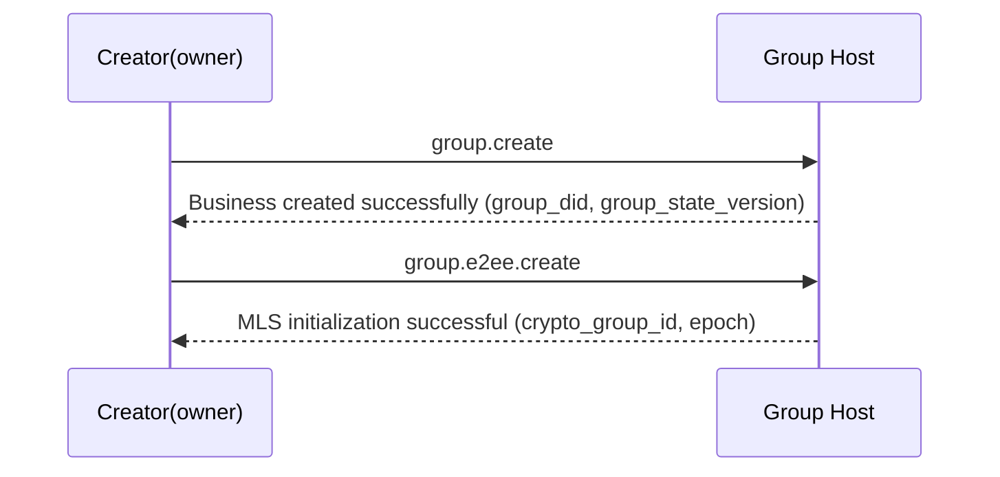
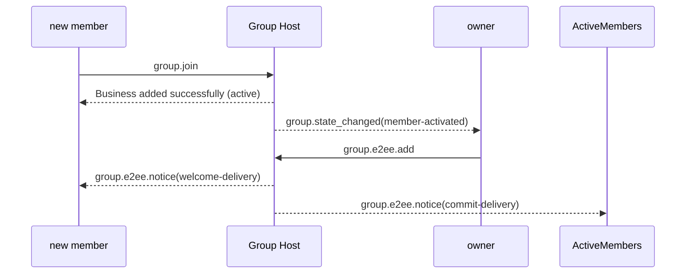
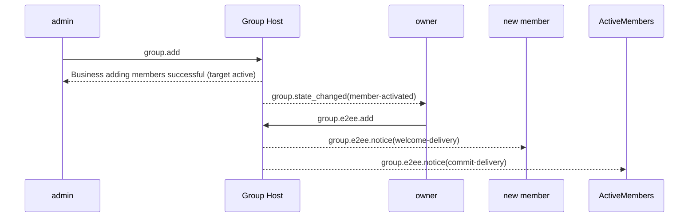
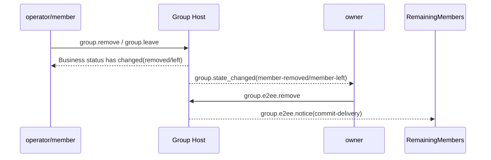
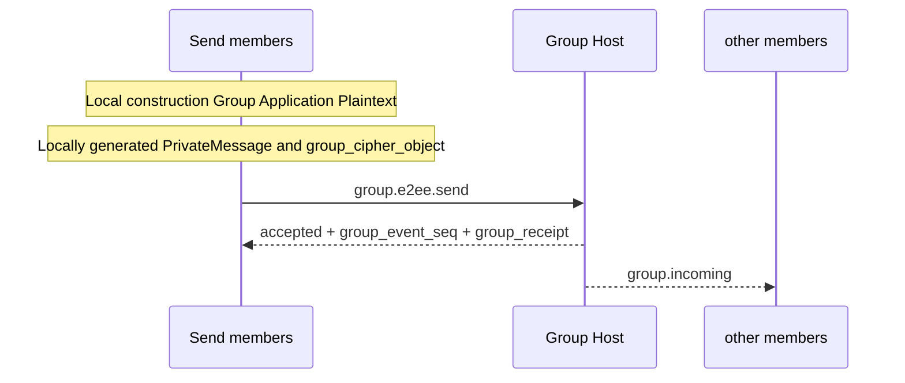

# ANP Profile 6: Group End-to-End Encryption (MLS Usage Profile Revised Draft)

- Document ID: ANP-P6
- Title: Group End-to-End Encryption
- Status: Draft
- Version: 0.3.2 (MLS Usage Profile Revised Draft)
- Language: English
- Applicability: This Profile is suitable for the group end-to-end encryption control layer based on Group DID and works closely with `anp.group.base.v1`.

---

## 1. Purpose

This Profile defines the group end-to-end encryption control layer of ANP, stipulating:

1. How to bind `group_did`, `group_state_version`, `group_event_seq` to the group cryptography state machine;
2. How to use MLS as the basic protocol for group key establishment, member changes, and application message protection;
3. How to bind the `did:wba` identity with MLS member credentials, KeyPackage, and leaf signature keys;
4. How to define a set of independent `group.e2ee.*` JSON-RPC methods to specifically carry MLS cryptographic actions;
5. How to work closely with `anp.group.base.v1` through **state coupling** instead of "embedding the MLS handshake object in the P4 method";
6. How to deal with `epoch`, `Welcome`, `PrivateMessage`, `PublicMessage`, `epoch_authenticator`, fork detection and recovery.

This Profile does not define:

- Pull historical messages;
- Read and online status;
- Device or internal copy concept;
- How to share group key status among multiple execution units within the Agent;
- Specific implementation of directory synchronization outside the group;
- end-to-end encryption for non-group scenarios;
- External Commit main line;
- `group_join_info` and `group.e2ee.get_join_info`;
- `accept_welcome` protocol method;
- The second set of business member status models.

---

## 2. Terminology and normative conventions

### 2.1 Normative keywords

In this document, **MUST**, **MUST NOT**, **REQUIRED**, **SHALL**, **SHALL NOT**, **SHOULD**, **SHOULD NOT**, **RECOMMENDED**, **NOT RECOMMENDED**, **MAY**, **OPTIONAL** are interpreted as normative requirements according to their capitalized form.

### 2.2 Terminology

- **Group DID**: The application layer global identifier of the group, that is, `group_did`.
- **Crypto Group ID**: Group cryptography internal identifier, corresponding to MLS `group_id`, which can be different from `group_did`.
- **Group Host Service**: A service responsible for group basic status sorting, policy application and group messages entry; not an MLS controller.
- **MLS Group State**: Group cryptographic state maintained based on MLS.
- **Epoch**: A generational advance in MLS group status.
- **KeyPackage**: MLS adding material object, used to add a new member to the group.
- **Welcome**: MLS welcome object, used to help new members initialize the group status.
- **PrivateMessage**: Encrypted MLS message with member authentication.
- **PublicMessage**: MLS message that is only signed and not encrypted.
- **did:wba Binding**: Bind an MLS leaf signature key, member credential, or KeyPackage to a `agent_did` verifiable proof object.
- **MLS Controller**: The subject responsible for executing MLS member change control actions. Fixed to group `owner` in v1.
- **State Coupling**: P4 and P6 do not do method-by-method mapping, but a coupling method that triggers cryptographic state advancement through business state changes.
- **E2EE Notice**: P6's self-defined independent encryption notification object, used to deliver cryptographic results such as `commit`, `welcome`, etc.
- **Fork**: Irreconcilable `epoch` / `epoch_authenticator` / state advancement sequences observed by different members for the same `group_did`.

---

## 3. Design principles

### 3.1 Group identity and cryptographic status stratification

This Profile clearly distinguishes between:

- `group_did`: Application layer group global identifier;
- `crypto_group_id`: cryptography group internal identifier;
- `group_state_version`: Application layer group status version assigned by Group Host;
- `epoch`: Cryptozoological group generations assigned by the MLS state machine.

The four MUST NOT be mechanically equivalent; but there MUST be a verifiable binding between them.

### 3.2 An Agent = an external group member

Within the external interworking boundary of this Profile, a group member is always represented by a `agent_did`. The protocol layer does not introduce the concept of devices, terminals, or internal replica members.

If there are multiple execution copies within an Agent, how they share or synchronize the MLS group status belongs to the internal implementation of the Agent and does not belong to the interoperability semantics of this Profile.

### 3.3 P4 is the main business protocol, and P6 is the cryptography control layer

The relationship between this Profile and `anp.group.base.v1` is as follows:

- P4 defines the business actions, business status, sorting semantics and receipt semantics of the group;
- P6 defines MLS cryptographic actions, cryptographic objects, binding rules and verification requirements;
- P4 is still the business layer authority;
- P6 **does not** redefine business member states such as `active / left / removed`;
- P6 does not require MLS native objects to be carried directly in the P4 method body.

### 3.4 State coupling instead of method-by-method mapping

The coupling between P4 and P6 is achieved through **state**, rather than through "a certain P4 method directly mapping a certain P6 method".

That is to say:

- P4 determines whether something is valid in business terms;
- P6 observes the business status changes and advances the MLS status.

For example:

- A group is successfully created in P4, and the creator has become `owner` → owner automatically executes `group.e2ee.create`
- A member becomes `active` in P4 and has not yet entered the MLS membership set → owner automatically executes `group.e2ee.add`
- A member becomes `left` or `removed` in P4 and is still in the MLS member set → owner automatically executes `group.e2ee.remove`

### 3.5 owner is the only MLS controller

In v1, only the owner assumes the MLS controller role.

owner is responsible for:

-Create MLS group;
- Execute `add`;
- Execute `remove`;
- Generate `commit` corresponding to member changes;
- Generate `welcome` for new members;
- Advance `epoch` after member changes.

### 3.6 Group Host is responsible for sorting, not MLS control

The responsibilities of Group Host Service are:

- Receive and sequence P4 business operations;
- Assign `group_event_seq` to accepted events;
- Advance `group_state_version`;
- Generate `group_receipt`;
- Distribute group messages and E2EE Notice;
- Witness the implementation of MLS control results at the business layer.

By default, Group Host Service:

- **SHOULD NOT** act as an MLS controller;
- **SHOULD NOT** serve as an MLS group member;
- **SHOULD NOT** hold group application plaintext decryption capabilities.

### 3.7 The owner manages the group status, and the active member manages group messages

owner only controls:

- Member changes;
- Group cryptography status advancement;
- `epoch` updated.

All `active` members can:

- Use the current group status to generate your own group messages ciphertext;
- Call `group.e2ee.send` to send your own group messages;
- Decrypt other members' group messages.

This Profile does not require that all group messages be encrypted by the owner.

### 3.8 v1 does not support External Commit

In v1:

- External Commit is not supported;
- `group_join_info` is not defined;
- `group.e2ee.get_join_info` is not defined;
- The `accept_welcome` protocol method is not defined.

All group entry paths are eventually unified into MLS `add` initiated by the owner at the cryptographic layer.

### 3.9 Only the message side enters PrivateMessage

In v1:

- Only the application message content of `group.e2ee.send` enters MLS `PrivateMessage` and is encrypted;
- `group.e2ee.create`, `group.e2ee.add`, `group.e2ee.remove` all continue to use plaintext JSON-RPC request bodies;
- `commit`, `welcome` and other objects appear as method inputs or Notice payloads instead of being embedded in the P4 business method body.

---

## 4. Dependency, Profile identification and target modeling

### 4.1 Profile name

The standard name of this Profile is:

`anp.group.e2ee.v1`

### 4.2 Dependencies

This Profile **MUST** depends on the following Profiles:

- `anp.core.binding.v1`
- `anp.identity.discovery.v1`
- `anp.group.base.v1`

### 4.3 Safe Mode

When using this Profile:

- `meta.profile` **MUST** be equal to `anp.group.e2ee.v1`.

Specifically:

- `group.e2ee.publish_key_package`, `group.e2ee.get_key_package`, `group.e2ee.notice` **MUST** use `transport-protected`
- `group.e2ee.create`, `group.e2ee.add`, `group.e2ee.remove`, `group.e2ee.send` **MUST** use `group-e2ee`

For `group.e2ee.send`, `group-e2ee` means that the message semantics it carries belong to the group E2EE side; it does not mean that its outer JSON-RPC request body is encrypted by the group again.

### 4.4 Method Goal Modeling

### 4.4.1 service-scoped

The following methods **MUST** be `service-scoped`:

- `group.e2ee.publish_key_package`
- `group.e2ee.get_key_package`
- `group.e2ee.create`

rule:

- `meta.target.kind = "service"`
- `meta.target.did` **MUST** equal target public `ANPMessageService.serviceDid`

The reason why `group.e2ee.create` is service-scoped is:
Before the success of the business layer `group.create`, the business status of the group has just been established. Although `group_did` has been generated, the creation action itself still completes cryptographic initialization for the group Host service endpoint, so v1 uniformly uses service-scoped.

### 4.4.2 group-addressed

The following methods **MUST** be `group-addressed`:

- `group.e2ee.add`
- `group.e2ee.remove`
- `group.e2ee.send`

rule:

- `meta.target.kind = "group"`
- `meta.target.did` **MUST** equal target `group_did`

### 4.4.3 agent-addressed notification

The following notifications **MUST** be `agent-addressed`:

- `group.e2ee.notice`

rule:

- `meta.target.kind = "agent"`
- `meta.target.did` **MUST** be equal to the notification recipient Agent DID

---

## 5. Cryptography Mainline and MTI Suite

### 5.1 Mainline Protocol

This Profile's group key mainline **MUST** be implemented based on MLS 1.0 semantics, but v1 only fixes a restricted usage subset of it.

v1 mainline includes at least:

-KeyPackage
-Add
- Remove
- Commit
- Welcome
-PrivateMessage
- Epoch advancement

Specifically:

- `commit_b64u` **MUST** Represented as raw bytes serialized by TLS for full MLS `MLSMessage` (`mls-public-message`);
- `welcome_b64u` **MUST** Represented as raw bytes of an MLS `Welcome` object serialized by TLS;
- `PrivateMessage` **MUST** serves as the only ciphertext bearer object for group application messages.

The MLS library **MAY** additionally supports standard capabilities such as `Update`, proposal batching, PSK, ReInit, etc.; however, these capabilities **do not belong** to the minimum protocol mainline of this Profile v1, and do not constitute interoperability requirements for v1.

### 5.2 Mandatory-to-Implement package

To ensure minimal interoperability, implementations conforming to this Profile MUST support the following MTI packages:

`MLS_128_DHKEMX25519_AES128GCM_SHA256_Ed25519`

### 5.3 Extra Kits

Implementation **MAY** supports more MLS suites, but:

- All members within the same group **MUST** agree on the kit used;
- If the group policy limit allows a collection of packages, the MLS Controller **MUST** reject packages that do not satisfy the policy.

### 5.4 Relationship with did:wba

The relationship between the main line of this Profile and did:wba is as follows:

- `authentication` / `assertionMethod` in the DID document are used for identity binding proof;
- `keyAgreement` **SHOULD** in the DID document contains at least one X25519 entry, indicating that the Agent has E2EE capabilities;
- The MLS group member's leaf signing key **SHOUNT** be directly equivalent to the DID long-term identity signing key;
- The leaf signature key **SHOULD** is generated separately and bound to `agent_did` via `did:wba Binding`.

---

## 6. did:wba and MLS binding model

### 6.1 Binding target

This Profile requires the following MLS elements to be bound to `agent_did`:

1. KeyPackage owner;
2. Current leaf signature key;
3. The identity string in the group member's credentials.

### 6.2 Credential Identity Rules

For this Profile, `credential.identity` **MUST** in the MLS member credential is equal to the UTF-8 byte string of `agent_did`.

Implement **MUST NOT** to replace `credential.identity` with a local account ID, device ID, numeric user ID, or other non-DID string.

### 6.3 `did_wba_binding` object

This Profile defines the `did_wba_binding` object used to bind the MLS leaf signature key to `agent_did`.

The recommended structure is as follows:

```json
{
  "agent_did": "did:wba:example.com:agents:alice:e1_<fingerprint>",
  "verification_method": "did:wba:example.com:agents:alice:e1_<fingerprint>#key-1",
  "leaf_signature_key_b64u": "BASE64URL_ED25519_LEAF_PK",
  "issued_at": "2026-03-29T12:00:00Z",
  "expires_at": "2026-04-29T12:00:00Z",
  "proof": {
    "type": "DataIntegrityProof",
    "cryptosuite": "eddsa-jcs-2022",
    "created": "2026-03-29T12:00:00Z",
    "proofPurpose": "assertionMethod",
    "verificationMethod": "did:wba:example.com:agents:alice:e1_<fingerprint>#key-1",
    "proofValue": "z..."
  }
}
```

For the default `e1_` did:wba, `did_wba_binding.proof` **MUST** use `DataIntegrityProof`, and `cryptosuite` **MUST** is `eddsa-jcs-2022`. The generation and verification of `did_wba_binding` **MUST** use "the entire `did_wba_binding` object after removing `proof`" as the protected document, and **MUST** follow the standard algorithm process required by did:wba document proof.

### 6.4 `did_wba_binding` Verification Rules

The recipient MUST complete the following verifications before accepting KeyPackage, LeafNode updates, or new members:

1. `agent_did` can be parsed;
2. `verification_method` exists in the DID document;
3. `verification_method` is authorized by the DID document's `assertionMethod` or an equivalent relationship allowed by the deployment policy;
4. `proof` exists; for default `e1_` did:wba, `proof.type`, `proof.cryptosuite`, `proof.created`, `proof.verificationMethod`, `proof.proofPurpose`, `proof.proofValue` **MUST** exist;
5. `proof` verified;
6. The document content bound to `proof` **MUST** covers at least `agent_did`, `leaf_signature_key_b64u`, `issued_at`, `expires_at`;
7. The actual leaf signature public key in KeyPackage / LeafNode is consistent with `leaf_signature_key_b64u`;
8. `credential.identity` and `agent_did` in the MLS certificate are consistent;
9. If `issued_at` / `expires_at` exists, implement **MUST** to verify its time window according to the local time validity policy.

### 6.5 `e1_` is compatible with `k1_`

- use `DataIntegrityProof + eddsa-jcs-2022` for default `e1_` DID, `did_wba_binding.proof` **MUST**;
- For compatible `k1_` DID, `did_wba_binding.proof` **MAY** use extension proof compatible with secp256k1; but when no explicit extension negotiation is made, v1 MTI **does not** bind `k1_` proof as the default interworking path;
- MTI leaf signature keys for MLS groups still **MAY** use Ed25519 regardless of the DID's identity curve, as long as the proof of binding holds.

---

## 7. Core objects

### 7.1 `crypto_group_id`

`crypto_group_id` represents the MLS's internal `group_id`.

The rules are as follows:

- `crypto_group_id` **MUST** treated as opaque bytes;
- In JSON, **MUST** be represented by `base64url`, and the field name is recommended to be `crypto_group_id_b64u`;
- `crypto_group_id` **MUST** establish a verifiable binding to `group_did`.

### 7.2 `group_state_ref`

This Profile reuses the `group_state_ref` concept of P4 and requires that the E2EE group contains at least:

- `group_did`
- `group_state_version`
- `policy_hash` (if group policy has been hashed)

### 7.3 `group_key_package`

This Profile definition group adds material packaging objects:

```json
{
  "key_package_id": "kp-001",
  "owner_did": "did:wba:example.com:agents:bob:e1_<fingerprint>",
  "suite": "MLS_128_DHKEMX25519_AES128GCM_SHA256_Ed25519",
  "mls_key_package_b64u": "BASE64URL_KEYPACKAGE",
  "did_wba_binding": { ... },
  "expires_at": "2026-04-30T00:00:00Z"
}
```

Specifically:

- `key_package_id` **MUST** exists;
- `owner_did` **MUST** exists;
- `suite` **MUST** exists;
- `mls_key_package_b64u` **MUST** exists;
- `did_wba_binding` **MUST** exists;
- `expires_at` **SHOULD** exists;
- `mls_key_package_b64u` **MUST** No padding base64url for the raw bytes of the MLS `KeyPackage` object after serialization by MLS 1.0 TLS.

`group_key_package` is mainly used for owner’s subsequent execution of `group.e2ee.add`.

### 7.4 `group_cipher_object`

`group_cipher_object` is the wire protocol message body object of `group.e2ee.send`.

The recommended structure is as follows:

```json
{
  "crypto_group_id_b64u": "BASE64URL_GROUPID",
  "epoch": "7",
  "private_message_b64u": "BASE64URL_PRIVATEMESSAGE",
  "group_state_ref": {
    "group_did": "did:wba:groups.example:team:dev:e1_<fingerprint>",
    "group_state_version": "42",
    "policy_hash": "sha-256:..."
  },
  "epoch_authenticator": "BASE64URL_AUTH"
}
```

rule:

- `crypto_group_id_b64u` **MUST** exists;
- `epoch` **MUST** exists;
- `private_message_b64u` **MUST** exists;
- `private_message_b64u` **MUST** No padding base64url for the raw bytes of the MLS `PrivateMessage` object serialized by MLS 1.0 TLS;
- `group_state_ref.group_did` **MUST** be equal to the outer target `group_did`.

### 7.5 `Group Application Plaintext`

Before group application messages enter MLS `PrivateMessage` for encryption, **MUST** be normalized into the following inner plaintext objects:

```json
{
  "application_content_type": "text/plain | application/json | application/anp-attachment-manifest+json | ...",
  "thread_id": "thr-001",
  "reply_to_message_id": "msg-0009",
  "annotations": {},
  "text": "...",
  "payload": {},
  "payload_b64u": "..."
}
```

rule:

- `application_content_type` **MUST** exists;
- `text` / `payload` / `payload_b64u` **MUST** Exactly one appears;
- The message semantic fields `thread_id`, `reply_to_message_id`, `annotations` in P4 under group E2EE **MUST** be located in this inner object;
- The sender **MUST** serializes the entire `Group Application Plaintext` object into a byte string using UTF-8 + RFC 8785 JCS before encryption; the receiver **MUST** interprets the object according to the same rules after decryption.

### 7.6 `e2ee_notice_object`

P6 defines an independent cryptographic notification object used to deliver cryptographic results.

The recommended structure is as follows:

```json
{
  "notice_id": "en-001",
  "notice_type": "commit-delivery | welcome-delivery",
  "group_did": "did:wba:groups.example:team:dev:e1_<fingerprint>",
  "group_state_ref": {
    "group_did": "did:wba:groups.example:team:dev:e1_<fingerprint>",
    "group_state_version": "43",
    "policy_hash": "sha-256:..."
  },
  "crypto_group_id_b64u": "BASE64URL_GROUPID",
  "epoch": "8",
  "subject_did": "did:wba:b.example:agents:bob:e1_<fingerprint>",
  "commit_b64u": "BASE64URL_MLSMESSAGE",
  "welcome_b64u": "BASE64URL_WELCOME",
  "ratchet_tree_b64u": "BASE64URL_RATCHET_TREE",
  "epoch_authenticator": "BASE64URL_AUTH",
  "group_receipt": { ... }
}
```

rule:

- `notice_type` **MUST** exists;
- `group_did` **MUST** exists;
- `group_state_ref` **MUST** exists;
- `crypto_group_id_b64u` **MUST** exists;
- `epoch` **MUST** exists;
- `commit_b64u` **MUST** be present when `notice_type = "commit-delivery"` is used;
- When `notice_type = "welcome-delivery"` is used, `welcome_b64u` and `ratchet_tree_b64u` **MUST** exist at the same time;
- `ratchet_tree_b64u` **MUST** No padding base64url for TLS serialization of raw bytes for ratchet tree;
- `group_receipt` **MAY** exists and is used to associate cryptographic results with business ordering positions.

---

## 8. KeyPackage publishing and discovery methods

### 8.1 `group.e2ee.publish_key_package`

#### 8.1.1 Semantics

A KeyPackage that can be used for group joining is published by an Agent to its own `ANPMessageService`.

#### 8.1.2 Request requirements

- `method = "group.e2ee.publish_key_package"`
- `meta.profile = "anp.group.e2ee.v1"`
- `meta.security_profile = "transport-protected"`
- `meta.target.kind = "service"`
- `meta.target.did` **MUST** be equal to `ANPMessageService.serviceDid` disclosed by the publisher itself
- `meta.sender_did` **MUST** exists
- `body.group_key_package` **MUST** exists
- `body.group_key_package.owner_did` **MUST** equal `meta.sender_did`

Authentication constraints:

- This method belongs to the **service-scoped** control plane method;
- The caller **MUST** be running in an authenticated local session or equivalent hop / service authentication context;
- v1 **Not required** additionally define a new business layer `actor_proof` for this method.

#### 8.1.3 Successful response

A successful response **MUST** contain at least:

- `published = true`
- `owner_did`
- `key_package_id`
- `published_at`

### 8.2 `group.e2ee.get_key_package`

#### 8.2.1 Semantics

Obtain an available KeyPackage through the target Agent's `ANPMessageService`.

#### 8.2.2 Request requirements

- `meta.profile = "anp.group.e2ee.v1"`
- `meta.security_profile = "transport-protected"`
- `meta.target.kind = "service"`
- `meta.target.did` **MUST** be equal to `ANPMessageService.serviceDid` exposed by the target Agent

`body` **MUST** contain:

- `target_did`

`body` **MAY** contain:

- `preferred_suite`
- `require_fresh`

Authentication constraints:

- This method belongs to the **service-scoped** control plane method;
- The minimum interoperability requirement for v1 is at least hop/service level authentication;
- **Anonymous retrieval of KeyPackage is not part of v1 MTI**.

#### 8.2.3 Successful response

A successful response **MUST** contain at least:

- `target_did`
- `group_key_package`

#### 8.2.4 Server-side distribution rules

`ANPMessageService` returns `group_key_package`:

- **SHOULD** returns KeyPackage that has not expired, not been revoked and not consumed;
- **MAY** Mark it as `reserved` or equivalent status after returning to avoid concurrent repeated issuance;
- When the corresponding `group.e2ee.add` is successfully accepted by the Group Host and the cryptographic membership change is completed, **MUST** mark it as `consumed` or delete it from the publishing set;
- If the corresponding process fails, is canceled or times out, whether to release the reserved KeyPackage is determined by the deployment strategy, but **SHOULD NOT** will cause the same KeyPackage to be concurrently reused by both `group.e2ee.add` that will succeed;
- Caller identity, rate limiting and anti-abuse policies **MUST** be implemented based on hop/service level authentication.

---

## 9. MLS control plane method

### 9.1 General

The methods in this chapter are independent JSON-RPC methods. They are not "additional fields" to the P4 business method, but are P6's own cryptographic control actions.

Specifically:

- `group.e2ee.create`, `group.e2ee.add`, `group.e2ee.remove` are **member change control methods**
- `group.e2ee.send` is the **message sending method**
- `group.e2ee.create/add/remove` is bound to the existing business state of P4, but **will not create a new P4 business member state**
- `group.e2ee.send` is directly used as an online delivery method and no longer undergoes `group.send` secondary packaging.

### 9.2 `group.e2ee.create`

#### 9.2.1 Semantics

Create a new MLS group status and add owner as the initial member.

#### 9.2.2 Caller

owner only.

#### 9.2.3 Request requirements

- `method = "group.e2ee.create"`
- `meta.profile = "anp.group.e2ee.v1"`
- `meta.security_profile = "group-e2ee"`
- `meta.target.kind = "service"`
- `meta.target.did` **MUST** be equal to `ANPMessageService.serviceDid` public by the target group Host
- `meta.sender_did` **MUST** be equal to the current group `owner`
- `auth.actor_proof` **MUST** exists

`body` **MUST** contain at least:

- `group_did`
- `group_state_ref`
- `suite`
- `creator_key_package`
- `crypto_group_id_b64u`
- `epoch`

rule:

- `creator_key_package.owner_did` **MUST** equal `meta.sender_did`
- `group_state_ref.group_did` **MUST** be equal to `body.group_did`
- `epoch` for initial group state **SHOULD** is `"0"` or an implementation explicitly agreed upon initial value

#### 9.2.4 Successful response

A successful response **MUST** contain at least:

- `created = true`
- `group_did`
- `group_state_ref`
- `crypto_group_id_b64u`
- `epoch`
- `accepted_at`

illustrate:

- `group.e2ee.create` itself **MUST NOT** Create a new P4 business group separately;
- It is only executed after `group.create` has been accepted by the business layer;
- It no longer spawns new `group_state_version` or `group_event_seq` independently.

### 9.3 `group.e2ee.add`

#### 9.3.1 Semantics

The owner executes MLS `add` to add a member who has become `active` at the business layer but has not yet entered the MLS membership set to the cryptography group.

#### 9.3.2 Caller

owner only.

#### 9.3.3 Request requirements

- `method = "group.e2ee.add"`
- `meta.profile = "anp.group.e2ee.v1"`
- `meta.security_profile = "group-e2ee"`
- `meta.target.kind = "group"`
- `meta.target.did` **MUST** equal target `group_did`
- `meta.sender_did` **MUST** be equal to the current group `owner`
- `auth.actor_proof` **MUST** exists

`body` **MUST** contain at least:

- `member_did`
- `group_state_ref`
- `group_key_package`
- `crypto_group_id_b64u`
- `epoch`
- `commit_b64u`
- `welcome_b64u`
- `ratchet_tree_b64u`

rule:

- `group_state_ref.group_did` **MUST** equal outer target `group_did`
- `group_key_package.owner_did` **MUST** be equal to `member_did`
- `commit_b64u` **MUST** No padding base64url for full MLS `MLSMessage` object serialized by TLS
- `welcome_b64u` **MUST** No padding base64url for MLS `Welcome` objects after serialization by TLS
- `ratchet_tree_b64u` **MUST** No padding base64url for TLS serialization of raw bytes for ratchet tree
- `epoch` **MUST** indicates the new `epoch` after this `add`

#### 9.3.4 Successful response

A successful response **MUST** contain at least:

- `accepted = true`
- `group_did`
- `member_did`
- `group_state_ref`
- `crypto_group_id_b64u`
- `epoch`
- `accepted_at`

illustrate:

- `group.e2ee.add` itself **MUST NOT** Change the P4 business status of the target member to `active`;
- The business status must have been determined by P4;
- This method is only responsible for implementing the business results to MLS.

### 9.4 `group.e2ee.remove`

#### 9.4.1 Semantics

The owner executes MLS `remove` to remove a member that has been changed to `removed` or `left` at the business layer from the cryptography group.

#### 9.4.2 Caller

owner only.

#### 9.4.3 Request requirements

- `method = "group.e2ee.remove"`
- `meta.profile = "anp.group.e2ee.v1"`
- `meta.security_profile = "group-e2ee"`
- `meta.target.kind = "group"`
- `meta.target.did` **MUST** equal target `group_did`
- `meta.sender_did` **MUST** be equal to the current group `owner`
- `auth.actor_proof` **MUST** exists

`body` **MUST** contain at least:

- `member_did`
- `group_state_ref`
- `crypto_group_id_b64u`
- `epoch`
- `commit_b64u`

rule:

- `commit_b64u` **MUST** No padding base64url for complete MLS `MLSMessage` object serialized by TLS
- `epoch` **MUST** represents the new `epoch` after this `remove`

#### 9.4.4 Successful response

A successful response **MUST** contain at least:

- `accepted = true`
- `group_did`
- `member_did`
- `group_state_ref`
- `crypto_group_id_b64u`
- `epoch`
- `accepted_at`

### 9.5 `group.e2ee.send`

#### 9.5.1 Semantics

Send an MLS encrypted group messages directly to a group.

#### 9.5.2 Caller

Any current `active` member.

#### 9.5.3 Request requirements

A conforming `group.e2ee.send` request **MUST** satisfies:

1. `method = "group.e2ee.send"`
2. `meta.profile = "anp.group.e2ee.v1"`
3. `meta.security_profile = "group-e2ee"`
4. `meta.target.kind = "group"`
5. `meta.target.did` **MUST** be the target `group_did`
6. `meta.sender_did` **MUST** be the current sender Agent DID
7. `meta.message_id` **MUST** exists
8. `meta.operation_id` **MUST** exists
9. `meta.content_type` **MUST** be fixed to `application/anp-group-cipher+json`
10. `auth.actor_proof` **MUST** exists
11. `body` **MUST** be directly `group_cipher_object`

illustrate:

- `group.e2ee.send` is directly the online sending method;
- It no longer wraps one more layer via P4 `group.send`.

#### 9.5.4 Successful response

A successful response **MUST** contain at least:

- `accepted = true`
- `group_did`
- `message_id`
- `operation_id`
- `group_event_seq`
- `group_state_version`
- `accepted_at`
- `epoch`
- `group_receipt`

This success semantics means:

- Group Host has accepted and sorted an MLS ciphertext object;
- It does not automatically mean that all members have successfully decrypted the message.

---

## 10. State coupling rules

### 10.1 General

The coupling between P4 and P6 is completed through **business status change**.  
This Profile no longer requires the maintenance of a method-by-method mapping table for `group.create -> create` and `group.add -> add`.

owner **MUST** be known via trusted state observation:

- A certain group has been created at the business layer;
- A member has become `active` at the business level;
- A member has become `left` or `removed` at the business level.

The status observation method **MAY** is:

- Internal orchestration of local and Group Host;
- Subscription to `group.state_changed`;
- Or other equivalent and reliable state observation mechanism.

### 10.2 Group creation coupling rules

When the owner observes that the following business states are simultaneously true:

- A certain `group_did` has been created;
- The creator is yourself;
- The group does not yet have any `crypto_group_id` attached to it

owner **MUST** triggers `group.e2ee.create` once.

### 10.3 Member joining coupling rules

When the owner observes that the following business states are simultaneously true:

- A certain `member_did` is already a `active` member of the group in P4;
- The member is not currently in the MLS membership;
- The member has `group_key_package` available

owner **MUST** triggers `group.e2ee.add` once.

This rule also applies to:

- `group.join`
- `group.add`
- Deployment extension invites to join
- Deployment extension approved

In other words, P4’s various service endpoints eventually converge to one `group.e2ee.add` at the cryptographic layer.

### 10.4 Member removal/outlier coupling rules

When the owner observes that the following business states are simultaneously true:

- A certain `member_did` has become `removed` or `left` in P4;
- The member is currently still in the MLS membership set

owner **SHOULD** triggers `group.e2ee.remove` once.

### 10.5 Message sending rules

`group.e2ee.send` is **not** a method of state coupling triggering.  
It is an online sending method explicitly initiated by members.

But its business consistency requirements are still tightly tied to P4:

- The sender **MUST** be a current member of `active`;
- Sender **MUST** meets P4 `group_policy.permissions.send`
- The semantics of `group_event_seq`, `group_state_version`, and `group_receipt` in the successful response follow the definition of group messages in P4.

---


## 11. MLS Usage Profile (normative)

### 11.1 General provisions and external normative references

This chapter defines the **restricted use subset and fixed configuration** of this Profile for MLS.  
The goal of this chapter is not to rewrite the MLS standards, but to provide:

- Which objects and state machine actions of MLS are allowed to be used in v1;
- How these objects are encoded in the online protocol;
- What local status and processing obligations do owner, active member, and Group Host need to bear respectively?
- What MLS semantics correspond to `group.e2ee.create`, `group.e2ee.add`, `group.e2ee.remove`, `group.e2ee.send`.

Implement **MUST NOT** to modify the core algorithm semantics of MLS; but when the default degrees of freedom of the MLS standard library conflict with the v1 restricted rules of this Profile, **MUST** shall prevail.

### Subset of MLS allowed in 11.2 v1

The MLS mainline of this Profile v1 only allows the following objects and actions to enter the interoperability boundary:

- `KeyPackage`
- `Add`
- `Remove`
- `Commit`
- `Welcome`
- `PrivateMessage`
- `epoch` Advancement

In this Profile v1:

- `commit_b64u` **MUST** corresponds to the complete MLS `MLSMessage`, whose wire format **MUST** is `mls-public-message`
- `welcome_b64u` **MUST** corresponds to MLS `Welcome`
- `private_message_b64u` **MUST** corresponds to MLS `PrivateMessage`

This Profile v1 **does not** include the following capabilities into the main interoperability line:

-External Commit
- `GroupInfo` / `group_join_info`
- `group.e2ee.get_join_info`
- Standalone `accept_welcome` protocol method
- Concurrent submission by multiple controllers
- Member changes initiated by non-owner
- `Update` as protocol-level mainline action
- proposal batching as an interoperability requirement
- ReInit, PSK, Subgroup or custom MLS extensions required as v1 MTI

The MLS library used by the implementation **MAY** supports the above capabilities; but when not explicitly extended for negotiation, **MUST NOT** bring them into v1 wire protocol interworking.

### 11.3 MTI suite and fixed algorithm

This Profile v1 **MUST** implements the following MTI suites:

`MLS_128_DHKEMX25519_AES128GCM_SHA256_Ed25519`

The corresponding fixed algorithm configuration is as follows:

- KEM/HPKE DH:`DHKEMX25519`
- AEAD:`AES-128-GCM`
- Hash/KDF Basics: `SHA-256`
- Leaf signature: `Ed25519`

Additionally, all JSON objects in this Profile that go into proof, AAD, or inner plaintext bindings MUST be encoded using UTF-8 + RFC 8785 JCS. This requirement applies at least to:

- protected object of `did_wba_binding`
- `Group Application Plaintext`
- `authenticated_data` of `group.e2ee.send`
- Authenticated binding object submitted by member change

### 11.4 MLS semantics of `group.e2ee.create`

`group.e2ee.create` is only executed after `group.create` has been accepted by the business layer.

When executing `group.e2ee.create`, owner's local MLS runtime **MUST**:

1. Verify `creator_key_package`
2. Verify `did_wba_binding`
3. Create a new MLS group state
4. Generate new `crypto_group_id`
5. Add owner as the first MLS member
6. Form initial `epoch`
7. Establish local persistent state of owner

`group.e2ee.create` **MUST NOT** Create new P4 business groups separately; it only creates corresponding initial MLS states for existing business groups.

### 11.5 MLS semantics of `group.e2ee.add`

`group.e2ee.add` is the only standard group cryptography mainline in v1.

When executing `group.e2ee.add`, owner's local MLS runtime **MUST**:

1. Obtain and verify the `group_key_package` of the target member
2. Verify `KeyPackage` and `did_wba_binding`
3. Verify that the target member has become `active` at the business layer
4. Execute MLS `Add` based on the current group status
5. Generate new `Commit`
6. Generate `Welcome` for new members
7. Export or construct ratchet tree materials sufficient for bootstrap of new members
8. Advance new `epoch`
9. Update owner local group status

Therefore, the main line of standard group cryptography in v1 is:

```text
KeyPackage
→ Add
→ Commit
→ Welcome
→ ratchet_tree
→ New epoch
```

To reduce implementation ambiguity, v1 stipulates:

- `commit_b64u` **MUST** TLS serialized raw bytes for full MLS `MLSMessage`;
- `welcome_b64u` **MUST** TLS serialized raw bytes for MLS `Welcome`;
- `ratchet_tree_b64u` **MUST** provided explicitly to new members individually;
- `welcome-delivery` **MUST NOT** relies on the library-level optional behavior "Welcome may come with ratchet tree internally".

### 11.6 MLS semantics of `group.e2ee.remove`

When executing `group.e2ee.remove`, owner's local MLS runtime **MUST**:

1. Verify that the target member has entered `removed` or `left` at the business layer
2. Verify that the member is still in the MLS membership set
3. Execute MLS `Remove` based on the current group status
4. Generate new `Commit`
5. Promote new `epoch`
6. Update owner local group status
7. Make the removed members lose the ability to decrypt subsequent messages

The line protocol output **MUST** for `group.e2ee.remove` contains at least:

- `commit_b64u`
- `crypto_group_id_b64u`
- `epoch`
- `group_state_ref`

### 11.7 Encryption semantics of `group.e2ee.send`

When a sender calls `group.e2ee.send`, its local MLS runtime **MUST**:

1. Verify that you are currently a member of `active`
2. Verify that it meets P4 `permissions.send`
3. Construct `Group Application Plaintext`
4. Construct `authenticated_data` defined in Chapter 13
5. Use the current MLS group state to encrypt the inner plaintext into MLS `PrivateMessage`
6. Construct `group_cipher_object`
7. Submit the object to the Group Host as `group.e2ee.send` of `body`

Success with `group.e2ee.send` simply means:

- Group Host has accepted and sorted an MLS ciphertext object;
- It does not automatically mean that all members have successfully decrypted the message.

### 11.8 group messages Decryption Obligation

After the receiving member receives the ciphertext object corresponding to `group.e2ee.send`, **MUST**:

1. Find the local corresponding MLS group state based on `group_did`
2. Verify that `crypto_group_id_b64u` is consistent with local binding
3. Verify whether `epoch` is within the acceptable window
4. Decrypt `private_message_b64u` using local MLS state
5. Verification `authenticated_data`
6. Parse inner layer `Group Application Plaintext`
7. Only after all checks pass, the message is delivered to the upper layer

If any step fails, the receiver **MUST NOT** delivers the message to the application layer as a valid group messages.

### 11.9 Local Processing Obligations for `group.e2ee.notice`

#### 11.9.1 `commit-delivery`

When receiving `notice_type = "commit-delivery"`, the receiving local MLS runtime **MUST**:

1. Decode `commit_b64u`
2. Verify `group_did`, `group_state_ref`, `crypto_group_id_b64u`, `epoch`
3. Apply the commit to the local MLS group state
4. Update local current `epoch`
5. Document necessary `epoch_authenticator` or consistency status if present

#### 11.9.2 `welcome-delivery`

New member local MLS runtime **MUST** when receiving `notice_type = "welcome-delivery"`:

1. Decode `welcome_b64u`
2. Decode `ratchet_tree_b64u`
3. Verify `group_did`, `group_state_ref`, `crypto_group_id_b64u`, `epoch`
4. Initialize the local MLS group state with `welcome_b64u` + `ratchet_tree_b64u`
5. Bind the status to local `group_did`
6. Prepare to receive subsequent `commit-delivery` and group messages

Welcome handling is a local behavior specification, not a new JSON-RPC protocol method.

### 11.10 Local persistent state requirements

In order to ensure achievability across restarts and across notification timings, each participant **SHOULD** must at least persist the following states.

#### 11.10.1 owner

owner **SHOULD** is at least persistent:

- `group_did`
- `crypto_group_id`
- Current `epoch`
- Current MLS group state
- The synchronized member set view of the current business layer
- A reference to the `add/remove` results of the most recent successful application

#### 11.10.2 active member

Ordinary active members **SHOULD** be at least persistent:

- `group_did`
- `crypto_group_id`
- Currently available MLS group state
- Current `epoch`
- The most recent successfully applied `commit/welcome` reference

#### 11.10.3 Group Host

Group Host **SHOULD** At least persistent:

- `group_state_version`
- `group_event_seq`
- `group_receipt`
- Outer binding references to `crypto_group_id`, `epoch`

Group Host defaults to **not required** persistence of MLS private state that can decrypt group messages.

### MLS capabilities not supported in 11.11 v1

In addition to the exclusions listed in Section 11.2, this Profile v1 does not support:

- Expose `Update` as a separate protocol-level action
- Deliver cryptographic results for unbound `group_state_ref` via notice
- Rely on MLS library to implicitly and automatically restore missing tree material
- Let non-owner members submit `Commit` that changes the membership set
- Let the Group Host complete the final MLS validity judgment on behalf of the members

---

## 12. Independent notification model

### 12.1 General

P6 defines independent notifications by yourself:

- `group.e2ee.notice`

It does not reuse P4's `group.state_changed` to pass Welcome or Commit.  
P4's `group.state_changed` continues to be only responsible for **business status changes**;
P6's `group.e2ee.notice` is specifically responsible for cryptographic result delivery.

### 12.2 `group.e2ee.notice`

#### 12.2.1 Semantics

Directly deliver group cryptography-related result objects to a target Agent.

#### 12.2.2 Notification envelope constraints

- `method = "group.e2ee.notice"`
- `meta.profile = "anp.group.e2ee.v1"`
- `meta.security_profile = "transport-protected"`
- `meta.target.kind = "agent"`
- `meta.target.did` **MUST** equal to the current notification recipient DID
- `meta.sender_did` **SHOULD** is equal to `group_did`
- `body` **MUST** directly carries `e2ee_notice_object`

### 12.3 `notice_type = "commit-delivery"`

For delivery to current MLS members:

- `commit_b64u`
- New `epoch`
- New `epoch_authenticator` (if available)

After receiving it, the receiver should process the commit according to the local MLS runtime rules.

### 12.4 `notice_type = "welcome-delivery"`

For targeted delivery to new members:

- `welcome_b64u`
- `ratchet_tree_b64u`
- New `epoch`
- `group_state_ref`

The rules are as follows:

- `welcome_b64u` **MUST** TLS serialized raw bytes for MLS `Welcome`;
- `ratchet_tree_b64u` **MUST** Serialize raw bytes for TLS for ratchet tree;
- This notice **MUST NOT** be sent to a recipient other than the intended new member;
- New member **MUST** Use `welcome_b64u + ratchet_tree_b64u` to complete local bootstrap.

### 12.5 Relationship to P4 Notifications

- P4 `group.state_changed`: only carries business events
- P4 `group.incoming`: Continue to carry group messages delivery
- P6 `group.e2ee.notice`: only carries cryptographic notice

In this way, the boundaries between the three are clear and they do not pretend to be each other.

---

## 13. Binding, AAD and Authentication Requirements

### 13.1 Minimum binding set

The following fields **MUST** enter the authenticated binding scope:

- `group_did`
- `crypto_group_id`
- `group_state_version` (or `group_state_ref`)
- `policy_hash` (if present)
- `meta.sender_did`
- `meta.message_id` / `meta.operation_id`
- `meta.security_profile = group-e2ee`

### 13.1.1 `group.e2ee.send` of `authenticated_data`

`group.e2ee.send` When using MLS `PrivateMessage`, its `authenticated_data` **MUST** be the UTF-8 + RFC 8785 JCS encoded byte string of the following JSON object:

```json
{
  "content_type": "application/anp-group-cipher+json",
  "group_did": "<outer meta.target.did>",
  "crypto_group_id_b64u": "<body.crypto_group_id_b64u>",
  "group_state_ref": { "...": "..." },
  "security_profile": "group-e2ee",
  "sender_did": "<outer meta.sender_did>",
  "message_id": "<outer meta.message_id>",
  "operation_id": "<outer meta.operation_id>"
}
```

### 13.1.2 Submission binding of `group.e2ee.add/remove`

When owner generates `commit_b64u` locally, **SHOULD** puts at least the following semantics into its authenticated binding scope (such as MLS `authenticated_data` or equivalent context):

```json
{
  "group_did": "<outer meta.target.did>",
  "crypto_group_id_b64u": "<body.crypto_group_id_b64u>",
  "group_state_ref": { "...": "..." },
  "subject_method": "group.e2ee.add | group.e2ee.remove",
  "member_did": "<body.member_did>",
  "epoch": "<body.epoch>",
  "security_profile": "group-e2ee",
  "sender_did": "<outer meta.sender_did>",
  "operation_id": "<outer meta.operation_id>"
}
```

All default optional fields **MUST** be omitted directly, **MUST NOT** use `null`, empty string or other placeholder values ​​to replace the omitted fields.

### 13.2 KeyPackage verification

Before the receiver accepts a KeyPackage for joining the group, **MUST**:

1. Decoding MLS `KeyPackage`
2. Verify that its protocol version and suite meet the requirements of this group
3. Verify that it has not expired, been revoked and has not been marked as consumed
4. Verify that `leaf_node` is valid for `KeyPackage`
5. Verify the `KeyPackage` signature using the public key in `leaf_node.credential`
6. Verification `credential.identity == owner_did`
7. Verification `did_wba_binding`
8. Verify that the leaf signature public key is consistent with `did_wba_binding.leaf_signature_key_b64u`

If a KeyPackage has been successfully used once for `group.e2ee.add` and accepted by the Group Host, then implementations **MUST NOT** treat it as valid join material for reuse, unless the deployment explicitly declares a last-resort exception.

### 13.3 `group.e2ee.send` Request Verification

Before a Group Host accepts a `group.e2ee.send`, **MUST** verify at least:

1. `auth.actor_proof` is legal
2. `group_did` exists and can be managed by the current Host
3. `group_state_ref.group_did` is consistent with the outer target
4. `meta.sender_did` is currently a member of `active`
5. `group_policy.permissions.send` allows this sender
6. `group_cipher_object` fields are complete and in the correct format

### 13.4 `group.e2ee.add/remove` Request Verification

Before a Group Host accepts a `group.e2ee.add` or `group.e2ee.remove`, **MUST** verify at least:

1. `auth.actor_proof` is legal
2. `meta.sender_did` is currently the group `owner`
3. `group_state_ref.group_did` is consistent with the outer target
4. `crypto_group_id` is consistent with the current cryptographic binding of the group
5. `member_did` is semantically consistent with the request target
6. The `commit_b64u` (and `welcome_b64u`, if present) field format is legal

### 13.5 `group.e2ee.create` Request Verification

Before a Group Host accepts a `group.e2ee.create`, **MUST** verify at least:

1. `auth.actor_proof` is legal
2. `meta.sender_did` is the current business layer owner
3. `creator_key_package.owner_did` is consistent with `meta.sender_did`
4. `crypto_group_id_b64u`, `epoch`, `group_state_ref` fields are complete
5. There is currently no accepted MLS initial status for this group.

---

## 14. Sorting, Epoch, receipt and forks

### 14.1 Sorting Responsibilities

- P4 business operations and `group.e2ee.send` enter the group event sequencing link from the Group Host;
- `group.e2ee.create/add/remove` is a cryptographic control action bound to the existing business state, **MUST NOT** create a new P4 `group_state_version` independently;
- Relevant cryptography results are delivered via `group.e2ee.notice`.

### 14.2 `epoch` processing

- `epoch` **MUST** expressed in the outer object as a decimal string;
- The receiver **MUST** reject application messages that are obviously old and outside the tolerance window;
- The implementation **MAY** reserve a finite old-epoch decryption window for delayed messages, but **MUST** set an upper limit.

### 14.3 `epoch_authenticator`

If the library can export `epoch_authenticator` or an equivalent consistency token, implementations **SHOULD** bind it to:

- `group_cipher_object`
- `group.e2ee.notice`
- `group_receipt` (if applicable)

Expose this value so that members can do consistency checks.

### 14.4 Groupreceipt

- `group_receipt` continues to be generated by Group Host;
- For `group.e2ee.send`, `group_receipt` are still standard return fields;
- For `group.e2ee.add/remove/create`, `group_receipt` **MAY** appears as additional information of `group.e2ee.notice` and is used to anchor the cryptographic results to the corresponding business status.

### 14.5 Fork detection

If a member observes:

- The same `group_did` corresponds to multiple irreconcilable `crypto_group_id`
- Inconsistent `epoch_authenticator` in the same or adjacent states
- There are different valid `Commit` in the same context

Then implement **SHOULD** to mark the group as `fork-suspected` and suspend the sending of new group messages until the status is reconfirmed.

---

## 15. Flow chart chapter

### 15.1 group creation process



### 15.2 Self-service joining process (open-join)



### 15.3 Direct adding members process (admin-add)



### 15.4 Removal/Outlier Process



### 15.5 group messages sending process



---

## 16. Security and Policy Requirements

### 16.1 Host does not replace member encryption permissions

Group Host **MUST NOT** Since it is responsible for sorting, it is considered to have group plaintext decryption capabilities.

### 16.2 Relationship between `actor_proof` and MLS member signatures

- `auth.actor_proof` proves "who requested this action at the application layer";
- MLS member signature/commit object proves "which cryptographic group member produced this ciphertext or commit".

Both **MUST NOT** replace each other.

### 16.3 group policy takes precedence over pure cryptography ability

Even if a member "can generate some kind of Proposal/Commit/PrivateMessage" from a pure MLS perspective, whether the application layer allows its execution is still **MUST** determined by P4's `group_policy`.

### 16.4 Sending permissions for `group.e2ee.send`

Only if sender:

- Currently a member of `active`;
- Meets `group_policy.permissions.send`;

The Group Host can only accept `group.e2ee.send`.

### 16.5 owner as sole controller

As long as v1 is not extended to the multi-controller model, then:

- Only owner can call `group.e2ee.create/add/remove`
- admin cannot call these methods directly
- The business layer actions of admin only affect the P4 status, and are eventually implemented to MLS by owner

---

## 17. Profile specific errors (recommended)

On the premise of following the ANP Core public error model, this Profile recommends the following `anp_code`:

| `code` | `anp_code` |meaning|
|---|---|---|
| 5000 | `group.e2ee.key_package_not_found` |No available KeyPackage found|
| 5001 | `group.e2ee.invalid_key_package` |KeyPackage is invalid|
| 5002 | `group.e2ee.did_binding_invalid` |did:wba binding verification failed|
| 5003 | `group.e2ee.controller_required` |The current caller is not an MLS controller|
| 5004 | `group.e2ee.state_not_ready` |The corresponding business status is not ready yet|
| 5005 | `group.e2ee.epoch_conflict` |epoch conflict|
| 5006 | `group.e2ee.crypto_group_mismatch` |`group_did` is inconsistent with `crypto_group_id` bindings|
| 5007 | `group.e2ee.private_message_invalid` |group messagesInvalid ciphertext object|
| 5008 | `group.e2ee.commit_invalid` |Commit object is invalid|
| 5009 | `group.e2ee.welcome_invalid` |Welcome object is invalid|
| 5010 | `group.e2ee.fork_suspected` |Potential fork detected|
| 5011 | `group.e2ee.notice_type_unsupported` |Unsupported E2EE Notice type|
| 5012 | `group.e2ee.key_package_consumed` |KeyPackage has been consumed and cannot be reused|

---

## 18. Minimum interoperability requirements

An implementation conforming to this Profile MUST support at least:

1. `MLS_128_DHKEMX25519_AES128GCM_SHA256_Ed25519`
2. MLS Usage Profile Restricted Use Subset as defined in Chapter 11
3. `group.e2ee.publish_key_package`
4. `group.e2ee.get_key_package`
5. `group.e2ee.create`
6. `group.e2ee.add`
7. `group.e2ee.remove`
8. `group.e2ee.send`
9. did:wba binding verification
10. Service-scoped target model of `group.e2ee.create`
11. The group-addressed target model of `group.e2ee.add/remove/send`
12. `group.e2ee.notice`’s agent-addressed notification model
13. owner as sole MLS controller
14. Driven by P4 business status `create/add/remove`
15. `group.e2ee.send` sends MLS ciphertext directly without `group.send` packaging
16. `group.e2ee.notice` is used for `welcome-delivery` and `commit-delivery`
17. Explicit delivery of `ratchet_tree_b64u` in `welcome-delivery`
18. `group.incoming` continues to receive notifications as group messages
19. Only the message side enters `PrivateMessage`
20. The business semantics of `group_receipt`, `group_state_version`, and `group_event_seq` are consistent with P4

This Profile v1 **not required**:

-External Commit
- `group_join_info`
- `group.e2ee.get_join_info`
- `accept_welcome`
- Standalone `get_state` method
- `Update` as protocol-level mainline action
- Concurrent submission by multiple controllers

---

## 19. Example

### 19.1 `group.e2ee.publish_key_package` Example

```json
{
  "jsonrpc": "2.0",
  "id": "req-gk-001",
  "method": "group.e2ee.publish_key_package",
  "params": {
    "meta": {
      "anp_version": "1.0",
      "profile": "anp.group.e2ee.v1",
      "security_profile": "transport-protected",
      "sender_did": "did:wba:a.example:agents:alice:e1_<fingerprint>",
      "target": {
        "kind": "service",
        "did": "did:wba:a.example"
      },
      "operation_id": "op-gk-001",
      "created_at": "2026-03-29T16:00:00Z"
    },
    "body": {
      "group_key_package": {
        "key_package_id": "kp-001",
        "owner_did": "did:wba:a.example:agents:alice:e1_<fingerprint>",
        "suite": "MLS_128_DHKEMX25519_AES128GCM_SHA256_Ed25519",
        "mls_key_package_b64u": "BASE64URL_KEYPACKAGE",
        "did_wba_binding": {
          "agent_did": "did:wba:a.example:agents:alice:e1_<fingerprint>",
          "verification_method": "did:wba:a.example:agents:alice:e1_<fingerprint>#key-1",
          "leaf_signature_key_b64u": "BASE64URL_ED25519_LEAF_PK",
          "issued_at": "2026-03-29T16:00:00Z",
          "expires_at": "2026-04-29T16:00:00Z",
          "proof": {
            "type": "DataIntegrityProof",
            "cryptosuite": "eddsa-jcs-2022",
            "created": "2026-03-29T16:00:00Z",
            "proofPurpose": "assertionMethod",
            "verificationMethod": "did:wba:a.example:agents:alice:e1_<fingerprint>#key-1",
            "proofValue": "z..."
          }
        },
        "expires_at": "2026-04-30T00:00:00Z"
      }
    }
  }
}
```

### 19.2 `group.e2ee.create` Example

```json
{
  "jsonrpc": "2.0",
  "id": "req-gec-001",
  "method": "group.e2ee.create",
  "params": {
    "meta": {
      "anp_version": "1.0",
      "profile": "anp.group.e2ee.v1",
      "security_profile": "group-e2ee",
      "sender_did": "did:wba:a.example:agents:alice:e1_<fingerprint>",
      "target": {
        "kind": "service",
        "did": "did:wba:groups.example"
      },
      "operation_id": "op-gec-001",
      "created_at": "2026-03-29T16:10:00Z"
    },
    "auth": {
      "scheme": "anp-rfc9421-origin-proof-v1",
      "actor_proof": {
        "contentDigest": "sha-256=:BASE64_DIGEST:",
        "signatureInput": "sig1=(\"@method\" \"@target-uri\" \"content-digest\");created=1774797000;expires=1774797060;nonce=\"n-create\";keyid=\"did:wba:a.example:agents:alice:e1_<fingerprint>#key-1\"",
        "signature": "sig1=:BASE64_SIGNATURE:"
      }
    },
    "body": {
      "group_did": "did:wba:groups.example:team:dev:e1_<fingerprint>",
      "group_state_ref": {
        "group_did": "did:wba:groups.example:team:dev:e1_<fingerprint>",
        "group_state_version": "1",
        "policy_hash": "sha-256:abcd"
      },
      "suite": "MLS_128_DHKEMX25519_AES128GCM_SHA256_Ed25519",
      "creator_key_package": {
        "key_package_id": "kp-owner-001",
        "owner_did": "did:wba:a.example:agents:alice:e1_<fingerprint>",
        "suite": "MLS_128_DHKEMX25519_AES128GCM_SHA256_Ed25519",
        "mls_key_package_b64u": "BASE64URL_KEYPACKAGE",
        "did_wba_binding": { "agent_did": "did:wba:a.example:agents:alice:e1_<fingerprint>" }
      },
      "crypto_group_id_b64u": "BASE64URL_GROUPID",
      "epoch": "0"
    }
  }
}
```

### 19.3 `group.e2ee.add` Example

```json
{
  "jsonrpc": "2.0",
  "id": "req-gea-001",
  "method": "group.e2ee.add",
  "params": {
    "meta": {
      "anp_version": "1.0",
      "profile": "anp.group.e2ee.v1",
      "security_profile": "group-e2ee",
      "sender_did": "did:wba:a.example:agents:alice:e1_<fingerprint>",
      "target": {
        "kind": "group",
        "did": "did:wba:groups.example:team:dev:e1_<fingerprint>"
      },
      "operation_id": "op-gea-001",
      "created_at": "2026-03-29T16:20:00Z"
    },
    "auth": {
      "scheme": "anp-rfc9421-origin-proof-v1",
      "actor_proof": {
        "contentDigest": "sha-256=:BASE64_DIGEST:",
        "signatureInput": "sig1=(\"@method\" \"@target-uri\" \"content-digest\");created=1774797600;expires=1774797660;nonce=\"n-add\";keyid=\"did:wba:a.example:agents:alice:e1_<fingerprint>#key-1\"",
        "signature": "sig1=:BASE64_SIGNATURE:"
      }
    },
    "body": {
      "member_did": "did:wba:b.example:agents:bob:e1_<fingerprint>",
      "group_state_ref": {
        "group_did": "did:wba:groups.example:team:dev:e1_<fingerprint>",
        "group_state_version": "2",
        "policy_hash": "sha-256:efgh"
      },
      "group_key_package": {
        "key_package_id": "kp-bob-001",
        "owner_did": "did:wba:b.example:agents:bob:e1_<fingerprint>",
        "suite": "MLS_128_DHKEMX25519_AES128GCM_SHA256_Ed25519",
        "mls_key_package_b64u": "BASE64URL_KEYPACKAGE",
        "did_wba_binding": { "agent_did": "did:wba:b.example:agents:bob:e1_<fingerprint>" }
      },
      "crypto_group_id_b64u": "BASE64URL_GROUPID",
      "epoch": "1",
      "commit_b64u": "BASE64URL_MLSMESSAGE_COMMIT",
      "welcome_b64u": "BASE64URL_WELCOME",
      "ratchet_tree_b64u": "BASE64URL_RATCHET_TREE"
    }
  }
}
```

### 19.4 `group.e2ee.send` Example

```json
{
  "jsonrpc": "2.0",
  "id": "req-ges-001",
  "method": "group.e2ee.send",
  "params": {
    "meta": {
      "anp_version": "1.0",
      "profile": "anp.group.e2ee.v1",
      "security_profile": "group-e2ee",
      "sender_did": "did:wba:a.example:agents:alice:e1_<fingerprint>",
      "target": {
        "kind": "group",
        "did": "did:wba:groups.example:team:dev:e1_<fingerprint>"
      },
      "operation_id": "msg-ges-001",
      "message_id": "msg-ges-001",
      "content_type": "application/anp-group-cipher+json",
      "created_at": "2026-03-29T16:30:00Z"
    },
    "auth": {
      "scheme": "anp-rfc9421-origin-proof-v1",
      "actor_proof": {
        "contentDigest": "sha-256=:BASE64_DIGEST:",
        "signatureInput": "sig1=(\"@method\" \"@target-uri\" \"content-digest\");created=1774798200;expires=1774798260;nonce=\"n-send\";keyid=\"did:wba:a.example:agents:alice:e1_<fingerprint>#key-1\"",
        "signature": "sig1=:BASE64_SIGNATURE:"
      }
    },
    "body": {
      "crypto_group_id_b64u": "BASE64URL_GROUPID",
      "epoch": "1",
      "private_message_b64u": "BASE64URL_PRIVATEMESSAGE",
      "group_state_ref": {
        "group_did": "did:wba:groups.example:team:dev:e1_<fingerprint>",
        "group_state_version": "2",
        "policy_hash": "sha-256:efgh"
      },
      "epoch_authenticator": "BASE64URL_AUTH"
    }
  }
}
```

### 19.5 `group.e2ee.notice` Example (welcome-delivery)

```json
{
  "jsonrpc": "2.0",
  "method": "group.e2ee.notice",
  "params": {
    "meta": {
      "profile": "anp.group.e2ee.v1",
      "security_profile": "transport-protected",
      "sender_did": "did:wba:groups.example:team:dev:e1_<fingerprint>",
      "target": {
        "kind": "agent",
        "did": "did:wba:b.example:agents:bob:e1_<fingerprint>"
      },
      "operation_id": "op-notice-001",
      "created_at": "2026-03-29T16:21:00Z"
    },
    "body": {
      "notice_id": "en-001",
      "notice_type": "welcome-delivery",
      "group_did": "did:wba:groups.example:team:dev:e1_<fingerprint>",
      "group_state_ref": {
        "group_did": "did:wba:groups.example:team:dev:e1_<fingerprint>",
        "group_state_version": "2",
        "policy_hash": "sha-256:efgh"
      },
      "crypto_group_id_b64u": "BASE64URL_GROUPID",
      "epoch": "1",
      "subject_did": "did:wba:b.example:agents:bob:e1_<fingerprint>",
      "welcome_b64u": "BASE64URL_WELCOME",
      "ratchet_tree_b64u": "BASE64URL_RATCHET_TREE"
    }
  }
}
```

---

## 20. Registry placeholder

Subsequent versions of this standard **SHOULD** establish the following registry:

1. Group E2EE suite registration form;
2. did:wba Binding certification type registry;
3. `group.e2ee.notice.notice_type` registry;
4. Group E2EE error code registry.

---

## 21. Reference implementation description (non-normative)

When implementing this Profile, the implementer should regard it as:

- MLS control layer that works closely with `anp.group.base.v1`;
- A group E2EE model in which the owner is responsible for member change control and members are responsible for sending ordinary messages;
- A convergent scheme that drives `create/add/remove` through state changes;
- Complete the solution for `commit` and `welcome` delivery through independent `group.e2ee.notice`.

For future versions, further consideration may be given to:

- admin as alternate MLS controller;
- Multi-controller collaboration;
- External Commit is reintroduced as an optional extension;
- More detailed fork recovery mechanism;
- Post-Quantum Swarm Kit.
