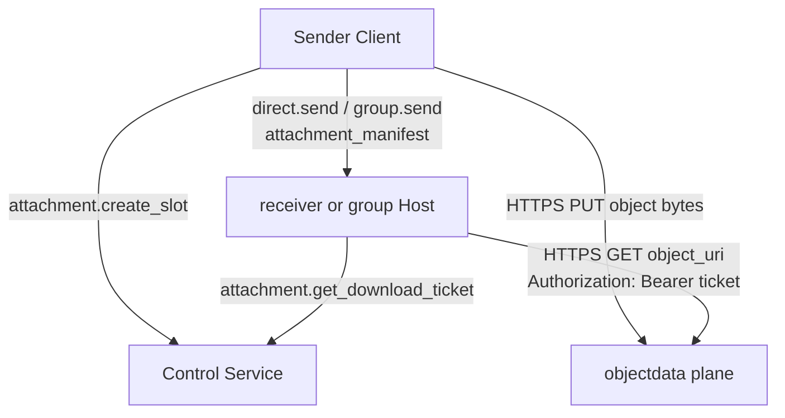
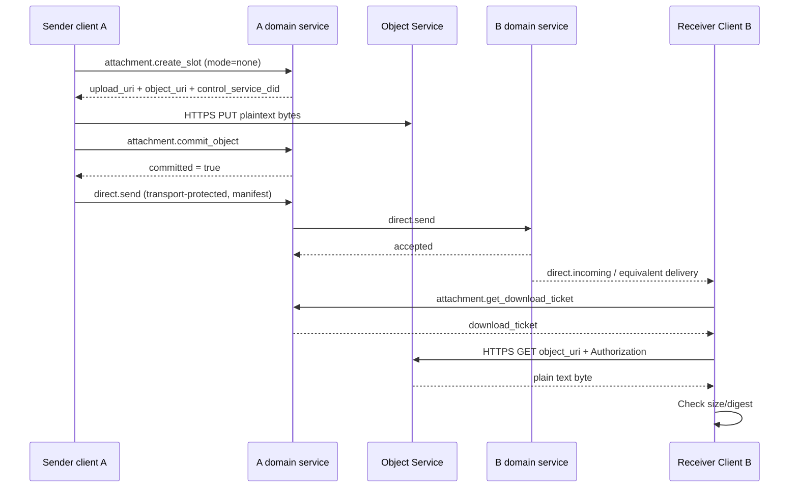
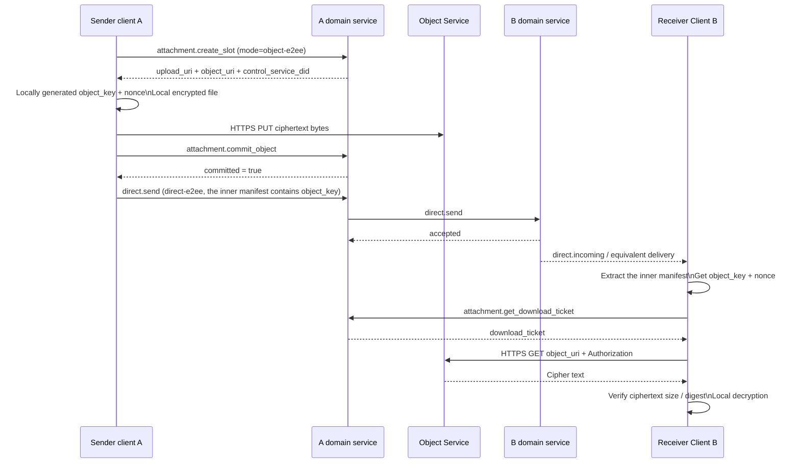
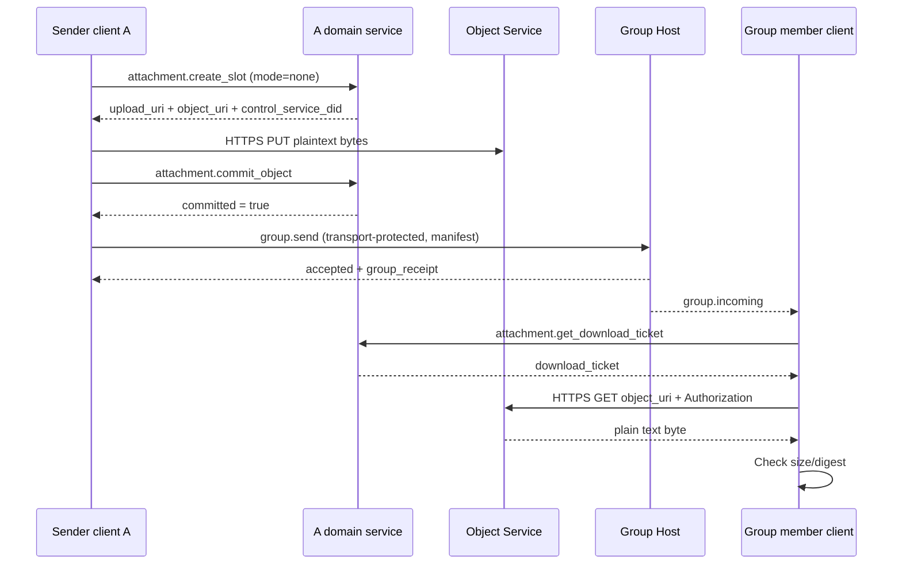
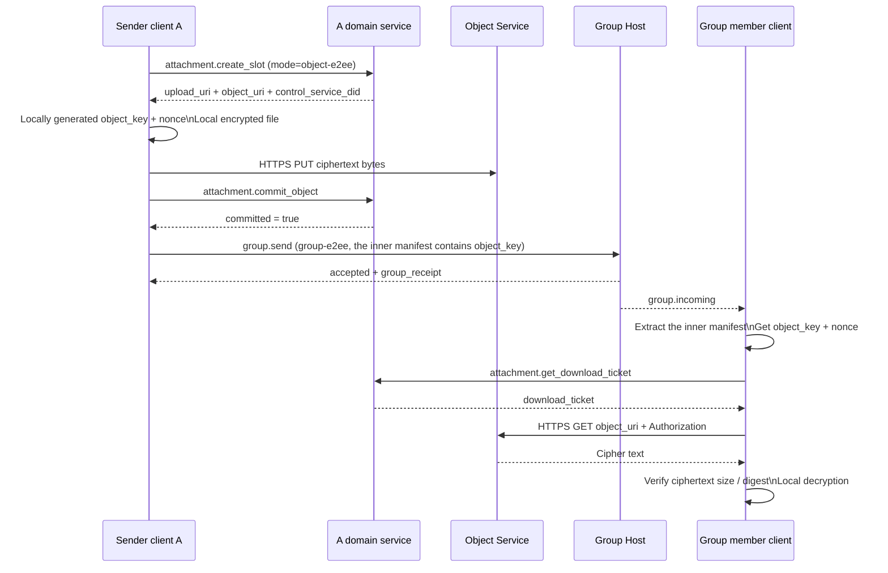

# ANP Profile 7: Attachments and Object Transfer

- Document ID: ANP-P7
- Title: Attachments and Object Transfer
- Status: Draft
- Version: 0.5.0
- Language: English
- Applicability: This Profile applies to the interoperability semantics of attachments, large objects and media objects in ANP, and supports direct messaging, group messaging, unencrypted message bearers and end-to-end encryption message bearers.

---

## 1. Purpose

This Profile defines the attachment and object transfer semantics of ANP, stipulating:

1. How to express attachments in direct messaging and group messaging;
2. How to carry unified `attachment_manifest` in non-E2EE and E2EE messages;
3. How to split attachment transmission into three layers: message plane, control plane, and data plane;
4. How to upload and download object content through independent HTTPS channels;
5. How to reduce the risk of link leakage through object location URI, short-term download ticket and object-level encryption;
6. How to perform integrity verification, access control and object-level encryption on the object content;
7. How to keep the v1 solution clear, simple, and implementable.

This Profile does not define:

- Internal implementation of object storage;
- Object review and risk control strategies;
- The specific cryptographic issuance format of object download tickets;
- The object byte stream is forwarded through the ANP cross-domain call link;
- `service-managed` object encryption mode;
- `wrapped_object_key`, file-level key agreement protocol, direct link download, mirror URI, inline download ticket and other forked paths;
- Specialized thumbnail sub-objects and specialized chunked manifest objects.

---

## 2. Terminology and normative keywords

In this document, **MUST**, **MUST NOT**, **REQUIRED**, **SHALL**, **SHALL NOT**, **SHOULD**, **SHOULD NOT**, **RECOMMENDED**, **NOT RECOMMENDED**, **MAY**, **OPTIONAL** are interpreted as normative requirements in their capitalized form.

Definition of terms:

- **Attachment**: External object referenced through ANP message, its content can be a file, image, audio, video or any byte stream.
- **Object**: The actual byte content corresponding to the attachment.
- **Attachment Message**: ANP message with one or more `attachment_manifest` as the primary payload.
- **Attachment Manifest**: A structured object that describes the object's location, summary, size, media properties, and encryption properties.
- **Object Service**: Responsible for the service of attachment control plane and object data plane.
- **Control Plane**: The plane where `attachment.create_slot`, `attachment.commit_object`, `attachment.abort_object`, `attachment.get_download_ticket` and other protocol methods are located.
- **Data Plane**: The plane on which object bytes are transferred via independent HTTPS PUT/GET.
- **Message Plane**: `direct.send`, `group.send` plane carrying `attachment_manifest`.
- **Upload Slot**: The temporary upload capability and metadata place applied by the sender for uploading objects.
- **Committed Object**: An object that has been uploaded and can be referenced by messages.
- **Object URI**: Object location URI. In v1, it is a locator-style HTTPS resource address, which is not equivalent to a public direct link.
- **Download Ticket**: Temporary access ticket used when the object is downloaded.
- **Access Grant**: The download authorization record established by the sender service for an attachment after the attachment message is successfully sent.
- **Object-Level Encryption**: Encryption of object contents performed locally by the sender, rather than relying solely on transport-layer confidentiality.
- **Object Key**: A random symmetric key generated individually by the sender for an object.
- **Nonce**: Nonce used with object encryption; length fixed to 12 bytes in v1 MTI.

---

## 3. General design principles and v1 closing decisions

### 3.1 Three-layer separation

Attachment transfers **MUST** be understood as three planes:

1. **Message side**: only responsible for sending `attachment_manifest` to the recipient;
2. **control plane**: only responsible for applying for upload slots, submitting objects, discarding objects, and issuing downloads ticket;
3. **data plane**: Only responsible for PUT/GET object bytes.

These three levels of responsibilities **MUST NOT** be confused. Especially:

- The control plane method is not responsible for sending attachments to the recipient;
- The message plane is not responsible for relaying object bytes;
- data plane is not responsible for business message delivery.

### 3.2 v1 mainline path

The standard mainline path **MUST** for v1 is:

1. The sender calls `attachment.create_slot`;
2. If object-level encryption is enabled, the sender first encrypts the file locally;
3. The sender uploads the object bytes through independent HTTPS `PUT`;
4. The sender calls `attachment.commit_object`;
5. The sender sends the attachment manifest through `direct.send` or `group.send`;
6. The receiver obtains and downloads ticket through `attachment.get_download_ticket`;
7. The receiver downloads the object through independent HTTPS `GET object_uri` and carries ticket in the `Authorization` header;
8. The receiver verifies the digest; if the object has `object-e2ee` enabled, decryption and post-decryption verification are performed.

### 3.3 Only keep two object modes

In v1, `encryption_info.mode` **MUST** only allows the following two values:

- `none`
- `object-e2ee`

`service-managed` **MUST NOT** appears in the protocol field.

Server-side disk encryption, KMS, object warehouse static encryption, etc. are all implementation details, and **MUST NOT** is modeled as a protocol interoperability mode.

### 3.4 Separation of message security and object security

There are two levels of security for attachments:

1. **Message Security**: Determined by `transport-protected`, `direct-e2ee`, `group-e2ee` that carry the manifest;
2. **Object Security**: Determined by `encryption_info.mode`.

The rules for v1 are:

- Attachment objects **MUST** use `mode = "none"` under `transport-protected`;
- Attachment objects **MAY** use `mode = "none"` or `mode = "object-e2ee"` under the `direct-e2ee` or `group-e2ee` host.

### 3.5 The object key is only issued with E2EE manifest

When `mode = "object-e2ee"`:

- `object_key_b64u` and `nonce_b64u` **MUST** only appear in attachments manifest protected by `direct-e2ee` or `group-e2ee`;
- `object_key_b64u` and `nonce_b64u` **MUST NOT** appear in control plane requests for `attachment.create_slot` or `attachment.commit_object`;
- v1 **undefined** Separate file-level key agreement protocol.

### 3.6 v1 Explicitly removed forked paths

In order to keep v1 clear, simple, and implementable, the following paths are **not** allowed to enter this Profile:

- `service-managed`
- `wrapped_object_key_b64u`
- `key_wrap_alg`
- Inline download ticket
- Custom ticket transport header negotiation
- Permanent public direct link
- Mirror URI
- Specialized chunked manifest structure
- Dedicated thumbnail sub-object
- Relay object bytes through ANP business methods

### 3.7 Allow combining matrices

|Carrying mode| `meta.security_profile` |Allowed `encryption_info.mode`|Can `object_key_b64u` appear in manifest?|
|---|---|---|---|
| Direct Base | `transport-protected` | `none` |no|
| Group Base | `transport-protected` | `none` |no|
| Direct E2EE | `direct-e2ee` | `none` / `object-e2ee` |yes|
| Group E2EE | `group-e2ee` | `none` / `object-e2ee` |yes|

---

## 4. Profile identification and dependencies

### 4.1 Profile name

The standard name of this Profile is:

`anp.attachment.v1`

### 4.2 Dependencies

This Profile **MUST** depends on:

- `anp.core.binding.v1`
- `anp.identity.discovery.v1`

This Profile **MAY** is used in combination with the following Profiles:

- `anp.direct.base.v1`
- `anp.group.base.v1`
- `anp.direct.e2ee.v1`
- `anp.group.e2ee.v1`

### 4.3 Safe Mode

This Profile itself does not define a new security model, but reuses the business Profile that hosts it:

- `transport-protected`
- `direct-e2ee`
- `group-e2ee`

---

## 5. Attachment transfer flow chart

### 5.1 Overall hierarchical flow chart



### 5.2 direct messaging / Unencrypted attachment



### 5.3 direct messaging / E2EE Attachment



### 5.4 group messaging / Unencrypted attachment



### 5.5 group messaging / E2EE Attachment



---

## 6. Bearing rules: direct messaging, group messaging, encrypted, non-encrypted

### 6.1 Hosting in Direct Base

When attachment manifest is sent in `anp.direct.base.v1` via `direct.send`:

- `meta.profile` **MUST** equal `anp.direct.base.v1`
- `meta.security_profile` **MUST** be equal to `transport-protected`
- `meta.content_type` **MUST** be equal to `application/anp-attachment-manifest+json`
- `body.payload` **MUST** be the Attachment Message object
- `auth.sender_proof` **MUST** Exists and binds the entire Signed Direct Payload as required by P3
- where each `attachment_manifest.encryption_info.mode` **MUST** be equal to `none`

### 6.2 Hosted in Group Base

When attachment manifest is sent in `anp.group.base.v1` via `group.send`:

- `meta.profile` **MUST** equal `anp.group.base.v1`
- `meta.security_profile` **MUST** be equal to `transport-protected`
- `meta.content_type` **MUST** be equal to `application/anp-attachment-manifest+json`
- `body.payload` **MUST** be the Attachment Message object
- `auth.actor_proof` **MUST** Exists and binds the entire Signed Group Payload as required by P4
- Successful response **SHOULD** returns `group_receipt`
- where each `attachment_manifest.encryption_info.mode` **MUST** be equal to `none`

### 6.3 Hosted in Direct E2EE

When attachment manifest is sent via `anp.direct.e2ee.v1`:

- After establishing the link, under the normal path, the outer layer `meta.content_type` **MUST** is `application/anp-direct-cipher+json`
- If the first init carrying application message path allowed by P5 is used, the outer `meta.content_type` **MAY** is `application/anp-direct-init+json`
- Attachment manifest **MUST** appears as the inner business object of `Application Plaintext` before encryption
- Inner layer `application_content_type` **MUST** equal `application/anp-attachment-manifest+json`

### 6.4 Hosted in Group E2EE

When attachment manifest is sent via `anp.group.e2ee.v1`:

- Outer layer `meta.content_type` **MUST** fixed to `application/anp-group-cipher+json`
- Outer layer `body` **MUST NOT** Directly appear plain text attachment manifest
- Attachment manifest **MUST** appears as the inner business object of `Group Application Plaintext` before encryption
- Inner layer `application_content_type` **MUST** equal `application/anp-attachment-manifest+json`

---

## 7. `attachment_message` and `attachment_manifest` objects

### 7.1 Attachment Message top-level structure

The recommended structure of Attachment Message is as follows:

```json
{
  "attachments": [
    {
      "attachment_id": "att-001",
      "filename": "report.pdf",
      "mime_type": "application/pdf",
      "size": "1048576",
      "digest": {
        "alg": "sha-256",
        "value_b64u": "BASE64URL_DIGEST"
      },
      "access_info": {
        "object_uri": "https://objects.example.com/objects/obj-001",
        "control_service_did": "did:example:objects-service"
      },
      "encryption_info": {
        "mode": "none"
      }
    }
  ],
  "caption": "Attachment description",
  "primary_attachment_id": "att-001"
}
```

rule:

- `attachments` **MUST** exists and is not empty
- `caption` **MAY** exists
- `primary_attachment_id` **MAY** exists; if it exists, **MUST** points to an existing `attachment_id` in `attachments`

### 7.2 `attachment_id` scope

- `attachment_id` **MUST** Unique within a single Attachment Message
- `attachment_id` **not guaranteed** globally unique across messages
- Any download of ticket bindings, authorization records, or audit records, **MUST** use `(message_id, attachment_id)` or `(object_uri, message_id, attachment_id)`, not just `attachment_id`

### 7.3 Single `attachment_manifest`

Each `attachment_manifest` **MUST** contain:

- `attachment_id`
- `mime_type`
- `size`
- `digest`
- `access_info`
- `encryption_info`

Each `attachment_manifest` **MAY** contain:

- `filename`
- `media_info`

Field description:

- `filename`: Display file name; **MAY**
- `mime_type`: MIME type of the original file; **MUST**
- `size`: Upload object byte size, decimal string; **MUST**
- `digest`: Upload object byte summary; **MUST**
- `access_info`: Object download location and control plane discovery information; **MUST**
- `encryption_info`: object-level encryption information; **MUST**
- `media_info`: Supplementary description of media objects such as pictures, audio and video; **MAY**

### 7.4 `digest`

`digest` **MUST** contain:

- `alg`
- `value_b64u`

rule:

- `digest.alg` in v1 **MUST** fixed to `sha-256`
- `digest.value_b64u` **MUST** be the SHA-256 digest of the uploaded object bytes
- When `encryption_info.mode = "none"`, the digest corresponds to plaintext bytes
- When `encryption_info.mode = "object-e2ee"`, the digest corresponds to the ciphertext bytes

### 7.5 `access_info`

The structure of `access_info` is as follows:

```json
{
  "object_uri": "https://objects.example.com/objects/obj-001",
  "control_service_did": "did:example:objects-service"
}
```

rule:

1. `object_uri` **MUST** be the `https://` URL
2. `object_uri` represents a locator-style object address in v1; it is not a permanent public direct link
3. `control_service_did` **MUST** exists, and **MUST** be equal to the public `ANPMessageService.serviceDid` responsible for the control plane method of the object.
4. The receiver **MUST** calls `attachment.get_download_ticket` before downloading
5. When the receiver downloads, **MUST** initiates `GET` for `object_uri` and carries ticket in the `Authorization` header.
6. The caller **MUST NOT** only guesses the control plane service based on the URL domain name of `object_uri`; **MUST** use `control_service_did` as the discovery anchor point

### 7.6 `media_info`

`media_info` is suitable for media objects such as pictures, audio, and video. Recommended fields:

- `width`
- `height`
- `duration_ms`
- `codec`

If numeric fields are present, **MUST** use decimal strings.

### 7.7 Thumbnails and chunking

v1 does not define a dedicated `thumbnail` field, nor does it define a dedicated `chunking_info` field.

If a thumbnail is required, the sender **SHOULD** sends the thumbnail as a normal attachment.

If large files need to be uploaded in chunks, **SHOULD** is completed internally in the HTTP upload implementation; this does not change the manifest structure of this Profile.

---

## 8. object-level encryption

### 8.1 `encryption_info`

`encryption_info` **MUST** be one of the following two structures.

Unencrypted object:

```json
{
  "mode": "none"
}
```

object-level encryption object:

```json
{
  "mode": "object-e2ee",
  "object_cipher": "chacha20-poly1305",
  "object_key_b64u": "BASE64URL_32_BYTES",
  "nonce_b64u": "BASE64URL_12_BYTES",
  "plaintext_size": "1048576"
}
```

rule:

1. `mode` **MUST** takes `none` or `object-e2ee`
2. `mode = "none"` indicates that the sender has not locally encrypted the object content.
3. `mode = "object-e2ee"` means that the sender first encrypts the object locally and then uploads the ciphertext bytes.
4. Under `transport-protected`, `mode` **MUST** is `none`
5. `object_key_b64u` and `nonce_b64u` **MUST NOT** appear in attachment manifest carried by `transport-protected`
6. `service-managed`, key wrapping algorithm, and file-level key agreement do not belong to this Profile

### 8.2 MTI algorithm of `object-e2ee`

The `object-e2ee` MTI algorithm **MUST** for v1 is:

- `object_cipher = "chacha20-poly1305"`
- `object_key_b64u`: 32-byte random symmetric key
- `nonce_b64u`: 12-byte random nonce
- `plaintext_size`: Original file length in bytes, decimal string

### 8.3 Sender encryption steps (normative)

When `encryption_info.mode = "object-e2ee"`, the sender **MUST** follows these steps:

1. Read the original file bytes, recorded as `P`
2. Generate a new random 32-byte object key `K`
3. Generate a new random 12-byte nonce `N`
4. Let `AAD` be the empty byte string
5. Calculate:

```text
C = ChaCha20-Poly1305-Encrypt(
      key = K,
      nonce = N,
      aad = "",
      plaintext = P
    )
```

6. The object bytes uploaded to the Object Service **MUST** be `C`
7. `attachment_manifest.size` **MUST** be a decimal string equal to `len(C)`
8. `attachment_manifest.digest` **MUST** be equal to `sha-256(C)`
9. `encryption_info.plaintext_size` **MUST** be a decimal string equal to `len(P)`
10. `mime_type` **MUST** continue to to represent the MIME type of the original file, not the ciphertext object MIME type

Additional requirements:

- Each committed object **MUST** use new random `K`
- Sender **MUST NOT** reuse the same `(K, N)` combination
- Even if the same file content is sent repeatedly, the sender **SHOULD** regenerate new `K` and `N`
- `object_key_b64u` **MUST NOT** taken directly from P5's ratchet key, also **MUST NOT** taken directly from P6's MLS epoch secret or other session key

### 8.4 `expected_size` and `plaintext_size`

Under `chacha20-poly1305` for v1 MTI:

- Upload object size = original file size + 16-byte authentication tag
- If the sender fills in `expected_size` in `attachment.create_slot`, then the value **SHOULD** points to the upload object size, not the original file size
- If `mode = "object-e2ee"`, the sender **SHOULD** also saves the original file size locally for later writing to `encryption_info.plaintext_size`

### 8.5 Receiver verification and decryption steps (normative)

When the receiver gets the object bytes:

1. **MUST** First verify whether the downloaded byte length is equal to `attachment_manifest.size`
2. **MUST** calculate `sha-256(downloaded_bytes)` and compare it with `attachment_manifest.digest`
3. If `encryption_info.mode = "none"`, it can be delivered to the upper layer after successful verification.
4. If `encryption_info.mode = "object-e2ee"`, the receiver **MUST** use:

```text
P = ChaCha20-Poly1305-Decrypt(
      key = object_key_b64u,
      nonce = nonce_b64u,
      aad = "",
      ciphertext = downloaded_bytes
    )
```

5. If decryption fails, the recipient **MUST** reject the attachment
6. If the decryption is successful, the receiver **MUST** verifies whether `len(P)` is equal to `plaintext_size`
7. After passing the verification, the receiver can deliver the plaintext byte to the upper-layer business

### 8.6 Object key distribution rules

There is only one standard object key distribution path for v1:

- When the attachment message itself is protected by `direct-e2ee` or `group-e2ee`, the sender **MAY** directly puts `object_key_b64u` and `nonce_b64u` into the inner layer `attachment_manifest`
- After the receiver obtains the object key from the E2EE message, it then obtains ticket through control plane and downloads the ciphertext object through data plane

This means:

- v1 **does not need** to design a complex key agreement protocol separately for attachments
- In a group scenario, anyone who can decrypt the group messages can get the object key
- v1 **does not guarantee** Retrospective withdrawal of rights; if members who are removed from the group have obtained the object key and object content before, this specification does not promise to erase the information they have obtained afterwards.

---

## 9. Access authorization and download ticket

### 9.1 ticket target

The goal of a download ticket is not to absolutely prevent forwarding by legitimate recipients, but to:

1. Prevent third parties from directly downloading objects based only on manifest
2. Prevent `object_uri` from becoming a long-term public link
3. Constrain download authorization to a clear requester and message context
4. Provide a starting point for implementing auditing, rate limiting and cancellation of object services

### 9.2 Access Grant semantics

`attachment.create_slot` and `attachment.commit_object` are only responsible for creating objects and do not grant download permission to any recipient.

When an object is available for download by the recipient of a message, that permission **MUST** be determined by the Access Grant.

When the `direct.send` or `group.send` containing the attachment is successfully accepted by the sender service or Group Host, the sender-side system **MUST** create an Access Grant for each attachment.

Access Grant At minimum **MUST** bind:

- `message_id`
- `attachment_id`
- `object_uri`
- `message_security_profile`
- `message_target_did` in the context of direct messaging; or `group_did` in the context of group messaging

### 9.3 Bounds of `intended_target`

`attachment.create_slot.body.intended_target` is just a policy hint for the sender's upload phase.

`intended_target`：

- **MAY** is used for Object Service to make size, type or retention policy determinations in advance
- **MUST NOT** used solely as a basis for download authorization

The actual download authorization basis **MUST** comes from the Access Grant sent successfully.

### 9.4 ticket binding

In v1, downloading ticket **MUST** binds at least the following context:

- `attachment_id`
- `object_uri`
- `requester_did`
- `message_id`
- `message_security_profile`
- `message_target_did` in the context of direct messaging; or `group_did` in the context of group messaging
- `expires_at`

### 9.5 ticket Validity period and usage

- Download ticket **SHOULD** for short ticket
- Default validity period **SHOULD NOT** exceeds 5 minutes
- Use disposable ticket for highly sensitive subjects **MAY**
- Download ticket **MUST** transmitted via HTTP `Authorization` header
- Downloadticket **MUST NOT** Hosted via URL query parameters

The fixed download method for v1 is:

```http
GET {object_uri}
Authorization: Bearer {download_ticket}
```

### 9.6 ticket issuance verification

When the Object control service handles `attachment.get_download_ticket`, **MUST** checks:

1. `meta.target.kind = "service"`
2. `meta.target.did = access_info.control_service_did`
3. `requester_did = meta.sender_did`
4. Access Grant corresponding to `(message_id, attachment_id, object_uri)` exists
5. `message_security_profile` is consistent with Access Grant
6. When direct messaging context is used, `message_target_did` exists and complies with the policy
7. group messaging context, `group_did` exists and `requester_did` currently still complies with the group access policy

### 9.7 Cross-service synchronization

v1 **Not separately standardized** Access Grant synchronization protocol between multiple internal services.

If the implementation behind `control_service_did` is not the sender service itself, the deployer **MUST** ensures that the control service can obtain the required Access Grant in local state or internal synchronization.

### 9.8 Access boundaries after member changes

v1 **Retroactive withdrawal is not guaranteed**.

This means:

- Object Service **SHOULD** refuses to issue new downloads for removed members based on the current group status ticket
- However, if the object bytes, object key, or downloaded content has previously reached a legitimate member, this specification **does not promise** to subsequently revoke its acquired access capabilities

---

## 10. control plane method

### 10.1 General

The methods in this section are used on object control plane. They do not change the send success semantics of `direct.send`, `group.send`.

These methods run by default on:

- `meta.profile = "anp.attachment.v1"`
- `meta.security_profile = "transport-protected"`

And adopts the following authentication model:

1. `attachment.create_slot`
2. `attachment.commit_object`
3. `attachment.abort_object`
4. `attachment.get_download_ticket`

All belong to the **service-scoped** control plane method.

Therefore:

- `meta.target.kind` **MUST** equal `service`
- `meta.target.did` **MUST** equal target public `ANPMessageService.serviceDid`
- cross-domain outer certification is guaranteed by P8's `serviceDid + HTTP Message Signatures`
- v1 **Not required** Directly verify `sender_proof` or `actor_proof` of independent terminals again on the Object control server

### 10.2 `attachment.create_slot`

#### 10.2.1 Semantics

Apply for an Upload Slot for the object to be uploaded.

#### 10.2.2 Request requirements

This method **MUST** use:

- `meta.target.kind = "service"`
- `meta.target.did = the publicly exposed ANPMessageService.serviceDid of the target`

`body` **MUST** contain:

- `attachment_id`
- `intended_message_security_profile`
- `object_encryption_mode`

`body` **SHOULD** contain:

- `expected_size`
- `mime_type`

`body` **MAY** contain:

- `filename`
- `expected_digest`
- `intended_target`

Field rules:

- `attachment_id`: string
- `intended_message_security_profile`: `transport-protected` / `direct-e2ee` / `group-e2ee`
- `object_encryption_mode`: `none` / `object-e2ee`
- `expected_size`: Upload object byte size, decimal string
- `expected_digest`: Upload object byte summary
- `intended_target`: object; the recommended structure is as follows:

```json
{
  "kind": "agent | group",
  "did": "did:example:..."
}
```

constraint:

1. When `intended_message_security_profile = "transport-protected"`, `object_encryption_mode` **MUST** is `none`
2. When `object_encryption_mode = "object-e2ee"`, `expected_size` **SHOULD** corresponds to the ciphertext byte size
3. `intended_target` is just a hint, **MUST NOT** alone constitutes authorization.

#### 10.2.3 Successful response

A successful response **MUST** contain at least:

- `attachment_id`
- `slot_id`
- `upload_uri`
- `object_uri`
- `control_service_did`
- `commit_token`
- `expires_at`

A successful response **MAY** contain:

- `upload_headers`

When the sender subsequently constructs `attachment_manifest.access_info`, `object_uri` and `control_service_did` **SHOULD** be directly taken from the successful response of `attachment.create_slot` or `attachment.commit_object`

### 10.3 `attachment.commit_object`

#### 10.3.1 Semantics

Notify Object Service: The object has been uploaded and can be submitted as a referenceable object.

#### 10.3.2 Request requirements

This method **MUST** use:

- `meta.target.kind = "service"`
- `meta.target.did = the publicly exposed ANPMessageService.serviceDid of the target`

`body` **MUST** contain at least:

- `attachment_id`
- `slot_id`
- `commit_token`
- `size`
- `digest`
- `object_encryption_mode`

`body` **MAY** contain:

- `plaintext_size`
- `media_info`

rule:

1. `digest.alg` **MUST** be equal to `sha-256`
2. When `object_encryption_mode = "object-e2ee"`, `plaintext_size` **MUST** exists
3. `attachment.commit_object` **MUST NOT** Transmit `object_key_b64u`
4. `attachment.commit_object` **MUST NOT** Transmit `nonce_b64u`
5. Success of `attachment.commit_object` does **not** mean the receiver has been authorized to download the object; actual download authorization depends on the Access Grant after the subsequent message is successfully sent.

#### 10.3.3 Successful response

A successful response **MUST** contain at least:

- `committed`
- `attachment_id`
- `object_uri`
- `control_service_did`
- `committed_at`

Specifically:

- `committed` **MUST** is `true`

### 10.4 `attachment.abort_object`

#### 10.4.1 Semantics

Terminate an upload slot that is incomplete or no longer needed.

#### 10.4.2 Request requirements

This method **MUST** use:

- `meta.target.kind = "service"`
- `meta.target.did = the publicly exposed ANPMessageService.serviceDid of the target`

`body` **MUST** contain at least:

- `attachment_id`
- `slot_id`

#### 10.4.3 Successful response

A successful response **MUST** contain at least:

- `aborted`
- `attachment_id`
- `aborted_at`

Specifically:

- `aborted` **MUST** is `true`

### 10.5 `attachment.get_download_ticket`

#### 10.5.1 Semantics

When object access requires ticket, the receiver obtains the temporary download ticket through this method.

#### 10.5.2 Request requirements

This method **MUST** use:

- `meta.target.kind = "service"`
- `meta.target.did = access_info.control_service_did`

`body` **MUST** contain at least:

- `attachment_id`
- `object_uri`
- `requester_did`
- `message_security_profile`
- `message_id`

And add one according to the context:

- direct messaging context: `message_target_did`
- group messaging Context: `group_did`

`body` **MAY** contain:

- `one_time`

Field rules:

- `requester_did` **MUST** equal `meta.sender_did`
- `message_security_profile` refers to the message security mode that carries the attachment manifest, not the `meta.security_profile` called this time by control plane
- `message_target_did` refers to the target Agent DID of the original direct messages
- `group_did` refers to the group DID to which the original group messages belongs

#### 10.5.3 Successful response

A successful response **MUST** contain at least:

- `download_ticket_b64u`
- `expires_at`
- `ticket_binding`

`ticket_binding` **MUST** contain at least:

- `attachment_id`
- `object_uri`
- `requester_did`
- `message_id`
- `message_security_profile`

And add one according to the context:

- `message_target_did`
- `group_did`

---

## 11. data plane rule

### 11.1 Upload

The sender **MUST** initiates `PUT` to `upload_uri` using a separate HTTPS channel.

rule:

- When `object_encryption_mode = "none"`, upload plaintext stanza
- When `object_encryption_mode = "object-e2ee"`, upload ciphertext bytes
- Upload request **MAY** carries `upload_headers`
- Object bytes **MUST NOT** embedded in ANP's JSON-RPC business messages

### 11.2 Download

The receiver **MUST** initiates `GET` to `object_uri` using a separate HTTPS channel.

The fixed format is as follows:

```http
GET {object_uri}
Authorization: Bearer {download_ticket}
```

Object bytes **MUST NOT** pass the ANP's cross-domain service invocation link as a regular forwarding channel.

### 11.3 Verification after downloading

The receiver **MUST** do at least: after the download is complete:

1. Length verification
2. Digest verification
3. If `mode = "object-e2ee"`, perform decryption and `plaintext_size` verification

When any key check fails, the receiver:

- **MUST NOT** Deliver the object to the upper-level business as a valid attachment
- **SHOULD** Log diagnostic information

---

## 12. Error conditions and recommended error codes

This Profile permanently allocates the `6000-6013` code segment for attachment and object transfer errors. When the server returns an error in this section, `error.data.anp_code` **MUST** exists.

| `code` | `anp_code` |meaning|
|---|---|---|
| 6000 | `anp.attachment.slot_not_found` |No available Upload Slot found, or `slot_id` does not match the current context|
| 6001 | `anp.attachment.slot_expired` |The Upload Slot has expired and cannot be uploaded, submitted or discarded.|
| 6002 | `anp.attachment.commit_token_invalid` |The submission token is missing, illegal, fails verification, or does not match the current object context.|
| 6003 | `anp.attachment.object_too_large` |Object size exceeds service limit, policy limit, or exceeds allowed range|
| 6004 | `anp.attachment.unsupported_mime_type` |`mime_type` is not accepted by the current service or policy|
| 6005 | `anp.attachment.grant_not_found` |The corresponding Access Grant was not found, or the message was that the download authorization has not been established yet.|
| 6006 | `anp.attachment.unauthorized_requester` |The current `requester_did` does not satisfy the download policy, target constraint, or group access constraint|
| 6007 | `anp.attachment.download_ticket_invalid` |Download ticket is missing, illegal, failed to verify signature, cannot be parsed, or has been invalidated|
| 6008 | `anp.attachment.ticket_binding_mismatch` |Downloadticket bound object, message, or requester context is inconsistent with the actual request|
| 6009 | `anp.attachment.ticket_expired` |Download ticket has expired|
| 6010 | `anp.attachment.digest_mismatch` |The object summary after uploading or downloading is inconsistent with the expected summary|
| 6011 | `anp.attachment.decrypt_failed` |`object-e2ee` Object decryption failed|
| 6012 | `anp.attachment.object_unavailable` |The object has not completed submission, has been abandoned, has been cleaned, or is temporarily unavailable|
| 6013 | `anp.attachment.encryption_policy_violation` |The combination of object encryption mode and message security mode is illegal or violates the constraints of this Profile|

Error responses **SHOULD** be provided in `error.data`:

- `attachment_id`
- `slot_id`
- `object_uri`
- `message_id`
- `expected_digest`

## 13. Minimum interoperability requirements

An implementation conforming to this Profile MUST support at least:

1. `attachment.create_slot`
2. `attachment.commit_object`
3. `attachment.abort_object`
4. `attachment.get_download_ticket`
5. `application/anp-attachment-manifest+json`
6. `attachment_message.attachments`
7. `attachment_manifest`’s `attachment_id`, `mime_type`, `size`, `digest`, `access_info`, `encryption_info`
8. `access_info.object_uri`
9. `access_info.control_service_did`
10. `digest.alg = sha-256`
11. Standalone HTTPS `PUT upload_uri`
12. Standalone HTTPS `GET object_uri`
13. `Authorization: Bearer {download_ticket}` download mode
14. All `attachment.*` control plane methods use `target.kind = "service"`
15. Object bytes are not forwarded through ANP business messages or cross-domain service invocation links
16. `mode = "none"` under `transport-protected`

If an implementation claims to support E2EE attachments, it MUST also:

17. Support `mode = "object-e2ee"`
18. Support the `chacha20-poly1305` object encryption process specified in this Profile
19. Distribute `object_key_b64u` and `nonce_b64u` directly in E2EE attachment manifest
20. Perform ciphertext digest verification and local decryption after object download
21. Clearly comply with the access boundaries of "v1 does not guarantee retroactive withdrawal of rights"

---

## 14. Example

### 14.1 `attachment.create_slot` request example

```json
{
  "jsonrpc": "2.0",
  "id": "req-70001",
  "method": "attachment.create_slot",
  "params": {
    "meta": {
      "anp_version": "1.0",
      "profile": "anp.attachment.v1",
      "security_profile": "transport-protected",
      "sender_did": "did:example:agent-a",
      "target": {
        "kind": "service",
        "did": "did:example:objects-service"
      },
      "operation_id": "op-70001",
      "created_at": "2026-03-29T14:00:00Z"
    },
    "body": {
      "attachment_id": "att-001",
      "expected_size": "1048592",
      "mime_type": "application/pdf",
      "filename": "report.pdf",
      "intended_message_security_profile": "direct-e2ee",
      "intended_target": {
        "kind": "agent",
        "did": "did:example:agent-b"
      },
      "object_encryption_mode": "object-e2ee"
    }
  }
}
```

### 14.2 `attachment.create_slot` Successful response example

```json
{
  "jsonrpc": "2.0",
  "id": "req-70001",
  "result": {
    "attachment_id": "att-001",
    "slot_id": "slot-70001",
    "upload_uri": "https://objects.example.com/upload/slot-70001",
    "upload_headers": {
      "Content-Type": "application/octet-stream"
    },
    "object_uri": "https://objects.example.com/objects/obj-abc",
    "control_service_did": "did:example:objects-service",
    "commit_token": "ct-abc-123",
    "expires_at": "2026-03-29T14:15:00Z"
  }
}
```

### 14.3 `attachment.commit_object` request example

```json
{
  "jsonrpc": "2.0",
  "id": "req-70002",
  "method": "attachment.commit_object",
  "params": {
    "meta": {
      "anp_version": "1.0",
      "profile": "anp.attachment.v1",
      "security_profile": "transport-protected",
      "sender_did": "did:example:agent-a",
      "target": {
        "kind": "service",
        "did": "did:example:objects-service"
      },
      "operation_id": "op-70002",
      "created_at": "2026-03-29T14:03:00Z"
    },
    "body": {
      "attachment_id": "att-001",
      "slot_id": "slot-70001",
      "commit_token": "ct-abc-123",
      "size": "1048592",
      "digest": {
        "alg": "sha-256",
        "value_b64u": "BASE64URL_SHA256_OF_CIPHERTEXT"
      },
      "object_encryption_mode": "object-e2ee",
      "plaintext_size": "1048576"
    }
  }
}
```

### 14.4 `attachment.commit_object` Successful response example

```json
{
  "jsonrpc": "2.0",
  "id": "req-70002",
  "result": {
    "committed": true,
    "attachment_id": "att-001",
    "object_uri": "https://objects.example.com/objects/obj-abc",
    "control_service_did": "did:example:objects-service",
    "committed_at": "2026-03-29T14:03:05Z"
  }
}
```

### 14.5 `attachment.abort_object` request example

```json
{
  "jsonrpc": "2.0",
  "id": "req-70003",
  "method": "attachment.abort_object",
  "params": {
    "meta": {
      "anp_version": "1.0",
      "profile": "anp.attachment.v1",
      "security_profile": "transport-protected",
      "sender_did": "did:example:agent-a",
      "target": {
        "kind": "service",
        "did": "did:example:objects-service"
      },
      "operation_id": "op-70003",
      "created_at": "2026-03-29T14:04:00Z"
    },
    "body": {
      "attachment_id": "att-abort-001",
      "slot_id": "slot-abort-001"
    }
  }
}
```

### 14.6 `attachment.abort_object` Successful response example

```json
{
  "jsonrpc": "2.0",
  "id": "req-70003",
  "result": {
    "aborted": true,
    "attachment_id": "att-abort-001",
    "aborted_at": "2026-03-29T14:04:01Z"
  }
}
```

### 14.7 `attachment.get_download_ticket` request example (direct messaging / E2EE)

```json
{
  "jsonrpc": "2.0",
  "id": "req-70004",
  "method": "attachment.get_download_ticket",
  "params": {
    "meta": {
      "anp_version": "1.0",
      "profile": "anp.attachment.v1",
      "security_profile": "transport-protected",
      "sender_did": "did:example:agent-b",
      "target": {
        "kind": "service",
        "did": "did:example:objects-service"
      },
      "operation_id": "op-70004",
      "created_at": "2026-03-29T14:10:00Z"
    },
    "body": {
      "attachment_id": "att-001",
      "object_uri": "https://objects.example.com/objects/obj-abc",
      "requester_did": "did:example:agent-b",
      "message_security_profile": "direct-e2ee",
      "message_id": "msg-70008",
      "message_target_did": "did:example:agent-b",
      "one_time": true
    }
  }
}
```

### 14.8 `attachment.get_download_ticket` Successful response example

```json
{
  "jsonrpc": "2.0",
  "id": "req-70004",
  "result": {
    "download_ticket_b64u": "BASE64URL_TICKET",
    "expires_at": "2026-03-29T14:15:00Z",
    "ticket_binding": {
      "attachment_id": "att-001",
      "object_uri": "https://objects.example.com/objects/obj-abc",
      "requester_did": "did:example:agent-b",
      "message_id": "msg-70008",
      "message_security_profile": "direct-e2ee",
      "message_target_did": "did:example:agent-b"
    }
  }
}
```

### 14.9 HTTPS upload example (data plane)

```http
PUT /upload/slot-70001 HTTP/1.1
Host: objects.example.com
Content-Type: application/octet-stream
Content-Length: 1048592

<encrypted object bytes>
```

### 14.10 `direct.send` Example of carrying non-encrypted attachment manifest (Direct Base)

```json
{
  "jsonrpc": "2.0",
  "id": "req-70005",
  "method": "direct.send",
  "params": {
    "meta": {
      "profile": "anp.direct.base.v1",
      "security_profile": "transport-protected",
      "sender_did": "did:example:agent-a",
      "target": {
        "kind": "agent",
        "did": "did:example:agent-b"
      },
      "operation_id": "msg-70005",
      "message_id": "msg-70005",
      "created_at": "2026-03-29T14:20:00Z",
      "content_type": "application/anp-attachment-manifest+json"
    },
    "auth": {
      "scheme": "anp-rfc9421-origin-proof-v1",
      "sender_proof": {
        "contentDigest": "sha-256=:BASE64_SHA256_OF_SIGNED_DIRECT_PAYLOAD:",
        "signatureInput": "sig1=(\"@method\" \"@target-uri\" \"content-digest\");created=1774794000;expires=1774794060;nonce=\"n-70005\";keyid=\"did:example:agent-a#key-1\"",
        "signature": "sig1=:BASE64_SIGNATURE:"
      }
    },
    "body": {
      "payload": {
        "attachments": [
          {
            "attachment_id": "att-plain-001",
            "filename": "report.pdf",
            "mime_type": "application/pdf",
            "size": "1048576",
            "digest": {
              "alg": "sha-256",
              "value_b64u": "BASE64URL_SHA256_OF_PLAINTEXT"
            },
            "access_info": {
              "object_uri": "https://objects.example.com/objects/obj-plain-001",
              "control_service_did": "did:example:objects-service"
            },
            "encryption_info": {
              "mode": "none"
            }
          }
        ],
        "caption": "Please see the attachment",
        "primary_attachment_id": "att-plain-001"
      }
    }
  }
}
```

### 14.11 `group.send` Example of carrying non-encrypted attachment manifest (Group Base)

```json
{
  "jsonrpc": "2.0",
  "id": "req-70006",
  "method": "group.send",
  "params": {
    "meta": {
      "profile": "anp.group.base.v1",
      "security_profile": "transport-protected",
      "sender_did": "did:example:agent-a",
      "target": {
        "kind": "group",
        "did": "did:example:group-123"
      },
      "operation_id": "msg-70006",
      "message_id": "msg-70006",
      "created_at": "2026-03-29T14:25:00Z",
      "content_type": "application/anp-attachment-manifest+json"
    },
    "auth": {
      "scheme": "anp-rfc9421-origin-proof-v1",
      "actor_proof": {
        "contentDigest": "sha-256=:BASE64_SHA256_OF_SIGNED_GROUP_PAYLOAD:",
        "signatureInput": "sig1=(\"@method\" \"@target-uri\" \"content-digest\");created=1774794300;expires=1774794360;nonce=\"n-70006\";keyid=\"did:example:agent-a#key-1\"",
        "signature": "sig1=:BASE64_SIGNATURE:"
      }
    },
    "body": {
      "payload": {
        "attachments": [
          {
            "attachment_id": "att-group-plain-001",
            "filename": "team-plan.pdf",
            "mime_type": "application/pdf",
            "size": "204800",
            "digest": {
              "alg": "sha-256",
              "value_b64u": "BASE64URL_SHA256_OF_PLAINTEXT"
            },
            "access_info": {
              "object_uri": "https://objects.example.com/objects/obj-group-plain-001",
              "control_service_did": "did:example:objects-service"
            },
            "encryption_info": {
              "mode": "none"
            }
          }
        ],
        "caption": "Group file",
        "primary_attachment_id": "att-group-plain-001"
      }
    }
  }
}
```

### 14.12 `direct.send` Outer ciphertext example (Direct E2EE)

```json
{
  "jsonrpc": "2.0",
  "id": "req-70008",
  "method": "direct.send",
  "params": {
    "meta": {
      "anp_version": "1.0",
      "profile": "anp.direct.e2ee.v1",
      "security_profile": "direct-e2ee",
      "sender_did": "did:example:agent-a",
      "target": {
        "kind": "agent",
        "did": "did:example:agent-b"
      },
      "operation_id": "msg-70008",
      "message_id": "msg-70008",
      "created_at": "2026-03-29T14:30:00Z",
      "content_type": "application/anp-direct-cipher+json"
    },
    "body": {
      "session_id": "BASE64URL_16_BYTES",
      "ratchet_header": {
        "dh_pub_b64u": "BASE64URL_DH_PUB",
        "pn": "12",
        "n": "3"
      },
      "ciphertext_b64u": "BASE64URL_DIRECT_CIPHERTEXT"
    }
  }
}
```

### 14.13 Direct E2EE inner layer `Application Plaintext` example (attachment object is encrypted)

```json
{
  "application_content_type": "application/anp-attachment-manifest+json",
  "payload": {
    "attachments": [
      {
        "attachment_id": "att-001",
        "filename": "report.pdf",
        "mime_type": "application/pdf",
        "size": "1048592",
        "digest": {
          "alg": "sha-256",
          "value_b64u": "BASE64URL_SHA256_OF_CIPHERTEXT"
        },
        "access_info": {
          "object_uri": "https://objects.example.com/objects/obj-abc",
          "control_service_did": "did:example:objects-service"
        },
        "encryption_info": {
          "mode": "object-e2ee",
          "object_cipher": "chacha20-poly1305",
          "object_key_b64u": "BASE64URL_32_BYTES_OBJECT_KEY",
          "nonce_b64u": "BASE64URL_12_BYTES_NONCE",
          "plaintext_size": "1048576"
        }
      }
    ],
    "caption": "Please see the attachment",
    "primary_attachment_id": "att-001"
  }
}
```

### 14.14 `group.send` Outer ciphertext example (Group E2EE)

```json
{
  "jsonrpc": "2.0",
  "id": "req-70009",
  "method": "group.send",
  "params": {
    "meta": {
      "anp_version": "1.0",
      "profile": "anp.group.e2ee.v1",
      "security_profile": "group-e2ee",
      "sender_did": "did:example:agent-a",
      "target": {
        "kind": "group",
        "did": "did:example:group-123"
      },
      "operation_id": "msg-70009",
      "message_id": "msg-70009",
      "created_at": "2026-03-29T14:35:00Z",
      "content_type": "application/anp-group-cipher+json"
    },
    "auth": {
      "scheme": "anp-rfc9421-origin-proof-v1",
      "actor_proof": {
        "contentDigest": "sha-256=:BASE64_SHA256_OF_SIGNED_GROUP_PAYLOAD:",
        "signatureInput": "sig1=(\"@method\" \"@target-uri\" \"content-digest\");created=1774794900;expires=1774794960;nonce=\"n-70009\";keyid=\"did:example:agent-a#key-1\"",
        "signature": "sig1=:BASE64_SIGNATURE:"
      }
    },
    "body": {
      "crypto_group_id_b64u": "BASE64URL_GROUPID",
      "epoch": "8",
      "private_message_b64u": "BASE64URL_PRIVATE_MESSAGE",
      "group_state_ref": {
        "group_did": "did:example:group-123",
        "group_state_version": "43",
        "policy_hash": "sha-256:BASE64URL_POLICY_HASH"
      },
      "epoch_authenticator": "BASE64URL_EPOCH_AUTH"
    }
  }
}
```

### 14.15 Group E2EE inner layer `Group Application Plaintext` example (attachment object is encrypted)

```json
{
  "application_content_type": "application/anp-attachment-manifest+json",
  "payload": {
    "attachments": [
      {
        "attachment_id": "att-group-e2ee-001",
        "filename": "design.png",
        "mime_type": "image/png",
        "size": "524304",
        "digest": {
          "alg": "sha-256",
          "value_b64u": "BASE64URL_SHA256_OF_CIPHERTEXT"
        },
        "access_info": {
          "object_uri": "https://objects.example.com/objects/obj-group-e2ee-001",
          "control_service_did": "did:example:objects-service"
        },
        "encryption_info": {
          "mode": "object-e2ee",
          "object_cipher": "chacha20-poly1305",
          "object_key_b64u": "BASE64URL_32_BYTES_OBJECT_KEY",
          "nonce_b64u": "BASE64URL_12_BYTES_NONCE",
          "plaintext_size": "524288"
        },
        "media_info": {
          "width": "1920",
          "height": "1080"
        }
      }
    ],
    "caption": "Design draft",
    "primary_attachment_id": "att-group-e2ee-001"
  }
}
```

### 14.16 HTTPS download example (data plane)

```http
GET /objects/obj-abc HTTP/1.1
Host: objects.example.com
Authorization: Bearer BASE64URL_TICKET
```

---

## Appendix A (Informative): Implementation Recommendations

1. Let `operation_id = message_id` be used by default
2. By default, each attachment goes to `attachment.get_download_ticket`
3. Each object uses a new random object key by default
4. Treat thumbnails as independent attachments by default instead of inventing new sub-objects
5. If you really need more complex object capabilities, they should be defined separately in future versions instead of re-forking the v1 mainline path.
