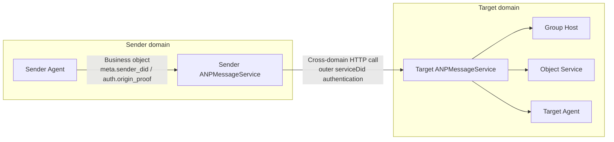
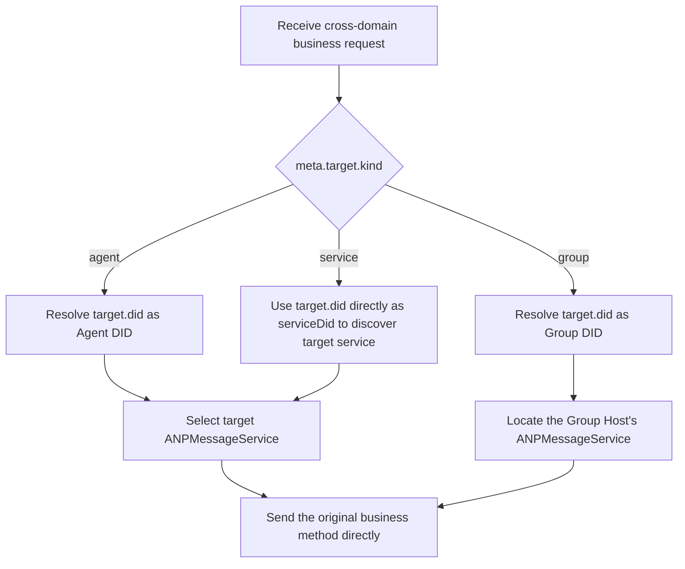
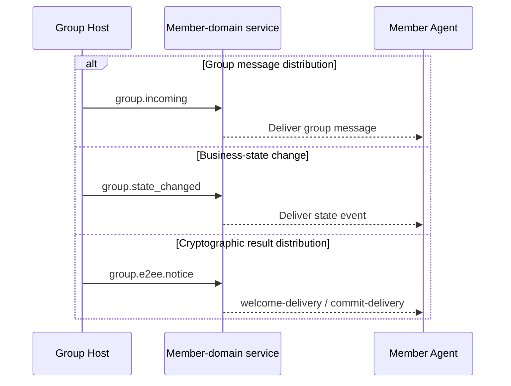
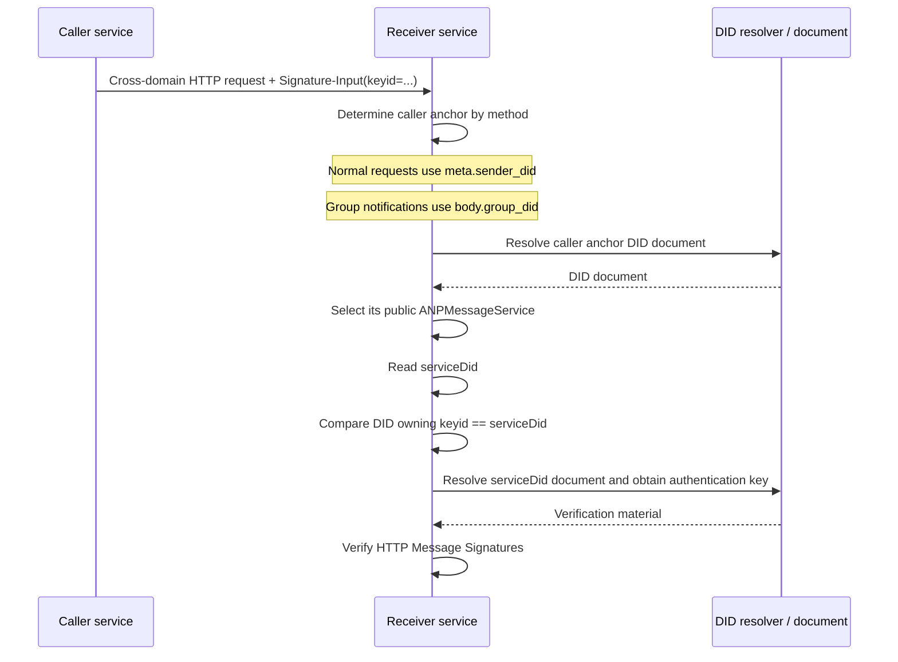
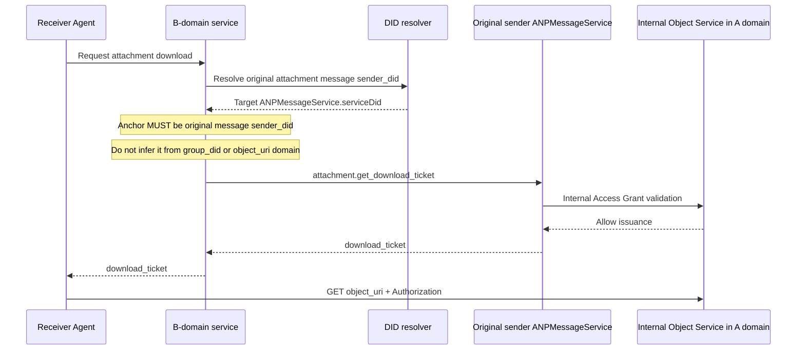

# ANP Profile 8: Federation and Cross-Domain (Final Consolidated Draft)

- Document ID: ANP-P8
- Title: Federation and Cross-Domain
- Status: Draft
- Version: 0.4.0 (Final Consolidated Draft)
- Language: English
- Applicability: This profile applies to ANP cross-domain service discovery, service-to-service invocation, group-event distribution, and cross-domain invocation of the object control plane.

---

## 1. Purpose

This Profile only explains **how to establish connections between different services in cross-domain scenarios, how to call them, and what principles should be followed**.

The focus of this Profile is:

1. How one domain sends requests for remote Agents to the ANP service entrance exposed by the other domain;
2. How a domain sends operations for remote groups to the domain where the group Host is located;
3. How the Group Host distributes ordered group events to the domains in which members are located;
4. How to call object control plane (not object byte stream) across domains;
5. How to implement the cross-domain call of `attachment.get_download_ticket`;
6. Which DID should be used in outer HTTP authentication for cross-domain service calls;
7. Security, idempotence, retries and Success Semantics of cross-domain service calls.

This Profile **does not** repeatedly define the following contents, they are subject to other Profiles:

- `direct.send`, `group.send`, `group.add`, `group.remove` and other business methods themselves;
- E2EE payload structures and cryptographic semantics;
- Attachment object structure, ticket format and object verification rules;
- Service types and the basic discovery rules defined in DID documents;
- Intra-domain routing implementation, history synchronization, read receipts, and presence;
- The internal handling of object bytes by relays, CDNs, or object storage.

---

## 2. Terminology and Normative Conventions

### 2.1 Normative Keywords

In this document, **MUST**, **MUST NOT**, **REQUIRED**, **SHALL**, **SHALL NOT**, **SHOULD**, **SHOULD NOT**, **RECOMMENDED**, **NOT RECOMMENDED**, **MAY**, and **OPTIONAL** are to be interpreted as normative requirements when shown in all capitals.

### 2.2 Terminology

- **Sender domain service**: A service in the sender's domain that accepts local requests and is responsible for initiating cross-domain service calls, usually the external `ANPMessageService` of the domain.
- **Target Domain Service**: The service endpoint exposed by the target DID and responsible for receiving a cross-domain request.
- **Federated Service DID**: The DID used by a domain for cross-domain service-to-service HTTP authentication. It is usually declared in the sender's `ANPMessageService.serviceDid` field and identifies the service that initiates the cross-domain call, rather than the original business sender. For `did:web` and `did:wba`, a bare-domain DID is RECOMMENDED.
- **Group Host Service**: A service that is responsible for ordering and group-state advancement for a given `group_did`.
- **Object Service**: A service responsible for uploading, downloading, ticket issuance and access control of attachment objects.
- **Ordered Group Event**: A group event with `group_event_seq` has been accepted and assigned by the Group Host.
- **Final Acceptance**: A cross-origin operation reaches its final protocol responsibility endpoint and is accepted.

---

## 3. Design Principles

### 3.1 Use Original Methods Directly Across Domains

In a cross-domain scenario, the sender-domain service **SHOULD** use the original business method or control method directly when interacting with the target-domain service, rather than introducing an additional relay-specific JSON-RPC method. Specifically:

- Direct messaging uses `direct.send` across domains;
- Group Base uses `group.create`, `group.get_info`, `group.join`, `group.add`, `group.remove`, `group.leave`, `group.update_profile`, `group.update_policy`, and `group.send` across domains;
- Group E2EE uses `group.e2ee.publish_key_package`, `group.e2ee.get_key_package`, `group.e2ee.create`, `group.e2ee.add`, `group.e2ee.remove`, and `group.e2ee.send` across domains;
- The object control plane uses `attachment.create_slot`, `attachment.commit_object`, `attachment.abort_object`, and `attachment.get_download_ticket` across domains.

### 3.2 Discover the Target Service First, Then Establish the Cross-Domain Call

Before making a cross-domain call, the sender-domain service **MUST** first determine the target service location from the DID document or an equivalent cache result, and then initiate the service-to-service invocation. The DID-document interpretation and service-discovery rules are defined by P2 and are not repeated in this profile.

### 3.3 Group Ordering Is Governed by the Group Host

Operations that change group state or `group_event_seq` for the same `group_did` **MUST** be processed by the corresponding Group Host Service for final linear ordering. Cross-domain calls may send such requests only to the Group Host; they cannot bypass the Group Host and assign `group_event_seq` or `group_state_version` independently.

### 3.4 Object Byte Streams Do Not Use Cross-Domain Service Invocation Links

Object bytes **MUST NOT** pass through ANP's cross-domain service invocation path as a general forwarding channel. Specifically:

- Service-to-service invocation **MUST NOT** forward file bytes, image bytes, or audio/video bytes;
- Object bytes **MUST** be downloaded directly from the Object Service over a separate HTTP(S) channel;
- The cross-domain service layer participates, at most, in the control plane for obtaining the object and does not participate in the data plane for carrying the object bytes themselves.

### 3.5 E2EE Payloads Are Transparent to Intermediate Services

When a cross-domain call carries an `direct-e2ee` or `group-e2ee` business message, the intermediate service or domain gateway MUST treat its payload as opaque bytes or opaque objects; MUST NOT modify it except for outer metadata explicitly required by this Profile for routing, idempotence, or destination verification.

### 3.6 Separation of outer service identity and business subject identity

Outer HTTP authentication across domain service-to-service invocation MUST use the sender domain service's own federated service DID, rather than the `meta.sender_did`, `group_did`, or other application layer principal DID in the original business message.

In other words:

- Outer HTTP authentication answers "Which domain service is calling me";
- `meta.sender_did` and `auth.origin_proof` answer "**Which business entity initiated this action**";
- Two levels of identity can be related, but semantically **MUST NOT** be confused.

P8 does not redefine business protocols. Instead, it explains how existing business objects flow between services across domains. The following overview places business subjects, outer service identities, the Group Host, and the Object Service into one view.

*Figure P8-1: Federation and cross-domain overview (non-normative).*

When reading the subsequent sections, treat this diagram as P8's premise: business objects are carried across domains through existing methods, while outer HTTP authentication only proves which public service entry is performing the current one-hop call.

---

## 4. Profile identification and dependencies

### 4.1 Profile name

The standard name of this Profile is:

`anp.federation.relay.v1`

> Note: For compatibility with existing documents and implementations, this revision retains the original profile name. Its scope, however, is now limited to federation and cross-domain service-invocation principles rather than a standalone relay encapsulation protocol.

### 4.2 Dependencies

This Profile **MUST** depend on the following Profiles:

- `anp.core.binding.v1`
- `anp.identity.discovery.v1`
- `anp.direct.base.v1`
- `anp.group.base.v1`

This Profile **MAY** be used with the following overlays/extensions:

- `anp.direct.e2ee.v1`
- `anp.group.e2ee.v1`
- `anp.attachment.v1`

### 4.3 Security Profile

Cross-Domain service-to-service invocation **MUST** run in `transport-protected` mode.

The `meta.security_profile` **MAY** of the directly sent business request is:

- `transport-protected`
- `direct-e2ee`
- `group-e2ee`

The cross-domain caller **MUST NOT** change `meta.security_profile` in the original business request without authorization.

---

## 5. Cross-Domain Connection Methods

The first task of a cross-domain implementation is not signing, but deciding which target service category the request should reach. The following diagram consolidates routing decisions for the `agent`, `group`, and `service` target modeling modes.

*Figure P8-2: Cross-domain routing decision (non-normative).*

The key point is to "send the original business method directly": P8 discourages wrapping it in an additional relay method. Instead, the sender discovers the final public service first and then sends the original request to the correct business-responsible endpoint.

### 5.1 Agent to Agent

When `meta.target.kind = "agent"`, the sender domain service **MUST**:

1. Parse target `agent_did`;
2. Select target `ANPMessageService` based on DID document or capability negotiation;
3. Send the original `direct.send` directly to the target service.

In other words, when crossing domain direct messaging, the sender domain service acts as the "outbound service caller" instead of defining an additional layer of new relay protocol.

### 5.2 For Group DID

When `meta.target.kind = "group"`, the sender domain service **MUST**:

1. Parse target `group_did`;
2. Determine the `ANPMessageService` corresponding to the Group Host Service from the Group DID document or a cached group-state reference;
3. Send the original group operation request directly to the Group Host Service.

Applicable methods include but are not limited to:

- `group.get_info`
- `group.join`
- `group.add`
- `group.remove`
- `group.leave`
- `group.update_profile`
- `group.update_policy`
- `group.send`
- `group.e2ee.add`
- `group.e2ee.remove`
- `group.e2ee.send`

For `group.join` and `group.add` in the current P4 v1 core, the cross-domain Success Semantics is subject to the business results returned by the Group Host; under the current v1 mainline, success means that the corresponding business member status has been established. If the deployer introduces additional out-of-band credentials, approval flow or other governance intermediate states, it is an expansion path and does not belong to the v1 core Success Semantics of this Profile.

### 5.3 For Object Service

For cross-domain object-control operations, the caller **MUST** use the original object control-plane methods directly when interacting with the target Object Service. Applicable methods include:

- `attachment.create_slot`
- `attachment.commit_object`
- `attachment.abort_object`
- `attachment.get_download_ticket`

For `attachment.get_download_ticket`, the caller **MUST** first discovers its public `ANPMessageService` based on the original attachment message sender's DID, and then initiates a cross-domain call to the service; in the group scenario, the original group message sender's DID is still used instead of `group_did`.

### 5.3.1 Cross-Domain routing of E2EE material methods

When implemented in combination with P5/P6, the following service-scoped getter/material methods MUST be routed directly to the final public `ANPMessageService` when crossing domains, rather than wrapping a layer of the new protocol through a private relay:

- `direct.e2ee.get_prekey_bundle`
  1. Parse `body.target_did`
  2. Find the `ANPMessageService` exposed by the target Agent
  3. Call the service directly

- `group.e2ee.get_key_package`
  1. Parse `body.target_did`
  2. Find the `ANPMessageService` exposed by the target Agent
  3. Call the service directly

These methods do not assume anonymous access in the v1 minimum-interoperability baseline; caller identity, rate limiting, and anti-abuse controls **MUST** be enforced using hop- and service-level authentication.

Cryptographic results such as `welcome` / `ratchet_tree` required for group E2EE onboarding are delivered by `group.e2ee.notice`; v1 does not define independent `group.e2ee.get_join_info` standard cross-domain routing.

### 5.4 Group event distribution

When the Group Host actively distributes ordered group events to member domains, it **SHOULD** use the existing group notification methods directly, or a deployment mechanism with equivalent semantics, rather than defining an independent relay-specific wrapper:

- For group message distribution, **SHOULD** use `group.incoming`;
- For group-state change distribution, **SHOULD** use `group.state_changed`;
- For distribution of cryptographic results to group E2EE, **SHOULD** use `group.e2ee.notice`;
- If the deployer adopts an equivalent mechanism, the mechanism **MUST** retain the original group semantics and carries at least `group_did`, `group_event_seq`, `group_state_version` and the corresponding event payload.

`group.e2ee.notice` can deliver `welcome-delivery` to target Agents that have not yet completed MLS bootstrap, or deliver `commit-delivery` to existing members; this belongs to P6's cryptographic result distribution, rather than P4's group member broadcast. out-of-band Invitation credentials or other non-member governance messages, if present, are deployment extensions and do not constitute a v1 standard cross-domain path.

P8 does not require the Group Host to design a new protocol for group events. Instead, it encourages direct reuse of existing notification methods. The following diagram shows the three paths for message distribution, business-state changes, and cryptographic result delivery side by side so that readers can distinguish their semantic boundaries.

*Figure P8-3: Cross-domain distribution of group events (non-normative).*

If an implementation uses an equivalent mechanism, it should still preserve the semantic separation among these three paths and should not mix business events, group messages, and cryptographic notices into the same notification object.

---

## 6. Service-to-service security requirements

### 6.1 Secure Channel

All service-to-service invocation **MUST** run over a secure channel with mutual authentication or equivalent peer authentication.

### 6.2 Source Identifiability

Each service-to-service invocation **MUST** can be identified by the recipient as the source service. For DID-based deployments, the origin service identity **MUST** be expressed through the `Signature-Input` / `keyid` parameters of the outer HTTP Message Signatures, and the DID to which this `keyid` belongs MUST** be consistent with the sender's `ANPMessageService.serviceDid`.

#### 6.2.1 Selection rules for federated service DIDs

In a cross-origin service-to-service HTTP request:

1. The sender’s `ANPMessageService` entry for cross-domain calls **MUST** declare `serviceDid`;
2. If the sender domain uses `did:web`, then the `serviceDid` **SHOULD** use the bare-domain DID, such as `did:web:alice.com`;
3. If the sender domain uses `did:wba`, then the `serviceDid` **SHOULD** use the bare-domain DID, such as `did:wba:alice.com`;
4. `keyid` **MUST** in `Signature-Input` is a complete DID URL and points to a verification method authorized by the `authentication` relationship in the `serviceDid` document;
5. The receiver **MUST** complete DID parsing, verification method existence check, `authentication` relationship check and HTTP Message Signatures verification according to the corresponding DID method specification.

For example, for `alice.com`, the following DID would be the domain-level federated service DID:

- `did:web:alice.com`
- `did:wba:alice.com`

Among them, `did:wba:alice.com:agents:relay:e1_<fingerprint-a>` is a path-type DID; it can be a common Agent or sub-identity DID, but it SHOULD NOT be used as the domain-level federated service DID specified by this Profile by default.

#### 6.2.2 Verification process based on `serviceDid`

When service A sends a cross-domain request to service B, service B **MUST** first determine the business anchor from which the caller's `serviceDid` is derived (the "caller anchor"), based on the method type, and then perform service-identity verification.

The caller anchor rules are as follows:

- For common cross-domain requests, including:
  - `direct.send`
  - `group.create`
  - `group.get_info`
  - `group.join`
  - `group.add`
  - `group.remove`
  - `group.leave`
  - `group.update_profile`
  - `group.update_policy`
  - `group.send`
  - `direct.e2ee.*`
  - `group.e2ee.publish_key_package`
  - `group.e2ee.get_key_package`
  - `group.e2ee.create`
  - `group.e2ee.add`
  - `group.e2ee.remove`
  - `group.e2ee.send`
  - `attachment.*`

  caller anchor **MUST** take `meta.sender_did`

- For `group.incoming`, `group.state_changed` and `group.e2ee.notice`:

  caller anchor **MUST** take `body.group_did`

Subsequently, the receiver **MUST** verify the identity of the sender's service in the following order:

1. Determine the caller anchor according to the above rules;
2. Parse the DID document of the caller anchor;
3. According to P2’s service selection rules, select the public `ANPMessageService` corresponding to the DID;
4. Read the `serviceDid` declared in the selected service entry;
5. Extract `keyid` from the outer HTTP `Signature-Input` and obtain the DID it belongs to;
6. Verify that the DID to which `keyid` belongs is completely consistent with `serviceDid` in step 4;
7. Parse the DID document corresponding to the `serviceDid`;
8. Verify the outer HTTP request signature using the public key authorized by the `authentication` relationship in the `serviceDid` document.

If the `ANPMessageService` selected in step 3 does not declare `serviceDid`, or the comparison in step 6 is inconsistent, the receiver **MUST** treat the cross-domain service identity authentication as failed.

The receiver **MUST NOT** always derive the caller's `serviceDid` from `meta.sender_did`; for group notifications, doing so would incorrectly treat the original business sender as the current cross-domain caller.

Determining the caller anchor by method type is one of the easiest parts of P8 to implement incorrectly. The following sequence diagram makes the verification order among the caller anchor, `ANPMessageService.serviceDid`, and the outer HTTP `keyid` explicit.

*Figure P8-4: caller anchor and `serviceDid` verification (non-normative).*

The receiver should not always derive the caller `serviceDid` from `meta.sender_did`. For group notifications such as `group.incoming`, `group.state_changed`, and `group.e2ee.notice`, the business anchor should switch to `body.group_did`.

#### 6.2.3 Usage Conventions for Bare-Domain DIDs

If a domain uses `did:wba` for cross-domain service identity authentication, the deployer **SHOULD** use its bare-domain DID as the domain-level federated service DID, and **SHOULD NOT** use a normal Agent DID, Group DID, or other path-type DID to replace the domain-level identity.

The implementer **MAY** maintain multiple verification methods that can be used for `authentication` in the same bare-domain DID document to support different service instances, different key generations or smooth rotation; the specific selection of which verification method to participate in a certain service-to-service authentication is determined by the deployment strategy.

### 6.3 Keep original business objects

When service-to-service invocation is applied, the `method`, `params.meta`, and `params.body` of the original service request **SHOULD** remain equivalent to those received by the target domain service. If an implementation must re-encode JSON for serialization or gateway conversion, object semantics **MUST** remain unchanged.

### 6.4 Preserve the Origin Proof

If the original business request carries `auth.origin_proof`, the cross-domain sender **MUST** keep the proof object unchanged and send it with the request. The target domain service **MUST** independently verify this proof as required by each business profile.

The outer HTTP authentication for the federated service DID **MUST NOT** replace this origin proof; the sending domain service also **MUST NOT** rewrite `auth.origin_proof` to its own federated service DID.

For `attachment.*` Control-Plane Methods under the current P7 v1 mainline, the terminal service `auth.origin_proof` usually does not exist; the outer `serviceDid` hop authentication **MUST NOT** be mistaken for the service origin proof.

### 6.5 Minimum visibility of outer layer

For business requests sent across domains, fields visible to the intermediate service and allowed for routing/idempotence are limited to:

- `meta.profile`
- `meta.security_profile`
- `meta.sender_did`
- `meta.target`
- `meta.operation_id`
- `meta.message_id` (if present)
- `meta.content_type`

Any other fields, especially E2EE-protected business content, that the intermediary service **MUST NOT** rely on, modify, or rewrite without authorization.

### 6.6 Disable silent downgrade

Either party in the cross-origin call link **MUST NOT** silently downgrade the original request from a higher security profile to a lower security profile without explicit negotiation.

---

## 7. Idempotence and retry

### 7.1 Business Idempotence First

Cross-domain service calls **MUST** reuse the idempotence semantics defined for the original business method. Specifically:

- `direct.send` continues to use its original `sender_did + target.did + method + operation_id` rules;
- `group.*` continues to use the idempotence and deduplication rules defined by the group methods respectively;
- `attachment.*` continues to use the idempotence and deduplication rules respectively defined by object Control-Plane Methods.

### 7.2 Retry requirements

When a network failure, timeout, or indeterminate result occurs, the sending domain service **MAY** retry; but when it retries:

- **MUST** leave the original `operation_id` unchanged;
- If message semantics exist, **MUST** keep the original `message_id` unchanged;
- If called for object control, **SHOULD** keep the original `attachment_id` and related context unchanged;
- The business payload **MUST** remain semantically equivalent.

### 7.3 Implementation-Internal Tracking Fields

The deployer **MAY** maintain fields such as trace IDs, attempt numbers, and route hints within the implementation, but these fields are not part of the standard cross-domain request object defined by this profile. They **MUST NOT** replace the idempotency keys of the original business profile.

### 7.4 Idempotent response

If the receiver identifies an original business request that has been successfully processed, **SHOULD** return a response equivalent to the first successful processing, rather than repeating the business request.

---

## 8. Cross-Domain Success Semantics

### 8.1 `direct.send`

For cross-domain `direct.send`:

- When the final target domain service accepts the message, the sender domain service **MAY** return success to the local caller;
- How to process, queue, and route subsequent target Agents within the domain does not fall within the scope of Success Semantics of this Profile.

### 8.2 P4 Group Control Operation

For P4 control operations such as `group.join`, `group.add`, `group.remove`, `group.update_profile`, `group.update_policy`:

- When the final Group Host Service accepts ordering, the sender domain service **MAY** return success to the local caller;
- For the current P4 v1 core, the success of `group.join`/`group.add` means that the corresponding business member status has been established;
- Member domain synchronization and cryptographic implementation with P6 are subsequent asynchronous stages.

### 8.3 P6 Cryptographic Control Operations

For `group.e2ee.create`, `group.e2ee.add`, `group.e2ee.remove`:

- When the final Group Host Service accepts the cryptographic control action and returns a successful result, the sender domain service **MAY** return success to the local caller;
- This success indicates that the relevant MLS control results have been accepted by the target Host and anchored with the existing business state;
- It **MUST NOT** be interpreted as creating a new P4 business member state separately.

### 8.4 `group.send`

For cross-domain `group.send`:

- When the Group Host Service accepts and assigns `group_event_seq` to it, the cross-domain can be considered successful;
- When the member domain receives the event is determined by the subsequent event distribution mechanism.

### 8.5 `group.e2ee.send`

For cross-domain `group.e2ee.send`:

- When the Group Host Service accepts and ordering the MLS ciphertext object and returns the corresponding `group_event_seq`, `group_state_version`, and `group_receipt`, the cross-domain can be considered successful;
- This success means that the Host has accepted and ordering a group E2EE ciphertext;
- When each member receives it and whether it can be successfully decrypted depends on subsequent distribution and local MLS status, it does not belong to cross-domain Success Semantics.

### 8.6 `attachment.get_download_ticket`

For cross-domain `attachment.get_download_ticket`:

- When the final Object Service returns successful ticket or explicitly rejects it, it can be regarded as cross-domain success;
- Return ticket **Not equal to** Download successful;
- Object download and digest verification are still subsequent independent HTTPS data plane steps.

## 9. Cross-Domain Considerations for Attachments and Download Tickets

### 9.1 Final processing endpoint

The protocol-level final destination of `attachment.get_download_ticket` MUST be `ANPMessageService` as exposed by the original attachment message sender DID. This public service entry can be internally rerouted to the Object Service that actually handles the object control logic, but this is an implementation detail.

Therefore, the "final processing endpoint" in standard interoperability semantics is:

- Protocol level: public `ANPMessageService` corresponding to the original attachment message sender DID
- Implementation level: the internal Object Service behind the service (optional)

In a group scenario, the caller **MUST** use the DID of the original group-message sender as the discovery anchor, rather than `group_did`. The caller **MUST NOT** guess the control-plane service solely from the URL domain name of `object_uri`.

### 9.2 Who initiates the ticket request?

v1 standard interworking path **MUST** take "domain service proxy mode" as the main line:

#### Mode A: Domain service proxy mode (v1 standard path)

The requesting agent submits `attachment.get_download_ticket` to the local `ANPMessageService` or equivalent domain service, which serves as an outbound proxy to initiate cross-domain requests.

This mode is suitable for:

- Need to unify domain-level auditing;
- Requires unified service-to-service identity authentication;
- The Agent itself does not directly handle all cross-domain service call details.

In this mode, the local domain service **MUST** resolve the original attachment message's public `ANPMessageService` based on its sender DID and sends `attachment.get_download_ticket` to the service.

#### Mode B: Agent direct mode (deployment extension)

The requesting agent directly parses the original attachment message sender DID and calls its public `ANPMessageService`.

This mode **is not part of v1 MTI**; if enabled by deployment, you must resolve it yourself:

- How the Agent obtains and verifies the target `serviceDid` based on the original attachment message sender DID
- How the client performs outer service authentication
- How the client handles rate limiting, retrying and auditing strategies in a unified manner

The cross-domain endpoint for attachment download tickets is easily misidentified as the domain of `object_uri`, or as `group_did`. The following diagram shows the standard path and emphasizes that the control-plane discovery anchor must be the original sender DID of the attachment message.

*Figure P8-5: Cross-domain `attachment.get_download_ticket` flow (non-normative).*

This diagram also illustrates the boundary between protocol and implementation: the externally interoperable protocol endpoint is the public `ANPMessageService`; whether it internally routes to a separate Object Service is an implementation detail.

### 9.3 Download action

After getting ticket, the requester **MUST** use an independent HTTPS channel to initiate a download to the Object Service:

- ticket **SHOULD** be placed in the `Authorization` header or specifies a custom header;
- ticket **SHOULD NOT** placed in URL query parameters;
- After the download succeeds, the requester **MUST** follow P7 to verify the object digest;
- If the object uses `object-e2ee`, object-level decryption and post-decryption verification are also **MUST** performed.

When the Object control service issues ticket, under the standard path **MUST** make authorization judgment based on the following two levels of context:

1. The outer caller `serviceDid` has passed HTTP Message Signatures verification;
2. The contexts such as `requester_did`, `security_profile`, `target_did` / `group_did`, and `message_id` in the request body satisfy the object service policy.

By default, the Object control service does not require** to directly verify the independent business proof of the end user.

## 10. Minimum Interoperability Requirements

An implementation conforming to this Profile MUST support at least:

1. Perform service discovery on `agent_did` and `group_did`;
2. Directly use the original business method to interact with the target service when crossing domains;
3. Keep the original `security_profile`, `operation_id` and related origin proof unchanged;
4. Send all operations that change group state or `group_event_seq` to the final Group Host Service;
5. Support direct routing of `group.join`, `group.add`, `group.remove`, `group.leave`, `group.update_profile`, `group.update_policy` and `group.send` to the final Group Host Service;
6. When used in combination with P6, support the correct cross-domain landing points of `group.e2ee.create`, `group.e2ee.add`, `group.e2ee.remove`, and `group.e2ee.send`;
7. When used in combination with P5/P6, support cross-domain routing of `direct.e2ee.get_prekey_bundle` and `group.e2ee.get_key_package`;
8. Send `attachment.get_download_ticket` to `ANPMessageService` disclosed by the DID of the original attachment message sender;
9. Explicitly prohibit routine forwarding of object bytes through cross-domain service invocation paths;
10. Support at least one mechanism for distributing ordering group events to member domains; when used in combination with P6, **MUST** support cross-domain distribution of `group.e2ee.notice`;
11. Declare `serviceDid` for `ANPMessageService` participating in cross-domain calls, and verify the outer HTTP Message Signatures according to the method-level caller anchor;
12. For `did:wba` deployment, support using bare-domain DID as domain-level federation service DID.

## 11. Reference Implementation Notes (Non-Normative)

When implementing this Profile, the implementer should regard it as:

- Supplementary federation principles for Profiles 1 through 7 in cross-domain scenarios;
- Constraint layer for direct service-to-service calls;
- Selection rules for service-to-service outer DID authentication;
- Group Host ordering and the principle description of asynchronous distribution of group events;
- Cross-domain placement rules for the object control plane and the associated download-responsibility boundaries.

In other words, this profile specifies **how to connect, how to send, and how to determine success** across domains, rather than redefining a separate set of business protocols.
